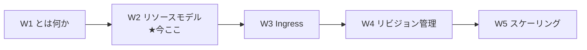
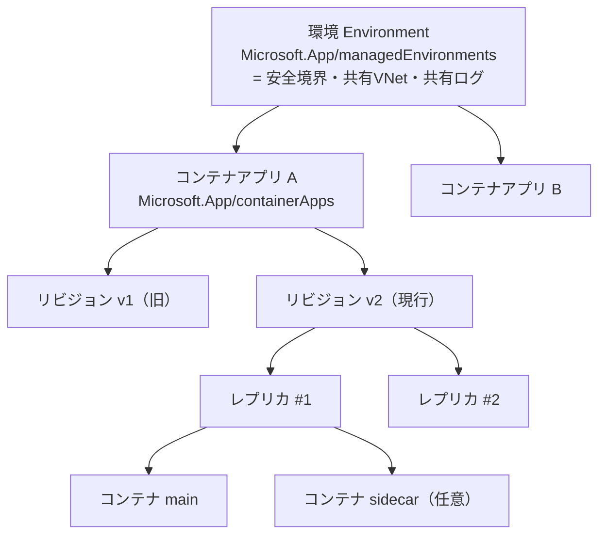
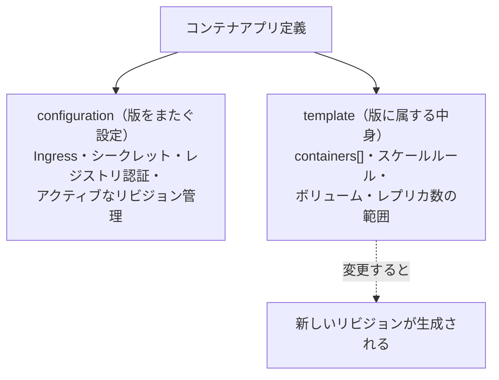
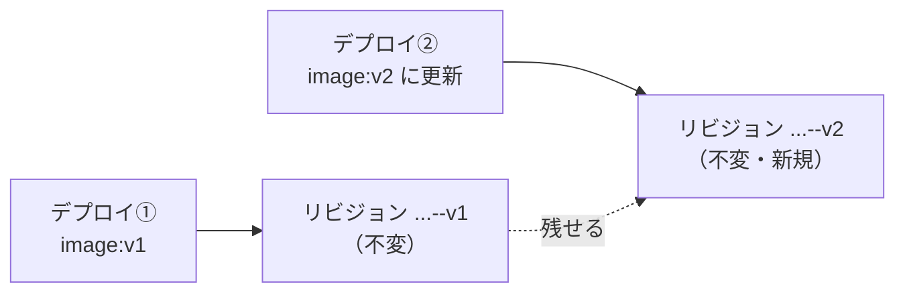

# Week 2 — リソースモデル：環境・コンテナアプリ・リビジョン・レプリカ・コンテナの多段構造

> **Phase 1a** | 学習プラン Week 2 / 10
> 学習目標：ACA のリソース階層 **環境（Environment）→ コンテナアプリ（Container App）→ リビジョン（Revision）→ レプリカ（Replica）→ コンテナ（Container）** を、それぞれ「何を表す層か」「なぜ分かれているか」まで言えるようにする。とくに **なぜ"アプリ"と"リビジョン"を分けるのか**（＝版管理・トラフィック分割・ゼロスケールの土台）を掴む。アプリ定義の 2 大セクション **`template`（版に属する中身）** と **`configuration`（版をまたぐ設定）** の違い、`containers` 配列（サイドカー/init）、vCPU/メモリの割当ルールも押さえる。ハンズオンでは W1 のクイックスタートではなく、**自分で指定した公開イメージ**でアプリを作り、リビジョンとレプリカを目視する。

---

## 0. 今週の位置づけ



W1 では ACA を「Kubernetes を隠したサーバーレスコンテナ基盤」として俯瞰した。W2 では、その中の**リソースがどう積み重なっているか**を解剖する。この階層は W3（Ingress）・W4（リビジョン/トラフィック分割）・W5（レプリカ数のスケール）すべての土台になるので、ここで用語と関係を固める。

> **初学者向け用語補足：この階層を一言でたとえる**
> - **環境**＝ マンションの**建物**（共有の配管＝仮想ネットワーク、共有の管理室＝ログ集約先）。
> - **コンテナアプリ**＝ その建物の中の**1 部屋（1 つのサービス）**。名前・URL・設定を持つ"論理的な存在"。
> - **リビジョン**＝ その部屋の**内装の版（バージョン）**。模様替えするたびに新しい版が生まれる。古い版を残して並べられる。
> - **レプリカ**＝ その版を**実際に何個複製して動かすか**の 1 個。混んだら増やし、暇なら減らす（0 個も可）。
> - **コンテナ**＝ 1 レプリカの中で走る**実際のプロセスの箱**（通常 1 個、必要なら相棒＝サイドカーを追加）。

---

## 1. 全体像：5 層のリソース階層



| 層 | Azure リソース型 | 何を表すか | 増減・複数性 |
| --- | --- | --- | --- |
| **環境** | `Microsoft.App/managedEnvironments` | アプリ群を囲う安全境界。VNet とログ集約先を共有 | サブスクに複数持てる |
| **コンテナアプリ** | `Microsoft.App/containerApps` | 1 つのサービスの論理単位（名前・URL・設定の持ち主） | 1 環境に複数 |
| **リビジョン** | （アプリの子。`revisions` で参照） | アプリ定義の**不変なスナップショット（版）** | 単一 or 複数モード（W4） |
| **レプリカ** | （実行時の実体） | リビジョンを実際に動かす**複製の 1 個** | 0〜N（KEDA でスケール、W5） |
| **コンテナ** | （レプリカ内のプロセス） | 実際に走るコンテナ | 通常 1、＋サイドカー/init |

> **初学者向け用語補足：リソース型 `Microsoft.App/...` とは**
> Azure の全リソースは `プロバイダー名/型名` という**型（type）**を持つ。ACA は **`Microsoft.App`** プロバイダー配下で、環境が `managedEnvironments`、アプリが `containerApps`。W10 の Bicep でこの型名をそのまま書く。W1 で「Relay は `Microsoft.Relay/namespaces`」と同じ命名規則。（余談：ACA は昔 `Microsoft.Web/containerApps` だったが現在は `Microsoft.App` に整理されている。）

---

## 2. 環境（Environment）：アプリを囲う"建物"

公式の定義：

> Container Apps 環境は、**1 つ以上のコンテナアプリとジョブを囲う安全境界**である。Container Apps ランタイムが各環境を管理し、**OS アップグレード・スケール操作・フェイルオーバー・リソースバランシング**を引き受ける。
> （出典：[Azure Container Apps environments](https://learn.microsoft.com/en-us/azure/container-apps/environment)）

環境の要点は 3 つ。

- **仮想ネットワーク（VNet）を 1 つ持つ**：これが安全境界の実体。作成時に自動生成されるか、既存 VNet を渡せる（W9）。
- **同じ環境のアプリは VNet とログ集約先を共有する**：公式いわく「複数のコンテナアプリが同じ環境にあるとき、**同じ仮想ネットワークを共有し、同じログ出力先にログを書き込む**」。
- **OS/スケール/フェイルオーバーはランタイムが面倒を見る**：ここが"サーバーレス"の実体。

> **初学者向け用語補足：フェイルオーバー／リソースバランシング**
> - **フェイルオーバー（failover）**＝ 動いているものが壊れたとき、**自動で予備に切り替えて動かし続ける**こと。fail（失敗）+ over（切り替え）。
> - **リソースバランシング（resource balancing）**＝ 複数アプリ・レプリカを、空いている計算資源に**うまく割り振る**こと。

### 環境の 2 タイプ（既定 vs レガシー）

| タイプ | 説明 | 対応プラン |
| --- | --- | --- |
| **Workload profiles（ワークロードプロファイル）環境**（**既定**） | ゼロスケール可の Consumption に加え、専用ハードの Dedicated も同居できる | Consumption ＋ Dedicated |
| **Consumption only（消費のみ）環境**（レガシー） | ゼロスケール可の Consumption のみ。**環境自体には課金なし**（アプリの使用量のみ） | Consumption のみ |

> **初学者向け用語補足：Consumption プランと Dedicated プラン**
> - **Consumption（コンサンプション＝消費）プラン**＝ 使った vCPU・メモリの**時間分だけ課金**、暇なら**0 個まで縮小**できる従量課金。サーバーレスの本命。※Consumption only 環境のアプリは **最大 2 コア／4Gi** に制限。
> - **Dedicated（デディケイテッド＝専用）プラン**＝ **専用のハードウェア**を確保し、価格の予測性や大きなイメージ・GPU 等が要る場合向け。環境全体に固定の管理費がかかる。
> - 本教材は**サーバーレスの主眼＝Consumption** を中心に扱う。

### 1 環境にまとめる？分ける？

公式のガイドライン（要約）：

- **単一環境にまとめたい**：関連サービスをまとめて管理／同じ VNet に配置／**Dapr のサービス呼び出しで通信**させたい／Dapr 設定・ログ出力先を共有したい（→ Dapr は W6）。
- **複数環境に分けたい**：計算資源を**決して共有させたくない**／組み込み Dapr で通信させたくない／**チームや用途（テスト vs 本番）で隔離**したい。

> **用語補足：環境は放置すると消える（90 日ポリシー）**
> 公式は「環境が **90 日以上アイドル（アプリ/ジョブが 1 つも動いていない）**、または VNet/Azure Policy の設定不備で失敗状態が続くと、**自動削除**される」と述べる。学習で放置した環境が消えても仕様。防ぐには最低 1 つアプリ/ジョブを動かしておく。

---

## 3. コンテナアプリ（Container App）：1 つのサービスの"論理的な入れ物"

コンテナアプリは、**名前・Ingress の URL・スケール設定・シークレット**などを持つ「サービスの論理単位」である。重要なのは、**アプリ定義が 2 つの性格のセクションに分かれている**こと。



| セクション | 中身（例） | 変更したときの挙動 |
| --- | --- | --- |
| **`configuration`** | Ingress、シークレット、レジストリ認証、どのリビジョンをアクティブにするか等 | **その場で反映**（新リビジョンは作られない） |
| **`template`** | `containers`（イメージ・環境変数・リソース・プローブ）、スケールルール、ボリューム | **変更＝新しいリビジョンが生まれる** |

公式の一文：

> アプリは `template` 設定セクションでコンテナイメージやその他の設定を定義する。**`template` セクションへの変更は、新しいコンテナアプリのリビジョンをトリガーする。**
> （出典：[Containers in Azure Container Apps](https://learn.microsoft.com/en-us/azure/container-apps/containers)）

> **なぜこの二分が効くのか**：「中身（`template`）を変える＝新しい版を作る／版をまたぐ運用設定（`configuration`）はその場で変える」と分けることで、**新旧の版を並べて置き、トラフィックを配分し、問題があれば戻す**（W4）ことが自然にできる。シークレットや Ingress のような"版に依存しない設定"を版ごとに複製せずに済む。

---

## 4. リビジョン（Revision）：アプリ定義の"不変なスナップショット"

**リビジョン＝ある時点のアプリ定義（主に `template`）を固めた、変更不能な版**である。`template` を書き換えるたびに新しいリビジョンが生まれ、古いリビジョンは（複数リビジョンモードなら）残せる。



- リビジョンは**イミュータブル（immutable＝不変）**。作られた後は中身が変わらない。修正は"新しいリビジョンを作る"ことで行う。
- 何を「アクティブ」にし、どのリビジョンに**トラフィックを何%流すか**は W4 の主題。今週は「版が積み上がる」ことを掴めば十分。

> **初学者向け用語補足：イミュータブル（immutable）とスナップショット**
> - **イミュータブル**＝ 一度作ったら**中身を書き換えない**性質（immutable＝不変。反対は mutable＝可変）。版を後から書き換えないので「あの版に戻す」が安全にできる。
> - **スナップショット（snapshot）**＝ ある瞬間の状態をそのまま写し取ったもの（snapshot＝写真）。リビジョンは「その時のアプリ定義の写真」。

> **用語補足：イメージタグに `latest` を使うなの理由**
> 公式は「`latest` のような**静的タグを避け**、Git ハッシュや日時など**デプロイごとに一意なタグ**を使え。静的タグはキャッシュ問題を招き、トラブルシュートを難しくする」と明記。リビジョンが版を固定できても、`latest` だと"同じタグで中身が変わる"ため、どの版が何だったか追えなくなる。（出典：[Containers](https://learn.microsoft.com/en-us/azure/container-apps/containers)）

---

## 5. レプリカ（Replica）とコンテナ（Container）：実際に走る実体

- **レプリカ**＝ アクティブなリビジョンを**実際に何個複製して走らせるか**の 1 個。負荷に応じて 0〜N に増減する（KEDA、W5）。1 レプリカ＝1 セットのコンテナ。
- **コンテナ**＝ レプリカの中で走る実プロセス。**多くのアプリはコンテナ 1 個**。高度なケースでのみ複数（サイドカー／init）。

### 複数コンテナ：サイドカーと init

公式の指針：

> ほとんどのコンテナアプリはコンテナを 1 つ持つ。高度なシナリオでは、アプリはサイドカーや init コンテナも持てる。（略）**マイクロサービスのほとんどのケースでは、各サービスを別々のコンテナアプリとしてデプロイするのがベストプラクティス**である。
> （出典：[Containers in Azure Container Apps](https://learn.microsoft.com/en-us/azure/container-apps/containers)）

| 種類 | 配列 | 役割 | 例 |
| --- | --- | --- | --- |
| **メイン＋サイドカー** | `template.containers[]` に複数 | 本体の"横"で補助機能を常時実行。ディスク・ネットワークを共有 | 共有ボリュームのログを読んで転送するエージェント／キャッシュ更新の常駐処理 |
| **init コンテナ** | `template.initContainers[]` | 本体の**前に一度だけ**走り、完了してから本体が起動 | データのダウンロード・環境の準備。定義順に実行し全て成功が必要 |

> **初学者向け用語補足：サイドカー／init コンテナ**
> - **サイドカー（sidecar）**＝ 本体コンテナに寄り添って**同じレプリカ内で常時一緒に動く**相棒コンテナ。同じディスク・ネットワークを共有し、ライフサイクルも共通。Dapr（W6）はこの仕組みで注入される。
> - **init（イニット＝初期化）コンテナ**＝ 本体より**前に一度だけ走る使い捨て**のコンテナ。準備が済んだら退場し、本体が起動する。
> - 「密結合な時だけ同居、基本は 1 アプリ 1 サービス」が原則。

### vCPU／メモリの割当ルール（Consumption プラン）

Consumption プランでは、**1 アプリ内の全コンテナの CPU・メモリ合計**が、次の**決められた組み合わせ**のいずれかに一致する必要がある（抜粋）。

| vCPU（コア） | メモリ |
| --- | --- |
| `0.25` | `0.5Gi` |
| `0.5` | `1.0Gi` |
| `1.0` | `2.0Gi` |
| `2.0` | `4.0Gi` |
| …（0.25 刻みで） | … |
| `4.0` | `8.0Gi` |

> **初学者向け用語補足：vCPU／Gi**
> - **vCPU** = virtual CPU（virtual＝仮想の）＝ 割り当てられる**仮想 CPU コア数**。`0.5` なら半コア分。
> - **Gi** = ギビバイト（gibibyte）＝ 2 の 30 乗バイト（≈1.07GB）。メモリ容量の単位。**CPU:メモリ＝1:2（Gi）**の比で組み合わせが決まっている点に注目（例 `0.5`→`1.0Gi`）。
> - **Consumption only 環境の上限**：公式注記で**最大 2 コア／4Gi**。Workload profiles 環境ならより大きく取れる（W9）。

---

## 6. ログ：既定で Log Analytics に集約される

公式いわく、既定で**環境内の全アプリが共通の Log Analytics ワークスペースにログを送る**。含まれるもの：

- コンテナの **`stdout`/`stderr`**（標準出力／標準エラー＝アプリのログ出力）
- **スケールイベント**（レプリカが増減した記録）
- **Dapr サイドカーのログ**（Dapr 有効時）
- システムレベルのメトリクス／イベント

> **初学者向け用語補足：Log Analytics / stdout / stderr**
> - **Log Analytics**（ログ・アナリティクス）＝ Azure Monitor の一部で、ログを溜めて **KQL（Kusto Query Language）** というクエリ言語で検索・分析する基盤。W9 で実際に叩く。
> - **stdout / stderr** = standard output / standard error（標準出力／標準エラー）＝ プログラムがログを吐く 2 本の既定の出口。コンテナ運用ではここに出力しておけば基盤が拾ってくれる（ファイルに書くのではなく標準出力に出すのがコンテナの作法）。

---

## 7. ハンズオン — 自前指定の公開イメージでアプリを 1 つ作り、リビジョン/レプリカを見る

W1 ではクイックスタートの hello イメージだった。今週は**イメージを自分で指定**してデプロイし、リビジョンとレプリカを目視する。イメージは Microsoft 公開のサンプル（ビルド不要で誰でも引ける）を使う。

> **使うイメージ**：`mcr.microsoft.com/k8se/quickstart:latest`（Microsoft Container Registry 公開の Hello World。ポート 80 で待受）。※実運用では前述どおり `latest` は避けるが、学習の読み取り用に既存タグを使う。

### 手順 A：CLI で環境＋アプリを作る（W1 の環境を流用可）

```bash
# 変数（自分の値に置換）
RG=aca-learn-rg
ENV=aca-learn-env
LOC=japaneast

# 環境（W1 で作っていれば再利用でよい。無ければ作成）
az containerapp env create -n $ENV -g $RG -l $LOC

# 自前指定イメージでアプリを作成（外部Ingress・ポート80）
az containerapp create \
  -n hello-w2 -g $RG --environment $ENV \
  --image mcr.microsoft.com/k8se/quickstart:latest \
  --target-port 80 --ingress external \
  --cpu 0.5 --memory 1.0Gi \
  --min-replicas 1 --max-replicas 3 \
  --query properties.configuration.ingress.fqdn -o tsv
```

> **コマンドの読み方**：
> - `containerapp env create`＝環境を作る、`-n`=name（名前）、`-g`=resource group（リソースグループ）、`-l`=location（リージョン）。
> - `containerapp create`＝アプリを作る、`--environment`=載せる環境、`--image`=使うコンテナイメージ、`--target-port`=コンテナが待ち受けるポート（W3）、`--ingress external`=外部公開（W3）、`--cpu`/`--memory`=§5 の割当（0.5/1.0Gi の組）、`--min-replicas`/`--max-replicas`=レプリカ数の下限/上限（W5）。
> - `--query ...fqdn -o tsv`=作成結果から**公開 URL（FQDN=Fully Qualified Domain Name＝完全修飾ドメイン名）**だけを取り出してタブ区切りで表示。表示された `https://<fqdn>` にアクセスすると Hello 画面が出る。

### 手順 B：リビジョンとレプリカを見る

```bash
# リビジョン一覧（今は1つ）
az containerapp revision list -n hello-w2 -g $RG -o table

# template を変えて2つ目のリビジョンを作る（環境変数を追加）
az containerapp update -n hello-w2 -g $RG \
  --set-env-vars GREETING=hello-from-w2

# もう一度リビジョン一覧（2つに増えているのを確認）
az containerapp revision list -n hello-w2 -g $RG -o table
```

> **読み方**：`revision list`=リビジョン一覧、`update --set-env-vars KEY=VALUE`=環境変数を足す（＝`template` の変更なので**新リビジョンが生まれる**）。2 回目の一覧で行が 2 つになり、**`template` 変更が新リビジョンを生む**（§3-4）ことを目で確認できる。

### 手順 C：ポータルでも眺める（任意）

1. アプリ `hello-w2` を開き、**「Revision management（リビジョン管理）」** で 2 つのリビジョンを確認。
2. **「Console」/「Log stream」** でコンテナの `stdout` が流れることを確認（§6）。
3. **「Scale」** で min/max レプリカ設定を確認（詳細は W5）。

### 後片付け

```bash
az group delete --name $RG --yes --no-wait
```

> **W3 で同じアプリの Ingress を触るので、続けるなら削除は W3 の後でもよい。**

---

## 8. 自己チェック

1. ACA の 5 層（環境／アプリ／リビジョン／レプリカ／コンテナ）を、上から順に「何を表す層か」で説明できるか。
2. **環境**が共有するもの 2 つ（VNet・ログ集約先）を言えるか。単一環境にまとめる理由／分ける理由を 1 つずつ挙げられるか。
3. アプリ定義の **`template` と `configuration`** の違いは何か。**どちらを変えると新リビジョンが生まれる**か。
4. **リビジョンがイミュータブル**とはどういう意味か。なぜイメージタグに `latest` を避けるのか。
5. **レプリカ**と**コンテナ**の違いは何か。1 アプリに複数コンテナを置く 2 つの方法（サイドカー／init）と、その使いどころを言えるか。
6. Consumption プランの vCPU/メモリは、なぜ任意の値ではなく**決まった組み合わせ**なのか。CPU:メモリの比はいくつか。
7. コンテナのログはどこ（どの標準ストリーム）に出し、既定でどこ（どのサービス）に集約されるか。

---

## 9. 次週予告（W3：Ingress＝Envoy による外部/内部公開）

W3 では、手順 A で何気なく付けた `--ingress external` と `--target-port` の正体に踏み込む。ACA の入口は **Envoy**（W1 で登場したプロキシ）で構成され、**外部 Ingress（インターネット公開）と内部 Ingress（環境内だけ）**、**ターゲットポート**、**HTTP と TCP**、**TLS 終端**、そして環境内アプリ同士が名前で呼び合う**サービスディスカバリ**の基礎を扱う。これが W4 の「複数リビジョンにトラフィックを配分する（Blue/Green）」の前提になる。

---

### 参考（出典）
- [Containers in Azure Container Apps（コンテナ/リソース設定）](https://learn.microsoft.com/en-us/azure/container-apps/containers)
- [Azure Container Apps environments（環境）](https://learn.microsoft.com/en-us/azure/container-apps/environment)
- [Application lifecycle management（リビジョンのライフサイクル）](https://learn.microsoft.com/en-us/azure/container-apps/application-lifecycle-management)
- [Container Apps ARM/Bicep API spec](https://learn.microsoft.com/en-us/azure/container-apps/azure-resource-manager-api-spec)
