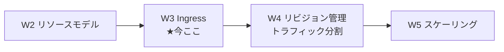
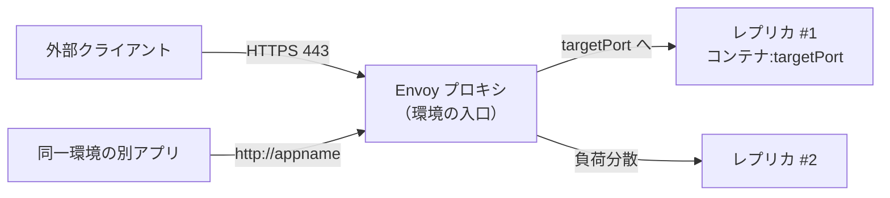
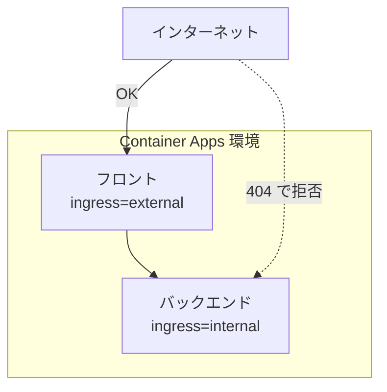
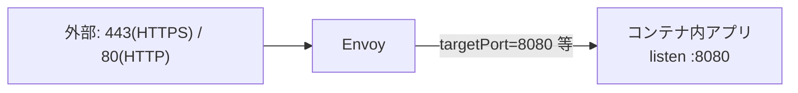
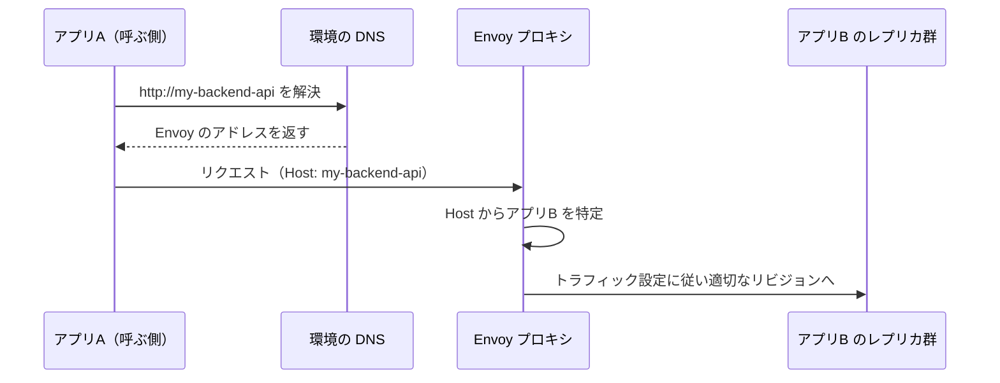

# Week 3 — Ingress：Envoy が担う外部/内部公開・ポート・TLS 終端・サービスディスカバリ

> **Phase 1a** | 学習プラン Week 3 / 10
> 学習目標：ACA の"入口"である **Ingress（イングレス）** を、それを実装する **Envoy プロキシ** とともに理解する。**外部（external）と内部（internal）** の使い分け、**ターゲットポート（targetPort）** と公開ポート、**トランスポート（auto/HTTP/2/TCP）**、**TLS 終端と HTTPS 自動リダイレクト**、そして環境内アプリが**アプリ名だけで呼び合えるサービスディスカバリ**を掴む。W2 のハンズオンで何気なく付けた `--ingress external` と `--target-port` の正体がここで分かる。これが W4「複数リビジョンへのトラフィック配分」の前提になる。

---

## 0. 今週の位置づけ



W1 で「入口は Envoy」、W2 で「アプリは `configuration` に Ingress 設定を持つ」と触れた。W3 はその Ingress を正面から扱う。ポイントは、公式いわく **Ingress を有効にするだけで、ロードバランサ・パブリック IP・その他の Azure リソースを自分で作らずに済む**ことである。

> Ingress を有効にすると、**Azure ロードバランサ・パブリック IP アドレス・その他の Azure リソースを作成する必要なく**、受信 HTTP リクエストや TCP トラフィックを扱える。
> （出典：[Ingress in Azure Container Apps](https://learn.microsoft.com/en-us/azure/container-apps/ingress-overview)）

> **初学者向け用語補足：Ingress とは（ingress の語源）**
> **Ingress**（イングレス）＝「入ってくること・入口」（in＝中へ + gress＝進む。反対は egress＝出口）。ネットワークの文脈で「**外/他アプリからの受信トラフィックを、どう受けて中のコンテナへ渡すか**」の設定一式を指す。Kubernetes でも同名の概念があり、ACA はそれをマネージドに提供する。実装は **Envoy**（W1 で登場したプロキシ）。

---

## 1. Ingress が提供するもの（一覧）

公式が挙げる Ingress のサポート機能：

- **外部（External）と内部（Internal）** の 2 種
- **HTTP と TCP** の 2 プロトコル
- **ドメイン名**（既定 FQDN／カスタムドメイン）
- **IP 制限**
- **認証**
- **リビジョン間のトラフィック分割**（W4）
- **セッションアフィニティ（sticky sessions）**

これらを、Envoy が入口で一手に引き受ける。図にすると次のとおり。



> **初学者向け用語補足：プロキシ／ロードバランサ**
> - **プロキシ（proxy）**＝「代理」。クライアントとサーバの**間に立って通信を取り次ぐ**中継役。Envoy は受信を代理受けし、適切なレプリカへ渡す。
> - **ロードバランサ（load balancer）**＝ 複数のレプリカに**負荷（load）を均等に振り分ける（balance）**装置。ACA では Envoy がこれも兼ねる（＝自分で作らなくてよい理由）。

---

## 2. 外部 Ingress と内部 Ingress

公式の定義（要約＋引用）：

- **外部（External）**：アプリを**環境の受信 IP アドレス経由で公開**する。環境がパブリック受信 IP を使う場合、**インターネットから受信でき、同一環境の他アプリからも到達可能**。
- **内部（Internal）**：アプリの FQDN を**同一環境内からのみ到達可能**にする。**FQDN はインターネットから直接アクセスできない**。



公式が挙げる典型パターン：

> 複数マイクロサービスのシナリオで、セキュリティを高めるために、**公開リクエストを受ける単一のコンテナアプリ**を置き、それが**バックグラウンドサービスへリクエストを渡す**構成が取れる。この場合、公開向けアプリは**外部 Ingress**、内部向けアプリは**内部 Ingress**で構成する。
> （出典：[Ingress in Azure Container Apps](https://learn.microsoft.com/en-us/azure/container-apps/ingress-overview)）

FQDN の形も外部/内部で異なる（`connect-apps` より）：

| 可視性 | FQDN パターン | 到達範囲 |
| --- | --- | --- |
| **外部** | `<APP>.<ENV_ID>.<REGION>.azurecontainerapps.io` | どこからでも（インターネット） |
| **内部** | `<APP>.internal.<ENV_ID>.<REGION>.azurecontainerapps.io` | 同一環境内のみ |

> **用語補足：内部アプリに外から来ると 404**
> 内部 Ingress の DNS 名は**環境の共有 IP に解決される**が、外から来たリクエストは**プロキシ（Envoy）が 404 で拒否**する。「名前は引けるが入れない」＝自然なセキュリティ境界になる。（出典：[connect-apps](https://learn.microsoft.com/en-us/azure/container-apps/connect-apps)）

> **初学者向け用語補足：FQDN / DNS**
> - **FQDN** = Fully Qualified Domain Name（Fully Qualified＝完全に修飾された / Domain Name＝ドメイン名）＝ `myapp.happyhill-70162bb9.canadacentral.azurecontainerapps.io` のような、**省略なしの完全なホスト名**。
> - **DNS** = Domain Name System（ドメイン名システム）＝ ホスト名を IP アドレスに変換する電話帳の仕組み。ACA は環境内に専用 DNS を持ち、アプリ名を解決する（§5）。

---

## 3. ターゲットポートと公開ポート

`--target-port`（`targetPort`）は、**コンテナ内でアプリが待ち受けているポート番号**である。Envoy は外の 80/443 で受けて、中の targetPort へ渡す。



- HTTP Ingress では、Envoy が**ポート 80（HTTP）と 443（HTTPS）を公開**し、内部の targetPort へ橋渡しする。
- **既定で、ポート 80 への HTTP は自動的に 443 の HTTPS へリダイレクト**される。
- 公開ポート（`exposedPort`）を指定しない場合、**公開ポートは targetPort に一致**する（TCP の場合に関係）。

> **初学者向け用語補足：ポート／待ち受け（listen）**
> - **ポート（port）**＝ 1 台のマシン上でサービスを区別する**番号付きの出入口**（W1 既出）。Web は慣習で 80（HTTP）/443（HTTPS）。
> - **待ち受け（listen）**＝ アプリが特定ポートで接続を**待つ**こと。`--target-port` は「あなたのアプリがどのポートで listen しているか」を Envoy に教える設定。ここがズレると Envoy が中へ渡せず疎通しない、という典型ハマりどころ。

### 追加 TCP ポート（発展）

メインのポートに加えて、**アプリ 1 つにつき最大 5 個の追加 TCP ポート**を公開できる。外部公開する追加ポートは**環境全体で一意**である必要がある（内部なら共有可）。ポート `36985` は**内部ヘルスチェック用に予約**され使えない。

---

## 4. プロトコルとトランスポート（HTTP / TCP / HTTP2 / Auto）

Ingress は **HTTP と TCP** の 2 プロトコルを扱う。設定は `transport` プロパティ。

| transport | 用途 | 中身 |
| --- | --- | --- |
| **Auto**（既定） | 標準的な Web API・サービス | HTTP/1.1 と HTTP/2 を**自動ネゴシエート** |
| **HTTP/2** | **gRPC** サービス | HTTP/2 をエンドツーエンドで有効化（gRPC に必須） |
| **TCP** | 非 HTTP（DB・独自プロトコル等） | 生の TCP 接続＋ポートマッピング |

### HTTP Ingress で得られるもの

- **TLS 終端**のサポート
- **HTTP/1.1 と HTTP/2**、**WebSocket と gRPC** のサポート
- HTTPS エンドポイントは常に **TLS 1.2 または 1.3**、**入口で終端**
- **リクエストタイムアウトは 240 秒**

> **初学者向け用語補足：TLS 終端 / gRPC / WebSocket / ネゴシエート**
> - **TLS 終端（TLS termination）**＝ 暗号化通信（TLS）の暗号化/復号を**入口の Envoy でまとめて処理**し、内側は平文で扱う方式（W1 既出）。証明書管理を基盤に任せられ、アプリは暗号化を意識しなくてよい。
> - **gRPC**（ジーアールピーシー）＝ Google 発の高速な RPC（W1 既出：遠隔の関数呼び出し）方式。HTTP/2 を土台にするため、ACA では transport を HTTP/2 にする。
> - **WebSocket**（W1 既出）＝ 1 本の接続で双方向にデータを流し続けるプロトコル。HTTP Ingress でそのまま使える。
> - **ネゴシエート（negotiate）**＝「交渉して取り決める」。クライアントとサーバが使えるプロトコル（HTTP/1.1 か HTTP/2 か）を接続時に**すり合わせて決める**こと。

> **用語補足：外部 TCP には VNet が要る**
> 公式注記：**外部 TCP Ingress は、カスタム VNet を使う環境でのみサポート**（無いと `ContainerAppTcpRequiresVnet` エラー）。**内部 TCP は VNet 無しでも動く**。VNet は W9 で扱う。

### HTTP ヘッダ（クライアント情報の受け渡し）

Envoy は入口でメタ情報をヘッダに足して中へ渡す。代表的なもの：

| ヘッダ | 意味 |
| --- | --- |
| `X-Forwarded-Proto` | クライアントが使ったプロトコル（`http`/`https`） |
| `X-Forwarded-For` | 送信元クライアント／中間プロキシの IP。**最右の IP のみ ACA が付与**、他はなりすまし防止のため自前検証が必要 |
| `X-Forwarded-Client-Cert` | `clientCertificateMode` 設定時のクライアント証明書 |

> **初学者向け用語補足：X-Forwarded-* ヘッダ**
> プロキシを経由すると、アプリから見た送信元はプロキシになってしまう。そこでプロキシが「**本当の送信元はこれ／元のプロトコルはこれ**」を **`X-Forwarded-*`**（forwarded＝転送された）ヘッダに記録して中へ伝える。アプリはこれを読んで本当のクライアント IP やスキームを知る。

---

## 5. サービスディスカバリ：同一環境ならアプリ名で呼べる

ACA は**サービスディスカバリ（service discovery＝サービス発見）を組み込みで提供**する。同一環境の別アプリは、**相手のアプリ名だけ**で呼べる。

> 同一環境の別コンテナアプリを呼ぶ最も簡単な方法は、その**名前**で呼ぶことである。`http://<CONTAINER_APP_NAME>` にリクエストを送れば、**環境の組み込み DNS が名前を自動解決**する。
> （出典：[Communicate between container apps](https://learn.microsoft.com/en-us/azure/container-apps/connect-apps)）

内部で何が起きているか：



公式いわく、**アプリ同士は互いの pod へ直接通信せず、必ずプロキシ層を通る**。だからこの一枚で **TLS 終端・負荷分散・トラフィック分割**がまとめて効く。

> **用語補足：FQDN でも呼べるが、短いアプリ名で十分**
> 同一環境なら `http://<APP_NAME>`（短縮形）でも完全な FQDN でも、**同じプロキシを通って同じように解決**される。同一環境内の通信は**ネットワークが環境の外に出ない**（公式注記）。

> **初学者向け用語補足：サービスディスカバリ**
> **サービスディスカバリ**＝ マイクロサービス群で「**呼びたい相手が今どの IP にいるか**」を、固定 IP を書かずに**名前から自動で見つける**仕組み。レプリカは増減し IP も変わるので、名前で引けることが必須。ACA は環境内 DNS＋Envoy でこれを自動化している。

---

## 6. セキュリティ・その他の Ingress 機能（要点だけ）

| 機能 | ひとことで | 深掘り |
| --- | --- | --- |
| **TLS 既定 ON** | 全アプリ間通信は Envoy で TLS 終端。`allowInsecure=false`（既定）で HTTPS を強制 | W8 |
| **IP 制限** | 許可/拒否 IP ルールで到達元を絞る | 本週で概念のみ |
| **セッションアフィニティ**（sticky sessions） | 同一クライアントの HTTP を**同じレプリカ**へ固定。ステートフルなアプリ向け | 本週で概念のみ |
| **CORS** | ブラウザからの別オリジン呼び出しを許可 | 本週で概念のみ |
| **クライアント証明書（mTLS）** | 相互 TLS で認証・暗号化 | W8 |
| **トラフィック分割** | アクティブなリビジョンへ % で配分 | **W4** |

> **初学者向け用語補足：セッションアフィニティ／CORS／mTLS**
> - **セッションアフィニティ（session affinity＝セッション親和性、sticky sessions＝粘着セッション）**＝ 同じ利用者からのリクエストを、毎回**同じレプリカ**に貼り付けて送ること。レプリカ内にセッション状態を持つアプリで必要。※本来はレプリカ間で状態を共有する設計（外部ストア）が望ましい。
> - **CORS** = Cross-Origin Resource Sharing（Cross-Origin＝別オリジン間 / Resource Sharing＝リソース共有）＝ ブラウザが既定で禁じる「表示中ページと別ドメインの API」への呼び出しを、サーバ側で明示的に許可する仕組み。
> - **mTLS** = mutual TLS（mutual＝相互の）＝ 通常の TLS はサーバだけが証明書を出すが、mTLS は**クライアントも証明書を出し互いに検証**する。より強い認証。

---

## 7. ハンズオン — 外部フロント＋内部バックエンドを作り、アプリ名で呼ばせる

§2 の「公開フロント → 内部バックエンド」構成を実際に作る。フロントは外部 Ingress、バックエンドは内部 Ingress にし、**フロントからバックエンドをアプリ名で呼べる**（＝サービスディスカバリ）ことを狙う。

```bash
RG=aca-learn-rg
ENV=aca-learn-env
LOC=japaneast

# 環境（W1/W2 のものを再利用可）
az containerapp env create -n $ENV -g $RG -l $LOC

# 内部バックエンド（ingress=internal・外からは届かない）
az containerapp create -n backend -g $RG --environment $ENV \
  --image mcr.microsoft.com/k8se/quickstart:latest \
  --target-port 80 --ingress internal \
  --min-replicas 1 --max-replicas 1

# 外部フロント（ingress=external・公開URLを持つ）
az containerapp create -n frontend -g $RG --environment $ENV \
  --image mcr.microsoft.com/k8se/quickstart:latest \
  --target-port 80 --ingress external \
  --min-replicas 1 --max-replicas 1 \
  --query properties.configuration.ingress.fqdn -o tsv
```

> **読み方**：`--ingress internal`＝内部のみ公開（FQDN に `.internal.` が入り、外からは 404）。`--ingress external`＝外部公開（表示された `https://<fqdn>` にブラウザで到達できる）。両者は同じ環境なので、フロントのコンテナから `http://backend` でバックエンドに届く。

### 疎通の確認（フロントのコンソールから内部名を叩く）

```bash
# フロントのレプリカ内でシェルを開く（対話）
az containerapp exec -n frontend -g $RG --command sh
# ↓ 開いたシェル内で（内部アプリ名で解決できることを確認）
#   wget -qO- http://backend ; echo
#   exit
```

> **読み方**：`containerapp exec`＝実行中のコンテナ内でコマンドを実行（`exec`=execute）。`--command sh`＝シェルを起動。中で `wget -qO- http://backend`（`wget`=URL 取得、`-q`=静か、`-O-`=標準出力へ）を打つと、**内部 Ingress のバックエンドにアプリ名だけで届く**（§5）。外部の PC から `http://backend` は当然引けない＝内部境界の確認。

### バックエンドの内部 FQDN を確認（任意）

```bash
az containerapp show -n backend -g $RG \
  --query properties.configuration.ingress.fqdn -o tsv
```

> `<...>.internal.<...>.azurecontainerapps.io` の形（`.internal.` 入り）になっていれば内部公開の証拠。ブラウザでアクセスすると環境外なので届かない（=404）。

### 後片付け

```bash
az group delete --name $RG --yes --no-wait
```

> **W4 でリビジョン/トラフィック分割を触るので、続けるなら削除は W4 の後でもよい。**

---

## 8. 自己チェック

1. Ingress を有効にすると、自分で作らずに済む Azure リソース（3 つ）は何か。
2. **外部 Ingress と内部 Ingress** の違いは何か。内部アプリの FQDN に入る特徴的な文字列と、外から来たときの応答（コード）は何か。
3. **targetPort** とは何を指すか。Envoy が外で公開する 2 つのポート番号と、80→443 の既定挙動を言えるか。
4. transport の **Auto / HTTP/2 / TCP** はそれぞれいつ使うか。**gRPC** に必要なのはどれか。外部 TCP に追加で要るものは何か。
5. **TLS 終端**とはどこで何をすることか。HTTP Ingress のリクエストタイムアウトは何秒か。
6. 同一環境の別アプリを呼ぶとき、なぜ**固定 IP ではなくアプリ名**で呼べるのか（サービスディスカバリと環境内 DNS＋Envoy の役割で説明できるか）。
7. `X-Forwarded-For` は何のためのヘッダか。なぜ最右の IP 以外は自前検証が要るのか。
8. セッションアフィニティ・CORS・mTLS を、それぞれ 1 行で言い分けられるか。

---

## 9. 次週予告（W4：リビジョン管理＝Blue/Green とトラフィック分割）

W3 で「Envoy がトラフィック分割も担う」と触れた。W4 では、W2 で積み上げた**複数リビジョン**へ、Envoy が**何 % ずつトラフィックを流すか**を制御する。**単一（single）／複数（multiple）／ラベル（labels）** の 3 リビジョンモード、**Blue/Green デプロイ**（新版を並べて一気に切替・問題あれば即戻す）、**A/B テスト**、ラベル付き FQDN で特定リビジョンを直接叩く方法を扱う。これが W5「レプリカ数を KEDA でスケール」と合流して、ACA の運用像が完成に近づく。

---

### 参考（出典）
- [Ingress in Azure Container Apps（Ingress 概要）](https://learn.microsoft.com/en-us/azure/container-apps/ingress-overview)
- [Communicate between container apps（アプリ間通信・サービスディスカバリ）](https://learn.microsoft.com/en-us/azure/container-apps/connect-apps)
- [Configure ingress（Ingress の設定方法）](https://learn.microsoft.com/en-us/azure/container-apps/ingress-how-to)
- [Session affinity（セッションアフィニティ）](https://learn.microsoft.com/en-us/azure/container-apps/sticky-sessions)
