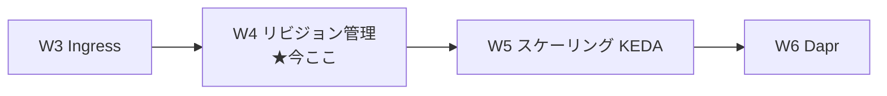
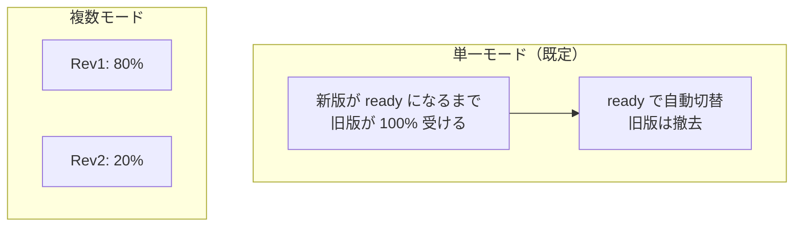
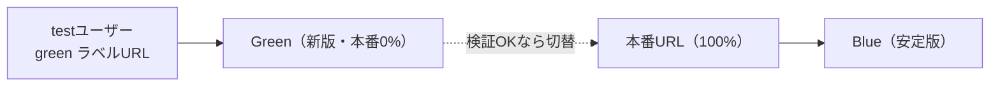

# Week 4 — リビジョン管理：単一/複数モード・トラフィック分割・ラベル・Blue/Green・ロールバック

> **Phase 1a** | 学習プラン Week 4 / 10
> 学習目標：W2 で積み上げた**リビジョン（版）**を、実際の**リリース運用**にどう使うかを掴む。**単一（single）／複数（multiple）リビジョンモード**の違い、**トラフィック分割（traffic weights）で版へ % 配分**、**ラベル（label）で特定版に専用 URL**、そしてこれらを組み合わせた **Blue/Green デプロイ**と**ロールバック（切り戻し）**を、公式手順に沿って理解する。ここまでで「無停止で入れ替え、問題があれば即戻す」という ACA の運用像が固まる。

---

## 0. 今週の位置づけ



W2 で「`template` を変えると新リビジョンが生まれる」、W3 で「Envoy がトラフィック分割を担う」と触れた。W4 はこの 2 つを合流させ、**新旧の版を並べて、Envoy に何 % ずつ流させるか**を制御する。公式いわく、変更管理は**リビジョン（各版のスナップショット）に支えられている**。

> **初学者向け用語補足：変更管理（change management）／ロールバック**
> - **変更管理**＝ アプリを更新するとき「新版を入れ、動くか確かめ、ダメなら戻す」を**安全に回す**仕組み全体。稼働（uptime）を保ちつつ更新するのが目的。
> - **ロールバック（rollback）**＝「巻き戻し」。新版に問題が出たとき、**前の安定版へトラフィックを戻す**こと。ACA では"版を消さずに残す"から一瞬で戻せる。

---

## 1. リビジョンの性質（W2 の復習＋追加）

公式が挙げるリビジョンの鍵となる性質：

- **イミュータブル（不変）**：一度作られたら変わらない。
- **バージョン付き**：各版の記録。
- **自動プロビジョニング**：初回デプロイで最初のリビジョンが自動生成。
- **スコープの区別**：**アプリスコープ変更は全リビジョンに影響**、**リビジョンスコープ変更は新リビジョンを作る**。
- **履歴**：既定で**最大 100 個の非アクティブリビジョン**を保持（調整可）。
- **複数同時実行**：複数リビジョンを同時に走らせられる。

### 変更の 2 スコープ（W2 の `template`/`configuration` の言い換え）

| スコープ | 対応セクション | 挙動 | 主な中身 |
| --- | --- | --- | --- |
| **リビジョンスコープ** | `properties.template` | **新リビジョンを作る** | リビジョンサフィックス・コンテナ設定/イメージ・スケールルール |
| **アプリスコープ** | `properties.configuration` | **新リビジョンを作らず全版に適用** | シークレット値・リビジョンモード・Ingress/トラフィック分割/ラベル・レジストリ認証・Dapr 設定 |

> **用語補足：シークレット変更は再起動が要る**
> アプリスコープのシークレット値変更は新リビジョンを生まないが、公式は「**新しいシークレット値をコンテナが認識するにはリビジョンの再起動が必要**」と注記。設定は即反映でも、プロセスが読み直すには再起動が要る、という点に注意（W8）。

> **初学者向け用語補足：プロビジョニング（provisioning）**
> **プロビジョニング**＝ リソースを**用意して使える状態にする**こと（provision＝供給する）。新リビジョン作成時、コンテナは起動チェック（startup/readiness プローブ）を通って `Provisioned`（成功）／`Provisioning failed`（失敗）へ進む。

---

## 2. リビジョンモード：単一 vs 複数

アプリは 2 つのモードを持つ（＋プレビューのラベル運用）。設定は `configuration.activeRevisionsMode`。

| モード | 挙動 | 既定 |
| --- | --- | --- |
| **単一（single）** | 新リビジョンを自動で用意・有効化・スケールし、**準備完了後に旧版から新版へトラフィックを切替**。更新失敗時は**旧版に留まる**。旧版は自動で撤去 | **○** |
| **複数（multiple）** | **複数版を同時アクティブ**にでき、**版へトラフィックを % 分割**、旧版の撤去タイミングも自分で決める。テスト・Blue/Green・更新の完全制御向け | ✗ |



### 単一モードのゼロダウンタイム

公式いわく、単一モードでも**ダウンタイムは発生しない**。「新版が**準備完了になるまで、既存版が 100% のトラフィックを受け続ける**」。新版が"ready"と見なされるのは：

- リビジョンが**プロビジョニング成功**
- 旧版のレプリカ数に**スケールアップして一致**（新版の min/max を尊重）
- 全レプリカが **startup / readiness プローブを通過**

> **初学者向け用語補足：ゼロダウンタイム／startup・readiness プローブ**
> - **ゼロダウンタイム（zero downtime）**＝ デプロイ中も**サービスが一切止まらない**こと。旧版を生かしたまま新版を立ち上げ、準備できてから切り替えることで実現。
> - **プローブ（probe）**＝「探り」。コンテナの健康状態を基盤が定期的に叩いて確認する仕組み（W9 で詳述）。**startup**＝起動が済んだか、**readiness**＝リクエストを受けられる状態か。ここを通らないと"ready"扱いされず、トラフィックが切り替わらない＝壊れた新版が公開されない安全弁。

---

## 3. トラフィック分割（traffic weights）

複数モードでは、`ingress.traffic` に**版と重み（weight＝%）の配列**を書いて配分する。

```json
{
  "traffic": [
    { "revisionName": "album-api--fb699ef", "weight": 80, "label": "blue" },
    { "revisionName": "album-api--c6f1515", "weight": 20, "label": "green" }
  ]
}
```

- `revisionName`＝配分先リビジョン名（`<アプリ名>--<サフィックス>`）。
- `weight`＝そのリビジョンに流す %（合計 100）。
- `latestRevision: true` を使うと「**最新版へ**」を名指しせず指定できる（最新が ready になるまで切り替わらない）。

CLI での配分：

```bash
az containerapp ingress traffic set \
  -n album-api -g $RG \
  --revision-weight album-api--fb699ef=80 album-api--c6f1515=20
```

> **コマンドの読み方**：`ingress traffic set`＝トラフィック配分を設定、`--revision-weight <リビジョン名>=<%>`＝各リビジョンに流す割合。合計 100 になるよう指定する。これが Envoy（W3）の配分ルールになる。

> **初学者向け用語補足：重み（weight）**
> **重み**＝ 複数の選択肢に振り分けるときの**割合の重み付け**。`80/20` なら 5 回に 4 回は Rev1、1 回は Rev2 へ。A/B テスト（少数に新版）や段階的移行（10%→50%→100%）に使う。

---

## 4. ラベル（label）：特定リビジョンへの専用 URL

**トラフィック分割が「アプリの URL に来た総量を % で散らす」のに対し、ラベルは「特定の版だけを名指しで叩ける専用 URL を与える」**。両者は独立した仕組みで、併用もできる。

公式の対比：

> ラベルは特定リビジョンへトラフィックを向ける。ラベルは**一意な URL** を提供し、それを使ってラベルの付いたリビジョンへルーティングできる。（略）トラフィック分割はアプリの**アプリケーション URL** に来たトラフィックを % で版へ分配するのに対し、**ラベルの URL へ来たトラフィックは特定の 1 リビジョンへ**ルーティングされる。
> （出典：[Update and deploy changes in Azure Container Apps](https://learn.microsoft.com/en-us/azure/container-apps/revisions)）

ラベル付き FQDN の形（W3 の connect-apps より、区切りは**三連ダッシュ `---`**）：

```
<APP_NAME>---<LABEL>.<ENV_ID>.<REGION>.azurecontainerapps.io
```

ラベルの性質：

- **移動しても URL は不変**（`green` を別版へ移してもラベル URL は同じ）。
- **1 ラベルは同時に 1 リビジョンだけ**に付く。
- トラフィック配分の割当は不要（ラベル URL は常にその 1 版へ）。
- **複数モードで最も有用**。

```bash
# 版に blue ラベルを付ける
az containerapp revision label add -n album-api -g $RG \
  --label blue --revision album-api--fb699ef
```

> **読み方**：`revision label add`＝リビジョンにラベルを付与、`--label`＝ラベル名（小文字英数とダッシュ、先頭は英字、64 字以内、`--` 連続不可）、`--revision`＝付与先リビジョン名。テストユーザーにこのラベル URL を渡せば、本番トラフィックに影響せず新版を試せる。

---

## 5. Blue/Green デプロイ：リビジョン＋重み＋ラベルの合わせ技

公式は Blue/Green を **「リビジョン＋トラフィック重み＋リビジョンラベルの組み合わせ」**で実現すると明言する。

| 役割 | 意味 |
| --- | --- |
| **Blue リビジョン** | 現在稼働中の**安定版**。本番トラフィックの受け先。 |
| **Green リビジョン** | Blue のコピーで**新しいコード**を持つ版。当初は本番トラフィックを受けず、**ラベル付き FQDN 経由でのみアクセス可能**。 |



運用サイクル（公式の 4 局面）：

1. **テストと検証**：Green を機能・性能・互換性の面から十分に検証。
2. **トラフィック切替**：Green が全テスト通過後、本番トラフィックを Green へ（制御された形で）。
3. **ロールバック**：Green に問題が出たら、トラフィックを Blue へ**戻す**。Green は次回に再利用可。
4. **役割交代**：成功後は Blue と Green の役割が入れ替わる（次サイクルは Green が安定版、Blue に新版）。

### CLI での一連の流れ（公式サンプルを短縮）

```bash
# 前提: 複数モードで作成し blue ラベル付与済み（本番100%）
# ① Green（新版）をデプロイし green ラベルを付与（本番トラフィックは 0%）
az containerapp update -n $APP -g $RG \
  --image mcr.microsoft.com/k8se/samples/test-app:$GREEN \
  --revision-suffix $GREEN --set-env-vars REVISION_COMMIT_ID=$GREEN
az containerapp revision label add -n $APP -g $RG \
  --label green --revision $APP--$GREEN

# ② green ラベル URL で検証（本番に影響なし）
#    curl https://$APP---green.$APP_DOMAIN/...

# ③ 検証OK → 本番トラフィックを green へ 100% 切替
az containerapp ingress traffic set -n $APP -g $RG \
  --label-weight blue=0 green=100

# ④ 問題が出たら即ロールバック（blue へ戻す）
az containerapp ingress traffic set -n $APP -g $RG \
  --label-weight blue=100 green=0
```

> **読み方**：`--label-weight blue=0 green=100`＝**ラベル単位で**重みを設定（version 名を書かずラベルで切替できる）。③で green を 100% にすれば新版が本番、④で blue を 100% に戻せば一瞬でロールバック。**版を消していない**から切替がトラフィック設定の変更だけで済む＝これが Blue/Green の速さの理由。

> **用語補足：なぜコミットハッシュをサフィックスにするのか**
> 公式サンプルは `--revision-suffix $BLUE_COMMIT_ID`（Git のコミットハッシュ）を使う。W2 の「`latest` を避け一意タグを」と同じ発想で、**どの版がどのコードか**をリビジョン名から追えるようにするため。ビルド番号でもよい。

---

## 6. リビジョンの活用パターン（まとめ）

| パターン | 使うもの | 何が嬉しいか |
| --- | --- | --- |
| **リリース管理** | 単一モードの自動切替 | 現行版に影響せず新版を用意、ready で無停止切替 |
| **前版へ復帰** | 複数モード＋トラフィック重み | 安定版を残しておき、問題時に即戻す |
| **A/B テスト** | トラフィック分割（例 90/10） | 一部ユーザーに新版、実データで判断 |
| **Blue/Green** | 複数モード＋重み＋ラベル | 新版を隔離検証 → 一気に切替 → ダメなら即戻し |
| **特定版の直接アクセス** | ラベル URL | テスターに専用 URL、本番は無風 |

> **用語補足：非アクティブ版は無料・でも 100 個上限**
> 公式：「Container Apps は**非アクティブなリビジョンには課金しない**。ただし利用可能なリビジョン総数には上限があり、**100 を超えると古いものから消える**」。履歴は残るが無限ではない。`--max-inactive-revisions` で調整可（プレビュー）。

---

## 7. ハンズオン — 複数モードで 2 版を 80/20 分割し、Blue/Green 切替まで

W2/W3 のアプリとは別に、複数モードのアプリを作って版を操作する。イメージは公式サンプル `mcr.microsoft.com/k8se/samples/test-app`（`/api/env` で環境変数を返すため、どの版に当たったか分かる）を使う。

```bash
RG=aca-learn-rg
ENV=aca-learn-env
APP=trafficdemo
BLUE=fb699ef      # 便宜上のタグ（実在サンプルタグ）
GREEN=c6f1515

# ① 複数モードで作成（blue を本番100%）
az containerapp create -n $APP -g $RG --environment $ENV \
  --image mcr.microsoft.com/k8se/samples/test-app:$BLUE \
  --revision-suffix $BLUE --env-vars REVISION_COMMIT_ID=$BLUE \
  --ingress external --target-port 80 --revisions-mode multiple \
  --query properties.configuration.ingress.fqdn -o tsv
az containerapp ingress traffic set -n $APP -g $RG \
  --revision-weight $APP--$BLUE=100
az containerapp revision label add -n $APP -g $RG --label blue --revision $APP--$BLUE

# ② green（新版）を追加（本番0%）＋ラベル
az containerapp update -n $APP -g $RG \
  --image mcr.microsoft.com/k8se/samples/test-app:$GREEN \
  --revision-suffix $GREEN --set-env-vars REVISION_COMMIT_ID=$GREEN
az containerapp revision label add -n $APP -g $RG --label green --revision $APP--$GREEN

# ③ 80/20 に分割してみる（A/Bテスト風）
az containerapp ingress traffic set -n $APP -g $RG \
  --revision-weight $APP--$BLUE=80 $APP--$GREEN=20

# ④ green へ全切替（Blue/Green 本番切替）
az containerapp ingress traffic set -n $APP -g $RG --label-weight blue=0 green=100

# ⑤ ロールバック（blue へ戻す）
az containerapp ingress traffic set -n $APP -g $RG --label-weight blue=100 green=0
```

### 確認

- `--revisions-mode multiple`＝複数モードで作成（分割の前提）。
- ③の 80/20 後、アプリ URL に**何度もアクセス**すると、`REVISION_COMMIT_ID` が概ね 8:2 で blue/green に振れる（Envoy が weight で配分）。
- 各版の**ラベル URL**（`https://$APP---green.<環境ドメイン>/api/env`）で green だけを直接叩けることを確認。
- ④→⑤で、**版を消さずにトラフィック設定だけ**で本番切替とロールバックが一瞬で済むことを体感する。

環境ドメインの取得：
```bash
az containerapp env show -g $RG -n $ENV --query properties.defaultDomain -o tsv
```

### 後片付け

```bash
az group delete --name $RG --yes --no-wait
```

> **W5 でスケールを触るので、続けるなら削除は W5 の後でもよい。**

---

## 8. 自己チェック

1. **リビジョンスコープ変更**と**アプリスコープ変更**は、それぞれ何を変えたときか。新リビジョンを生むのはどちらか。シークレット値変更後にコンテナが新値を読むには何が要るか。
2. **単一モード**と**複数モード**の違いを言えるか。単一モードでも**ゼロダウンタイム**になるのはなぜか（"ready"の 3 条件を含めて）。
3. **トラフィック分割**とは何を何に配分するのか。CLI で 70/30 に分けるコマンドの骨子を書けるか。
4. **ラベル**とトラフィック分割の違いは何か。「アプリ URL に来た総量を % で散らす」のはどちら、「特定版を名指しで叩く専用 URL」はどちらか。ラベル FQDN の区切り文字は何か。
5. **Blue/Green** における Blue と Green の役割は何か。切替とロールバックが**速い**のはなぜか（版を消さない点で説明できるか）。
6. リビジョンサフィックスに**コミットハッシュ**を使う利点は何か（W2 の `latest` 回避と関連づけて）。
7. 非アクティブリビジョンは課金されるか。上限は何個か。

---

## 9. 次週予告（W5：スケーリング＝KEDA でレプリカを増減、ゼロスケール）

ここまでは「どの版に流すか」の水平方向だった。W5 では**縦方向＝レプリカ数を負荷に応じて増減**する仕組み、すなわち **KEDA**（W1 で登場：Kubernetes Event-Driven Autoscaling）を扱う。**スケールルール**（HTTP 同時実行数・キューの長さ・cron・任意の KEDA スケーラ）、**min/max レプリカ**、そして ACA の目玉 **scale to zero（ゼロスケール）**——ただし W1 で予告した「**CPU/メモリ負荷ではゼロにできない**」の理由まで踏み込む。リビジョン（版）× レプリカ（数）で、ACA の実行モデルが完成する。

---

### 参考（出典）
- [Update and deploy changes in Azure Container Apps（リビジョン）](https://learn.microsoft.com/en-us/azure/container-apps/revisions)
- [Blue-Green Deployment in Azure Container Apps](https://learn.microsoft.com/en-us/azure/container-apps/blue-green-deployment)
- [Traffic splitting（トラフィック分割）](https://learn.microsoft.com/en-us/azure/container-apps/traffic-splitting)
- [Manage revisions（リビジョン操作）](https://learn.microsoft.com/en-us/azure/container-apps/revisions-manage)
