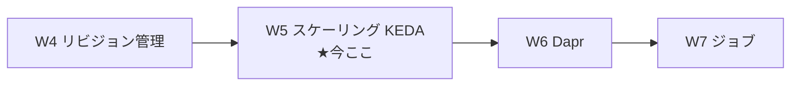
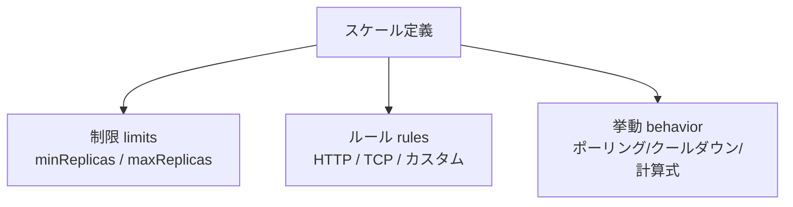

# Week 5 — スケーリング：KEDA でレプリカを自動増減、ゼロスケール、CPU/メモリでゼロにできない理由

> **Phase 1a** | 学習プラン Week 5 / 10
> 学習目標：ACA の目玉である**自動水平スケール**を、それを担う **KEDA**（Kubernetes Event-Driven Autoscaling）とともに理解する。**スケール定義の 3 要素（制限＝min/max・ルール・挙動）**、**3 種のトリガー（HTTP／TCP／カスタム＝CPU・メモリ・キュー等のイベント駆動）**、ACA の看板 **scale to zero（ゼロスケール）**、そして W1 で予告した **「CPU/メモリ負荷ではゼロにできない」の理由**まで踏み込む。さらに**スケール挙動（ポーリング 30 秒・クールダウン 300 秒・スケール計算式）**と、Ingress 無効で min=0 だと**二度と起きない**という重要な落とし穴を押さえる。

---

## 0. 今週の位置づけ



W4 までで「どの版（リビジョン）に流すか」という**水平方向**を扱った。W5 は「その版を**何レプリカ動かすか**」という**縦方向**である。公式：

> Azure Container Apps は、**宣言的なスケールルール**の集合で自動水平スケールを管理する。リビジョンがスケールアウトすると、プラットフォームがオンデマンドで新しいインスタンス（**レプリカ**）を作る。（略）このスケール挙動を支えるため、**ACA は KEDA を使う**。
> （出典：[Scaling in Azure Container Apps](https://learn.microsoft.com/en-us/azure/container-apps/scale-app)）

> **初学者向け用語補足：水平スケール／垂直スケール**
> - **水平スケール（horizontal scaling／スケールアウト・スケールイン）**＝ **同じものの台数（レプリカ数）を増減**して負荷をさばく。ACA が行うのはこれ。out＝増やす、in＝減らす。
> - **垂直スケール（vertical scaling／スケールアップ・ダウン）**＝ **1 台の性能（CPU/メモリ）を上げ下げ**する。**ACA は垂直スケールを（自動では）サポートしない**（後述の制限）。CPU/メモリの割当は版（`template`）で固定し、数で調整する思想。

---

## 1. スケール定義の 3 要素：制限・ルール・挙動

公式いわく「スケールとは、**制限（limits）・ルール（rules）・挙動（behavior）** の組み合わせ」。



### 制限（limits）＝ min/max レプリカ

| 制限 | 既定 | 最小 | 最大 |
| --- | --- | --- | --- |
| **minReplicas**（下限） | **0** | 0 | 1,000 |
| **maxReplicas**（上限） | **10** | 1 | 1,000 |

- **min=0** ならゼロスケール（暇なら 0 個＝課金なし）。
- **min≥1** なら「常に最低 1 個は起きている」＝コールドスタートを避けたい時。

> **初学者向け用語補足：レプリカ／コールドスタート**
> - **レプリカ（replica）**＝ 版を実際に動かす**複製の 1 個**（W2 既出）。負荷でこの数が増減する。
> - **コールドスタート（cold start）**＝ 0 個から起こすとき、コンテナ起動の待ちが生じること。min≥1 にすればこの待ちを消せる（代わりに常時課金）。「速さ（min≥1）」と「コスト（min=0）」のトレードオフ。

> **用語補足：課金の勘所**
> 公式：「**ゼロにスケールすれば使用料はかからない**」。また「処理していないがメモリに残るレプリカは、より低い"アイドル"料金で課金されることがある」。min=0 は最も安いが起動待ちあり、というのがサーバーレスの費用モデル。

### スケール挙動（behavior）

| 挙動 | 値 |
| --- | --- |
| **ポーリング間隔** | 30 秒（HTTP/TCP には適用されない） |
| **クールダウン期間** | 300 秒 |
| スケールアップ安定化ウィンドウ | 0 秒 |
| スケールダウン安定化ウィンドウ | 300 秒 |
| スケールアップの刻み | 1 → 4 → 8 → 16 → 32 …（上限まで） |
| スケールダウンの刻み | 落とすべきレプリカの 100% |
| **スケール計算式** | `desiredReplicas = ceil(currentMetricValue / targetMetricValue)` |

> **初学者向け用語補足：ポーリング／クールダウン／ceil**
> - **ポーリング（polling）**＝ KEDA が**一定間隔でイベント源を見に行く**こと（30 秒ごとにキューの長さ等を確認）。HTTP/TCP は Envoy が同時数を数えるのでポーリング不要。
> - **クールダウン（cool down）**＝「冷却期間」。最後のイベントから**300 秒待って**から最小レプリカ（0 含む）へ落とす。公式注記：**クールダウンは"最後の 1 個から 0 へ落とすとき"にのみ効く**。乱高下（バタつき）を防ぐ緩衝。
> - **ceil（シーリング）**＝ 切り上げ（ceiling＝天井）。`ceil(50/5)=10`。「メトリクス値 ÷ 目標値」を切り上げた数が望ましいレプリカ数。

---

## 2. スケールルール：3 種のトリガー

公式が挙げるトリガーは 3 カテゴリ。**複数ルールを定義すると、いずれか 1 つの条件が最初に満たされた時点でスケール開始**。

| トリガー | 何を見るか | ゼロスケール | ジョブでの可否 |
| --- | --- | --- | --- |
| **HTTP** | リビジョンへの**同時 HTTP リクエスト数** | ○ | ✗（ジョブは HTTP ルール非対応） |
| **TCP** | 同時 **TCP 接続数** | ○ | ✗ |
| **カスタム（custom）** | CPU・メモリ・**イベント源**（Service Bus / Event Hubs / Kafka / Redis 等、任意の KEDA スケーラ） | イベント源は○／**CPU・メモリは✗** | ○（イベント駆動ジョブ、W7） |

### HTTP ルール

`concurrentRequests`（同時リクエスト数）を閾値にする。公式：**15 秒ごとに「直近 15 秒のリクエスト数 ÷ 15」で同時数を算出**。

```bash
az containerapp create -n <APP> -g <RG> --environment <ENV> \
  --image <IMAGE> \
  --min-replicas 0 --max-replicas 5 \
  --scale-rule-name http-rule --scale-rule-type http \
  --scale-rule-http-concurrency 100
```

> **読み方**：`--scale-rule-http-concurrency 100`＝1 レプリカあたり同時 100 リクエストを超えたらレプリカを 1 個増やし、max まで増やす（既定閾値は 10）。暇になれば 0 まで戻せる。

### カスタムルール（イベント駆動＝キュー等）＝ ゼロスケールの真価

公式は**任意の KEDA スケーラ**（`ScaledObject` ベース）をそのまま ACA のルールに写せると説明する。代表例が **Azure Service Bus のキュー長**でスケールするケース。

```bash
az containerapp create -n <APP> -g <RG> --environment <ENV> \
  --image <IMAGE> \
  --min-replicas 0 --max-replicas 5 \
  --secrets "sb-conn=<SERVICE_BUS_CONNECTION_STRING>" \
  --scale-rule-name sb-queue --scale-rule-type azure-servicebus \
  --scale-rule-metadata "queueName=my-queue" "namespace=<NS>" "messageCount=5" \
  --scale-rule-auth "connection=sb-conn"
```

> **読み方**：`--scale-rule-type azure-servicebus`＝KEDA の Service Bus スケーラを使う、`messageCount=5`＝「1 レプリカが同時に見るメッセージ数の目標＝5」。キューに 50 件溜まれば `ceil(50/5)=10` レプリカへ。空になり 300 秒経てば 0 へ。**メッセージが来た時だけ起き、捌けたら 0 に畳む**＝イベント駆動サーバーレスの理想形。KEDA 認証は **Container Apps シークレット or マネージド ID**（W8）で行う。

> **初学者向け用語補足：KEDA スケーラ／ScaledObject**
> - **スケーラ（scaler）**＝ KEDA が持つ「**このイベント源をこう測る**」という部品。Service Bus・Event Hubs・Kafka・Redis・Cron など多数（[KEDA scalers](https://keda.sh/docs/scalers/)）。ACA はこれをそのまま流用できるのが強み。
> - **ScaledObject**＝ KEDA で「何を対象に・どのトリガーで・どこまで増減するか」を書いた定義。ACA のスケールルールはこの写像。

---

## 3. ゼロスケールの核心：なぜ CPU/メモリではゼロにできないのか

W1 で予告した公式注記：

> ほとんどのアプリはゼロにスケールできる。**ただし CPU またはメモリ負荷でスケールするアプリはゼロにできない。**
> （出典：[Azure Container Apps overview](https://learn.microsoft.com/en-us/azure/container-apps/overview)）

理由を"メトリクスの測り方"から理解する。

```mermaid
flowchart TD
    Zero["レプリカ 0 個の状態"] --> Q{何を見て起こす?}
    Q -->|HTTP/TCP| Ext["Envoy が外側で同時数を数える<br/>→ 0個でも来訪を検知して起こせる ○"]
    Q -->|キュー等イベント| Poll["KEDA が外側でキュー長を覗く<br/>→ 0個でもメッセージ有を検知して起こせる ○"]
    Q -->|CPU/メモリ| Inside["負荷はレプリカの"中"でしか測れない<br/>→ 0個だと測る対象が無い＝起こせない ✗"]
```

- **HTTP/TCP・キュー等**：負荷の指標は**コンテナの外側**（Envoy が同時数を数える／KEDA がキューを覗く）で測れる。だから**レプリカが 0 個でも「来た」ことを検知して起こせる**。
- **CPU/メモリ**：これらは**動いているレプリカの内部でしか測れない**。0 個だと**測る対象がそもそも存在しない**ので、「負荷が上がったから起こす」の判断ができない。ゆえに CPU/メモリルールのアプリは**最低 1 個は常に必要**＝ゼロにできない。

> **腑に落ちポイント**：ゼロスケールできるかは「**中を動かさずに、外から"仕事が来た"と分かるか**」で決まる。外形（リクエスト・キュー）で分かるものはゼロから起こせ、内部状態（CPU/メモリ）でしか分からないものはゼロにできない。

---

## 4. 既定のスケールルールと"二度と起きない"落とし穴

**スケールルールを 1 つも作らない場合、既定ルール**が適用される。

| トリガー | min | max |
| --- | --- | --- |
| HTTP | 0 | 10 |

そして公式の重要警告：

> **Ingress を無効にする場合は、スケールルールを作るか `minReplicas` を 1 以上にすること。** Ingress が無効で `minReplicas` もカスタムスケールルールも定義しないと、コンテナアプリは**ゼロにスケールし、二度と起動する手段がなくなる**。
> （出典：[Scaling in Azure Container Apps](https://learn.microsoft.com/en-us/azure/container-apps/scale-app)）

> **腑に落ちポイント**：既定ルールは HTTP（＝Ingress 前提）。Ingress を切ると HTTP で起こす手段が消えるのに min=0 のままだと、**起こす引き金が無いのに 0 個**＝永久停止。バックグラウンドワーカー（Ingress 無し）を作るときは、**イベント駆動ルールを付ける**か **min≥1** にする、が鉄則。W7 のジョブや W6 の Dapr ワーカーで効いてくる。

---

## 5. スケールの具体例（キュー 50 件のとき）

公式の手順トレース（Service Bus、min=0/max=20/messageCount=5）：

1. 30 秒ごとに `my-queue` を確認。
2. 長さ 0 なら 1 に戻る（0 個のまま）。
3. 長さ > 0 なら 1 レプリカへ（0→1 の起動）。
4. 長さ 50 なら `desiredReplicas = ceil(50/5) = 10`。
5. `min(max, desiredReplicas, max(4, 2×現在レプリカ))` へスケール（急拡大を抑えつつ増やす）。
6. 1 に戻る。

- 空になっても**300 秒（スケールダウン安定化）条件成立を待って**から減らす。
- 最後にキュー 0 が続けば、**300 秒（クールダウン）後に 0 へ**。

> **初学者向け用語補足：安定化ウィンドウ（stabilization window）**
> 一瞬の増減で台数がバタつく（＝チャタリング）のを防ぐため、「**条件がこの秒数の間続いたら**」実行する緩衝時間。スケールアップは 0 秒（すぐ増やす＝取りこぼさない）、スケールダウンは 300 秒（慎重に減らす＝急に落として溢れさせない）と**非対称**なのがポイント。

---

## 6. 制限・注意点

公式の「Known limitations／Considerations」から要点：

- **垂直スケールは非対応**（数で調整、性能は版で固定）。
- **レプリカ数は"目標"であって保証ではない**（`Replica quantities are a target amount, not a guarantee`）。
- **Dapr アクターで状態管理する場合、ゼロスケールは非対応**（W6：アクターのインメモリ表現が寿命に縛られないため）。
- 複数リビジョンモードで**新スケールトリガーを足すと新リビジョンが生まれる**（旧版は旧ルールのまま残る＝W4 のトラフィック管理で扱う）。
- 非 HTTP のイベントスケールルールを使うときは、`activeRevisionsMode` を **`single`** にする（公式注記）。

> **初学者向け用語補足：チャタリング／"目標であって保証でない"**
> - レプリカ数が**目標値**とは、瞬間的には要求と一致しないことがある、の意。KEDA が計算式で近づけるが、起動には時間がかかるため。設計は「多少ぶれても大丈夫」を前提に。

---

## 7. ハンズオン — HTTP 同時数でゼロスケール、負荷をかけて増減を見る

HTTP スケールルールでゼロから起き、負荷で増え、止めれば 0 に戻る様子を観察する。

```bash
RG=aca-learn-rg
ENV=aca-learn-env
APP=scaledemo

# HTTP同時数10でスケール、min=0（ゼロスケール）/max=5
az containerapp create -n $APP -g $RG --environment $ENV \
  --image mcr.microsoft.com/k8se/quickstart:latest \
  --target-port 80 --ingress external \
  --min-replicas 0 --max-replicas 5 \
  --scale-rule-name http-rule --scale-rule-type http \
  --scale-rule-http-concurrency 10 \
  --query properties.configuration.ingress.fqdn -o tsv
```

### 観察 A：無アクセスで 0 に落ちる

しばらく（クールダウン 300 秒＋α）放置後、レプリカ数を確認：

```bash
az containerapp replica list -n $APP -g $RG -o table
```

> **読み方**：`replica list`＝現在のレプリカ一覧。アクセスが無ければ**0 行（＝0 個）**になる。これがゼロスケール（課金なし）。

### 観察 B：負荷をかけて増える

別ターミナルで、表示された FQDN に**並行して大量リクエスト**を送る（`hey` や `ab` 等の負荷ツール、無ければ `for`＋`curl` を多重に）。

```bash
FQDN=<表示されたfqdn>
# 例：ざっくり並行アクセス（負荷ツールがあればそちら推奨）
for i in $(seq 1 200); do curl -s -o /dev/null https://$FQDN & done; wait
```

送っている間に別ターミナルで再度 `replica list` を見ると、**同時数が 10 を超えるとレプリカが増える**（max 5 まで）。止めてしばらくすると**再び 0 へ**。

> **読み方**：同時 HTTP が `concurrentRequests=10` を超えるたびに 1 個ずつ（スケールアップ刻み 1→4→8…）増える。負荷が消え 300 秒経てば 0 へ。**HTTP は Envoy が外で数えるからゼロから起こせる**（§3）ことを体感する。

### 後片付け

```bash
az group delete --name $RG --yes --no-wait
```

> **W6 で Dapr を使うので、続けるなら削除は W6 の後でもよい。**

---

## 8. 自己チェック

1. **水平スケール**と**垂直スケール**の違いは何か。ACA が自動で行うのはどちらで、行わないのはどちらか。
2. スケール定義の 3 要素（制限・ルール・挙動）を挙げ、min/max の既定値（`0`／`10`）を言えるか。
3. 3 種のトリガー（HTTP・TCP・カスタム）を挙げ、カスタムの代表例（CPU・メモリ・キュー等）を言えるか。ジョブが非対応なのはどれか。
4. **ゼロスケールできる条件**を「外から仕事が来たと分かるか」で説明できるか。**なぜ CPU/メモリではゼロにできない**のか。
5. **Ingress 無効 × min=0** で起きる致命的な状態は何か。どう回避するか（2 通り）。
6. キュー 50 件・messageCount=5 のとき、望ましいレプリカ数はいくつか（計算式で）。空になってから 0 に落ちるまでに効く 2 つの待ち時間（安定化・クールダウン）は何秒か。
7. 「レプリカ数は目標であって保証でない」とはどういう意味か。**スケールアップとダウンの安定化ウィンドウが非対称**なのはなぜか。

---

## 9. 次週予告（W6：Dapr 統合＝マイクロサービスの共通部品をサイドカーで）

ここまでで「版 × レプリカ数」という ACA の実行モデルが完成した。W6 では、W1・W3 で名前だけ出た **Dapr**（Distributed Application Runtime）に踏み込む。Dapr は**サイドカー**としてレプリカに横付けされ、**サービス呼び出し（mTLS・リトライ・トレース込み）／パブサブ（pub/sub）／状態管理（state）**などの"マイクロサービスでいつも書く配線"を、言語非依存の共通 API で肩代わりする。W3 で触れた `http://localhost:3500/v1.0/invoke/...` の正体、コンポーネント（component）による外部リソースの差し替え、そして本週で出た「Dapr アクターはゼロスケール非対応」の背景を扱う。

---

### 参考（出典）
- [Scaling in Azure Container Apps（スケール／KEDA）](https://learn.microsoft.com/en-us/azure/container-apps/scale-app)
- [Azure Container Apps overview（ゼロスケール注記）](https://learn.microsoft.com/en-us/azure/container-apps/overview)
- [KEDA Scalers（対応スケーラ一覧）](https://keda.sh/docs/scalers/)
- [Billing in Azure Container Apps（課金）](https://learn.microsoft.com/en-us/azure/container-apps/billing)
