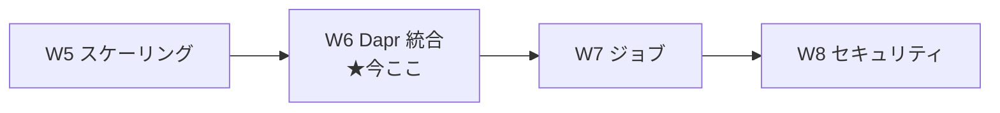
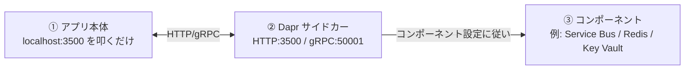
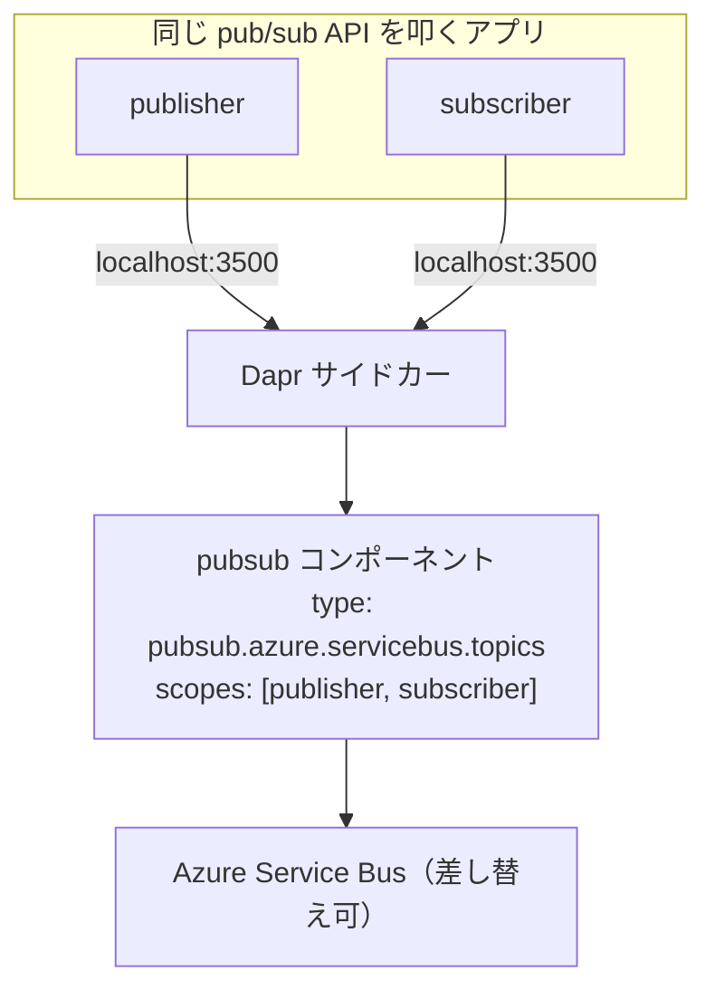

# Week 6 — Dapr 統合：マイクロサービスの共通部品をサイドカーで肩代わりさせる

> **Phase 1a** | 学習プラン Week 6 / 10
> 学習目標：ACA の土台 OSS の 1 つ **Dapr（Distributed Application Runtime、ダプル／ダパー）** を、実際に使える形で理解する。Dapr が**サイドカー**としてレプリカに横付けされ、**サービス呼び出し・状態管理・pub/sub・バインディング・アクター・シークレット**といった"マイクロサービスでいつも書く配線"を、**言語非依存の共通 API（HTTP/gRPC）**で肩代わりすることを掴む。W3 で出た `http://localhost:3500/v1.0/invoke/...` の正体、**コンポーネント（component）と scopes** による外部リソースの差し替え、Dapr の有効化設定（appId/appPort/appProtocol）、そして W5 で触れた「Dapr アクターはゼロスケール非対応」の背景を扱う。

---

## 0. 今週の位置づけ



W1 で「Dapr＝マイクロサービス共通 API をサイドカーで」、W3 で「Dapr サービス呼び出しで別アプリを呼べる」と触れた。W6 はそれを正面から扱う。公式の位置づけ：

> ACA は **Dapr（Distributed Application Runtime）が提供する API** を通じて、シンプル・可搬・回復力があり・安全なマイクロサービスを書けるようにする。Dapr は ACA と協調する**抽象化レイヤ**として働き、低メンテナンスでスケーラブルな基盤を提供する。
> （出典：[Microservice APIs Powered by Dapr](https://learn.microsoft.com/en-us/azure/container-apps/dapr-overview)）

> **初学者向け用語補足：Dapr とは（何が"嬉しい"のか）**
> マイクロサービスを作ると、毎回**同じ配線コード**を書く羽目になる：別サービスの探索と再試行、メッセージブローカへの発行/購読、状態を DB に保存、シークレット取得…。Dapr はこれらを **「アプリの横に立つ相棒プロセス（サイドカー）」が肩代わりし、アプリからは `http://localhost:3500/...` を叩くだけ**にする。**言語非依存**（Python/Node/Java/.NET どれでも同じ HTTP）で、**バックエンド実装（Redis か Service Bus か等）はコンポーネント設定で差し替え**られる。「配線を自分で書かず、共通 API に委ねる」のが Dapr の狙い。
> - **可搬（portable／ポータブル）**＝ 別のクラウド・別のバックエンドへ**持ち運びやすい**。アプリは Dapr API しか知らないので、裏を差し替えてもアプリは無変更。
> - **回復力（resilient／レジリエント）**＝ 一時的な失敗に**再試行などで耐える**。Dapr が mTLS・リトライ・トレースを込みで提供。

---

## 1. 3 つの中核概念：Dapr 有効アプリ・コンポーネント・サイドカー

公式は「**Dapr 有効なコンテナアプリ**＋**用途に合わせたコンポーネント**＋**両者を仲介するサイドカー**」の 3 点で構成すると説明する（例は pub/sub）。



| # | 要素 | 説明 |
| --- | --- | --- |
| 1 | **Dapr 有効アプリ** | アプリ側で Dapr 引数（appId 等）を設定して有効化。**複数リビジョンモードでは全リビジョンに同じ設定が適用**される |
| 2 | **Dapr サイドカー** | 完全マネージドな Dapr API を各アプリに公開。**HTTP ポート 3500・gRPC ポート 50001** で待ち受け。アプリは HTTP か gRPC で叩く |
| 3 | **コンポーネント** | Dapr はモジュラー設計で、機能を**コンポーネント**として提供。**複数アプリで共有可**。`scopes` 配列の Dapr アプリ ID が「どのアプリがそのコンポーネントを読み込むか」を決める |

> **初学者向け用語補足：サイドカー（再掲）／localhost で呼ぶ意味**
> - **サイドカー（sidecar）**＝ 本体コンテナと同じレプリカ内に横付けされる相棒コンテナ（W2）。Dapr サイドカーは本体と**同じネットワーク名前空間**にいるので、本体からは `localhost:3500` で届く（外に出ない＝速い・安全）。
> - **なぜ localhost なのか**＝ サイドカーが同居しているから。アプリは「隣の相棒」に頼むだけで、その先（別サービスの場所・ブローカの種類）はサイドカーとコンポーネントが解決する。

---

## 2. ビルディングブロック API：Dapr が肩代わりする機能群

Dapr の機能は**ビルディングブロック（building block＝組み立て部品）**として提供される。ACA で GA（一般提供）のもの：

| ビルディングブロック | ひとことで | 典型ユース |
| --- | --- | --- |
| **サービス呼び出し**（service invocation） | 別サービスを**探索し直接呼ぶ**。mTLS・再試行・トレース込み | フロント→バックエンド API 呼び出し |
| **状態管理**（state management） | キー/値の**状態保存**（トランザクション・CRUD） | セッション・カート・カウンタ |
| **pub/sub** | ブローカ経由で**発行者と購読者**が疎結合に通信 | イベント配信・非同期処理 |
| **バインディング**（bindings） | 外部イベントで**アプリを起動**／外部へ**出力** | Cron・キュー着信で起動、外部へ送信 |
| **アクター**（actors） | メッセージ駆動・単一スレッドの**小さな処理単位**。急拡大に強い | バースト負荷・多数の独立状態 |
| **シークレット**（secrets） | コードやコンポーネントから**機密値を安全に取得** | 接続文字列・鍵の参照 |
| **構成**（configuration） | 設定項目の**取得と購読** | 動的な設定変更 |

運用 API（operational）：**ヘルス**（Dapr 有効時に自動設定される readiness/liveness）と**メタデータ**（サイドカー情報）。

> **初学者向け用語補足：CRUD / pub/sub / ブローカ / アクター**
> - **CRUD**（クラッド）= Create / Read / Update / Delete（作成/読取/更新/削除）＝ データ操作の基本 4 種。状態管理 API はこれを共通化する。
> - **pub/sub** = publish / subscribe（発行/購読）＝ 送り手（publisher）が**トピック**にメッセージを発行し、受け手（subscriber）がそれを購読する方式。互いを直接知らない**疎結合**が利点。
> - **ブローカ（broker）**＝ pub/sub の仲介役（メッセージを預かって配る）。ACA では Service Bus / Event Hubs / Kafka / Redis 等がコンポーネントとして裏に付く。
> - **アクター（actor）**＝ 状態と振る舞いを持つ**小さな自律オブジェクト**を大量に扱うモデル。1 アクター＝単一スレッドで直列処理され、競合を避けやすい。

### サービス呼び出しの実際（W3 の再訪）

Dapr 有効アプリから別の Dapr 有効アプリを呼ぶには、**自分のサイドカー**にローカル HTTP を投げる：

```
http://localhost:3500/v1.0/invoke/<相手のDaprAppID>/method/<メソッド名>
```

例：`order-processor` の `catalog` を呼ぶ → `http://localhost:3500/v1.0/invoke/order-processor/method/catalog`。サイドカーが相手を探索し、Envoy 層を通して届ける（**mTLS で自動的に暗号化・認証**、W3・W8）。

> **用語補足：Dapr App ID**
> **Dapr App ID** は他アプリが自分を呼ぶときの識別子。明示しなければ**コンテナアプリ名が既定**になる。**環境内で一意**である必要があり、重複するとアプリは作られてもリビジョンのプロビジョニングが失敗する（W3 connect-apps 由来）。

---

## 3. コンポーネントと scopes：裏側リソースの差し替え

**コンポーネント（component）**は「この Dapr API を、どの外部リソースで実装するか」の設定。同じ pub/sub API でも、コンポーネントを変えれば裏が Service Bus にも Redis にもなる。**アプリコードは無変更**。



- **`scopes` 配列**＝ そのコンポーネントを**読み込むアプリ（Dapr App ID）**を列挙。列挙されたアプリだけがそのコンポーネントを使える（＝アクセス範囲の限定）。
- コンポーネントは**環境レベル**で定義し、複数アプリで共有できる。

### 対応コンポーネント（Tier 1／Tier 2）

ACA が対応するのは Dapr コンポーネントの**サブセット**で、サポート優先度で 2 段階：

| 段階 | 意味 |
| --- | --- |
| **Tier 1** | 安定。重大（セキュリティ・重回帰）時に即調査。 |
| **Tier 2** | 優先度低め（未安定 or サードパーティ）。 |

代表例（Tier 1）：状態管理＝Cosmos DB / Blob / Table / SQL Server、pub/sub＝Service Bus（Queues/Topics）/ Event Hubs、バインディング＝Storage Queues / Service Bus / Blob / Event Hubs、シークレット＝**Key Vault**。Tier 2 に PostgreSQL / MySQL / Redis / Kafka / Event Grid / Cron 等。

> **初学者向け用語補足：Tier（ティア）**
> **Tier**＝「階層・等級」。ここでは**サポートの手厚さの段階**。Tier 1＝安定・優先対応、Tier 2＝それに次ぐ。本番の重要経路は Tier 1 を選ぶのが無難。

---

## 4. Dapr の有効化とバージョン

### 有効化設定（アプリごと）

| 設定 | 意味 |
| --- | --- |
| `appId` | Dapr App ID（既定＝コンテナアプリ名） |
| `appPort` | **アプリが待ち受けるポート**（Dapr→アプリの通信先。Ingress の targetPort に準じる） |
| `appProtocol` | Dapr↔アプリの通信プロトコル（`http` / `grpc`） |
| `logLevel` / `enableApiLogging` | サイドカーのログ詳細度・API ログ |

CLI での有効化（骨子）：

```bash
az containerapp create -n <APP> -g <RG> --environment <ENV> \
  --image <IMAGE> --target-port 8080 --ingress internal \
  --enable-dapr --dapr-app-id <APP> --dapr-app-port 8080 --dapr-app-protocol http
```

> **読み方**：`--enable-dapr`＝Dapr サイドカーを注入、`--dapr-app-id`＝App ID（他アプリからの呼び名）、`--dapr-app-port`＝サイドカーが**アプリを叩くポート**、`--dapr-app-protocol`＝その通信方式。有効化すると 3500/50001 のサイドカーが横付けされ、アプリは `localhost:3500` で Dapr API を使える。

> **用語補足：Dapr だけ有効・Ingress 無しのワーカー**
> W3 で触れたとおり、**Ingress を付けず Dapr だけ有効**にもできる。この場合 FQDN やアプリ名では到達できないが、**他の Dapr 有効アプリからサービス呼び出しで呼べる**。バックグラウンドワーカーに向く（CLI では `--ingress`/`--target-port` を省く）。

### バージョン（-msft サフィックス）

ACA の Dapr は **`1.13.6-msft.1`** のような形式。`1.13.6`＝OSS Dapr 互換のセマンティックバージョン、`-msft.<番号>`＝Azure 向けのセキュリティ・本番対応のカスタマイズ。番号は必ずしも連番でない。

> **初学者向け用語補足：セマンティックバージョニング（semantic versioning, semver）**
> `メジャー.マイナー.パッチ`（例 `1.13.6`）で**互換性の意味を数字に込める**規約。メジャーが上がると非互換、マイナーは後方互換の機能追加、パッチはバグ修正。`-msft.1` は Microsoft 独自の追補。

---

## 5. 制限と注意点（W5 の伏線回収を含む）

公式の Limitations から要点：

- **アクターのリマインダーは `minReplicas` を 1 以上**にする必要（常時アクティブで正しく発火させるため）。
- **ジョブでは Dapr 非対応**（W7）。
- GA / Tier 1 / Tier 2 に載る **API・コンポーネントのみ対応**。
- Dapr Configuration spec が必要な機能や、有効化ガイドに載らないサイドカー注釈は非対応。

W5 で触れた**「Dapr アクターはゼロスケール非対応」**もここに繋がる：アクターは**インメモリの状態**を持ち、その表現が寿命に縛られないため、0 個にすると状態の管理が成り立たない。**アクター系は min≥1** が原則。

> **腑に落ちポイント**：Dapr の多くはゼロスケールと両立する（呼ばれた時に起きればよい）。しかし**アクターやアクターのリマインダーのように"起きている前提の状態"を持つ機能は、min≥1 で常駐させる**。W5 の「外から仕事が来たと分かるか」に加えて、「**内部に生かし続けるべき状態があるか**」もゼロスケール可否の観点になる。

---

## 6. ハンズオン — 2 つの Dapr 有効アプリでサービス呼び出し

「フロント（呼ぶ側）→ バックエンド（呼ばれる側）」を両方 Dapr 有効にし、フロントから**サイドカー経由でサービス呼び出し**する。ここではバックエンドを Dapr のみ有効（Ingress 無し）にできることも確認する。

```bash
RG=aca-learn-rg
ENV=aca-learn-env

# バックエンド：Ingress無し・Daprのみ有効（App ID = backend）
az containerapp create -n backend -g $RG --environment $ENV \
  --image mcr.microsoft.com/k8se/quickstart:latest \
  --min-replicas 1 --max-replicas 1 \
  --enable-dapr --dapr-app-id backend --dapr-app-port 80 --dapr-app-protocol http

# フロント：外部Ingress・Dapr有効（App ID = frontend）
az containerapp create -n frontend -g $RG --environment $ENV \
  --image mcr.microsoft.com/k8se/quickstart:latest \
  --target-port 80 --ingress external \
  --min-replicas 1 --max-replicas 1 \
  --enable-dapr --dapr-app-id frontend --dapr-app-port 80 --dapr-app-protocol http \
  --query properties.configuration.ingress.fqdn -o tsv
```

### サービス呼び出しを試す（フロントのコンテナ内から）

```bash
az containerapp exec -n frontend -g $RG --command sh
# ↓ 開いたシェル内で、自分のサイドカー(3500)経由で backend を呼ぶ
#   wget -qO- http://localhost:3500/v1.0/invoke/backend/method/ ; echo
#   exit
```

> **読み方**：`http://localhost:3500/v1.0/invoke/backend/method/`＝**自分のサイドカー**に「App ID=backend のメソッドを呼べ」と頼む（§2）。Ingress 無しの backend にも、Dapr サービス呼び出しなら到達できる（mTLS で自動暗号化）。フロントのアプリコードは相手の場所を一切知らない＝サービスディスカバリと配線を Dapr が肩代わり。

### Dapr が効いているか確認（任意）

```bash
# アプリの Dapr 設定を確認
az containerapp show -n frontend -g $RG --query properties.configuration.dapr
```

> `appId`/`appPort`/`appProtocol`/`enabled:true` が返れば有効。ポータルの **「Dapr」** ブレードでも確認できる。

### 後片付け

```bash
az group delete --name $RG --yes --no-wait
```

> **W7 でジョブを触るので、続けるなら削除は W7 の後でもよい。**

---

## 7. 自己チェック

1. Dapr が肩代わりする「毎回書く配線」を 3 つ以上挙げられるか。**可搬・回復力**とはそれぞれ何を指すか。
2. Dapr の 3 中核概念（Dapr 有効アプリ・コンポーネント・サイドカー）を説明できるか。サイドカーの HTTP/gRPC ポート番号は何番か。
3. なぜアプリは `localhost:3500` で Dapr を叩けるのか（サイドカーの同居で説明できるか）。
4. ビルディングブロック（サービス呼び出し・状態管理・pub/sub・バインディング・アクター・シークレット）を、それぞれ 1 行で言い分けられるか。
5. **コンポーネントと `scopes`** の役割は何か。「同じ pub/sub API で裏を Service Bus↔Redis に差し替えてもアプリ無変更」とはどういうことか。
6. Dapr の有効化設定 `appId`/`appPort`/`appProtocol` はそれぞれ何を指すか。**Ingress 無し・Dapr のみ**のアプリはどう呼ばれるか。
7. **アクター（およびリマインダー）でゼロスケールできない**のはなぜか。W5 の「外から仕事が来たと分かるか」に、何の観点が加わるか。
8. `1.13.6-msft.1` の各部（`1.13.6` と `-msft.1`）は何を意味するか。

---

## 8. 次週予告（W7：ジョブ＝実行して終わる処理を手動/定期/イベント駆動で）

ここまでの主役は「**動き続けるサービス（常駐アプリ）**」だった。W7 では、**実行されて完了したら終わる**タイプのワークロード＝**ジョブ（Jobs）** を扱う。**手動（manual）／スケジュール（scheduled＝cron）／イベント駆動（event-driven＝KEDA でキュー等をトリガー）** の 3 種、リトライ・並列実行・タイムアウト、そして「アプリ（常駐）とジョブ（実行して終わる）」の使い分けを整理する。W5 の KEDA が、今度は"レプリカ数"ではなく"ジョブ実行の起動"に効く点に注目する（本週で見たとおり**ジョブでは Dapr 非対応**）。

---

### 参考（出典）
- [Microservice APIs Powered by Dapr（Dapr 概要）](https://learn.microsoft.com/en-us/azure/container-apps/dapr-overview)
- [Enable Dapr（有効化）](https://learn.microsoft.com/en-us/azure/container-apps/enable-dapr)
- [Dapr components in Azure Container Apps（コンポーネント）](https://learn.microsoft.com/en-us/azure/container-apps/dapr-components)
- [Communicate between container apps（サービス呼び出し）](https://learn.microsoft.com/en-us/azure/container-apps/connect-apps)
- [Dapr 公式ドキュメント](https://docs.dapr.io/)
