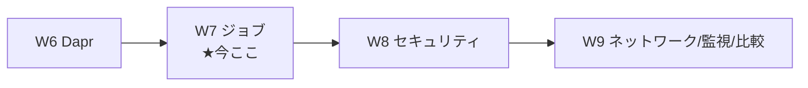
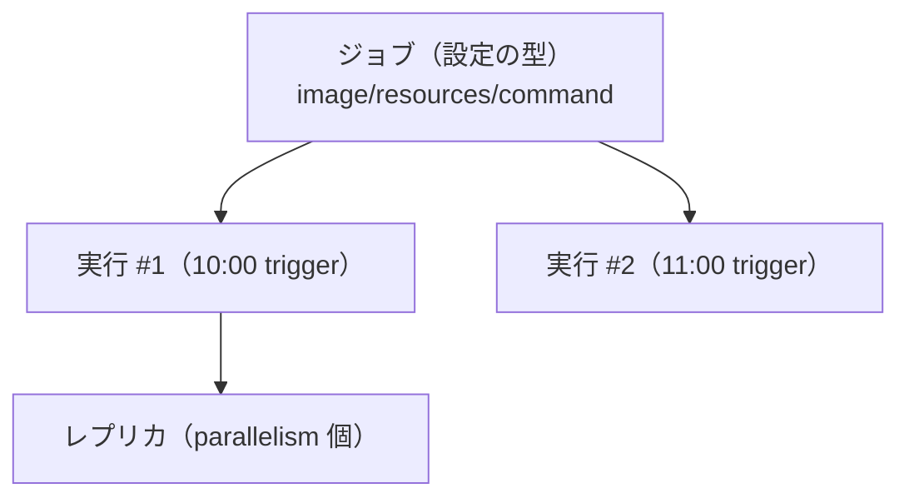
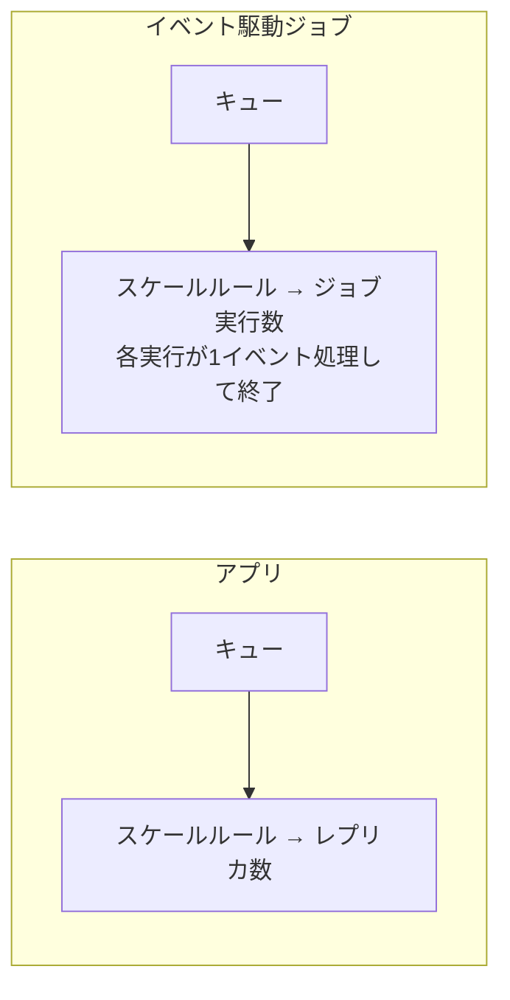

# Week 7 — ジョブ（Jobs）：実行して終わる処理を手動・スケジュール・イベント駆動で

> **Phase 1a** | 学習プラン Week 7 / 10
> 学習目標：ここまでの主役だった「動き続けるサービス（アプリ）」に対し、**実行され、有限時間で完了して止まる**ワークロード＝**ジョブ（Jobs）** を理解する。**アプリ vs ジョブ**の使い分け、ジョブの 3 概念（**ジョブ／ジョブ実行／ジョブレプリカ**）、**3 つのトリガー種別（Manual／Schedule＝cron／Event＝KEDA）**、そして**並列度（parallelism）・完了数（replicaCompletionCount）・リトライ（replicaRetryLimit）・タイムアウト（replicaTimeout）**という実行制御を掴む。W5 の KEDA が、今度は"レプリカ数"ではなく"ジョブ実行の起動数"に効く点に注目する。

---

## 0. 今週の位置づけ



W2〜W6 は常駐サービス（アプリ）が対象だった。W7 は**実行して終わる処理**を扱う。公式：

> Azure Container Apps ジョブは、**有限時間だけ実行して停止する**コンテナ化タスクを走らせられる。データ処理・機械学習・オンデマンド処理が必要な任意のシナリオに使える。（略）アプリとジョブは**同じ環境で動作し、ネットワークやログの機能を共有**する。
> （出典：[Jobs in Azure Container Apps](https://learn.microsoft.com/en-us/azure/container-apps/jobs)）

> **初学者向け用語補足：ジョブ（job）とは**
> **ジョブ**＝「一仕事」。サーバのように待ち続けるのではなく、**始まって→やることをやって→終わる**処理。夜間バッチ・データ移行・レポート生成・キュー 1 件の処理などが典型。ACA では**アプリと同じ環境の中**にジョブを置ける（VNet・ログを共有）。

---

## 1. アプリ vs ジョブ：どちらを選ぶか

ACA の計算リソースは 2 種類ある。

| | **アプリ（App）** | **ジョブ（Job）** |
| --- | --- | --- |
| 性質 | **継続的に動くサービス** | **始まって有限時間で終わるタスク** |
| コンテナ失敗時 | 自動で**再起動** | 非ゼロ終了で**失敗扱い**（リトライ可） |
| 1 単位の仕事 | 継続処理（リクエストを捌き続ける） | 通常**1 実行＝1 単位の仕事** |
| 起動 | Ingress／スケールルール | **手動／スケジュール／イベント** |
| 例 | HTTP API・Web・常駐ワーカー | 夜間レポート・データ移行・キュー 1 件処理・CI ランナー |

公式の判断例（抜粋）：

- **Service Bus キューを"継続的に"処理** → **アプリ**（カスタムスケールルール）。
- **キューの 1 件（or 小バッチ）を処理して止まる** → **ジョブ**（Event 型）。
- **毎晩レポート生成** → **ジョブ**（Schedule 型＋cron）。
- **オンデマンドの背景タスク** → **ジョブ**（Manual 型）。
- **セルフホストの GitHub Actions ランナー / Azure Pipelines エージェント** → **ジョブ**（Event 型）。

> **腑に落ちポイント**：「**捌き続ける**」ならアプリ、「**1 回やって終わる**」ならジョブ。同じ"キュー処理"でも、常駐して次々処理するならアプリ、1 メッセージごとに専用インスタンスを起こして重い処理をするならジョブ、と分かれる。

---

## 2. ジョブの 3 概念

公式の定義：

| 概念 | 説明 |
| --- | --- |
| **ジョブ（Job）** | 各実行に使う**既定の構成**を定義（イメージ・リソース・実行コマンド）。 |
| **ジョブ実行（Job execution）** | ジョブの**1 回の実行**。手動・スケジュール・イベントで起動。 |
| **ジョブレプリカ（Job replica）** | 典型的には 1 実行＝**1 レプリカ**。高度なケースでは 1 実行が**複数レプリカ**を走らせる（＝並列）。 |



> **初学者向け用語補足：ジョブ実行とレプリカの関係**
> - **ジョブ**は"設計図"、**ジョブ実行**は"その設計図を 1 回走らせたもの"、**レプリカ**は"その実行の中で並列に動く 1 個"。多くのジョブは 1 実行＝1 レプリカだが、`parallelism` を上げると 1 実行で複数レプリカを同時に走らせられる（大量データの分割処理など）。

---

## 3. トリガー種別：Manual / Schedule / Event

ジョブの `triggerType` が起動方法を決める。

### Manual（手動）

CLI・ポータル・ARM API から**オンデマンド起動**。データ移行など一回きりの処理、注文発生時に在庫処理を起動、等。

```bash
az containerapp job create \
  --name my-job -g $RG --environment $ENV \
  --trigger-type Manual \
  --replica-timeout 1800 --replica-retry-limit 0 \
  --replica-completion-count 1 --parallelism 1 \
  --image mcr.microsoft.com/k8se/quickstart-jobs:latest \
  --cpu 0.25 --memory 0.5Gi

# 作成しただけでは走らない。実行を起こす：
az containerapp job start --name my-job -g $RG
```

> **読み方**：`job create`＝ジョブ（設計図）を作る、`--trigger-type Manual`＝手動起動、`job start`＝実行を 1 回起こす。サンプル `quickstart-jobs` は数秒待ってメッセージを出して止まる。**create は設計図を置くだけ、start で初めて動く**点に注意。

### Schedule（スケジュール＝cron）

**cron 式**で定期実行。ACA は標準 cron（5 フィールド：分・時・日・月・曜日）を使い、**評価は UTC**。

| cron 式 | 意味 |
| --- | --- |
| `*/5 * * * *` | 5 分ごと |
| `0 */2 * * *` | 2 時間ごと |
| `0 0 * * *` | 毎日 0 時（UTC） |
| `0 0 * * 0` | 毎週日曜 0 時 |
| `0 0 1 * *` | 毎月 1 日 0 時 |

```bash
az containerapp job create --name my-job -g $RG --environment $ENV \
  --trigger-type Schedule --cron-expression "*/1 * * * *" \
  --replica-timeout 1800 --replica-retry-limit 0 \
  --replica-completion-count 1 --parallelism 1 \
  --image mcr.microsoft.com/k8se/quickstart-jobs:latest --cpu 0.25 --memory 0.5Gi
```

> **初学者向け用語補足：cron（クロン）式の読み方**
> **cron**＝ UNIX 由来の定期実行の仕組み。5 つの数字/記号を左から **分 時 日 月 曜**の順に並べる。`*`＝毎（任意）、`*/5`＝5 ごと、`0`＝ちょうど 0。例 `0 0 * * *` は「分=0・時=0・日=毎・月=毎・曜=毎」＝毎日 0 時。**ACA は UTC 評価**なので、日本時間（JST=UTC+9）で 9 時に走らせたいなら `0 0 * * *`（UTC 0 時＝JST 9 時）と読み替える。

### Event（イベント駆動＝KEDA）

**KEDA スケーラ**（W5 の custom と同じ）でイベント数を測り、**ジョブ実行の数**を決める。キュー着信で 1 件ずつ処理、CI ランナーの起動など。

```bash
az containerapp job create --name my-job -g $RG --environment $ENV \
  --trigger-type Event \
  --replica-timeout 1800 \
  --image docker.io/myuser/my-event-driven-job:latest --cpu 0.25 --memory 0.5Gi \
  --min-executions 0 --max-executions 10 --polling-interval 15 \
  --scale-rule-name queue --scale-rule-type azure-queue \
  --scale-rule-metadata "accountName=mystorage" "queueName=myqueue" "queueLength=1" \
  --scale-rule-auth "connection=connection-string-secret" \
  --secrets "connection-string-secret=<QUEUE_CONNECTION_STRING>"
```

公式が明快に対比する、**アプリのスケールとジョブのスケールの違い**：

> アプリとイベント駆動ジョブはどちらも KEDA スケーラを使い、ポーリング間隔でイベント量を測る。だが**結果の使い方が違う**。アプリでは各レプリカがイベントを継続処理し、スケールルールが**動かすレプリカ数**を決める。イベント駆動ジョブでは、各ジョブ実行が通常**1 イベントを処理**し、スケールルールが**動かすジョブ実行の数**を決める。
> （出典：[Jobs in Azure Container Apps](https://learn.microsoft.com/en-us/azure/container-apps/jobs)）



- `--min-executions` / `--max-executions`＝同時ジョブ実行数の下限/上限。
- `--polling-interval`＝イベントを確認する間隔（既定 30 秒、例では 15 秒）。

> **腑に落ちポイント**：W5 のアプリは「1 個のレプリカが働き続け、混んだら台数を増やす」。ジョブは「**1 イベントごとに使い捨ての実行を起こし、終わったら消える**」。1 件が重い・長い・専用リソースが要る処理は、常駐アプリより**イベント駆動ジョブ**が向く。

---

## 4. 実行制御：並列・完了数・リトライ・タイムアウト

`az containerapp job create` の主要設定：

| 設定 | ARM プロパティ | CLI | 意味 |
| --- | --- | --- | --- |
| ジョブ種別 | `triggerType` | `--trigger-type` | Manual / Schedule / Event |
| **レプリカタイムアウト** | `replicaTimeout` | `--replica-timeout` | 1 レプリカの完了を待つ**最大秒数** |
| ポーリング間隔 | `pollingInterval` | `--polling-interval` | イベント確認間隔（既定 30 秒） |
| **リトライ上限** | `replicaRetryLimit` | `--replica-retry-limit` | 失敗レプリカの**再試行回数**。`0`＝再試行せず失敗。※`replicaTimeout` が先に切れたらそちら優先 |
| **並列度** | `parallelism` | `--parallelism` | 1 実行あたりの**同時レプリカ数**（多くは `1`） |
| **完了数** | `replicaCompletionCount` | `--replica-completion-count` | 実行成功に必要な**成功レプリカ数**。**parallelism 以下**。多くは `1` |

高度な例（毎日 0 時・並列 5・5 個成功で完了・失敗は 3 回まで再試行）：

```bash
az containerapp job create --name my-job -g $RG --environment $ENV \
  --trigger-type Schedule --cron-expression "0 0 * * *" \
  --replica-timeout 1800 --replica-retry-limit 3 \
  --replica-completion-count 5 --parallelism 5 \
  --image myregistry.azurecr.io/quickstart-jobs:latest --cpu 0.25 --memory 0.5Gi \
  --command "/startup.sh" --env-vars "MY_ENV_VAR=my-value"
```

> **初学者向け用語補足：parallelism と replicaCompletionCount の関係**
> - **parallelism（並列度）**＝ 1 回の実行で**同時に何レプリカ走らせるか**。5 なら 5 個並列。
> - **replicaCompletionCount（完了数）**＝ 実行を**成功と見なすのに必要な成功レプリカ数**。parallelism=5・completion=5 なら「5 個全部成功で実行成功」、parallelism=5・completion=1 なら「1 個でも成功すれば実行成功」。**completion ≤ parallelism** が必須。
> - 使い分け：大量データを 5 分割して全部処理させたいなら 5/5。同じ処理を冗長に走らせて 1 個当たれば良いなら 5/1。

> **用語補足：replicaTimeout と replicaRetryLimit の優先**
> 失敗しても `replica-retry-limit` 回まで再試行するが、**`replicaTimeout`（最大待ち秒数）が先に切れたらタイムアウトが優先**され打ち切られる。無限に粘らない安全弁。

---

## 5. 実行の起動・上書き・履歴

- **オンデマンド起動**：どの種別のジョブでも `az containerapp job start` で即時実行できる。
- **設定の上書き**：起動時に環境変数や起動コマンドを**その実行だけ**上書きできる（YAML テンプレを渡す）。**上書き時はテンプレ全体が置き換わる**ので、必要な設定を漏らさないこと（公式の重要注記）。
- **実行履歴**：`az containerapp job execution list` で確認。スケジュール/イベントの履歴は**直近 100 件（成功・失敗）**まで。全件・詳細出力は**環境のログプロバイダ（Log Analytics）**を照会する（W9）。

```bash
# 直近の実行状態
az containerapp job execution list --name my-job -g $RG -o table
```

> **用語補足：ジョブのネットワークとサイドカー準備**
> 公式：ジョブの pod 起動時、**Envoy などのサイドカーがメイン処理の開始前に ready になることが保証**される。ゆえに**起動時のアプリ間呼び出しにリトライ処理を足す必要はない**（プラットフォームが面倒を見る）。

---

## 6. ジョブの制限（重要）

公式の「Jobs restrictions」——ジョブでは次が**非対応**：

- **Dapr**（W6 で予告したとおり。ジョブは Dapr を使えない）
- **Ingress とその関連機能**（カスタムドメイン・SSL 証明書など）

> **腑に落ちポイント**：ジョブは「外から呼ばれるサービス」ではなく「起こされて働いて消える処理」なので、**入口（Ingress）を持たない**。外部通信が要るなら**アウトバウンド**（ジョブ側から外へ接続）で行う。Dapr の恩恵（サービス呼び出し等）が要るワークロードは、ジョブではなく**アプリ**として設計する。

---

## 7. ハンズオン — 手動ジョブとスケジュールジョブを作って走らせる

### 手動ジョブ

```bash
RG=aca-learn-rg
ENV=aca-learn-env

az containerapp job create --name hello-manual -g $RG --environment $ENV \
  --trigger-type Manual \
  --replica-timeout 300 --replica-retry-limit 1 \
  --replica-completion-count 1 --parallelism 1 \
  --image mcr.microsoft.com/k8se/quickstart-jobs:latest --cpu 0.25 --memory 0.5Gi

# 実行を起こす
az containerapp job start --name hello-manual -g $RG

# 実行状態を確認（Running→Succeeded と遷移）
az containerapp job execution list --name hello-manual -g $RG -o table
```

### スケジュールジョブ（毎分）

```bash
az containerapp job create --name hello-cron -g $RG --environment $ENV \
  --trigger-type Schedule --cron-expression "*/1 * * * *" \
  --replica-timeout 300 --replica-retry-limit 0 \
  --replica-completion-count 1 --parallelism 1 \
  --image mcr.microsoft.com/k8se/quickstart-jobs:latest --cpu 0.25 --memory 0.5Gi

# 1〜2分待ってから履歴を確認（自動で実行が積まれる）
az containerapp job execution list --name hello-cron -g $RG -o table
```

### 実行のログを見る（任意）

```bash
# 直近実行のコンソール出力（ジョブがメッセージを出して終了する様子）
az containerapp job logs show --name hello-manual -g $RG --container main --follow false
```

> **読み方**：`job execution list`＝実行履歴、`job logs show`＝実行コンテナの標準出力。手動は `start` した回数だけ、スケジュールは毎分自動で実行が積まれる。**create しただけの手動ジョブは走らない／スケジュールは cron で自動**、という違いを体感する。

### 後片付け

```bash
# ジョブ単体の削除
az containerapp job delete --name hello-manual -g $RG --yes
az containerapp job delete --name hello-cron -g $RG --yes
# もしくは RG ごと
az group delete --name $RG --yes --no-wait
```

> **注意**：スケジュールジョブは放置すると毎分課金が発生し得る。学習後は**必ず削除**する。

---

## 8. 自己チェック

1. **アプリ**と**ジョブ**の違いを一言で言えるか。「継続的に捌く／1 回やって終わる」で例を 2 つずつ挙げられるか。
2. ジョブの 3 概念（ジョブ／ジョブ実行／ジョブレプリカ）を説明できるか。1 実行が複数レプリカになるのはどんな時か。
3. 3 つのトリガー種別（Manual／Schedule／Event）を、起動のされ方で言い分けられるか。**create しただけの手動ジョブ**は走るか。
4. cron 式 `0 0 * * *` は何を意味するか。ACA の cron は**どのタイムゾーン**で評価されるか。JST 9 時に走らせるには？
5. **イベント駆動ジョブ**で、KEDA のスケールルールが決めるのは「レプリカ数」か「ジョブ実行数」か。アプリのスケールとの違いは何か。
6. `parallelism` と `replicaCompletionCount` の関係は何か（制約 `completion ≤ parallelism` を含めて）。5/5 と 5/1 の使い分けは？
7. `replicaRetryLimit=0` は何を意味するか。`replicaTimeout` との優先関係は？
8. ジョブで**非対応**の 2 機能は何か。なぜジョブは Ingress を持たないのか。

---

## 9. 次週予告（W8：セキュリティ＝シークレット・マネージドID・レジストリ認証）

W5・W6・W7 で「スケールルールやレジストリの認証に**シークレットやマネージド ID**を使う」と繰り返し出てきた。W8 ではそれを正面から扱う。**シークレット（secrets）**の定義と参照（`secretRef`）、値変更時に再起動が要る理由（W4 の伏線）、**マネージド ID（system-assigned / user-assigned）**で「鍵を持たずに」Azure リソース（**ACR** からの `acrPull`、Key Vault、スケールルールの認証）にアクセスする方法、**RBAC** ロール、そして「シークレットよりマネージド ID を優先」という公式の指針を押さえる。W10 の最終 PJ で ACR からイメージを引く土台になる。

---

### 参考（出典）
- [Jobs in Azure Container Apps（ジョブ）](https://learn.microsoft.com/en-us/azure/container-apps/jobs)
- [Deploy an event-driven job（イベント駆動ジョブのチュートリアル）](https://learn.microsoft.com/en-us/azure/container-apps/tutorial-event-driven-jobs)
- [Scaling in Azure Container Apps（KEDA）](https://learn.microsoft.com/en-us/azure/container-apps/scale-app)
- [Self-hosted CI/CD runners and agents with jobs](https://learn.microsoft.com/en-us/azure/container-apps/tutorial-ci-cd-runners-jobs)
