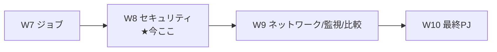

# Week 8 — セキュリティ：シークレット・マネージド ID・レジストリ認証（ACR）・RBAC

> **Phase 1a** | 学習プラン Week 8 / 10
> 学習目標：W5〜W7 で繰り返し出てきた「スケールルールやレジストリの認証に**シークレットやマネージド ID**を使う」を正面から扱う。**シークレット（secrets）**の定義（アプリスコープ）・環境変数からの参照（`secretRef`）・値変更時に再起動が要る理由（W4 の伏線回収）・**Key Vault 参照**、そして**マネージド ID（system-assigned / user-assigned）**で「鍵を持たずに」Azure リソース（**ACR** の `acrPull`・Key Vault・スケールルール認証）へアクセスする方法、**RBAC** ロール、「シークレットよりマネージド ID を優先」という公式指針を押さえる。W10 の最終 PJ で ACR からイメージを引く土台になる。

---

## 0. 今週の位置づけ



W2 で「`configuration` にシークレット・レジストリ認証が入る」、W4 で「シークレット変更は再起動が要る」、W5/W6/W7 で「スケールルールや Key Vault の認証にシークレット or マネージド ID」と断片的に触れてきた。W8 でこれらを 1 枚に束ねる。

> **初学者向け用語補足：認証（AuthN）と認可（AuthZ）**
> - **認証（AuthN, Authentication）**＝「**あなたは誰か**」を確かめること。
> - **認可（AuthZ, Authorization）**＝「その人に**何を許すか**」を決めること。
> - 本週は「アプリが Azure リソースに**自分を名乗り（認証）**、**必要な操作だけ許される（認可＝RBAC）**」を、鍵（シークレット）を持つ方式と持たない方式（マネージド ID）で見る。

---

## 1. シークレット（secrets）：機密値をアプリに安全に持たせる

公式：

> ACA はアプリケーションが**機密性の高い構成値を安全に保存**できる。シークレットは**アプリケーションレベル**で定義され、いったん定義すれば**リビジョンから参照**できる。加えて**スケールルール内でも参照**できる。
> （出典：[Manage secrets in Azure Container Apps](https://learn.microsoft.com/en-us/azure/container-apps/manage-secrets)）

シークレットの性質（W4 の復習を含む）：

- **アプリスコープ**（特定リビジョンの外側）。**追加・削除・変更しても新リビジョンは生まれない**。
- 各リビジョンは 1 つ以上のシークレットを参照でき、複数リビジョンで同じシークレットを共有可。
- **更新・削除は既存リビジョンに自動反映されない**。反映するには **① 新リビジョンをデプロイ**、または **② 既存リビジョンを再起動**する。

```bash
# シークレットを定義（name=value）
az containerapp create ... \
  --secrets "queue-connection-string=<CONNECTION_STRING>"
```

> **用語補足：なぜ「値を直書き」は本番で避けるのか**
> 公式は「**本番ではシークレット値を直接指定するのを避け、Key Vault 参照を使え**」と明記。直書きは ARM/Bicep テンプレやソース管理に平文が残るリスクがある。ARM の場合は**テンプレのパラメータとして渡す**（ソース管理に値を載せない）ことも推奨される。

### 環境変数からの参照（`secretRef`）

シークレットは**環境変数の値**として参照する。CLI では `secretref:<シークレット名>`。

```bash
az containerapp create ... \
  --secrets "queue-connection-string=<CONNECTION_STRING>" \
  --env-vars "QueueName=myqueue" "ConnectionString=secretref:queue-connection-string"
```

ARM/Bicep では `env` の要素で `value` の代わりに `secretRef` を使う（W2 で見た `containers[].env` の形）：

```json
{ "name": "ConnectionString", "secretRef": "queue-connection-string" }
```

> **初学者向け用語補足：secretRef とボリュームマウント**
> - **`secretRef`**＝「値そのもの」ではなく「**シークレットの名前で参照**」する書き方。値はアプリスコープの `secrets` に 1 か所だけ置き、環境変数・スケールルール認証から名前で引く。
> - **ボリュームマウント**＝ シークレットを**ファイルとして**コンテナに見せる方式（`/mnt/secrets/<名前>` に中身が入る）。環境変数に出したくない機密をファイル経由で読ませたいときに使う。

---

## 2. Key Vault 参照シークレット：値を Vault に置き、ACA は参照だけ持つ

より安全なのは、**値を Azure Key Vault に置き、ACA には"参照（URL）"だけ持たせる**方式。ACA が Key Vault から自動取得する。

前提：**マネージド ID を有効化**し、その ID に **Key Vault Secrets User** ロールを付与（§3・§4）。

```bash
az containerapp create ... \
  --user-assigned "<USER_ASSIGNED_IDENTITY_ID>" \
  --secrets "queue-connection-string=keyvaultref:<KEY_VAULT_SECRET_URI>,identityref:<USER_ASSIGNED_IDENTITY_ID>"
```

> **読み方**：`keyvaultref:<URI>,identityref:<ID>`＝「この Key Vault の秘密を、このマネージド ID で読んで来い」。ACA が裏で Vault にアクセスし、値を取得してシークレットとして提供する。**ACA 自身は値を保持せず、参照と ID だけ**を持つ。

> **用語補足：シークレットのローテーションと自動再起動**
> Key Vault シークレット URI は**バージョン指定あり／なし**の 2 形式。バージョン無しなら**最新版を使い、新版が出れば 30 分以内に自動取得**。**環境変数で参照するアクティブなリビジョンは、新値を拾うため自動再起動**される。これが W4 の「シークレット変更後は再起動が要る」の具体挙動。
> - **ローテーション（rotation）**＝ 鍵や接続文字列を**定期的に新しいものへ入れ替える**運用。漏洩時の被害を時間で限定する。Key Vault 参照なら入れ替えを Vault 側で完結できる。

---

## 3. マネージド ID：鍵を持たずに Azure リソースへアクセスする

**マネージド ID（managed identity）**は、Microsoft Entra ID が発行する「アプリ自身の身分証」。これを使うと**接続文字列やパスワードをアプリに持たせずに**、他の Azure リソースへ認証できる。

公式：

> Microsoft Entra ID のマネージド ID により、コンテナアプリは他の **Entra 保護リソースにアクセス**できる。
> （出典：[Managed identities in Azure Container Apps](https://learn.microsoft.com/en-us/azure/container-apps/managed-identity)）

### system-assigned と user-assigned

| 種類 | 性質 | 向くケース |
| --- | --- | --- |
| **system-assigned（システム割り当て）** | アプリに**紐づき、アプリ削除で一緒に消える**。1 アプリ 1 個 | 単一リソース内で完結・独立した ID が欲しい |
| **user-assigned（ユーザー割り当て）** | **独立した Azure リソース**。複数リソースで**共有**でき、アプリの寿命と無関係に存続。1 アプリに複数可 | 複数リソースで ID を共有・事前に権限付与したい |

### なぜマネージド ID か（公式が挙げる利点）

- **資格情報を管理しなくてよい**（鍵・パスワードをアプリに置かない）。
- **RBAC で細かい権限**を ID に付与できる。
- system-assigned は**自動生成・自動削除**。user-assigned は**付け外し自由・寿命独立**。
- **private ACR からユーザー名/パスワード無しでイメージ取得**（§4）。
- Dapr コンポーネントの接続にも使える（W6）。

> **腑に落ちポイント**：シークレット方式は「鍵を安全に**持ち運ぶ**」問題が残る（誰かが盗めば使える）。マネージド ID は「**鍵をそもそも持たない**」——アプリは Entra に「私は私」と示し、Entra が短命トークンを発行し、RBAC が許した操作だけできる。**公式の指針は「可能ならシークレットよりマネージド ID を優先」**（scale rules の項）。

### 有効化（CLI／Bicep）

```bash
# system-assigned を付与
az containerapp identity assign -n myApp -g $RG --system-assigned

# user-assigned を作成して割り当て
az identity create -g $RG -n my-identity
az containerapp identity assign -n myApp -g $RG --user-assigned <IDENTITY_RESOURCE_ID>
```

Bicep（W10 で使う形）：

```bicep
identity: {
  type: 'SystemAssigned'   // or 'UserAssigned' / 'SystemAssigned,UserAssigned'
}
```

> **用語補足：トークンとアプリ内での取得**
> マネージド ID を有効にすると、アプリ内から**内部エンドポイント（環境変数 `IDENTITY_ENDPOINT`／`IDENTITY_HEADER`）**でトークンを取れる。実装では **Azure Identity クライアントライブラリの `DefaultAzureCredential`** を使うのが定石（ローカルでは開発者の資格情報、Azure 上ではマネージド ID を自動で使い分ける）。W10 のアプリでも同じ発想。

---

## 4. レジストリ認証（ACR）：マネージド ID でイメージを引く

private レジストリ（**ACR**）のイメージを ACA で使うには認証が要る。方式は 2 つ。

| 方式 | 設定 | 安全性 |
| --- | --- | --- |
| **ユーザー名/パスワード** | `registries` に server/username/`passwordSecretRef`（シークレット参照） | 鍵を持つ必要あり |
| **マネージド ID**（推奨） | `registries` の `identity` に user-assigned の ID or `system`。username/password 不要 | **鍵を持たない** |

マネージド ID 方式の要件（公式）：ID をアプリで有効化し、その ID に**レジストリの `acrPull` ロール**を付与。

```bash
# ACR に対し、アプリのマネージドIDへ acrPull を付与（RBAC）
az role assignment create \
  --assignee <IDENTITY_PRINCIPAL_ID> \
  --role AcrPull \
  --scope <ACR_RESOURCE_ID>
```

Bicep の `registries`（W10 で使う）：

```bicep
configuration: {
  registries: [
    { server: 'myacr.azurecr.io', identity: 'system' }  // system-assigned で acrPull
  ]
}
```

> **初学者向け用語補足：ACR / acrPull / RBAC**
> - **ACR** = Azure Container Registry（Azure コンテナレジストリ）＝ Azure の private イメージ倉庫（W1 既出）。Docker Hub のレート制限を避けるためにも本番はこちら。
> - **acrPull（エーシーアール・プル）**＝ ACR から**イメージを取得（pull）できる**という RBAC ロール。push はできない最小権限。ACA はイメージを引ければよいので acrPull で十分。
> - **RBAC** = Role-Based Access Control（Role-Based＝役割ベース / Access Control＝アクセス制御）＝「**誰に・何の役割（ロール）を・どの範囲（スコープ）で**」許すかで権限を管理する仕組み。`az role assignment create --assignee <誰> --role <役割> --scope <範囲>` の 3 点セット。

### スケールルールでのマネージド ID（W5 の回収）

スケールルールの認証も、`auth`（シークレット参照）の代わりに `identity` プロパティでマネージド ID を使える。

```json
"rules": [{
  "name": "myQueueRule",
  "azureQueue": {
    "accountName": "mystorageaccount", "queueName": "myqueue", "queueLength": 2,
    "identity": "<IDENTITY_RESOURCE_ID>"
  }
}]
```

> `identity` に user-assigned の ID か `system`。**接続文字列（シークレット）を持たずに**キュー長を測れる。W5 の「KEDA 認証は Container Apps シークレット or マネージド ID」の後者がこれ。

---

## 5. RBAC ロールと最小権限

本週で出てくる代表ロール：

| ロール | 用途 |
| --- | --- |
| **AcrPull** | ACR からイメージ取得 |
| **Key Vault Secrets User** | Key Vault のシークレット読み取り |
| **Container Apps Contributor** | コンテナアプリ／ジョブの作成・管理（W7：ジョブ起動に必要） |

### ライフサイクルで ID の露出を絞る（最小権限）

公式は API `2024-02-02-preview` 以降、**どのフェーズ（init／main）にどの ID を見せるか**を制御できると説明する（`identitySettings.lifecycle`）。

| 値 | 意味 |
| --- | --- |
| `Init` | init コンテナのみ |
| `Main` | main コンテナのみ |
| `All` | 全コンテナ（既定） |
| `None` | どのコンテナにも渡さない（**ACR pull・スケールルール・Key Vault だけに使う ID** に最適） |

> **腑に落ちポイント**：たとえば「ACR からイメージを引くためだけの ID」は、**アプリのコードには一切見せたくない**（万一コードが乗っ取られても悪用されないように）。そこで `lifecycle: None` にすると、**基盤が pull には使うがコンテナ内からは使えない**。これが**最小権限（least privilege）**——「必要な主体に、必要な操作だけ、必要な範囲で」。

> **初学者向け用語補足：最小権限の原則（least privilege）**
> **最小権限**＝ どの主体にも「**仕事に必要な最小限の権限しか与えない**」設計原則。過剰な権限は、漏洩・乗っ取り時の被害を広げる。マネージド ID＋RBAC＋lifecycle 制御は、この原則を Azure 上で具体化する道具立て。

---

## 6. ハンズオン — system-assigned ID を付け、ACR から鍵無しでイメージを引く

W10 の最終 PJ の予行として、**マネージド ID で ACR pull**を通す。ACR とイメージは学習用に用意する（既にあれば流用）。

```bash
RG=aca-learn-rg
ENV=aca-learn-env
ACR=acalearn$RANDOM   # 世界で一意なACR名（英数小文字）
APP=miacrdemo

# ① ACR を作成し、サンプルイメージをビルドして置く（ACR Tasks でクラウドビルド）
az acr create -g $RG -n $ACR --sku Basic
az acr build -r $ACR -t sample/hello:v1 \
  https://github.com/Azure-Samples/containerapps-helloworld.git

# ② まず system-assigned 無しでアプリ作成（後で ID を付ける）
#    ここでは一旦 admin 無効の private ACR を ID で引く流れを作る
az containerapp create -n $APP -g $RG --environment $ENV \
  --image $ACR.azurecr.io/sample/hello:v1 \
  --registry-server $ACR.azurecr.io \
  --system-assigned \
  --target-port 80 --ingress external \
  --query properties.configuration.ingress.fqdn -o tsv
```

> **補足**：`az containerapp create --registry-server <ACR> --system-assigned` は、**system-assigned ID を作り、その ID に acrPull を自動付与**して private ACR からイメージを引くよう構成してくれる（CLI が RBAC 割り当てまで面倒を見る）。手動なら §4 の `az role assignment create ... --role AcrPull` を行う。

### 確認

```bash
# アプリに付いた ID を確認
az containerapp identity show -n $APP -g $RG -o json

# ACR 側のロール割り当て（AcrPull が付いているか）
az role assignment list --scope $(az acr show -n $ACR -g $RG --query id -o tsv) -o table
```

> **読み方**：`identity show` で `type: SystemAssigned` と `principalId` が出れば ID 有効。`role assignment list` に **AcrPull** が並べば、**ユーザー名/パスワードを一切置かずに**イメージを引けている証拠。表示された FQDN にアクセスして hello 画面が出れば pull 成功。

### 後片付け

```bash
az group delete --name $RG --yes --no-wait
```

> **W9/W10 で使うので、続けるなら削除は後でよい（ACR は課金対象なので長期放置は避ける）。**

---

## 7. 自己チェック

1. シークレットは**どのスコープ**で定義されるか。追加/変更で**新リビジョンは生まれるか**。更新を既存リビジョンに反映する 2 つの方法は？
2. 環境変数からシークレットを参照する書き方（CLI の `secretref:` / ARM の `secretRef`）を書けるか。ボリュームマウントとの違いは？
3. **Key Vault 参照シークレット**の利点は何か。値の**ローテーション**時に何が自動で起きるか（30 分・自動再起動）。
4. マネージド ID の **system-assigned と user-assigned** の違いを、寿命・共有・個数で言えるか。
5. 「**シークレットよりマネージド ID を優先**」と言われるのはなぜか。「鍵を持ち運ぶ／持たない」で説明できるか。
6. **ACR** から private イメージを引く 2 方式は何か。マネージド ID 方式で必要な RBAC ロールは何か。`az role assignment create` の 3 点セット（assignee/role/scope）を言えるか。
7. スケールルールの認証で `auth` の代わりに使えるプロパティは何か。
8. `identitySettings.lifecycle` の `None` はどんな ID に使うか。**最小権限の原則**とどう結びつくか。

---

## 8. 次週予告（W9：ネットワーク・監視・比較・運用）

W8 まででアプリの作り・公開・スケール・分散・ジョブ・セキュリティが揃った。W9 では**運用の総まとめ**：**VNet 統合**（既存仮想ネットワークの持ち込み・内部専用環境）、**ヘルスプローブ**（W4 で触れた startup/readiness に liveness を加えた 3 種）、**メトリクス／ログ監視**（Log Analytics を KQL で叩く）、**料金**（Consumption の従量・ゼロスケールの意味）、そして **AKS / App Service / ACI / Functions との使い分け表**（W1 の線引きの完成版）を扱う。これで W10 の最終 PJ（Bicep + コンテナ E2E）に必要な運用知識が揃う。

---

### 参考（出典）
- [Manage secrets in Azure Container Apps（シークレット）](https://learn.microsoft.com/en-us/azure/container-apps/manage-secrets)
- [Managed identities in Azure Container Apps（マネージド ID）](https://learn.microsoft.com/en-us/azure/container-apps/managed-identity)
- [Pull images from a private registry with managed identity（ACR pull）](https://learn.microsoft.com/en-us/azure/container-apps/managed-identity-image-pull)
- [Key Vault Secrets User ロール](https://learn.microsoft.com/en-us/azure/role-based-access-control/built-in-roles/security#key-vault-secrets-user)
