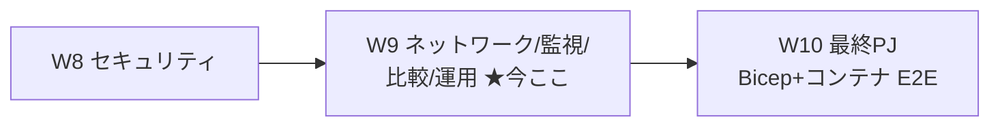
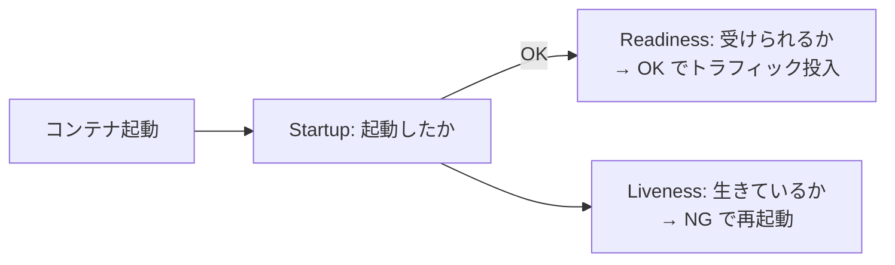
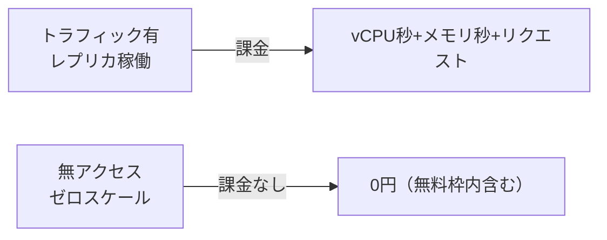
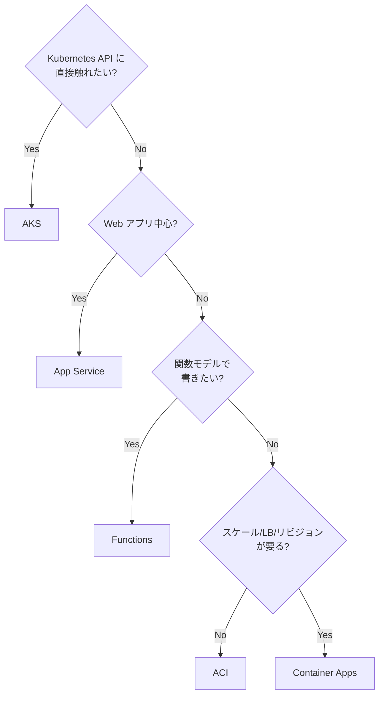

# Week 9 — ネットワーク・監視・比較・運用：VNet／ヘルスプローブ／ログ／料金／使い分け

> **Phase 1a** | 学習プラン Week 9 / 10
> 学習目標：運用の総まとめ。**ネットワーク**（環境の 2 タイプとサブネット要件・カスタム VNet・外部/内部環境・アウトバウンド制御）、**ヘルスプローブ**（W4 で触れた startup/readiness に **liveness** を加えた 3 種）、**監視／ログ**（Log Analytics を **KQL** で照会・メトリクス・ログストリーム）、**料金**（Consumption の従量課金とゼロスケールの意味）、そして **AKS / App Service / ACI / Functions との使い分け表**（W1 の線引きの完成版）を扱う。これで W10 の最終 PJ に必要な運用知識が揃う。

---

## 0. 今週の位置づけ



W2〜W8 で ACA の作り・公開・スケール・分散・ジョブ・セキュリティが揃った。W9 は「**本番で運用するために知っておくこと**」——ネットワーク設計・健全性チェック・可観測性・費用・他サービスとの選択——を横断する。

---

## 1. ネットワーク：環境の VNet が土台

ACA は**環境（＝独自の仮想ネットワークを持つ）**の中で動く（W2）。ネットワーク能力は 3 つの選択で決まる：**環境タイプ・VNet タイプ・アクセシビリティ**。

### 環境の 2 タイプ（ネットワーク観点、W2 の深掘り）

| 環境タイプ | 対応プラン | ネットワーク特徴 | 最小サブネット |
| --- | --- | --- | --- |
| **Workload profiles**（既定） | Consumption + Dedicated | **UDR・NAT Gateway 経由の egress・private endpoint** を作成可 | **`/27`** |
| **Consumption only**（レガシー） | Consumption | UDR・NAT Gateway・リモートゲートウェイ peering など**カスタム egress 非対応** | **`/23`** |

> **初学者向け用語補足：サブネット／`/27`・`/23`／egress**
> - **サブネット（subnet）**＝ VNet を区切った小ネットワーク。ACA 環境には**専用サブネット**を割り当てる（他サービスと共有不可）。
> - **`/27`・`/23`**＝ サブネットの大きさ（CIDR 表記）。数字が**小さいほど広い**。`/27`＝32 アドレス、`/23`＝512 アドレス。Workload profiles の方が少ないアドレスで足りる。
> - **egress（イーグレス）／ingress（イングレス）**＝ egress＝出ていく通信、ingress＝入ってくる通信（W3）。Workload profiles 環境は**出ていく通信の制御**（Firewall・NAT）が効く。

### VNet タイプ：既定 vs 持ち込み

- **既定**：Azure ネットワークに統合され、**インターネット公開**。作成後に**タイプ変更不可**。
- **既存 VNet の持ち込み（カスタム VNet）**：次が欲しいときに使う——NSG・Application Gateway 統合・**Azure Firewall 統合**・アウトバウンド制御・**private endpoint 越しのリソースアクセス**。**専用サブネット**が必要。

### アクセシビリティ：外部環境 vs 内部環境

| レベル | 説明 |
| --- | --- |
| **External** | 公開リクエストを受けられる。**外部公開の仮想 IP** を持つ |
| **Internal** | **公開エンドポイントを持たず**、内部 IP にマップ。内部ロードバランサ経由、IP は VNet の private IP から払い出し |

> **用語補足：W3 の「アプリの ingress」と「環境のアクセシビリティ」の違い**
> W3 の external/internal は**アプリ単位の Ingress**。W9 のここは**環境単位のアクセシビリティ**（＝環境全体が公開 IP を持つか、内部 IP だけか）。「内部環境」を選ぶと、その中のアプリは external Ingress にしても**インターネットには出ない**（環境自体が非公開）。多層防御では**内部環境＋Application Gateway/Front Door**で受ける構成が定石。

> **初学者向け用語補足：NSG／UDR／NAT Gateway／private endpoint**
> - **NSG** = Network Security Group（ネットワークセキュリティグループ）＝ サブネット/NIC に付ける**受信/送信の許可・拒否ルール**の集合。
> - **UDR** = User Defined Route（ユーザー定義ルート）＝ 通信の**経路を自分で指定**する仕組み。全 egress を Azure Firewall に通す等に使う。
> - **NAT Gateway**＝ アウトバウンド通信の**送信元 IP を固定・集約**するサービス（相手先の許可リストに載せやすい）。
> - **private endpoint**（プライベートエンドポイント）＝ Azure サービスを**VNet 内の private IP で**受ける口。インターネットに出さずに接続する。ACA では public network access を `Disabled` にすると作成可。

### ポートと IP

- 受信ポート：**HTTP/HTTPS＝80・443**（W3）。
- **Public inbound IP**（外部デプロイのアプリ通信＋内外の管理通信）／**Outbound public IP**（VNet を出る通信の送信元。**時間とともに変わり得る**、固定したいなら NAT Gateway）／**内部ロードバランサ IP**（内部環境のみ）。

---

## 2. ヘルスプローブ：健全性を基盤が定期チェック

**ヘルスプローブ（health probe）**は、ACA ランタイムがコンテナの状態を定期的に確認する仕組み。**TCP か HTTP(S)** で行う。3 種類：

| プローブ | 何を見るか |
| --- | --- |
| **Startup（起動）** | アプリが**起動に成功したか**。起動フェーズ中に走る（liveness とは別） |
| **Liveness（生存）** | アプリが**まだ生きて応答するか**。ダメなら再起動 |
| **Readiness（準備）** | レプリカが**リクエストを受けられる状態か**。ダメならトラフィックを回さない |



- **HTTP プローブ**：`200〜399` を成功とみなす。アプリ側で「DB 生存・依存の確認」など**独自ロジック**を実装できる。
- **TCP プローブ**：接続確立で成功。
- **制限**：各タイプ**1 コンテナに 1 個**、`exec` プローブ非対応、ポートは整数のみ、**gRPC 非対応**。

### 既定プローブ（Ingress 有効時）

Ingress を有効にすると、ポータルが**未定義のプローブに TCP の既定**を足す（GPU プロファイル除く）。Startup の failure threshold は 240、Readiness は 48 など。**サイドカーには自動追加されない**。

> **腑に落ちポイント（W4 の回収）**：W4 で「新版は readiness を通るまでトラフィックが来ない」と述べた。その readiness がこれ。**複数リビジョンモードでは、readiness 成功を待ってからトラフィックを移す**。単一モードは readiness 成功で自動的に切り替わる。あるレプリカが readiness に失敗すると、そのリビジョンは unhealthy 表示になり、基盤が**failure threshold を超えるまで再起動**を試みる。起動が長いアプリは `initialDelaySeconds`/`failureThreshold` を延ばして**不要な再起動を防ぐ**。

> **初学者向け用語補足：failureThreshold / initialDelaySeconds / periodSeconds**
> - **failureThreshold（失敗しきい値）**＝ 何回連続失敗したら「異常」と判定するか。
> - **initialDelaySeconds（初期遅延）**＝ コンテナ起動後、最初のチェックまで待つ秒数（起動が遅いアプリはここを延ばす）。
> - **periodSeconds（間隔）**＝ チェックの周期。

### プローブ定義（W2 で見た `containers[].probes`）

```json
"probes": [
  { "type": "Liveness",  "httpGet": { "path": "/health",  "port": 8080 }, "initialDelaySeconds": 7, "periodSeconds": 3 },
  { "type": "Readiness", "tcpSocket": { "port": 8081 }, "initialDelaySeconds": 10, "periodSeconds": 3 },
  { "type": "Startup",   "httpGet": { "path": "/startup", "port": 8080 }, "initialDelaySeconds": 3, "periodSeconds": 3 }
]
```

---

## 3. 監視とログ：Log Analytics を KQL で照会

W2 で見たとおり、環境内の全アプリは既定で**共通 Log Analytics ワークスペース**にログを送る（`stdout`/`stderr`・スケールイベント・Dapr ログ・システムイベント）。

### 主なテーブルと KQL

| テーブル | 中身 |
| --- | --- |
| `ContainerAppConsoleLogs_CL` | コンテナの**標準出力/標準エラー**（アプリのログ） |
| `ContainerAppSystemLogs_CL` | **システムイベント**（プロビジョニング・スケール等） |

```kusto
ContainerAppConsoleLogs_CL
| where ContainerAppName_s == "hello-w2"
| project TimeGenerated, Log_s
| order by TimeGenerated desc
| take 50
```

> **初学者向け用語補足：KQL / `_CL` サフィックス**
> - **KQL** = Kusto Query Language（クエリ言語）＝ Log Analytics のログ検索言語。`|`（パイプ）で「絞る→整える→並べる」を左から繋ぐ。`where`＝絞り込み、`project`＝列を選ぶ、`order by`＝並べ替え、`take`＝件数制限。
> - **`_CL`** = Custom Log（カスタムログ）、`_s`＝string 型の列の慣習。ACA が流し込むカスタムテーブルの命名。

### メトリクスとリアルタイム確認

- **メトリクス**（Azure Monitor）：CPU/メモリ使用率・**レプリカ数**・リクエスト数などを時系列で。アラートも設定可。
- **ログストリーム／コンソール**：ポータルやCLIで**リアルタイムのログ**・コンテナ内**シェル**（W3 の `az containerapp exec`）。

```bash
# リアルタイムのログ配信
az containerapp logs show -n hello-w2 -g $RG --follow
```

> **初学者向け用語補足：可観測性（observability）**
> **可観測性**＝ 外から見た出力（ログ・メトリクス・トレース）だけで**中で何が起きているか**を把握できる度合い。「ログ（何が起きた）・メトリクス（どれくらい）・トレース（どこを通った）」の 3 本柱。ACA は Log Analytics ＋ Azure Monitor ＋（Dapr の）Application Insights で揃う。

---

## 4. 料金：Consumption の従量課金とゼロスケール

Consumption プランは、大まかに次で課金される（正確な単価は公式料金ページ参照）：

- **リソース従量**：割り当てた **vCPU・メモリ**の**秒単位**の使用量。
- **リクエスト**：受けたリクエスト数。
- **アイドル料金**：処理していないがメモリに残るレプリカは、より**安いアイドル単価**（W5）。
- **無料枠**：毎月一定の vCPU 秒・メモリ秒・リクエストの**無料付与**がある（月次リセット）。

そして最重要：

> **アプリがゼロにスケールすれば、使用料はかからない。**（W5 既出）



> **腑に落ちポイント**：ACA のコスト設計は「**常時起動（min≥1）で速いが課金され続ける**」か「**ゼロスケール（min=0）で安いが起動待ち**」のトレードオフ（W5）。散発的なワークロードほどゼロスケールの恩恵が大きく、常時高トラフィックなら Dedicated や AKS の固定費が有利になり得る（§5）。

---

## 5. 使い分け表（W1 の完成版）

W1 の線引きを、ここまでの知識で更新する。

| サービス | 抽象度 | 向くワークロード | 選ぶ決め手 |
| --- | --- | --- | --- |
| **Container Apps（ACA）** | 高（K8s を隠す） | 汎用コンテナ・マイクロサービス・イベント駆動・ジョブ | サーバーレスにコンテナを、でも K8s は運用したくない。ゼロスケール・KEDA・Dapr が欲しい |
| **Container Instances（ACI）** | 最低（部品） | 単発コンテナ・ビルドエージェント | スケール/LB/リビジョン不要の**低レベル部品**が欲しい |
| **Kubernetes Service（AKS）** | 低（全部握る） | 大規模・K8s エコシステム必須・きめ細かい制御 | **Kubernetes API に直接触れたい**・独自オペレータ/CRD が要る |
| **App Service** | 高（Web 特化） | Web アプリ・Web API | **Web に最適化**された PaaS を使いたい（コード or コンテナ） |
| **Functions** | 高（関数特化） | イベント駆動の関数（FaaS） | **関数プログラミングモデル**（トリガー/バインド）で書きたい |



> **ひとことで**：「**汎用コンテナをサーバーレスに、K8s は運用したくない**」の芯に当たるのが ACA。周辺は「部品なら ACI／全部握るなら AKS／Web なら App Service／関数なら Functions」。なお ACA 上で **Functions を動かす**選択肢もあり（境界は地続き）。

### クォータ（概要）

環境・アプリには上限（クォータ）がある（レプリカ最大 1,000 等、W5）。詳細・引き上げは公式のクォータページ参照。**放置環境は 90 日で自動削除**（W2）も運用上の注意点。

---

## 6. ハンズオン — ログを KQL で照会し、ヘルスプローブを付け、メトリクスを見る

W2〜W5 で作ったアプリ（無ければ W2 手順で 1 つ作成）を対象にする。

### A：Log Analytics を KQL で照会

```bash
# 環境に紐づく Log Analytics ワークスペースID を取得
WSID=$(az containerapp env show -n $ENV -g $RG \
  --query properties.appLogsConfiguration.logAnalyticsConfiguration.customerId -o tsv)

# 直近のコンソールログを KQL で
az monitor log-analytics query -w $WSID --analytics-query \
  'ContainerAppConsoleLogs_CL | project TimeGenerated, ContainerAppName_s, Log_s | order by TimeGenerated desc | take 20' \
  -o table
```

> **読み方**：`az monitor log-analytics query -w <ワークスペース> --analytics-query '<KQL>'`＝ワークスペースに KQL を投げる。反映に数分かかることがある。ポータルの **Logs** ブレードでも同じ KQL を実行できる。

### B：ヘルスプローブを付ける（YAML 更新）

```bash
# 現在の定義を YAML で取得 → probes を追記 → 反映
az containerapp show -n hello-w2 -g $RG -o yaml > app.yaml
# app.yaml の template.containers[].probes に §2 の liveness/readiness を追記して保存
az containerapp update -n hello-w2 -g $RG --yaml app.yaml
```

> **読み方**：`template` の変更なので**新リビジョンが生まれる**（W2/W4）。readiness を通ってからトラフィックが乗ることを、リビジョン一覧の healthy 表示で確認する。

### C：メトリクスを見る（任意）

ポータルの **Metrics** で `Replica Count`・`CPU Usage`・`Requests` を時系列表示。負荷（W5 のハンズオン）と合わせるとスケールの動きが可視化できる。

### 後片付け

```bash
az group delete --name $RG --yes --no-wait
```

---

## 7. 自己チェック

1. 環境の 2 タイプ（Workload profiles／Consumption only）の**ネットワーク差**（UDR/NAT/private endpoint の可否・最小サブネット `/27` vs `/23`）を言えるか。
2. **カスタム VNet** を使う動機を 2 つ挙げられるか。作成後に VNet タイプは変更できるか。
3. **外部環境と内部環境**の違いは何か。W3 の「アプリ単位の Ingress」との違いを説明できるか。
4. ヘルスプローブ 3 種（startup/liveness/readiness）を、それぞれ「何を見て・失敗すると何が起きるか」で言えるか。HTTP プローブの成功コード範囲は？
5. **readiness プローブ**は W4 のトラフィック切替とどう関係するか。起動の遅いアプリで再起動ループを防ぐ設定は何か。
6. コンテナのログはどの KQL テーブルに入るか。`| where ... | project ... | take ...` の各段は何をするか。
7. Consumption の課金要素を 3 つ挙げ、**ゼロスケール時の料金**を言えるか。常時高トラフィックだと何が有利になり得るか。
8. ACA・ACI・AKS・App Service・Functions を、決め手 1 つずつで選び分けられるか（フローチャートを再現できるか）。

---

## 8. 次週予告（W10：最終 PJ＝Bicep + コンテナ実装 E2E）

いよいよ総仕上げ。W10 では、ここまでの知識を **Bicep（IaC）＋自前コンテナ**で 1 つの動くシステムに束ねる。`infra/main.bicep` で **Log Analytics ＋ Managed Environment ＋ Container App（Ingress・スケールルール・マネージド ID）** を宣言し、`code/` に **Python（FastAPI）＋ Dockerfile ＋ requirements** の最小アプリを用意。**ACR にイメージをビルド（`az acr build`）→ Bicep でデプロイ → 公開 URL で動作確認**という E2E を通す。検証は `az bicep build`（テンプレの構文検証）と実デプロイ。W2〜W9 の各概念が、コード 1 式にどう結晶するかを体感する。

---

### 参考（出典）
- [Networking in an Azure Container Apps Environment（ネットワーク）](https://learn.microsoft.com/en-us/azure/container-apps/networking)
- [Health probes in Azure Container Apps（ヘルスプローブ）](https://learn.microsoft.com/en-us/azure/container-apps/health-probes)
- [Log monitoring options（ログ監視）](https://learn.microsoft.com/en-us/azure/container-apps/log-monitoring)
- [Billing in Azure Container Apps（料金）](https://learn.microsoft.com/en-us/azure/container-apps/billing)
- [Comparing Container Apps with other Azure container options（比較）](https://learn.microsoft.com/en-us/azure/container-apps/compare-options)
- [Quotas for Azure Container Apps（クォータ）](https://learn.microsoft.com/en-us/azure/container-apps/quotas)
