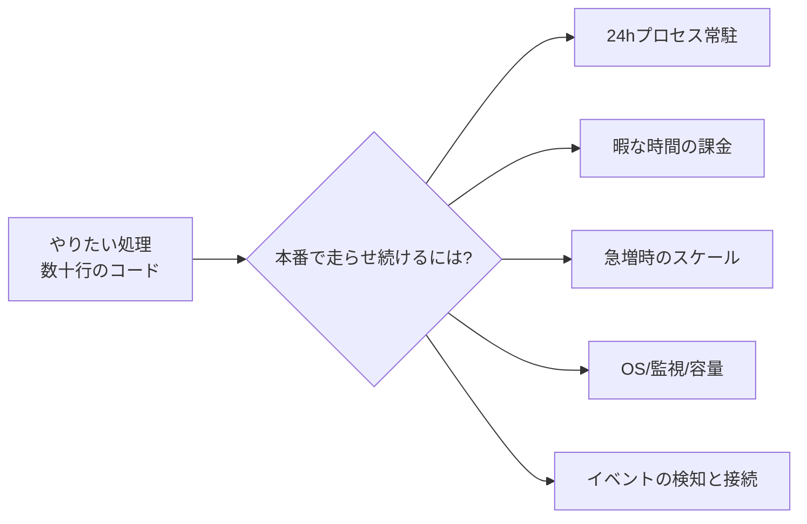
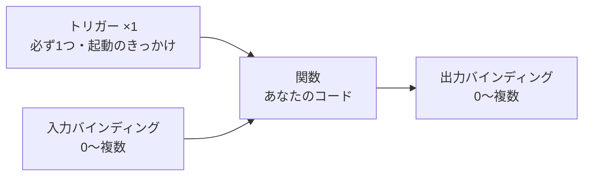

# Week 1 — Azure Functions とは何か：サーバ（インフラ）を持たず、"出来事（イベント）が起きたら少しだけコードを走らせる"サーバーレス関数基盤

> **Phase 1a** | 学習プラン Week 1 / 10
> 学習目標：Azure Functions（アジュール・ファンクションズ、以下 **Functions**）が「どんな問題を解くサービスなのか」を、素朴な選択肢（VM に常駐プロセスを立てる／App Service に Web アプリを常駐させる／Container Apps でコンテナを動かす）と対比しながら理解する。中核の発想である **「イベント（出来事）が起きたときだけ、必要な分だけコードを走らせ、暇なときは 0 個まで畳む（サーバーレス／イベント駆動）」** を掴み、Functions の心臓部である **トリガー（trigger）＝関数を起動する"きっかけ"は必ず 1 つ** という規則を言えるようになる。ハンズオンでは Core Tools（`func`）を入れ、**HTTP トリガーの関数を 1 つローカルで起動**して、クラウドに何もデプロイせずに関数が動く様子を目視する。

---

## 0. 今週の位置づけ

この教材は Azure Functions を **10 週**で学ぶ。全体像は次のとおり。

```mermaid
flowchart LR
    W1[W1 とは何か<br/>サーバーレス/イベント駆動] --> W2[W2 トリガー&バインディング<br/>宣言的I/O]
    W2 --> W3[W3 プログラミングモデル<br/>Python v2/ローカル開発]
    W3 --> W4[W4 トリガー各論<br/>HTTP/Timer/Queue/EventHub…]
    W4 --> W5[W5 ホスティング&スケール<br/>Flex Consumption/コールドスタート]
    W5 --> W6[W6 Durable Functions<br/>状態付きオーケストレーション]
    W6 --> W7[W7 セキュリティ<br/>キー/認証/マネージドID]
    W7 --> W8[W8 ネットワーキング<br/>VNet/プライベートEP]
    W8 --> W9[W9 監視・デプロイ・比較<br/>App Insights/zip deploy]
    W9 --> W10[W10 最終PJ<br/>Bicep+Python E2E]
```



今週（W1）のゴールは、**コードの書き方やバインディングの記法にはまだ立ち入らず**、「Azure Functions とは何のためのサービスで、隣接サービス（App Service・Container Apps・Logic Apps）とどう違うのか」を腹落ちさせることである。トリガーとバインディングの記法は W2、ローカル開発の実務は W3、目玉のホスティング／スケール（Flex Consumption）は W5、状態を持つ Durable は W6 で順に深掘りする。

> **初学者向け用語補足：まず前提の 4 語（サーバーレス・FaaS・イベント駆動・トリガー）**
> - **サーバーレス（serverless）**＝「サーバが無い」のではなく、**サーバの存在を利用者が意識しなくてよい**の意。台数・OS・パッチ・スケールをクラウドが裏で面倒を見て、利用者は**使った分だけ課金**され、暇なときは **0 個**まで畳める。「サーバレス＝サーバを気にしなくていい」と読み替える。
> - **FaaS（ファース）** = **F**unction **a**s **a** **S**ervice（Function=関数／as a Service=サービスとして提供）。「関数（＝小さなコードの単位）そのものを、クラウドのサービスとして走らせてもらう」形態。Azure Functions はこの FaaS の代表格。
> - **イベント駆動（event-driven）**＝ プログラムが常に回り続ける（＝ポーリング常駐）のではなく、**"何かが起きた（イベント）"のを合図にコードが起動する**設計。「HTTP リクエストが来た」「ファイルが置かれた」「時刻が来た」「キューにメッセージが入った」などが合図になる。
> - **トリガー（trigger）**＝ その"起動の合図"のこと。引き金（トリガー）を引くと関数が 1 回走る、というイメージ。Functions では **1 関数につきトリガーは必ず 1 つ**（後述）。

---

## 1. そもそもの課題：コードは書けた。で、いつ・どうやって走らせ続ける？

「アップロードされた画像を縮小したい」「毎朝 3 時に集計したい」「Web API を 1 本生やしたい」——やりたい処理そのものは、数十行のコードで書けることが多い。ところが**そのコードを本番で"待機させ続ける"**となると、とたんに考えることが増える。

- そのコードを**24 時間動かし続ける入れ物（サーバ／プロセス）**を、誰が用意して起動しておく？
- アクセスが来ない夜間も**サーバは動きっぱなし**——その間の料金は？
- 急に大量のイベントが来たら、**誰が処理役の台数を増やす**（落ち着いたら減らす）？
- 動かすマシン（VM）の **OS パッチ・容量・監視**は誰が見る？
- 「ファイルが置かれたら」「キューにメッセージが来たら」を、**どうやって検知**してコードに繋ぐ？



これらは**やりたい処理そのものではなく、処理を"待機・起動・接続・スケール"させるための周辺作業**である。ここをどこまで自分で背負うかで、選択肢が変わる。ここが Azure Functions の出発点である。

公式は Functions を次のように定義する。

> Azure Functions is a serverless solution that allows you to build robust apps while using less code, and with less infrastructure and lower costs. Instead of worrying about deploying and maintaining servers, you can use the cloud infrastructure to provide all the up-to-date resources needed to keep your applications running.
> （訳意：Azure Functions は、より少ないコード・より少ないインフラ・より低いコストで堅牢なアプリを作れるサーバーレスソリューションである。サーバのデプロイや保守に悩む代わりに、アプリを動かし続けるために必要な最新のリソースをクラウドインフラに用意させられる。）
> （出典：[Azure Functions Overview](https://learn.microsoft.com/en-us/azure/azure-functions/functions-overview)）

---

## 2. Functions の中核：「トリガーが 1 つ」と「バインディングで宣言的に繋ぐ」

Functions のプログラミングモデルは、たった 2 語で説明できる。**トリガー（trigger）**と**バインディング（binding）**である。W2 で記法まで掘り下げるが、W1 のうちに"心臓部"だけ押さえておく。

### 2-1. トリガー＝関数を起動する"きっかけ"、必ず 1 つ

> Triggers cause a function to run. A trigger defines how a function is invoked, and **a function must have exactly one trigger.**
> （訳意：トリガーは関数を実行させる。トリガーは関数がどう起動されるかを定義し、**関数は必ずちょうど 1 つのトリガーを持たねばならない**。）
> （出典：[Triggers and bindings in Azure Functions](https://learn.microsoft.com/en-us/azure/azure-functions/functions-triggers-bindings)）

「1 関数＝1 トリガー」は Functions を理解する上でいちばん大事な骨格である。関数は「〇〇が起きたら走る 1 枚の紙」のようなもので、"〇〇"（きっかけ）はちょうど 1 種類に決める。代表的なトリガーは次のとおり（各論は W4）。

| トリガー | 何が起きたら走るか | 典型用途 |
| --- | --- | --- |
| **HTTP トリガー** | HTTP リクエストが来たら | REST API・Webhook 受け口 |
| **Timer トリガー** | 指定時刻・間隔になったら | 定期バッチ・クリーンアップ |
| **Blob トリガー** | ストレージにファイルが置かれ/変わったら | 画像縮小・ファイル処理 |
| **Queue トリガー** | キューにメッセージが入ったら | 非同期ジョブの処理 |
| **Service Bus / Event Hub トリガー** | メッセージ/イベントが届いたら | 信頼性の高い連携・ストリーム処理 |

### 2-2. バインディング＝入出力の"配線"、任意で何本でも

トリガーが「起動のきっかけ」なのに対し、**バインディング**は「データの入り口・出口を宣言的に繋ぐ配線」である。

> Binding to a function is a way of declaratively connecting your functions to other resources. Bindings either pass data into your function (an *input binding*) or enable you to write data out from your function (an *output binding*)… Your function trigger is essentially a special type of input binding.
> （訳意：関数へのバインディングとは、関数を他のリソースへ**宣言的に接続する**方法である。バインディングは関数へデータを渡す（**入力バインディング**）か、関数からデータを書き出せるようにする（**出力バインディング**）。トリガーは本質的には入力バインディングの特別な一種である。）
> （出典：同上）

> Bindings are optional, and a function might have one or multiple input and/or output bindings.
> （訳意：バインディングは**任意**であり、関数は入力・出力バインディングを 1 つも持たないことも、複数持つこともある。）

つまり構造はこうなる。**きっかけ（トリガー）は 1 つ、配線（バインディング）は 0 本でも複数本でもよい。**



> **初学者向け用語補足：「宣言的（declarative）」とは**
> 「宣言的」＝ **"どうやるか（手順）"ではなく "何を繋ぐか（結果）"だけを書く**やり方。たとえば「Blob ストレージのこのコンテナに書き出す」と宣言だけしておけば、接続文字列を組み立てて SDK クライアントを作って…という手順コードを自分で書かなくても、Functions ランタイムが裏で配線してくれる。対義語は「命令的（imperative）＝手順を逐一書く」。もちろん Functions は SDK を自前で呼ぶ命令的なやり方も許す（バインディングは"任意"）が、宣言的に書けるのが売り。

---

## 3. 素朴な選択肢とその限界：Functions は"何を肩代わり"してくれるのか

同じ「クラウドでコードを動かす」でも、**"自分で背負う量"**の順に選択肢を並べると、Functions の立ち位置が見える。

| 選択肢 | やること | 限界・代償 |
| --- | --- | --- |
| **VM に常駐プロセスを立てる** | 仮想マシンを立て、自作のワーカー/Web サーバを起動しっぱなしに | 起動・再起動・スケール・OS パッチ・イベント検知**すべて自前**。夜間も課金。運用負担が最大 |
| **App Service に Web アプリを常駐** | マネージドな PaaS 上に Web アプリを常時ホスト | OS・スケール枠は任せられるが、**基本は"常駐"型**（常時課金寄り）。「イベントで 0→N」に自動で畳む発想は弱い |
| **Azure Container Apps（ACA）** | コンテナを載せ、KEDA でイベント/HTTP スケール | コンテナ単位で柔軟だが、**コンテナ化・イメージ管理が前提**。関数単位の軽量さや豊富なバインディングは持たない |
| **Azure Functions** | 関数（数十行のコード）を置くだけ。イベント検知・スケール・0 スケール・入出力配線は基盤が提供 | 長時間走り続ける処理や、フル制御が要る処理には不向き（→ ACA/AKS）。代わりに"イベントで少し走る"用途では運用の大半を肩代わり |

> **初学者向け用語補足：PaaS / IaaS（クラウドの"任せる度合い"）**
> - **IaaS（アイアース）** = **I**nfrastructure **a**s **a** **S**ervice（Infrastructure=基盤／as a Service=サービスとして）。VM・ネットワーク・ストレージといった**土台だけ**借り、OS より上は自分で面倒を見る。上の表の「VM に常駐」がこれ。
> - **PaaS（パース）** = **P**latform **a**s **a** **S**ervice（Platform=土台一式）。OS・ランタイム・スケール枠までクラウドが用意し、利用者はアプリ／コードに集中。App Service や Functions はこの系統。
> - Functions はさらに進んで **サーバーレス／FaaS**（PaaS の一種だが「常駐しない・使った分だけ・0 まで畳む」を極めた形）と位置づけられる。

### 3-1. 隣接サービスとの線引き（迷いやすい 3 つ）

- **App Service との違い**：App Service は「Web アプリ／API を**常駐**させる」PaaS。Functions は「イベントで**必要な分だけ**走る」FaaS。長く安定的にアクセスがある Web サイトは App Service、断続的なイベント処理は Functions、が素直。（なお Functions は内部的に App Service の基盤上でも動くため、"Dedicated（App Service）プラン"という選択肢もある——W5。）
- **Container Apps との違い**：どちらもイベント駆動でスケールできるが、ACA は**コンテナ**が単位で汎用的（マイクロサービス群・任意のランタイム）。Functions は**関数**が単位で軽量、豊富な**バインディング**でサービス接続を宣言的に済ませられる。なお Functions を **Container Apps 上でホストする**選択肢もあり、両者は排他ではない（W5・W9）。
- **Logic Apps との違い**：Logic Apps は**コードをあまり書かず、GUI のワークフローで**サービス連携を組む。Functions は**コードで**ロジックを書く。複雑な条件分岐や独自処理はコード（Functions）、SaaS 連携の"つなぎ"はワークフロー（Logic Apps）、と役割分担する（W9 で比較表）。

---

## 4. Functions が得意な典型シナリオ

公式が挙げる代表シナリオは、いずれも「イベントが起きたら、少しコードを走らせる」形をしている。

| やりたいこと | Functions での実現 |
| --- | --- |
| ファイルアップロードの処理 | Blob にファイルが置かれ/変わったらコード実行（Blob トリガー） |
| データのリアルタイム処理 | イベント/IoT ストリームを取り込み変換（Event Hub トリガー） |
| AI 推論の実行 | キューからテキストを取り出し AI サービスへ渡し分類 |
| 定期タスクの実行 | 定めた時刻・間隔でクリーンアップ等を実行（Timer トリガー） |
| スケールする Web API | HTTP トリガーで REST エンドポイント群を実装 |
| サーバーレスなワークフロー | 複数の関数を Durable Functions で連結（W6） |
| DB 変更への反応 | ドキュメントの作成/更新でカスタムロジック（Cosmos DB トリガー） |
| 信頼性の高いメッセージ処理 | Queue Storage / Service Bus / Event Hubs のメッセージ処理 |

（出典：[Azure Functions Overview](https://learn.microsoft.com/en-us/azure/azure-functions/functions-overview) の Scenarios 表）

---

## 5. 開発ライフサイクルとホスティングの全体像（詳細は後の週）

W1 では「こういう流れ／選択肢がある」と地図だけ持っておけばよい。

### 5-1. 開発ライフサイクル（Code → Debug → Deploy → Monitor）

公式は 4 段階を挙げる。**①コードを書く**（C#、Java、JavaScript、PowerShell、Python、Go 等——本教材は **Python**）→ **②ローカルで開発・デバッグ**（Core Tools・VS Code 等）→ **③デプロイ**（CLI／CI/CD／IDE）→ **④監視**（Azure Monitor・Application Insights）。本教材では ②を W3、③④を W9、そして W10 で通しで実践する。

> **コマンドの読み方：`func`（Azure Functions Core Tools）**
> - **`func`** = Azure Functions **Core Tools**（コアツールズ＝中核ツール群）の実行ファイル名。ローカルで関数を作る・起動する・クラウドへ発行する CLI。
> - **CLI** = **C**ommand-**L**ine **I**nterface（Command-Line=コマンド行／Interface=操作窓口）。GUI ではなく文字コマンドで操作する道具。
> - よく使う下位コマンド：`func init`（=initialize、プロジェクト雛形を作る）／`func new`（新しい関数を追加）／`func start`（ローカルで起動）／`func azure functionapp publish`（Azure の関数アプリへ発行＝デプロイ、W9/W10）。

### 5-2. ホスティングの選択肢（詳細は W5）

| ホスティング | 位置づけ（公式の要約） |
| --- | --- |
| **Flex Consumption プラン** | **推奨**。速いイベント駆動スケール・VNet 統合・従量課金。本教材の主軸 |
| **Premium プラン** | 常時ウォームで応答が速い・実行時間無制限・VNet 統合 |
| **Dedicated プラン** | 既存の App Service プラン上で、予測可能なスケール／コストで動かす |
| **Container Apps** | コンテナ化した関数アプリを ACA のマイクロサービス群と並べて配置 |
| **Consumption プラン** | 従来（レガシー）の従量プラン（Windows のみ）。新規は Flex Consumption を使う |

（出典：同上 Hosting options 表）

> **初学者向け用語補足：VNet / コールドスタート（W5 で深掘りする前振り）**
> - **VNet** = **V**irtual **Net**work（Virtual=仮想／Network=ネットワーク）。Azure 上の"自分専用の閉じたネットワーク"。関数を社内 DB や他リソースへ**インターネットに出さず**繋ぐときに使う。
> - **コールドスタート（cold start）**＝ 0 個まで畳んでいた関数に久々にイベントが来た瞬間、実行環境を起こす**初回の待ち時間**。サーバーレスの宿命で、Flex/Premium はこれを緩和する仕組みを持つ（W5）。

---

## 6. ハンズオン：HTTP トリガーの関数を 1 つ、ローカルで動かす

W1 のハンズオンは**クラウドに一切デプロイせず**、手元で関数が動くことを体験する。Azure サブスクリプションは不要（無料でできる）。

> **前提**：Python 3.11 系がインストール済みであること（`python3 --version` で確認）。Functions の Python は対応バージョンに幅があるが、本教材は 3.11 を想定する（詳細な対応は W3）。

### 手順 1：Core Tools（`func`）を入れる

macOS（Homebrew）の場合：

```bash
brew tap azure/functions
brew install azure-functions-core-tools@4
func --version   # v4 系のバージョンが出れば成功（例: 4.x.x）
```

> **コマンドの読み方**：`brew tap`＝Homebrew に"蛇口（tap）"＝追加の配布元を登録する。`@4` は **メジャーバージョン 4**（Functions ランタイム v4 系に対応する Core Tools）。他 OS の導入は W3 で扱うが、公式手順は [Core Tools のインストール](https://learn.microsoft.com/en-us/azure/azure-functions/functions-run-local) を参照。

### 手順 2：プロジェクトと関数を作る（Python v2 モデル）

```bash
mkdir hello-func && cd hello-func
func init . --python                       # Python のプロジェクト雛形を作成
func new --name hello --template "HTTP trigger" --authlevel anonymous
```

- `func init . --python`：カレントディレクトリに **Python v2 モデル**の雛形（`function_app.py`・`host.json`・`local.settings.json`・`requirements.txt`）を生成する。ファイルの意味は W3 で解剖する。
- `func new`：`--name hello`（関数名）／`--template "HTTP trigger"`（HTTP で起動する雛形）／`--authlevel anonymous`（=認証レベル匿名。**キー無しで叩ける**。認証は W7）。
- Python v2 モデルでは、生成された `function_app.py` に次のようなデコレータ式コードが追記される（記法は W2/W3）。

```python
import azure.functions as func

app = func.FunctionApp()

@app.route(route="hello", auth_level=func.AuthLevel.ANONYMOUS)
def hello(req: func.HttpRequest) -> func.HttpResponse:
    name = req.params.get("name") or "world"
    return func.HttpResponse(f"Hello, {name}!")
```

> **読み方**：`@app.route(...)` の `@`（アットマーク）は Python の**デコレータ**（decorator＝装飾子）。「この関数は route（HTTP ルート）で起動するトリガーを持つ」と**宣言的に**印を付ける。W2 で「これがトリガー定義そのもの」と繋がる。

### 手順 3：ローカルで起動して叩く

```bash
func start
```

起動ログに次のような HTTP エンドポイントが表示される。

```
Functions:
    hello: [GET,POST] http://localhost:7071/api/hello
```

別ターミナル（またはブラウザ）から叩く：

```bash
curl "http://localhost:7071/api/hello?name=Azure"
# => Hello, Azure!
```

`Hello, Azure!` が返れば成功である。**クラウドに何もデプロイしていないのに、トリガー（HTTP）→関数→レスポンス、という Functions の基本形が手元で回った**ことになる。停止は `Ctrl + C`。

> **つまずきポイント**：Python v2 の一部テンプレートはローカル起動時に **Azurite（ローカル Storage エミュレータ）** を要求することがある（`AzureWebJobsStorage` の接続先）。HTTP トリガー単体なら通常不要だが、警告が出たら W3 で扱う Azurite を先に起動しておくとよい。エラーメッセージは W3 で丁寧に解説する。

---

## 7. 自己チェック（W1）

1. 「サーバーレス」は"サーバが無い"という意味か？ 正しく言い換えると？
2. Functions における **トリガー**とは何で、1 関数に**いくつ**まで持てるか？
3. **バインディング**は必須か？ 入力・出力それぞれ何を指すか？「宣言的に繋ぐ」とはどういうことか？
4. App Service（常駐 Web）と Functions（FaaS）の使い分けを一言で説明できるか？
5. Container Apps と Functions はどう違うか。両者は排他か？
6. 新規に関数アプリを作るなら、ホスティングは第一候補としてどのプランを選ぶ（公式の推奨）か？
7. ハンズオンで、クラウドにデプロイせずに関数が動いたのはなぜか（`func` は何をしていたか）？

<details>
<summary>解答例</summary>

1. "サーバが無い"ではなく、**サーバの存在・台数・OS・スケールを利用者が意識しなくてよい**の意。使った分だけ課金され、暇なら 0 個まで畳める。
2. トリガー＝**関数を起動するきっかけ**。1 関数につき**必ずちょうど 1 つ**。
3. バインディングは**任意**（0〜複数）。入力＝関数へデータを渡す配線、出力＝関数からデータを書き出す配線。接続手順を手書きせず"何を繋ぐか"だけ宣言すれば基盤が配線してくれること。
4. 常時アクセスのある Web サイト/API は **App Service（常駐）**、断続的なイベント処理は **Functions（イベントで必要な分だけ）**。
5. ACA は**コンテナ**単位で汎用的、Functions は**関数**単位で軽量＋豊富なバインディング。Functions を ACA 上でホストする選択肢もあり**排他ではない**。
6. **Flex Consumption プラン**（公式推奨）。
7. `func`（Core Tools）が**ローカルに Functions ランタイムを起動**し、HTTP トリガーを `localhost:7071` で待ち受けていたから。デプロイは W9/W10。

</details>

---

## 8. 次週予告（W2：トリガー & バインディング）

W2 では、W1 で"心臓部"として押さえた**トリガーとバインディング**を、実際の**記法**まで掘り下げる。

- トリガーは 1 つ・バインディングは 0〜複数、という骨格を **Python v2 のデコレータ**（`@app.route`・`@app.blob_input`・`@app.queue_output` など）でどう表現するか。
- 旧モデルの `function.json`（JSON でバインディングを宣言）と、新しい**デコレータ式**の対応関係。
- **バインディング式**（`%設定名%` でアプリ設定を差し込む・`{queueTrigger}` でトリガーの値を参照）。
- バインディングを支える**拡張バンドル（extension bundles）**とは何か。

「1 関数＝1 トリガー＋任意の配線」という W1 の骨格を、コードで書けるようにするのが W2 のゴールである。

---

### 出典（公式ドキュメント）

- Azure Functions Overview — <https://learn.microsoft.com/en-us/azure/azure-functions/functions-overview>
- Triggers and bindings in Azure Functions — <https://learn.microsoft.com/en-us/azure/azure-functions/functions-triggers-bindings>
- Azure Functions scenarios — <https://learn.microsoft.com/en-us/azure/azure-functions/functions-scenarios>
- Work with Azure Functions Core Tools（ローカル開発） — <https://learn.microsoft.com/en-us/azure/azure-functions/functions-run-local>
- Azure Functions hosting options — <https://learn.microsoft.com/en-us/azure/azure-functions/functions-scale>
