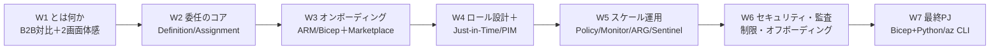
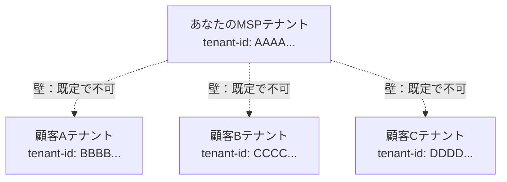
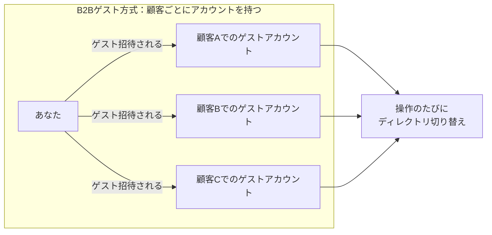
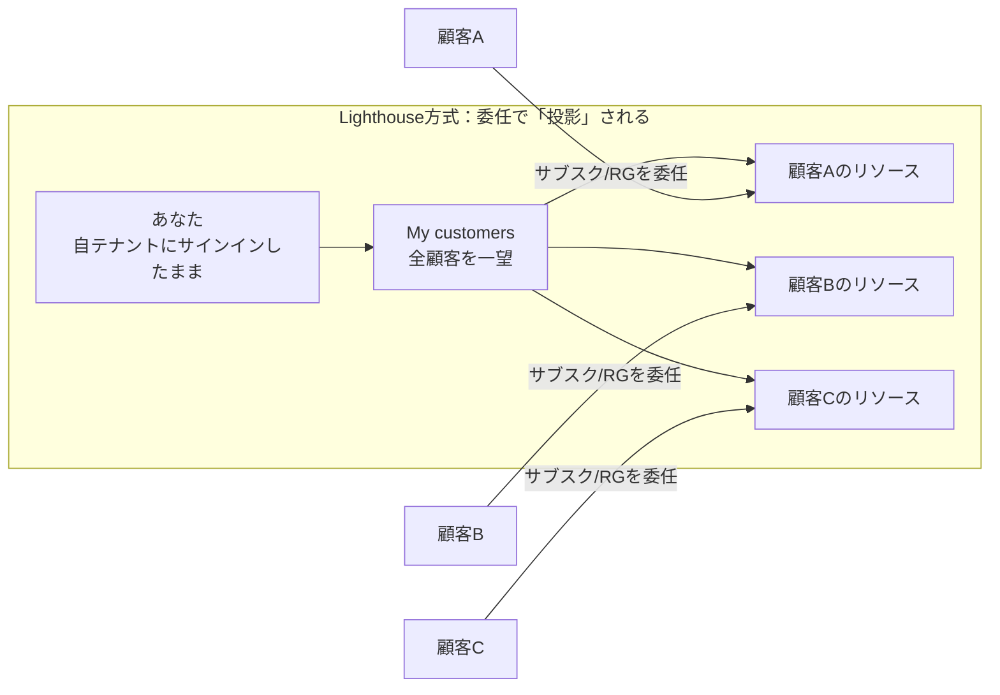
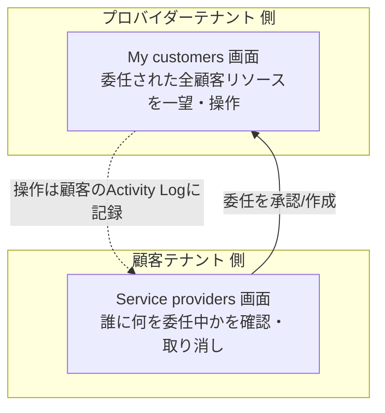

# Week 1 — Azure Lighthouse とは何か：複数の顧客テナントの Azure を、自分のテナントから切り替えなしで一元管理する仕組み

> **Phase 1a** | 学習プラン Week 1 / 7
> 学習目標：Azure Lighthouse（アジュール・ライトハウス）が「どんな問題を解くサービスなのか」を、素朴な解法（B2B ゲスト方式）と対比しながら理解する。中核概念である **クロステナント委任管理（Azure delegated resource management）** の全体像を掴み、ポータルの **「My customers」** と **「Service providers」** の 2 画面を自分の目で開いて、後で委任が乗る"器"を確認できるようになる。

---

## 0. 今週の位置づけ

この教材は Azure Lighthouse を **7 週**で学ぶ。全体像は次のとおり。



今週（W1）のゴールは、**API やテンプレートの書き方にはまだ立ち入らず**、「Azure Lighthouse とは何のためのサービスか」を腹落ちさせることである。委任の 2 オブジェクト（Registration Definition / Assignment）は W2、実際のオンボーディングは W3 以降で順に深掘りする。

> **初学者向け用語補足：略語・用語の展開**
> - **Lighthouse**＝「灯台」。多数の顧客（船）を 1 か所（灯台）から見渡すイメージの製品名。機能名ではなくブランド名。
> - **テナント（tenant）**＝ Microsoft Entra ID（旧 Azure AD）の**組織 1 個分の入れ物**。会社ごとに 1 つ持ち、世界で一意な **テナント ID（GUID）** を持つ。テナント同士は既定で**完全に隔離**されている（これが後の「壁」になる）。
> - **Microsoft Entra ID**（マイクロソフト・エントラ・アイディー）＝ 旧称 Azure Active Directory（Azure AD）。Azure の**認証・ID 基盤**。「誰か（ユーザー）」を管理する場所。
> - **サブスクリプション（subscription）**＝ Azure の**課金と管理の単位**。リソースはこの中に置かれ、サブスクリプションはいずれか 1 つのテナントに属する。
> - **RBAC** = Role-Based Access Control（Role=役割 / Based=基づく / Access=アクセス / Control=制御）＝「役割ベースのアクセス制御」。誰に・どのスコープで・何ができる役割（ロール）を与えるかの仕組み。
> - **MSP** = Managed Service Provider（Managed=受託運用する / Service=サービス / Provider=提供者）＝「顧客の IT を代行運用する事業者」。Lighthouse の主な利用者像。
> - **クロステナント（cross-tenant）**＝「テナントをまたぐ」。本来隔離されているテナントの壁を越えて操作すること。

---

## 1. そもそもの課題：複数の顧客の Azure を「代行運用」する現場

あなたが MSP（マネージドサービスプロバイダー）だとする。10 社の顧客の Azure を預かり、監視・パッチ適用・ポリシー適用・障害対応を代行する契約を結んでいる。ここで最初の壁にぶつかる。

> **初学者向け用語補足：「プロバイダー」とは何者か —「会社の種類」ではなく「役割」**
> Lighthouse で言う **プロバイダー（service provider）** とは、**顧客の Azure を"管理する側"のテナント**のこと。公式用語では **managing tenant（管理テナント）** と呼ぶ。反対に、管理される顧客側は **customer / managed tenant（管理される側）**。
>
> ```mermaid
> flowchart LR
>     P[プロバイダー＝managing tenant<br/>管理する側] -->|委任を受けて操作| C[顧客＝managed tenant<br/>管理される側]
> ```
>
> ここで大事なのは、**プロバイダー／顧客は"立場（役割）"の呼び名であって、会社の種類ではない**という点：
> - **典型例は MSP**（他社の IT を代行運用する事業者）。この場合プロバイダー＝MSP、顧客＝その取引先企業、で「別々の会社」になる。
> - **でも別会社とは限らない**。たとえば大企業が、部門ごと・買収した子会社ごとに Azure テナントを複数持っていて、それを**本社の 1 テナントからまとめて管理**したい——このとき「本社テナント＝プロバイダー、各部門テナント＝顧客」になる。**同じ会社の中**でもプロバイダー／顧客の関係が成り立つ（公式もこの "enterprise" シナリオを想定）。
> - つまり「プロバイダー」＝**あなたが今サインインしていて、そこから他テナントを見に行く"拠点"となるテナント**、と捉えるとよい。本教材では分かりやすさのため「MSP が顧客を管理する」設定で通すが、頭の中では「管理する側テナント」と読み替えて構わない。
>
> 用語は W2 以降でも繰り返し出る：**managing tenant＝プロバイダー、managed tenant＝顧客**。この 2 語だけ先に頭に入れておくと迷わない。

**Azure のテナントは、既定でお互い完全に隔離されている。** 自分の会社のテナントにサインインしても、顧客のテナントの中は一切見えないし、触れない。テナント ID が違えば別世界、というのが Azure の基本ルールである。



つまり「10 社を効率よく回す」以前に、そもそも**他社テナントのリソースをどうやって操作する権限を得るのか**が問題になる。ここが Lighthouse の出発点である。

---

## 2. 素朴な解法＝「B2B ゲスト方式」とその限界

Lighthouse が無かった時代の定番は、**顧客テナントに"ゲストユーザー"として招いてもらう**方式だった。公式もこの従来型を次のように描写する。

> 従来は、顧客の Azure リソースを管理するとき、サービスプロバイダーは**顧客テナントに紐づくアカウントでサインイン**しなければならず、顧客テナントの管理者がプロバイダー用のユーザーアカウントを作成・管理する必要があった。
> （出典：[Cross-tenant management experiences](https://learn.microsoft.com/en-us/azure/lighthouse/concepts/cross-tenant-management-experience)）

これを図にすると次のとおり。



> **用語補足：B2B ゲスト（Azure AD B2B guest）とは**
> **B2B** = Business to Business（企業間）。ある組織のユーザーを、**別組織のテナントに"ゲスト"として招く**仕組み。招かれた側は相手テナントの中でユーザーアカウント（ゲスト）を持つ。「相手の会社の入館証を 1 枚もらう」イメージ。

この方式には現場で効く不便が積み上がる。

| 限界 | 具体的に何が困るか |
| --- | --- |
| **ディレクトリ切り替え地獄** | 顧客 A を触るには A に、B を触るには B にサインイン（コンテキスト）を切り替える。10 社なら 10 回の往復。「全顧客を一望」ができない |
| **アカウントが増殖** | 顧客テナントごとにゲストアカウントが 1 つずつできる。退職者の棚卸し・MFA 設定・棚卸監査が顧客数ぶん発生 |
| **顧客側の運用負担** | ゲストの作成・権限付与・削除を**顧客テナントの管理者が**やらねばならない。プロバイダーを増減するたび顧客に手間をかける |
| **自動化しづらい** | 「全顧客に同じポリシーを一括適用」といった横断操作が、テナントをまたげず素直に書けない |

> **用語補足：ディレクトリ切り替え（directory switching / context switching）**
> Azure ポータル右上のアカウントメニューから「ディレクトリの切り替え」で別テナントに移る操作。ゲスト方式では顧客を替えるたびにこれが要る。作業のたびに別部屋へ移動して鍵を持ち替えるようなもの。

---

## 3. Azure Lighthouse の正体：クロステナント委任管理（投影）

ここで登場するのが Azure Lighthouse である。公式の定義（要約）：

> Azure Lighthouse は、スケーラビリティ・高い自動化・強化されたガバナンスを伴う**マルチテナント管理**を可能にする。サービスプロバイダーは Azure に組み込まれたツールで受託管理サービスを提供でき、**顧客は「誰が」「どのリソースに」「何を」できるかの制御を保持し続ける**。
> （出典：[What is Azure Lighthouse?](https://learn.microsoft.com/en-us/azure/lighthouse/overview)）

中核機能が **Azure delegated resource management（Azure 委任リソース管理）** である。公式いわく、これは「**コンテキストとコントロールプレーンを切り替えることなく、自分のテナントの中から顧客の Azure リソースを安全に管理する**」仕組みだ（出典：同 overview）。

やることの本質は 1 つ。**顧客が、自分のサブスクリプション（またはリソースグループ）を、プロバイダーテナントの「特定のユーザー／グループ＋ロール」に対して委任（delegate）する。** すると、そのリソースがプロバイダーテナントに"投影"され、プロバイダーは**自分のテナントにサインインしたまま**顧客リソースを操作できる。



B2B との決定的な違いは次の 2 点。

- **サインインは自分のテナント 1 つだけ**。ディレクトリ切り替えが消える。全顧客を「My customers」画面で一望できる。
- **顧客テナントにプロバイダー用のユーザーアカウントを作らない**。委任するのは「プロバイダーテナントの既存ユーザー／グループ」への"権限の橋渡し"であって、アカウントの増殖が起きない。

> **用語補足：委任（delegation）とは「アカウントを渡す」ではなく「権限の橋を架ける」**
> 委任とは、顧客が「私のこのサブスクリプションに対して、プロバイダーテナントの"このグループ"に"Reader と Contributor"を許す」と宣言すること。プロバイダー側は**自分のテナントのメンバーのまま**、その橋を通って顧客リソースに手が届く。入館証（B2B ゲスト）を発行し合うのではなく、**2 つのビルの間に専用連絡通路を 1 本つける**イメージ。通路の幅（ロール）と行き先（スコープ）は顧客が決め、いつでも撤去できる。

> **用語補足：コントロールプレーン（control plane）とデータプレーン（data plane）**
> - **コントロールプレーン**＝リソースを**作る・消す・構成する・権限を与える**といった"管理操作"の面。入口は `https://management.azure.com`（Azure Resource Manager）。
> - **データプレーン**＝リソースの**中身に触る**面。例：Blob の中身を読む（`https://<account>.blob.core.windows.net`）、Key Vault のシークレット取得（`https://<vault>.vault.azure.net`）。
> - **重要**：Azure Lighthouse が委任で扱えるのは基本的に**コントロールプレーン側**（ARM が処理する操作）。Blob の中身や Key Vault シークレットのような**データプレーン操作は範囲外**（公式の Current limitations に明記）。この線引きは W6 で詳しく扱う。

---

## 4. 用語の地図（今週つかむ語）と 2 つのポータル画面

Lighthouse は「プロバイダー側」と「顧客側」で見える画面・立場が異なる。まずこの対称構造を押さえる。



| 用語 | 一言でいうと | どちら側 | 深掘りする週 |
| --- | --- | --- | --- |
| **My customers（マイ カスタマーズ）** | 委任された全顧客のリソースを一望・操作するプロバイダー側の画面 | プロバイダー | W3〜 |
| **Service providers（サービス プロバイダーズ）** | どのプロバイダーに何を委任しているかを確認し、**取り消せる**顧客側の画面 | 顧客 | W6 |
| **Registration Definition（登録定義）** | 「どのプロバイダーテナントの・誰に・どのロールを」を定義する ARM オブジェクト | 委任の設計図 | **W2** |
| **Registration Assignment（登録割り当て）** | その定義を「顧客のどのスコープ（サブスク/RG）に効かせるか」を結びつける ARM オブジェクト | 委任の適用 | **W2** |
| **Managing tenant / Managed tenant** | 管理する側（プロバイダー）／ 管理される側（顧客）のテナント | 両側 | 全体 |

> **用語補足：`managedByTenants` / `homeTenantId` という"しるし"**
> 委任が効いているサブスクリプションには、Azure 側に「このサブスクは別テナントからも管理されている」というしるしが付く。CLI では `az account list` の各サブスクに **`homeTenantId`（本来の所属テナント）** と **`managedByTenants`（管理を委ねている相手テナントの一覧）** が現れる（出典：[Cross-tenant management experiences](https://learn.microsoft.com/en-us/azure/lighthouse/concepts/cross-tenant-management-experience)）。今週のハンズオンでこの属性の"枠"を目視する。

---

## 5. 間違えやすいものとの線引き

「テナントをまたぐ／代行する」系は紛らわしい。ここで交通整理する。

| もの | 何をするか | Lighthouse との違い |
| --- | --- | --- |
| **Azure Lighthouse** | 顧客の Azure リソースを、プロバイダーテナントから委任で管理 | **ARM（コントロールプレーン）操作の委任**が本質。ここが主役 |
| **Azure AD B2B ゲスト** | 相手テナントに"ゲストアカウント"として招かれる | アカウントが増える・切り替えが要る。Lighthouse はこれを不要にする |
| **Azure Managed Applications** | ベンダーが作った"パッケージ"を顧客が配置し、ベンダーが中を運用 | 対象は「特定のアプリ製品」。Lighthouse は顧客の**任意のリソース**が対象（両者は連携も可） |
| **Azure Arc** | Azure 外（オンプレ/他クラウド）のサーバ等を Azure の管理下に載せる | 対象は"場所"の拡張。Lighthouse は"テナント"の壁の越え方。**Arc したリソースを Lighthouse で横断管理**という合わせ技もある |
| **Management Group（管理グループ）** | **同一テナント内**で複数サブスクを階層でまとめる | あくまでテナント内。Lighthouse は**テナントをまたぐ**点が決定的に違う |
| **Microsoft 365 Lighthouse** | M365（Intune 等）を MSP が横断管理する別製品 | 対象が M365。本教材の Azure Lighthouse とは別物 |

> **ひとことで**：「他社テナントの Azure リソースを、自分のテナントから触りたい」なら Azure Lighthouse。「相手テナントにゲストで入る」のが B2B、「同一テナント内でサブスクを束ねる」のが管理グループ、「Azure 外の機材を Azure 管理下に載せる」のが Arc。

---

## 6. ハンズオン — ポータルで「委任の器」となる 2 画面を開き、CLI で属性の枠を見る

今週は**まだ委任を作らない**（委任には顧客側の同意＝実質 2 テナントが要る。作成は W3）。代わりに、後で委任が乗る**空の受け皿**を自分の目で確認する。1 テナントしか無くても実施できる。

> **前提**：Azure サブスクリプションがあり、ポータルにサインインできること。Lighthouse 自体は**追加料金なし**（出典：[overview](https://learn.microsoft.com/en-us/azure/lighthouse/overview) の "There's no extra cost"）。今週は課金対象リソースを一切作らない。

### 手順 A：プロバイダー側の「My customers」を開く

1. [Azure ポータル](https://portal.azure.com) 上部の検索窓に **`Azure Lighthouse`** と入力して開く。
2. 左メニューの **「My customers（マイ カスタマーズ）」** を開く。
3. まだ委任がないので **一覧は空**（"No delegations" 相当）で正しい。ここが「委任された顧客リソースが将来並ぶ場所」だと確認する。

### 手順 B：顧客側の「Service providers」を開く

1. 同じく検索窓から **「Service providers（サービス プロバイダーズ）」** を開く（または Lighthouse 画面内から遷移）。
2. こちらも委任がなければ **空**。ここが「自テナントが"どのプロバイダーに何を委任しているか"を確認し、**いつでも取り消せる**」顧客側の管制画面である。

> **なぜ両方が空で正解なのか**：委任はまだ 1 件も存在しないため。今週確認したいのは「プロバイダー側（My customers）と顧客側（Service providers）という**対称な 2 つの器**が実在し、将来ここに委任が現れる」という土台の把握である。実際に委任を 1 件流し込むのは W3。

### 手順 C：CLI でサブスクリプションの属性の"枠"を見る

```bash
az account list --output table
```

> **コマンドの読み方**：`az`=Azure CLI（Command Line Interface＝コマンドライン操作）、`account list`=サインイン中に見えるサブスクリプション一覧、`--output table`=表形式で表示。

さらに、Lighthouse 由来の属性を JSON で覗く。

```bash
az account list --query "[].{name:name, homeTenantId:homeTenantId, managedByTenants:managedByTenants}"
```

> **読み方**：`--query`=結果を絞り込む式（JMESPath という記法）。ここでは各サブスクの **`name` / `homeTenantId`（本来の所属テナント）/ `managedByTenants`（管理を委ねた相手テナント）** だけ抜き出す。単一テナント環境では `managedByTenants` は空 `[]` になる——これが「まだ誰にも委任していない」正しい状態。W3 で委任すると、顧客側で見たときにここに相手テナント ID が入る。
>
> もし属性が表示されない場合、公式はキャッシュ更新として `az account clear` → 再ログインを案内している（出典：[Cross-tenant management experiences](https://learn.microsoft.com/en-us/azure/lighthouse/concepts/cross-tenant-management-experience)）。

### 後片付け

今週は**リソースを一切作っていない**（画面を開き、一覧を表示しただけ）。したがって削除も不要。放置課金は発生しない。

---

## 7. 自己チェック

以下に自分の言葉で答えられれば W1 は合格である。

1. Azure のテナントは既定でどういう関係にあるか。なぜ「他社テナントの Azure を触る」のに一工夫が要るのか。
2. **B2B ゲスト方式**の 4 つの限界（切り替え／アカウント増殖／顧客側負担／自動化困難）をそれぞれ一言で説明せよ。
3. **Azure delegated resource management（委任リソース管理）** は、B2B ゲストと何が本質的に違うか。「サインインは◯◯だけ」「顧客テナントに◯◯を作らない」の形で言えるか。
4. **委任**とは「アカウントを渡す」ことか、それとも何か。たとえで説明せよ。
5. **My customers** と **Service providers** は、それぞれどちら側（プロバイダー／顧客）の、何のための画面か。
6. Lighthouse が扱えるのは**コントロールプレーン**か**データプレーン**か。Blob の中身読み取りは委任で扱えるか。
7. Lighthouse・B2B ゲスト・管理グループ・Azure Arc の違いを、1 行ずつで言い分けられるか。

---

## 8. 次週予告（W2：委任のコア 2 オブジェクト）

W2 では、今週「器」として眺めた委任の**中身**に踏み込む。委任は 2 つの ARM オブジェクトでできている——**Registration Definition（登録定義：どのプロバイダーテナントの・誰＝プリンシパルに・どのロールを）** と **Registration Assignment（登録割り当て：その定義を顧客のどのスコープに効かせるか）**。`authorizations`（プリンシパル ID × ロール定義 ID の組）の構造、サブスク単位とリソースグループ単位のスコープの違いを理解する。これが W3 の「実際に Bicep/ARM でオンボードする」の設計図になる。

---

### 参考（出典）
- [What is Azure Lighthouse?（概要）](https://learn.microsoft.com/en-us/azure/lighthouse/overview)
- [Cross-tenant management experiences（クロステナント管理体験）](https://learn.microsoft.com/en-us/azure/lighthouse/concepts/cross-tenant-management-experience)
- [Azure Lighthouse architecture（アーキテクチャ）](https://learn.microsoft.com/en-us/azure/lighthouse/concepts/architecture)
- [Tenants, users, and roles（テナント・ユーザー・ロール）](https://learn.microsoft.com/en-us/azure/lighthouse/concepts/tenants-users-roles)
- [View and manage customers（My customers 画面）](https://learn.microsoft.com/en-us/azure/lighthouse/how-to/view-manage-customers)
- [View and manage service providers（Service providers 画面）](https://learn.microsoft.com/en-us/azure/lighthouse/how-to/view-manage-service-providers)
