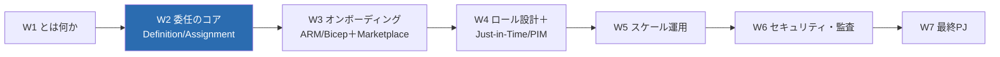
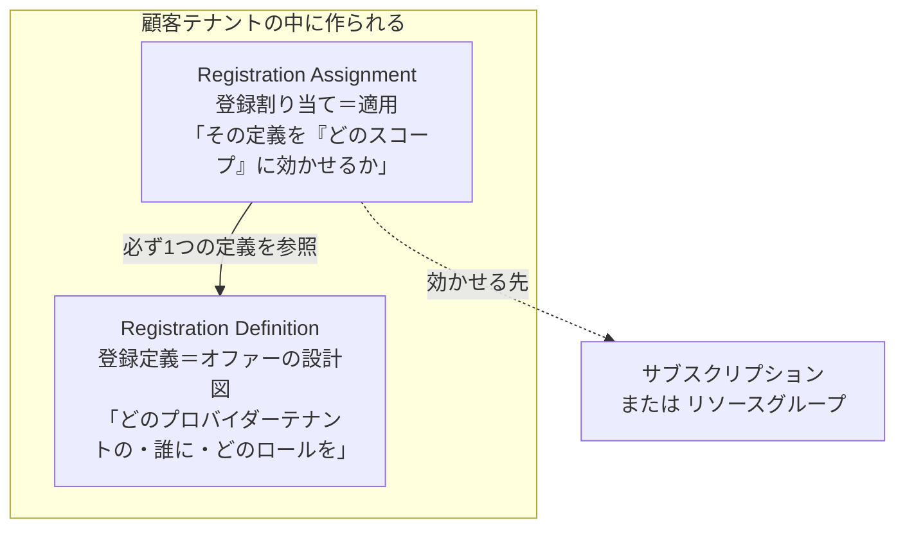
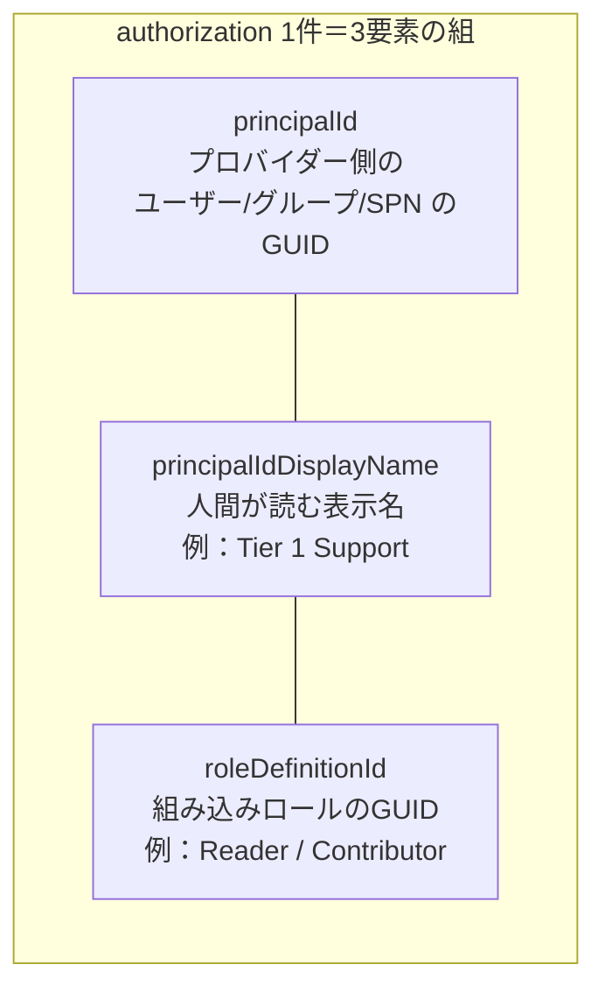
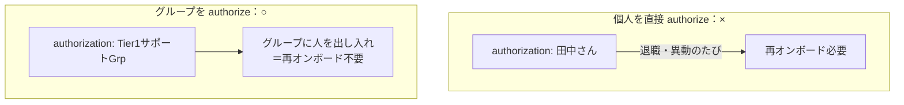
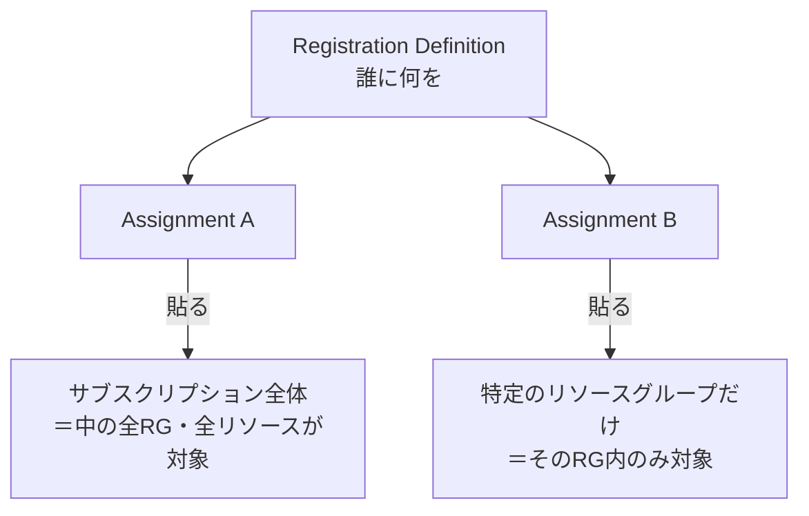
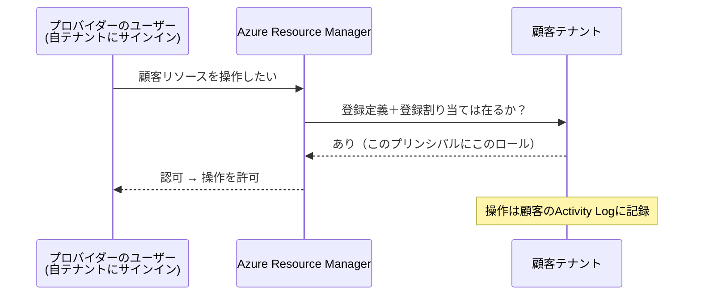

# Week 2 — 委任のコア 2 オブジェクト：Registration Definition と Registration Assignment

> **Phase 1b** | 学習プラン Week 2 / 7
> 学習目標：Azure Lighthouse の委任が、顧客テナントに作られる **2 つの ARM リソース**——**Registration Definition（登録定義）** と **Registration Assignment（登録割り当て）**——でできていることを理解する。定義の中身（`managedByTenantId` と `authorizations`）、`authorizations` の 3 要素（プリンシパル ID × ロール定義 ID × 表示名）、割り当てが効くスコープ（サブスクリプション単位 / リソースグループ単位）、そして「論理射影（logical projection）」で ARM がどう認可するかを、W3 で実際にオンボードする前の"設計図"として掴む。

---

## 0. 今週の位置づけ



W1 では委任を「器（My customers / Service providers の 2 画面）」として外から眺めた。今週はその**中身**を開ける。委任は魔法ではなく、**顧客テナントに 2 つのリソースを作るだけ**の、きわめて素直な仕組みである。この 2 つの正体が分かれば、W3 の Bicep/ARM オンボーディングは「このリソースを作るテンプレートを書くだけ」に見えてくる。

> **初学者向け用語補足：略語・用語の展開**
> - **ARM** = Azure Resource Manager（Azure=アジュール / Resource=リソース / Manager=管理者）＝ Azure のすべての「作る・消す・構成する」操作を受け付ける**管理の玄関口**。入口 URL は `https://management.azure.com`。Bicep / ARM テンプレートはこの ARM に「こういうリソースを作れ」と宣言する仕組み。
> - **リソースプロバイダー（Resource Provider, RP）**＝ ある種類のリソースを扱う担当モジュール。命名は `Microsoft.<名前>`。Lighthouse の担当は **`Microsoft.ManagedServices`**。委任の 2 リソースはこの RP が提供する。
> - **プリンシパル（principal）**＝「権限を与える相手」の総称。**ユーザー / グループ / サービスプリンシパル（SPN）** のいずれか。各プリンシパルは Entra ID 上で一意な **オブジェクト ID（GUID）** を持つ。
> - **SPN** = Service Principal（Service=サービス / Principal=主体）＝ 人間ではなく**アプリ／自動化が使う ID**。CI/CD やスクリプトが Azure を操作するときの"ロボット用アカウント"。
> - **スコープ（scope）**＝ 権限や委任が**効く範囲**。Azure では 管理グループ ⊃ サブスクリプション ⊃ リソースグループ ⊃ 個別リソース の階層。Lighthouse の委任はこのうち**サブスクリプション**または**リソースグループ**を対象にできる。
> - **ロール定義 ID（roleDefinitionId）**＝ 組み込みロール（Reader / Contributor 等）を指す **GUID**。ロール名ではなく、この GUID でテンプレートに書く。

---

## 1. 委任は「顧客テナントに作る 2 つのリソース」でできている

公式の核心を要約する。

> 顧客のサブスクリプションまたはリソースグループが Azure Lighthouse にオンボードされると、**2 つのリソースが作られる**：**registration definition（登録定義）** と **registration assignment（登録割り当て）** である。
> （出典：[Azure Lighthouse architecture](https://learn.microsoft.com/en-us/azure/lighthouse/concepts/architecture)）

重要なのは、**この 2 つは"顧客テナントの中"に作られる**という点だ。委任はプロバイダー側が勝手に張るものではなく、**顧客テナントで（顧客の権限を持つ人が）デプロイして初めて成立する**（誰がデプロイできるかは §6・W3 で扱う）。



- **Registration Definition（登録定義）**＝「**誰に何を許すか」の設計図**。まだ"どこに"効かせるかは含まない。
- **Registration Assignment（登録割り当て）**＝ その設計図を「**顧客のどのスコープに適用するか**」を結びつける。

この 2 段構えは RBAC の「ロール定義（何ができるか）」と「ロール割り当て（誰に・どこで）」の分離とよく似ている。**定義は再利用可能な設計、割り当ては具体的な適用**、と捉えるとよい。

> **用語補足：なぜ 2 つに分かれているのか**
> 「設計（definition）」と「適用（assignment）」を分けると、同じオファー内容を複数スコープに使い回せる・管理しやすい、という利点がある。ただし後述のとおり Lighthouse では**定義は必ずサブスクリプション単位で作られる**制約があり、実務上は「1 デプロイで定義＋割り当てをセットで作る」ことがほとんど。まずは「**設計図（Definition）と、それをどこに貼るかの付箋（Assignment）**」という役割の違いを押さえればよい。

---

## 2. Registration Definition（登録定義）の中身

定義が保持する情報は、大きく次の 2 つ（＋顧客に見せる名前）。

| フィールド | 意味 |
| --- | --- |
| `managedByTenantId` | **管理する側（プロバイダー）のテナント ID**。「このテナントに管理を委ねる」という宣言。**顧客自身のテナント ID と同じ値は不可**（自分に委任はできない） |
| `authorizations` | **誰に・どのロールを**の一覧（次章で詳説）。プロバイダーテナント内のユーザー/グループ/SPN と、組み込みロールの対応表 |
| `mspOfferName` | 顧客の **Service providers 画面に表示される"オファー名"**。同一スコープで重複不可（一意にする） |
| `mspOfferDescription` | オファーの説明（任意だが推奨）。これも顧客に見える |

> **用語補足：`mspOfferName` は"顧客の目に映る看板"**
> **MSP** = Managed Service Provider。`mspOfferName` / `mspOfferDescription` は、顧客テナントの **Service providers 画面**にそのまま表示される（出典：[Onboard a customer](https://learn.microsoft.com/en-us/azure/lighthouse/how-to/onboard-customer)）。顧客が「どのプロバイダーの、何という契約が、自分のどこに効いているか」を判断する手がかりになる。分かりやすく具体的な名前を付ける（例：`Contoso VM 運用オファー`）。

ARM リソース種別としての正式名は次のとおり。

- 登録定義：**`Microsoft.ManagedServices/registrationDefinitions`**
- 登録割り当て：**`Microsoft.ManagedServices/registrationAssignments`**

> **補足：定義は必ず"サブスクリプション レベル"で作られる**
> 公式いわく、登録定義は「各委任サブスクリプションについて、または委任リソースグループを含む各サブスクリプションについて、**サブスクリプション レベルで作成される**」（出典：[architecture](https://learn.microsoft.com/en-us/azure/lighthouse/concepts/architecture)）。だからデプロイも**サブスクリプション スコープのデプロイ**（`az deployment sub create`）になる。リソースグループだけを委任する場合でも、定義自体はそのサブスクリプションに置かれる——ここは W3 の Bicep で実際に手を動かすと腑に落ちる。

---

## 3. `authorizations` の構造 —「プリンシパル × ロール × 表示名」の組

`authorizations` は委任の**心臓部**である。中身は「**この人（プリンシパル）に、このロールを許す**」という組の配列。1 つの組（authorization）は 3 つの要素を持つ。



| 要素 | 何を書くか | 補足 |
| --- | --- | --- |
| `principalId` | **プロバイダーテナント内**のユーザー/グループ/SPN のオブジェクト ID（GUID） | 顧客側ではなく**管理する側**の ID である点に注意 |
| `principalIdDisplayName` | その組の目的が分かる表示名 | 顧客が「何のための権限か」を理解する手がかり。例：`Tier 1 Support` |
| `roleDefinitionId` | 付与する組み込みロールの GUID | 例：Reader / Contributor。**ロール名でなく GUID** で書く |

### 3-1. 実際の JSON（公式サンプルの `authorizations` 抜粋）

```json
"authorizations": [
  {
    "principalId": "<プロバイダー側グループのGUID>",
    "principalIdDisplayName": "Tier 1 Support",
    "roleDefinitionId": "acdd72a7-3385-48ef-bd42-f606fba81ae7"
  },
  {
    "principalId": "<別グループのGUID>",
    "principalIdDisplayName": "Tier 2 Support",
    "roleDefinitionId": "b24988ac-6180-42a0-ab88-20f7382dd24c"
  }
]
```

- `acdd72a7-3385-48ef-bd42-f606fba81ae7` は **Reader（閲覧者）** の well-known GUID。
- `b24988ac-6180-42a0-ab88-20f7382dd24c` は **Contributor（共同作成者）** の well-known GUID。

つまり上の例は「Tier 1 サポートのグループには**見るだけ**、Tier 2 サポートのグループには**作成・変更まで**を、この顧客スコープで許す」という設計になっている。**必要なだけ authorization を並べれば、役割ごとに違う権限を 1 回のオンボードで一括設定できる。**

> **用語補足：組み込みロール（built-in role）を GUID で指す理由**
> Reader / Contributor などの組み込みロールは、Azure 全体で**共通・不変の GUID** を持つ。名前は表示用で、機械的な参照には GUID を使う。GUID は `az role definition list`（§7 で実践）で引ける。**Lighthouse では組み込みロールしか使えず、カスタムロールは不可**（W4 で扱う制約）。

### 3-2. プリンシパルは「グループ」を強く推奨

公式は明確に助言する。

> 可能な限り、個々のユーザーではなく **Microsoft Entra のユーザーグループ**を各割り当てに使うことを推奨する。これにより、オンボードをやり直すことなく、グループへの追加・削除だけでアクセスを増減できる。
> （出典：[Onboard a customer](https://learn.microsoft.com/en-us/azure/lighthouse/how-to/onboard-customer)）



- **理由**：`authorizations` を変えるには顧客テナントで**再デプロイ**が要る。個人を直接書くと、担当者の入退社のたびに顧客に手間をかける。グループを 1 つ authorize しておけば、**プロバイダー側でグループのメンバーを出し入れするだけ**で済む。
- **注意**：グループは **Group type = Security（セキュリティ）** で作る必要がある（Microsoft 365 グループは不可）。
- **SPN（サービスプリンシパル）** も authorize できる。自動化（Automation アカウント / CI/CD）が顧客リソースを操作する用途に有効。

---

## 4. Registration Assignment（登録割り当て）とスコープ

定義が「設計図」なら、割り当ては「その設計図を**顧客のどこに貼るか**」。公式いわく、割り当ては「登録定義を**特定のスコープ**——オンボードされたサブスクリプションおよび/またはリソースグループ——に割り当てる」（出典：[architecture](https://learn.microsoft.com/en-us/azure/lighthouse/concepts/architecture)）。



### 4-1. サブスクリプション単位 vs リソースグループ単位

| スコープ | 効く範囲 | 使いどころ |
| --- | --- | --- |
| **サブスクリプション単位** | そのサブスク内の**すべての**リソースグループ・リソース | 顧客の環境まるごとを運用受託する。将来リソースが増えても自動で対象 |
| **リソースグループ単位** | 指定した**特定の RG のみ** | 「本番だけ」「この案件のRGだけ」など**範囲を絞って**委任したい。最小権限に沿う |

> **用語補足：スコープを絞るほど"最小権限"に近づく**
> リソースグループ単位にすれば、顧客は「委任するのはこの RG だけ、他は一切見せない」と細かく制御できる。公式も「顧客は委任するスコープと許可を**精密に制御**できる」ことを利点に挙げる（出典：[overview](https://learn.microsoft.com/en-us/azure/lighthouse/overview)）。一方で、後からリソースが別 RG に増えると委任が届かないので、運用範囲の見極めが要る。**サブスク単位＝広く楽・RG単位＝狭く安全**、のトレードオフ。

### 4-2. 制約：デプロイの単位

公式の重要な制約（W3 の実務に直結）：

- **サブスクリプションごとに別デプロイ**が必要。同じ顧客テナントでも、複数サブスクをオンボードするならデプロイは分ける。
- ただし**同一サブスク内の複数 RG は 1 デプロイでまとめて**オンボードできる（`multi-rg` テンプレート）。
- **管理グループ丸ごとは 1 デプロイでは不可**。ただし「管理グループ内の各サブスクをオンボードするポリシー」を配ることで実質カバーできる（W5 で Policy と絡めて触れる）。

---

## 5. 論理射影（Logical projection）— ARM はどう認可しているか

「自テナントにいるまま顧客リソースを触れる」のはなぜか。公式の説明を追う。

> Azure Lighthouse は、あるテナントのリソースを別テナントへ**論理的に射影（logical projection）** する。プロバイダーのユーザー/グループ/SPN が顧客リソースにアクセスするたび、**Azure Resource Manager がリクエストを認証**する。Lighthouse の場合、それは「**登録定義と登録割り当ての 2 リソースが顧客テナントに存在するか**」を確認し、存在すれば、その情報に従ってアクセスを認可することで行われる。
> （出典：[architecture](https://learn.microsoft.com/en-us/azure/lighthouse/concepts/architecture)）



ポイントは 3 つ。

- **アカウントの複製は起きない**。プロバイダーのユーザーは顧客テナントにアカウントを持たない。ARM が「2 リソースの存在」を根拠に、その場で認可するだけ。
- **監査は顧客側に残る**。プロバイダーの操作は**顧客テナントの Activity Log（アクティビティログ）** に記録され、顧客は「誰が何をしたか」を見られる（W6 で深掘り）。
- **顧客はいつでも取り消せる**。2 リソースを消せば射影は消滅し、アクセスは即座に断たれる（W6：オフボーディング）。

> **用語補足：Activity Log（アクティビティログ）**
> サブスクリプションに対する「作成・変更・削除・ロール割り当て」等の**管理操作の記録**。Lighthouse では、プロバイダーが行った操作もこのログ（顧客テナント側）に残るため、顧客にとっての透明性が担保される。

---

## 6. 設計の勘所（今週の"効く"ポイント）

W3 で実際に書く前に、設計上ハマりやすい点を先に押さえる。

- **`managedByTenantId` に顧客自身のテナント ID を入れない**。同一だとオンボード失敗（"自分に委任"は無効）。
- **最小権限（least privilege）で組む**。まず Reader、変更が要る役割にだけ Contributor、のように**役割ごとに authorization を分ける**。全員 Contributor は避ける。
- **「委任を後で消せるロール」を入れておく**と安全。公式推奨は **Managed Services Registration Assignment Delete Role**。これを入れておくと、**プロバイダー側のユーザーからも委任を解除**できる（入れないと、解除は顧客テナントのユーザーしかできない）。
- **`mspOfferName` は一意に**。同一スコープに同名オファーは複数貼れない。別オファーを重ねるなら名前を変える。
- **Owner とデータ系ロールは authorize 不可**（詳細 W4）。`authorizations` に Owner や `DataActions` を含むロールを入れるとオンボードが失敗する。
- **`Microsoft.ManagedServices` リソースプロバイダー**は、オンボードのデプロイ時にそのサブスクで自動登録される。

> **用語補足：誰がオンボードをデプロイできるのか**
> オンボード（＝2 リソースの作成）は、**顧客テナント側**で、`Microsoft.Authorization/roleAssignments/write` 等を持つロール（典型的には **Owner**）を持つアカウントが行う必要がある（出典：[Onboard a customer](https://learn.microsoft.com/en-us/azure/lighthouse/how-to/onboard-customer)）。プロバイダーが勝手に張れないのはこのため——**委任は必ず顧客の同意（デプロイ）を経る**。本教材は 2 テナントをシミュレートするため、この「顧客側デプロイ」は手順・図解で解説する（W3）。

---

## 7. ハンズオン — サンプルテンプレの構造を読み、ID を CLI で引く（単一テナントで可）

今週も**まだ委任は作らない**（実オンボードは W3）。代わりに、W3 で書くテンプレの**部品となる ID を自テナントで引けるようになる**。これは 1 テナントだけで完結する。

> **前提**：Azure CLI（`az`）にサインイン済み（`az login`）。読み取り系コマンドのみで、課金リソースは作らない。

### 手順 A：組み込みロールのロール定義 ID（GUID）を引く

```bash
az role definition list --name "Reader" --query "[].{name:roleName, id:name}" -o table
az role definition list --name "Contributor" --query "[].{name:roleName, id:name}" -o table
```

> **コマンドの読み方**：`role definition list`=ロール定義の一覧、`--name "Reader"`=ロール名で絞る、`--query "[].{...}"`=表示名(`roleName`)とロール定義 ID(`name`)だけ抜き出す（JMESPath という絞り込み記法）、`-o table`=表形式。ここで出る `id`（GUID）が、テンプレの `roleDefinitionId` にそのまま入る値である。Reader なら `acdd72a7-...`、Contributor なら `b24988ac-...` が返るはず。

### 手順 B：委任を後で消せるロールの ID も引く

```bash
az role definition list --name "Managed Services Registration Assignment Delete Role" \
  --query "[].{name:roleName, id:name}" -o table
```

> **読み方**：§6 で触れた「プロバイダー側から委任解除を可能にする」推奨ロール。W3 のテンプレに 1 行足しておくと後の運用が楽になる。名前が長いので引き当ての練習として実行しておく。

### 手順 C：プリンシパル（自分／グループ）のオブジェクト ID を引く

```bash
# 自分自身（サインイン中ユーザー）のオブジェクトID
az ad signed-in-user show --query "{name:displayName, objectId:id}" -o table

# セキュリティグループのオブジェクトID（グループ名で検索）
az ad group list --display-name "<グループ名>" --query "[].{name:displayName, objectId:id}" -o table
```

> **読み方**：`ad`=Microsoft Entra（旧 Azure AD）操作、`signed-in-user show`=今サインインしている自分の情報、`id`=オブジェクト ID（GUID）。この GUID が `authorizations` の `principalId` に入る値。**実運用では個人よりグループの GUID を使う**（§3-2）。グループが無ければ今は自分の ID で構造を理解すればよい。

### 手順 D（読むだけ）：公式サンプルの構造を眺める

Azure-Lighthouse-samples リポジトリの `subscription.parameters.json` を開き、`mspOfferName` / `managedByTenantId` / `authorizations`（`principalId` × `principalIdDisplayName` × `roleDefinitionId`）が本章の説明どおり並んでいることを確認する。
出典：[Azure/Azure-Lighthouse-samples（templates/delegated-resource-management）](https://github.com/Azure/Azure-Lighthouse-samples/tree/master/templates/delegated-resource-management)

> **後片付け**：本章はすべて読み取りコマンドのみ。作成物がないため削除不要。

---

## 8. 自己チェック

1. 委任は顧客テナントに作られる**2 つの ARM リソース**でできている。それぞれの名前と役割（設計図／適用）を言えるか。
2. Registration Definition が持つ 2 つの主情報（`managedByTenantId` と `authorizations`）は、それぞれ何を意味するか。
3. `authorizations` の 1 件は**3 要素**の組でできている。`principalId` / `principalIdDisplayName` / `roleDefinitionId` はそれぞれ何を指すか。`principalId` は顧客側とプロバイダー側どちらの ID か。
4. なぜ `authorizations` には**個人よりグループ**を使うべきなのか。グループの Group type は何にする必要があるか。
5. Registration Assignment の**スコープ**は 2 種類ある。サブスク単位と RG 単位の違い・トレードオフを説明せよ。
6. 「論理射影」で、ARM は何を確認して顧客リソースへのアクセスを認可するか。プロバイダーの操作の記録はどちらのテナントに残るか。
7. オンボード（2 リソースの作成デプロイ）は、どちらのテナントの・どんな権限を持つ人が行うか。プロバイダーが勝手に張れないのはなぜか。

---

## 9. 次週予告（W3：オンボーディング — ARM/Bicep テンプレート）

W3 では、本週の"設計図"を**実際のテンプレートに落とす**。`subscription.json` / `rg.json` の中身、Bicep で書いた場合の `registrationDefinitions` と `registrationAssignments` の書き方、`az deployment sub create`（サブスク スコープ）でのデプロイ手順、そして 2 テナント（プロバイダー側で ID を集め、顧客側で顧客の Owner がデプロイ）の役割分担をシミュレートで追う。あわせて、もう 1 つのオンボード方式 **Managed Services Marketplace オファー**の位置づけ（Partner Center 公開・public/private）を俯瞰する。W7 最終 PJ の Bicep 実装は、ここで書くテンプレートが土台になる。

---

### 参考（出典）
- [Azure Lighthouse architecture（登録定義・登録割り当て・論理射影）](https://learn.microsoft.com/en-us/azure/lighthouse/concepts/architecture)
- [Onboard a customer to Azure Lighthouse（authorizations・テンプレート・デプロイ）](https://learn.microsoft.com/en-us/azure/lighthouse/how-to/onboard-customer)
- [Tenants, users, and roles（ロール対応・ベストプラクティス）](https://learn.microsoft.com/en-us/azure/lighthouse/concepts/tenants-users-roles)
- [Azure/Azure-Lighthouse-samples（公式テンプレート集）](https://github.com/Azure/Azure-Lighthouse-samples/)
- [Azure built-in roles（組み込みロールと GUID）](https://learn.microsoft.com/en-us/azure/role-based-access-control/built-in-roles)
