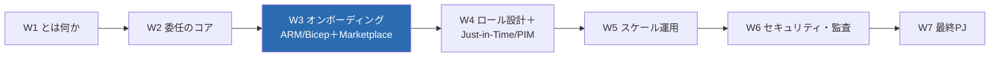
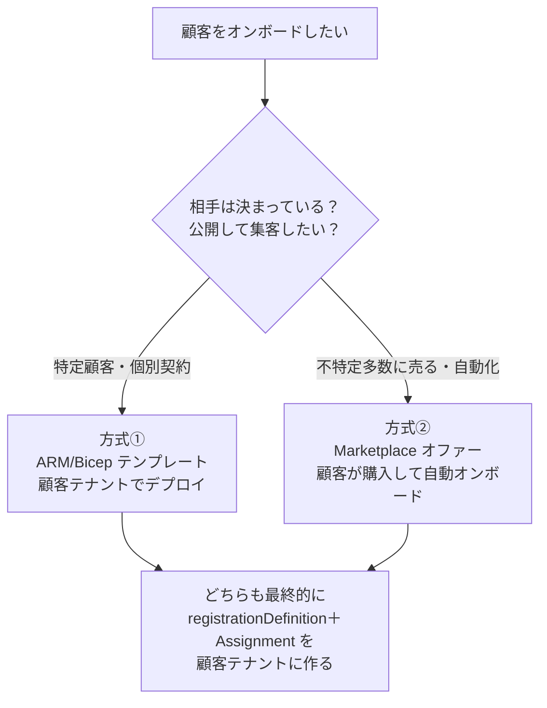
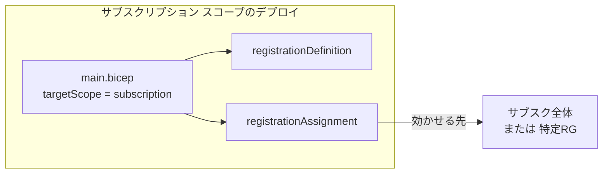
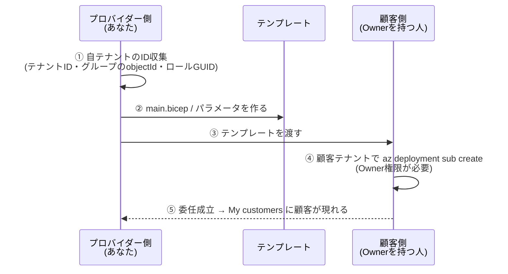
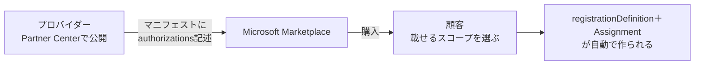

# Week 3 — オンボーディング：ARM/Bicep テンプレートで委任を作る（＋ Marketplace オファー俯瞰）

> **Phase 2a** | 学習プラン Week 3 / 7
> 学習目標：W2 で理解した"設計図（Registration Definition / Assignment）"を、**実際の Bicep テンプレート**に落とせるようになる。委任のデプロイが **サブスクリプション スコープ**で行われること、`az deployment sub create` の手順、そして **2 テナント（プロバイダーが ID を集めてテンプレを作り、顧客の Owner がデプロイ）** の役割分担をシミュレートで追う。あわせて、もう 1 つのオンボード方式 **Managed Services Marketplace オファー**（public / private プラン）の位置づけと使い分けを俯瞰する。

---

## 0. 今週の位置づけ



W2 では委任を「顧客テナントに作る 2 リソース」として理解した。今週はそれを**どうやって作るか＝オンボーディング**を扱う。方式は 2 つ（ARM/Bicep テンプレート／Marketplace オファー）あるが、**中心は Bicep**。ここで書くテンプレートが、W7 最終 PJ の実装（infra/main.bicep）の直接の土台になる。

> **初学者向け用語補足：略語・用語の展開**
> - **Bicep**（バイセップ）＝ ARM テンプレート（JSON）を人間に読みやすくした Azure 公式の DSL（Domain Specific Language＝特定用途向け言語）。`az bicep build` で JSON に変換されてから ARM に渡る。JSON を手書きするより短く安全に書ける。
> - **オンボーディング（onboarding）**＝ 顧客のサブスク／RG を Azure Lighthouse の管理下に「載せる」こと。実体は W2 の 2 リソースを顧客テナントに作るデプロイ。
> - **デプロイ スコープ（deployment scope）**＝ テンプレートを「どの階層に対して」実行するか。`resourceGroup` / `subscription` / `managementGroup` / `tenant` の 4 種。Lighthouse の委任定義は**サブスクリプション スコープ**で流す。
> - **`targetScope`**＝ Bicep ファイルの先頭で宣言する、そのファイルのデプロイ スコープ。委任なら `targetScope = 'subscription'`。
> - **`guid()`**＝ Bicep の組み込み関数。入力が同じなら**毎回同じ GUID** を返す（決定的）。委任リソースの名前生成に使うと、再デプロイしても名前が変わらず"重複作成"を避けられる。
> - **Partner Center**（パートナーセンター）＝ Microsoft のパートナー向け管理ポータル。Marketplace にオファーを公開するのに使う。

---

## 1. オンボードには 2 つの方式がある

顧客を Lighthouse に載せる道は 2 本ある。まず全体像と使い分けを掴む。



| 観点 | ①ARM/Bicep テンプレート | ②Marketplace オファー |
| --- | --- | --- |
| **相手** | 既に決まった特定顧客 | 不特定多数（public）または指定顧客（private） |
| **顧客の操作** | 顧客の Owner が**テンプレートをデプロイ** | 顧客が Marketplace で**オファーを購入**し、載せるスコープを選ぶ |
| **公開の手間** | 不要（テンプレを渡すだけ） | **Partner Center で公開**が必要（審査・マニフェスト） |
| **主な用途** | 個別 SI／エンタープライズ内の複数テナント統合 | MSP がサービスを**商品として集客** |
| **本教材の扱い** | **中心**（Bicip を手で書く） | **俯瞰**（仕組みと使い分けまで） |

> **重要**：**どちらの方式でも、最終的に顧客テナントに作られるのは W2 の同じ 2 リソース**（registrationDefinition / registrationAssignment）である。方式は"作り方"の違いにすぎない。仕組みの本質は W2 で既に押さえてある。

---

## 2. 方式①ARM/Bicep：デプロイ スコープと役割分担

### 2-1. なぜ「サブスクリプション スコープ」でデプロイするのか

W2 で見たとおり、**登録定義はサブスクリプション レベルで作られる**。したがってデプロイも**サブスクリプション スコープ**で行う——CLI なら `az deployment sub create`（`group` ではなく `sub`）。



- **サブスク全体を委任**：サブスク スコープのデプロイで、割り当てもサブスクに効く。
- **特定 RG だけ委任**：割り当てを RG に絞る（後述 §3-3）。定義自体はサブスクに置かれる。

### 2-2. 誰が・どちらのテナントで何をするか（役割分担）

これが Lighthouse オンボードの肝である。作業は**2 つのテナントにまたがる**。



- **①②はプロバイダー側**：`managedByTenantId`（自テナント）、`authorizations` に入れるプリンシパルの objectId、ロールの GUID を集めてテンプレを組む（W2 §7 で練習した ID 引きがここで効く）。
- **④は顧客側**：**顧客テナントで、`Microsoft.Authorization/roleAssignments/write` を持つロール（典型は Owner）を持つ人**がデプロイする。プロバイダーは代われない——**委任は必ず顧客の同意（デプロイ）を経る**。
- 本教材は 2 テナントをシミュレートするため、④の「顧客側デプロイ」は手順・図解で追う（実デプロイは 2 テナント環境がある人向けに W7 で扱う）。

> **初学者向け用語補足：「設計＝プロバイダー／実行（作成）＝顧客」— ここが最も混同しやすい**
> 「委任登録（registration definition）と委任割り当て（registration assignment）を**作る**のはどちら？」の答えは、**"作る＝デプロイして実体化する"の意味では顧客側**である。ただし作業は 2 つに分かれていて、混同しやすい。
>
> ```mermaid
> flowchart LR
>     subgraph P[プロバイダー側]
>       Design[テンプレートを「作る」<br/>設計・ID収集・authorizations を決める]
>     end
>     subgraph C[顧客側（Owner）]
>       Deploy[テンプレートを「デプロイする」<br/>★2リソースが実際に生成される]
>     end
>     Design -->|渡す| Deploy
> ```
>
> - **テンプレート（設計図）を書く＝プロバイダー側**（誰に・どのロールを、を決める。①②）。
> - **そのテンプレートをデプロイして 2 リソースを実体化する＝顧客側**（Owner が実行。④）。**2 リソースは顧客テナントの中に作られる**。
> - つまり「**設計はプロバイダー、実行（作成）は顧客**」。「委任登録・割り当てを作成する操作は顧客側」という理解は、この"実行"を指すので正しい。
> - なお **Marketplace オファー方式**（§5）でも同じ構図：**顧客がオファーを購入した時点で、顧客テナントに 2 リソースが自動生成**される（オファーを公開するのはプロバイダー側）。
> - また、`authorizations` の `principalId` に入る「委任を受ける主体」は SP（サービスプリンシパル）に限らず、**プロバイダーテナント内のユーザー / グループ / SPN のいずれか**でよい（W2 §3）。

> **用語補足：なぜ顧客側デプロイが Owner 権限を要るのか**
> オンボードは実質「顧客サブスクに**ロール割り当て相当の委任を作る**」操作。ロール割り当てを作る権限（`roleAssignments/write`）が要り、それを標準で持つのが **Owner** や **User Access Administrator**。だからプロバイダーが勝手に張ることは原理的にできず、顧客の主体性が守られる。

---

## 3. Bicep で書く — registrationDefinition と registrationAssignment

ここが今週の実体。公式 Bicep スキーマ（apiVersion `2022-10-01`）に沿って、**サブスク全体を委任する** main.bicep を組む。

### 3-1. サブスクリプション委任の main.bicep（骨格）

```bicep
targetScope = 'subscription'

@description('プロバイダー（管理する側）のテナントID')
param managedByTenantId string

@description('オファー名。顧客の Service providers 画面に表示される')
param mspOfferName string = 'Contoso 運用オファー'

@description('オファーの説明')
param mspOfferDescription string = 'Contoso による Azure 運用受託（Reader/Contributor）'

@description('authorizations 配列（principalId × roleDefinitionId × 表示名）')
param authorizations array

// 定義の"名前"は決定的GUIDにする：同じ入力なら同じ名前＝再デプロイで重複しない
var registrationId = guid(mspOfferName, managedByTenantId, subscription().subscriptionId)

resource registrationDefinition 'Microsoft.ManagedServices/registrationDefinitions@2022-10-01' = {
  name: registrationId
  properties: {
    registrationDefinitionName: mspOfferName
    description: mspOfferDescription
    managedByTenantId: managedByTenantId
    authorizations: authorizations
  }
}

resource registrationAssignment 'Microsoft.ManagedServices/registrationAssignments@2022-10-01' = {
  name: registrationId
  properties: {
    registrationDefinitionId: registrationDefinition.id
  }
}
```

読みどころ：

- **`name` は GUID**。リソース名は任意文字列ではなく GUID を要求される。`guid(...)` で決定的に生成すれば、同じ設定の再デプロイが冪等（べきとう＝何回やっても同じ結果）になる。
- **`registrationAssignment.properties.registrationDefinitionId`** が `registrationDefinition.id` を参照している。これが W2 で見た「割り当ては必ず 1 つの定義を参照する」の実装。Bicep はこの参照から**依存関係を自動で解決**し、定義→割り当ての順に作る。
- **`managedByTenantId`** は自テナント。顧客サブスクのテナント ID と同じ値だとデプロイが失敗する（自分に委任は不可）。

> **用語補足：`subscription().subscriptionId` と `.id`**
> - `subscription()`＝ デプロイ先サブスクの情報を返す Bicep 関数。`.subscriptionId` でその GUID。
> - `registrationDefinition.id`＝ 作った定義リソースの完全な**リソース ID**（`/subscriptions/.../providers/Microsoft.ManagedServices/registrationDefinitions/<guid>`）。割り当てはこれを指して「この設計図を適用する」と宣言する。

### 3-2. authorizations パラメータ（例）

```json
{
  "$schema": "https://schema.management.azure.com/schemas/2018-05-01/subscriptionDeploymentParameters.json#",
  "contentVersion": "1.0.0.0",
  "parameters": {
    "managedByTenantId": { "value": "<プロバイダーのテナントID(GUID)>" },
    "authorizations": {
      "value": [
        {
          "principalId": "<Tier1サポートGrpのobjectId>",
          "principalIdDisplayName": "Tier 1 Support",
          "roleDefinitionId": "acdd72a7-3385-48ef-bd42-f606fba81ae7"
        },
        {
          "principalId": "<運用GrpのobjectId>",
          "principalIdDisplayName": "Ops Team",
          "roleDefinitionId": "b24988ac-6180-42a0-ab88-20f7382dd24c"
        },
        {
          "principalId": "<委任解除担当のobjectId>",
          "principalIdDisplayName": "Delegation Remover",
          "roleDefinitionId": "91c1777a-f3dc-4fae-b103-61d183457e46"
        }
      ]
    }
  }
}
```

- `acdd72a7...`＝Reader、`b24988ac...`＝Contributor（W2 で引いた well-known GUID）。
- 3 つ目 `91c1777a-f3dc-4fae-b103-61d183457e46` は **Managed Services Registration Assignment Delete Role**。W2 §6 の推奨どおり、**プロバイダー側から委任を解除できる**ようにこれを 1 件入れておく。

### 3-3. 特定リソースグループだけ委任する場合

RG 単位に絞るなら、**RG スコープのデプロイ**（`az deployment group create`）にし、割り当てをその RG に効かせる。公式サンプルの `rg.json` / `multi-rg.json` がこの形（同一サブスク内の複数 RG は 1 デプロイ可、別サブスクは別デプロイ）。

- サブスク単位テンプレとの違いは**割り当ての効く範囲**だけ。定義の中身（authorizations）は同じ考え方。
- 迷ったら**まずサブスク単位で理解 → 絞りたい要件が出たら RG 単位**、の順で十分。
- 公式テンプレ：[Azure-Lighthouse-samples / delegated-resource-management](https://github.com/Azure/Azure-Lighthouse-samples/tree/master/templates/delegated-resource-management)

> **補足：管理グループ丸ごとは 1 デプロイ不可**
> W2 で触れたとおり、管理グループ全体を 1 回で委任はできない。「管理グループ内の各サブスクを順にオンボードするポリシー」を配る方式で実質カバーする（W5 で Policy と絡めて再登場）。

---

## 4. デプロイと確認（2 テナントをシミュレートで追う）

### 4-1. 顧客側でのデプロイ（顧客テナントの Owner が実行）

```bash
az deployment sub create \
  --name lighthouse-onboard \
  --location japaneast \
  --template-file main.bicep \
  --parameters main.parameters.json \
  --verbose
```

> **コマンドの読み方**：`deployment sub create`=サブスクリプション スコープのデプロイを実行、`--location`=デプロイのメタデータを記録するリージョン（作るリソース自体は非リージョナル）、`--template-file`=Bicep（または JSON）、`--parameters`=パラメータファイル。**これは顧客テナントにサインインした Owner が実行する**点が肝。

### 4-2. 成功を確認する

```bash
# 顧客側：作られた2リソースを確認
az managedservices definition list -o table
az managedservices assignment list -o table
```

> **読み方**：`managedservices definition list`=登録定義の一覧、`assignment list`=登録割り当ての一覧。両方に今作ったものが出れば成功。プロバイダー側では **My customers** に、顧客側では **Service providers** に、`mspOfferName` の名前で現れる（反映に最大 15 分ほどかかることがある）。

### 4-3. うまくいかない時のチェック（公式トラブルシュートより）

| 症状・原因 | 対処 |
| --- | --- |
| プロバイダーが My customers に顧客を**見られない** | オンボード時に **Reader を含むロール**が付与されているか（閲覧には Reader 相当が要る） |
| デプロイが**失敗**する | `managedByTenantId` が顧客サブスクのテナント ID と**同じ**になっていないか（自分に委任は不可） |
| `authorizations` が**弾かれる** | **Owner** や **DataActions を含むロール**、カスタムロールを入れていないか（W4 の制約） |
| 同一スコープで**重複エラー** | 同じ `mspOfferName` を同一スコープに複数貼っていないか（一意にする） |
| RP 未登録 | `Microsoft.ManagedServices` プロバイダーは通常デプロイ時に自動登録される |

---

## 5. 方式②Managed Services Marketplace オファー（俯瞰）

もう 1 つの道が、**Microsoft Marketplace に「Managed Service オファー」を公開**して、顧客に購入してもらう方式。公式の要約：

> **Managed Service オファー**は、顧客を Azure Lighthouse にオンボードするプロセスを効率化する。顧客が Marketplace でオファーを購入すると、**どのサブスクリプションおよび/またはリソースグループをオンボードするかを顧客が指定できる**。
> （出典：[Managed Service offers in Microsoft Marketplace](https://learn.microsoft.com/en-us/azure/lighthouse/concepts/managed-services-offers)）



### 5-1. public プランと private プラン

| プラン種別 | 誰が買えるか | 使いどころ |
| --- | --- | --- |
| **public（公開）** | 不特定多数の顧客 | 新規集客。相手テナントへの**限定的なアクセス**を求める場合に向く |
| **private（非公開）** | 提供した**特定のサブスク ID の顧客のみ** | 個別契約。特定顧客だけに見せる |

- 公式の注意：**public にしたプランは private に戻せない**。特定顧客に絞りたいなら最初から private にする。
- private プランは **CSP（Cloud Solution Provider）リセラー経由のサブスクには非対応**。
- 委任を後で**プロバイダー側から解除**したいなら、オファーにも **Managed Services Registration Assignment Delete Role** の Authorization を含めておく（方式①と同じ発想）。

> **用語補足：マニフェスト（manifest）／MPN・Partner ID**
> - **マニフェスト**＝オファーに埋め込む「どのプリンシパルに・どのロールを」の定義。方式①の `authorizations` に相当する内容を、Partner Center 上で設定する。
> - **Partner ID（旧 MPN ID）**＝ Microsoft Cloud Partner Program の識別子。オファー公開や、貢献度トラッキング（partner ID の紐付け）に使う。
> - 実際の公開手順（審査・要件）は本教材のスコープ外。**「不特定多数に商品として売るなら Marketplace、決まった相手なら Bicep」** という使い分けが掴めれば十分。

### 5-2. 2 方式は併用できる

公式いわく、Marketplace オファー（限定アクセス）で関係を作り、追加アクセスが必要になったら **ARM テンプレートで追加オンボード**する、という**併用**が可能。「最初は public で薄く、深い委任は後から private/テンプレで」という育て方ができる。

---

## 6. eligible authorizations の予告（W4 への伏線）

W2・本週で見た `authorizations` は「**常時（permanent）** この権限を持つ」設定だった。Bicep スキーマにはもう 1 つ **`eligibleAuthorizations`**（資格ベース＝必要時だけ昇格）という枠がある。

```bicep
// W4 で扱う：常時ではなく「必要な時だけ昇格」する委任
properties: {
  authorizations: [ /* 常時権限 */ ]
  eligibleAuthorizations: [
    {
      principalId: '...'
      principalIdDisplayName: 'On-call Engineer'
      roleDefinitionId: '<Contributor等>'
      justInTimeAccessPolicy: {
        multiFactorAuthProvider: 'Azure'      // 昇格時にMFA必須
        maximumActivationDuration: 'PT8H'      // 最大8時間
        managedByTenantApprovers: [ /* 承認者 */ ]
      }
    }
  ]
}
```

これが **Just-in-Time アクセス（PIM for Azure Lighthouse）** の実体で、W4 の主役になる。今週は「`authorizations`（常時）の隣に `eligibleAuthorizations`（必要時）という枠がある」ことだけ掴めばよい。

---

## 7. ハンズオン — Bicep を書いて検証する（単一テナントで可）

実デプロイは 2 テナント（顧客側 Owner）が要るためシミュレートだが、**Bicep の作成と文法検証は 1 テナントで完結**する。ここで書いたものが W7 の infra/main.bicep の下地になる。

> **前提**：Azure CLI と Bicep CLI（`az bicep install`）。作成物はローカルの Bicep ファイルのみで、課金リソースは作らない。

### 手順 A：main.bicep を作る

上の §3-1 の骨格を、任意の作業フォルダ（例：スクラッチ領域）に `main.bicep` として保存する。

### 手順 B：文法・スキーマを検証する（ARM へコンパイル）

```bash
az bicep build --file main.bicep
```

> **読み方**：`bicep build`=Bicep を ARM テンプレート（JSON）に変換。ここでエラーが出なければ、リソース種別・プロパティ名・`targetScope` が正しく書けている証拠。生成された `main.json` を開くと、W2 で読んだ公式サンプル JSON と同じ構造になっていることが確認できる（Bicep→JSON の対応を体感）。

### 手順 C：パラメータファイルを作り、値の"型"を確認する

§3-2 を `main.parameters.json` として保存し、`managedByTenantId` に自分のテナント ID（`az account show --query tenantId -o tsv`）、`principalId` に W2 で引いた objectId を入れてみる（**実デプロイはしない**——顧客テナントが無いため）。値が GUID の形をしているかを目視する。

> **なぜ実デプロイしないのか**：`managedByTenantId` は「委任先＝別テナント」を指す。単一テナントでは委任先が自分になり、原理上デプロイできない（自分に委任は不可）。実オンボードは 2 テナント環境で W7 に回す。今週のゴールは「**正しく書けて、コンパイルが通る Bicep を持つ**」こと。

### 後片付け

ローカルの `main.bicep` / `main.json` / `main.parameters.json` のみ。Azure 上に作成物なし、削除不要。

---

## 8. 自己チェック

1. 顧客をオンボードする 2 方式（ARM/Bicep テンプレート／Marketplace オファー）の違いと使い分けを説明できるか。両者が最終的に作るものは同じか。
2. 委任のデプロイはなぜ**サブスクリプション スコープ**（`az deployment sub create`）なのか。
3. オンボードの作業は 2 テナントにまたがる。**プロバイダー側**と**顧客側**が、それぞれ何をするか。④のデプロイはなぜ顧客の Owner でないとできないのか。
4. main.bicep で、`registrationAssignment` はどのプロパティで `registrationDefinition` を参照しているか。`name` に GUID を使い `guid()` で生成する利点は何か。
5. 特定 RG だけ委任したい場合、サブスク全体委任と何が変わるか。
6. Marketplace オファーの **public / private** プランの違いは何か。「public は private に戻せない」ことの実務的含意は？
7. `authorizations`（常時）と `eligibleAuthorizations`（必要時）は何が違うか。後者は次週の何の話につながるか。

---

## 9. 次週予告（W4：ロールと権限設計＋Just-in-Time / PIM）

W4 では、`authorizations` に**入れられるロール・入れられないロール**を体系的に押さえる——**Owner 不可**、**DataActions を含むロール不可**、**カスタムロール不可**、そして **User Access Administrator は「マネージド ID にロールを割り当てる」限定用途でのみ可**（`delegatedRoleDefinitionIds` の意味）。さらに、本週で予告した **`eligibleAuthorizations`＝ PIM for Azure Lighthouse**（Just-in-Time：必要な時だけ昇格・MFA・承認者・最大時間）を深掘りし、最小権限を「常時は狭く、必要時だけ広く」で実現する設計を学ぶ。

---

### 参考（出典）
- [Onboard a customer to Azure Lighthouse（テンプレート・デプロイ手順）](https://learn.microsoft.com/en-us/azure/lighthouse/how-to/onboard-customer)
- [Microsoft.ManagedServices/registrationDefinitions（Bicep/ARM スキーマ）](https://learn.microsoft.com/en-us/azure/templates/microsoft.managedservices/registrationdefinitions)
- [Managed Service offers in Microsoft Marketplace（Marketplace 方式）](https://learn.microsoft.com/en-us/azure/lighthouse/concepts/managed-services-offers)
- [Publish a Managed Service offer（公開手順）](https://learn.microsoft.com/en-us/azure/lighthouse/how-to/publish-managed-services-offers)
- [Azure/Azure-Lighthouse-samples（公式テンプレート集）](https://github.com/Azure/Azure-Lighthouse-samples/)
