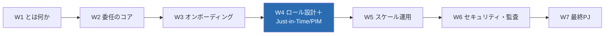
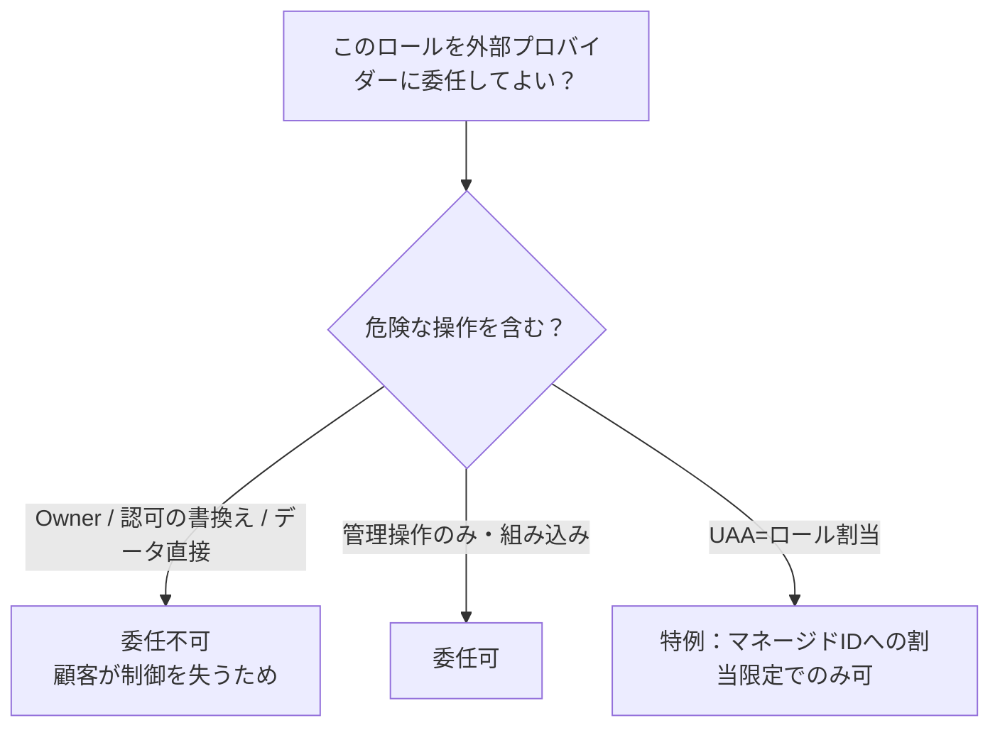
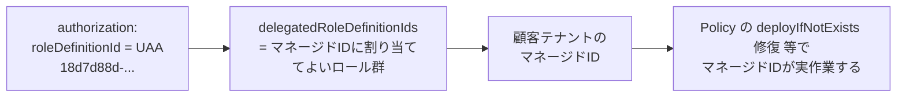
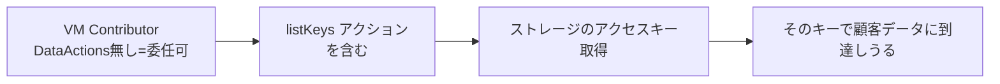
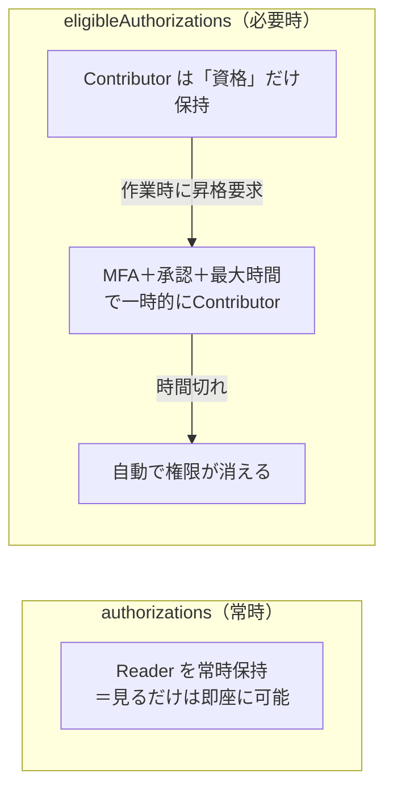
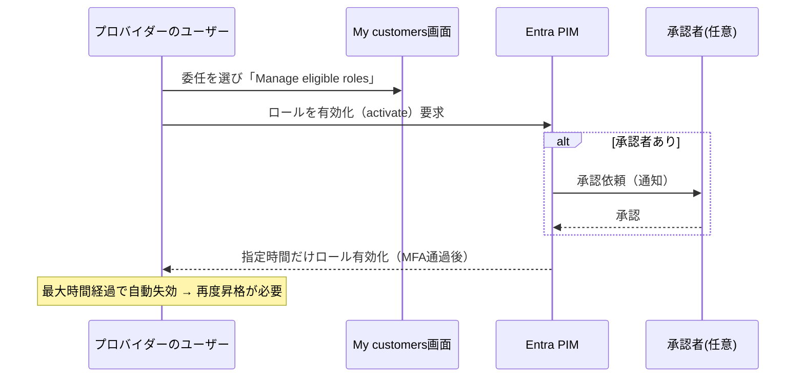

# Week 4 — ロールと権限設計＋Just-in-Time：常時は狭く、必要な時だけ広く

> **Phase 2b** | 学習プラン Week 4 / 7
> 学習目標：`authorizations` に**入れられるロール・入れられないロール**を体系的に理解する——**Owner 不可**・**DataActions を含むロール不可**・**カスタム/クラシックロール不可**・**認可（Microsoft.Authorization/*）系不可**、そして **User Access Administrator は「マネージド ID にロールを割り当てる」限定用途でのみ可**（`delegatedRoleDefinitionIds`）。さらに **eligibleAuthorizations＝PIM for Azure Lighthouse**（Just-in-Time：必要な時だけ昇格・MFA・承認者・最大時間）を深掘りし、「常時は最小権限、privileged は必要時だけ」という設計を書けるようになる。

---

## 0. 今週の位置づけ



W3 では `authorizations` に Reader / Contributor を入れてオンボードした。今週はその **`authorizations` の"中身をどう選ぶか"** に踏み込む。Lighthouse は「他社テナントを触る」仕組みゆえ、**入れられるロールに強い制約**がある。そしてその制約を守ったうえで、**最小権限を実運用に耐える形にする鍵が Just-in-Time（PIM）** である。

> **初学者向け用語補足：略語・用語の展開**
> - **PIM** = Privileged Identity Management（Privileged=特権的な / Identity=ID / Management=管理）＝「特権 ID 管理」。Microsoft Entra の機能で、**強い権限を"常時"ではなく"必要な時だけ・時間制限つきで"** 与える仕組み。
> - **Just-in-Time（JIT、ジャストインタイム）**＝「必要な時に、必要なだけ」。権限を常時持たせず、作業する瞬間だけ昇格させる考え方。
> - **昇格（elevation / activation）**＝ 普段は持っていない強い権限を、PIM を通じて一時的に有効化すること。
> - **最小権限（least privilege）**＝ 各ユーザーには「その仕事に必要な権限だけ」を与える原則。事故と悪用の被害範囲を最小化する。
> - **DataActions**＝ ロール定義の中で「**データ面**の操作」を表す枠（例：Blob の中身を読む）。対して `Actions` は「**管理面**の操作」（例：ストレージアカウントを作る）。W1 のコントロール/データプレーンの区別に対応。
> - **マネージド ID**（Managed Identity）＝ Azure リソース自身に紐づく自動管理の ID。パスワード管理不要で、リソースが他リソースを安全に呼ぶのに使う。

---

## 1. なぜロールに強い制約があるのか

Lighthouse は「**顧客テナントの外部にいるプロバイダー**」に権限を渡す。ここで無制限を許すと、顧客が制御を失う。だから Azure は「**外部委任で危険すぎる操作を、そもそも渡せなくする**」設計にしている。制約は理不尽な仕様ではなく、**顧客の主体性を守るガードレール**である。



大原則を先に 1 行で：**「使えるのは組み込みロールのうち、`Owner`・`DataActions` 付き・認可（Authorization）を書き換える系を除いたもの」。**

---

## 2. 使えないロール（公式の除外リスト）

公式いわく、Lighthouse は**すべての組み込みロールをサポートするが、以下を除く**（出典：[Tenants, users, and roles](https://learn.microsoft.com/en-us/azure/lighthouse/concepts/tenants-users-roles)）。

| 使えないもの | なぜ | 
| --- | --- |
| **Owner** | 他者へのロール付与・削除まで含む最強権限。外部に渡せば顧客が制御を失う |
| **DataActions を含むロール** | データ面（Blob 中身・Key Vault シークレット等）への直接アクセス。Lighthouse は**コントロールプレーン専用**（W1） |
| **`Microsoft.Authorization/*` の write/delete 系を含むロール** | ロール割り当て・ロール定義・ロック・拒否割り当ての**書き換え**。委任の土台そのものをいじれてしまう |
| **カスタムロール** | 組み込みロールのみ対応。独自定義は不可 |
| **クラシック サブスクリプション管理者ロール** | レガシー。非対応 |

具体的に禁止される `Actions`（抜粋）：

```
Microsoft.Authorization/*
Microsoft.Authorization/*/write
Microsoft.Authorization/roleAssignments/write
Microsoft.Authorization/roleAssignments/delete
Microsoft.Authorization/roleDefinitions/write
Microsoft.Authorization/locks/write
Microsoft.Authorization/denyAssignments/write
    …ほか delete 系
```

> **用語補足：なぜ「認可を書き換える権限」を特に禁じるのか**
> Lighthouse の委任自体が「ロール割り当て（authorization）」で成り立っている。もしプロバイダーが `roleAssignments/write` を持てたら、**自分で自分の権限を勝手に広げられる**（＝顧客の同意を迂回できる）。これを塞ぐため、認可を書き換える系のロールは丸ごと委任不可にしている。ロック（`locks`）や拒否割り当て（`denyAssignments`）の書き換えも同じ理由。

---

## 3. User Access Administrator の特例（`delegatedRoleDefinitionIds`）

「認可系は禁止」の唯一の例外が **User Access Administrator（UAA）** である。ただし**用途が 1 つに限定**される。

> User Access Administrator ロールは、**顧客テナントのマネージド ID にロールを割り当てる**という限定目的でのみサポートされる。このロールが通常与える他の権限は一切適用されない。この用途で使う場合、**そのユーザーがマネージド ID に割り当てられるロールを併せて指定**しなければならない。
> （出典：[Tenants, users, and roles](https://learn.microsoft.com/en-us/azure/lighthouse/concepts/tenants-users-roles)）

これが W2・W3 で登場した **`delegatedRoleDefinitionIds`** の正体である。



- **使いどころ**：Azure Policy の `deployIfNotExists` / `modify` を**修復（remediation）** するには、顧客テナントにマネージド ID を作り、それにロールを割り当てる必要がある（W5 で扱う）。その「マネージド ID にロールを割り当てる」ためだけに UAA を使う。
- **`delegatedRoleDefinitionIds`**：その UAA ユーザーが**マネージド ID に割り当ててよいロールの一覧**（GUID 配列）。ここに書いたロール以外は割り当てられない＝権限が箱に閉じ込められる。
- **それ以外の UAA 権限は無効**。人間ユーザーの権限を勝手に広げる用途には使えない。

> **用語補足：`delegatedRoleDefinitionIds` は「又貸しできるロールのホワイトリスト」**
> UAA は本来「誰にでも何でもロールを割り当てられる」危険な権限。Lighthouse ではそれを封じ、「**このマネージド ID に、この一覧のロールだけ、割り当ててよい**」と又貸しの範囲を明示的に限定する。だからこのフィールドは UAA を指定するときに**必須**になる。

---

## 4. 落とし穴：DataActions が無くても"データに触れる"ロールがある

公式が特に注意を促す点。**「DataActions なし＝安全」ではない。**

> Azure Lighthouse は DataActions を含むロールをサポートしないが、**サポートされるロールに含まれる一部の `Actions` がデータへのアクセスを許すことがある**。これは概してデータがアクセスキー経由で露出する場合に起きる。例えば **Virtual Machine Contributor** ロールは `Microsoft.Storage/storageAccounts/listKeys/action` を含み、これは**ストレージアカウントのアクセスキーを返す**——顧客データの取得に使われうる。
> （出典：[Tenants, users, and roles](https://learn.microsoft.com/en-us/azure/lighthouse/concepts/tenants-users-roles)）



- 教訓：**ロールを付ける前に、その `Actions` を実際に読む**。`listKeys` / `listCredentials` のような「鍵を返す」アクションは、DataActions ではないがデータ露出につながる。
- 実務：`az role definition show` で `actions` / `dataActions` を目視し、鍵を返すアクションが無いか確認する（§8 ハンズオン）。

---

## 5. 権限設計のベストプラクティス（公式）

| 実践 | 中身 |
| --- | --- |
| **グループ／SPN に付ける** | 個人でなく Entra グループ（**Security タイプ**）や SPN に。メンバー出し入れだけで済み、再オンボード不要 |
| **最小権限** | 仕事に必要な分だけ。まず Reader、変更が要る役割にだけ Contributor |
| **Delete Role を入れる** | **Managed Services Registration Assignment Delete Role** を 1 件。プロバイダー側から委任解除可能に（無いと顧客しか外せない） |
| **Reader を確保** | **My customers** を閲覧するには **Reader を含むロール**が必須。閲覧すらできないと運用にならない |

> **設計の型（今週の核）**：**「常時（permanent）は Reader などの狭い権限だけ。Contributor 等の強い権限は"必要な時だけ"の eligible（PIM）にする」**——これが次章の Just-in-Time で実現される、Lighthouse 権限設計の理想形。

---

## 6. Just-in-Time：`eligibleAuthorizations`＝PIM for Azure Lighthouse

W3 で予告した `eligibleAuthorizations` の本編。公式の定義：

> **eligible authorization** は、ユーザーが特権タスクを行う必要があるときに**ロールを有効化（activate）することを要求する**ロール割り当てを定義する。有効化すると、指定した期間だけそのロールの全アクセスを得る。これにより、**特権ロールの"常時"割り当てを最小化**できる。
> （出典：[Create eligible authorizations](https://learn.microsoft.com/en-us/azure/lighthouse/how-to/create-eligible-authorizations)）



### 6-1. 仕組みとライセンス要件

- 実体は **Microsoft Entra PIM**。だから**管理（プロバイダー）テナントに PIM をサポートする Microsoft Entra ID Governance ライセンス（＝実質 Entra ID P2 相当）が必要**。
- **追加コストは昇格している時間だけ**発生。
- **ナショナルクラウドでは非対応**。
- 監査：PIM の活動はプロバイダーテナントの監査ログに、顧客は委任サブスクの Activity Log で確認できる。

### 6-2. eligible authorization の 3 要素

公式いわく「各 eligible authorization は 3 要素——**ユーザー / ロール / アクセスポリシー**——を含む」。

| 要素 | 中身 | 制約 |
| --- | --- | --- |
| **ユーザー**（`principalId`） | 昇格できる相手。**ユーザーまたはグループ** | **SPN 不可**（自分で昇格する手段がない）。UAA の `delegatedRoleDefinitionIds` とも併用不可 |
| **ロール**（`roleDefinitionId`） | 昇格時に得る組み込みロール | サポート対象ロールのうち **User Access Administrator を除く**もの |
| **アクセスポリシー**（`justInTimeAccessPolicy`） | 昇格の条件（MFA・最大時間・承認者） | 同じロールの eligible を複数作るなら**ポリシー設定は全て一致**させる |

### 6-3. `justInTimeAccessPolicy` の中身

| フィールド | 値 | 意味 |
| --- | --- | --- |
| `multiFactorAuthProvider` | `Azure` / `None` | `Azure` なら昇格時に **Entra MFA 必須**。`None` は不要 |
| `maximumActivationDuration` | ISO 8601（例 `PT8H`） | 昇格が続く**最大時間**。**最小 `PT30M`（30分）／最大 `PT8H`（8時間）**。30 分刻み推奨 |
| `managedByTenantApprovers` | 任意・最大 10 名 | 昇格を**承認する人**（ユーザー/グループ）。省略すると**承認なしでいつでも昇格可** |

> **用語補足：ISO 8601 の期間表記（`PT8H` など）**
> `P`=Period（期間の開始記号）、`T`=Time（時刻部の開始）、その後に `8H`=8 時間、`30M`=30 分。例：`PT30M`=30 分、`PT6H30M`=6.5 時間、`PT8H`=8 時間。日付を含む期間（`P1D` 等）もあるが、ここは時間単位のみ使う。

### 6-4. 見落としやすい必須ルール 2 つ

- **eligible と同じプリンシパルに、常時（permanent）の Reader も併せて付ける**。公式明記：**Reader を含む常時 authorization が無いと、ポータルでそもそも昇格操作ができない**。「普段は Reader で見える、昇格して Contributor で触る」の**土台に Reader が要る**。
- **承認者は自分を承認できない**。承認者がその eligible のユーザーでもある場合、別の承認者が承認する必要がある。SPN は承認者になれない。

### 6-5. 昇格プロセス（ユーザー側の操作）



---

## 7. Bicep / パラメータで書く（eligibleAuthorizations 込み）

W3 の main.bicep に `eligibleAuthorizations` を足すだけ。パラメータ例（公式サンプル準拠）：

```json
{
  "authorizations": {
    "value": [
      {
        "principalId": "<Tier2サポートGrpのobjectId>",
        "roleDefinitionId": "acdd72a7-3385-48ef-bd42-f606fba81ae7",
        "principalIdDisplayName": "Tier 2 Support (常時Reader)"
      }
    ]
  },
  "eligibleAuthorizations": {
    "value": [
      {
        "principalId": "<Tier2サポートGrpのobjectId>",
        "principalIdDisplayName": "Tier 2 Support",
        "roleDefinitionId": "b24988ac-6180-42a0-ab88-20f7382dd24c",
        "justInTimeAccessPolicy": {
          "multiFactorAuthProvider": "Azure",
          "maximumActivationDuration": "PT8H",
          "managedByTenantApprovers": [
            { "principalId": "<承認者GrpのobjectId>", "principalIdDisplayName": "PIM-Approvers" }
          ]
        }
      }
    ]
  }
}
```

- **同じ `principalId`** が、常時は **Reader**（`acdd72a7...`）、eligible では **Contributor**（`b24988ac...`）。§6-4 の「Reader 併記」を満たしている。
- Bicep 側は W3 の `properties` に `eligibleAuthorizations: eligibleAuthorizations` を 1 行足すだけ（`param eligibleAuthorizations array` を追加）。

> **補足**：eligible 対応の公式テンプレは [delegated-resource-management-eligible-authorizations](https://github.com/Azure/Azure-Lighthouse-samples/tree/master/templates/delegated-resource-management-eligible-authorizations)（承認者あり/なしの両方が用意されている）。

---

## 8. ハンズオン — ロールの中身を読み、委任可否を判定する（単一テナントで可）

実オンボードは 2 テナントが要るためシミュレートだが、**「このロールは委任できるか」を自分で判定する目**は 1 テナントで鍛えられる。

> **前提**：Azure CLI にサインイン済み。読み取りコマンドのみ。

### 手順 A：ロールの `actions` / `dataActions` を覗く

```bash
# Contributor の中身
az role definition list --name "Contributor" \
  --query "[0].{name:roleName, actions:permissions[0].actions, dataActions:permissions[0].dataActions}" -o jsonc

# Virtual Machine Contributor に listKeys が含まれるか（§4の落とし穴）
az role definition list --name "Virtual Machine Contributor" \
  --query "[0].permissions[0].actions" -o jsonc | grep -i "listKeys"
```

> **読み方**：`role definition list --name`=ロール定義を名前で取得、`permissions[0].actions`=管理面の許可アクション、`dataActions`=データ面。`grep -i listKeys`=大文字小文字を無視して `listKeys` を探す。VM Contributor で `Microsoft.Storage/storageAccounts/listKeys/action` がヒットすれば、§4 の「DataActions は無いのにデータに届きうる」を自分の目で確認できたことになる。

### 手順 B：委任可否のセルフ判定

次のロールが Lighthouse の `authorizations` に**入れられるか**を、§2 の基準で判定してみる（答えは各自 `az role definition show` で検証）。

1. `Owner` → ？
2. `Reader` → ？
3. `Storage Blob Data Contributor`（`dataActions` を持つ）→ ？
4. `User Access Administrator` → ？（条件付き）
5. 自作のカスタムロール → ？

> **判定の骨子**：Owner=不可、Reader=可、DataActions 持ち=不可、UAA=`delegatedRoleDefinitionIds` 指定でマネージド ID 割当限定のみ可、カスタム=不可。

### 手順 C：eligible パラメータを書いてみる

§7 の JSON を `eligible.parameters.json` として保存し、`maximumActivationDuration` を `PT30M`〜`PT8H` の範囲で、`multiFactorAuthProvider` を `Azure`/`None` で書き換えてみる。**同じ principalId に常時 Reader を必ず併記**すること（§6-4）を守れているか確認する。

> **後片付け**：読み取りコマンドとローカル JSON のみ。Azure 上に作成物なし、削除不要。

---

## 9. 自己チェック

1. Lighthouse で**使えないロール**を 4 種類（Owner／DataActions 付き／Authorization 書換系／カスタム・クラシック）挙げ、それぞれ**なぜ**禁止かを言えるか。
2. `roleAssignments/write` を含むロールが特に危険なのはなぜか（委任の成り立ちと結びつけて）。
3. **User Access Administrator** はどんな**限定用途**でのみ使えるか。`delegatedRoleDefinitionIds` は何を意味するか。
4. 「DataActions が無ければデータは安全」は正しいか。`Virtual Machine Contributor` の例で説明せよ。
5. 権限設計の理想形「常時は◯◯、privileged は◯◯」を、Reader と eligible(PIM) を使って言えるか。
6. eligible authorization の **3 要素**は何か。`justInTimeAccessPolicy` の 3 フィールド（MFA／最大時間／承認者）の値の範囲は？
7. eligible を設定するとき、**同じプリンシパルに常時 Reader も付ける**必要があるのはなぜか。SPN を eligible に使えないのはなぜか。
8. eligible authorizations を使うには、どちらのテナントに何のライセンスが要るか。

---

## 10. 次週予告（W5：スケール運用 — クロステナントで効かせる）

W4 までで「1 顧客をどう委任するか」を固めた。W5 では視点を上げ、**多数の委任顧客を"横断"して運用する**方法に進む。**Azure Policy**（複数テナントに定義・割り当てを配る／`deployIfNotExists` 修復に本週の UAＡ＋マネージド ID が効く）、**Azure Monitor**（委任サブスクのアラート・ログ横断）、**Azure Resource Graph**（クエリ結果に `tenantId` が出て、どの顧客のリソースかを一括抽出）、**Microsoft Sentinel**（複数ワークスペース横断のセキュリティ監視）。W7 最終 PJ の「テナント横断クエリ」は、ここで扱う Resource Graph が土台になる。

---

### 参考（出典）
- [Tenants, users, and roles in Azure Lighthouse（ロール対応・除外・ベストプラクティス）](https://learn.microsoft.com/en-us/azure/lighthouse/concepts/tenants-users-roles)
- [Create eligible authorizations（PIM for Lighthouse・JITポリシー）](https://learn.microsoft.com/en-us/azure/lighthouse/how-to/create-eligible-authorizations)
- [Deploy Azure Policy that can be remediated（UAA＋マネージドID）](https://learn.microsoft.com/en-us/azure/lighthouse/how-to/deploy-policy-remediation)
- [Azure built-in roles（組み込みロール一覧・GUID）](https://learn.microsoft.com/en-us/azure/role-based-access-control/built-in-roles)
- [Recommended security practices（推奨セキュリティ）](https://learn.microsoft.com/en-us/azure/lighthouse/concepts/recommended-security-practices)
