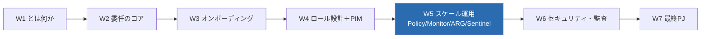
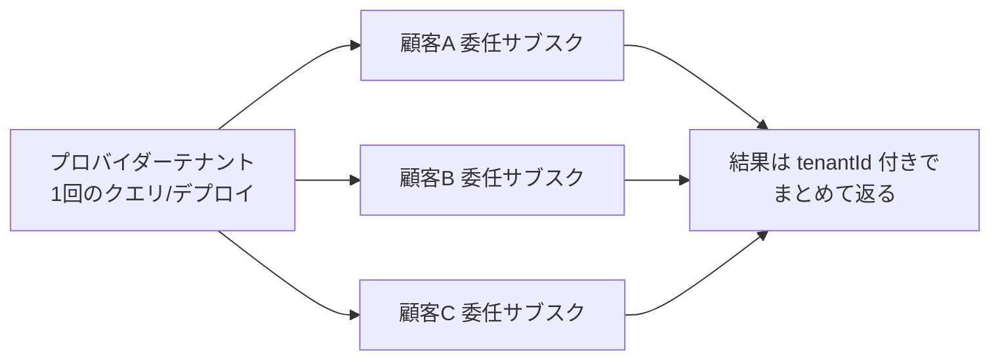
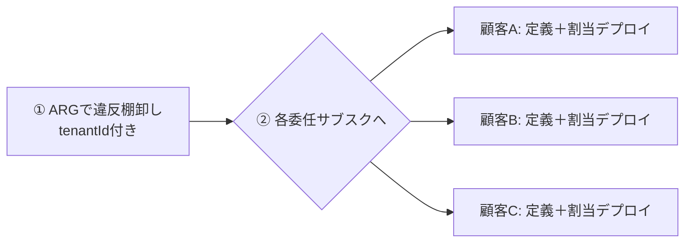
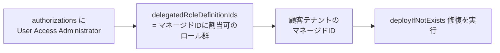

# Week 5 — スケール運用：クロステナントで Policy / Monitor / Resource Graph / Sentinel を効かせる

> **Phase 3a** | 学習プラン Week 5 / 7
> 学習目標：1 顧客の委任設計（W1〜W4）から視点を上げ、**多数の委任顧客を"横断"して運用する**術を掴む。中心は **Azure Resource Graph** による**テナント横断クエリ**（KQL 基礎・結果に出る `tenantId`）——これが W7 最終 PJ の土台になる。あわせて **Azure Policy at scale**（複数テナントに定義＋割り当てを配布し、`deployIfNotExists` 修復に W4 の UAA＋マネージド ID が効く）、**Azure Monitor**（委任サブスクのアラート・ログ横断）、**Microsoft Sentinel**（複数ワークスペース横断）を俯瞰する。

---

## 0. 今週の位置づけ



W4 までは「**1 顧客をどう委任するか**」だった。だが Lighthouse の真価は、**10 社・100 社を自テナントから一望して一括操作**できる点にある。今週は「委任済みの多数の顧客を、どう横断的に**調べ・強制し・監視する**か」を扱う。ここで学ぶ **Resource Graph** が、W7 の「テナント横断クエリを Python/az で書く」に直結する。

> **初学者向け用語補足：略語・用語の展開**
> - **ARG** = Azure Resource Graph（Azure=アジュール / Resource=リソース / Graph=グラフ〔全体を俯瞰する台帳〕）＝ Azure 全リソースを**横断的に高速検索**するサービス。ポータルの一覧より速く、サブスク／テナントをまたいで問い合わせられる。
> - **KQL** = Kusto Query Language（クスト・クエリ・ランゲージ）＝ ARG や Log Analytics で使う**問い合わせ言語**。SQL に似るが、`|`（パイプ）でデータを次の処理へ流していくのが特徴。
> - **パイプ（`|`）**＝ 前の処理結果を次の演算子へ渡す記号。「テーブル ｜ 絞る ｜ 列を選ぶ ｜ 並べる」と左から右へ読む。
> - **Log Analytics ワークスペース**＝ ログ・メトリックを溜めて KQL で分析する入れ物。Monitor / Sentinel の土台。
> - **`deployIfNotExists`（DINE）**＝ Azure Policy の効果（effect）の 1 つ。「無ければデプロイして直す」自動修復。実行には**マネージド ID** が要る（W4 で予告）。
> - **修復（remediation）**＝ ポリシー違反の既存リソースを、あるべき状態に**後から直す**こと。

---

## 1. スケール運用の発想：委任済みサブスクは「自テナントの一部のように」扱える

W2 の論理射影を思い出す。委任されたサブスクは、プロバイダーテナントに**投影**されている。だから **ARM を通す操作（コントロールプレーン）は、自テナントのツール・API・スクリプトがそのまま多数の顧客に効く**。



公式いわく「既存の API・管理ツール・ワークフローを、委任リソースに対してそのまま使える」（出典：[overview](https://learn.microsoft.com/en-us/azure/lighthouse/overview)）。つまり**新しい特殊 API を覚える必要はない**——普段の Azure Policy / Monitor / Resource Graph が、委任のおかげで自動的に「横断」になる。

---

## 2. Azure Resource Graph — テナント横断クエリ（W7 の土台）

### 2-1. なぜ ARG がスケール運用の中心か

「100 社の中で、HTTPS を強制していないストレージはどれ？」——こういう**横断の棚卸し**を一発で返すのが ARG。公式いわく「ARG は、**管理している顧客テナントの全サブスクリプションにまたがって**クエリできる」（出典：[Deploy Azure Policy at scale](https://learn.microsoft.com/en-us/azure/lighthouse/how-to/policy-at-scale)）。

決定的なのは **クエリ結果に `tenantId` 列が出る**こと。これで「どの顧客のリソースか」を一括で仕分けできる。ARG のクエリ範囲は既定で「**認可されたユーザーが見えるすべて**」＝ **Lighthouse 委任リソースを含む**（出典：[Resource Graph query language](https://learn.microsoft.com/en-us/azure/governance/resource-graph/concepts/query-language)）。

### 2-2. KQL の基礎（最小セット）

ARG は KQL のうち主要な表操作をサポートする。まず 7 つ覚えれば実用になる。

| 演算子 | 読み方・意味 | 例 |
| --- | --- | --- |
| `where` | 絞る（条件で行を残す） | `where type =~ 'microsoft.storage/storageaccounts'` |
| `project` | 列を選ぶ（表示する列を決める） | `project name, location, tenantId` |
| `extend` | 列を足す（計算列を作る） | `extend https = properties.supportsHttpsTrafficOnly` |
| `summarize` | 集計する（`by` でグループ化） | `summarize count() by tenantId` |
| `count` | 件数を数える | `Resources | count` |
| `order by`（=`sort`） | 並べ替える | `order by name asc` |
| `limit`（=`take`） | 先頭 N 件に絞る | `limit 10` |

> **用語補足：`=~` と `==`**
> - `==`＝完全一致（大文字小文字を区別）。
> - `=~`＝**大文字小文字を無視した一致**。リソース種別（`Microsoft.Storage/...`）は表記ゆれがあるので `=~` が安全。
> - `!=` は不一致。テナント除外（`where tenantId != '<自分>'`）などに使う。

### 2-3. 2 つの基本テーブル

| テーブル | 中身 |
| --- | --- |
| `Resources` | ほとんどのリソース（VM・ストレージ等）。**既定テーブル** |
| `ResourceContainers` | 管理グループ・**サブスクリプション**・リソースグループ。サブスク一覧や tenantId 抽出に使う |

### 2-4. 横断クエリの例（HTTPS 未強制ストレージを全顧客から抽出）

```kusto
Resources
| where type =~ 'Microsoft.Storage/storageAccounts'
| where properties.supportsHttpsTrafficOnly == false
| project name, location, subscriptionId, tenantId
| order by tenantId asc
```

読み下し：「全リソース ｜ ストレージだけ ｜ HTTPS 必須が false のもの ｜ 名前・場所・サブスク・**テナント** を出す ｜ テナント順に並べる」。委任済みなら、**複数顧客のストレージが tenantId 付きで一覧**される。これが W7 で Python/az に載せる中身そのもの。

> **用語補足：委任サブスクの見分け方（再掲・W1 と接続）**
> W1 で見た `managedByTenants` / `homeTenantId` と同じ発想で、ARG では **`tenantId != '<自分のテナント>'`** の行が「委任されて見えている他社サブスク」。公式サンプルもこの条件で「管理対象サブスク」を抽出している。

---

## 3. Azure Policy at scale — 複数テナントに"配って強制する"

### 3-1. できること

公式が挙げる Lighthouse × Policy の要点（出典：[cross-tenant management experiences](https://learn.microsoft.com/en-us/azure/lighthouse/concepts/cross-tenant-management-experience)）：

- 委任サブスク内に**ポリシー定義を作成・編集**できる。
- **複数テナントにまたがって**ポリシー定義と割り当てを**配布**できる。
- 顧客は、プロバイダーが作ったポリシーを**自分のポリシーと並べて**見られる。

典型フローは「①ARG で違反を棚卸し → ②各委任サブスクに定義＋割り当てをデプロイして強制」。公式サンプルは「全ストレージに HTTPS を必須化」する定義を、`foreach` で各委任サブスクへ `New-AzSubscriptionDeployment` する形（＝W3 のサブスクスコープ デプロイを顧客数ぶん回す）。



### 3-2. 修復（deployIfNotExists / modify）に W4 の UAA＋マネージド ID が効く

`audit`（違反を記録するだけ）なら権限は軽い。だが **`deployIfNotExists` / `modify`（自動で直す）** は、**顧客テナントにマネージド ID を作り、それにロールを割り当てて**実作業させる必要がある。

ここで W4 の**特例**が回収される：



- 委任の `authorizations` に **UAA を（`delegatedRoleDefinitionIds` 付きで）含めておく**と、修復に必要な「マネージド ID へのロール割り当て」ができる。
- これを入れ忘れると、`audit` はできても**自動修復ができない**。W4 の「UAA はマネージド ID 割当限定でのみ可」はこのためにあった。

### 3-3. 制約：コンプライアンス詳細は Lighthouse 越しに見えない

公式明記：**複数テナントにポリシーを配布できるが、それらテナントの非準拠リソースの「コンプライアンス詳細」は Lighthouse 経由では現在見られない**（出典：[Deploy Azure Policy at scale](https://learn.microsoft.com/en-us/azure/lighthouse/how-to/policy-at-scale)）。棚卸しは ARG で補う、と覚える。

---

## 4. Azure Monitor — 委任サブスクの監視を横断

公式が挙げる Lighthouse × Monitor（出典：[cross-tenant management experiences](https://learn.microsoft.com/en-us/azure/lighthouse/concepts/cross-tenant-management-experience)）：

- 委任サブスクの**アラートを横断表示・更新**できる。
- **Log Analytics で複数テナントのリモートワークスペースをクエリ**できる。
- 顧客テナントのワークスペースに**診断設定**を作り、**ログをプロバイダー側のワークスペースへ送る**構成もできる。
- 顧客テナントのアラートを、**プロバイダー側の Automation Runbook / Functions**（Webhook 経由）で自動処理できる。

> **設計の勘所：ログをどちらに集めるか**
> 「顧客ごとのワークスペースに残す」か「プロバイダー側に集約する」かは設計判断。集約すると横断分析が楽だが、データの所在・コンプライアンス要件に注意（W6 のガバナンスと接続）。なお公式注記：**顧客ワークスペースのデータにアクセスする Automation アカウントは、そのワークスペースと同じテナントに作る**必要がある。

---

## 5. Microsoft Sentinel — 複数ワークスペース横断のセキュリティ監視

**Sentinel**（センチネル）は Azure の SIEM/SOAR（セキュリティ情報イベント管理・自動対応）。Lighthouse と組むと（出典：同 cross-tenant）：

- 複数の顧客テナントの **Sentinel リソースを横断管理**。
- **複数テナントにまたがって攻撃を追跡・セキュリティアラートを閲覧**。
- **複数ワークスペースのインシデントを 1 画面**で見る。

> **用語補足：SIEM / SOAR**
> - **SIEM** = Security Information and Event Management（セキュリティ情報・イベント管理）＝ ログを集めて脅威を検知。
> - **SOAR** = Security Orchestration, Automation and Response（セキュリティの自動化・対応）＝ 検知後の対応を自動化。
> - MSP が多数顧客の SOC（Security Operation Center＝セキュリティ監視室）を**1 拠点で回す**のに Lighthouse × Sentinel が効く。

---

## 6. スケール運用の制約（まとめ）

W1・W4 で触れた線引きが、スケール運用でも効く。

| 制約 | 内容 |
| --- | --- |
| **データプレーンは委任外** | ARM 越し（`management.azure.com`）のみ。Blob 中身・Key Vault シークレットは対象外（W1・W4） |
| **Policy コンプライアンス詳細** | 複数テナントへ配布は可、非準拠の詳細表示は Lighthouse 越しに不可（§3-3） |
| **Defender for Cloud** | 一部シナリオは**サブスク全体の委任が必須**（RG 単位委任では不可） |
| **RG 単位委任の限界** | サブスク全体前提の機能（一部の Defender 等）は RG 委任だと使えない |

---

## 7. ハンズオン — ARG でテナント横断クエリを体験（単一テナントでも可）

委任先が無くても、**自テナント内で ARG と KQL の手触り**を掴める。`tenantId` 列が出ることを確認し、「委任すればここに他社の tenantId が並ぶ」と理解するのが狙い。ここで書くクエリが W7 の中身になる。

> **前提**：Azure CLI。ARG 用拡張を入れる。

### 手順 A：Resource Graph 拡張を入れる

```bash
az extension add --name resource-graph
```

> **読み方**：`extension add --name resource-graph`=az に ARG クエリ機能（`az graph`）を追加。初回のみ。

### 手順 B：全リソースを tenantId 付きで覗く

```bash
az graph query -q "Resources | project name, type, location, tenantId | limit 10" -o table
```

> **読み方**：`graph query -q "<KQL>"`=KQL を実行、`project`=出す列を選ぶ、`tenantId`=リソースの所属テナント。単一テナントなら全行が**自分の tenantId** になる。委任済み環境ではここに**別の tenantId**（＝他社）が混じる——それが「横断」の実体。

### 手順 C：種別ごとに集計する（summarize）

```bash
az graph query -q "Resources | summarize count() by type | order by count_ desc" -o table
```

> **読み方**：`summarize count() by type`=リソース種別ごとに件数を集計、`order by count_ desc`=件数の多い順。`count_` は `count()` の既定の列名。自分の環境に何が多いかが一目で分かる。

### 手順 D：委任サブスクだけを抽出するクエリ（読んで理解）

```kusto
ResourceContainers
| where type == 'microsoft.resources/subscriptions'
| where tenantId != '<自分のテナントID>'
| project name, subscriptionId, tenantId
```

> これは公式サンプルの核。単一テナントでは 0 件（他社が無いため）で正しい。委任が増えると、ここに管理対象顧客サブスクが並ぶ。**W7 ではこの考え方を Python SDK / az で実装する。**

### 後片付け

読み取りクエリと拡張追加のみ。Azure 上に課金リソースの作成なし、削除不要。

---

## 8. 自己チェック

1. 委任済みサブスクに対して「普段の Azure Policy / Monitor / ARG がそのまま横断になる」のはなぜか（W2 の論理射影と結びつけて）。
2. Azure Resource Graph が横断棚卸しの中心になる理由は何か。結果の**どの列**で「どの顧客のリソースか」を仕分けるか。
3. KQL の主要 7 演算子（`where`/`project`/`extend`/`summarize`/`count`/`order by`/`limit`）をそれぞれ一言で説明せよ。`=~` と `==` の違いは？
4. `audit` と `deployIfNotExists` で必要権限が違う。後者の**修復**にはなぜ**マネージド ID＋UAA（`delegatedRoleDefinitionIds`）** が要るか（W4 の回収）。
5. 複数テナントにポリシーを配れるが、Lighthouse 越しに**見られない**ものは何か。
6. Azure Monitor で、顧客ワークスペースのログをプロバイダー側へ集約する構成の利点と注意点は？
7. スケール運用でも効く「データプレーンは委任外」は、具体的に何ができない/できるを分けるか。

---

## 9. 次週予告（W6：セキュリティ・監査・ガバナンス・制限・オフボーディング）

W6 では、運用を「**安全に・説明可能に・終わらせられる**」ようにする。プロバイダーの操作が**顧客テナントの Activity Log** にどう残るか（透明性）、顧客が **Service providers 画面**から委任を**いつでも取り消せる**こと（オフボーディング）、W4 で入れた **Delete Role** でプロバイダー側から解除する方法、リソースロックや拒否割り当てが委任に効くかの制限、推奨セキュリティプラクティスの総まとめを扱う。ここまでで運用の一周（設計→展開→スケール→統制）が閉じ、W7 の実装に入る。

---

### 参考（出典）
- [Deploy Azure Policy to delegated subscriptions at scale（Policy横断・ARG棚卸し）](https://learn.microsoft.com/en-us/azure/lighthouse/how-to/policy-at-scale)
- [Cross-tenant management experiences（Monitor/Sentinel/ARG 横断シナリオ）](https://learn.microsoft.com/en-us/azure/lighthouse/concepts/cross-tenant-management-experience)
- [Azure Resource Graph query language（KQL 演算子・クエリ範囲）](https://learn.microsoft.com/en-us/azure/governance/resource-graph/concepts/query-language)
- [Deploy a policy that can be remediated（UAA＋マネージドID 修復）](https://learn.microsoft.com/en-us/azure/lighthouse/how-to/deploy-policy-remediation)
- [Manage Microsoft Sentinel workspaces at scale](https://learn.microsoft.com/en-us/azure/sentinel/multiple-tenants-service-providers)
