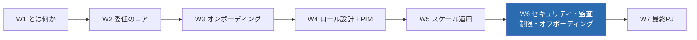
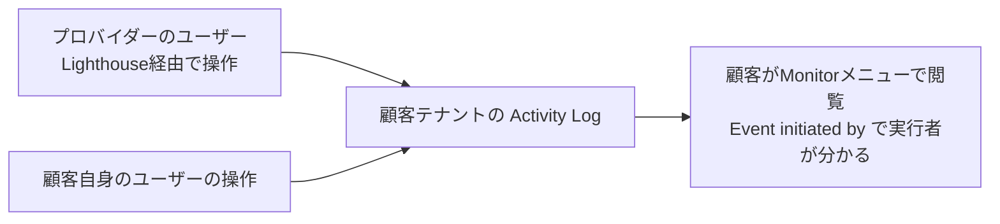
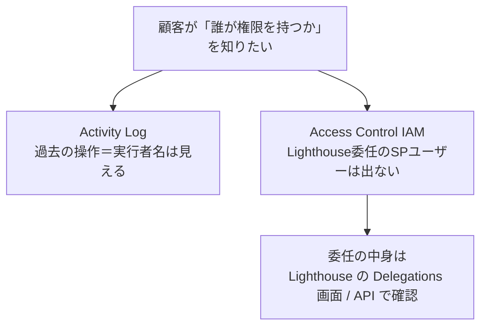
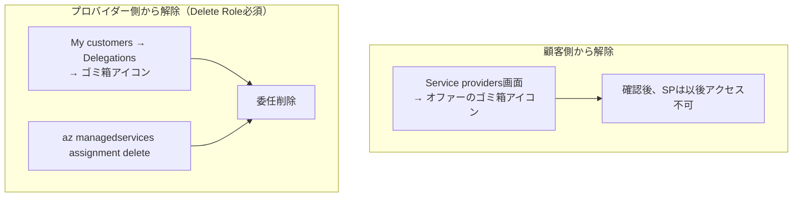
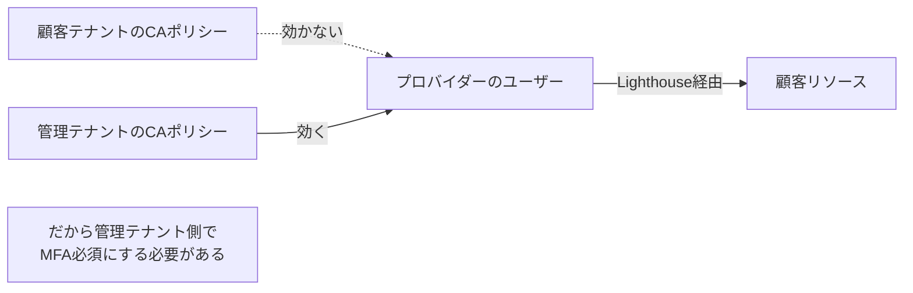

# Week 6 — セキュリティ・監査・ガバナンス・制限・オフボーディング：安全に・説明可能に・終わらせられる

> **Phase 3b** | 学習プラン Week 6 / 7
> 学習目標：委任運用を「**安全に（security）・説明可能に（audit）・いつでも終わらせられる（offboarding）**」状態にする方法を理解する。プロバイダーの操作が**顧客テナントの Activity Log**にどう残るか（透明性の実体と、IAM には出ないという注意）、顧客が **Service providers 画面**から委任を**いつでも取り消せる**こと、W4 で入れた **Delete Role** でプロバイダー側から解除する手順、そして**推奨セキュリティプラクティス**（MFA 必須・条件付きアクセスの落とし穴・グループ最小権限）と**委任の制限**（ロック・拒否割り当て・データプレーン）を総まとめする。

---

## 0. 今週の位置づけ



W1〜W5 で「設計 → 展開 → スケール」まで来た。委任は強力な権限を外部（プロバイダー）に渡す仕組みだからこそ、**顧客がそれをどう監視し・制御し・撤回できるか**が製品として成立する条件になる。今週はその「統制（ガバナンス）」の面を閉じる。ここまでで運用の一周が完結し、W7 の実装に入る。

> **初学者向け用語補足：略語・用語の展開**
> - **監査（audit）**＝「誰が・いつ・何をしたか」を後から追跡・検証できること。委任では顧客が**プロバイダーの操作**を追えることが要。
> - **オフボーディング（offboarding）**＝ オンボーディング（W3）の逆。委任を解除してアクセスを断つこと。
> - **MFA** = Multi-Factor Authentication（Multi=複数 / Factor=要素 / Authentication=認証）＝「多要素認証」。パスワード＋スマホ承認など、2 つ以上の要素で本人確認。
> - **条件付きアクセス（Conditional Access, CA）**＝ Entra の機能で「この条件（場所・端末・リスク）なら MFA を要求／ブロック」等のサインイン制御ポリシー。
> - **リソースロック（resource lock）**＝ 誤削除・誤変更を防ぐため、リソースに掛ける「削除禁止／読み取り専用」の鍵。
> - **拒否割り当て（deny assignment）**＝ RBAC の逆で「**明示的に禁止**」する仕組み。ロール割り当てより優先される。

---

## 1. 透明性 — 顧客はプロバイダーの全操作を Activity Log で見られる

Lighthouse の信頼の土台は**監査の透明性**。公式いわく：

> 顧客がサブスクリプションを委任すると、**すべての操作を見るために Azure Activity ログを閲覧できる**。これは、プロバイダーが委任リソースに対して行った操作に**完全な可視性**を与える。Activity ログには顧客自身のテナントのユーザーの操作も表示される。
> （出典：[Monitor service provider activity](https://learn.microsoft.com/en-us/azure/lighthouse/how-to/view-service-provider-activity)）



### 1-1. 「Event initiated by」列と、見えるもの・見えないもの

| 項目 | 挙動 |
| --- | --- |
| 操作名・状態・日時 | 記録される |
| **Event initiated by（実行者名）** | プロバイダー経由でも顧客自身でも、**操作したユーザー名が出る** |
| その実行者の**テナント・ロール** | **表示されない**（誰、までは分かるが、どのテナントの何ロールかは出ない） |
| 保持期間 | ポータルで**過去 90 日**。長期保存は別途設定可 |

### 1-2. 重要な非対称：Activity Log には出るが IAM には出ない

公式の注意点（監査設計で必ず押さえる）：

> プロバイダーのユーザーは Activity ログに現れる。**しかし、これらのユーザーとそのロール割り当ては、Access Control (IAM) や、API でロール割り当て情報を取得しても現れない**。
> （出典：同上）



- つまり **「今どのプロバイダーに何を委任しているか」は IAM ではなく Lighthouse の Delegations（委任）画面**で見る（W5 で触れた ARG の `ManagedServicesResources` テーブルでも確認可）。
- **プロバイダー側ユーザーが Activity Log を閲覧するには、オンボード時に Reader を含むロールが要る**（W4・W5 と一貫）。

### 1-3. 重要操作にアラートを張る

顧客（およびプロバイダー）は **Activity Log アラート**で「管理操作」「特定 RG の VM 削除」等を検知できる。アラートは**両テナントのユーザーの操作を含む**。複数ドメイン横断でユーザー活動を見る公式サンプル **Activity Logs by Domain ワークブック**もある。

---

## 2. 顧客の制御 — Service providers 画面といつでもの撤回

W1 で「対称な 2 画面」として紹介した **Service providers 画面**（顧客側）が、ここで統制の要になる。顧客は自テナントが「誰に・何を委任しているか」を確認し、**いつでも委任を取り消せる**。公式が Lighthouse の利点として挙げる「顧客のより大きな可視性と制御」の実体がこれである（出典：[overview](https://learn.microsoft.com/en-us/azure/lighthouse/overview)）。

---

## 3. オフボーディング — 委任の解除（2 通り）

委任は「**顧客側からも、プロバイダー側からも**（適切な権限があれば）」解除できる。解除すると、**それまでプロバイダーに与えられていた委任アクセスは即座に効かなくなる**。



### 3-1. 顧客側からの解除

- **権限**：`Microsoft.Authorization/roleAssignments/write` 等を持つロール（典型は **Owner**）。
- **手順**：**Service providers 画面** → **Service provider offers** → 該当オファーの行の**ゴミ箱アイコン** → 確認。以後、プロバイダーの誰も委任リソースにアクセスできない。

### 3-2. プロバイダー側からの解除（W4 の Delete Role が効く）

- **条件**：オンボード時に **Managed Services Registration Assignment Delete Role**（`91c1777a-f3dc-4fae-b103-61d183457e46`）を付与されていること。**無ければ顧客側でしか解除できない**（W2・W3・W4 で繰り返し推奨した理由がここ）。
- **手順（ポータル）**：**My customers** → **Delegations** → 該当行の**ゴミ箱アイコン**。
- **手順（CLI）**：

```bash
# 管理（プロバイダー）テナントのユーザーとしてサインイン
az login
# 委任サブスクを選択
az account set -s <subscriptionId>
# 登録割り当てを一覧
az managedservices assignment list
# 割り当てを削除（＝委任解除）
az managedservices assignment delete --assignment <id または フルresourceId>
```

> **コマンドの読み方**：`managedservices assignment list`=登録割り当ての一覧、`assignment delete --assignment <id>`=その割り当てを削除。割り当て（Assignment）を消せば委任は消滅する。W2 の「割り当ては論理射影の根拠」を思い出すと腑に落ちる——根拠を消せばアクセスが消える。

### 3-3. 落とし穴：同一プロバイダーの重複委任

公式警告：**同じサブスクに、同じプロバイダーから複数の委任があり、同じ `principalId`＋`roleDefinitionId` の組が複数に含まれる場合、1 つを消すと他の委任経由のアクセスまで失われる**ことがある。復旧は「残したい委任のオンボードをやり直す」。重複委任を作るときは principal×role の重なりに注意する。

---

## 4. 推奨セキュリティプラクティス（公式）

Lighthouse では**自テナントのユーザーが顧客サブスクに直接アクセスできる**。だから「自テナントの守り」がそのまま顧客の守りになる。

### 4-1. MFA を必須にする（＋条件付きアクセスの落とし穴）

- **管理テナントの全ユーザーに Entra MFA を必須化**する（委任リソースにアクセスするユーザーを含む）。顧客にも自テナントでの MFA を勧める。
- **最重要の落とし穴**：

> **顧客テナント側の条件付きアクセス（CA）ポリシーは、Lighthouse 経由で顧客リソースにアクセスするユーザーには適用されない。適用されるのは管理テナント側に設定したポリシーだけ**。ゆえに管理テナント・顧客テナントの**両方で** MFA を必須にすることを強く推奨する。
> （出典：[Recommended security practices](https://learn.microsoft.com/en-us/azure/lighthouse/concepts/recommended-security-practices)）



> **用語補足：なぜ顧客側 CA が効かないのか**
> Lighthouse のユーザーは**顧客テナントにアカウントを持たない**（W2 の論理射影）。サインインは管理テナントで行われるため、サインイン時に評価される CA は**管理テナントのもの**。顧客がいくら自テナントで MFA を強制しても、プロバイダー経由のアクセスはその網にかからない——だから管理テナント側の強制が必須になる。

### 4-2. グループ × 最小権限（公式の構造例）

個人でなく **Entra グループ（Security タイプ）** にロールを付け、最小権限で組む。公式の推奨構造：

| グループ名 | 種別 | ロール | ロール定義 ID |
| --- | --- | --- | --- |
| Architects | User group | Contributor | `b24988ac-6180-42a0-ab88-20f7382dd24c` |
| Assessment | User group | Reader | `acdd72a7-3385-48ef-bd42-f606fba81ae7` |
| VM Specialists | User group | VM Contributor | `9980e02c-c2be-4d73-94e8-173b1dc7cf3c` |
| Automation | SPN | Contributor | `b24988ac-6180-42a0-ab88-20f7382dd24c` |

- **グループのメンバーは定期的に棚卸し**し、不要なユーザーを外す。
- **eligible authorizations（PIM）** で privileged の常時割り当てを最小化（W4）。

### 4-3. public オファーの注意（全顧客に同じ権限）

公式明記：**public な Managed Service オファーでオンボードすると、含めたグループ／ユーザー／SPN は、そのプランを購入した"すべての顧客"に対して同じ権限を持つ**。顧客ごとに違うグループを割り当てたいなら、**顧客専用の private プラン**を出すか、**ARM テンプレートで個別にオンボード**する。「public は薄く、深い権限は private/個別テンプレで」（W3 の併用戦略と一致）。

---

## 5. 委任の制限（総まとめ）

W1・W4・W5 で断片的に触れた制限を、統制の観点で 1 表に集約する（出典：[cross-tenant management experiences](https://learn.microsoft.com/en-us/azure/lighthouse/concepts/cross-tenant-management-experience)）。

| 制限 | 内容 | 含意 |
| --- | --- | --- |
| **データプレーン不可** | ARM（`management.azure.com`）越しのみ。Blob 中身・Key Vault シークレットは対象外 | プロバイダーは顧客の**中身のデータには原則届かない**（W1・W4） |
| **リソースロックは管理テナントを止めない** | 顧客のロックがあっても、**管理テナントのユーザーの操作は妨げられない** | ロックを"プロバイダー抑止"に使えない。抑止は**ロール設計**で行う |
| **拒否割り当ては効く（システム管理分）** | Managed Applications 等が作る**システム割り当ての deny assignment** は管理テナントの操作も止める。ただし**顧客は自前の deny assignment を作れない** | 顧客が任意に"プロバイダー禁止領域"を deny で作ることはできない |
| **IAM に出ない** | 委任のロール割り当ては顧客の IAM / `az role assignment list` に出ない | 委任の実態は **Delegations 画面 / ManagedServices API** で見る（§1-2） |
| **ナショナルクラウド越え不可** | 公共クラウドとナショナルクラウド間、ナショナルクラウド同士の委任は不可 | クラウド境界を越えた委任は設計できない |
| **サブスク移管時は委任が保持** | サブスクを別テナントへ移管しても委任リソースは維持される（例外：委任先テナントへ移管した場合はその委任が解消） | 移管≠委任消滅。棚卸しの盲点になりうる |

> **設計の勘所：抑止は「ロック」でなく「ロール」で**
> 「プロバイダーにここは触らせたくない」を実現するのは、ロックや deny ではなく**委任スコープと付与ロールの設計**（W2 の RG 単位委任、W4 の最小権限・eligible）。制限表はその設計判断の裏付けになる。

---

## 6. ハンズオン — 監査と委任状態を自分の目で確認（単一テナントで可）

委任先が無くても、**Activity Log の読み方**と**委任状態の確認コマンド**は自テナントで練習できる。

> **前提**：Azure CLI／ポータル。読み取りのみ。

### 手順 A：Activity Log を開き「Event initiated by」を見る

1. Azure ポータル → **Monitor（監視）** → **Activity log（アクティビティ ログ）**。
2. 任意の操作行を開き、**「Event initiated by（イベントの開始者）」** に実行者名が出ることを確認する。委任環境ではここに**プロバイダーのユーザー名**も並ぶ——それが顧客にとっての透明性の実体。

### 手順 B：委任（登録割り当て/定義）の有無を確認

```bash
az managedservices assignment list -o table
az managedservices definition list -o table
```

> **読み方**：委任があれば割り当て・定義が並ぶ。単一テナントでは 0 件で正しい（誰にも委任していない／されていない）。**これは IAM には出ない**——委任の実態はこのコマンド（＝ManagedServices API）でしか見えない、を §1-2 の知識と結びつけて体感する。

### 手順 C：ARG で委任リソースを確認するクエリ（読んで理解）

```kusto
ManagedServicesResources
| project name, type, tenantId
```

> W5 で使った ARG の、Lighthouse 専用テーブル `ManagedServicesResources`。委任の定義・割り当てがここに現れる。単一テナントでは空でよい。

### 手順 D（読むだけ）：解除手順の確認

§3 の解除フロー（顧客側＝Service providers のゴミ箱／プロバイダー側＝Delete Role＋`az managedservices assignment delete`）を、自分の言葉でどちらが実行できるか説明できるか確認する。

> **後片付け**：読み取りのみ。作成物なし、削除不要。

---

## 7. 自己チェック

1. 顧客はプロバイダーの操作をどこで監査するか。「Event initiated by」列で分かること・分からないこと（テナント/ロール）は何か。保持期間は？
2. プロバイダーのユーザーは Activity Log には出るのに、**顧客の IAM には出ない**。では顧客は「今どの委任があるか」をどこで確認するか。
3. 委任の解除は誰ができるか（2 通り）。プロバイダー側から解除するには何が必要か。CLI では何を消すと委任が消えるか。
4. 同一プロバイダーの**重複委任**で 1 つ消すと事故が起きる条件は何か。復旧法は？
5. **顧客テナントの条件付きアクセスが Lighthouse ユーザーに効かない**のはなぜか。ゆえに MFA はどこで必須にすべきか。
6. public な Managed Service オファーの権限付与の性質（全顧客共通）と、顧客ごとに差をつける方法は？
7. 「プロバイダーにここは触らせたくない」を、リソースロックで実現できるか。正しい実現手段は何か。
8. サブスクを別テナントへ移管すると委任はどうなるか。例外は？

---

## 8. 次週予告（W7：最終 PJ — Bicep で委任オンボード＋テナント横断クエリ）

いよいよ実装。**Bicep（infra/main.bicep）** で W3〜W4 の `registrationDefinitions`＋`registrationAssignments`（authorizations／eligibleAuthorizations／Delete Role 込み）を組み、サブスクスコープでデプロイする形にまとめる。そのうえで **W5 の Resource Graph** を **Python SDK（azure-mgmt-resourcegraph）／az CLI** で叩き、`tenantId` 付きで委任リソースを横断クエリする E2E を作る。2 テナントはシミュレート（顧客側デプロイは手順・図解）で、成果物は `infra/` と `code/` に置く。これまでの 6 週が 1 本のプロジェクトに結実する。

---

### 参考（出典）
- [Monitor service provider activity（Activity Log 監査・透明性）](https://learn.microsoft.com/en-us/azure/lighthouse/how-to/view-service-provider-activity)
- [Remove access to a delegation（オフボーディング）](https://learn.microsoft.com/en-us/azure/lighthouse/how-to/remove-delegation)
- [Recommended security practices（MFA・条件付きアクセス・最小権限）](https://learn.microsoft.com/en-us/azure/lighthouse/concepts/recommended-security-practices)
- [View and manage service providers（顧客側の管理画面）](https://learn.microsoft.com/en-us/azure/lighthouse/how-to/view-manage-service-providers)
- [Cross-tenant management experiences（制限一覧）](https://learn.microsoft.com/en-us/azure/lighthouse/concepts/cross-tenant-management-experience)
