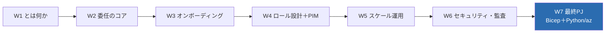
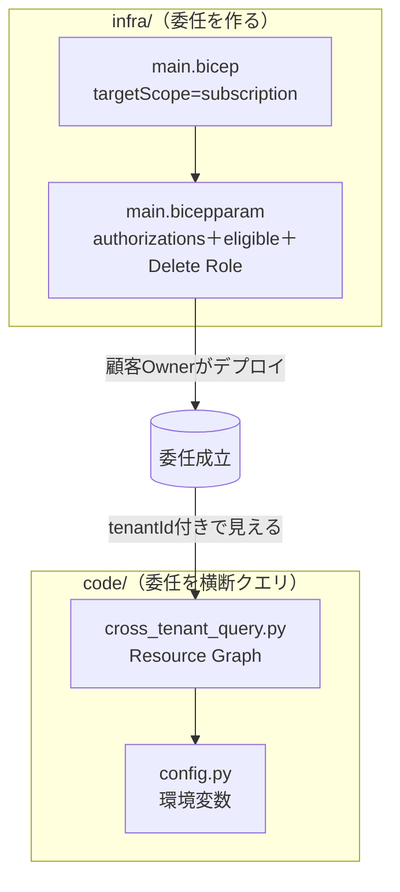
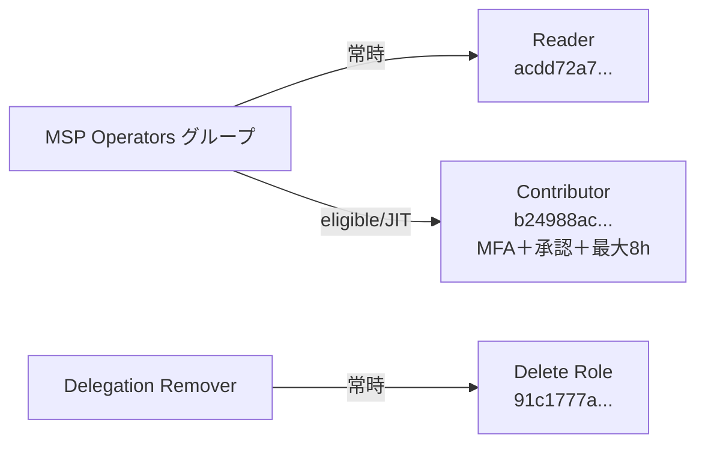
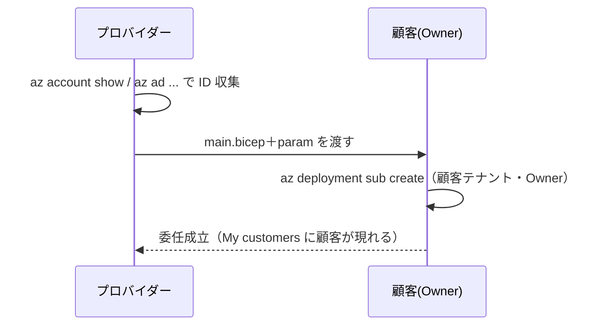
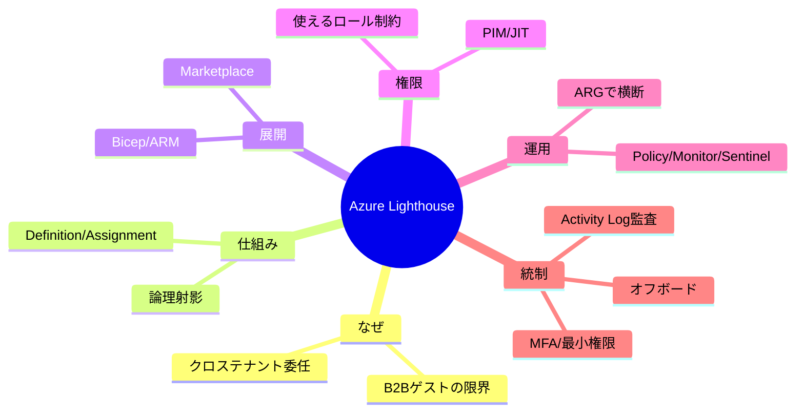

# Week 7 — 最終PJ：Bicep で委任オンボード＋Python/az でテナント横断クエリ（E2E）

> **Phase 4（最終）** | 学習プラン Week 7 / 7
> 学習目標：W1〜W6 を 1 本のプロジェクトに結実させる。**Bicep（`infra/main.bicep`）** で委任の 2 リソース（`registrationDefinitions`＋`registrationAssignments`、常時 authorizations＋eligibleAuthorizations＋Delete Role 込み）をサブスクスコープで組み、**Python SDK（`azure-mgmt-resourcegraph`）／az CLI** で委任済みリソースを `tenantId` 付きで横断クエリする E2E を作る。2 テナントはシミュレート（顧客側デプロイは手順・図解）で、成果物は `infra/` と `code/` に置く。

---

## 0. 今週の位置づけ — 6 週分が 1 本につながる



この最終週は新しい概念をほとんど足さない。代わりに、**各週で学んだ部品を実ファイルに落として動かす**。対応関係は次のとおり。

| 使う知識 | どの週 | 成果物の該当箇所 |
| --- | --- | --- |
| 委任＝2 リソース | W2 | `infra/main.bicep` の Definition／Assignment |
| Bicep・サブスクスコープ・`guid()` | W3 | `main.bicep` の `targetScope`／`registrationId` |
| 常時 vs eligible・Delete Role・ロール制約 | W4 | `main.bicepparam` の authorizations／eligibleAuthorizations |
| ARG・KQL・`tenantId` 横断 | W5 | `code/cross_tenant_query.py` |
| 秘密を直書きしない・監査・オフボード | W6 | `code/config.py`／README の後片付け |

---

## 1. 成果物の全体像



- **`infra/`**：委任を**作る**側（W2〜W4 の集大成）。顧客テナントで顧客の Owner がデプロイする（シミュレート）。
- **`code/`**：委任済みリソースを**横断クエリする**側（W5 の集大成）。プロバイダーテナントから実行する。

---

## 2. infra — Bicep で委任を組む

### 2-1. `main.bicep`（骨格の要点）

W3 の骨格に W4 の `eligibleAuthorizations` を足した形。

```bicep
targetScope = 'subscription'                       // 定義はサブスクレベル（W2・W3）

param managedByTenantId string                     // プロバイダーのテナントID（自分に委任は不可）
param authorizations array                          // 常時（W4 §5）
param eligibleAuthorizations array = []             // JIT/PIM（W4 §6）。空なら常時のみ

var registrationId = guid(mspOfferName, managedByTenantId, subscription().subscriptionId) // 冪等（W3）

resource registrationDefinition 'Microsoft.ManagedServices/registrationDefinitions@2022-10-01' = {
  name: registrationId
  properties: {
    registrationDefinitionName: mspOfferName
    description: mspOfferDescription
    managedByTenantId: managedByTenantId
    authorizations: authorizations
    eligibleAuthorizations: eligibleAuthorizations
  }
}

resource registrationAssignment 'Microsoft.ManagedServices/registrationAssignments@2022-10-01' = {
  name: registrationId
  properties: {
    registrationDefinitionId: registrationDefinition.id   // 定義を参照（W2 §4）
  }
}
```

### 2-2. `main.bicepparam`（権限設計の実体）

W4 の理想形「**常時は狭く（Reader）、privileged は必要時だけ（Contributor を eligible）**」を、同じプリンシパルに対して実装している。



- 同じ `principalId` に **常時 Reader ＋ eligible Contributor**（W4 §6-4 の「Reader 併記」必須ルールを満たす）。
- **Delete Role** を 1 件入れ、プロバイダー側から委任解除可能に（W6 §3-2）。
- `justInTimeAccessPolicy`：`multiFactorAuthProvider: 'Azure'`（MFA 必須）、`maximumActivationDuration: 'PT8H'`、承認者あり（W4 §6-3）。

### 2-3. 検証（1 テナントで可）

```bash
az bicep build --file infra/main.bicep
```

エラーが出なければ、リソース種別・プロパティ・`targetScope` が正しい。**実デプロイは顧客テナントの Owner が行う**ため、単一テナントではここまで（W3 §7）。

---

## 3. 顧客側デプロイ（2 テナント環境がある場合・シミュレート）



```bash
# 顧客テナントで Owner がサインインした状態で
az deployment sub create \
  --name lighthouse-onboard --location japaneast \
  --template-file infra/main.bicep --parameters infra/main.bicepparam

az managedservices definition list -o table   # 定義ができたか
az managedservices assignment list -o table    # 割り当てができたか
```

> 単一テナントでは `managedByTenantId` が自分になり委任不可。この手順は飛ばし、§4 の Python で「自分の tenantId のみ」を確認する。それでも ARG/KQL の手触りと横断クエリの構造は完全に体験できる。

---

## 4. code — Python でテナント横断クエリ

### 4-1. Resource Graph SDK の骨子（W5 の実装）

```python
from azure.identity import DefaultAzureCredential
from azure.mgmt.resourcegraph import ResourceGraphClient
from azure.mgmt.resourcegraph.models import QueryRequest, QueryRequestOptions

client = ResourceGraphClient(DefaultAzureCredential())
req = QueryRequest(query="Resources | project name, type, tenantId | limit 10",
                   subscriptions=None,                 # None＝アクセス可能な全て（委任含む）
                   options=QueryRequestOptions())
resp = client.resources(req)
rows = resp.data                                        # 結果（dict の配列）
# resp.skip_token があればページング（cross_tenant_query.py の run_query が処理）
```

- **認証は `DefaultAzureCredential`**（`az login` 済みでよい）。接続文字列やキーは扱わない（W6：秘密を持たない設計）。
- **`subscriptions=None`** なら、サインイン ID がアクセスできる全サブスク（＝**Lighthouse 委任分を含む**）が対象（W5 §2-1）。

### 4-2. 3 つのデモクエリ（`cross_tenant_query.py`）

| # | クエリの狙い | KQL の核 |
| --- | --- | --- |
| 1 | 見えるサブスクを `tenantId` 付きで一覧し、**委任分を印付け** | `ResourceContainers | where type=='microsoft.resources/subscriptions' | project name, subscriptionId, tenantId` |
| 2 | **顧客（tenantId）ごとのリソース件数** | `Resources | summarize count() by tenantId | order by count_ desc` |
| 3 | **HTTPS 未強制ストレージ**を横断抽出（是正候補） | `Resources | where type =~ 'Microsoft.Storage/storageAccounts' | where properties.supportsHttpsTrafficOnly == false | project name, resourceGroup, subscriptionId, tenantId` |

- 委任サブスクの判定は **`tenantId != 自分（LH_MANAGING_TENANT_ID）`**（W5 §2-4・W1 §4 の `managedByTenants` と同じ発想）。
- クエリ 3 は W5 §3 の「ARG で棚卸し → Policy で HTTPS 強制」の入口。件数が是正対象。

### 4-3. 実行

```bash
python -m venv .venv && source .venv/bin/activate
pip install -r code/requirements.txt

export LH_MANAGING_TENANT_ID="$(az account show --query tenantId -o tsv)"
az login
python code/cross_tenant_query.py
```

- 委任済み環境：出力に**別テナント（顧客）の行**が混じる＝横断が効いている証拠。
- 単一テナント：全行が自分の `tenantId`。それでも「委任すればここに顧客が並ぶ」構造を体感できる。

---

## 5. 後片付け（W6 §3 の実践）

```bash
# プロバイダー側から解除（param に Delete Role を入れてあるので可能）
az managedservices assignment list
az managedservices assignment delete --assignment <id または フルresourceId>
```

または顧客側で **Service providers 画面 → オファーのゴミ箱アイコン**。割り当て（Assignment）を消せば論理射影の根拠が消え、委任アクセスは即座に断たれる（W2・W6）。Python 実行自体は読み取りのみで作成物なし。

---

## 6. 到達点の確認 — 7 週で何ができるようになったか



- **設計**：委任を 2 リソースで説明し、Bicep で書ける。
- **権限**：使えるロールの制約を判定し、常時／eligible を最小権限で組める。
- **運用**：ARG でテナント横断に棚卸しし、Policy で強制する道筋を描ける。
- **統制**：監査の透明性・オフボード・MFA/条件付きアクセスの落とし穴を説明できる。

---

## 7. 自己チェック（総合）

1. `infra/main.bicep` の 2 リソースはそれぞれ何を表し、どのプロパティで結びついているか。`targetScope` はなぜ `subscription` か。
2. `main.bicepparam` で、同じプリンシパルに常時 Reader と eligible Contributor を付けているのはなぜか（W4 の必須ルール）。Delete Role を入れる意味は？
3. `cross_tenant_query.py` は認証に何を使い、なぜ接続文字列を持たないか。`subscriptions=None` は何を対象にするか。
4. クエリ結果の**どの列**で「どの顧客のリソースか」を仕分けるか。委任サブスクはどう判定するか。
5. 顧客側デプロイをプロバイダーが代行できないのはなぜか。委任を解除する 2 通りは？
6. この E2E が**扱えない**もの（データプレーン等）は何か。それはどの週で学んだ制約か。

---

## 8. 学習プラン修了

全 7 週（W1 とは何か → W2 コア → W3 オンボーディング → W4 ロール/PIM → W5 スケール運用 → W6 セキュリティ/監査 → W7 最終PJ）を完了。Azure Lighthouse を「概念の理解」から「Bicep で委任を組み、Python でテナント横断クエリを回す」まで一気通貫で扱えるようになった。

さらに深めるなら：
- **Azure-Lighthouse-samples**（公式テンプレート集）で multi-rg／eligible／Marketplace 各パターンを読む。
- **エンタープライズ内マルチテナント**（[enterprise](https://learn.microsoft.com/en-us/azure/lighthouse/concepts/enterprise)）での自社複数テナント統合。
- **Azure Arc × Lighthouse** で Azure 外サーバまで横断管理（W5 で俯瞰）。

---

### 参考（出典）
- [Onboard a customer / ARM テンプレート](https://learn.microsoft.com/en-us/azure/lighthouse/how-to/onboard-customer)
- [Microsoft.ManagedServices/registrationDefinitions（Bicep スキーマ）](https://learn.microsoft.com/en-us/azure/templates/microsoft.managedservices/registrationdefinitions)
- [Create eligible authorizations（PIM/JIT）](https://learn.microsoft.com/en-us/azure/lighthouse/how-to/create-eligible-authorizations)
- [Deploy Azure Policy at scale / Resource Graph 横断](https://learn.microsoft.com/en-us/azure/lighthouse/how-to/policy-at-scale)
- [Azure Resource Graph（Python SDK・KQL）](https://learn.microsoft.com/en-us/azure/governance/resource-graph/overview)
- [Remove access to a delegation（オフボード）](https://learn.microsoft.com/en-us/azure/lighthouse/how-to/remove-delegation)
