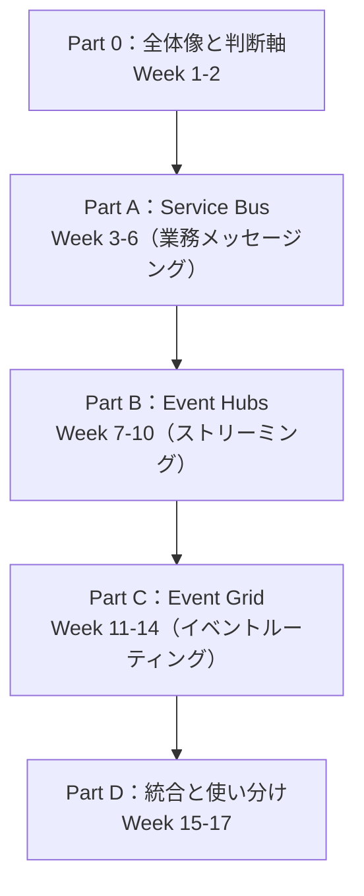
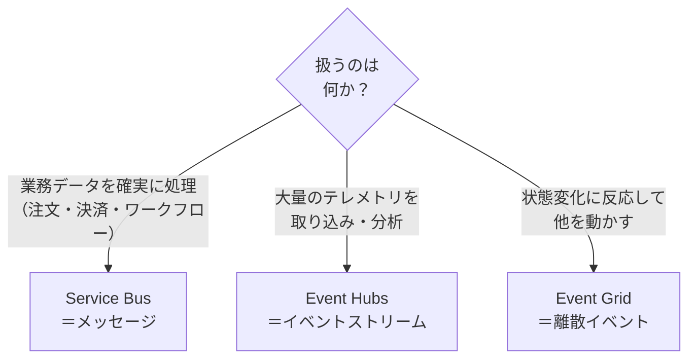

# Azure メッセージング3兄弟 — Event Hubs / Service Bus / Event Grid 統合学習プラン

> **全17週** | Event Hubs・Service Bus・Event Grid を **比較しながら一緒に**学ぶ
> 学習目標：3サービスの「存在理由・役割・違い」を自分の言葉で説明でき、「いつどれを使うか」を要件から判断でき、最終的に3サービスを連携させた E2E アーキテクチャを Bicep + Python Functions で構築できる

---

## なぜ「3つ一緒に」学ぶのか

Storage は単体で完結する基盤サービスだったが、**メッセージング/イベント系は「どれをいつ使うか」「互いに何が違うか」の把握こそが最大の難所**。
そして Microsoft 自身が、この3つを **1ページで横並びに比較**して教えている（公式「[Compare messaging services](https://learn.microsoft.com/en-us/azure/service-bus-messaging/compare-messaging-services)」）。

| サービス | 一言で（公式の主目的） | データモデル | 代表シナリオ |
|---|---|---|---|
| **Event Grid** | Reactive event routing（反応的なイベント配信） | **イベント**（離散的な通知） | 状態変化への反応・サーバーレス連携 |
| **Event Hubs** | Big data streaming and ingestion（大量ストリーム取り込み） | **イベントストリーム**（時系列の連続） | テレメトリ・リアルタイム分析 |
| **Service Bus** | Enterprise transactional messaging（業務トランザクション） | **メッセージ**（価値ある業務データ） | 注文処理・決済・ワークフロー |

だから本プランは **別々の教材を3つ作らず**、1つの `messaging/` 教材に統合し、**各サービスを深掘りした後に必ず横断比較に戻る**構成にしている。

> **核心の対立軸：イベント vs メッセージ**
> - **イベント（Event）**＝「**何かが起きた**」という軽量な通知。発行側は**処理のされ方に関心を持たない**（fire-and-forget）。→ Event Grid / Event Hubs
> - **メッセージ（Message）**＝消費されること・処理されることを**期待した業務データ**。発行側と消費側に**契約（contract）がある**。→ Service Bus
>
> ```mermaid
> flowchart LR
>     subgraph EV["イベント＝通知（関心の分離）"]
>         P1["発行者<br/>『起きたよ』"] -->|"処理は知らない"| S1["購読者A"]
>         P1 -->|"反応は任せる"| S2["購読者B"]
>     end
>     subgraph MSG["メッセージ＝業務データ（契約あり）"]
>         P2["送信者<br/>『これを処理して』"] -->|"完了を期待"| C2["受信者<br/>処理して応答"]
>     end
> ```

---

## 全体像（3部構成・17週）



「全体像で地図を持つ → 各サービスを4週ずつ深掘り → 最後に横断比較と3サービス連携の最終PJ」で**比較に厚みを持たせる**。

### Part 0 — 全体像と判断軸（Week 1–2）

| Week | テーマ | 主な内容 |
|---|---|---|
| **[1](notes/week1.md)** | なぜ3つあるのか（メッセージ・イベント・ストリームの違い） | 3サービスの存在理由／イベント vs メッセージ vs ストリームの本質／判断フレーム初版／各サービスを1つずつ触る最初の成功体験 |
| **2** | オブジェクトモデル横断比較と配信セマンティクス | Queue/Topic-Subscription ⇔ EventHub/Partition/ConsumerGroup ⇔ Topic/Subscription/Filter／push vs pull・at-least-once・順序・重複・冪等性 |

### Part A — Service Bus（Week 3–6）※エンタープライズメッセージング

| Week | テーマ | 主な内容 |
|---|---|---|
| **[3](notes/week3.md)** | Queue と Topic-Subscription の基礎 | 送受信、PeekLock vs ReceiveAndDelete、ロック・補完 |
| **[4](notes/week4.md)** | 信頼性を支える高度機能 | DLQ、セッション(FIFO)、重複検出、スケジュール配信、メッセージ遅延 |
| **[5](notes/week5.md)** | トランザクションと大容量 | トランザクション、自動転送(Auto-forward)、大容量メッセージ(Premium)、AMQP/JMS |
| **[6](notes/week6.md)** | セキュリティ・監視・スケーリング | Entra ID/RBAC/SAS、Metrics/診断ログ、Premium/Geo-DR |

### Part B — Event Hubs（Week 7–10）※ビッグデータ・ストリーミング

| Week | テーマ | 主な内容 |
|---|---|---|
| **[7](notes/week7.md)** | ストリーミングの仕組み | パーティション、コンシューマーグループ、オフセット/チェックポイント、TU/PU |
| **8** | プロデューサ／コンシューマ実装 | 送受信 SDK、EventProcessorClient、バッチ送信、負荷分散 |
| **9** | 取り込み基盤としての連携 | Capture(Parquet/Avro→Storage)、Kafka 互換エンドポイント、Schema Registry |
| **10** | セキュリティ・監視・スケーリング | Auto-inflate/Dedicated、Entra ID、Stream Analytics 連携 |

### Part C — Event Grid（Week 11–14）※イベントルーティング

| Week | テーマ | 主な内容 |
|---|---|---|
| **11** | トピックとイベントスキーマ | System/Custom/Domain/Partner トピック、EventGrid スキーマ vs CloudEvents 1.0 |
| **12** | 配信とフィルタリング | サブスクリプション・高度フィルタ、ハンドラ種別、配信・リトライ・DLQ |
| **13** | Namespace topics と MQTT | 名前空間トピック、MQTT(IoT)、pull 配信 |
| **14** | セキュリティ・監視・連携 | Entra ID、Functions/Logic Apps/Webhook 連携、CloudEvents 相互運用 |

### Part D — 統合と使い分け（Week 15–17）

| Week | テーマ | 主な内容 |
|---|---|---|
| **15** | 横断比較の総まとめ | 決定木、コスト、SLA、順序/スループット/レイテンシ/制約マトリクス |
| **16** | 組み合わせアーキテクチャ | Event Grid→Function→Service Bus／telemetry→Event Hubs→Stream Analytics／Service Bus DLQ→Event Grid 通知 |
| **17** | 最終プロジェクト | 3サービス連携 E2E（Bicep + Python Functions + テスト） |

---

## 「いつどれを使うか」判断フレーム（公式準拠・要約）

詳細な決定木は [Week 1](notes/week1.md) §3 と Week 15 で扱う。まずは大枠：



| 判断の軸 | Event Grid | Event Hubs | Service Bus |
|---|---|---|---|
| 配信保証 | At least once | At least once | At least once（セッションで順序・重複排除） |
| 順序 | 保証なし | パーティション単位 | FIFO（セッション） |
| トランザクション | ✗ | ✗ | ✓ |
| 重複検出 | ✗ | ✗ | ✓ |
| DLQ（デッドレター） | ✓ | ✗ | ✓ |
| リプレイ | ✗ | ✓（Capture） | ✗ |
| プロトコル | MQTT, HTTP | AMQP, Kafka, HTTP | AMQP, HTTP |
| スケール単位 | サーバーレス（自動） | TU / PU | Messaging Units（Premium） |

> **3つは競合ではなく共存する**。EC サイトなら「注文処理＝Service Bus／サイトのテレメトリ＝Event Hubs／出荷イベントへの反応＝Event Grid」と**役割分担**するのが典型。Week 16-17 で実際に組み合わせる。

---

## 進め方（既存教材と共通のルール）

- **1週ずつ進める**。各 `notes/weekN.md` を読み、ハンズオンを実際に手で動かしてから次へ
- **用語は図解で補足**：初出の用語は `> **初学者向け用語補足：…**` で、Mermaid フロー＋ASCII 表を交えて噛み砕く
- **公式ドキュメントで裏取り**：本文の事実は Microsoft Learn の該当ページで確認済み（主に「Compare messaging services」と各サービスの "What is…" / overview）
- `code/` `infra/` `slides/` は後続週で段階的に追加（Bicep は Week 6/10/14 でセキュリティ・監視を、Week 17 で3サービス連携を実装）

## 既存教材との位置づけ

このリポジトリ（[`yoyoma-ru/Azure`](https://github.com/yoyoma-ru/Azure)）には学習教材がサブフォルダで並ぶ：

| フォルダ | 内容 | 週数 |
|---|---|---|
| `storage/` | Azure Storage（Blob 主軸） | 10 |
| `api-management/` | API Management | 10 |
| `ai-search/` | AI Search | 8 |
| `redis/` | Azure Cache/Managed Redis | 7 |
| **`messaging/`** | **Event Hubs / Service Bus / Event Grid（本教材）** | **17** |

Storage の Queue（§Week 1 で俯瞰した「単純なメッセージキュー」）から一歩進み、**本格的なメッセージング/イベント基盤**を扱うのが本教材。Storage Queue と Service Bus Queue の違いは Week 3 で対比する。

---

## 参考（一次情報）

- [Compare messaging services（Event Grid / Event Hubs / Service Bus）](https://learn.microsoft.com/en-us/azure/service-bus-messaging/compare-messaging-services)
- [Azure Service Bus overview](https://learn.microsoft.com/en-us/azure/service-bus-messaging/service-bus-messaging-overview)
- [Azure Event Hubs — What is Event Hubs?](https://learn.microsoft.com/en-us/azure/event-hubs/event-hubs-about)
- [Azure Event Grid overview](https://learn.microsoft.com/en-us/azure/event-grid/overview)
