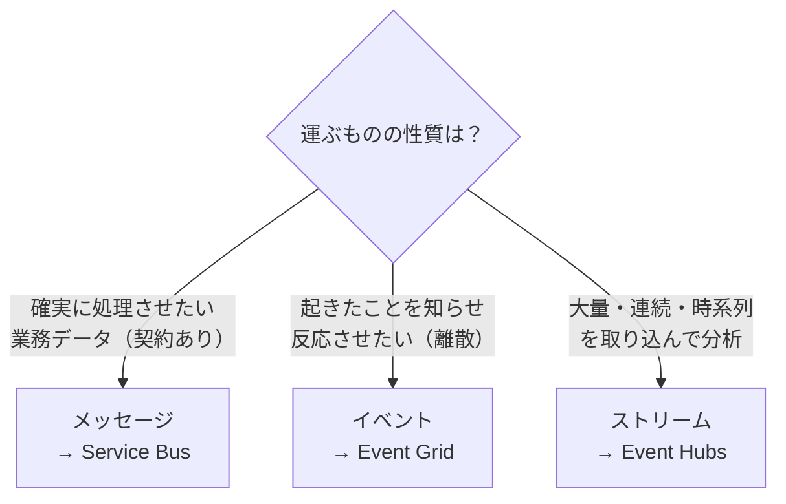
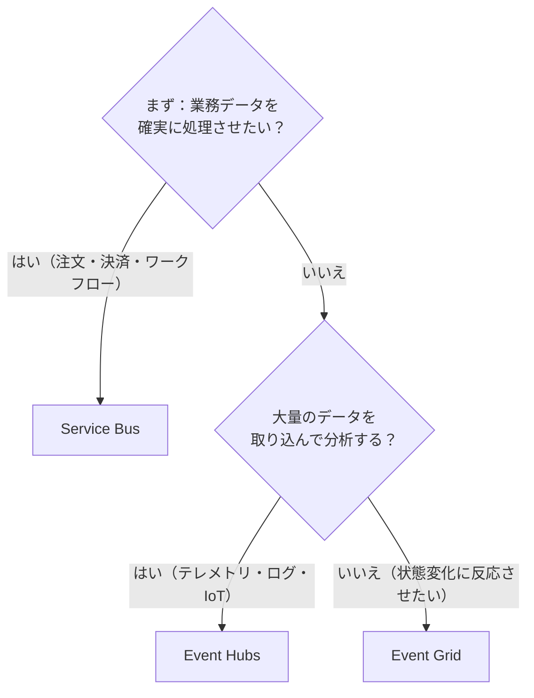
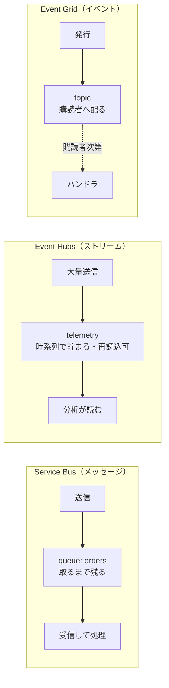

# Week 1 — なぜ3つあるのか（メッセージ・イベント・ストリームの違い）と最初の成功体験

> **Phase 0** | 学習プラン Week 1 / 17
> 学習目標：Event Hubs・Service Bus・Event Grid が「なぜ3つ別々に存在するのか」「イベントとメッセージとストリームは何が違うのか」を自分の言葉で説明でき、3サービスを 1 つずつ作って最小の送受信を体験できる

---

## 0. 今週の位置づけ

この学習プランは **3つのサービスを比較しながら一緒に**学ぶ（理由は [README](../README.md) を参照）。Storage と違い、この分野は「**どれをいつ使うか・互いに何が違うか**」の把握こそが最大の難所だから、最初に**全体の地図**を頭に入れる。Week 1 は 2 つのことをやる。

1. **思想**：なぜ3つもあるのか、「イベント / メッセージ / ストリーム」という3つの言葉が何を指し分けているのか（§1〜§3）
2. **手を動かす**：3サービスを 1 つずつ作り、最小の「送って受ける」を体験する（§4〜§5。**それぞれ数分で成功体験**）

> Storage の Week 1 では Queue（単純なメッセージキュー）を「俯瞰」で流した。本教材はそこから一歩進み、**本格的なメッセージング/イベント基盤**を主役として扱う。Storage Queue と Service Bus Queue の違いは Week 3 で対比する。

---

## 1. なぜ「直接呼び出し」では困るのか

アプリが大きくなると、機能どうしが**互いを直接呼び合う**（同期呼び出し）構造が必ず破綻し始める。

例：EC サイトで「注文を受けたら、在庫を引き、決済し、メールを送り、分析基盤に記録し、配送に通知する」。これを注文サービスが**全部を順番に直接呼ぶ**と——

| 直接呼び出しだと | 何が起きるか |
|---|---|
| メールサービスが落ちている | 注文処理ごと失敗する（巻き添え） |
| 決済が遅い | 注文 API のレスポンスがその分遅くなる |
| 新しく「ポイント付与」を追加したい | 注文サービスのコードを毎回書き換える（密結合） |
| 急に注文が 10 倍来た | 全サービスが同時に過負荷になる |

つまり「**送る側と受ける側が直接つながっている**」と、片方の障害・遅さ・変更が相手に伝播する。これを**密結合（tight coupling）**という。

> **初学者向け用語補足：同期 / 非同期、密結合 / 疎結合**
> - **同期（synchronous）呼び出し**：相手を呼んで**返事が返るまで待つ**。電話のイメージ。相手が出ないと自分も止まる。
> - **非同期（asynchronous）**：相手に用件を**預けて、自分は先に進む**。郵便受けに手紙を入れるイメージ。相手はあとで処理する。
> - **密結合**：A が B を直接知っていて直接呼ぶ。B が変わると A も直す必要がある。
> - **疎結合（loose coupling）**：A と B の間に**仲介役（メッセージング基盤）**を挟む。A は「仲介役に置く」だけ、B は「仲介役から取る」だけ。互いを直接知らない。
>
> ```mermaid
> flowchart LR
>     subgraph TIGHT["密結合（直接呼び出し）"]
>         A1["注文"] --> B1["在庫"]
>         A1 --> C1["決済"]
>         A1 --> D1["メール"]
>     end
>     subgraph LOOSE["疎結合（仲介役を挟む）"]
>         A2["注文"] --> M["メッセージング基盤<br/>（仲介役）"]
>         M --> B2["在庫"]
>         M --> C2["決済"]
>         M --> D2["メール"]
>     end
> ```

**仲介役（ブローカー）を1枚挟む**ことで、送る側は相手の生死・速度・数を気にせず「置く」だけでよくなる。受ける側は自分のペースで「取る」。これが Event Hubs / Service Bus / Event Grid に共通する根っこの価値。

> **初学者向け用語補足：ブローカー（broker）とは**
> 「仲介業者」の意味。メッセージング基盤は、送信者と受信者の間に立ち、**データを一時的に預かって受け渡す仲介役**。送信者から見れば「預け先」、受信者から見れば「取り出し元」。3サービスはいずれもこのブローカーの一種だが、**得意な預かり方が違う**——それが §2 以降のテーマ。

---

## 2. 核心：イベント・メッセージ・ストリームは何が違うのか

3つが別々に存在する理由は、**「何を運ぶか」が根本的に違う**から。Microsoft 公式も、まず「イベント」と「メッセージ」を区別せよと説く。

### 2-1. イベント（Event）＝「何かが起きた」という軽い通知

**発行者が「ある状態変化が起きた」と知らせるだけ**の軽量な通知。発行者は**それがどう処理されるかに関心を持たない**（fire-and-forget＝撃ちっぱなし）。

- 例：「ファイルがアップロードされた」「VM が作成された」「注文が出荷された」
- 中身は小さい（「何が・いつ起きたか」のメタ情報が中心。実体データそのものは含まないことが多い）
- → **Event Grid** が担当（離散的なイベントの配信）

### 2-2. メッセージ（Message）＝「これを処理して」という業務データ

**消費・処理されることを期待した、価値ある業務データ**。発行者と消費者の間に**契約（contract）**がある——「この形式で送るから、受け取って処理し、終わったら応答してね」。

- 例：「注文 #1234 を処理せよ（商品・金額・宛先つき）」
- 中身は重要（失ってはいけない。順序や重複排除が要ることも多い）
- → **Service Bus** が担当（業務トランザクションメッセージング）

### 2-3. ストリーム（Stream）＝時系列に連続して流れる大量のイベント

イベントの一種だが、**1件1件に反応するのではなく、時系列に並んだ連続データとして大量に取り込み、後で分析する**もの。

- 例：IoT センサーが毎秒送る計測値、Web サイトのクリックログ、アプリのテレメトリ
- 中身は1件は小さいが、**毎秒数百万件**といった桁で流れ続ける
- → **Event Hubs** が担当（ビッグデータのストリーミング取り込み）



> **重要な概念の区別：イベント vs メッセージ（最頻出の混同）**
> 言葉が似ているが、**発行者の「関心」と「契約」の有無**で分かれる。
>
> | 観点 | イベント（Event Grid） | メッセージ（Service Bus） |
> |---|---|---|
> | 何を運ぶ | 「起きた」という通知 | 処理してほしい業務データ |
> | 発行者の関心 | 処理のされ方に**関心なし** | 確実に**処理されることを期待** |
> | 契約 | なし（誰が受けても自由） | あり（形式・処理・応答の約束） |
> | 失ったら | 多くは許容（通知の取りこぼし） | **致命的**（注文消失など） |
> | たとえ | 館内放送「商品が入荷しました」 | 受付の整理券「この番号を必ず呼んで」 |
>
> **イベントとストリームの違い**は「**1件に反応するか / 大量を束ねて分析するか**」。Event Grid は1件の出荷イベントで処理を起動する。Event Hubs は毎秒大量のセンサー値を貯めて、後段の分析が読む。

> **初学者向け用語補足：fire-and-forget（撃ちっぱなし）**
> 発行者がイベントを送ったら、**その後どうなったかを追わない**スタイル。「知らせるところまでが自分の仕事、反応するかは相手次第」。これにより発行者は受信者の数や状態に縛られず、受信者を後から自由に増やせる（疎結合の極み）。Service Bus のメッセージは逆に「処理されたか」を気にする（応答・完了・再試行がある）。

---

## 3. 3サービスの「いつ使うか」判断フレーム（初版）

公式の比較表をもとにした、最初の判断の地図。詳細な決定木は Week 15 で完成させる。



| 判断の軸 | Event Grid | Event Hubs | Service Bus |
|---|---|---|---|
| 主目的 | 反応的なイベント配信 | 大量ストリーム取り込み | 業務トランザクション |
| データモデル | イベント（離散通知） | イベントストリーム（時系列） | メッセージ（業務データ） |
| 順序保証 | なし | パーティション単位 | FIFO（セッション） |
| 重複検出 | ✗ | ✗ | ✓ |
| トランザクション | ✗ | ✗ | ✓ |
| DLQ（デッドレター） | ✓ | ✗ | ✓ |
| リプレイ（再読込） | ✗ | ✓（Capture） | ✗ |
| スループット | サーバーレス自動 | 毎秒数百万件 | 確実な非同期配信 |
| プロトコル | MQTT, HTTP | AMQP, Kafka, HTTP | AMQP, HTTP |

> **3つは競合ではなく共存する**。EC サイトの例：
> - **注文処理** → Service Bus（1件も失えない、順序・トランザクションが要る）
> - **サイトのテレメトリ収集** → Event Hubs（大量のクリック/閲覧ログを分析へ）
> - **「出荷された」への反応** → Event Grid（在庫・通知・ポイント付与を起動）
>
> ```mermaid
> flowchart LR
>     USER["ユーザー操作"]
>     USER -->|"注文を確実に処理"| SB["Service Bus"]
>     USER -->|"行動ログを大量取り込み"| EH["Event Hubs"]
>     SHIP["『出荷』状態変化"] -->|"反応を起動"| EG["Event Grid"]
>     EG --> FUNC["Functions / 通知 / 在庫"]
> ```
> この「組み合わせ」は Week 16-17 で実際に Bicep + Functions で組む。今週は**それぞれを単体で触る**ところから。

> **初学者向け用語補足：DLQ（デッドレターキュー）/ リプレイ**
> - **DLQ（Dead-Letter Queue）**：何度試しても処理できなかった「配達不能」メッセージを、捨てずに**専用の保管場所へ退避**する仕組み。郵便の「あて先不明郵便」棚。Service Bus と Event Grid にはあるが Event Hubs にはない（後述の理由）。
> - **リプレイ（replay）**：いったん流れたデータを**もう一度最初から読み直せる**こと。Event Hubs はストリームを一定期間そのまま保持するので、後から別の分析が頭から読める。Service Bus は「取って処理したら消える」モデルなのでリプレイの概念がない。この違いは Week 7 で深掘りする。

---

## 4. 最初の成功体験：3サービスを1つずつ作る

ここから手を動かす。**3つを1つずつ作って、最小の「送って受ける」**を体験する。所要は各数分。リソースは学習用に最小構成（無料/最安 SKU）。

> 共通の前提：`az login` 済みで、サブスクリプションが選択されていること。リージョンは `japaneast` を例にする。リソースグループは使い回す。
>
> ```bash
> RG=rg-messaging-week1
> LOC=japaneast
> az group create -n $RG -l $LOC
> ```

### 4-1. Service Bus（メッセージ）— キューに送って受ける

```bash
SBNS=sbns-week1-$RANDOM           # 名前空間（グローバル一意）
az servicebus namespace create -g $RG -n $SBNS -l $LOC --sku Basic
az servicebus queue create -g $RG --namespace-name $SBNS -n orders

# 送信・受信は Portal の「Service Bus Explorer」が最も手軽：
#   名前空間 → Queues → orders → Service Bus Explorer
#   → Send messages でテキストを送信 → Peek/Receive で取り出す
```

> Basic SKU は Queue まで（Topic は Standard 以上）。送受信の SDK 実装は Week 3 で扱う。まずは「送ったメッセージが、取り出すまでキューに**残って待っている**」ことを体感する。

### 4-2. Event Hubs（ストリーム）— イベントを送り込む

```bash
EHNS=ehns-week1-$RANDOM
az eventhubs namespace create -g $RG -n $EHNS -l $LOC --sku Basic
az eventhubs eventhub create -g $RG --namespace-name $EHNS -n telemetry

# Portal の Event Hubs インスタンス → 「Data Explorer」で
#   Send events からイベントを送信し、
#   View events で受信（取り込まれた連続データ）を確認する
```

> ポイント：Event Hubs は「**取ったら消える**」のではなく、送ったイベントが**保持期間（Basic は1日）そのまま貯まり続ける**。Service Bus との根本的な違い（リプレイ可能）をここで体感しておく。

### 4-3. Event Grid（イベント）— カスタムトピックに発行する

```bash
EGT=egtopic-week1-$RANDOM
# Event Grid の拡張が必要な場合：az extension add -n eventgrid
az eventgrid topic create -g $RG -n $EGT -l $LOC

# エンドポイントとキーを取得して、1件イベントを発行
TOPIC_ENDPOINT=$(az eventgrid topic show -g $RG -n $EGT --query endpoint -o tsv)
TOPIC_KEY=$(az eventgrid topic key list -g $RG -n $EGT --query key1 -o tsv)

curl -X POST "$TOPIC_ENDPOINT" \
  -H "aeg-sas-key: $TOPIC_KEY" \
  -H "Content-Type: application/json" \
  -d '[{
    "id": "1",
    "eventType": "Order.Shipped",
    "subject": "orders/1234",
    "eventTime": "2026-06-27T10:00:00Z",
    "data": { "orderId": "1234" },
    "dataVersion": "1.0"
  }]'
```

> このイベントは「発行」しただけで、まだ**購読者（サブスクリプション）がいない**ので誰も受け取らない。これが Event Grid の本質——**発行者は受信者を知らない**（fire-and-forget）。購読してハンドラ（Functions 等）につなぐのは Week 11-12。今週は「発行が 200 で受理される」ところまで。

> **初学者向け用語補足：名前空間（Namespace）/ トピック / キュー**
> - **名前空間（namespace）**：Service Bus / Event Hubs の**いちばん外側の入れ物**（契約・課金・エンドポイントの単位）。Storage の「ストレージアカウント」に相当。1つの名前空間の中に複数のキューやイベントハブを作る。
> - **キュー（queue）**：Service Bus で「1対1」でメッセージを並べる管。送った順に1人が取る。
> - **トピック（topic）**：「1対多」で配る仕組み。Service Bus・Event Grid の両方に出てくるが**意味が少し違う**ので Week 2/3/11 で区別する。

---

## 5. ハンズオン後の整理：3つを並べて眺める



| 体感したこと | どのサービス | 何を意味するか |
|---|---|---|
| 送ったメッセージが取るまで残った | Service Bus | 確実に処理させる（pull 型・契約あり） |
| 送ったイベントが貯まり続けた | Event Hubs | 大量取り込み・後から再読込（ストリーム） |
| 発行しても誰も受けなかった | Event Grid | 発行者は受信者を知らない（fire-and-forget） |

---

## ハンズオン チェックリスト

- [ ] リソースグループ `rg-messaging-week1` を作成した
- [ ] Service Bus 名前空間＋キュー `orders` を作り、Portal の Service Bus Explorer で送受信した
- [ ] Event Hubs 名前空間＋イベントハブ `telemetry` を作り、Data Explorer で送信・受信を確認した
- [ ] Event Grid カスタムトピックを作り、`curl` で 1 件発行して 200 が返ることを確認した
- [ ] 「メッセージ／ストリーム／イベント」の違いを、自分の言葉で 1 文ずつ書けた

---

## 自己チェック

週末にドキュメントを閉じて答えてみる。

1. **なぜ「直接呼び出し」だと破綻するのか？仲介役を挟むと何が嬉しいのか？**
   - キーワード：密結合・障害の伝播・疎結合・非同期
2. **「イベント」と「メッセージ」の違いを、関心と契約の観点で説明できるか？**
   - キーワード：fire-and-forget・契約・失っていいか
3. **「イベント」と「ストリーム」は何が違うのか？**
   - キーワード：1件に反応 vs 大量を束ねて分析・リプレイ
4. **EC サイトで3サービスをどう役割分担させるか、1 例ずつ挙げられるか？**
   - キーワード：注文=Service Bus、テレメトリ=Event Hubs、出荷反応=Event Grid

---

## 次週の予告（Week 2）

オブジェクトモデルを横断比較し、配信の約束事（セマンティクス）を揃える：

- **Queue / Topic-Subscription**（Service Bus）⇔ **EventHub / Partition / ConsumerGroup**（Event Hubs）⇔ **Topic / Subscription / Filter**（Event Grid）を**1枚の対応表**で並べる
- **push 型 と pull 型**の違い（誰が取りに行くのか）
- **配信保証**：at-least-once / at-most-once / 重複・順序・冪等性——「同じものが2回来るかも」を前提に設計する考え方
- これが Part A（Service Bus）以降の共通言語になる
