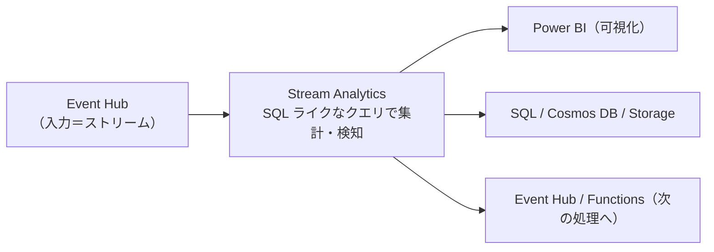
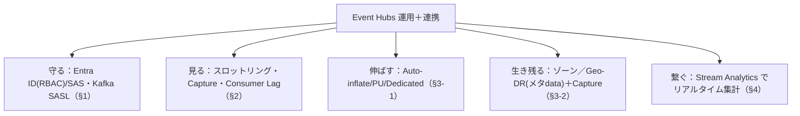

# Week 10 — Event Hubs を運用する：セキュリティ・監視・スケーリングと Stream Analytics 連携（Part B 最終週）

> **Phase B**（Event Hubs）| 学習プラン Week 10 / 17
> 学習目標：Event Hubs のセキュリティ（Entra ID/RBAC/SAS・Kafka の SASL）を Service Bus と対比して説明でき、監視すべきメトリクス（スロットリング・Capture バックログ）とスケール手段（Auto-inflate・PU・Dedicated）を理解し、Stream Analytics でストリームに SQL ライクな集計（ウィンドウ関数）をかける後段処理の位置づけを掴む

---

## 0. 今週の位置づけ

Part B（Event Hubs）の締め。Service Bus の運用週（Week 6）と**同じ3本柱＋連携**で締める。多くは Week 6 と同型なので、**違いと Event Hubs 固有**に絞る。

1. **守る**：認証・認可（§1）
2. **見る**：メトリクス（スロットリング・Capture バックログ）（§2）
3. **伸ばす/生き残る**：Auto-inflate・PU・Dedicated・Geo-DR（§3）
4. **繋ぐ**：Stream Analytics でリアルタイム集計（§4）

---

## 1. セキュリティ：認証・認可

基本は Service Bus（Week 6 §1）と**同じ考え方**。Entra ID（推奨）と SAS の2方式、最小権限。

### 1-1. Entra ID：RBAC ロール

```text
  Azure Event Hubs Data Owner    … 送受信＋管理
  Azure Event Hubs Data Sender   … 送信のみ
  Azure Event Hubs Data Receiver … 受信のみ
```

Week 8 で自分に付けた **Data Owner** がこれ。本番は最小権限で、プロデューサ＝Sender、コンシューマ＝Receiver に絞る。スコープも名前空間／特定イベントハブに限定できる。

> **Event Hubs 固有の注意：コンシューマは Storage の権限も要る**（Week 8）。チェックポイントを Blob に書くため **Storage Blob Data Contributor**（Capture を使うなら保存先に **Storage Blob Data Owner**）も併せて必要。Event Hubs だけでは完結しない。

### 1-2. SAS と Kafka の認証

- **SAS**：共有アクセスポリシー（Listen/Send/Manage）。Service Bus と同じ（Week 6 §1-3）。
- **Kafka クライアント**（Week 9 §2）：TLS 必須（`SASL_SSL`）＋ **OAUTHBEARER**（Entra ID）または **PLAIN**（SAS）。

> 名前空間で**ローカル認証（SAS）を無効化**して Entra ID のみに強制可。ネットワークは IP フィルタ・サービスエンドポイント・**プライベートエンドポイント**（Week 6 と同じ）。

---

## 2. 監視：メトリクス

「流量・詰まり・取りこぼし」を見る。Event Hubs 固有の注目点は **スロットリング** と **Capture バックログ**。

| メトリクス | 見る意味 |
|---|---|
| **Incoming / Outgoing Messages・Bytes** | 送受信の流量（Week 7 の Data Explorer で見たもの） |
| **Throttled Requests（スロットリング）** | **TU 超過で入力が絞られている**（`ServiceBusy`・Week 7）＝**スケールの合図** |
| **Captured Messages / Bytes** | Capture が保存できているか。詰まり＝保存先 Storage の問題（Week 9 §1） |
| **Quota Exceeded Errors** | 接続数・パーティション上限などの超過 |
| **Consumer Lag（消費の遅れ）** | 読み手が流入に追いついているか（**下記の重要注記**を参照） |

> **ポイント**：Service Bus の最重要が「DLQ 件数・スロットリング」だったのに対し、Event Hubs は「**スロットリング（TU 不足）**」と「**消費の遅れ（Consumer Lag）**」が要。前者は Auto-inflate（§3）で対処。診断ログを Log Analytics に送る点は Week 6 と同じ。

> **重要な概念の区別：Consumer Lag は「EH が読み手の位置を覚えている」わけではない**
> EH が持続的に知るのは各パーティションの **head（先頭＝最後に書かれた sequence number）** だけ。AMQP のチェックポイントは消費側の Blob（Week 7 §4）なので、**EH は"止まっている読み手の位置"は知らない**。lag は次で成り立つ：
> ```text
> lag = head（EH が知る）− 読み手の現在位置（入手経路は下記）
> ```
> - **AMQP（Azure SDK・Week 8）**：読み手の位置は**アクティブな受信接続がある間だけ**サービスに見える（受信者がいない間は lag を出せない）。実務では **SDK が自分で算出**するのが基本——受信イベントに相乗りで届く head と、自分が受け取った sequence number を引き算する（＝消費側の計算）。
> - **Kafka**：消費側が **offset をブローカー（EH）に commit** するので EH 側に位置が記録され、EH が lag を出せる（offset commit が無い＝idle だと lag は止まる）。
> - **プラットフォームメトリクスとしての `ConsumerLag` は Premium / Dedicated 限定**（アプリケーションメトリクスログ）。Standard では基本 SDK 側で算出する。
> - **EH は「合図」も「スケール判断」もしない**：EH（や SDK）は lag という**数字を出すだけ**。それを見て「コンシューマを増やす」と判断・実行するのは**あなた or 外部オートスケーラー（KEDA 等）**。増やしたインスタンス間でパーティションを分け合う（リバランス）のは **SDK**（Week 8 §4）。EH が指揮しているのではない。

---

## 3. スケーリングと災害復旧

### 3-1. スケール手段（Week 7 §5 の復習＋運用）

| 手段 | 内容 |
|---|---|
| **Auto-inflate** | Standard で **TU を負荷に応じて自動増**（上限を設定）。スロットリング回避。Kafka 経由にも効く |
| **PU**（Premium） | プロセッシングユニットを増減（分離リソース） |
| **Dedicated（CU）** | 専有クラスタ。超大規模・完全分離 |
| パーティション | **作成時に決めた数は基本固定**（Week 7 §2）。容量は TU/PU で伸ばす |

> Service Bus の messaging unit 自動スケール（Week 6 §3-1）に対応するのが **Auto-inflate**。「**容量（TU/PU）はスケールで伸ばすが、パーティション数は最初に決める**」が Event Hubs の勘所。

### 3-2. 高可用性と DR

- **可用性ゾーン**：対応リージョンでは自動でゾーン分散（1リージョン内の耐障害）。
- **Geo-DR（Geo-disaster recovery）**：別リージョンへ **メタデータ（名前空間・エンティティ構成）を複製**し、**エイリアス**経由でフェイルオーバーできる。

> **重要な区別：Event Hubs の Geo-DR は「メタデータのみ」**。Service Bus の **Geo-Replication（データ＋メタデータ・Week 6 §3-3）**とは違い、**メッセージ本体は複製されない**。Event Hubs で「データもリージョン跨ぎで残したい」なら、**Capture（Week 9 §1）で Storage に保管**し、その Storage 側の冗長性（GRS 等・Storage 教材）で守るのが定石。「ストリームは Capture で永続化、構成は Geo-DR で復旧」と役割分担する。

---

## 4. Stream Analytics 連携：ストリームに SQL をかける

Week 9 の「ホットパス（リアルタイム処理）」の代表的な後段が **Azure Stream Analytics（ASA）**。

### 4-1. 何をするか

**流れ続けるストリームに対して、SQL ライクなクエリでリアルタイムに集計・検知**するフルマネージドのストリーム処理エンジン。サブミリ秒レイテンシ、毎秒数百万イベント、**exactly-once 処理**を提供。



- **入力**：Event Hubs / IoT Hub（ストリーム）。Blob の参照データと **JOIN** もできる。
- **出力**：Blob / SQL / Cosmos DB / Synapse / **Power BI（リアルタイム可視化）** / Event Hubs など。
- **用途**：異常検知（スパイク/急変）、クリックストリーム分析、IoT のリモート監視・予知保全。

### 4-2. ウィンドウ関数（時間で区切って集計）

ストリームは「終わり」が無いので、**時間の窓（ウィンドウ）で区切って集計**する。これが ASA の肝。

```sql
-- 例：5秒ごとに、デバイス別の平均温度を集計（タンブリングウィンドウ）
SELECT deviceId, AVG(temperature) AS avgTemp, System.Timestamp AS windowEnd
INTO   [powerbi-output]
FROM   [eventhub-input] TIMESTAMP BY enqueuedTime
GROUP  BY deviceId, TumblingWindow(second, 5)
```

| ウィンドウ | イメージ |
|---|---|
| **Tumbling（タンブリング）** | 固定幅・重ならない（5秒ごとにきっちり区切る） |
| **Hopping（ホッピング）** | 固定幅だが一定間隔でずらす（重なる。例：10秒幅を5秒ごと） |
| **Sliding（スライディング）** | イベントが出入りした瞬間を境に集計 |
| **Session（セッション）** | 活動が続く間をひとまとまりに（無活動が続いたら区切る） |

> **位置づけ**：Event Hubs が「**大量を取り込む土管**」、Stream Analytics が「**流れる水に SQL をかけて意味を取り出す**」役。Week 9 の Schema Registry でデータの形を整え、ASA で集計し、Power BI で見る——という取り込み基盤の典型パイプラインが完成する。Kafka Streams や Spark/Databricks/Flink も同じ後段の選択肢（Week 9 §2）。

---

## 5. Week 10 / Part B 全体の整理



| 用語 | 一言説明 |
|---|---|
| Event Hubs Data Owner/Sender/Receiver | RBAC ロール（＋コンシューマは Storage 権限も） |
| Throttled Requests / Consumer Lag | TU 不足の合図 / 処理の遅れの合図 |
| Auto-inflate | TU を負荷に応じて自動増（上限つき） |
| Geo-DR（メタデータのみ） | 構成を別リージョンへ。データは Capture で守る |
| Stream Analytics | ストリームに SQL ライクな集計（ウィンドウ関数） |
| Tumbling/Hopping/Sliding/Session | 時間で区切るウィンドウの種類 |

---

## ハンズオン チェックリスト

- [ ] プロデューサ＝Sender、コンシューマ＝Receiver の最小権限を割り当てた（＋Storage 権限）
- [ ] Metrics で Incoming/Outgoing・Throttled Requests・Captured Messages を確認した
- [ ] Throttled が出たら Auto-inflate（または TU 増）で対処できることを理解した
- [ ] Event Hubs Geo-DR が「メタデータのみ」で、データは Capture で守る、を説明できた
- [ ] Stream Analytics ジョブで Event Hub を入力にし、TumblingWindow 集計を Power BI 等へ出す流れを描けた

---

## 自己チェック

1. **Event Hubs のコンシューマに Event Hubs 以外の権限が要るのはなぜ？**
   - キーワード：チェックポイント／Capture の Storage 権限
2. **Event Hubs で最優先で見るメトリクス2つと対処は？**
   - キーワード：スロットリング→Auto-inflate／Consumer Lag→コンシューマ増設
3. **Event Hubs の Geo-DR と Service Bus の Geo-Replication の違いは？データはどう守る？**
   - キーワード：メタデータのみ vs データも／Capture で Storage へ
4. **ストリームを「時間の窓で区切る」のはなぜ？代表的なウィンドウは？**
   - キーワード：終わりが無い／Tumbling・Hopping・Sliding・Session
5. **Event Hubs と Stream Analytics の役割分担を一言で？**
   - キーワード：取り込む土管／流れる水に SQL をかける

---

## 次週の予告（Week 11）— Part C 開始：Event Grid

ここから **Part C：Event Grid**（イベントルーティング）。3兄弟の最後、「**状態変化に反応して他を動かす**」担当（Week 1）：

- **トピックの種類**：System / Custom / Domain / Partner（Azure サービスのイベント・自前・大規模・SaaS）
- **イベントスキーマ**：Event Grid スキーマ と **CloudEvents 1.0**（業界標準）
- Service Bus（メッセージ）・Event Hubs（ストリーム）との発想の違いを、また最初に腹落ちさせる
