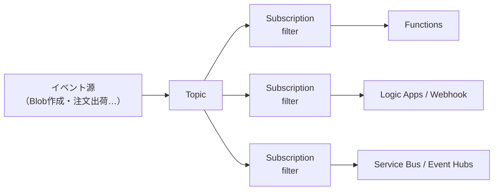
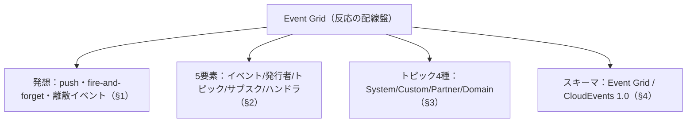

# Week 11 — Event Grid の基礎：トピックの種類とイベントスキーマ（Event Grid スキーマ / CloudEvents）

> **Phase C**（Event Grid）| 学習プラン Week 11 / 17
> 学習目標：Event Grid（反応的なイベントルーティング）を Service Bus / Event Hubs と対比して説明でき、5つの構成要素（イベント・発行者・トピック・サブスクリプション・ハンドラ）とトピックの4種類（System/Custom/Partner/Domain）を理解し、Event Grid スキーマと CloudEvents 1.0 の違い・使い分けを掴む

---

## 0. 今週の位置づけ

ここから **Part C：Event Grid**（全4週）。3兄弟の最後、「**状態変化に反応して他を動かす＝離散イベント**」担当（Week 1）。また発想が切り替わるので、まずそこから。

1. **3度目の発想転換**：メッセージ・ストリームとの違い（§1）
2. **5つの構成要素**：イベント / 発行者 / トピック / サブスクリプション / ハンドラ（§2）
3. **トピックの4種類**：System / Custom / Partner / Domain（§3）
4. **イベントスキーマ**：Event Grid スキーマ と CloudEvents 1.0（§4）

> Week 1 §4-3 で「発行しても購読者がいなければ誰も受け取らない（fire-and-forget）」を体験した。今週その全体像を深掘りする。MQTT / 名前空間トピック / pull 配信は **Week 13**、配信・リトライ・フィルタは **Week 12**。

---

## 1. 3度目の発想転換：Event Grid は「反応の配線盤」

| | Service Bus（メッセージ） | Event Hubs（ストリーム） | Event Grid（イベント） |
|---|---|---|---|
| 主目的 | 業務を確実に処理 | 大量を取り込み分析 | **状態変化に反応させる** |
| 運ぶもの | 業務データ（契約あり） | 時系列の大量データ | **「起きた」という離散通知** |
| 配信 | pull（取りに行く） | pull（読む） | **push（届ける）** |
| 発行者の関心 | 処理を期待 | — | **無関心（fire-and-forget）** |
| たとえ | 受付の整理券 | 録画ログ | **火災報知器→各所へ一斉通知** |

> **核心**：Event Grid は「**何かが起きたら、関心のある相手に push で知らせて反応させる配線盤**」。発行者は「起きた」と言うだけ（Week 1・2 のイベント vs メッセージ）。誰がどう反応するかはサブスクリプション側で決める。だから**発行者と反応側が完全に疎結合**になる。



---

## 2. 5つの構成要素

Event Grid（push 配信）は5つの部品でできている。

| 要素 | 役割 |
|---|---|
| **イベント（event）** | 「何が起きたか」を表す最小情報。source・time・一意な id ＋ 種類ごとの詳細 |
| **発行者（publisher）** | イベントを Event Grid に送るアプリ（Azure サービス／自分のアプリ／SaaS） |
| **トピック（topic）** | 発行されたイベントを受ける入口（関連イベントの集まり）。§3 で4種類 |
| **サブスクリプション（event subscription）** | 「どのイベントを・どこへ届けるか」。フィルタ＋ハンドラ指定（Week 12） |
| **ハンドラ（event handler）** | イベントの届け先。反応して処理する（Functions・Webhook・Service Bus…） |

> **初学者向け用語補足：ハンドラ（handler）とは**
> 届いたイベントを受けて**実際に処理する側**。Event Grid が push する宛先。種類は Azure サービス（Functions・Logic Apps・Service Bus・Event Hubs・Storage Queue…）または**自分の Webhook（HTTP エンドポイント）**。Webhook の場合、Event Grid は **`200 OK` が返るまでリトライ**する（Week 12）。

---

## 3. トピックの4種類

「どこからイベントが来るか」で4種類ある。

| 種類 | 何のためか | 例 |
|---|---|---|
| **System トピック** | **Azure サービスが出す**組み込みイベント | Blob 作成、Event Hubs Capture 完了、リソース変更 |
| **Custom トピック** | **自分のアプリ**が出すイベント（独自のエンドポイントを持つ） | 「注文が出荷された」等の業務イベント |
| **Partner トピック** | **SaaS / 外部システム**が出すイベント（Partner Events） | Auth0・SAP など外部からの通知 |
| **Domain（ドメイン）** | **大量の Custom トピックをまとめて管理**（マルチテナント向け） | 顧客ごとにトピックを持つSaaSで数千トピックを一括管理 |

> **初学者向け用語補足：System / Custom / Domain の使い分け**
> - **System**：Azure サービス（Storage・Event Hubs・Service Bus…）の「出来事」に反応したいとき。自分でトピックを作らず、そのサービスの System トピックを購読するだけ。Week 9 の「Capture 完了イベント」もこれ。
> - **Custom**：自分のアプリの業務イベントを発行したいとき（Week 1 §4-3 で作ったのがこれ）。
> - **Domain**：Custom トピックが**何千も**必要な規模（例：顧客ごとに専用トピック）で、認証・課金・管理を**1つのドメインでまとめる**ための仕組み。1つ1つ Custom トピックを作るより効率的。
> - **Partner**：Azure 外の SaaS からのイベントを Azure に取り込む。

---

## 4. イベントスキーマ：Event Grid スキーマ と CloudEvents 1.0

イベントの「形（どんなフィールドを持つか）」には2つの選択肢がある。

### 4-1. Event Grid スキーマ（独自形式）

Azure 独自の形式。System イベントの発行者が使ってきた従来形式。

```json
[{
  "id": "1",
  "eventType": "Order.Shipped",
  "subject": "orders/1234",
  "eventTime": "2026-07-02T10:00:00Z",
  "data": { "orderId": "1234" },
  "dataVersion": "1.0"
}]
```

- `id`（一意）・`eventType`（種類）・`subject`（対象。フィルタに使う）・`eventTime`・`data`（詳細）・`dataVersion`。
- **配列で送る**のが必須（1件でも `[...]`。Week 1 §4-3 の curl もそうだった）。

### 4-2. CloudEvents 1.0（業界標準・推奨）

**CNCF（Cloud Native Computing Foundation）の業界標準**。ベンダー非依存で、**発行と消費に共通の形**を与え相互運用性を高める。Event Grid は**こちらを推奨**。

```json
{
  "specversion": "1.0",
  "type": "Order.Shipped",
  "source": "/myapp/orders",
  "id": "1",
  "time": "2026-07-02T10:00:00Z",
  "subject": "orders/1234",
  "data": { "orderId": "1234" }
}
```

- `specversion`・`type`・`source`・`id`・`time`・`subject`・`data`。
- **拡張属性（extension attributes）**を足せる（Event Grid 独自形式にはない柔軟性）。

> **初学者向け用語補足：CloudEvents とは（なぜ標準が要るか）**
> **「イベントの共通フォーマットの業界標準」**（Microsoft も策定に参加、CNCF 管理、現在 v1.0）。各社バラバラの形式だと、ツールやルーティングをサービスごとに作り直す羽目になる。CloudEvents に揃えると、**同じツール・同じ処理で、どのプラットフォームのイベントも扱える**（相互運用性）。Week 9 の Schema Registry が「データの中身の形」を揃えたのに対し、CloudEvents は「**イベントの外側の封筒の形**」を揃える標準。

### 4-3. 使い分けと変換

Event Grid は**入力（トピックが受ける形）**と**出力（サブスクリプションが届ける形）**でスキーマを指定できる。

| 入力スキーマ | 出力スキーマ |
|---|---|
| CloudEvents | CloudEvents |
| Event Grid | CloudEvents |
| Event Grid | Event Grid |

> **CloudEvents 入力 → Event Grid 出力はできない**（CloudEvents の拡張属性を Event Grid 形式が表現できないため）。**新規は CloudEvents を推奨**。CLI では作成時に `--input-schema cloudeventschemav1_0`、サブスクリプションで `--event-delivery-schema cloudeventschemav1_0`。

```bash
# Custom トピックを CloudEvents 入力で作成
az eventgrid topic create -n demotopic -g $RG -l japaneast \
  --input-schema cloudeventschemav1_0
```

> **補足**：イベントの最大サイズは **1MB**、**64KB を超えると 64KB 単位で課金**。配信保証は **at-least-once**（Week 2 §3。重複しうるのでハンドラは冪等に）。

---

## 5. Week 11 全体の整理



| 用語 | 一言説明 |
|---|---|
| Event Grid | 状態変化に反応させる push 型のイベント配信 |
| 5つの要素 | イベント・発行者・トピック・サブスクリプション・ハンドラ |
| System/Custom/Partner/Domain | Azureサービス発／自前／SaaS発／大量トピックの一括管理 |
| Event Grid スキーマ | Azure 独自形式（配列で送る） |
| CloudEvents 1.0 | CNCF 業界標準・拡張可能・推奨 |
| ハンドラ | 届け先。Webhook は 200 が返るまでリトライ |

---

## ハンズオン チェックリスト

- [ ] Service Bus / Event Hubs / Event Grid の「メッセージ/ストリーム/イベント」「pull/pull/push」の違いを言えた
- [ ] Custom トピックを CloudEvents 入力で作成した
- [ ] System / Custom / Partner / Domain の使い分けを1例ずつ挙げた
- [ ] Event Grid スキーマと CloudEvents の JSON の違い（フィールド名）を見比べた
- [ ] 「CloudEvents 入力→Event Grid 出力はできない」理由（拡張属性）を説明できた

---

## 自己チェック

1. **Event Grid の発想が Service Bus / Event Hubs とどう違うか？**
   - キーワード：push・fire-and-forget・離散イベント・反応
2. **5つの構成要素を挙げ、サブスクリプションとハンドラの違いを言えるか？**
   - キーワード：どのイベントをどこへ（サブスク）／届け先で処理（ハンドラ）
3. **トピックの4種類と、Domain が要るのはどんな時か？**
   - キーワード：System/Custom/Partner/Domain・大量トピックの一括管理
4. **CloudEvents はなぜ推奨か？Event Grid スキーマとの決定的な違いは？**
   - キーワード：業界標準・相互運用・拡張属性
5. **Webhook ハンドラへの配信が成功と見なされる条件は？**
   - キーワード：200 OK・返るまでリトライ・at-least-once

---

## 次週の予告（Week 12）

Event Grid の**配信とフィルタリング**を深掘りする：

- **サブスクリプションのフィルタ**：件名前方一致・イベント型・**高度フィルタ**（data の中身で絞る）
- **ハンドラの種類**：Functions / Logic Apps / Webhook / Service Bus / Event Hubs / Storage Queue
- **配信・リトライ・DLQ**：`200 OK` までの再試行、指数バックオフ、配達不能の退避（Event Grid の DLQ）
- 「発行しても誰も受けない」状態から、実際にハンドラを繋いで反応させる
