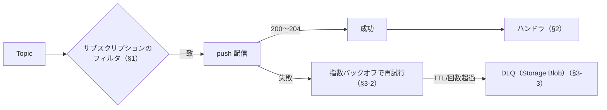

# Week 12 — Event Grid の配信とフィルタリング：フィルタ・ハンドラ種別・リトライ・DLQ

> **Phase C**（Event Grid）| 学習プラン Week 12 / 17
> 学習目標：サブスクリプションのフィルタ（イベント型・件名前方/後方一致・高度フィルタ）を使い分けられ、ハンドラの種類を把握し、push 配信のリトライ（指数バックオフ）・成功と見なす条件・DLQ（ストレージへの退避）の仕組みを説明できる

---

## 0. 今週の位置づけ

Week 11 で全体像を掴んだ。Week 12 は「**どのイベントを・どこへ・どう確実に届けるか**」を深掘りする。

1. **どのイベントを**：サブスクリプションのフィルタ（§1）
2. **どこへ**：ハンドラの種類（§2）
3. **どう確実に**：リトライ・成功条件・DLQ（§3）

> Week 11 §4 で作った「購読者がいないトピック」に、今週フィルタとハンドラを繋いで**実際に反応させる**。

---

## 1. フィルタ：どのイベントを受けるか

サブスクリプションは3種類のフィルタで絞れる（既定は全部受ける）。

### 1-1. イベント型フィルタ（includedEventTypes）

特定の `eventType` だけ受ける。

```json
"filter": { "includedEventTypes": ["Microsoft.Storage.BlobCreated", "Microsoft.Storage.BlobDeleted"] }
```

> 例：Blob の「作成・削除」だけ受け、他は無視。

### 1-2. 件名フィルタ（subjectBeginsWith / EndsWith）

`subject`（対象を表す文字列・Week 11 §4）の**前方一致・後方一致**で絞る。

```json
"filter": {
  "subjectBeginsWith": "/blobServices/default/containers/images/",
  "subjectEndsWith": ".jpg"
}
```

> **設計のコツ**：発行時に `subject` を**階層パス**（例 `/orders/2026/shipped`）にしておくと、購読側が `/orders` で広く、`/orders/2026` で狭く絞れる。Service Bus の SQL フィルタ（Week 2 §1-2）に相当する「絞り込みの軸」。

### 1-3. 高度フィルタ（advanced filters）：data の中身で絞る

イベントの **data フィールドの値**を、演算子で比較して絞る。**operator / key / values** の3点で書く。

```json
"advancedFilters": [
  { "operatorType": "StringIn",          "key": "data.storeName", "values": ["Tokyo", "Osaka"] },
  { "operatorType": "NumberGreaterThan", "key": "data.amount",    "value": 10000 }
]
```

| 種類 | 演算子の例 |
|---|---|
| 数値 | NumberGreaterThan / LessThan / In / InRange … |
| 文字列 | StringIn / StringContains / StringBeginsWith / EndsWith … |
| 真偽 | BoolEquals |
| null | IsNullOrUndefined / IsNotNull |

> **AND と OR**：**1つのフィルタ内の複数 values ＝ OR**（どれか一致）／**複数のフィルタ ＝ AND**（全部満たす）。制限：**1サブスクリプションあたり高度フィルタ25個・値25個・文字列512字まで**。CloudEvents では key に `type`/`source`/`data.xxx`、拡張属性も使える。

> **重要な概念の区別：3サービスのフィルタ**
> - **Event Grid**：サブスクリプションで **subject 前方/後方一致 ＋ data の高度フィルタ**（サーバー側で評価して振り分け）。
> - **Service Bus**：Topic の Subscription で **SQL フィルタ**（メッセージプロパティ・Week 2 §1-2）。
> - **Event Hubs**：フィルタは無く、**消費側で振り分け**（全部読んでから判断）。
> 「サーバー側で絞って push（Event Grid / Service Bus）」か「全部受けて自分で振り分け（Event Hubs）」かの違い。

---

## 2. ハンドラ：どこへ届けるか

イベントの届け先（反応する側）。push 配信では次が使える。

| ハンドラ | 使いどころ |
|---|---|
| **Azure Functions** | サーバーレスで反応（最も一般的） |
| **Webhook（自前 HTTP）** | 任意のエンドポイント。`200` を返すまでリトライ |
| **Logic Apps** | ノーコードのワークフロー |
| **Service Bus（Queue/Topic）** | イベントを**確実な業務処理へ橋渡し**（§後述の連携） |
| **Event Hubs** | イベントを**ストリームに流し込む** |
| **Storage Queue** | 単純なキューへ |
| **Relay Hybrid Connections** | オンプレへ |

> **3兄弟を繋ぐハンドラ**：Event Grid のハンドラに **Service Bus / Event Hubs を指定**できる。だから「**状態変化を Event Grid で検知 → Service Bus に投げて確実に処理**」のような組み合わせが作れる（Week 1 の役割分担・Week 16 で実装）。

```bash
# 例：Custom トピックに、subject と型で絞ったサブスクリプションを Functions へ
az eventgrid event-subscription create \
  --name ship-sub \
  --source-resource-id <topicのリソースID> \
  --endpoint <FunctionsのエンドポイントURL> \
  --included-event-types Order.Shipped \
  --subject-begins-with /orders/
```

---

## 3. 配信・リトライ・DLQ

### 3-1. 成功と見なす条件

Event Grid は push した先の **HTTP 応答コード**で成否を判断する。

- **成功**：`200 / 201 / 202 / 203 / 204`。これ以外は**全部失敗**扱い。
- Webhook ハンドラは「`200 OK` などが返るまで」＝**受け取ったことを応答で示す**必要がある。

### 3-2. リトライ（指数バックオフ）

Event Grid は **at-least-once**（Week 2 §3）。応答を **30秒**待ち、失敗なら**指数バックオフ**で再試行：

```text
10秒 → 30秒 → 1分 → 5分 → 10分 → 30分 → 1時間 → 3時間 → 6時間 → 以後12時間ごと（最大24時間）
```

- **リトライしないエラー**：`400`（不正）・`413`（大きすぎ）・`403`（禁止）、Webhook は `401` も。これらは**即 DLQ か破棄**（直しても無駄なため）。
- **リトライポリシー**（サブスクリプション作成時に設定）：
  - **最大試行回数**：1〜30、**既定30**
  - **イベント TTL**：1〜1440分、**既定1440分（24時間）**
  - **先に達した方**で打ち切り（例：TTL 30分 と 10回なら、30分が先に来れば10回未満でも終了）。
- **順序保証は無い**（Week 2 §4-1。順序が要るなら設計で対処）。

### 3-3. DLQ（デッドレター）：ストレージへ退避

配信しきれなかったイベントは、**Storage アカウントの Blob コンテナ**に退避できる（＝Event Grid の DLQ）。

```text
DLQ 送りになる条件（どちらか）：
  ・TTL 期間内に配信できなかった
  ・最大試行回数を超えた
  （400 / 413 は「配信不能確定」として即 DLQ 予約）
```

- **既定は無効**。作成時に**退避先の Blob コンテナ**を指定して有効化する。
- 退避イベントには `deadLetterReason`（例 `MaxDeliveryAttemptsExceeded`）・`lastDeliveryOutcome`（例 `NotFound`）が付く。
- 最後の試行から DLQ 書き込みまで **約5分の遅延**。DLQ 先が4時間使えないとイベントは破棄。

> **重要な概念の区別：Event Grid の DLQ と Service Bus の DLQ**
> - **Service Bus**（Week 4 §1）：DLQ は**キューに自動付帯する副キュー**。同じ Service Bus の中に退避。
> - **Event Grid**：DLQ は**別の Storage Blob コンテナ**（自分で指定・既定オフ）。イベント基盤の外（ストレージ）に退避。
> どちらも「配達不能を捨てずに退避して後で確認・再処理」という発想は同じ。**DLQ に入ったら Event Grid で"DLQ の Blob 作成イベント"を購読して通知**、という自動化もできる（Week 16 の組み合わせ）。

> **初学者向け用語補足：probation（保護観察）**
> 配信先が失敗し続けると、Event Grid はその宛先を一定時間 **probation（配信を試みない状態）**に置く（例：NotFound は5分）。**不健全な宛先を守り、Event Grid 側が過負荷になるのを防ぐ**ため。この間は配信されず、TTL/回数次第で DLQ・破棄されることもある。

---

## 4. Week 12 全体の整理



| 用語 | 一言説明 |
|---|---|
| includedEventTypes | イベント型で絞る |
| subjectBeginsWith / EndsWith | 件名の前方/後方一致で絞る |
| advanced filters | data の値を演算子で絞る（25個まで・AND/OR） |
| ハンドラ | 届け先（Functions/Webhook/Service Bus/Event Hubs…） |
| 成功コード | 200〜204。他は失敗→再試行 |
| リトライ | 指数バックオフ・最大30回/TTL 24h（既定） |
| DLQ | Storage Blob へ退避（既定オフ・自分で指定） |

---

## ハンズオン チェックリスト

- [ ] Custom トピックに、イベント型＋subject 前方一致でフィルタしたサブスクリプションを作った
- [ ] data の値で絞る高度フィルタ（例 `NumberGreaterThan`）を1つ設定した
- [ ] ハンドラに Azure Functions（または Webhook）を繋ぎ、実際に反応させた
- [ ] わざと失敗する Webhook（500 を返す）で、リトライが起きることを確認した
- [ ] DLQ 用の Blob コンテナを指定し、配信不能イベントが退避されることを確認した

---

## 自己チェック

1. **フィルタの3種類と、それぞれ何で絞るか？**
   - キーワード：イベント型・subject 前方/後方・data の高度フィルタ
2. **高度フィルタの AND と OR の書き分けは？**
   - キーワード：1フィルタ内の値=OR／複数フィルタ=AND
3. **Event Grid が配信成功と見なす HTTP コードは？失敗時の挙動は？**
   - キーワード：200〜204・指数バックオフ・再試行しない400/403/413
4. **DLQ に送られる2条件と、退避先はどこか？**
   - キーワード：TTL 超過・最大回数超過・Storage Blob
5. **Event Grid の DLQ と Service Bus の DLQ の違いは？**
   - キーワード：別 Storage vs 副キュー・既定オフ vs 自動付帯

---

## 次週の予告（Week 13）

Event Grid の新しいリソースモデル「**名前空間トピック**」と MQTT：

- **Namespace topics（名前空間トピック）**：従来の push 型に加わった新モデル
- **pull 配信**：Event Grid でも「受信側が取りに行く」方式（Event Hubs / Service Bus 的）
- **MQTT**：IoT デバイス向けの軽量プロトコル（大量デバイスの pub/sub）
- 「push だけ」だった Event Grid の像が広がる回
