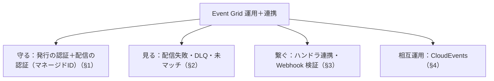

# Week 14 — Event Grid を運用する：セキュリティ・監視・ハンドラ連携・CloudEvents 相互運用（Part C 最終週）

> **Phase C**（Event Grid）| 学習プラン Week 14 / 17
> 学習目標：発行時の認証（キー/SAS/Entra ID）と配信時の認証（マネージドID＋宛先RBAC・Webhook 検証）を説明でき、監視すべきメトリクス（配信失敗・DLQ・未マッチ）を把握し、ハンドラ（Functions/Logic Apps/Webhook）を繋いで反応させ、CloudEvents による相互運用の位置づけを掴む

---

## 0. 今週の位置づけ

Part C（Event Grid）の締め。Service Bus（Week 6）・Event Hubs（Week 10）と同じく**運用3本柱＋連携**で締める。Event Grid 固有は「**認証が2段階（発行と配信）**」「**Webhook 検証**」「**CloudEvents 相互運用**」。

1. **守る**：発行の認証 と 配信の認証（§1）
2. **見る**：配信失敗・DLQ・未マッチのメトリクス（§2）
3. **繋ぐ**：ハンドラ連携と Webhook 検証（§3）
4. **相互運用**：CloudEvents（§4）

---

## 1. セキュリティ：認証は「発行」と「配信」の2段階

Event Grid は**イベントの流れの両端**で認証がある。

```text
[発行者] ──①発行の認証──▶ [Event Grid Topic] ──②配信の認証──▶ [ハンドラ]
```

### 1-1. 発行の認証（発行者 → トピック）

トピックにイベントを送るときの認証。3方式。

| 方式 | 内容 |
|---|---|
| **アクセスキー** | トピックのキーをヘッダに付ける（Week 1 §4-3 の `aeg-sas-key`） |
| **SAS トークン** | キーから生成した期限つきトークン |
| **Entra ID（推奨）** | RBAC ロール **EventGrid Data Sender**（発行権限）など |

> 管理系の RBAC：**EventGrid Contributor**（トピック等の管理）、**EventGrid EventSubscription Contributor**（サブスク管理）。データ送信は **EventGrid Data Sender**。Service Bus / Event Hubs と同じ「最小権限」の考え方（Week 6 §1）。

### 1-2. 配信の認証（Event Grid → ハンドラ）

Event Grid が宛先へ届けるときの認証。**宛先の種類で方式が違う**。

| 方式 | 対応ハンドラ |
|---|---|
| **アクセスキー**（Event Grid のサービスプリンシパルがキー取得） | Event Hubs / Service Bus / Storage Queue / Functions / DLQ Blob |
| **マネージドID ＋ 宛先の RBAC（推奨）** | Event Hubs / Service Bus / Storage Queue / DLQ Blob |
| **Entra 保護 Webhook / クエリの秘密** | Webhook |

> **推奨：マネージドID**。トピックに**システム割り当てマネージドID**を有効化し、その ID を**宛先側のロール**（例：Event Hubs へ配信するなら **Event Hubs Data Sender**）に入れる。Event Grid が「そのトピックの身元」で宛先に認証する。鍵を持ち回らない（Week 6 §1 の passwordless と同発想）。

> **初学者向け用語補足：サービスプリンシパル（service principal）とは**
> **人ではなく、アプリ/サービスのための Entra ID 上の身元（アカウント）**。Entra ID の身元は「**ユーザー（人間）**」と「**サービスプリンシパル（アプリ/サービス）**」に分かれ、アプリが人手を介さず自分の身元で Azure リソースにアクセスするために使う。**RBAC ロールの割り当て先**になれる（割り当て先＝ユーザー / グループ / サービスプリンシパル・Week 6）。
> - **認証方法**：秘密（シークレット/証明書）を自分で管理する、または**マネージドID（秘密なし）**。
> - たとえ：ユーザー＝社員の個人バッジ。サービスプリンシパル＝**機械/アプリ用の"サービスアカウントのバッジ"**（人がいなくてもアプリが自分でドア＝リソースを開ける）。
> - **この表の意味**：「Event Grid のサービスプリンシパル」＝ Event Grid というサービス自身がテナントに持つ身元。リソースプロバイダー登録でこの身元に権限が与えられ、**Event Grid が宛先のアクセスキーを取得して配信**できる。

> **初学者向け用語補足：マネージドID（managed identity）とは**
> Azure リソース自身に付与される「**Azure が管理する身元**」。パスワードや鍵を持たず、Azure が自動で発行・ローテーションする。ここでは**トピックに身元を持たせ、その身元に宛先へのロールを与える**ことで、鍵なしで安全に配信できる。
> **サービスプリンシパルとの関係**：マネージドID は**サービスプリンシパルの特別な一種**（Azure が全部管理し、秘密を持ち回らない版）。「マネージドID 推奨」＝「サービスプリンシパルの中でも鍵管理が要らない安全な種類を使え」という意味。

> **初学者向け用語補足：Webhook 認証の2方式（呼び出し元が正当な Event Grid かを確かめる）**
> Webhook は Azure の身元を持たない**ただの公開 HTTPS URL**なので、誰でも POST できてしまう。そこで「**この配信は本当に正当な Event Grid からか**」を **Webhook 自身が確認**する。方法が2つ。
> - **① Entra 保護 Webhook（ベアラートークン）**：Webhook を Entra ID で保護し、Event Grid に**毎回の配信で `Authorization: Bearer <トークン>` を付けさせる**。Webhook は「Entra が正しい相手に発行した本物のトークンか」を検証してから受理。署名つきで偽造不可＝堅牢（Week 9 の Kafka OAUTHBEARER と同発想）。
> - **② クエリの秘密（合言葉）**：URL に秘密を仕込む（`https://myapp.com/api/events?code=SECRET123`）。Event Grid は毎回このクエリを付けて送り、Webhook は `code` が期待値と一致するか照合。実装は簡単で、身近な例は **Azure Functions の関数キー `?code=…`**。秘密は暗号化保管・非ログだが、URL に載るぶんトークン方式より素朴。
>
> | 方式 | 何を確認 | 堅牢さ | 例 |
> |---|---|---|---|
> | Entra 保護 Webhook | Entra 発行のトークン | 高（偽造不可） | `Authorization: Bearer …` |
> | クエリの秘密 | URL の合言葉の一致 | 中（手軽） | `?code=SECRET`（Functions キー） |
>
> **§3-2 の検証ハンドシェイクとは向きが逆**：§3-2 は「Event Grid が"このエンドポイントは受け取る意思があるか"を確認（踏み台濫用から Event Grid を守る）」、ここ §1-2 は「Webhook が"呼び出し元が正当な Event Grid か"を確認（不正 POST から Webhook を守る）」。両方 Webhook に適用。たとえ：①＝公式 ID バッジ（トークン）を見せる／②＝配達伝票の合言葉。

---

## 2. 監視：配信の成否を見る

Event Grid の要は「**発行できたか・マッチしたか・配信できたか・落ちていないか**」。

| メトリクス | 見る意味 |
|---|---|
| **PublishSuccessCount / PublishFailCount** | トピックへの発行成否 |
| **MatchedEventCount** | フィルタ（Week 12）に**マッチした**数 |
| **DeliverySuccessCount** | ハンドラへ**配信成功**した数 |
| **DeliveryAttemptFailCount** | **配信失敗**（要注目・原因は Error 次元で分かる） |
| **DeadLetteredCount** | **DLQ 送り**になった数（Week 12 §3-3・要注目） |
| **DroppedEventCount** | **破棄**された数（DLQ 未設定で捨てられた等・要注目） |
| **UnmatchedEventCount** | **どのサブスクにもマッチせず**流れなかった数 |

> **ポイント**：とくに **DeliveryAttemptFailCount / DeadLetteredCount / DroppedEventCount** は業務影響に直結（配信できていない）。加えて **UnmatchedEventCount** は「**サブスクの作り忘れ・フィルタの絞りすぎ**」の兆候——せっかく発行したのに誰も受けていないサイン。診断ログで**配信失敗・発行失敗**の詳細（`outcome=NotFound` 等）を Log Analytics に出せる。

---

## 3. ハンドラ連携と Webhook 検証

### 3-1. Functions / Logic Apps を繋ぐ

Azure サービスのハンドラは、サブスクリプション作成時に宛先リソースを指定するだけ（Week 12 §2）。Functions は **Event Grid トリガー**でイベントを受ける。

### 3-2. Webhook 検証（validation handshake）

**自前の Webhook** を宛先にするときは、**検証ハンドシェイク**が必須。これは「**Event Grid が任意の URL への攻撃の踏み台に使われるのを防ぐ**」ため——「そのエンドポイントが本当に受け取る意思があるか」を確認する。

```text
【Event Grid スキーマの場合】
  ① サブスク作成時、Event Grid が SubscriptionValidationEvent（validationCode 入り）を送る
  ② エンドポイントは validationCode を **オウム返し**で応答する
  ③ 一致すれば「本人確認OK」→ 以後イベントが届く

【CloudEvents の場合】
  HTTP OPTIONS で WebHook-Request-Origin / WebHook-Allowed-Origin を使う（CloudEvents の abuse protection）
```

> **重要**：Webhook は **HTTPS 必須**。Functions・Logic Apps を Event Grid トリガーで使う場合、この検証は SDK/バインディングが自動処理する。自前 HTTP エンドポイントのときだけ、この応答を自分で実装する必要がある。

---

## 4. CloudEvents 相互運用

Week 11 §4 で学んだ **CloudEvents 1.0**（CNCF 業界標準）は、運用面でも効く。

- **出力スキーマを CloudEvents にする**と、**他プラットフォーム・他ツールと共通の形**でイベントを扱える（相互運用）。
- Webhook の**濫用防止も CloudEvents 標準の方式（HTTP OPTIONS）**で行われる（§3-2）。
- **新規は CloudEvents 推奨**（Week 11 §4-3）。Event Grid スキーマは既存 System イベント向けの従来形式。

> **位置づけ**：CloudEvents は「イベントの**外側の封筒**の標準」。中身の形（スキーマ）を揃える Event Hubs の Schema Registry（Week 9）と役割が対。両方を使えば、**発行から消費・分析まで、形式の壁なく**イベントを流せる。

---

## 5. Week 14 / Part C 全体の整理



| 用語 | 一言説明 |
|---|---|
| 発行の認証 | キー / SAS / Entra ID（EventGrid Data Sender） |
| 配信の認証 | マネージドID＋宛先RBAC（推奨）/ キー / Webhook 秘密 |
| マネージドID | 鍵を持たない Azure 管理の身元 |
| DeliveryAttemptFail / DeadLettered / Dropped / Unmatched | 配信失敗 / DLQ / 破棄 / 未マッチ（要監視） |
| Webhook 検証 | validationCode のオウム返し（濫用防止）・HTTPS 必須 |
| CloudEvents | 業界標準の封筒・相互運用 |

---

## ハンズオン チェックリスト

- [ ] 発行に Entra ID（EventGrid Data Sender）を使い、キーを埋め込まない方式を試した
- [ ] トピックにマネージドID を有効化し、宛先（Event Hubs/Service Bus）のロールに追加して配信した
- [ ] 自前 Webhook を宛先にし、validationCode のオウム返しで検証を通した
- [ ] Metrics で MatchedEvent / DeliverySuccess / DeadLettered / Unmatched を確認した
- [ ] 出力スキーマを CloudEvents にして配信した

---

## 自己チェック

1. **Event Grid の認証が2段階なのはなぜ？それぞれ何を認証する？**
   - キーワード：発行（発行者→トピック）／配信（Event Grid→ハンドラ）
2. **配信でマネージドID が推奨なのはなぜ？宛先側で何が要る？**
   - キーワード：鍵を持ち回らない／宛先の RBAC ロール
3. **Webhook 検証は何を防ぐ？どう応答する？**
   - キーワード：踏み台濫用防止・validationCode オウム返し・HTTPS
4. **最優先で監視するメトリクスは？UnmatchedEventCount は何の兆候？**
   - キーワード：配信失敗/DLQ/破棄・サブスク作り忘れ/絞りすぎ
5. **CloudEvents が運用で効くのはどんな点？**
   - キーワード：相互運用・封筒の標準・濫用防止も標準方式

---

## 次週の予告（Week 15）— Part D 開始：統合と使い分け

3兄弟すべてを一通り習得した。ここから **Part D** で「**横断比較の総まとめ**」に入る：

- **決定木**：要件から「どれを使うか」を最終形に（Week 1・2 の判断軸を統合）
- **比較マトリクス**：順序 / スループット / レイテンシ / 配信保証 / コスト / SLA / 制約
- Service Bus（メッセージ）・Event Hubs（ストリーム）・Event Grid（イベント）の全体像を1枚に
- Week 16 で組み合わせアーキテクチャ、Week 17 で3サービス連携の最終プロジェクトへ
