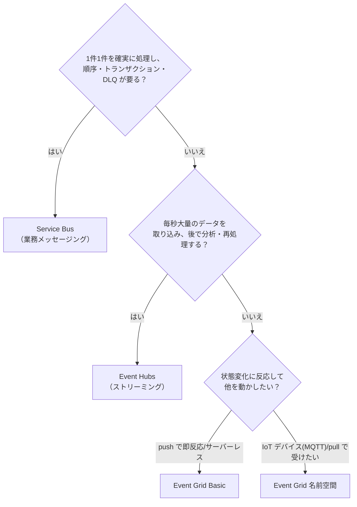
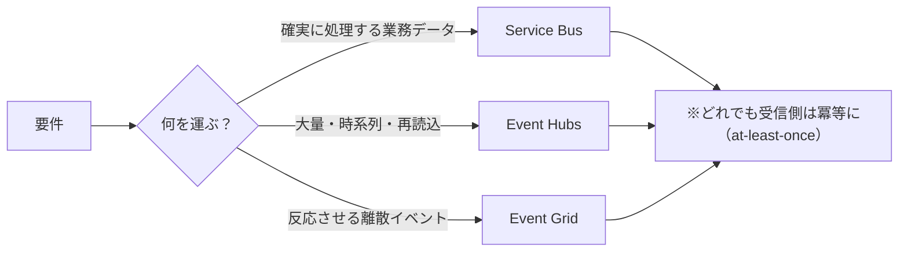

# Week 15 — 横断比較の総まとめ：決定木と比較マトリクス（Part D 開始）

> **Phase D**（統合）| 学習プラン Week 15 / 17
> 学習目標：3兄弟（Service Bus / Event Hubs / Event Grid）を1枚の決定木と比較マトリクスに統合し、要件（順序・スループット・配信保証・コスト・制約）から「どれを使うか」を根拠つきで選べる。Week 1-14 の判断軸を最終形にする

---

## 0. 今週の位置づけ

Part A/B/C で3サービスを個別に深掘りした。**Part D はそれらを束ねる**。Week 15 は「**総まとめの比較**」、Week 16 は「**組み合わせ**」、Week 17 は「**最終プロジェクト（3連携）**」。今週は**判断の地図を完成**させる。

> Week 1・2 で作った初版の判断軸を、各サービスを学んだ後の知識で**確定版**にする回。以降、設計時にここへ戻ってくる。

---

## 1. 3行サマリ（まず本質）

| サービス | 一言 | 運ぶもの | たとえ |
|---|---|---|---|
| **Service Bus** | 業務を確実に処理する | **メッセージ**（契約あり） | 受付の整理券 |
| **Event Hubs** | 大量を取り込み分析する | **ストリーム**（時系列の大量） | 録画ログ |
| **Event Grid** | 状態変化に反応させる | **イベント**（離散通知） | 火災報知器 |

> 迷ったらここに戻る：**確実な処理＝Service Bus／大量分析＝Event Hubs／反応＝Event Grid**（Week 1）。

---

## 2. 決定木（確定版）

要件から順に絞る。

> **補助の問い**：
> - 「**取ったら消える**べきか（作業キュー）」→ Service Bus／「**読んでも残る**べきか（リプレイ）」→ Event Hubs（Week 7 §1）
> - 「発行者は**反応に無関心**でよいか（fire-and-forget）」→ Event Grid（Week 11 §1）

---

## 3. 比較マトリクス（1枚）

| 観点 | Service Bus | Event Hubs | Event Grid |
|---|---|---|---|
| 主目的 | 業務トランザクション | 大量ストリーム取り込み | 反応的イベント配信 |
| データモデル | メッセージ | イベントストリーム | 離散イベント |
| 配信方式 | pull | pull | push（名前空間は pull も） |
| プロトコル | AMQP, HTTP | AMQP, Kafka, HTTP | HTTP（名前空間は ＋MQTT） |
| 順序保証 | FIFO（セッション） | パーティション単位 | なし |
| 重複検出 | ✓ | ✗ | ✗ |
| トランザクション | ✓ | ✗ | ✗ |
| DLQ | ✓（副キュー） | ✗ | ✓（Storage Blob・任意） |
| リプレイ（再読込） | ✗ | ✓（保持期間内） | ✗ |
| フィルタ | SQL（Subscription） | ✗（消費側で） | subject/高度フィルタ |
| スループット | 確実な非同期 | 毎秒数百万 | サーバーレス自動 |
| スケール単位 | Messaging Unit（Premium） | TU / PU / CU | 自動（名前空間は TU） |
| データ保持 | 取得で消える | 保持期間（最大7日/90日） | 配信したら残らない |
| 配信保証 | at-least-once（→exactly-once化） | at-least-once | at-least-once |
| 主な連携 | 業務システム・オンプレ | 分析（Stream Analytics/Capture） | Azure サービス横断・SaaS |

> 出典は各週で裏取り済み（Week 2 の比較表・Week 4/5/6/9/10/12/13/14）。

---

## 4. 軸ごとの勘所

### 4-1. 順序（ordering）

「**全体で厳密な順序**」はどれも標準では持たない。順序が要るなら**単位を絞る**：

- Service Bus：**セッション**（同一 `session_id` 内で FIFO・Week 4 §2）
- Event Hubs：**partition key**（同一キー→同一パーティション→到着順・Week 2 §1-3）
- Event Grid：**順序保証なし**。必要なら受信側で並べ替え等の設計

> 共通原則：**順序と並列はトレードオフ**。「順序を守りたい単位（1注文・1デバイス）」をキー/セッションに寄せ、その外は並列で捌く。

### 4-2. スループットと保持

- Event Hubs が桁違い（毎秒数百万・Week 7）。**大量取り込みは一択**。
- Service Bus は「確実な非同期配信」。桁より**確実性・順序・トランザクション**が価値。
- Event Grid は**サーバーレス自動スケール**（Basic）。発行のバーストを気にせず投げられる。
- **リプレイが要るか**が Event Hubs 選択の決め手（読んでも消えない・Week 7 §1）。

### 4-3. 配信保証と冪等性

**3サービスとも at-least-once が基本**（Week 2 §3）。だから**どれを使っても受信側の冪等性は必須**（重複は前提・Week 2 §4-2）。Service Bus だけ、重複検出＋セッションで exactly-once 相当に寄せられる（Week 4）。

### 4-4. コスト構造（何で課金されるか）

| サービス | 主な課金軸 |
|---|---|
| Service Bus | 操作数＋（Premium は）Messaging Unit |
| Event Hubs | スループット/プロセッシングユニット＋Capture |
| Event Grid | **操作数（イベント数）**。64KB 単位でカウント |

> 正確な料金は変動するので**公式の料金ページで確認**（学習上は「**何に対して払うか**」の型を掴む）。「大量の小イベントを Event Grid に大量発行」「巨大ペイロードをそのまま流す」はコスト増の典型——クレームチェック（Week 5 §3）等で軽くする。

### 4-5. SLA と可用性

- どのサービスも**標準で高可用性**（可用性ゾーン対応・99.9% 級）。**Premium/専有・ゾーン冗長・Geo でさらに向上**（Service Bus Geo-Replication・Week 6／Event Hubs Geo-DR・Week 10）。
- 正確な数値は**公式 SLA を確認**。設計では「**RPO/RTO 要件 → どの冗長機能を使うか**」で選ぶ（Week 6 §3-3）。

---

## 5. よくある誤選択と是正

| ありがちな選択 | 問題 | 是正 |
|---|---|---|
| 大量テレメトリを Service Bus へ | スループット・コストで無理 | **Event Hubs**（ストリーム） |
| 「1件も失えない注文」を Event Grid で | 順序・トランザクション・確実性が無い | **Service Bus** |
| 反応（Blob作成→処理）を自前ポーリング | 無駄・遅延 | **Event Grid**（System トピック） |
| 「Kafka 互換だから全部 Event Hubs」 | 競合コンシューマー/DLQ が無い | 業務は **Service Bus**、反応は **Event Grid**（Week 9 §2） |
| 巨大データをメッセージ本文で | サイズ上限・コスト | **クレームチェック**（実体は Blob・Week 5 §3） |

---

## 6. Week 15 全体の整理

| 選ぶ軸 | Service Bus | Event Hubs | Event Grid |
|---|---|---|---|
| キーワード | 確実・順序・トランザクション | 大量・ストリーム・リプレイ | 反応・push・疎結合 |
| 一択になる決め手 | DLQ/重複検出/FIFO/トランザクション | 毎秒数百万・巻き戻し | 状態変化への反応・サーバーレス |

---

## ハンズオン チェックリスト

- [ ] 決定木を見ずに「メッセージ/ストリーム/イベント」を1文ずつ説明できた
- [ ] 比較マトリクスの「順序・重複検出・トランザクション・DLQ・リプレイ」の ✓/✗ を各サービスで言えた
- [ ] 「どれでも受信側は冪等に」（at-least-once 前提）を理由つきで説明できた
- [ ] §5 の誤選択を2つ挙げ、正しい選択と理由を言えた
- [ ] 自分の想定ユースケースを1つ、決定木で分類してみた

---

## 自己チェック

1. **決定木の最初の分岐は何を問うか？なぜそこから？**
   - キーワード：確実に処理（順序/トランザクション/DLQ）→ Service Bus
2. **Event Hubs を選ぶ「決め手」を2つ？**
   - キーワード：毎秒数百万・リプレイ（読んでも消えない）
3. **3サービス共通で受信側に必要な設計は？なぜ？**
   - キーワード：冪等性・at-least-once・重複は前提
4. **順序が要るとき、各サービスで何に寄せるか？**
   - キーワード：session_id / partition key / （Event Grid は設計）
5. **コストが膨らむ典型パターンと是正は？**
   - キーワード：巨大ペイロード・大量小イベント・クレームチェック

---

## 次週の予告（Week 16）

3サービスを**組み合わせる**アーキテクチャに進む：

- **Event Grid → Function → Service Bus**：状態変化を検知して確実な処理へ橋渡し
- **telemetry → Event Hubs → Stream Analytics**：大量取り込みと分析
- **Service Bus DLQ → Event Grid 通知**：デッドレターを検知して運用通知
- 「競合ではなく共存」（Week 1）を、実際の配線図で理解する
