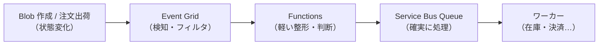
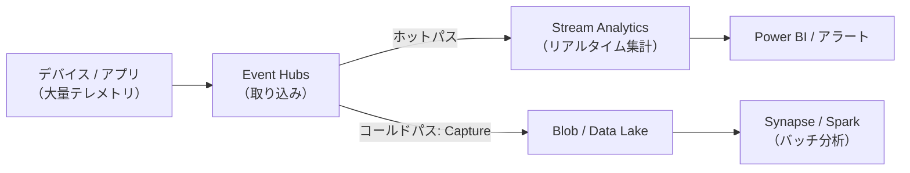
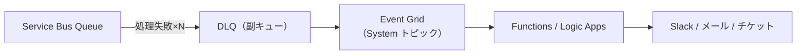
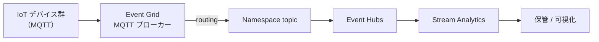
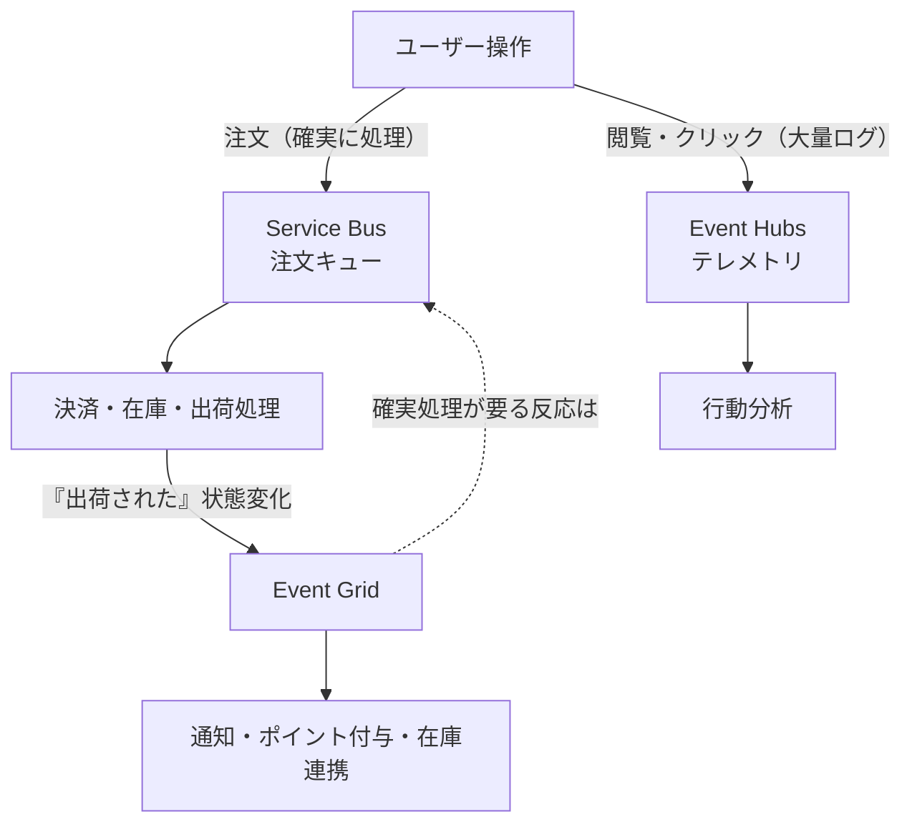
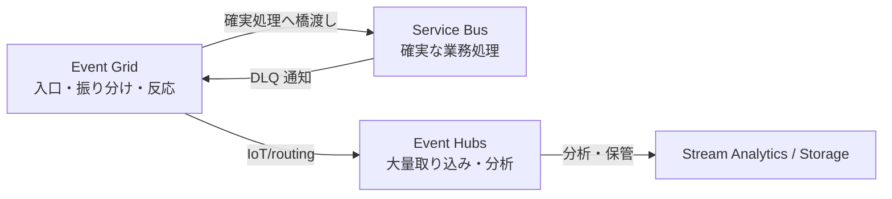

# Week 16 — 組み合わせアーキテクチャ：3サービスを「共存」させる配線図

> **Phase D**（統合）| 学習プラン Week 16 / 17
> 学習目標：3兄弟は競合ではなく共存すること（Week 1）を、具体的な配線図で理解する。代表的な組み合わせパターン（反応→確実処理／取り込み→分析／DLQ→通知／IoT E2E）を説明でき、次週の最終プロジェクトの設計につなげる

---

## 0. 今週の位置づけ

Week 15 で「どれを使うか（単体の選択）」を固めた。Week 16 は「**どう組み合わせるか**」。実務では**3つを役割分担して同時に使う**のが普通（Week 1）。代表パターンを配線図で押さえ、Week 17 の最終プロジェクトへつなぐ。

---

## 1. なぜ組み合わせるか：役割分担の原則

各サービスは**得意が違う**（Week 15）。だから1つで全部やろうとせず、**適材適所で連結**する。

```text
状態変化を検知・配る    → Event Grid（反応の配線盤）
確実に1件ずつ処理する    → Service Bus（業務メッセージング）
大量を取り込み分析する    → Event Hubs（ストリーム）
```

> **連結のキモ**：Event Grid のハンドラに Service Bus / Event Hubs / Functions を指定できる（Week 12 §2）。だから **Event Grid が「入口・振り分け」、Service Bus/Event Hubs が「本処理」** という組み合わせが自然に作れる。

---

## 2. パターン1：反応を確実な処理へ橋渡し（Event Grid → Functions → Service Bus）

「状態変化に**即反応**したいが、後段は**確実に処理**したい」。Event Grid の push（速い・疎結合）と Service Bus の確実性（順序・DLQ・トランザクション）を組み合わせる。



> **なぜ直結しないか**：Event Grid は fire-and-forget で順序・トランザクションが無い（Week 11）。**「確実に1件ずつ・順序を守って処理」は Service Bus の仕事**。Event Grid で受けて Service Bus に渡すことで、**即応性（Event Grid）と確実性（Service Bus）を両取り**する。Event Grid のハンドラに直接 Service Bus を指定してもよい（Functions を挟むのは整形・分岐が要るとき）。

---

## 3. パターン2：大量取り込みと分析（telemetry → Event Hubs → Stream Analytics / Capture）

IoT・アプリのテレメトリを**大量に取り込み、リアルタイム分析と長期保管の両方**へ。



> **役割**：Event Hubs が「大量の土管」、Stream Analytics が「流れる水に SQL」（Week 10 §4）、Capture が「自動で長期保管」（Week 9 §1）。**ホットパス（即時）＋コールドパス（保管→バッチ）**を1つのストリームから両取り。Service Bus/Event Grid は登場しない——**大量分析は Event Hubs の独壇場**。

---

## 4. パターン3：DLQ を検知して運用通知（Service Bus DLQ → Event Grid → 通知）

Service Bus の**デッドレター**（処理不能・Week 4 §1）を放置せず、**発生したら即通知**する運用自動化。



> **なぜ Event Grid**：Service Bus 名前空間は「**DLQ にメッセージが入った**」等のイベントを Event Grid に出せる（System トピック・Week 11 §3）。それを購読して通知につなげば、**DLQ を人が定期的に覗く運用が不要**になる。「Event Grid で状態変化に反応」（Week 1）の実例。Event Grid の DLQ（Storage）を購読して"配達不能を通知"する構成（Week 12 §3-3）も同じ発想。

---

## 5. パターン4：IoT E2E（MQTT → Event Grid → Event Hubs → Stream Analytics）

デバイスから分析まで、Part B・C を貫く（Week 13 §3-3）。



> **役割分担**：Event Grid（MQTT）が**大量デバイスの接続を肩代わり**（Week 13 §3）、Event Hubs が**大量ストリームの取り込み**、Stream Analytics が**分析**。「入口の接続管理」と「取り込み」を別サービスが担う。

---

## 6. 統合例：EC サイト（3つを同時に・Week 1 の配線図版）

Week 1 で挙げた「EC サイトで3つを役割分担」を、1枚の配線図に。



> **1つのシステムに3つが共存**：注文＝Service Bus（1件も失えない・順序）／テレメトリ＝Event Hubs（大量・分析）／出荷イベントへの反応＝Event Grid（疎結合に配る）。**競合ではなく、それぞれの得意で分担**（Week 1・15）。反応の中でも「確実処理が要るもの」は Event Grid → Service Bus に橋渡し（§2）。

---

## 7. Week 16 全体の整理



| パターン | 組み合わせ | 狙い |
|---|---|---|
| 反応→確実処理 | Event Grid → (Functions) → Service Bus | 即応性＋確実性 |
| 取り込み→分析 | Event Hubs → Stream Analytics / Capture | ホット＋コールド |
| DLQ→通知 | Service Bus DLQ → Event Grid → 通知 | 運用自動化 |
| IoT E2E | MQTT → Event Grid → Event Hubs → 分析 | 接続管理＋取り込み |

---

## ハンズオン チェックリスト

- [ ] 「Event Grid で受けて Service Bus に渡す」構成の狙い（即応性＋確実性）を説明できた
- [ ] ホットパス（Stream Analytics）とコールドパス（Capture）を1つの Event Hub から出す図を描けた
- [ ] Service Bus DLQ → Event Grid → 通知 の自動化フローを説明できた
- [ ] IoT E2E で各サービスの役割（接続管理／取り込み／分析）を言えた
- [ ] EC サイト例で3サービスの役割分担を配線図にできた

---

## 自己チェック

1. **Event Grid → Service Bus と橋渡しする理由は？直結ではダメな理由は？**
   - キーワード：即応性（EG）＋確実性・順序・DLQ（SB）
2. **1つの Event Hub からホットとコールドを両取りする仕組みは？**
   - キーワード：Stream Analytics（即時）＋Capture（保管）
3. **DLQ を人が覗かずに検知する方法は？**
   - キーワード：Service Bus→Event Grid（System トピック）→通知
4. **IoT E2E で「接続管理」と「取り込み」を担うのは？**
   - キーワード：Event Grid MQTT／Event Hubs
5. **EC サイトで3サービスをどう分担するか？**
   - キーワード：注文=SB・テレメトリ=EH・反応=EG

---

## 次週の予告（Week 17）— 最終プロジェクト

学んだ全てを1つに：**3サービス連携の E2E を実装**する。

- **Bicep** で3サービス（Service Bus / Event Hubs / Event Grid）＋Functions＋Storage を一括構築
- **Python** で：Event Grid で反応 → Service Bus で確実処理／Event Hubs に取り込み → 集計
- **テスト**：E2E で「発行→反応→処理→取り込み」が通ることを確認
- 17週の集大成として、比較で学んだ判断を**実装で体現**する
