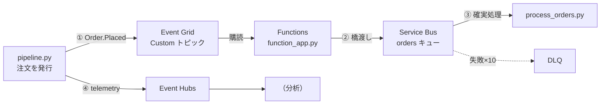
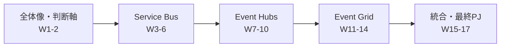

# Week 17 — 最終プロジェクト：3サービス連携の E2E を実装する

> **Phase D**（統合）| 学習プラン Week 17 / 17（最終回）
> 学習目標：Bicep で3サービス（Service Bus / Event Hubs / Event Grid）＋Storage を一括構築し、Python で「反応 → 確実処理」と「大量取り込み」を実装・テストする。17週で学んだ判断を**実装で体現**する

---

## 0. 今週の位置づけ

最終回。Week 16 の組み合わせ（EC サイト例）を、**実際に動く形**にする。使うファイルは `messaging/infra/`（Bicep）と `messaging/code/`（Python）。

### アーキテクチャ（今回作るもの）



- **Event Grid**：注文の状態変化を受ける入口（反応・Week 11）
- **Functions**：Event Grid → Service Bus へ橋渡し（Week 16 §2）
- **Service Bus**：注文を確実に処理（PeekLock・冪等・DLQ・Week 3-4）
- **Event Hubs**：サイトのテレメトリを大量取り込み（Week 7-8）

---

## 1. インフラ構築（Bicep）

`infra/main.bicep` が3サービス＋Storage を一括で作る。

```bash
cd messaging/infra
az group create -n rg-messaging-capstone -l japaneast
az deployment group create -g rg-messaging-capstone \
  --template-file main.bicep --parameters main.bicepparam
```

作られるもの（[main.bicep](../infra/main.bicep)）：

| リソース | 用途 | 対応週 |
|---|---|---|
| Service Bus 名前空間＋`orders` キュー（maxDeliveryCount 10・DLQ 有効） | 確実な処理 | Week 3-4 |
| Event Hubs 名前空間＋`telemetry`（パーティション4・auto-inflate） | 大量取り込み | Week 7 |
| Event Hubs コンシューマーグループ `analytics` | 用途別の読み取り | Week 7 §3 |
| Event Grid Custom トピック（CloudEvents 入力） | 反応の入口 | Week 11 §4 |
| Storage＋コンテナ（`checkpoints`／`eventgrid-deadletter`） | EH checkpoint・EG DLQ | Week 8 / 12 |

> デプロイ出力（`serviceBusFqdn` 等）を、以降の環境変数に使う。**本番はマネージドID・最小権限・ネットワーク制限を追加**（Week 6/10/14）。学習用は自分に各データロールを付与（下記）。

```bash
# 自分に各サービスのデータロールを付与（passwordless で動かすため）
ME=$(az ad signed-in-user show --query id -o tsv)
az role assignment create --assignee $ME --role "Azure Service Bus Data Owner"  --scope <SBのリソースID>
az role assignment create --assignee $ME --role "Azure Event Hubs Data Owner"    --scope <EHのリソースID>
az role assignment create --assignee $ME --role "EventGrid Data Sender"          --scope <EGトピックのID>
az role assignment create --assignee $ME --role "Storage Blob Data Contributor"  --scope <StorageのID>
```

---

## 2. コードの構成

```
code/
├── requirements.txt
├── function_app/function_app.py   # Event Grid トリガー → Service Bus（橋渡し）
└── e2e/
    ├── pipeline.py                # 発行：Event Grid にイベント＋Event Hubs にテレメトリ
    ├── process_orders.py          # Service Bus ワーカー（PeekLock・冪等・complete）
    └── test_e2e.py                # E2E テスト（SDK 直接）
```

```bash
cd messaging/code
python -m venv .venv && source .venv/bin/activate
pip install -r requirements.txt
```

### 2-1. 発行：`pipeline.py`（[コード](../code/e2e/pipeline.py)）

1件の注文で**3サービスを役割分担**（Week 16 §6）：
- **Event Grid** に `Order.Placed` を CloudEvents で発行（反応の起点）
- **Event Hubs** にテレメトリ（`view→add_to_cart→checkout`）を partition key つきで送信（順序保持）

### 2-2. 橋渡し：`function_app/function_app.py`（[コード](../code/function_app/function_app.py)）

**Event Grid トリガー**でイベントを受け、`message_id=order/<id>` を付けて **Service Bus へ送る**。Event Grid の即応と Service Bus の確実性を両取り（Week 16 §2）。`message_id` で重複投入を防ぐ（Week 4 §3）。

### 2-3. 確実処理：`process_orders.py`（[コード](../code/e2e/process_orders.py)）

`orders` キューを **PeekLock** で受信 → **冪等**に処理（処理済み ID をスキップ）→ **complete**。失敗は abandon で再配信、10回超で DLQ（Week 3-4）。

```bash
export SB_FQDN=<serviceBusFqdn>
python e2e/process_orders.py    # 別ターミナルで待受
```

---

## 3. Event Grid → Functions の配線

Functions をデプロイ後、Event Grid の Custom トピックに**この関数を購読**させる（フィルタは `Order.Placed`）。

```bash
# Functions デプロイ（func core tools 例）
cd code && func azure functionapp publish <func-app-name>

# Event Grid サブスクリプションを関数に向ける（Week 12 §2）
az eventgrid event-subscription create \
  --name orders-sub \
  --source-resource-id <EGトピックのID> \
  --endpoint-type azurefunction \
  --endpoint <関数のリソースID> \
  --included-event-types Order.Placed \
  --event-delivery-schema cloudeventschemav1_0
```

> Functions アプリにはマネージドID を有効化し、Service Bus 名前空間の **Azure Service Bus Data Sender** ロールを付与（Week 6 §1）。アプリ設定 `SB_FQDN` に名前空間 FQDN を入れる。

---

## 4. E2E テスト

Function/Event Grid の配線はデプロイが要るため、テストは **pure-SDK で核の2レグ**（Service Bus 確実配信／Event Hubs 取り込み）を検証する（[test_e2e.py](../code/e2e/test_e2e.py)）。

```bash
export SB_FQDN=<serviceBusFqdn>
export EH_FQDN=<eventHubsFqdn>  EH_NAME=telemetry
python e2e/test_e2e.py
# OK: Service Bus 確実配信 / OK: Event Hubs 取り込み / E2E テスト成功
```

- **Service Bus**：注文を送って PeekLock で受信し、内容一致を確認（失われない）。
- **Event Hubs**：先に `@latest` で待ち受け → 送信 → 新着として読めることを確認。

### 手動での通し確認（Function デプロイ後）

```bash
python e2e/pipeline.py 1234     # ① EGへ発行＋② EHへ送信
# → Function が ③ Service Bus に橋渡し
# → process_orders.py の待受側に「処理完了: 注文 1234」が出れば E2E 貫通
```

---

## 5. 17週の集大成（何を体現したか）

| 実装点 | 学んだこと |
|---|---|
| Event Grid で受けて Service Bus へ | 即応（EG）＋確実（SB）の役割分担（Week 16） |
| `message_id` ＋ 受信側の冪等 | at-least-once 前提の重複対策（Week 2/4） |
| PeekLock → complete / abandon → DLQ | 失わない受信（Week 3-4） |
| partition key つき telemetry | 順序を保つ単位（Week 2/7） |
| Blob checkpoint / EG DLQ 用コンテナ | 消費側の進捗管理・退避（Week 8/12） |
| CloudEvents 入力 | 業界標準の封筒（Week 11） |
| Bicep で3サービス一括 | 運用・再現可能な構築（Week 6/10/14） |



---

## ハンズオン チェックリスト

- [ ] `main.bicep` で3サービス＋Storage をデプロイした
- [ ] 自分に各データロールを付与した（passwordless）
- [ ] `test_e2e.py` が「Service Bus 確実配信／Event Hubs 取り込み」で成功した
- [ ] `process_orders.py` を待受し、Service Bus 経由の注文が処理された
- [ ] （応用）Functions をデプロイし、`pipeline.py` → Event Grid → Function → Service Bus の貫通を確認した
- [ ] 各実装点が「どの週の学び」に対応するか説明できた

---

## 自己チェック（総まとめ）

1. **なぜ Event Grid で受けて Service Bus に渡すのか？**
   - キーワード：即応（fire-and-forget）＋確実（順序/DLQ/トランザクション）
2. **`message_id` と受信側の冪等、両方要るのはなぜ？**
   - キーワード：送信側の重複投入防止＋at-least-once の再配信対策
3. **telemetry に partition key を付ける狙いは？**
   - キーワード：注文単位で順序保持・並列とのトレードオフ
4. **この構成で3サービスの役割を一言ずつ言えるか？**
   - キーワード：反応=EG／確実処理=SB／取り込み=EH
5. **本番化で足すべき運用要素を3つ？**
   - キーワード：マネージドID・最小権限・監視/DLQ・ネットワーク制限

---

## 講座の締め

17週で、Service Bus（メッセージ）・Event Hubs（ストリーム）・Event Grid（イベント）を、**個別の深掘り → 横断比較 → 組み合わせ → 実装**まで一巡した。3兄弟は競合ではなく、**それぞれの得意で共存**する。設計で迷ったら Week 15 の決定木へ、組み合わせは Week 16 のパターンへ、実装はこの Week 17 へ戻ってくればよい。おつかれさまでした。
