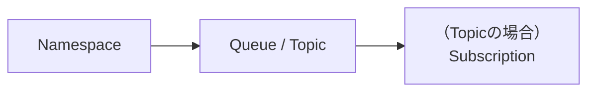
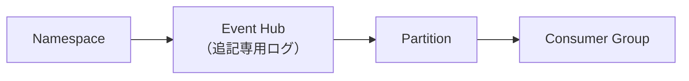
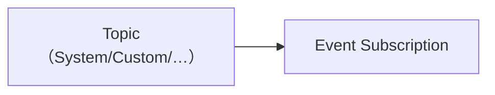
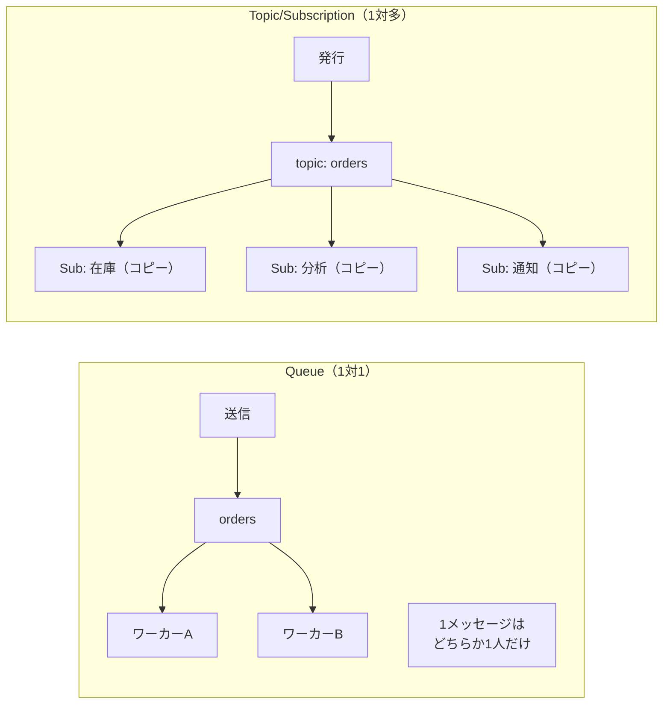
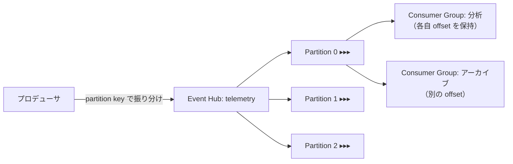
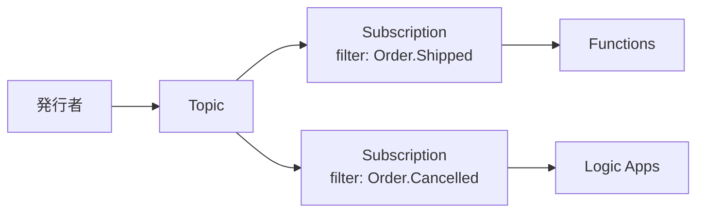
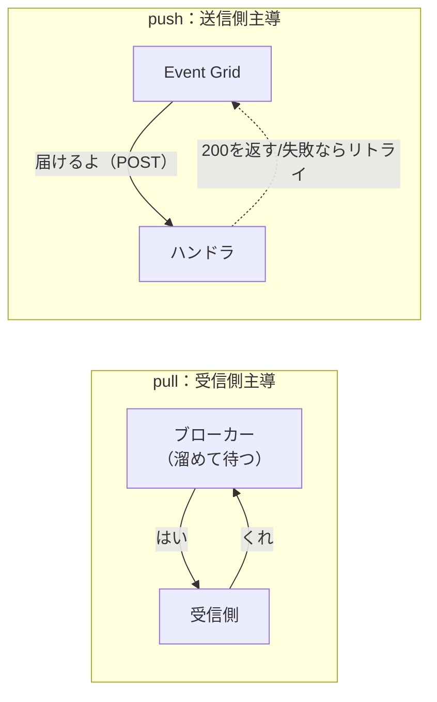
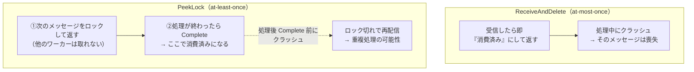
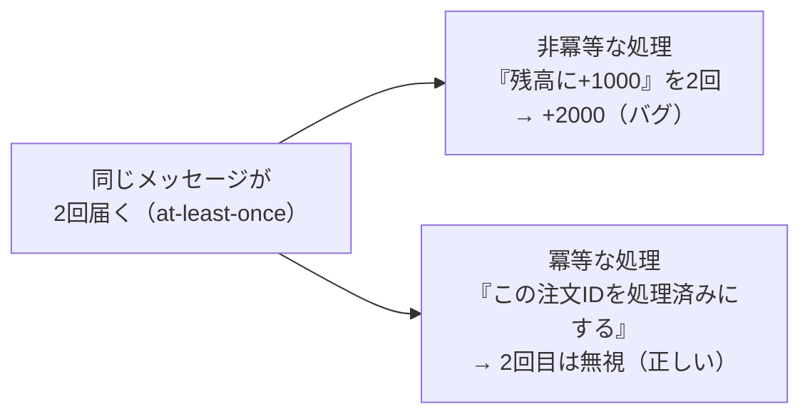
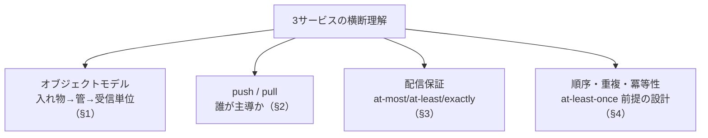

# Week 2 — オブジェクトモデル横断比較と配信セマンティクス

> **Phase 0** | 学習プラン Week 2 / 17
> 学習目標：3サービスの「入れ物 → 管 → 受信単位」の階層を 1 枚の対応表で対応づけられ、push と pull の違い、at-least-once / at-most-once / 重複・順序・冪等性という配信の約束事を、3サービスがそれぞれどう扱うかを説明できる

---

## 0. 今週の位置づけ

Week 1 で「メッセージ / イベント / ストリーム」という**運ぶものの違い**を掴んだ。Week 2 はその上に、**3サービスの部品（オブジェクトモデル）を同じ土俵に並べて対応づける**。

- §1：3サービスの階層を**1枚の対応表**にする（これが Part A 以降の共通言語）
- §2：**push と pull**——「誰が取りに行くのか」の違い
- §3：**配信保証**——at-least-once / at-most-once / exactly-once と、その代償
- §4：**順序・重複・冪等性**——「同じものが 2 回・順番が前後して来る」を前提に設計する

> 今週は手を動かす量は少なめ。代わりに**概念の地図**を固める週。ここが曖昧なまま各サービスに入ると、用語が衝突して混乱する（特に「トピック」は3サービスで意味が違う）。

---

## 1. オブジェクトモデル横断対応表

3サービスとも「**外側の入れ物 → データを通す管 → 受信側の単位**」という3層構造を持つ。名前は違うが役割で対応づけられる。

> **初学者向け用語補足：オブジェクトモデルとは**
> 「そのサービスが**どんな部品（リソース）から構成され、それらがどういう親子関係で組み合わさっているか**」を表した**構成の地図（設計図）**のこと。難しく考えず「**このサービスを作っている部品の種類と階層構造**」と捉えればよい。
> 身近な例：フォルダの世界は「**ドライブ → フォルダ → ファイル**」という入れ子構造を持つ。この構造のルールがフォルダの"オブジェクトモデル"。
> 各サービスを深掘りする前にこれを揃えるのは、**部品の名前と並びが頭に入っていないと用語が衝突して混乱する**から（特に「Topic」は3サービスで別物。§1-1 の区別表を参照）。Storage の Week 2「アカウント → コンテナ → Blob」も同じく Blob のオブジェクトモデルを扱った回。
>
> ```text
> 【オブジェクトモデル＝部品の階層構造】
>   フォルダの例:   ドライブ → フォルダ → ファイル
>   Service Bus:    Namespace → Queue/Topic → Subscription
> ```

**Service Bus**



**Event Hubs**



**Event Grid**



### 1-1. 役割で並べた対応表

| 役割 | Service Bus | Event Hubs | Event Grid |
|---|---|---|---|
| 外側の入れ物（契約・課金） | **Namespace** | **Namespace** | **Topic**（名前空間トピックなら Namespace） |
| データを通す管 | **Queue**（1対1）/ **Topic**（1対多） | **Event Hub**（＝Kafka の topic に相当・追記専用ログ） | **Topic**（System / Custom / Domain / Partner） |
| 並列処理の仕組み | competing consumers（複数ワーカーが取り合う） | **Partition**（並列ログ） | サーバーレス（自動・利用者は意識しない） |
| 受信側の購読単位 | Queue から直接 / Topic の **Subscription** | **Consumer Group**（ストリームの独立ビュー） | **Event Subscription** |
| 絞り込み（フィルタ） | Subscription の **rules / SQL filter** | なし（消費側で振り分け） | Subscription の **filter**（件名・イベント型・高度フィルタ） |
| 進捗（どこまで読んだか） | **サービスが管理**（ロック→完了で消える） | **消費側が管理**（offset を checkpoint） | **サービスが管理**（配信・リトライ） |
| 配信方式 | **pull** | **pull** | **push**（名前空間トピックは pull も） |

> **重要な概念の区別：「トピック」が3サービスで違う**
> 同じ「Topic」でも指すものが違う。ここが最大の混乱ポイント。
>
> | | Service Bus の Topic | Event Hubs の "topic" | Event Grid の Topic |
> |---|---|---|---|
> | 実体 | 1対多配信する**管**（Subscription に複製を配る） | Kafka 用語での **Event Hub そのもの**の別名 | イベントの**発行先エンドポイント** |
> | 受信単位 | Subscription（仮想キュー） | Consumer Group | Event Subscription |
> | 配り方 | 各 Subscription に**コピー**を置く | 全 Consumer Group が**同じログ**を各自の位置で読む | 各 Subscription に**push** |
>
> 「Service Bus の Topic はコピーを配る／Event Hubs は1本のログを皆で読む」——この差は §2・§3 で効いてくる。

### 1-2. Service Bus：Queue と Topic/Subscription

- **Queue**＝**Point-to-point（1対1）**。FIFO で並び、**competing consumers**（複数ワーカー）が取り合い、**1メッセージは1ワーカーだけ**が処理する。タスク分散・負荷平準化向き。
- **Topic + Subscription**＝**Publish/Subscribe（1対多）**。発行者が Topic に送ると、**各 Subscription にコピー**が置かれる。Subscription は「**仮想キュー**」で、受信側から見れば Queue と同じように扱える。

> **初学者向け用語補足：エンティティ（messaging entity）／「1エンティティ」とは**
> Service Bus で**エンティティ**＝名前空間の中に作る「メッセージを保持・配送する個々の入れ物」＝ **Queue / Topic / Subscription** の総称。名前空間は**エンティティを入れる管理コンテナ**で、エンティティ自体ではない。
>
> ```text
> Namespace: sbns-xxxxx            ← 管理コンテナ（エンティティではない）
>   ├─ Queue: orders               ← エンティティ
>   ├─ Topic: order-events         ← エンティティ
>   │    ├─ Subscription: inventory ← エンティティ
>   │    └─ Subscription: analytics ← エンティティ
>   └─（orders/$deadletterqueue は orders に自動付帯する副エンティティ＝Week 4 §1）
> ```
> **「1エンティティ」＝そのうちの1つ**（`orders` というキュー1つ、等）。この単位で各種の制約・上限が効くので、後の週で重要：
> - **トランザクション（Week 5 §1）**：素のトランザクションは「**1エンティティ内**の操作」が基本（同じキューに複数 send 等）。別エンティティをまたぐには send-via が要る。
> - **SAS（Week 6 §1-3）**：SAS ポリシーは**エンティティごと（キュー/トピック単位）にも名前空間全体にも**設定でき、その単位ごとに最大12ルール。



> **初学者向け用語補足：competing consumers（競合コンシューマー）と「ワーカー」の正体**
> 1つの Queue に複数のワーカーをつなぐと、ワーカーたちが**メッセージを取り合う**。各メッセージは**ちょうど1人**が取る（取り合いに勝った者勝ち）。これで**自然に負荷分散**される——速いワーカーは多く処理し、遅いワーカーは少なく処理する。Queue が「pull 型」だからこそできる（§2）。Topic の各 Subscription も内部は仮想キューなので、Subscription ごとに competing consumers を組める。
> - **ワーカー（consumer）とは何か**：Service Bus が用意するものではなく、**あなたが書いた「メッセージを受け取って処理するアプリ」**のこと。Service Bus SDK でキューに接続し `receive()` で取りに行く側＝**クライアント**。その「1台」を複数並べたものが competing consumers。
> - **ワーカーの実体の例**：受信アプリの**プロセス/インスタンス**を複数起動／Kubernetes の **Pod を replicas=3**／**Azure Functions（Service Bus トリガー）が自動で並列起動した各実体**／**VM 上の常駐サービス**——いずれも「キューに取りに来るクライアント」。
> - **「コピーを配る」のと混同しない**：Topic→各 Subscription は**用途ごとにコピー**を配る（在庫用・分析用…）。competing consumers は**1つのキュー/Subscription の中で同じ仕事を複数台で手分け**する。**用途を分ける** ≠ **手分けする**。
>
> ```text
>                   ┌──→ ワーカー1（受信アプリのインスタンス＝クライアント）
>   Queue: orders ──┼──→ ワーカー2（同じアプリの別インスタンス）
>   [m1][m2][m3]    └──→ ワーカー3（同上）
>     m1→W1, m2→W2, m3→W3 … 空いている台が1つずつ取る（各メッセージは1台だけ）
> ```

> **初学者向け用語補足：Subscription の rules / SQL filter**
> Topic の各 Subscription は「**どのメッセージを受けるか**」を**ルール（filter condition）**で絞れる。既定は「全部受ける（true フィルタ）」。例えば `StoreName = 'Tokyo'` という SQL フィルタを置けば、その Subscription には東京店のメッセージだけがコピーされる。Event Grid のフィルタ（§後述）と発想は同じだが、**Service Bus はメッセージのプロパティに対する SQL 式**が書ける点が強力。

### 1-3. Event Hubs：Partition と Consumer Group

- **Event Hub**＝**追記専用ログ（append-only log）**。送られたイベントは**末尾に積まれ続ける**（取っても消えない。保持期間で自動失効）。Kafka の topic に相当。
- **Partition**＝そのログを**並列化**したもの。1つの Event Hub が複数の Partition を持ち、各 Partition は**到着順を保つ独立した列**。並列度＝スループットの上限を決める。
- **Consumer Group**＝ストリームの**独立したビュー**。複数の Consumer Group が**同じデータを各自の位置で**読める（分析用・アーカイブ用・アラート用…を別々に）。

> **初学者向け用語補足：Kafka（Apache Kafka）とは**
> **大量のイベント/ログを高速に流し込んで貯め、後から複数の読み手が好きに読める「分散ストリーミング基盤」のオープンソースソフト**。LinkedIn 発・2011年公開で、いまやこの分野の**事実上の標準（デファクト）**。役割は Event Hubs とほぼ同じ立ち位置で、**Event Hubs は「Kafka の運用を Azure に丸投げできるフルマネージド版」**と捉えるとよい（Week 1 で学んだ"フルマネージド"の発想）。
> - **用語がほぼ共通**：Kafka の topic / partition / consumer group / offset は、そのまま Event Hubs にも出てくる（partition・consumer group・offset は元々 Kafka 由来）。だから公式も「**Event Hub ＝ Kafka の topic に相当**」と書く。
> - **Kafka 互換の意味**：Event Hubs は Kafka プロトコルも喋れるので、**Kafka 向けに書かれた既存アプリを、接続先を向け替えるだけでコードほぼそのまま Event Hubs で動かせる**（自前 Kafka クラスタの運用から解放される）。詳しい使い方は Week 9。
>
> ```text
> Apache Kafka          : 自分でサーバ/クラスタを建てて運用する流儀（OSS）
> Azure Event Hubs      : 同じ流儀のまま運用を Azure に丸投げできる版（フルマネージド・Kafka互換）
>   topic ⇔ Event Hub / partition ⇔ Partition / consumer group ⇔ Consumer Group / offset ⇔ offset
> ```



> **初学者向け用語補足：offset / checkpoint / partition key**
> - **offset（オフセット）**：Partition 内での**読み取り位置＝カーソル**。「自分はここまで読んだ」を表す。
> - **checkpoint（チェックポイント）**：その offset を**外部に保存**しておくこと（通常 Blob Storage に）。落ちても**続きから再開**でき、別インスタンスが**引き継ぎ**でき、過去の offset を指定すれば**リプレイ**できる。重要：AMQP では checkpoint の保存は**消費側の責任**（サービスは offset を提供するだけ）。
> - **partition key**：送信側が付ける文字列。同じキーのイベントは**同じ Partition に・到着順のまま**入る（例：デバイスID 単位で順序を保つ）。キー未指定ならラウンドロビンで分散。
>
> ```text
> Partition 0:  [e0][e1][e2][e3][e4][e5] ...→（末尾に追記）
>                            ↑offset=2（分析CG）   ↑offset=5（アーカイブCG）
>     同じログを、Consumer Group ごとに別のカーソルで読む。取っても消えない＝リプレイ可。
> ```

> **重要な概念の区別：パーティションの役割 ——「順序を守る単位」と「スループット拡大」をどう両立するか**
> 「ログを分散させたら、連続するイベントがバラけて困るのでは？」——正しい懸念。だが **partition key** でこれを両立する。
>
> - **バラけると困る（partition key なし／キーがバラバラ）**：順序が保証されるのは**パーティション内だけ**。連続するイベントが別パーティションに散ると、読む側は順序を再現できない。
>
> ```text
> ✗ 注文#100[作成]→P0  [支払]→P1  [出荷]→P2
>     各パーティションは独立に進む → 「作成→支払→出荷」の順を復元できない
> ```
>
> - **partition key で「順序の単位」を括る（推奨）**：同じキーは**必ず同じパーティションに・到着順のまま**入る。だから1つの注文の全イベントは1パーティションに収まり、**読む側がパーティションをまたいで突き合わせる必要がない**（そのパーティション担当のコンシューマー1台が順番に処理する）。
>
> ```text
> ○ partition key = orderId
>   注文#100[作成][支払][出荷] → 全部 P1（同じキー→同じ場所・順序保持）
>   注文#200[作成][支払][出荷] → 全部 P2
>     異なる注文どうしは並列、同じ注文の中は順序保持
> ```
>
> - **では、なぜ分散するのか＝パーティションの存在理由**：1パーティションは**スループットの天井が低い**（標準で約 1MB/秒・入）。パーティションを増やす＝**並列の管が増えてスループットが上がる**＆**同時に動かせるコンシューマーの最大数が増える**（パーティション数＝コンシューマー並列度の上限）。
> - **設計の勘所**：**「順序を守りたい単位（1デバイス・1注文・1ユーザー）」を partition key にする。その単位どうしは並列でよいので、パーティションを増やしてスループットを稼ぐ。** 「全イベントを通して厳密な順序」が要るケースは稀で、たいてい「あるエンティティの中だけ順序」で足りる。
> - **注意**：partition key を指定しないと round-robin で分散され、連続イベントがバラける。**順序が要るなら必ず partition key を付ける**。番号でパーティションを直接指定する方法もあるが、そのパーティション障害時に送れなくなり可用性が下がるため**非推奨**。
>
> ```text
> 順序が要る単位 = partition key       並列でスループットを稼ぐ
>   device-A → P0 → コンシューマー0（A を順番に処理）
>   device-B → P1 → コンシューマー1（B を順番に処理）
>   device-C → P2 → コンシューマー2（C を順番に処理）
>     同じ device は1つのPartitionに集約 / 異なる device は並列
> ```

> **重要な概念の区別：Service Bus の「取ったら消える」 vs Event Hubs の「読んでも残る」**
> - Service Bus：受信→処理→**完了で消える**（サービスが進捗を管理）。だから「未処理がいくつ残っているか（キュー長）」が意味を持つ。
> - Event Hubs：読んでも**消えない**。消費側が offset で「どこまで読んだか」を自己管理する。だから**複数の用途が同じデータを独立に読め、巻き戻せる**。
> この違いが「リプレイの有無」（Week 1 §3）の正体。

### 1-4. Event Grid：Topic と Event Subscription

- **Topic**＝イベントの**発行先**。種類がある（Azure サービスが出す **System**、自分で作る **Custom**、多数のサブトピックをまとめる **Domain**、SaaS 連携の **Partner**）。Week 11 で詳説。
- **Event Subscription**＝「**どのイベントを・どこへ届けるか**」の設定。フィルタ（件名前方一致・イベント型・高度フィルタ）で絞り、ハンドラ（Functions / Webhook / Service Bus / Event Hubs …）へ **push** する。



---

## 2. push と pull：誰が取りに行くのか

配信には2つのモデルがある。**どちらが主導権を持つか**が違う。

| | pull（プル型） | push（プッシュ型） |
|---|---|---|
| 誰が動く | **受信側が取りに行く** | **送信/仲介側が送りつける** |
| ペース制御 | 受信側が自分のペースで（負荷平準化しやすい） | 送る側のペース。受信側が遅いと詰まる/リトライ |
| 代表 | **Service Bus**（competing consumers）、**Event Hubs**（消費側が読む） | **Event Grid**（ハンドラへ HTTP POST） |
| 向く場面 | 重い処理・バックプレッシャーを効かせたい | 即時に反応させたい・サーバーレスで受けたい |



> **初学者向け用語補足：バックプレッシャー（背圧）**
> 受信側が処理しきれないとき、「ちょっと待って」と**流入を抑える**こと。pull 型は受信側が取りに行く量を自分で決められるので**自然にバックプレッシャーが効く**（Service Bus でワーカーが詰まれば、その分取りに行かないだけ）。push 型は送りつけられるので、受信側が遅いと**リトライや DLQ**（Event Grid）で吸収する設計になる。

> **ポイント**：Event Hubs は「pull だが消えない」、Service Bus は「pull で取ったら消える」、Event Grid は「push で届ける」。**主導権と消滅の有無**で3つを区別できる。

---

## 3. 配信保証（デリバリ・セマンティクス）

「メッセージは**ちゃんと届くのか・何回届くのか**」の約束を**配信保証**という。3段階ある。

| 保証 | 意味 | 代償 | どこで起きるか |
|---|---|---|---|
| **at-most-once**（高々1回） | 失われることはあるが、**重複はしない** | メッセージを**失う**ことがある | Service Bus の **ReceiveAndDelete** |
| **at-least-once**（最低1回） | 失わないが、**重複することがある** | **同じものが2回**来うる | Service Bus の **PeekLock**、Event Hubs、Event Grid（既定） |
| **exactly-once**（ちょうど1回） | 失わず重複もしない（理想） | 仕組みが要る・制約が付く | Service Bus の重複検出 / セッション |

> **重要な概念の区別：プロトコル・配信方式・API の3層（早見表）**
> 混同しやすい3つを分ける。**プロトコル**＝ネットワーク上の通信規格／**配信方式**＝誰が動くか（push/pull/pub-sub）／**API**＝コードからの呼び方（プロトコルではない）。例：Service Bus を JMS（API）で使っても、下は AMQP（プロトコル）で受信は pull（配信方式）。
>
> | サービス | 主なプロトコル | 配信方式 | 補足 |
> |---|---|---|---|
> | **Service Bus** | **AMQP 1.0（既定）**, HTTP | **pull**（PeekLock・競合コンシューマー） | JMS は AMQP 上の API（Week 5 §4） |
> | **Event Hubs** | **AMQP 1.0（既定）**, **Kafka**, HTTPS（送信のみ） | **pull**（offset/checkpoint で読む） | Kafka 互換（Week 9 §2） |
> | **Event Grid（Basic）** | **HTTP** | **push**（ハンドラへ HTTP POST） | Week 11-12 |
> | **Event Grid（名前空間）** | **HTTP ＋ MQTT** | HTTP＝**pull＋push**／MQTT＝**pub-sub** | MQTT は IoT・Week 13 |
>
> - **MQTT を持つのは3兄弟の中で Event Grid（名前空間）だけ**（Service Bus / Event Hubs は非対応。Azure 全体では IoT Hub も MQTT を喋る）。
> - 配信方式で束ねると：**push**＝Event Grid Basic・名前空間 push（宛先は現状 Event Hubs のみ）／**pull**＝Service Bus・Event Hubs・Event Grid 名前空間 pull／**pub-sub**＝Event Grid MQTT。
> - **AMQP**＝Service Bus/Event Hubs の既定プロトコル（Week 5 §4）／**Kafka**＝Event Hubs 互換（Week 9）／**HTTP**＝Event Grid とライト用途で広く／**MQTT**＝Event Grid 名前空間（IoT）。

### 3-1. Service Bus の2つの受信モード（保証の正体）



- **ReceiveAndDelete**：受信した瞬間に消す。シンプルだが、処理前に落ちると**失う**＝at-most-once。
- **PeekLock**（既定・推奨）：受信は2段階。①**ロック**して返す → ②処理が終わったら **Complete** で消す。途中で失敗したら **Abandon**（即解放）するかロックタイムアウトで**再配信**される。だから**失わないが重複しうる**＝at-least-once。

> **初学者向け用語補足：Complete / Abandon / ロックタイムアウト**
> - **Complete（完了）**：処理が成功したのでメッセージを正式に消す。これで初めてキューから消える。
> - **Abandon（中止）**：処理できなかったので**ロックを解除**し、すぐ再配信可能に戻す。
> - **ロックタイムアウト**：Complete も Abandon もしないまま時間切れになると、サービスが自動でロックを解除し再配信する（ワーカーが固まった保険）。
> - 何度も失敗するメッセージは最終的に **DLQ（デッドレター）**へ退避される（Week 4）。

### 3-2. なぜ exactly-once は難しいか

ネットワークは必ず失敗しうるので、「送ったが ACK が返らない→送り直す」が起きる。すると受信側は**同じものを2回**受けうる。だから多くの分散システムは **at-least-once を前提**にし、「**2回来ても平気な作り**＝冪等性」で吸収する（§4）。Service Bus は**重複検出**（一定時間内の同一 MessageId を捨てる）や**セッション**で exactly-once 相当に寄せられる（Week 4）。

---

## 4. 順序・重複・冪等性

at-least-once を前提にすると、設計時に必ず向き合う3点。

### 4-1. 順序（ordering）

| サービス | 順序保証 |
|---|---|
| Service Bus | **FIFO**（セッションを使うと、同一セッション内で厳密順序） |
| Event Hubs | **Partition 単位**で順序保証（同じ partition key→同じ partition→到着順） |
| Event Grid | **保証なし**（順序が要るなら設計で対処） |

> **ポイント**：「全体で厳密に順序」は**並列化と相反する**。Event Hubs は partition を増やすほど並列度が上がるが、**順序は partition 内だけ**。だから「順序を保ちたい単位（例：1ユーザーの操作列）」を partition key にして、その単位の中だけ順序を守るのが定石。

### 4-2. 重複（duplication）と冪等性（idempotency）



> **初学者向け用語補足：冪等性（べきとうせい／idempotency）**
> 読み：**べきとうせい**（冪＝べき・等＝とう・性＝せい）。漢字が難しいので英語の **idempotency** で覚えてもよい。
> **同じ操作を何回実行しても、結果が1回のときと同じ**になる性質。「残高に +1000」は非冪等（回数で結果が変わる）。「注文 #1234 を"処理済み"にする」は冪等（何回やっても処理済みのまま）。at-least-once の世界では**重複は前提**なので、受信側を冪等に作る——具体的には「**処理済みIDを記録して、見たことがあるIDはスキップ**」が王道。これは Service Bus の重複検出（送信側起点）とは別に、**受信側でも持つべき防御**。

### 4-3. まとめ：設計の心得

| 前提にすべきこと | 対策 |
|---|---|
| メッセージは重複しうる | 受信処理を**冪等**に作る（処理済みID管理） |
| 順序は限定的にしか保証されない | 順序が要る単位を **session / partition key** に寄せる |
| 失敗は必ず起きる | **PeekLock + Complete**、リトライ、**DLQ** で取りこぼさない |

---

## 5. Week 2 全体の整理



| 用語 | 一言説明 |
|---|---|
| Namespace | Service Bus / Event Hubs の外側の入れ物（契約・課金） |
| Queue / Topic-Subscription | 1対1 / 1対多（コピー配布）の Service Bus エンティティ |
| Event Hub / Partition / Consumer Group | 追記ログ / 並列の列 / 独立した読み取りビュー |
| offset / checkpoint | 読み取り位置 / その位置の保存（再開・引き継ぎ・リプレイ） |
| push / pull | 送信側が届ける / 受信側が取りに行く |
| at-least-once / 冪等性 | 最低1回（重複しうる）/ 何回やっても同じ結果 |

---

## ハンズオン チェックリスト

- [ ] §1 の横断対応表を、何も見ずに「入れ物・管・受信単位」の3行だけでも書けた
- [ ] Service Bus で Topic を作り、Subscription を2つ足して、片方に SQL フィルタ（例 `eventType = 'shipped'`）を設定した
- [ ] Event Hubs で `$Default` 以外の Consumer Group を1つ追加した（Portal で確認）
- [ ] 「ReceiveAndDelete は at-most-once、PeekLock は at-least-once」を理由つきで説明できた
- [ ] 自分の言葉で「冪等な処理／非冪等な処理」の例を1つずつ挙げた

---

## 自己チェック

1. **3サービスの「入れ物→管→受信単位」を対応づけられるか？**
   - キーワード：Namespace / Queue・Topic / Subscription・Consumer Group・Event Subscription
2. **「トピック」が Service Bus と Event Grid と Event Hubs で何を指すか、違いを言えるか？**
   - キーワード：コピー配布 / Event Hub の別名 / 発行先エンドポイント
3. **push と pull の違いと、それぞれの代表サービスは？**
   - キーワード：受信側主導・バックプレッシャー / 送信側主導・リトライ
4. **at-least-once 前提でなぜ冪等性が要るのか？**
   - キーワード：重複は前提・処理済みID・結果が変わらない
5. **Event Hubs で「順序」と「並列度」がどう両立するか？**
   - キーワード：partition 内だけ順序・partition key で単位を寄せる

---

## 次週の予告（Week 3）

ここから Part A（Service Bus）に入り、手を動かす量が増える：

- **Queue と Topic/Subscription** を実際に作り、SDK（Python）で送受信する
- **PeekLock の2段階**（受信→Complete / Abandon）をコードで体感する
- **ReceiveAndDelete との違い**を、わざとクラッシュさせて確認する
- Storage Queue と Service Bus Queue の違い（いつどちらを選ぶか）を対比する
