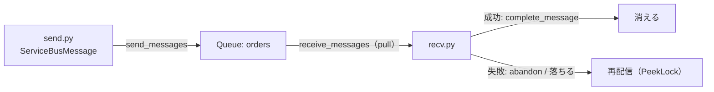

# Week 3 — Service Bus の基礎：Queue / Topic-Subscription を SDK で送受信する

> **Phase A**（Service Bus）| 学習プラン Week 3 / 17
> 学習目標：Standard の Service Bus 名前空間に Queue と Topic/Subscription を作り、Python SDK で送受信できる。PeekLock と ReceiveAndDelete の違いを「わざと失敗させて」体感し、なぜ PeekLock が既定・推奨かを説明できる

---

## 0. 今週の位置づけ

ここから **Part A：Service Bus**（全4週）に入る。Service Bus は3兄弟のうち「**業務データを確実に処理する＝メッセージ**」担当（Week 1）。今週は手を動かす量が一気に増える。

1. **作る**：Standard 名前空間 ＋ Queue（§1）
2. **送受信**：Python SDK（`azure-servicebus`）で送って受ける（§2）
3. **核心**：**PeekLock vs ReceiveAndDelete** をコードで体感（§3）——Week 2 §3 の at-least-once / at-most-once を**実物で**確かめる
4. **1対多**：Topic/Subscription で pub/sub（§4）
5. **対比**：Storage Queue と Service Bus Queue の使い分け（§5）

> Week 1 で作った名前空間は **Basic SKU**（Queue のみ）。Topic/Subscription は **Standard 以上**が必要なので、今週は **Standard** で作り直す（§1）。

---

## 1. Standard 名前空間と Queue を作る

```bash
RG=rg-messaging-week3
LOC=japaneast
SBNS=sbns-week3-$RANDOM           # 名前空間（グローバル一意・6〜50文字）

az group create -n $RG -l $LOC

# Standard 名前空間（Topic/Subscription を使うため Basic ではなく Standard）
az servicebus namespace create -g $RG -n $SBNS -l $LOC --sku Standard

# Queue を作成
az servicebus queue create -g $RG --namespace-name $SBNS -n orders
```

### 認証：パスワードレス（推奨）でロールを付与

本講座は**接続文字列を埋め込まない**やり方（passwordless）を基本にする。自分の Azure ログイン（Entra ID）でデータ操作するため、**Azure Service Bus Data Owner** ロールを自分に割り当てる。

```bash
# 自分のサインインユーザーの objectId を取得
ME=$(az ad signed-in-user show --query id -o tsv)
# 名前空間スコープで「データ所有者」ロールを付与（送受信に必要）
SCOPE=$(az servicebus namespace show -g $RG -n $SBNS --query id -o tsv)
az role assignment create \
  --assignee "$ME" \
  --role "Azure Service Bus Data Owner" \
  --scope "$SCOPE"
```

> **初学者向け用語補足：パスワードレス（passwordless）/ RBAC ロール**
> - **パスワードレス**：接続文字列やアクセスキーをコードや設定に書かず、**自分の Azure ログイン（Entra ID）**でアクセスする方式。鍵の漏洩・ローテーション管理から解放され、Microsoft も実運用では**こちらを推奨**。
> - **RBAC ロール**：「誰が・何に・どこまでできるか」を表す権限のセット（Role-Based Access Control）。Service Bus には3つの組み込みロール：**Data Owner**（送受信＋管理）/ **Data Sender**（送信のみ）/ **Data Receiver**（受信のみ）。最小権限の原則では、送信専用アプリには Sender だけ、のように絞る（詳細は Week 6）。
> - **注意**：ロール割り当ての反映には**1〜2分（まれに最大8分）**かかる。直後に認証エラーが出たら少し待って再実行。

> 接続文字列で手早く試したい場合は、名前空間 →「共有アクセスポリシー」→ `RootManageSharedAccessKey` の接続文字列を使う（学習用。本番非推奨）。コードは §2 末尾の補足参照。

---

## 2. Python SDK で送受信

### 準備

```bash
python -m venv .venv && source .venv/bin/activate
pip install azure-servicebus azure-identity
```

> 公式サンプルは `asyncio` を使う非同期版だが、本講座は**読みやすさ優先で同期版**を使う（メソッド名は同じ、`await` が無いだけ）。非同期版は `azure.servicebus.aio` にある。

### 送信：`send.py`

```python
import os
from azure.servicebus import ServiceBusClient, ServiceBusMessage
from azure.identity import DefaultAzureCredential

FQDN = os.environ["SB_FQDN"]      # 例: sbns-week3-12345.servicebus.windows.net
QUEUE = "orders"

credential = DefaultAzureCredential()

with ServiceBusClient(FQDN, credential) as client:
    with client.get_queue_sender(QUEUE) as sender:
        # 1件送る
        sender.send_messages(ServiceBusMessage("注文#100 を処理して"))
        # まとめて送る（リスト）
        sender.send_messages([ServiceBusMessage(f"注文#{n}") for n in range(101, 104)])
        print("送信完了")
```

### 受信：`recv.py`（既定の PeekLock）

```python
import os
from azure.servicebus import ServiceBusClient
from azure.identity import DefaultAzureCredential

FQDN = os.environ["SB_FQDN"]
QUEUE = "orders"

credential = DefaultAzureCredential()

with ServiceBusClient(FQDN, credential) as client:
    # 既定は PeekLock モード
    with client.get_queue_receiver(QUEUE) as receiver:
        # 5秒間新規が来なければ抜ける
        msgs = receiver.receive_messages(max_message_count=10, max_wait_time=5)
        for msg in msgs:
            print("受信:", str(msg))
            # 処理が成功したら Complete（ここで初めてキューから消える）
            receiver.complete_message(msg)
```

```bash
export SB_FQDN=$SBNS.servicebus.windows.net
python send.py
python recv.py
```

> **ポイント**：`get_queue_sender` / `get_queue_receiver` / `send_messages` / `receive_messages` / `complete_message` が中核 API。`ServiceBusMessage("本文")` がメッセージ1通。`receive_messages` は **pull 型**（こちらから取りに行く。Week 2 §2）で、`max_wait_time` 秒だけ待って返る。

> 接続文字列で繋ぐ場合は `ServiceBusClient.from_connection_string(conn_str)` に差し替えるだけ（`credential` 不要）。

---

## 3. 核心：PeekLock vs ReceiveAndDelete を体感する

Week 2 §3 で学んだ2つの受信モードを、**わざと失敗させて**違いを目で見る。

> **重要な概念の区別：受信≠削除——「どのオブジェクトで何が起きるか」**
> よくある誤解：「受信するとメッセージがキューから出て、失敗すると**また入る**」——**違う**。PeekLock の間、メッセージは**ずっとキューの中に居続ける**。動くのは「場所」ではなく「**状態（ロック）**」。
> - **キュー（ブローカー）**：メッセージが**物理的に置かれる唯一の場所**。最初から最後までここに居る。
> - **ロック**：メッセージに付く「予約中」の札（キューが管理）。
> - **受信者（クライアント）**：キューから**写し（コピー）を受け取って処理する**だけ。**本体は持っていかない**。本体が消えるのは `complete` した瞬間だけ。
>
> ```text
>            ┌──────────── キュー（ブローカー）の中 ────────────┐
>   送信 ──→ │ [Active] ─receive→ [Locked] ─complete→ ★削除      │
>            │    ▲                  │                            │
>            │    └──abandon / ロック切れ（クラッシュ）──┘        │
>            │        delivery count +1（= 再配信）              │
>            └───────────────│─────────────────────────────────┘
>                            ▼ receive のたびに「写し」が出る
>                        受信者（処理する／本体は持たない）
> ```
>
> - **receive**：キューが本体に**ロックを掛け**（=Locked・他からは見えない）、**写しを受信者へ**渡す。本体は**キュー内のまま**。
> - **complete**：本体を**削除**（ここで初めて消える）。
> - **abandon / ロック切れ**：ロックが外れ、本体は**Active に戻る**（キュー内のまま・移動していない）。delivery count +1。
> - **再配信（redelivery）とは**：キュー内に居続けるメッセージのロックが外れて Active に戻り、次の receive でまた Locked になって写しが渡されること。**キューへの再投入ではない**（出ていないので入り直さない）。
> - **ReceiveAndDelete との対比**：あちらは receive した瞬間に本体を削除する。PeekLock は「**受信≠削除**」で、消すのは complete のときだけ。

### 3-1. PeekLock（既定・at-least-once）：処理後 Complete 前にクラッシュ

```python
# crash_peeklock.py — 処理したのに Complete せず落ちるとどうなるか
import os
from azure.servicebus import ServiceBusClient
from azure.identity import DefaultAzureCredential

FQDN = os.environ["SB_FQDN"]; QUEUE = "orders"
with ServiceBusClient(FQDN, DefaultAzureCredential()) as client:
    with client.get_queue_receiver(QUEUE) as receiver:
        msgs = receiver.receive_messages(max_message_count=1, max_wait_time=5)
        for msg in msgs:
            print("処理した(つもり):", str(msg))
            raise SystemExit("★ Complete する前にクラッシュ！")  # ← わざと落とす
            # receiver.complete_message(msg)  # ここに到達しない
```

1. `send.py` で1件送る → `crash_peeklock.py` を実行（Complete せずに落ちる）
2. もう一度 `recv.py` を実行 → **同じメッセージがまた受信できる**

> なぜか：PeekLock は受信時に**ロックするだけ**で、まだ消えていない。Complete しないまま落ちると、ロックタイムアウト後に**再配信**される。だから**失わない＝at-least-once**。ただし「処理は済んでいたのに再配信」＝**重複処理の可能性**。だから受信処理は**冪等**に作る（Week 2 §4-2）。

### 3-2. ReceiveAndDelete（at-most-once）：受信した瞬間に消える

```python
# recv_delete.py
import os
from azure.servicebus import ServiceBusClient, ServiceBusReceiveMode
from azure.identity import DefaultAzureCredential

FQDN = os.environ["SB_FQDN"]; QUEUE = "orders"
with ServiceBusClient(FQDN, DefaultAzureCredential()) as client:
    with client.get_queue_receiver(
        QUEUE, receive_mode=ServiceBusReceiveMode.RECEIVE_AND_DELETE
    ) as receiver:
        msgs = receiver.receive_messages(max_message_count=1, max_wait_time=5)
        for msg in msgs:
            print("受信:", str(msg))
            raise SystemExit("★ 処理前にクラッシュ！")  # ← わざと落とす
```

1. `send.py` で1件送る → `recv_delete.py` を実行（処理前に落ちる）
2. もう一度 `recv.py` で取ろうとする → **もう無い（メッセージは消失）**

> なぜか：ReceiveAndDelete は**受信した瞬間に消費済み**にする。処理前に落ちると**失われる＝at-most-once**。Complete/Abandon が無いぶんシンプルだが、取りこぼしを許容できる用途だけに使う。

### 3-3. Abandon：処理できないので即座に戻す

```python
# 処理に失敗したら abandon でロック解除 → すぐ再配信可能に
for msg in msgs:
    try:
        do_work(msg)                      # 自分の処理
        receiver.complete_message(msg)    # 成功 → 消す
    except Exception:
        receiver.abandon_message(msg)     # 失敗 → 戻す（再試行される）
```

> **まとめ（Week 2 §3 の実証）**
>
> | モード | 落ちたとき | 保証 | 使いどころ |
> |---|---|---|---|
> | **PeekLock**（既定） | 再配信される | at-least-once | 失いたくない業務処理（ほぼ常にこれ） |
> | **ReceiveAndDelete** | 失われる | at-most-once | 取りこぼし可・最速・最小実装 |
>
> 何度も失敗し続けるメッセージは最終的に **DLQ（デッドレター）**へ退避される。これは Week 4 で扱う。

---

## 4. Topic / Subscription で 1対多（pub/sub）

Queue は1対1。**同じメッセージを複数の用途に配りたい**なら Topic/Subscription（Week 2 §1-2）。

> **初学者向け用語補足：Subscription は「仮想キュー」とはどういう意味か**
> 公式は Subscription を「**a virtual queue（仮想キュー）**」と表現する。意味は「**物理的に独立したキューではないが、受信側から見るとキューそのものとして振る舞う**」こと。
> - **直接は送れない**：送り先は **Topic だけ**。Topic が各 Subscription に**コピーを投げ込み**、その結果 Subscription が「中身の溜まったキュー」のように見える。本物の Queue は送信側がそのキューに直接送るのに対し、Subscription は **Topic 経由でコピーが入ってくる**——ここが「仮想」の由来。
> - **受信コードは Queue と同じ**：`receive_messages` / `complete_message` / PeekLock / competing consumers / FIFO / DLQ など、**Queue でできることが Subscription でもそのまま使える**（窓口を `get_queue_receiver` → `get_subscription_receiver` に変えるだけ）。
>
> ```text
>             ┌─ Subscription: inventory ← キューのように溜まる（受信側は普通のキュー扱い）
> 発行 → Topic ┤
>             └─ Subscription: analytics ← 同上
>   送り先は Topic のみ。Topic が各 Subscription にコピーを置く＝「仮想キュー」。
> ```

```bash
# Topic と、用途別の Subscription を2つ作る
az servicebus topic create -g $RG --namespace-name $SBNS -n order-events
az servicebus topic subscription create -g $RG --namespace-name $SBNS \
  --topic-name order-events -n inventory       # 在庫用
az servicebus topic subscription create -g $RG --namespace-name $SBNS \
  --topic-name order-events -n analytics        # 分析用
```

### 発行と購読（SDK）

```python
# 発行：Topic へ送る（Queue とほぼ同じ。sender が topic になるだけ）
with client.get_topic_sender("order-events") as sender:
    sender.send_messages(ServiceBusMessage("注文#100 が出荷された"))

# 購読：Subscription から受ける（Subscription は「仮想キュー」）
with client.get_subscription_receiver("order-events", "inventory") as receiver:
    for msg in receiver.receive_messages(max_message_count=10, max_wait_time=5):
        print("inventory が受信:", str(msg))
        receiver.complete_message(msg)
```

> **体感ポイント**：1通発行すると、`inventory` と `analytics` の**両方**が**それぞれコピーを**受け取る（competing consumers の「手分け」ではなく、用途ごとの「複製配布」。Week 2 §1-2 の区別）。フィルタ（特定の Subscription だけ受ける）は Week 2 §1-2 の SQL filter で、設定例は Week 4 で扱う。

---

## 5. Storage Queue と Service Bus Queue の使い分け

「キュー」は Storage にもあった（Storage 教材 Week 1 で俯瞰）。どちらを選ぶか。

| 観点 | Storage Queue | Service Bus Queue |
|---|---|---|
| 位置づけ | Storage のおまけ的な簡易キュー | 本格的なメッセージング基盤 |
| メッセージサイズ | 最大 64KB | 最大 256KB（Premium で 100MB） |
| 順序(FIFO) | 保証なし | あり（セッションで厳密順序） |
| 重複検出 | なし | あり |
| Topic/Subscription（pub/sub） | なし | あり |
| トランザクション | なし | あり |
| DLQ | なし（自前で実装） | あり（標準） |
| 向く場面 | 超大量・シンプル・安さ重視 | 業務処理・順序・信頼性が要る |

> **判断軸**：「**とにかく大量で単純な作業キュー**」なら Storage Queue、「**順序・重複排除・トランザクション・pub/sub など業務要件**」があれば Service Bus。迷ったら、要件が増えがちな業務系は Service Bus が安全。

---

## 6. Week 3 全体の整理



| 用語 | 一言説明 |
|---|---|
| ServiceBusClient / get_queue_sender / get_queue_receiver | 接続・送信窓口・受信窓口 |
| send_messages / receive_messages | 送る / 取りに行く（pull） |
| complete_message / abandon_message | 完了して消す / 戻して再試行 |
| PeekLock / ReceiveAndDelete | ロックして2段階（at-least-once）/ 即消し（at-most-once） |
| Topic / Subscription | 1対多。各 Subscription にコピーを配る（仮想キュー） |

---

## ハンズオン チェックリスト

- [ ] Standard 名前空間と Queue `orders` を作成し、自分に Data Owner ロールを付与した
- [ ] `send.py` / `recv.py` で送受信でき、Portal の Overview で incoming/outgoing カウントを確認した
- [ ] `crash_peeklock.py`（Complete 前に落ちる）→ `recv.py` で**再配信される**ことを確認した
- [ ] `recv_delete.py`（処理前に落ちる）→ メッセージが**失われる**ことを確認した
- [ ] Topic `order-events` ＋ Subscription 2つを作り、1発行で両方が受け取ることを確認した

---

## 自己チェック

1. **PeekLock で「処理後 Complete 前」に落ちると何が起きるか？なぜ at-least-once なのか？**
   - キーワード：ロックのみ・未 Complete・ロックタイムアウト・再配信
2. **ReceiveAndDelete はなぜ at-most-once か？どんな用途に向くか？**
   - キーワード：受信即消費済み・取りこぼし許容
3. **complete / abandon / 放置（タイムアウト）の違いは？**
   - キーワード：消す / すぐ戻す / 自動で戻す
4. **Topic で1通発行すると各 Subscription はどう受け取るか？competing consumers と何が違う？**
   - キーワード：コピー配布 vs 手分け
5. **Storage Queue ではなく Service Bus Queue を選ぶ理由を2つ挙げられるか？**
   - キーワード：順序・重複検出・トランザクション・DLQ・pub/sub

---

## 次週の予告（Week 4）

Service Bus の**信頼性を支える高度機能**に踏み込む：

- **DLQ（デッドレターキュー）**：処理できないメッセージの退避と、その確認・再処理
- **セッション**：同一セッション内での**厳密な FIFO**（順序保証）
- **重複検出**：一定時間内の同一 MessageId を自動で捨てる（exactly-once に寄せる）
- **スケジュール配信／メッセージ遅延**：未来の時刻に届ける
- これらをコードで動かし、「失わない・順序を守る・重複させない」を実装で体得する
