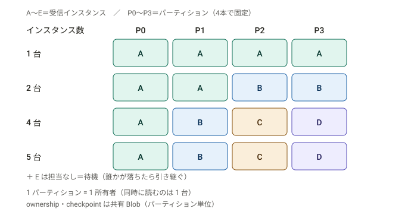
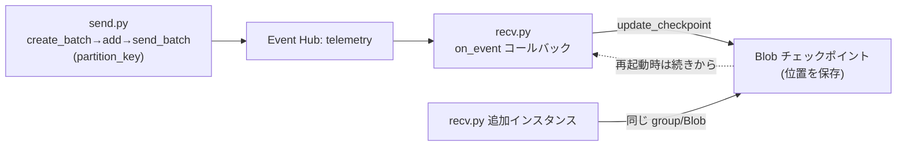

# Week 8 — Event Hubs を実装する：プロデューサ・コンシューマ・Blob チェックポイント

> **Phase B**（Event Hubs）| 学習プラン Week 8 / 17
> 学習目標：`EventHubProducerClient` でバッチ送信（partition key 付き）でき、`EventHubConsumerClient` ＋ Blob チェックポイントストアで受信して落ちても続きから再開でき、処理インスタンスを増やすとパーティションが自動分配される様子を体感し、Service Bus の `complete` と Event Hubs の `update_checkpoint` の違いをコードで説明できる

---

## 0. 今週の位置づけ

Week 7 で概念（パーティション・offset・checkpoint・TU）を押さえた。Week 8 はそれを **Python SDK（`azure-eventhub`）で実装**して、手で動かして腹落ちさせる。

1. **準備**：リソースと2つのロール（Event Hubs と Storage）（§1）
2. **送る**：`EventHubProducerClient` でバッチ送信（§2）
3. **受ける**：`EventHubConsumerClient` ＋ Blob チェックポイント（§3）
4. **スケール**：インスタンスを増やしてパーティション自動分配を体感（§4）
5. **対比**：SB の `complete` と EH の `update_checkpoint`（§5）

> Week 7 §4 で「チェックポイントの保存は消費側の責任・Blob に保存」と学んだ。今週その **Blob チェックポイントストアを実際に繋ぐ**。

---

## 1. 準備：リソースと2つのロール

Week 7 で作った名前空間／イベントハブ（`telemetry`・パーティション4・`analytics` グループ）を使う。**Event Hubs に加えて、チェックポイント用に Storage が要る**のが Event Hubs 実装の特徴。

```bash
# Week 7 の続き（無ければ Week 7 §6 で作成）
RG=rg-messaging-week7
EHNS=ehns-week7-xxxxx
EH=telemetry

# チェックポイント用ストレージ＋コンテナ（コンシューマーグループごとに別コンテナ推奨）
ST=stehckpt$RANDOM
az storage account create -g $RG -n $ST --sku Standard_LRS
az storage container create --account-name $ST -n analytics-cp --auth-mode login

# 自分に2つのロールを付与（passwordless）
ME=$(az ad signed-in-user show --query id -o tsv)
# ① Event Hubs：送受信
az role assignment create --assignee "$ME" --role "Azure Event Hubs Data Owner" \
  --scope $(az eventhubs namespace show -g $RG -n $EHNS --query id -o tsv)
# ② Storage：チェックポイント Blob の読み書き
az role assignment create --assignee "$ME" --role "Storage Blob Data Contributor" \
  --scope $(az storage account show -g $RG -n $ST --query id -o tsv)
```

```bash
pip install azure-eventhub azure-eventhub-checkpointstoreblob-aio azure-identity aiohttp
```

> **ポイント**：Service Bus は SB のロール1つで済んだが、**Event Hubs のコンシューマは「Event Hubs Data Owner/Receiver」＋「Storage Blob Data Contributor」の2つ**が要る。チェックポイントを Blob に書くから（Week 7 §4）。Storage のコンテナは**コンシューマーグループごとに分ける**のが公式推奨。

---

## 2. プロデューサ：バッチ送信

```python
# send.py
import asyncio
from azure.eventhub import EventData
from azure.eventhub.aio import EventHubProducerClient
from azure.identity.aio import DefaultAzureCredential

FQDN = "ehns-week7-xxxxx.servicebus.windows.net"
EH = "telemetry"

async def run():
    credential = DefaultAzureCredential()
    producer = EventHubProducerClient(
        fully_qualified_namespace=FQDN, eventhub_name=EH, credential=credential
    )
    async with producer:
        # ① パーティションキーなし（ラウンドロビンで分散）
        batch = await producer.create_batch()
        for i in range(5):
            batch.add(EventData(f"telemetry #{i}"))
        await producer.send_batch(batch)

        # ② パーティションキー付き（同じ device は同じパーティションへ・順序保持）
        batch2 = await producer.create_batch(partition_key="device-1")
        for t in ["temp=21", "temp=22", "temp=23"]:
            batch2.add(EventData(t))
        await producer.send_batch(batch2)
    await credential.close()
    print("送信完了")

asyncio.run(run())
```

> **ポイント**：
> - **バッチ送信が基本**：`create_batch()` で器を作り、`add()` で詰め、`send_batch()` でまとめて送る（大量送信を効率化）。1バッチは最大1MB。
> - **partition key**：`create_batch(partition_key=...)` で指定。同じキーは**同じパーティションに・到着順**で入る（Week 2 §1-3／Week 7 §2）。未指定はラウンドロビン分散。
> - Service Bus と違い **complete/peek-lock の概念はない**（送るだけ。受信側が後で読む）。

> **初学者向け用語補足：このコードの Python 構文（async/await・async with）**
> - **`async with producer:`**＝非同期のコンテキストマネージャ。`with` は「ブロックを抜けたら**自動で後片付け（接続クローズ）**」（`with open()` と同じ発想）。`async` が付くのは接続の開始/終了が**ネットワーク I/O（待ちが発生）**だから。ブロックを抜けると producer 接続が自動で閉じる。
> - **`await`**＝「この非同期処理（通信など）が**終わるまで待つ**」印。待つ間もプログラム全体は止まらない。`create_batch()`・`send_batch()` は通信を伴うので `await` を付ける。
> - **`batch.add(...)` に `await` が無い理由**＝`add` は**メモリ上の器に詰めるだけ（通信しない）**ので、待つ必要がない（即座に終わる）。「通信する操作には await、しない操作には付けない」と区別する。
> - **`f"telemetry #{i}"`**＝f-string。`{i}` に変数の値が入り `"telemetry #0"`… になる。
> - **最後の `await credential.close()` のインデント**：`async with` ブロックの**外**（字下げが戻っている）＝**producer を閉じた後**に認証情報を閉じる、の順。
> - **流れ**：接続を開く → 器を作る(`create_batch`) → 複数詰める(`add`) → まとめて送る(`send_batch`) → ブロックを抜けて接続自動クローズ。①はキー無しで分散、②はキー付きで同一パーティション・順序保持。

---

## 3. コンシューマ：Blob チェックポイントで受信

```python
# recv.py
import asyncio
from azure.eventhub.aio import EventHubConsumerClient
from azure.eventhub.extensions.checkpointstoreblobaio import BlobCheckpointStore
from azure.identity.aio import DefaultAzureCredential

FQDN = "ehns-week7-xxxxx.servicebus.windows.net"
EH = "telemetry"
BLOB_URL = "https://stehckptxxxxx.blob.core.windows.net/"
CONTAINER = "analytics-cp"

async def on_event(partition_context, event):
    print(f'受信: "{event.body_as_str()}" / partition {partition_context.partition_id}')
    # ★ チェックポイント更新＝「ここまで処理した」を Blob に保存（消費側の責任）
    await partition_context.update_checkpoint(event)

async def main():
    credential = DefaultAzureCredential()
    # チェックポイントストア（Blob）
    checkpoint_store = BlobCheckpointStore(
        blob_account_url=BLOB_URL, container_name=CONTAINER, credential=credential
    )
    client = EventHubConsumerClient(
        fully_qualified_namespace=FQDN, eventhub_name=EH,
        consumer_group="analytics",                 # Week 7 で作ったグループ
        checkpoint_store=checkpoint_store,
        credential=credential,
    )
    async with client:
        # checkpoint があればそこから、無ければ starting_position から
        #   "-1" = 先頭から / "@latest" = 末尾（新着のみ）
        await client.receive(on_event=on_event, starting_position="-1")
    await credential.close()

asyncio.run(main())
```

```bash
python recv.py   # 受信待受（Ctrl+C で停止）
# 別ターミナルで
python send.py
```

> **ポイント**：
> - **`on_event` コールバック方式**：受信ループは SDK が回し、イベント1件ごとに `on_event` が呼ばれる（全パーティションを自動で面倒みる）。
> - **`update_checkpoint(event)`**：これが Week 7 の「しおりを Blob に挟む」操作。呼ぶと、その event の位置が **Blob に保存**され、次回起動時はそこから再開。
> - **`starting_position`** は**チェックポイントが無いときの初期位置**。一度 checkpoint が書かれれば、再起動しても**続きから**読む（`-1` の先頭からには戻らない）。
> - **再開を体感**：recv を Ctrl+C → 再実行すると、**処理済みは飛ばして続きから**になる（checkpoint が効いている証拠）。

> **初学者向け用語補足：`update_checkpoint` を「毎件」呼ぶ？**
> 毎件呼ぶと安全（再開時の読み直しが最小）だが、Blob 書き込みが増えてオーバーヘッド大。実務では**N件ごと・数秒ごと**にまとめて checkpoint するのが定石。粗くすると再開時に**処理済みを読み直す＝重複**が起きるので、受信処理は**冪等**に（Week 2 §4-2）。「どのくらいの頻度で checkpoint するか」は**再処理コスト vs 書き込みコスト**のトレードオフ。

> **初学者向け用語補足：コールバック（callback）とは**
> **自分で呼ぶ関数ではなく、相手（SDK）に渡しておいて、相手が必要なときに呼んでくれる関数**。標語で「**Don't call us, we'll call you**」。ここでは `on_event` を `client.receive(on_event=on_event)` で SDK に**渡すだけ**で、自分では呼ばない。SDK が裏で受信ループを回し、**イベントが届くたびに on_event を呼ぶ**。あなたは「**何をするか**（1件ごとの処理）」だけ書き、「**いつ呼ぶか**」は SDK に任せる。
>
> | | Service Bus（Week 3） | Event Hubs（Week 8） |
> |---|---|---|
> | 書き方 | **自分でループ**して取る | **コールバックを登録**して任せる |
> | コード | `for msg in receiver.receive_messages():` | `client.receive(on_event=on_event)` |
> | 主導 | あなたが「取りに行く」 | SDK が「届いたら呼ぶ」 |
>
> たとえ：コールバック無し＝自分で郵便受けを何度も見に行く。コールバック有り＝配達員に「届いたらこれをして」と指示書を渡す → 届くたびに配達員が実行してくれる（自分は待たなくていい）。

---

## 4. 負荷分散を体感：インスタンスを増やす

> **なぜ recv.py を複数起動するのか**（「1つで足りるのでは？」への答え）
> その感覚は**小さい負荷なら正しい**。1インスタンスでも全パーティションを処理できる。複数にするのは次の2つのときだけ：
> - **① スループット向上**：Event Hubs は「毎秒大量」が前提（Week 1・7）。1件ごとに重い処理（DB 書き込み・分析等）をすると**1プロセスでは追いつかない**ことがある。インスタンスを増やすと**パーティション単位で分担**され、並列で処理能力が上がる（Service Bus の competing consumers＝Week 2 §1-2 と同じ発想。EH ではパーティション単位）。
> - **② 高可用性**：1インスタンスだと落ちたら処理が完全に止まる。複数なら、1つが落ちても**残りが落ちた分のパーティションを自動で引き継ぐ**（checkpoint が Blob にあるので続きから）。
>
> | 状況 | インスタンス数 |
> |---|---|
> | 流入が少ない・処理が軽い | **1つで十分** |
> | 処理が追いつかない | 増やす（最大＝パーティション数） |
> | 落ちても止めたくない | 2つ以上（冗長化） |
>
> つまり §4 は「**常に複数にしろ**」ではなく「**必要になったらインスタンスを足すだけで、自動で分担・冗長化される（コード変更不要）**」という Event Hubs の強みの話。

同じ `consumer_group` ＋ 同じ `checkpoint_store` で **recv.py を複数起動**すると、SDK（epoch consumer）が**パーティションを自動で分け合う**（Week 7 §3-2）。

### 図：インスタンスを増やしたときの割り当て



```text
パーティションは4本で固定（P0〜P3）。変わるのはインスタンス数。A〜E＝受信インスタンス。

  インスタンス数 │ P0   P1   P2   P3 │ 待機
  ───────────────┼───────────────────┼──────────────
     1 台        │  A    A    A    A  │  —
     2 台        │  A    A    B    B  │  —
     4 台        │  A    B    C    D  │  —
     5 台        │  A    B    C    D  │  E（担当なし＝予備）

  ・1 パーティション = 1 所有者（同時に読むのは1台）→ 並列上限＝パーティション数（=4）
  ・5台目は担当なしで待機。誰かが落ちたら ownership を奪って引き継ぐ
  ・ownership・checkpoint は共有 Blob にパーティション単位で置かれる（担当が移っても続きから）
```

> これが「処理インスタンスを増やすだけでスケールアウト」（Week 7 §3-2）。担当の割り当て・引き継ぎ・チェックポイントの共有はすべて `checkpoint_store`（Blob）を介して SDK が自動でやる。だから**全インスタンスが同じ Blob コンテナ**を指すことが重要。

> **重要な概念の区別：インスタンス増減時のチェックポイント——「パーティションに紐づく・インスタンスではない」**
> 鍵は「**checkpoint は『インスタンス』ではなく『パーティション』に紐づく**」こと。共有 Blob コンテナには、**パーティションごとに2種類**の情報が入る：
>
> ```text
> Blob コンテナ（全インスタンスが共有）
>   ├─ partition 0 → checkpoint（どこまで読んだか）＋ ownership（今どのインスタンスが担当か）
>   ├─ partition 1 → checkpoint ＋ ownership
>   └─ ...（パーティションごと）
> ```
> | Blob 内の情報 | 役割 |
> |---|---|
> | **checkpoint** | そのパーティションの読み取り位置（offset／しおり・Week 7 §4） |
> | **ownership（所有権）** | そのパーティションを今どのインスタンスが担当しているか＝負荷分散の正体 |
>
> - **増やすと**：SDK が再分配（リバランス）。新インスタンスが一部パーティションの **ownership を奪取**し、そのパーティションの **checkpoint を Blob から読んで続きから**処理する（先頭には戻らない）。**移るのは ownership だけ。checkpoint はパーティション側に残る**。
> - **落ちると**：落ちたインスタンスの ownership が**期限切れ**になり、別インスタンスが奪取して checkpoint から続きを処理（§4 冒頭の「引き継ぐ」の中身）。引き継げるのは、しおりが**インスタンス内ではなく共有 Blob にある**から。
> - **競合しない**：**1パーティションを同時に所有できるのは1インスタンスだけ**（epoch・Week 7 §3-2）。だからそのパーティションの checkpoint を書くのは常に1つ。二重書き込みは起きない。
> - **だから同じコンテナ必須**：別々のコンテナだと互いの ownership・checkpoint が見えず、**同じパーティションを二重処理**してしまう。

---

## 5. 対比：Service Bus の `complete` と Event Hubs の `update_checkpoint`

同じ「処理し終えた」を表すが、**意味が根本的に違う**（Week 7 §1・§4 の実装版）。

| | Service Bus `complete_message` | Event Hubs `update_checkpoint` |
|---|---|---|
| 何が起きる | そのメッセージを**キューから削除** | 読み取り位置（offset）を **Blob に保存**するだけ |
| データは | 消える | **残る**（保持期間まで） |
| 1件ごとか | **1件ごとに確定**（消す/戻す） | **位置の記録**（まとめて間引ける） |
| 他の読み手 | 関係ない（取った人だけ） | 他グループは**自分の checkpoint で独立に**読む |
| 戻せるか | DLQ 等の仕組み | **過去 offset 指定でリプレイ自由** |

```python
# Service Bus：1件ずつ「消す/戻す」を確定
receiver.complete_message(msg)     # 消す
receiver.abandon_message(msg)      # 戻す（再配信）

# Event Hubs：位置を記録するだけ（データは消えない）
await partition_context.update_checkpoint(event)   # 「ここまで読んだ」を Blob に
```

> **核心**：Service Bus は「**ToDo を消す**」、Event Hubs は「**読んだページにしおりを挟む**」。だから Event Hubs は同じデータを別グループが独立に読め、巻き戻せる。Week 7 §1 の「作業キュー vs 録画ログ」がコードに現れている。

---

## 6. Week 8 全体の整理



| 用語 | 一言説明 |
|---|---|
| EventHubProducerClient / create_batch / send_batch | 送信窓口 / バッチの器 / まとめ送信 |
| partition_key | 同じキーを同じパーティションへ（順序保持） |
| EventHubConsumerClient / on_event | 受信窓口 / 1件ごとのコールバック |
| BlobCheckpointStore / update_checkpoint | チェックポイント保存先 / 位置を保存 |
| starting_position | checkpoint が無いときの初期位置（-1=先頭） |

---

## ハンズオン チェックリスト

- [ ] Event Hubs Data Owner と Storage Blob Data Contributor の2ロールを自分に付与した
- [ ] `send.py` でバッチ送信（partition key 付き／なし）した
- [ ] `recv.py` で受信し、partition ID 付きで表示されることを確認した
- [ ] recv を停止→再実行し、**処理済みを飛ばして続きから**になることを確認した（checkpoint）
- [ ] recv を2つ起動し、パーティションが分配される（負荷分散）ことを確認した
- [ ] `complete`（消す）と `update_checkpoint`（位置を保存）の違いを説明できた

---

## 自己チェック

1. **Event Hubs のコンシューマに Storage のロールが要るのはなぜ？**
   - キーワード：チェックポイントを Blob に保存・消費側の責任
2. **`update_checkpoint` は何をする？呼ばないとどうなる？**
   - キーワード：位置を Blob に保存・再起動で読み直し
3. **checkpoint を毎件 vs まとめて、のトレードオフは？**
   - キーワード：書き込みコスト vs 再処理（重複）・冪等性
4. **recv を2インスタンスにすると何が起きる？上限は？**
   - キーワード：パーティション自動分配・パーティション数が並列上限
5. **`complete_message` と `update_checkpoint` の決定的な違いは？**
   - キーワード：消す vs 位置を記録・残る・リプレイ

---

## 次週の予告（Week 9）

Event Hubs を「取り込み基盤」として周辺と繋ぐ：

- **Event Hubs Capture**：流れるストリームを自動で Blob / Data Lake に保存（Avro/Parquet）——Week 1 の Storage と繋がる
- **Kafka 互換エンドポイント**：既存 Kafka アプリを接続先変更だけで載せ替え（Week 2 §1-3 の Kafka）
- **Schema Registry**：イベントのスキーマを管理し、送受信で整合を保つ
- 「大量に取り込んで、後段の分析・保管へ流す」という Event Hubs の本領
