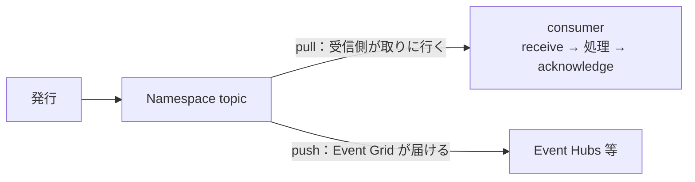
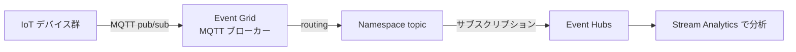
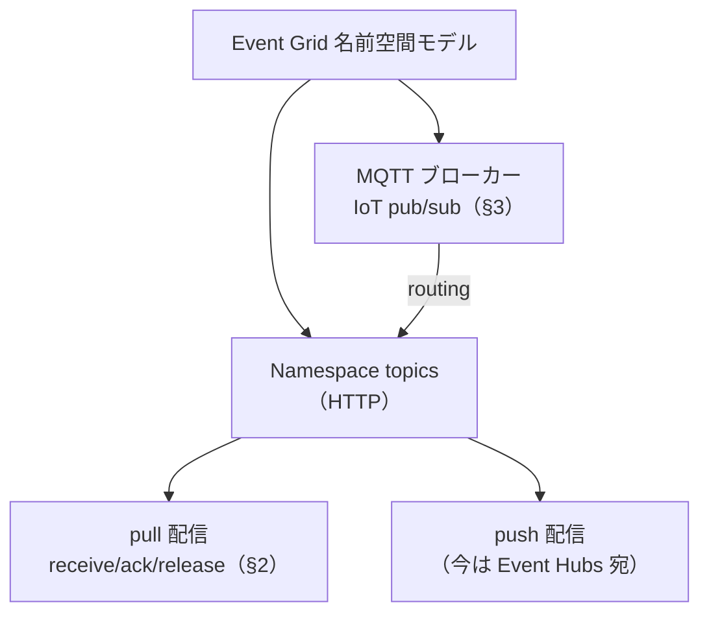

# Week 13 — Event Grid の名前空間モデル：Namespace topics・pull 配信・MQTT

> **Phase C**（Event Grid）| 学習プラン Week 13 / 17
> 学習目標：Event Grid には従来の push 型（Basic）に加えて「**名前空間（namespace）モデル**」があることを理解し、pull 配信（receive/acknowledge/release/reject の queue ライク受信）を Service Bus と対比して説明でき、MQTT ブローカー機能（IoT 向け pub/sub）の位置づけを掴む

---

## 0. 今週の位置づけ

Week 11-12 で学んだのは Event Grid の**従来型（Basic・push 配信）**——「起きたら関心のある相手に push」。Week 13 では、Event Grid の像が**大きく広がる**：**名前空間モデル**が加わり、**pull（受信側が取りに行く）**と **MQTT（IoT の pub/sub）**もできる。

1. **名前空間モデル**：新しいリソースの入れ物（§1）
2. **pull 配信**：Event Grid でも「取りに行く」＝queue ライク受信（§2）
3. **MQTT ブローカー**：IoT デバイス向け pub/sub（§3）

> 「Event Grid ＝ push 専用」という Week 11 のイメージは**半分**。名前空間モデルで pull も MQTT もできる、と像を更新する回。

---

## 1. 名前空間（namespace）モデル

**名前空間**は、新しいリソース群をまとめる**管理コンテナ**（Service Bus / Event Hubs の名前空間に相当）。**2つのエンドポイント**を持つ。

| エンドポイント | 使う機能 | プロトコル |
|---|---|---|
| **HTTP** | **Namespace topics**（pull / push 配信） | HTTP |
| **MQTT** | MQTT ブローカー（IoT） | MQTT |

- **Namespace topics（名前空間トピック）**：名前空間の中に作るトピック。**pull 配信と push 配信の両方**に対応。
- スループットは **TU（スループットユニット）**で決まる（Event Hubs と同じ発想）。

### 1-1. 従来型（Basic）との違い

| | 従来型（Basic・Week 11-12） | 名前空間モデル（Week 13） |
|---|---|---|
| トピック | System / Custom / Partner / Domain | **Namespace topics** |
| 配信 | **push のみ** | **pull ＋ push** |
| プロトコル | HTTP（Webhook 等） | HTTP ＋ **MQTT** |
| 位置づけ | 反応的なイベント配信 | ＋ queue ライク受信・IoT |

> **ポイント**：Week 11 の4トピック（System 等）は Basic の話。名前空間モデルは**別系統の新しいリソース**で、**自分のアプリが発行するイベント**を pull で受けたり、**MQTT デバイス**を繋いだりする用途。用途で選ぶ。

---

## 2. pull 配信：Event Grid でも「取りに行く」

### 2-1. 何が違うか

従来の push は「Event Grid が届ける」。**pull は、消費側が Event Grid に接続して、queue のように読む**。**受信側が消費のタイミングと速度を握る**（Event Hubs / Service Bus 的）。

### 2-2. 4つの操作（queue ライクな状態制御）

pull では、読んだイベントの状態を4操作で制御する。

| 操作 | 意味 |
|---|---|
| **receive** | イベントを受け取る（ロックされる。`lockToken` が付く） |
| **acknowledge** | 処理成功。**確定して消す** |
| **release** | 今は処理できない。**戻して後で再配信**（Service Bus の abandon 相当） |
| **reject** | 受け付けない（DLQ 等へ） |
| **renew lock** | ロックを延長 |

> **重要な概念の区別：Event Grid pull と Service Bus の PeekLock はそっくり**
> pull の `receive → acknowledge / release` は、Service Bus の **PeekLock → complete / abandon**（Week 3 §3）と**同じ発想**。イベントに `lockToken` が付き、`deliveryCount`（配信回数）も返る。つまり Event Grid の名前空間モデルは、**「queue のように確実に1件ずつ処理する」世界**も持つ。従来の push（撃ちっぱなし）とは対照的。

### 2-3. push と pull の使い分け

| pull が向く | push が向く |
|---|---|
| 受信の**タイミング・速度を自分で握りたい** | ポーリングせず**起きた時に届けてほしい** |
| 処理できないとき **release で戻したい** | — |
| **エンドポイントを公開できない**（が接続はできる） | **外向き通信ができない**（が受信はできる） |
| **プライベートリンク**で受けたい（pull のみ可） | — |

> **補足（現状の制約）**：名前空間トピックの **push 配信先は今のところ Event Hubs のみ**（今後拡大予定）。pull は queue ライクに自分で読む。

---

## 3. MQTT ブローカー：IoT デバイスの pub/sub

### 3-1. MQTT とは

**MQTT（エムキューティーティー / Message Queuing Telemetry Transport）**は、**制約の多い環境（IoT デバイス）向けに設計された、軽量な pub/sub 通信プロトコル**。効率・スケール・信頼性から **IoT の定番**。Event Grid は **MQTT ブローカー**として、大量のデバイスを繋いで pub/sub を仲介できる。

- 対応：**MQTT v3.1.1 と v5**（WebSocket 版も）。
- **QoS（Quality of Service）0 と 1**（2 は非対応）。QoS＝配達の確実さのレベル（0＝最大1回・1＝最低1回）。
- **topic / topic filter** で pub/sub（Event Grid の「トピック」とは別レイヤの、MQTT のトピック階層）。

### 3-2. なぜ Event Grid が MQTT を持つか

| パターン | 内容 |
|---|---|
| **many-to-one** | 大量デバイス → 1つのアプリ（接続管理の負担を Event Grid が肩代わり） |
| **one-to-many** | 1メッセージを全デバイスへ一斉配信（アラート等） |
| **one-to-one** | デバイス間の request-response |

> **大量接続をさばく**のが肝。数百万デバイスの接続・認証・pub/sub を、アプリが自前で管理せず Event Grid に任せられる。認証は **X.509 証明書**（IoT 標準）や **Entra ID**。大量デバイス×大量トピックの権限は、**client groups × topic spaces × permission bindings** でグループ管理する。

### 3-3. ルーティング：MQTT → Azure サービスへ

MQTT で受けたメッセージを、**Namespace topic（または Custom topic）に流し込み、そこからハンドラで Azure サービスへ**繋げる。

> これで「**IoT デバイス（MQTT）→ Event Grid → Event Hubs → Stream Analytics**」という、Part B・C を貫く IoT テレメトリのパイプラインが繋がる（Week 9 §1 / Week 10 §4）。Event Grid が**入口の大量接続**を、Event Hubs が**大量ストリームの取り込み**を担う役割分担。

> **初学者向け用語補足：MQTT の「トピック」は Event Grid の Topic とは別物**
> MQTT の topic は、デバイスが pub/sub するときの**階層的な宛先文字列**（例 `sensors/room1/temp`）。Week 11 の Event Grid の Topic（リソース）とは**別レイヤ**。MQTT トピックに publish されたメッセージを、routing で Event Grid の Namespace topic（リソース）に載せ替える、という関係。

---

## 4. Week 13 全体の整理

| 用語 | 一言説明 |
|---|---|
| 名前空間モデル | HTTP（namespace topics）＋ MQTT の2エンドポイントを持つ新リソース |
| Namespace topics | pull ＋ push 両対応のトピック |
| pull 配信 | 受信側が取りに行く。receive/acknowledge/release/reject（PeekLock 相当） |
| lockToken / deliveryCount | ロック識別子 / 配信回数（Service Bus と同発想） |
| MQTT ブローカー | IoT 向け pub/sub（v3.1.1/v5・QoS 0/1・大量接続） |
| routing | MQTT メッセージを topic 経由で Azure サービスへ |

---

## ハンズオン チェックリスト

- [ ] Event Grid 名前空間を作り、Namespace topic を1つ作った
- [ ] pull で receive → acknowledge / release の流れを（CLI か SDK で）試した
- [ ] pull の receive/ack/release が Service Bus の PeekLock/complete/abandon に対応することを説明できた
- [ ] push（Basic）と pull（名前空間）の使い分けを2つずつ挙げた
- [ ] MQTT ブローカーの3パターン（many-to-one 等）と、routing で Azure サービスへ繋ぐ流れを描けた

---

## 自己チェック

1. **Event Grid の従来型（Basic）と名前空間モデルの違いは？**
   - キーワード：push のみ / pull＋push＋MQTT・トピックの種類
2. **pull 配信の4操作と、Service Bus の何に対応するか？**
   - キーワード：receive/acknowledge/release/reject・PeekLock/complete/abandon
3. **pull が push より向くのはどんな時？**
   - キーワード：消費の速度を握る・エンドポイント公開不可・プライベートリンク
4. **MQTT ブローカーは何のため？大量接続をどうさばく？**
   - キーワード：IoT pub/sub・接続管理を肩代わり・client groups/topic spaces
5. **「IoT → 分析」のパイプラインで各サービスの役割は？**
   - キーワード：Event Grid（MQTT 入口）・Event Hubs（取り込み）・Stream Analytics（分析）

---

## 次週の予告（Week 14）— Part C 最終週

Event Grid の運用と連携で Part C を締める：

- **セキュリティ**：Entra ID / RBAC、SAS、MQTT の X.509・topic spaces による認可
- **監視**：配信成功/失敗・DLQ・ドロップのメトリクス
- **ハンドラ連携**：Functions / Logic Apps / Webhook を実際に繋いで反応させる
- **CloudEvents 相互運用**：他プラットフォームとのイベント連携
- ここまでで3兄弟すべてを一通り習得し、Part D（統合・使い分け・最終PJ）へ
