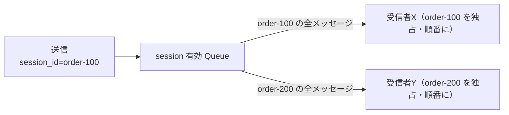
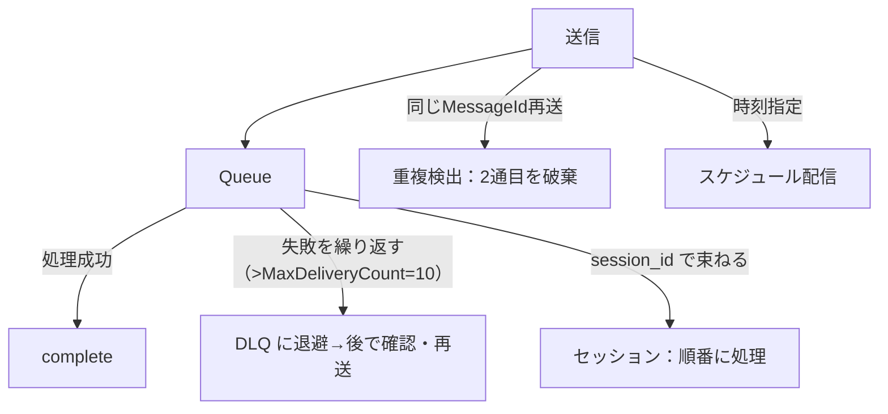

# Week 4 — Service Bus の信頼性を支える高度機能：DLQ・セッション・重複検出・スケジュール配信

> **Phase A**（Service Bus）| 学習プラン Week 4 / 17
> 学習目標：処理できないメッセージを DLQ で退避・確認・再処理でき、セッションで厳密 FIFO を実装でき、重複検出で「2回送っても1回」を実現でき、スケジュール配信／遅延（defer）を使い分けられる。「失わない・順序を守る・重複させない」を実装で体得する

---

## 0. 今週の位置づけ

Week 3 で「送る・受ける・PeekLock で失わない」までやった。Week 4 は Service Bus が**業務メッセージング基盤**たる所以——**信頼性を支える4つの機能**を実装で押さえる。

| 機能 | 解く課題 | Week 2 のどこと繋がるか |
|---|---|---|
| **DLQ（デッドレター）** | 何度試しても処理できないメッセージの退避 | §3 PeekLock の「失敗し続けたら？」 |
| **セッション** | 厳密な **FIFO（順序保証）** | §4-1 順序 |
| **重複検出** | 「2回送っても1回」（送信側起点） | §3 exactly-once・§4-2 重複 |
| **スケジュール配信／遅延** | 未来に届ける／今は処理を保留 | — |

> 前提 SKU：**DLQ は全 SKU**にあるが、**セッションと重複検出は Standard 以上**（Basic 不可）。Week 3 で作った Standard 名前空間をそのまま使う。

---

## 1. DLQ（デッドレターキュー）

### 1-1. DLQ とは

**Queue / Subscription ごとに自動で付いてくる「配達不能の退避先」**（副キュー＝sub-queue）。明示的に作る必要はなく、削除もできない。郵便の「あて先不明郵便」棚（Week 1 §3）。

```text
  Queue: orders
    ├─ 本体（通常メッセージ）
    └─ orders/$deadletterqueue   ← DLQ（自動付帯。ここに退避される）
```

### 1-2. なぜ DLQ に送られるのか（システム起因）

| 理由（dead-letter reason） | いつ |
|---|---|
| **MaxDeliveryCountExceeded** | 配信回数が上限を超えた（**既定10回**）。PeekLock で abandon／ロック切れのたびに配信回数が増える |
| **TTLExpiredException** | メッセージの有効期限（TTL）切れ |
| HeaderSizeExceeded | ヘッダのサイズ超過 |
| Session ID is null | セッション有効エンティティにセッションIDなしで送った |
| MaxTransferHopCountExceeded | 自動転送の連鎖が4を超えた（Week 5） |

> **重要**：MaxDeliveryCount（既定10）が PeekLock と直結する。Week 3 で見た「失敗→abandon→再配信」を**繰り返すと配信回数が増え、10回を超えたら自動で DLQ 行き**。これで「無限リトライでキューが詰まる」のを防ぐ。無効化はできないが、大きな値に設定はできる。

### 1-3. DLQ を覗いて再処理する（Python）

```python
from azure.servicebus import ServiceBusClient, ServiceBusSubQueue
from azure.identity import DefaultAzureCredential

with ServiceBusClient(FQDN, DefaultAzureCredential()) as client:
    # 本体ではなく DLQ を受信対象にする
    with client.get_queue_receiver(
        "orders", sub_queue=ServiceBusSubQueue.DEAD_LETTER
    ) as dlq:
        for msg in dlq.receive_messages(max_message_count=10, max_wait_time=5):
            print("DLQ:", str(msg))
            print("  理由:", msg.dead_letter_reason)
            print("  詳細:", msg.dead_letter_error_description)
            dlq.complete_message(msg)   # 確認したので DLQ から消す
```

> - DLQ は普通のキューと同じく PeekLock / receive / complete が使える。ただし **TTL は効かず、DLQ からさらに DLQ はできない**。
> - **自動掃除はされない**。取り出して complete するまで残り続ける。
> - **アプリから明示的に DLQ 送り**もできる：`receiver.dead_letter_message(msg, reason="...", error_description="...")`（不正なペイロード等を弾く）。
> - 再処理の実務は **Portal の Service Bus Explorer** が便利（DLQ を覗いて内容を直し、元キューへ一括再送できる）。

---

## 2. セッション：厳密な FIFO（順序保証）

### 2-1. なぜ「FIFO キュー」だけでは順序が守れないのか

Week 2 で「Queue は FIFO」と言ったが、**競合コンシューマー（複数ワーカー）がいると"処理順"は崩れる**。

```text
キューの取り出し順は 1→2→3 でも…
  ワーカーA: msg1 を取る（処理に時間がかかる）
  ワーカーB: msg2 を取る → 先に完了 → msg3 も取って完了
  ワーカーA: ようやく msg1 完了
    → 実際の処理完了順は 2, 3, 1（順序が崩れた）
```

> 公式の整理：**シーケンス番号は「取り出し順」を保証するが「処理順」は保証しない。処理順が要るならセッションを使う。**

### 2-2. セッションの仕組み

**関連するメッセージに同じ `session_id` を付ける**と、その session_id の一群は**1つの受信者が排他ロックして、順番に**処理する。



- 別々の session_id は**別の受信者が並行**処理できる（多重化を解きほぐす＝demultiplex）。**セッション内は順序、セッション間は並列**——Event Hubs の partition key（Week 2 §1-3）と同じ発想。

### 2-3. 実装（Python）

```bash
# セッション有効な Queue を作る（作成時のみ指定可）
az servicebus queue create -g $RG --namespace-name $SBNS -n orders-fifo --enable-session true
```

```python
# 送信：session_id を付ける
with client.get_queue_sender("orders-fifo") as sender:
    for step in ["作成", "支払", "出荷"]:
        sender.send_messages(ServiceBusMessage(f"注文#100 {step}", session_id="order-100"))

# 受信：session_id を指定してセッションを「受け入れる（accept）」
with client.get_queue_receiver("orders-fifo", session_id="order-100") as receiver:
    for msg in receiver.receive_messages(max_message_count=10, max_wait_time=5):
        print("順番に:", str(msg))     # 作成 → 支払 → 出荷 の順
        receiver.complete_message(msg)
    # セッション状態（中断・再開のための任意のメモ）も保存できる
    receiver.session.set_state(b"last_step=shipped")
```

> **初学者向け用語補足：セッション状態（session state）/ accept**
> - **セッションを accept する**：受信者が特定 session_id を**排他ロック**で掴むこと。以後その session_id のメッセージ（後から来る分も）はその受信者だけに配られる。ロックは close か期限切れで解放。
> - **セッション状態**：そのセッションに紐づけてブローカー側に置ける**任意のメモ（最大1メッセージ分）**。処理が別マシンに引き継がれても「どこまで進んだか」を復元できる。使い終わったら null で消す（ストレージ枠を食うため）。
> - 注意：セッション有効エンティティでは**通常メッセージは送受信できない**（必ず session_id 付きで送る／accept して受ける）。

---

## 3. 重複検出（duplicate detection）

### 3-1. 何を解くか

Week 2 §3 で「ネットワーク障害で ACK が返らない→再送→重複」を学んだ。**重複検出は送信側起点でこれを吸収**する：一定時間内に**同じ `MessageId`** で送られたら、2通目以降を**受理したフリをして即破棄**する。

```python
# 送信側：業務的に一意な MessageId を付ける（再送しても同じIDにする）
sender.send_messages(ServiceBusMessage("注文#100 支払", message_id="100/payment"))
sender.send_messages(ServiceBusMessage("注文#100 支払", message_id="100/payment"))  # ← 破棄される
```

```bash
# 重複検出は作成時に有効化（履歴ウィンドウも指定）
az servicebus queue create -g $RG --namespace-name $SBNS -n orders-dedup \
  --enable-duplicate-detection true --duplicate-detection-history-time-window PT10M
```

- **ウィンドウ既定は10分**（最小20秒〜最大7日）。この間だけ MessageId を記録・照合する。**判定は MessageId だけ**（本文は見ない）。
- **MessageId は業務文脈で決める**のがコツ（例：`発注番号/payment`）。失敗後に**同じIDを再構築できる**から重複排除が効く。GUID でもよいが、それだと再送時に別IDになりがちで効かない。
- ウィンドウを広げるほどスループットに響く（全IDと照合するため）。**必要最小限に**。

> **重複検出（送信側） vs 冪等性（受信側）は併用**：重複検出は「同じ MessageId の二重投入」を防ぐが、PeekLock の再配信（Week 3 §3）は受信側の話で別物。だから Week 2 §4-2 の**受信側の冪等性も依然として持つべき防御**。両輪で exactly-once に寄せる。

---

## 4. スケジュール配信とメッセージ遅延（defer）

「いつ処理するか」を制御する2つの機能。**似て非なる**ので区別する。

### 4-1. スケジュール配信：未来の時刻に「届ける」

送った瞬間ではなく、**指定時刻になってから受信可能**にする（リマインダー・予約処理）。

```python
from datetime import datetime, timedelta, timezone
when = datetime.now(timezone.utc) + timedelta(minutes=30)
seq = sender.schedule_messages(ServiceBusMessage("30分後に通知"), when)
# 取り消したくなったら
sender.cancel_scheduled_messages(seq)
```

### 4-2. メッセージ遅延（defer）：受信したが「今は保留」

受信したものの**今はまだ処理できない**（先行メッセージ待ちなど）とき、**脇に避ける**。後で**シーケンス番号を指定して**取り戻す。キューに戻す（abandon）のとは違い、順番を乱さず保留できる。

```python
for msg in receiver.receive_messages():
    if not ready_to_process(msg):
        receiver.defer_message(msg)        # 脇に避ける（消えない）
        deferred_seq.append(msg.sequence_number)
# あとで番号指定で取り戻す
for msg in receiver.receive_deferred_messages(sequence_numbers=deferred_seq):
    receiver.complete_message(msg)
```

> **区別**：**スケジュール配信＝送信側が「届く時刻」を指定**／**defer＝受信側が「一度受けたが保留」**。abandon（即再配信）とも違い、defer は**明示的に番号で取り戻すまで配られない**。

---

## 5. Week 4 全体の整理



| 用語 | 一言説明 |
|---|---|
| DLQ / dead_letter_message | 配達不能の退避先（自動付帯）/ 明示的に退避 |
| MaxDeliveryCount（既定10） | 配信失敗の上限。超えたら DLQ |
| セッション / session_id | 同一IDを束ねて厳密 FIFO・排他処理 |
| session state | セッションに紐づく再開用のメモ |
| 重複検出 / MessageId | 同一IDの再送を時間窓内で破棄（既定10分） |
| schedule_messages / defer_message | 未来に届ける / 受信後に保留 |

---

## ハンズオン チェックリスト

- [ ] PeekLock で abandon を10回超えて起こし、メッセージが DLQ に落ちることを確認した
- [ ] DLQ 受信（`sub_queue=DEAD_LETTER`）で reason / description を読み、complete した
- [ ] セッション有効 Queue に session_id 付きで送り、受信が**作成→支払→出荷の順**になることを確認した
- [ ] 重複検出有効 Queue に同じ MessageId を2回送り、2通目が**届かない**ことを確認した
- [ ] `schedule_messages` で未来配信、`defer_message`→`receive_deferred_messages` で保留・取り戻しを試した

---

## 自己チェック

1. **メッセージが DLQ に送られる代表的な理由を2つ、既定の閾値とともに言えるか？**
   - キーワード：MaxDeliveryCountExceeded（10）・TTLExpiredException
2. **「FIFO キュー」なのに処理順が崩れるのはなぜ？どう解決する？**
   - キーワード：競合コンシューマー・取り出し順 vs 処理順・session_id
3. **重複検出は何を見て重複と判断するか？冪等性（受信側）とどう併用するか？**
   - キーワード：MessageId・時間窓・送信側 vs 受信側
4. **スケジュール配信と defer の違いは？abandon とも何が違う？**
   - キーワード：届く時刻指定 / 受信後に保留 / 即再配信
5. **セッション状態は何のためにあるか？**
   - キーワード：中断・別マシンへの引き継ぎ・進捗の復元

---

## 次週の予告（Week 5）

Service Bus の残る高度トピックと「つなぐ」機能：

- **トランザクション**：複数の送受信を「全部成功か全部失敗か」でまとめる
- **自動転送（Auto-forward）**：あるエンティティから別エンティティへ自動で流す（連鎖と TDLQ）
- **大容量メッセージ**：Premium での 100MB メッセージ、クレーム・チェックパターン
- **AMQP / JMS**：プロトコルと他言語・既存資産との相互運用
