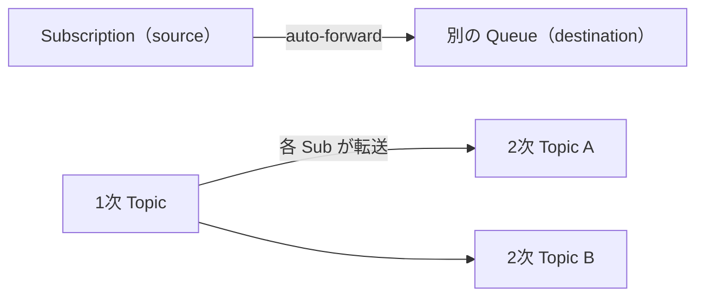
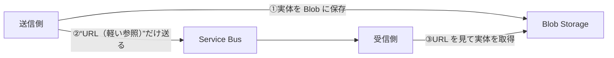
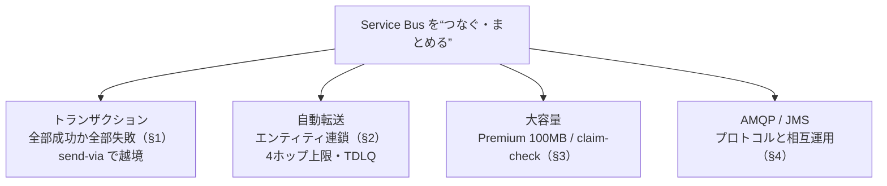

# Week 5 — Service Bus の「つなぐ・まとめる」機能：トランザクション・自動転送・大容量メッセージ・AMQP/JMS

> **Phase A**（Service Bus）| 学習プラン Week 5 / 17
> 学習目標：複数の送受信を「全部成功か全部失敗か」でまとめるトランザクション（と send-via による越境）を説明でき、自動転送でエンティティを連鎖させる使いどころと落とし穴（4ホップ・TDLQ）を理解し、大容量メッセージ（Premium 100MB）とクレームチェックの使い分け、AMQP/JMS というプロトコル/相互運用の位置づけを掴む

---

## 0. 今週の位置づけ

Part A（Service Bus）の締め。Week 3-4 が「1つのキューでの確実な送受信」だったのに対し、Week 5 は **複数の操作・複数のエンティティ・大きなデータ・他システム**といった「**つなぐ・まとめる**」テーマを扱う。手を動かすより**概念と判断軸**が中心。

1. **まとめる**：トランザクション（atomicity）と send-via（§1）
2. **つなぐ**：自動転送（auto-forward）と TDLQ（§2）
3. **大きく運ぶ**：大容量メッセージ（Premium）とクレームチェック（§3）
4. **相互運用**：AMQP / JMS とプロトコルの位置づけ（§4）

> SKU 前提：**トランザクションは Standard 以上**、**自動転送は Standard 以上**（Basic 不可）、**大容量メッセージ（100MB）は Premium のみ**。

---

## 1. トランザクション：全部成功か、全部失敗か

### 1-1. atomicity（不可分性）とは

**複数の操作を1つの実行スコープ（execution scope）にまとめ、「全部成功」か「全部失敗」のどちらかにする**こと。これを **atomicity（原子性・不可分性）**という。途中まで成功して残りが失敗、という中途半端な状態を作らない。

> 例：「キューAのメッセージを **complete（処理済み）** にする」と「キューBへ **send** する」を1トランザクションに入れる → **両方成功か、両方なかったことに**。complete だけ成功して send が失敗、という不整合を防ぐ。

### 1-2. トランザクションに入れられる操作

| 入れられる | 入れられない |
|---|---|
| **Send / Complete / Abandon / Deadletter / Defer / RenewLock** | **Receive（受信そのもの）** |

> なぜ Receive は入らないか：受信は **PeekLock で先に取っておき**（Week 3 §3）、その**処理（disposition＝complete/abandon/dead-letter/defer）をトランザクションで括る**前提だから。つまり「受信ループの中で、処理の確定だけをトランザクション化」する。

### 1-3. send-via：エンティティを越えて atomic にする

素のトランザクションは**1エンティティ内**が基本。**「キューAから受けて、キューBへ送る」を越境して atomic にしたい**ときは **send-via（transfers）**を使う。

```text
  受信元 queueA ──(受信・PeekLock)──→ 処理 ──┐
                                            │ 1つの atomic な操作
  destination queueB ←──(send via 転送)─────┘
    ・queueA の complete と queueB への send が「全部成功か全部失敗か」
    ・転送キューには見える形で残らず、宛先へ運ばれる
```

- .NET では `ServiceBusClientOptions { EnableCrossEntityTransactions = true }` のように**越境トランザクション**を有効化し、`TransactionScope` で `complete` と `send` を括る（言語ごとに API は異なる。Python SDK もトランザクション対応／**JavaScript SDK は非対応**）。
- **トランザクションのタイムアウトは2分**（最初の操作開始から）。
- **重要な限界**：トランザクションに入るのは **Service Bus の操作だけ**。処理中に呼ぶ **DB や Cosmos DB は同じスコープに入らない**（Service Bus が巻き戻しても DB は巻き戻らない）。だからここでも **Week 2 §4-2 の冪等性**が要る。

> **ポイント**：Service Bus は内部の転送（DLQ 移送・自動転送）も**すべてトランザクショナル**で、「source 成功・target 失敗による喪失」や「source 失敗・target 成功による重複」を起こさない。だから受理されたメッセージは必ずどこかに整合して存在する。

---

## 2. 自動転送（auto-forwarding）：エンティティを連鎖させる

### 2-1. 何をするか

**あるキュー/サブスクリプション（source）に入ったメッセージを、自動で別のキュー/トピック（destination）へ移す**。同一名前空間内で「配線」できる。



### 2-2. 使いどころ

- **トピックのスケールアウト**：1トピックのサブスクリプションは**最大2,000**。2階層トピック（1次→2次）で上限を超えて拡張＆スループット向上。
- **送信者と受信者の分離**：各担当者が「自分用キュー＋各トピックへの転送サブスクリプション」を作る。誰かが休暇でも、**詰まるのは本人の個人キューだけ**で、共有トピックは溢れない。

### 2-3. 落とし穴

| 注意点 | 内容 |
|---|---|
| **4ホップ上限** | 転送の連鎖が**4を超えたメッセージは DLQ 行き**。ホップ数は転送のたび（send-via 含む）に増える |
| **宛先は先に必要** | destination が存在しないと source を作れない |
| **宛先が満杯/無効** | source の **DLQ** に退避され続ける（明示的に処理が必要） |
| **セッション非対応** | session 有効エンティティでは自動転送は使えない |
| **課金** | 転送1件ごとに1操作課金（20サブスクリプションが各転送なら21操作） |
| 受信不可 | 自動転送を有効にした source からは**受信できない**（自動で抜かれるため） |

> **初学者向け用語補足：TDLQ（転送デッドレターキュー）**
> 通常の DLQ（Week 4 §1）はそのエンティティで処理しきれなかったメッセージの退避先。**TDLQ（Transfer Dead-Letter Queue）**は**転送（auto-forward / send-via）に失敗したとき**、**転送元（source）側**にできる退避先。「宛先が無効・満杯・サイズ超過」で送れないメッセージがここに溜まる。Python では `sub_queue=ServiceBusSubQueue.TRANSFER_DEAD_LETTER` で受信できる。

---

## 3. 大容量メッセージとクレームチェック

### 3-1. メッセージサイズの上限

| ティア | 最大メッセージサイズ |
|---|---|
| Basic / Standard | **256 KB** |
| **Premium** | **最大 100 MB**（大容量メッセージ機能） |

Premium の100MBは **AMQP プロトコル限定**（HTTP は 1MB まで）、**バッチ非対応**、送るほど**スループット低下・レイテンシ増**。主にレガシー移行向けで、「**できるが、ペイロードはできるだけ小さく**」が公式の助言。

### 3-2. クレームチェック（claim-check）パターン

「Standard のまま大きなデータを運びたい」「Premium でも巨大ペイロードは避けたい」ときの定石。



> **初学者向け用語補足：クレームチェック（claim-check）**
> 空港の「手荷物預かり証」が由来。**大きな実体は Blob 等に預け、メッセージには"預かり証＝参照(URL/ID)"だけ**を載せる。メッセージは軽いままで、受信側は必要なときに実体を取りに行く。Storage 教材 §1 の「DB には URL、実体は Blob」と**まったく同じ役割分担**。メッセージング基盤に巨大データを流さずに済むので、コスト・スループット・上限の観点で有利。Event Hubs / Event Grid でも通用する汎用パターン。

---

## 4. AMQP と JMS：プロトコルと相互運用

### 4-1. AMQP（既定の通信プロトコル）

Service Bus SDK が裏で使う標準プロトコルが **AMQP 1.0**（Advanced Message Queuing Protocol）。永続的な双方向接続で、高スループット・低レイテンシ。Week 2 の比較表でも Service Bus のプロトコルは「AMQP, HTTP」だった。

> **注意（移行）**：旧 **SBMP プロトコルは 2026年9月30日に廃止**予定。最新 SDK（AMQP ベース）への移行が必要。本講座の `azure-servicebus` は AMQP ベースなので問題ない。

### 4-2. JMS（Java の標準メッセージング API）

**JMS（Java Message Service）**は Java 界の標準メッセージング API。**既存の JMS アプリ（ActiveMQ 等で動いていた資産）を、Service Bus に載せ替えられる**。

| ティア | JMS サポート |
|---|---|
| Standard | JMS 1.1 のサブセット（キュー中心） |
| **Premium** | **JMS 1.1 / 2.0**（フル） |

> **位置づけ**：Event Hubs の「Kafka 互換」（Week 2 §1-3）と発想は同じ——**既存のメッセージング資産を、コード資産を活かしたまま Azure のマネージドへ移す**ための相互運用。Service Bus では Java 資産に対して JMS がその役割を担う。

---

## 5. Week 5 全体の整理



| 用語 | 一言説明 |
|---|---|
| トランザクション / atomicity | 複数操作を全部成功か全部失敗でまとめる |
| send-via（transfers） | エンティティを越えて complete と send を atomic に |
| 自動転送（auto-forward） | source→destination へ自動で流す。4ホップ上限 |
| TDLQ | 転送に失敗したメッセージの退避先（転送元側） |
| 大容量メッセージ | Premium で最大100MB（AMQP・バッチ不可） |
| クレームチェック | 実体は Blob、メッセージは参照だけ |
| AMQP / JMS | 既定プロトコル / Java 資産の相互運用 |

---

## ハンズオン チェックリスト

- [ ] トランザクションに入れられる操作（Send/Complete/Abandon/…）と、Receive が入らない理由を説明できた
- [ ] 「complete と send を1つに括る」と何が嬉しいか（不整合の回避）を言えた
- [ ] 自動転送を1段だけ設定し、source に送ると destination に現れることを確認した（4ホップ・TDLQ の挙動も理解）
- [ ] クレームチェックの流れ（実体は Blob、参照だけ送る）を図で描けた
- [ ] AMQP と JMS の位置づけ（既定プロトコル／Java 相互運用）を一言で言えた

---

## 自己チェック

1. **トランザクションの atomicity とは？Receive がスコープに入らないのはなぜ？**
   - キーワード：全部成功か全部失敗・PeekLock 前提・disposition を括る
2. **send-via は何を解決するか？DB はトランザクションに入るか？**
   - キーワード：越境 atomic・downstream は非参加・冪等性が要る
3. **自動転送の代表ユースケースと、4ホップ超で起きることは？**
   - キーワード：トピックのスケールアウト・送受信分離・DLQ 行き
4. **256KB を超えるデータを運ぶ2つの方法と使い分けは？**
   - キーワード：Premium 100MB / クレームチェック（Blob＋参照）
5. **Kafka 互換（Event Hubs）に相当する Service Bus の相互運用機能は？**
   - キーワード：JMS・Java 資産の移行

---

## 次週の予告（Week 6）— Part A 最終週

Service Bus の運用面（セキュリティ・監視・スケーリング）で Part A を締める：

- **セキュリティ**：Entra ID / RBAC（Data Owner / Sender / Receiver）と SAS、最小権限
- **監視**：メトリクス（incoming/outgoing・DLQ 件数・スロットリング）と診断ログ
- **スケーリング**：Premium の messaging unit・自動スケール、Geo-Replication（災害復旧）
- ここまでで Service Bus を「作って・使って・運用する」一通りが完成し、Part B（Event Hubs）へ
