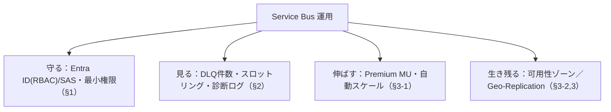

# Week 6 — Service Bus を運用する：セキュリティ・監視・スケーリング（Part A 最終週）

> **Phase A**（Service Bus）| 学習プラン Week 6 / 17
> 学習目標：Entra ID（RBAC）と SAS の違いと使い分け・最小権限を説明でき、監視すべきメトリクス（特に DLQ 件数・スロットリング）と診断ログ／アラートを設定でき、Premium の messaging unit による（自動）スケールと、Geo-Replication / Geo-DR の違い（データ＋メタデータ vs メタデータのみ）を理解する

---

## 0. 今週の位置づけ

Part A の締め。Week 3-5 で「作って・確実に使って・つないでまとめる」をやった。Week 6 は**本番運用の3本柱**——「**守る（セキュリティ）・見る（監視）・伸ばす/生き残る（スケール/DR）**」で Service Bus を一通り完成させる。

1. **守る**：認証・認可（Entra ID / SAS）と最小権限（§1）
2. **見る**：メトリクス・診断ログ・アラート（§2）
3. **伸ばす/生き残る**：Premium スケールと Geo-Replication（§3）

---

## 1. セキュリティ：認証・認可

### 1-1. 2つの方式：Entra ID（推奨）と SAS

| | Microsoft Entra ID（推奨） | SAS（Shared Access Signature） |
|---|---|---|
| 何で認証するか | **ID（OAuth 2.0 トークン）** | **共有鍵で署名したトークン** |
| 鍵の管理 | 不要（コードに鍵を持たない） | 鍵の保管・ローテーションが必要 |
| 権限の単位 | RBAC ロール | ポリシーの Rights（Listen/Send/Manage） |
| 推奨度 | **可能な限りこちら** | レガシー・特定用途 |

Week 3 で使った passwordless はこの Entra ID 方式。**鍵をコードや設定に置かない**ぶん事故（鍵漏洩）に強い。

### 1-2. Entra ID：RBAC ロール（最小権限）

```text
  Azure Service Bus Data Owner    … 送受信＋管理（フルアクセス）
  Azure Service Bus Data Sender   … 送信のみ
  Azure Service Bus Data Receiver … 受信のみ
```

> **最小権限の原則（least privilege）**：アプリには必要な最小のロールだけを与える。送信専用サービスには **Sender** だけ、受信専用ワーカーには **Receiver** だけ。Week 3 では学習のため Data Owner を自分に付けたが、本番では役割ごとに絞る。スコープも名前空間全体ではなく**特定キュー/トピックに限定**できる。

```bash
# 例：送信専用アプリのマネージドIDに、特定キューだけ Sender を付与
az role assignment create \
  --assignee <app-managed-identity-objectId> \
  --role "Azure Service Bus Data Sender" \
  --scope "<queueのリソースID>"
```

### 1-3. SAS：共有鍵ベース

名前空間/キュー/トピックに**共有アクセスポリシー**を作る。要素は `KeyName` / `PrimaryKey` / `SecondaryKey` / `Rights`（Listen / Send / Manage）。1エンティティに**最大12ルール**。Primary/Secondary の2鍵があるのは**無停止ローテーション**のため（片方を使いながらもう片方を更新）。

> **重要な概念の区別：認証（authentication）と認可（authorization）**
> - **認証**：あなたが誰かを確かめる（Entra ID のトークン／SAS の署名検証）
> - **認可**：その人が何をできるかを決める（RBAC ロール／SAS の Rights）
> 「Listen/Send/Manage」や「Sender/Receiver/Owner」は**認可**の話。

> **さらに固める**：名前空間で **ローカル認証（SAS）を無効化**して **Entra ID のみ**に強制できる（`disable local authentication`）。本番では推奨。ネットワーク面（IP フィルタ・サービスエンドポイント・**プライベートエンドポイント**）は Premium で利用可（Week 5 §3 の Premium 機能）。

---

## 2. 監視：メトリクス・診断ログ・アラート

「動いているか・詰まっていないか・異常がないか」を見る。

### 2-1. 主要メトリクス

| メトリクス | 見る意味 |
|---|---|
| **Incoming / Outgoing Messages** | 送受信の流量（Week 3 で Portal Overview で見たもの） |
| **Active Messages（アクティブ件数）** | 未処理で溜まっている数。増え続け＝消費が追いつかない |
| **Dead-lettered Messages（DLQ 件数）** | **最重要級**。増加＝処理失敗が多発（Week 4 §1） |
| **Throttled Requests（スロットリング）** | 容量超過でリクエストが絞られている＝スケール検討の合図 |
| **Size** | エンティティの使用量 |
| **CPU / Memory 使用率**（Premium） | スケール判断の根拠（§3） |

> **ポイント**：とりわけ **DLQ 件数**と**スロットリング**は放置すると業務影響に直結する。この2つは必ずアラート対象にする。

### 2-2. 診断ログとアラート

- **診断設定**で、メトリクス／運用ログを **Log Analytics** に送り、KQL で長期分析・可視化できる。
- **アラート**：「DLQ 件数 > 0」「スロットリングが発生」「Active が閾値超え」などで通知（メール/Webhook/Logic Apps）。

```bash
# 例：DLQ にメッセージが溜まったら通知するメトリックアラート（概念例）
az monitor metrics alert create \
  -n "sb-dlq-alert" -g $RG \
  --scopes "<名前空間のリソースID>" \
  --condition "total DeadletteredMessages > 0" \
  --description "DLQ にメッセージが発生"
```

> Week 4 で「DLQ は自動掃除されない」と学んだ。だから **DLQ 件数の監視＝処理失敗の早期検知**であり、運用の要。

---

## 3. スケーリングと災害復旧（DR）

### 3-1. Premium のスケール：messaging unit

Premium は **messaging unit（MU）**という専有リソース単位で性能が決まる（CPU/メモリを分離＝他テナントの影響を受けない）。**1, 2, 4, 8, 16 MU** から選び、**動的に増減**できる。

```text
  CPU 使用率 < 20% → MU を減らせる（コスト削減）
  CPU 使用率 > 70% → MU を増やすと改善
```

- **自動スケール**：CPU 使用率に応じて MU を自動増減する設定が可能（公式「Automatically update messaging units」）。
- **先回り（preemptive）/ 反応（reactive）**：季節要因が読めるなら事前に増やす、メトリクスを見て後から増やす、の両方ができる。
- Standard は従量・可変スループット（MU の概念なし）。**予測可能な性能・大容量・低レイテンシが要るなら Premium**。

### 3-2. 高可用性：可用性ゾーン

Service Bus は1つのデータセンター内の**複数の障害ドメイン**にクラスタを分散し（all-active モデル）、さらに**3つの物理的に分離した施設＝可用性ゾーン**にリスクを分散する。これは**1リージョン内**での耐障害性。リージョン全体の障害には §3-3 の DR で備える。

### 3-3. 災害復旧：Geo-Replication と Geo-DR

リージョン規模の障害に備える2機能。**違いは「何を複製するか」**。

| | **Geo-Replication**（推奨） | Geo-DR（旧・Geo-Disaster Recovery） |
|---|---|---|
| 複製するもの | **メタデータ＋データ（メッセージ本体・状態）** | **メタデータのみ**（エンティティ構成。メッセージは複製されない） |
| ティア | Premium | Standard/Premium |
| 復旧後 | メッセージも引き継げる | 構成は復活するが**メッセージは引き継げない** |
| 多くの DR で | **こちらが推奨** | レガシー |

> Week 1 で学んだ Storage の「耐久性＝消えない」を**リージョン規模**に広げたのが DR。Storage 教材の冗長性（LRS/ZRS/GRS）と同じ発想：§3-2 がゾーン冗長、§3-3 がリージョン冗長。

#### Geo-Replication の同期 / 非同期

| | 同期（synchronous） | 非同期（asynchronous） |
|---|---|---|
| コミット | **両リージョンに書いてから** ACK | 主リージョンに書いて ACK（複製は後追い） |
| レイテンシ | 長い（分散コミット） | ほぼ影響なし |
| データ保証 | **RPO 0（ロスなし）** | ラグ分のロスがありうる（強制昇格時） |
| 可用性 | 両リージョンに依存 | 副リージョン障害の影響を受けにくい |

> **初学者向け用語補足：RPO / 昇格（promotion）**
> - **RPO（Recovery Point Objective）**：障害時に「どこまでのデータを失ってよいか」の目標。**RPO 0 ＝ 1件も失わない**（同期複製）。
> - **昇格（promotion）**：副リージョンを主に切り替えること。**必ず顧客が手動で開始**（Azure は勝手にやらない）。**計画昇格**＝ラグを追いついてから切替（ロスなし）、**強制昇格**＝即時切替（未複製分のロス・重複の可能性）。
> - 接続先は**単一ホスト名**のまま（常に現主リージョンを指す）。クライアントコードの変更は不要。CLI は `az servicebus namespace failover`。

---

## 4. Week 6 / Part A 全体の整理



| 用語 | 一言説明 |
|---|---|
| Entra ID / RBAC ロール | ID 認証＋Data Owner/Sender/Receiver。鍵不要・推奨 |
| SAS / Rights(Listen/Send/Manage) | 共有鍵ベース。Primary/Secondary で無停止ローテーション |
| 最小権限 | 必要最小のロール・スコープだけ与える |
| DLQ 件数 / スロットリング | 最重要の監視メトリクス |
| messaging unit（1〜16） | Premium のスケール単位。自動スケール可 |
| 可用性ゾーン / Geo-Replication | ゾーン冗長 / リージョン冗長（データ＋メタデータ・RPO 0 可） |

---

## ハンズオン チェックリスト

- [ ] 送信専用・受信専用の用途を想定し、Sender / Receiver ロールを特定スコープに割り当てた
- [ ] Entra ID と SAS の違い、最小権限の考え方を説明できた
- [ ] Portal の Metrics で Incoming/Outgoing・Active・DLQ 件数・Throttled を確認した
- [ ] DLQ 件数 > 0 のメトリックアラートを作成した
- [ ] Premium の messaging unit と自動スケール、Geo-Replication（データ＋メタデータ）と Geo-DR（メタデータのみ）の違いを言えた

---

## 自己チェック

1. **Entra ID と SAS の違い、なぜ Entra ID 推奨か？最小権限とは？**
   - キーワード：トークン vs 共有鍵・鍵漏洩・Sender/Receiver に絞る
2. **認証と認可の違いは？Listen/Send/Manage はどちら？**
   - キーワード：誰か vs 何ができるか・認可
3. **最優先で監視すべきメトリクスを2つ、その理由とともに挙げよ**
   - キーワード：DLQ 件数（処理失敗）・スロットリング（容量超過）
4. **Premium の messaging unit と自動スケールの判断軸は？**
   - キーワード：MU・CPU<20%で減・>70%で増
5. **Geo-Replication と Geo-DR の決定的な違いは？RPO 0 とは？**
   - キーワード：データも複製 vs メタデータのみ・同期で1件も失わない

---

## 次週の予告（Week 7）— Part B 開始：Event Hubs

ここから **Part B：Event Hubs**（ストリーミング）。Service Bus（メッセージ）との違いを実感していく：

- **パーティション**と**コンシューマーグループ**（Week 2 §1-3 の復習＋深掘り）
- **オフセット / チェックポイント**：どこまで読んだかを自分で管理する（取っても消えない世界）
- **スループットユニット（TU）/ プロセッシングユニット（PU）**：Event Hubs のスケール単位
- 「確実に1件ずつ処理」の Service Bus と「大量を流して後で読む」Event Hubs の発想の違い
