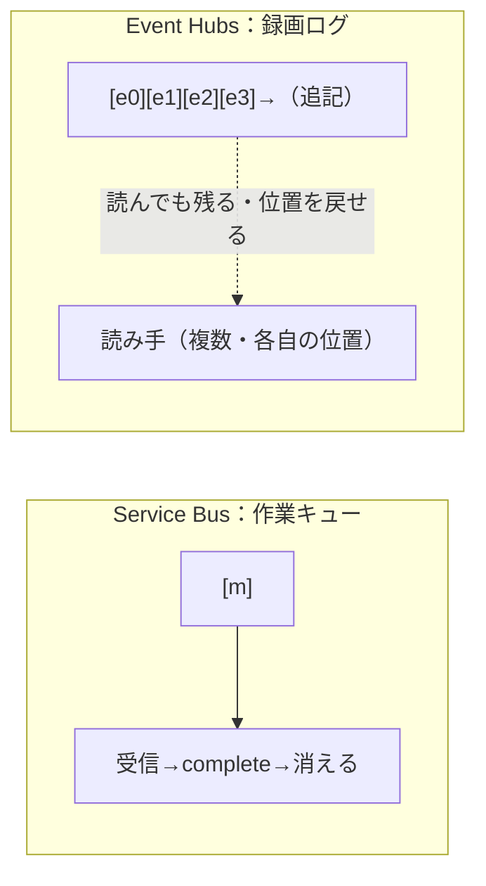
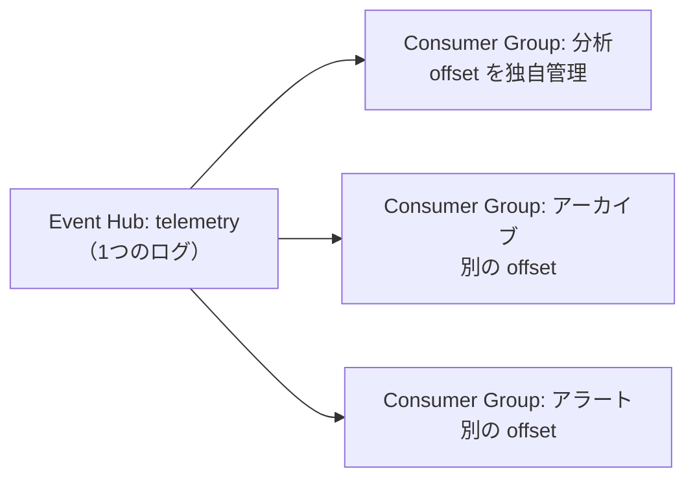
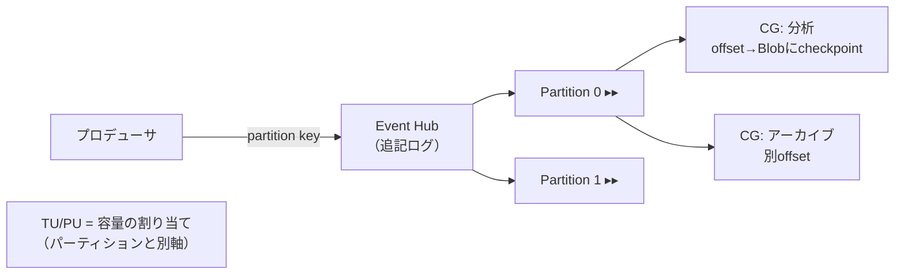

# Week 7 — Event Hubs のストリーミングの仕組み：パーティション・コンシューマーグループ・オフセット・スループットユニット

> **Phase B**（Event Hubs）| 学習プラン Week 7 / 17
> 学習目標：Service Bus（メッセージ）と Event Hubs（ストリーム）の発想の違いを説明でき、パーティション／コンシューマーグループ／オフセット・チェックポイントの役割を理解し、スループットユニット（TU）など Event Hubs のスケール単位とパーティションの関係を掴む

---

## 0. 今週の位置づけ

ここから **Part B：Event Hubs**（全4週）。担当は「**大量のテレメトリを取り込み・分析する＝ストリーム**」（Week 1）。Part A（Service Bus）からは**発想が大きく切り替わる**ので、まずそこを腹落ちさせる。

1. **発想の転換**：取ったら消える（SB）vs 読んでも残る（EH）（§1）
2. **パーティション**：並列ログ＝スループットと並列消費の鍵（§2）
3. **コンシューマーグループとリーダー**：同じログを独立に読む（§3）
4. **オフセット / チェックポイント**：どこまで読んだかを自分で管理（§4）
5. **スループットユニット**：Event Hubs のスケール単位（§5）
6. **作って触る**：名前空間・イベントハブを作り、Data Explorer で送受信（§6）

> Week 2 §1-3 で対応表として俯瞰した内容を、ここで**主役として深掘り**する。partition key の設計（Week 2 §1-3 の「順序の単位 vs スループット」）は前提知識として効いてくる。

---

## 1. 発想の転換：Service Bus と Event Hubs は「消える/残る」が逆

| | Service Bus（メッセージ） | Event Hubs（ストリーム） |
|---|---|---|
| データの扱い | 受信→処理→**完了で消える** | **追記専用ログ**に積まれ、読んでも**消えない** |
| 進捗の管理 | **サービス**が管理（ロック・完了） | **消費側**が offset で自己管理 |
| 1件の重み | 業務データ。1件ずつ確実に | 大量の1件。束ねて分析 |
| 同じデータを複数用途で | Topic で**コピーを配る** | **1つのログ**を各自の位置で読む |
| 典型スループット | 確実な非同期配信 | **毎秒数百万件** |
| 読み出し後の取り消し | complete/abandon で制御 | 概念なし（位置を戻せば再読込＝リプレイ） |

> **核心**：Service Bus は「**作業キュー**（やったら消える ToDo リスト）」、Event Hubs は「**録画テープ/ログ**（流れ続け、巻き戻して何度でも見られる）」。この違いがパーティション・オフセットの設計すべてに効く。



---

## 2. パーティション：並列ログ

**Event Hub（＝Kafka の topic 相当・追記専用ログ）を並列化したものがパーティション**（Week 2 §1-3）。なぜ要るか、改めて2つの理由：

1. **スループットの天井を上げる**：1本のログは「順序を保つため内部ストレージに固めて書く」必要があり、**1本あたりのスループットに上限**がある（標準で目安 ~1MB/s 入・~2MB/s 出）。**並列ログ（複数パーティション）にすれば、その分だけ入出力容量が倍々になる**。
2. **並列処理の口を作る**：**パーティション数 ＝ 1コンシューマーグループあたりの並列コンシューマー数の上限**。処理側を増やしてさばくための「担当の割り当て口」。

### 図：パーティション構造

```text
                                   Event Hub: telemetry
  producer ─(partition key で   ┌──────────────────────────────────┐
             どの P に入れるか  │ P0: [e0][e1][e2][e3][e4] →追記    │──┐
             を決める)────────▶ │ P1: [e0][e1][e2]        →追記     │──┼─▶ 分析グループ（独立した offset で読む）
                                │ P2: [e0][e1][e2][e3]    →追記     │──┘   アーカイブ（別の offset で読む）
                                └──────────────────────────────────┘
   ・パーティション＝並列の「追記専用ログ」。イベントは末尾に積まれ、取っても消えない（保持期間まで）
   ・同じログを、コンシューマーグループごとに独立した offset で読む（用途を分けられる／巻き戻せる）
   ・partition key が同じイベントは同じ P に・到着順のまま入る（§後述・Week 2 §1-3）
```

> **初学者向け用語補足：パーティションのデータは「どういう単位」でできているか**
> パーティションは「バイト」や「ファイル」や「時間」で区切られているのではなく、**イベント（event）という1件1件が最小単位**。1イベント＝ログの1エントリ（Service Bus の「メッセージ1通」に当たるもの）。それを到着順に積み上げた追記ログがパーティション。
>
> ```text
> Partition 0:  [event][event][event][event]→（末尾に追記され続ける）
>                  ↑1件    各「1件」が最小単位
> ```
> - **イベント1件の中身**：**本文（body＝送ったデータ）**＋**プロパティ（任意の付加情報）**＋**システム情報（offset・sequence number・受理時刻）**。あなたが送るのは body（＋任意プロパティ）だけで、システム情報は Event Hubs が自動で付ける。
> - **「どういう単位で決まるか」を層で分ける**：
>
> | 何の単位か | 決め方 |
> |---|---|
> | データの最小単位 | **イベント1件** |
> | どのパーティションに入るか | **partition key**（送信側指定／無指定はラウンドロビン） |
> | パーティション内の位置 | **sequence number**（1,2,3…の通し番号）と **offset**（番地）。EH が自動採番 |
> | 消える単位 | **時間（保持期間）**。1件ずつは消せず、古い順に失効（§1） |
>
> - **sequence number と offset の違い**：sequence number＝そのパーティション内で 1,2,3… と増える**通し番号（何件目か）**。offset＝そのイベントの**"番地"（アドレス）**で、チェックポイント（§4）が「ここまで読んだ」を指すのに使う。「3件目(seq=3)が番地410(offset=410)にある」のように同じ位置を別の呼び方で指す。
> - **パーティションの"本数"は別軸**：「何本あるか」はイベントの単位とは無関係で、**作成時に決める固定値**（下記）。

> **重要：パーティション数は基本あとから変えられない**（Standard は作成時に固定。Premium/Dedicated は増やせるが減らせない）。増やすと partition key → パーティションの対応が変わり**順序が乱れる**ので、順序が重要なら避ける。だから**最初にピーク負荷を見積もって決める**。
>
> 目安：期待する入・出のスループットを「1パーティションあたりの目安（標準 ~1MB/s 入・~2MB/s 出）」で割り、大きい方を採る。

> **初学者向け用語補足：パーティション数と料金は別物**
> パーティションを増やしても**料金は変わらない**（料金は §5 の TU/PU/CU で決まる）。例：32パーティションでも1パーティションでも、1 TU なら同じ料金。ただし**スループットの総量は TU/PU 側の割り当てで頭打ち**になるので、「パーティションを増やす＝速くなる」ではなく「**スケール単位（TU/PU）とパーティションのバランス**」で決まる。

partition key で「順序を守りたい単位」を同じパーティションに寄せる話は Week 2 §1-3 の通り（キー未指定ならラウンドロビン分散）。

---

## 3. コンシューマーグループとリーダー

### 3-1. コンシューマーグループ＝ストリームの独立ビュー

同じ Event Hub を、**用途ごとに独立した「読みの視点」**で読む仕組み。各グループは**自分の offset を別々に**持つ。



- 既定で `$Default` グループが1つある。**アプリ（用途）ごとに別グループを作る**のが定石（分析・アーカイブ・アラート…）。
- これが「同じデータを複数用途で独立に・巻き戻し可能に読める」（§1）の正体。Service Bus の Topic が**コピーを配る**のと違い、Event Hubs は**1つのログを皆が各自の位置で読む**。

### 3-2. 1パーティション＝1リーダー（同一グループ内）

同じコンシューマーグループ内では、**1つのパーティションを担当するアクティブな読み手は基本1つ**（推奨パターン＝排他的な epoch consumer）。だから**並列度の上限がパーティション数**になる。

```text
Consumer Group「分析」（パーティション3つ）
  Partition 0 ── 処理インスタンスA
  Partition 1 ── 処理インスタンスB
  Partition 2 ── 処理インスタンスC
    インスタンスを4つに増やしても、4つ目は担当なしで待機（パーティション数が上限）
```

> **初学者向け用語補足：epoch（排他）コンシューマー**
> Python/JS の `EventHubConsumerClient`、.NET/Java の `EventProcessorClient` が使う推奨方式。**1パーティションを1インスタンスが排他所有**し、インスタンス間で自動的に担当を分担（負荷分散）する。処理インスタンスを増やすと、パーティションが自動で割り振られてスケールアウトする（実装は Week 8）。

---

## 4. オフセット / チェックポイント

### 4-1. オフセット＝読み取り位置（カーソル）

パーティション内の「**自分はここまで読んだ**」という位置。読み手はオフセットで「どこから読むか」を指定できる（特定位置・タイムスタンプ・先頭・末尾）。

### 4-2. チェックポイント＝その位置を保存する

**読んだ位置（offset）を外部に保存しておく**こと。これにより：

- **再開（resume）**：落ちても続きから読める
- **引き継ぎ（failover）**：別インスタンスが続きを担当できる
- **リプレイ（replay）**：過去の offset を指定して読み直せる

```text
Partition 0: [e0][e1][e2][e3][e4][e5][e6]→
                        ↑ checkpoint=2
   ここまで処理済みと記録。次は e3 から。落ちても e3 から再開できる。
```

> **重要：チェックポイントの保存は「消費側の責任」**。Event Hubs サービスは offset を提供するだけで、**どこまで処理したかの記録は消費側が持つ**（通常 **Blob Storage** に保存）。これは Service Bus（サービスが complete で進捗管理）との決定的な違い。だから Event Hubs のコンシューマーは「チェックポイントストア（Blob）」とセットで動く（Week 8 で実装）。

> **初学者向け用語補足：なぜ「消費側が記録」なのか**
> 取っても消えないログ（§1）だからこそ、「誰がどこまで読んだか」は**読み手ごとに違う**（分析グループは e5 まで、アーカイブは e2 まで…）。サービス側で1つに決められないので、**各コンシューマーグループ／各読み手が自分の位置を持つ**。チェックポイントが粗い（たまにしか保存しない）と、再開時に**処理済みを読み直す＝重複**が起きるので、ここでも**冪等性**（Week 2 §4-2）が効く。

> **重要な概念の区別：「EH が offset を持つ」≠「EH が読み手の現在位置を覚えている」**
> よくある誤解：「EH が offset（次に読む位置）を覚えてくれるなら、checkpoint は要らないのでは？」——**EH が持つ offset は『番地（座標系）』であって、読み手の現在位置ではない**。
> - **offset ＝ 各イベントの"番地"**：ログの1件1件に固定の番地が振られている（e0=100, e1=230, e2=410…）。EH が「offset を提供する」＝「このイベントは**番地 410** にある」と位置を教えるだけ。EH は「分析グループは 410 まで読んだ」という**進捗は一切覚えていない**。
> - **本のたとえ**：offset ＝ 本に印刷された**ページ番号**（本＝EH は全ページに番号を振るが、あなたが今何ページかは知らない）。checkpoint ＝ あなたが挟む**しおり**（「120ページまで読んだ」と読み手が自分で挟み、自分で保管する）。
> - **なぜ EH が位置を覚えられない（覚えない）か**：①読み手が複数いて位置がバラバラ（誰の位置を持てばいい？＝持てない）②いつでも巻き戻して読み直せる（次の位置は EH が一意に決められない）。Service Bus は「取ったら消える・1人が処理」だから「完了したか」の唯一の答えをサービスが持てたが、EH は消さず皆で読むので進捗は本質的に**読み手側の状態**。
>
> ```text
>   ログ: [e0][e1][e2][e3][e4][e5][e6][e7]→   ← EHは「番地」だけ提供
>                   ↑archive    ↑analytics  ↑alert   各グループの"しおり"は各自がStorageに
>
>   再開フロー：
>   ① 起動時、消費側が Storage から checkpoint を読む（「410まで処理済み」）
>   ② 消費側→EH「番地410の続きをくれ」     ③ EHは410以降を返す（"あなたの位置"として覚えていたのではない）
>   ④ 処理が進んだら、消費側が新しい番地を Storage に書き戻す（checkpoint更新）
> ```
> checkpoint が無ければ EH は「続きから」を出せないので、起動時に**先頭/末尾/指定時刻**のどれかを消費側が選ぶしかない（「続きから」は EH が覚えていないので選べない）。だから**しおり（checkpoint）は消費側が持つ必要がある**。

---

## 5. スループットユニット（TU）と Premium の PU

Event Hubs のスケール（容量）は**パーティション数ではなく、スケール単位**で決まる。

| ティア | スケール単位 | 中身 |
|---|---|---|
| Standard | **スループットユニット（TU）** | 1 TU＝**入 最大 1MB/s または 1,000 events/s**（先に達した方）、**出 最大 2MB/s または 4,096 events/s**。名前空間で**最大40 TU**、配下の全 Event Hub で共有 |
| Premium | **プロセッシングユニット（PU）** | CPU/メモリを分離。1,2,4,6,8,10,12,16 PU。1 PU で目安 ~5-10MB/s 入・~10-20MB/s 出 |
| Dedicated | **キャパシティユニット（CU）** | 専有クラスタ |

- **TU を超えると入力がスロットリング**され `ServiceBusy` 例外が出る（出力は例外こそ出ないが上限は超えられない）。
- **Auto-inflate**：負荷増に応じて **TU を自動で増やす**機能（スロットリング回避）。Service Bus Premium の自動スケール（Week 6 §3-1）に相当。
- TU は事前購入・時間課金。**パーティション数とは独立**に増減できる（§2 の「料金はパーティション数に依存しない」）。

> **設計の勘所**：「パーティション（並列の口）」と「TU/PU（容量の割り当て）」は**別の軸**。パーティションだけ増やしても TU が足りなければ頭打ち。両方をバランスさせる。

> **重要な概念の区別：TU/PU/CU は「組み合わせない」——ティアごとの排他の単位**
> 「TU・PU・CU をどう組み合わせる？」——**組み合わせない**。3つは**互いに排他**で、**ティア（価格帯）ごとの"そのティア専用のスケール単位"**。名前空間を Standard で作れば **TU だけ**、Premium なら **PU だけ**、Dedicated なら **CU だけ**を使う。役割（容量の割り当て）は同じで、名前がティアで違うだけ。
>
> ```text
>   名前空間A（Standard）  → TU で容量（例：4 TU）
>   名前空間B（Premium）   → PU で容量（例：2 PU）
>   名前空間C（Dedicated） → CU で容量（例：1 CU）
>     ↑ 別々の名前空間。1名前空間の中で TU+PU+CU を混ぜることはない。
> ```
> - **本当に組み合わせるのは「スケール単位 × パーティション」の2軸**：TU と PU を足すのではなく、*選んだティアの単位（TU か PU か CU）* と *パーティション数* を別々に調整する（例：Standard で 4 TU × 8パーティション）。
> - **3ティアの選び方（成長の段階）**：
>
> ```mermaid
> flowchart TD
>     Q{"要件は？"}
>     Q -->|"〜40TU・共有でOK（多くのケース）"| S["Standard（TU）"]
>     Q -->|"予測可能な性能・テナント分離"| P["Premium（PU）"]
>     Q -->|"超大規模・完全専有"| D["Dedicated（CU）"]
> ```
> Premium の PU は Service Bus Premium の messaging unit（Week 6 §3-1）と同じ「分離した専有リソース」の発想。成長に応じて Standard→Premium→Dedicated と上げていく。

---

## 6. ハンズオン：作って Data Explorer で送受信

```bash
RG=rg-messaging-week7
LOC=japaneast
EHNS=ehns-week7-$RANDOM

az group create -n $RG -l $LOC

# Standard 名前空間（Auto-inflate を有効化・最大TUを指定）
az eventhubs namespace create -g $RG -n $EHNS -l $LOC --sku Standard \
  --enable-auto-inflate true --maximum-throughput-units 4

# イベントハブを作成（パーティション4・保持1日）
az eventhubs eventhub create -g $RG --namespace-name $EHNS -n telemetry \
  --partition-count 4 --retention-time 1

# 用途別のコンシューマーグループを追加（$Default 以外）
az eventhubs eventhub consumer-group create -g $RG --namespace-name $EHNS \
  --eventhub-name telemetry -n analytics
```

> 送受信は Portal の **イベントハブ → Data Explorer** が手軽：
> - 「**Send events**」でイベントを送信（partition key を付けて、同じキーが同じパーティションに入ることを確認）
> - 「**View events**」でパーティションごとの中身を確認。**取っても消えず保持期間（1日）残り続ける**ことを体感する
>
> SDK（Python）でのプロデューサ／コンシューマ実装と、Blob チェックポイントは **Week 8**。

---

## 7. Week 7 全体の整理



| 用語 | 一言説明 |
|---|---|
| 追記専用ログ | 読んでも消えない。位置を戻せばリプレイ |
| パーティション | 並列ログ。スループット天井↑・並列消費の上限。作成後ほぼ固定 |
| コンシューマーグループ | ストリームの独立ビュー。用途ごとに別 offset |
| offset / checkpoint | 読み取り位置 / その保存（消費側責任・Blob） |
| TU / PU / CU | スケール単位。1 TU＝入1MB/s・出2MB/s。最大40・auto-inflate |

---

## ハンズオン チェックリスト

- [ ] Standard 名前空間（auto-inflate 有効）とイベントハブ（パーティション4）を作成した
- [ ] `$Default` 以外のコンシューマーグループ `analytics` を追加した
- [ ] Data Explorer でイベントを送り、partition key で同じパーティションに入ることを確認した
- [ ] 同じイベントが取得後も**消えず残り続ける**ことを確認した（Service Bus との違い）
- [ ] 「TU はパーティション数と別軸」「checkpoint は消費側の責任」を説明できた

---

## 自己チェック

1. **Service Bus と Event Hubs の「消える/残る」の違いと、それが進捗管理に与える影響は？**
   - キーワード：完了で消える・サービス管理／追記ログ・offset 自己管理
2. **パーティションは何のためにあるか（2つ）？数は後から変えられるか？**
   - キーワード：スループット天井↑・並列消費の上限／作成後ほぼ固定
3. **コンシューマーグループとは？1パーティションを同時に読めるリーダー数は？**
   - キーワード：独立ビュー・別 offset／基本1（epoch）
4. **チェックポイントは誰が・どこに保存する？粗いと何が起きる？**
   - キーワード：消費側責任・Blob／再読込＝重複・冪等性
5. **TU とパーティションの関係は？1 TU の容量は？**
   - キーワード：別軸・容量の割り当て／入1MB/s・出2MB/s・最大40

---

## 次週の予告（Week 8）

Event Hubs を **SDK（Python）で実装**する：

- **プロデューサ**：`EventHubProducerClient` でイベントを送る（バッチ送信・partition key）
- **コンシューマ**：`EventHubConsumerClient` ＋ **Blob チェックポイントストア**で受信し、落ちても続きから再開
- **負荷分散**：処理インスタンスを増やすとパーティションが自動で割り振られる様子
- Service Bus の `complete` と Event Hubs の `checkpoint` の違いをコードで体感する
