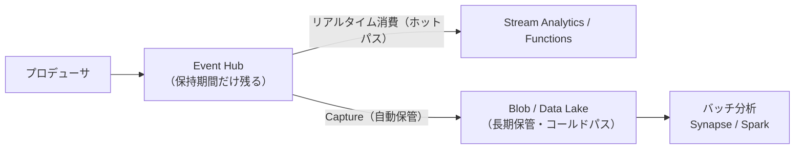
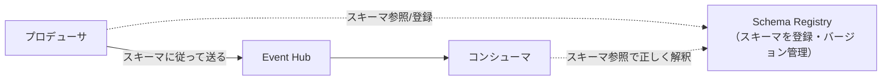
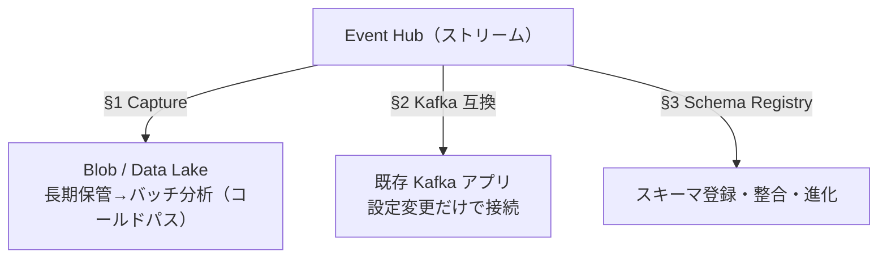

# Week 9 — Event Hubs を取り込み基盤として繋ぐ：Capture・Kafka 互換・Schema Registry

> **Phase B**（Event Hubs）| 学習プラン Week 9 / 17
> 学習目標：Event Hubs Capture でストリームを自動で Blob / Data Lake に保存（Avro/Parquet）でき、その「ホットパス＋コールドパス」の意味を説明でき、Kafka 互換エンドポイントで既存 Kafka アプリを設定変更だけで載せ替えられることと概念対応を理解し、Schema Registry が「イベントの形」を管理して送受信の整合を保つ役割を掴む

---

## 0. 今週の位置づけ

Week 7-8 で「流して・読む」基本ができた。Week 9 は Event Hubs を**取り込み基盤（ingestion）として周辺と繋ぐ**3機能を扱う。テーマは「**大量に取り込んで、後段の保管・分析・既存資産へ流す**」。

1. **Capture**：流れるストリームを自動で Blob / Data Lake に保存（§1）
2. **Kafka 互換**：既存 Kafka アプリを設定変更だけで載せ替え（§2）
3. **Schema Registry**：イベントの「形（スキーマ）」を管理し整合を保つ（§3）

> 手を動かすより**何のための機能か**を掴む週（Week 5 と同じ性質）。Capture は Storage 教材（Week 1）と、Kafka は Week 2 §1-3 と直結する。

---

## 1. Event Hubs Capture：ストリームを自動で保管

### 1-1. 何をするか

**Event Hubs を流れるイベントを、自動で Azure Blob Storage または Data Lake Storage に保存**する機能。コードを書かず、Portal/ARM で有効化するだけ。**Event Hubs の容量に合わせて自動スケール**し、運用の手間がない。



> **初学者向け用語補足：ホットパスとコールドパス**
> - **ホットパス（hot path）**：届いたイベントを**今すぐリアルタイムに処理**する経路（アラート・ダッシュボード）。
> - **コールドパス（cold path）**：**いったん保管して、後でまとめてバッチ分析**する経路（日次集計・機械学習の学習データ）。
> Event Hubs の保持期間は短い（標準 既定1時間〜最大7日・Week 7）ので、**長期保管にはそのままでは向かない**。Capture を使えば**同じストリームを、リアルタイム処理しつつ、自動で長期保管にも流せる**（両取り＝lambda アーキテクチャ）。「リアルタイムは後で足したい」「既存のバッチに後からリアルタイムを足したい」のどちらにも効く。

### 1-2. 形式とウィンドウ

- **形式**：既定は **Apache Avro（アヴロ）**（スキーマ内蔵のコンパクトなバイナリ形式。Hadoop / Stream Analytics / Data Factory が扱える）。Portal の **no-code エディタ**経由なら **Parquet（パーケイ）**（分析向け列指向）でも保存できる。
- **ウィンドウ（いつ書き出すか）**：**サイズ** と **時間** の2条件を設定し、**先に達した方（first wins）**で書き出す。例：「15分 / 100MB」で毎秒1MB なら、サイズ（100MB＝約100秒）が先に発火。
- **パーティション独立**：各パーティションが独立に書き出し、ブロック Blob を作る。

```text
保存先のフォルダ構造（時刻で自動整理）：
  {Namespace}/{EventHub}/{PartitionId}/{Year}/{Month}/{Day}/{Hour}/{Minute}/{Second}
  例: mynamespace/myeventhub/0/2017/12/08/03/03/17.avro
```

### 1-3. 押さえるポイント

| ポイント | 内容 |
|---|---|
| **消費の邪魔をしない** | Capture は**内部ストレージから直接コピー**し、**egress（出力）枠を消費しない**。Stream Analytics 等の読み手の帯域を奪わない |
| **有効化後のみ** | 既存ハブで後から有効化すると、**有効化後に届いたイベントだけ**を保存（過去分は対象外） |
| **空ファイル** | データが無い間も**空ファイル**を書き、下流バッチに「動いている」マーカーを与える |
| **権限** | 保存先 Storage に対し **Storage Blob Data Owner**（コンテナ/Blob 書き込み権限）が必要 |

> Storage 教材（Week 1）で学んだ Blob/Data Lake が、ここで**ストリームの保管先**として効いてくる。「DB は軽い参照、実体は Blob」「分析は Data Lake」の発想がそのまま当てはまる。

---

## 2. Kafka 互換エンドポイント

### 2-1. 何が嬉しいか

Event Hubs は **Kafka プロトコルのエンドポイント**を持つ。**既存の Kafka アプリを、接続先の設定（bootstrap server）を変えるだけで、コード無改修で載せ替えられる**（Week 2 §1-3 の「Kafka 互換」の実体）。自前 Kafka クラスタの運用から解放される。

```properties
# 既存 Kafka アプリの設定を、Event Hubs のエンドポイントに向けるだけ
bootstrap.servers=NAMESPACENAME.servicebus.windows.net:9093
security.protocol=SASL_SSL
sasl.mechanism=OAUTHBEARER          # Entra ID（OAuth 2.0）の場合。SAS なら PLAIN
```

- **対応**：standard / premium / dedicated ティア、**Kafka 1.0 以降**。
- **認証**：TLS 必須（`SASL_SSL`）。**OAUTHBEARER**（Entra ID）または **PLAIN**（SAS）。Week 6 のセキュリティと同じ考え方。

### 2-2. 概念の対応（Kafka ⇔ Event Hubs）

両者は「**パーティション化されたログ**」で発想がほぼ同じ（Week 2 §1-3・Week 7）。

| Apache Kafka | Event Hubs |
|---|---|
| Cluster（クラスタ） | **Namespace** |
| Topic（トピック） | **Event Hub** |
| Partition | **Partition** |
| Consumer Group | **Consumer Group** |
| Offset | **Offset** |

> **プロトコル混在ができる**：Event Hubs は **Kafka / AMQP / HTTP** を同時に持つ。**Kafka で書いて AMQP で読む**（その逆も）ができる。例：既存 Kafka プロデューサはそのまま、読み手は Event Hubs ネイティブの AMQP（Stream Analytics / Functions）で受ける——**書き手は資産を活かし、読み手は Azure 連携の恩恵**。Capture や Geo-DR も Kafka 経由のデータに効く。

> **重要な概念の区別：Kafka 互換でも「3兄弟の使い分け」は変わらない**
> Kafka は**競合コンシューマー（Week 2 §1-2）・サーバー評価ルールでの pub/sub・ジョブのライフサイクル追跡・DLQ** を持たない。これらは Service Bus / Event Grid の領分。「Kafka 互換だから何でも Event Hubs で」ではなく、**業務メッセージは Service Bus、反応イベントは Event Grid**という使い分け（Week 1）は不変。

---

## 3. Schema Registry：イベントの「形」を管理する

### 3-1. 何を解くか

ストリームには毎秒大量のイベントが流れる。送り手と受け手が**イベントの構造（スキーマ）について合意**していないと、受け手は壊れたデータを掴む。例：プロデューサが `temperature`（数値）で送っていたのに、ある日 `temp`（文字列）に変えたら、コンシューマが解釈できず壊れる。

**Schema Registry ＝ イベントのスキーマ（フィールド名・型）を一元的に登録・管理する場所**。送受信は「このスキーマに従う」と参照し合うことで整合を保つ。



### 3-2. なぜ Avro の「スキーマ内蔵」だけでは足りないか

Avro（§1）は1件ごとにスキーマを内蔵できるが、**毎メッセージにスキーマを丸ごと載せると冗長**。Schema Registry を使うと、**スキーマは Registry に1回登録し、メッセージはスキーマID（小さな参照）だけ**を持つ。これでメッセージは軽いまま、受け手は ID からスキーマを引いて解釈できる（Week 5 §3 のクレームチェックに似た「実体は別、参照だけ運ぶ」発想）。

> **初学者向け用語補足：スキーマID参照の仕組み（なぜ軽いのに解釈できるか）**
> 前提：**Avro バイナリはスキーマが無いと解読できない**。コンパクトな理由は、**フィールド名を保存せず値だけを順番に並べる**から。
>
> ```text
> スキーマ: { deviceId(文字列), temperature(整数), timestamp(整数) }
> Avroバイナリ: [device-1][21][1719xxxx]  ← 値が順に並ぶだけ。「どれが何か」は書いてない
>   → 受け手は設計図（スキーマ）が無いと「最初が deviceId…」と解読できない＝スキーマは必須
> ```
> 問題は「**そのスキーマをどこに置くか**」。
>
> | | 方式A：毎回同封 | 方式B：スキーマID参照（Registry） |
> |---|---|---|
> | 1メッセージ | `[スキーマ全文~200B][データ~15B]`＝~215B | `[ID 42（数B）][データ~15B]`＝~19B |
> | スキーマの置き場 | 毎メッセージ（冗長） | **Registry に1回だけ** |
> | 受け手の解読 | 同梱の凡例で | **ID から引く → 1回引いてキャッシュ** |
>
> **受け手の流れ**：①メッセージ先頭の `ID=42` を読む → ②Registry に「42 のスキーマちょうだい」と問い合わせ → ③その設計図で値を解読 → ④スキーマを手元にキャッシュ（次回以降は問い合わせ不要）。
>
> **たとえ（様式番号）**：方式A＝手紙ごとに読み方の凡例を毎回まるごと同封（分厚い）。方式B＝手紙には「様式 第42号で記入」とだけ書き、受け手は共有の様式集から第42号を1回取り出して机に置き（キャッシュ）、以降それで全部読む。**重いもの（スキーマ）は別の場所、本体は軽い参照だけ**——Week 5 §3 のクレームチェックと同じ発想。

> **重要な概念の区別：スキーマは Avro 専用ではない（2つの軸で分ける）**
> 「スキーマを使うのは Avro のときだけ？」——**いいえ**。混同の元は、Avro が「スキーマ無しでは読めない」特別な関係だから。次の2軸を分ける。
>
> **軸① その形式は"解読に"スキーマが必要か**
>
> | 形式 | 解読にスキーマ必須？ | 自己記述的？（項目名が中にあるか） |
> |---|---|---|
> | **Avro / Protobuf（プロトバフ）** | **必須** | ✗（値だけ並ぶ） |
> | **JSON** | 不要 | ○（`{"deviceId":"device-1"}` と項目名が中にある） |
>
> **軸② "検証・契約・進化"のためにスキーマを使うか**（こちらが本質）
> たとえ JSON（スキーマ無しでも読める）でも、スキーマには別の役目がある：**検証**（壊れたデータを弾く）・**契約**（送受信の約束）・**進化**（互換性で別ペース更新・§3-3）。だから **JSON でも Schema Registry にスキーマ（JSON Schema）を登録して使う価値がある**。
>
> ```text
> Avro     ：スキーマ必須（読むのに要る）＋ 検証・進化にも使う
> Protobuf ：スキーマ必須（読むのに要る）＋ 検証・進化にも使う
> JSON     ：スキーマ無しでも読める が、検証・進化のために使うと嬉しい
> ```
> **Azure Schema Registry は Avro / JSON / Protobuf の3形式に対応**。§3-2 の「Avro はスキーマが無いと読めない」は軸①の話で、Registry 自体は Avro 専用ではない。

### 3-3. スキーマの進化（compatibility）

スキーマは時間とともに変わる（フィールド追加など）。Schema Registry は**互換性ルール**（後方互換／前方互換）を持ち、「**古いコンシューマを壊さずにスキーマを更新**」できるよう管理する。これにより、送り手と受け手を**別々のペースで更新**しても壊れない。

> **初学者向け用語補足：スキーマ更新はどう動くか（新旧の混在と互換性）**
> - **プロデューサ側**：スキーマを変えたら**新スキーマを Registry に登録 → 新 ID をもらい**（旧42→新43）、以降のメッセージに**新 ID を刻む**。
> - **コンシューマは「新 ID を使え」と教わるわけではない**：**各メッセージが自分の ID を自己申告**するので、コンシューマは**メッセージごとに、そこに書かれた ID のスキーマを引く**だけ。だから新旧が混在しても両方読める。
>
> ```text
>   メッセージX [ID=42][データ] → 「42」を引いて解読
>   メッセージY [ID=43][データ] → 「43」を引いて解読   ← 各メッセージが自己申告するので混在OK
> ```
> - **「壊れない」を保証するのが互換性ルール**：新スキーマ登録時に Registry が「旧と互換か」を検査し、互換でなければ拒否する。
>
> | 互換性 | 意味 | 先に更新していいのは |
> |---|---|---|
> | **後方互換（backward）** | 新スキーマで**旧データ**が読める | **コンシューマを先に**新版へ |
> | **前方互換（forward）** | 旧スキーマで**新データ**が読める | **プロデューサを先に**新版へ（旧コンシューマは新フィールドを無視して読める） |
>
> 仕組み：コンシューマは「メッセージが書かれたスキーマ（ID で取得＝writer）」と「自分のコードが期待するスキーマ（reader）」を Avro が突き合わせ、**足りないフィールドはデフォルトで補い・余分は無視**する（スキーマ解決）。互換性ルールがこの解決の成立を保証する。

> **重要な概念の区別：後方/前方互換を具体例で（reader と data を分ける）**
> つまずく原因は「**読む側のバージョン**」と「**データが書かれたバージョン**」を一緒くたにすること。この2つは独立（プロデューサだけ先に新版、などが起きる）。互換性とは「**ある reader が、別バージョンで書かれた data を読めるか**」。
>
> 例：v1 → v2 で **`humidity` を追加（デフォルト 0）**。
> ```text
> v1: { deviceId, temperature }
> v2: { deviceId, temperature, humidity(デフォルト0) }
> ```
> reader と data の組は2通り：
>
> | 読む側(reader) | データ(書かれた版) | 突き合わせ | 読める？ |
> |---|---|---|---|
> | **v2** | **v1**（humidity 無し） | reader は humidity を期待→データに無い→**デフォルト0で補う** | ✓ **後方互換** |
> | **v1** | **v2**（humidity 有り） | データに humidity →reader は知らない→**無視** | ✓ **前方互換** |
>
> - **後方互換＝新 reader が旧 data を読める**（足りない分はデフォルトで補う）→ **コンシューマを先に**更新してよい（プロデューサがまだ v1 でも v2 reader が読めるから）。
> - **前方互換＝旧 reader が新 data を読める**（余分は無視）→ **プロデューサを先に**更新してよい（コンシューマがまだ v1 でも新データを読めるから）。
>
> **①何をみて判断するか（登録時）**：新スキーマ登録時に Registry が「旧スキーマ」と「新スキーマ」を取り出し、設定ルールで**解決をシミュレート**。照合ルールは——両方にある=値を渡す／**reader にあり data に無い=デフォルトで補う**／**data にあり reader が知らない=無視**。これが破綻しなければ登録を許可、破綻するなら**拒否**。
> **②何を保証するか**：後方=「v2 reader↔v1 data」、前方=「v1 reader↔v2 data」が壊れないこと。
>
> **反例（何を防ぐか）**：`humidity` を**デフォルト無し**で追加すると——
> ```text
> v2 reader が v1 data を読む → humidity を要求するのにデータに無い → デフォルトも無い → ★クラッシュ
>   → 後方互換ではない → Registry は後方ルールでの登録を拒否（本番に出る前に止める）
> ```
> これが「互換性ルールが保証する」の正体：**壊れる変更を登録時点でブロック**するから、片方を先に更新しても安全。

> **初学者向け用語補足：スキーマID はプログラムのどこで指定するか**
> **生の ID を自分でコードに書くことはない。** ID の発行・刻印・読み取りは**シリアライザ（エンコーダ）層**が自動でやる。あなたが渡すのは**スキーマ（定義）**であって ID ではない。
>
> ```python
> from azure.schemaregistry import SchemaRegistryClient
> from azure.schemaregistry.encoder.avroencoder import AvroEncoder
> sr = SchemaRegistryClient(fully_qualified_namespace="...servicebus.windows.net", credential=cred)
> encoder = AvroEncoder(client=sr, group_name="telemetry-schemas", auto_register=True)
>
> # === プロデューサ ===
> schema = '{"type":"record","name":"Telemetry","fields":[\
> {"name":"deviceId","type":"string"},{"name":"temperature","type":"int"}]}'
> event = encoder.encode({"deviceId":"device-1","temperature":21},
>                        schema=schema, message_type=EventData)  # ← 渡すのは schema。ID ではない
> # encode が「スキーマ登録→ID取得→Avro直列化→IDを content_type に刻印」までやる
> await producer.send_batch([event])     # event.content_type == "avro/binary+<schema-id>"
>
> # === コンシューマ ===
> async def on_event(ctx, event):
>     obj = encoder.decode(event)        # content_type の ID を読む→Registryで引く→デコード（キャッシュ）
>     print(obj["deviceId"], obj["temperature"])
> ```
> - **ID の物理的な居場所**：メッセージの**メタデータ（Azure では `content_type` ＝ `avro/binary+<schema-id>`）**。本文データとは別の小さな欄。
> - **あなたが指定するのはスキーマ**：`encode(schema=...)` に定義（または生成クラス）を渡す。ID はエンコーダが自動採番・刻印。
> - **コンシューマも ID を書かない**：`decode(event)` が content_type の ID を読んで自動で引く。業務コードは「ただのオブジェクト」を受け取るだけ。だから**スキーマ更新時にコンシューマのコードを触らずに済む**ことが多い。

> **重要な概念の区別：「ID は書かない」と「スキーマは両側が持つ」は両立する**
> 「どのスキーマを使うかはプログラムで指定しないのでは？」——指定しないのは **ID（番号）** だけ。**スキーマ（構造）は両側がちゃんと持つ**。
> ```text
> 書かない      ：スキーマID＝42 という「番号」（エンコーダが自動採番・刻印・読み取り）
> プログラムが持つ：スキーマ＝{ deviceId, temperature, ... } という「形の定義」
>   プロデューサ → 書くスキーマ（writer schema）を encode に渡す
>   コンシューマ → 期待するスキーマ（reader schema）を持つ
> ```
> ID は writer schema にエンコーダが付けた整理番号にすぎない。**番号は書かないが、形は両側が書く**ので矛盾しない。
> - **「両側のスキーマがズレたら互換が効く」で合っている**：writer と reader が完全一致しなくても、互換ルールの範囲なら（補う/無視で）読める＝前方/後方互換（上の §3-3 の表）。
> - **ただし判定は"実行時の2者比較"ではない**：互換チェックは **スキーマ登録時に「新しい版」と「これまでの版」が互換か**を検査して、互換な版だけ許可する。これにより、**許可された版どうしの組なら（writer がどれ・reader がどれでも）読める**ことが保証される。実行時に毎回つき合わせて判定しているのではなく、**入口（登録）で安全を担保**している。
> - **reader を明示する/しない**：型付きクラスにマッピングするなど **reader schema を明示**すれば、両側のズレを互換ルールが吸収する。一方、`decode(event)` のように **reader を渡さず writer schema のまま復元**する簡易モードもある（その場合 reader/writer 解決は表に出ず、コードが「ある項目がある前提」で書かれていれば、それが消えた版のデータで崩れる＝Avro でなくアプリの想定の問題）。

> **位置づけ**：Schema Registry は Azure Event Hubs の名前空間内で提供され、**Kafka エコシステムの Schema Registry（Confluent 等）に相当**する役割。Avro / JSON スキーマを登録できる。大量ストリームで「データの品質・整合」を守る土台。

---

## 4. Week 9 全体の整理



| 用語 | 一言説明 |
|---|---|
| Event Hubs Capture | ストリームを自動で Blob/Data Lake へ（Avro 既定/Parquet） |
| ホット/コールドパス | リアルタイム処理 / 保管して後でバッチ |
| ウィンドウ（first wins） | サイズか時間、先に達した方で書き出す |
| Kafka 互換エンドポイント | bootstrap server 変更だけで既存 Kafka を載せ替え |
| 概念対応 | Cluster→Namespace, Topic→Event Hub, … |
| Schema Registry | イベントの形を登録・参照・進化管理 |

---

## ハンズオン チェックリスト

- [ ] イベントハブで Capture を有効化し、保存先 Blob コンテナを指定した（Storage Blob Data Owner を付与）
- [ ] イベントを送り、`{Namespace}/{EventHub}/{Partition}/年/月/日/...avro` の構造でファイルが出ることを確認した
- [ ] ホットパス（リアルタイム）とコールドパス（保管→バッチ）の違いを説明できた
- [ ] Kafka の概念（Topic/Partition/Consumer Group/Offset）が Event Hubs にどう対応するか言えた
- [ ] Schema Registry が「なぜ要るか」（送受信のスキーマ整合・進化）を説明できた

---

## 自己チェック

1. **Event Hubs Capture は何を・どこに・どんな形式で保存する？消費の邪魔をしない理由は？**
   - キーワード：ストリーム・Blob/Data Lake・Avro/Parquet・egress 枠を使わない
2. **ホットパスとコールドパスの違いと、Capture がなぜ両取りに効くか？**
   - キーワード：リアルタイム / 保管してバッチ・保持期間が短い
3. **既存 Kafka アプリを Event Hubs に載せ替えるのに何を変える？**
   - キーワード：bootstrap server（接続設定）だけ・コード無改修
4. **「Kafka 互換だから全部 Event Hubs で」が誤りな理由は？**
   - キーワード：競合コンシューマー/DLQ 無し・Service Bus/Event Grid の領分
5. **Schema Registry は何を解決する？Avro のスキーマ内蔵との違いは？**
   - キーワード：送受信のスキーマ整合・進化・ID 参照で軽量

---

## 次週の予告（Week 10）— Part B 最終週

Event Hubs の運用面（セキュリティ・監視・スケーリング）で Part B を締める：

- **セキュリティ**：Entra ID / RBAC（Data Owner/Sender/Receiver）と SAS（Service Bus と同じ考え方）
- **監視**：スループット・スロットリング・Capture バックログ等のメトリクス
- **スケーリング**：Auto-inflate（TU 自動増）・Dedicated クラスタ
- **Stream Analytics 連携**：ストリームに対して SQL ライクに集計する後段処理
- ここまでで Event Hubs を一通り完成させ、Part C（Event Grid）へ
