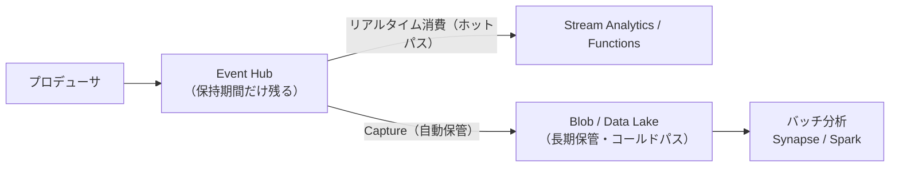
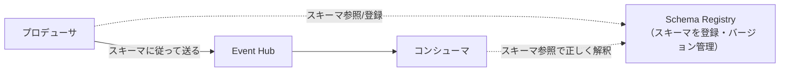
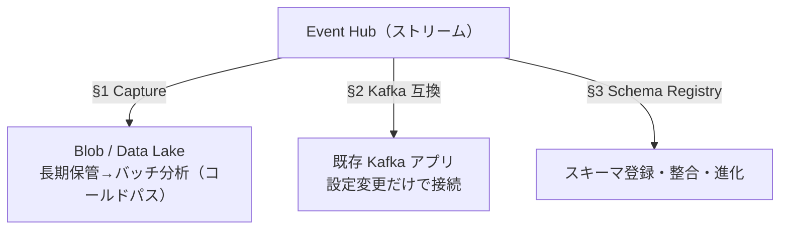

# Week 9 — Event Hubs を取り込み基盤として繋ぐ：Capture・Kafka 互換・Schema Registry

> **Phase B**（Event Hubs）| 学習プラン Week 9 / 17
> 学習目標：Event Hubs Capture でストリームを自動で Blob / Data Lake に保存（Avro/Parquet）でき、その「ホットパス＋コールドパス」の意味を説明でき、Kafka 互換エンドポイントで既存 Kafka アプリを設定変更だけで載せ替えられることと概念対応を理解し、Schema Registry が「イベントの形」を管理して送受信の整合を保つ役割を掴む

---

## 0. 今週の位置づけ

Week 7-8 で「流して・読む」基本ができた。Week 9 は Event Hubs を**取り込み基盤（ingestion）として周辺と繋ぐ**3機能を扱う。テーマは「**大量に取り込んで、後段の保管・分析・既存資産へ流す**」。

1. **Capture**：流れるストリームを自動で Blob / Data Lake に保存（§1）
2. **Kafka 互換**：既存 Kafka アプリを設定変更だけで載せ替え（§2）
3. **Schema Registry**：イベントの「形（スキーマ）」を管理し整合を保つ（§3）

> 手を動かすより**何のための機能か**を掴む週（Week 5 と同じ性質）。Capture は Storage 教材（Week 1）と、Kafka は Week 2 §1-3 と直結する。

---

## 1. Event Hubs Capture：ストリームを自動で保管

### 1-1. 何をするか

**Event Hubs を流れるイベントを、自動で Azure Blob Storage または Data Lake Storage に保存**する機能。コードを書かず、Portal/ARM で有効化するだけ。**Event Hubs の容量に合わせて自動スケール**し、運用の手間がない。



> **初学者向け用語補足：ホットパスとコールドパス**
> - **ホットパス（hot path）**：届いたイベントを**今すぐリアルタイムに処理**する経路（アラート・ダッシュボード）。
> - **コールドパス（cold path）**：**いったん保管して、後でまとめてバッチ分析**する経路（日次集計・機械学習の学習データ）。
> Event Hubs の保持期間は短い（標準 既定1時間〜最大7日・Week 7）ので、**長期保管にはそのままでは向かない**。Capture を使えば**同じストリームを、リアルタイム処理しつつ、自動で長期保管にも流せる**（両取り＝lambda アーキテクチャ）。「リアルタイムは後で足したい」「既存のバッチに後からリアルタイムを足したい」のどちらにも効く。

### 1-2. 形式とウィンドウ

- **形式**：既定は **Apache Avro**（スキーマ内蔵のコンパクトなバイナリ形式。Hadoop / Stream Analytics / Data Factory が扱える）。Portal の **no-code エディタ**経由なら **Parquet**（分析向け列指向）でも保存できる。
- **ウィンドウ（いつ書き出すか）**：**サイズ** と **時間** の2条件を設定し、**先に達した方（first wins）**で書き出す。例：「15分 / 100MB」で毎秒1MB なら、サイズ（100MB＝約100秒）が先に発火。
- **パーティション独立**：各パーティションが独立に書き出し、ブロック Blob を作る。

```text
保存先のフォルダ構造（時刻で自動整理）：
  {Namespace}/{EventHub}/{PartitionId}/{Year}/{Month}/{Day}/{Hour}/{Minute}/{Second}
  例: mynamespace/myeventhub/0/2017/12/08/03/03/17.avro
```

### 1-3. 押さえるポイント

| ポイント | 内容 |
|---|---|
| **消費の邪魔をしない** | Capture は**内部ストレージから直接コピー**し、**egress（出力）枠を消費しない**。Stream Analytics 等の読み手の帯域を奪わない |
| **有効化後のみ** | 既存ハブで後から有効化すると、**有効化後に届いたイベントだけ**を保存（過去分は対象外） |
| **空ファイル** | データが無い間も**空ファイル**を書き、下流バッチに「動いている」マーカーを与える |
| **権限** | 保存先 Storage に対し **Storage Blob Data Owner**（コンテナ/Blob 書き込み権限）が必要 |

> Storage 教材（Week 1）で学んだ Blob/Data Lake が、ここで**ストリームの保管先**として効いてくる。「DB は軽い参照、実体は Blob」「分析は Data Lake」の発想がそのまま当てはまる。

---

## 2. Kafka 互換エンドポイント

### 2-1. 何が嬉しいか

Event Hubs は **Kafka プロトコルのエンドポイント**を持つ。**既存の Kafka アプリを、接続先の設定（bootstrap server）を変えるだけで、コード無改修で載せ替えられる**（Week 2 §1-3 の「Kafka 互換」の実体）。自前 Kafka クラスタの運用から解放される。

```properties
# 既存 Kafka アプリの設定を、Event Hubs のエンドポイントに向けるだけ
bootstrap.servers=NAMESPACENAME.servicebus.windows.net:9093
security.protocol=SASL_SSL
sasl.mechanism=OAUTHBEARER          # Entra ID（OAuth 2.0）の場合。SAS なら PLAIN
```

- **対応**：standard / premium / dedicated ティア、**Kafka 1.0 以降**。
- **認証**：TLS 必須（`SASL_SSL`）。**OAUTHBEARER**（Entra ID）または **PLAIN**（SAS）。Week 6 のセキュリティと同じ考え方。

### 2-2. 概念の対応（Kafka ⇔ Event Hubs）

両者は「**パーティション化されたログ**」で発想がほぼ同じ（Week 2 §1-3・Week 7）。

| Apache Kafka | Event Hubs |
|---|---|
| Cluster（クラスタ） | **Namespace** |
| Topic（トピック） | **Event Hub** |
| Partition | **Partition** |
| Consumer Group | **Consumer Group** |
| Offset | **Offset** |

> **プロトコル混在ができる**：Event Hubs は **Kafka / AMQP / HTTP** を同時に持つ。**Kafka で書いて AMQP で読む**（その逆も）ができる。例：既存 Kafka プロデューサはそのまま、読み手は Event Hubs ネイティブの AMQP（Stream Analytics / Functions）で受ける——**書き手は資産を活かし、読み手は Azure 連携の恩恵**。Capture や Geo-DR も Kafka 経由のデータに効く。

> **重要な概念の区別：Kafka 互換でも「3兄弟の使い分け」は変わらない**
> Kafka は**競合コンシューマー（Week 2 §1-2）・サーバー評価ルールでの pub/sub・ジョブのライフサイクル追跡・DLQ** を持たない。これらは Service Bus / Event Grid の領分。「Kafka 互換だから何でも Event Hubs で」ではなく、**業務メッセージは Service Bus、反応イベントは Event Grid**という使い分け（Week 1）は不変。

---

## 3. Schema Registry：イベントの「形」を管理する

### 3-1. 何を解くか

ストリームには毎秒大量のイベントが流れる。送り手と受け手が**イベントの構造（スキーマ）について合意**していないと、受け手は壊れたデータを掴む。例：プロデューサが `temperature`（数値）で送っていたのに、ある日 `temp`（文字列）に変えたら、コンシューマが解釈できず壊れる。

**Schema Registry ＝ イベントのスキーマ（フィールド名・型）を一元的に登録・管理する場所**。送受信は「このスキーマに従う」と参照し合うことで整合を保つ。



### 3-2. なぜ Avro の「スキーマ内蔵」だけでは足りないか

Avro（§1）は1件ごとにスキーマを内蔵できるが、**毎メッセージにスキーマを丸ごと載せると冗長**。Schema Registry を使うと、**スキーマは Registry に1回登録し、メッセージはスキーマID（小さな参照）だけ**を持つ。これでメッセージは軽いまま、受け手は ID からスキーマを引いて解釈できる（Week 5 §3 のクレームチェックに似た「実体は別、参照だけ運ぶ」発想）。

### 3-3. スキーマの進化（compatibility）

スキーマは時間とともに変わる（フィールド追加など）。Schema Registry は**互換性ルール**（後方互換／前方互換）を持ち、「**古いコンシューマを壊さずにスキーマを更新**」できるよう管理する。これにより、送り手と受け手を**別々のペースで更新**しても壊れない。

> **位置づけ**：Schema Registry は Azure Event Hubs の名前空間内で提供され、**Kafka エコシステムの Schema Registry（Confluent 等）に相当**する役割。Avro / JSON スキーマを登録できる。大量ストリームで「データの品質・整合」を守る土台。

---

## 4. Week 9 全体の整理



| 用語 | 一言説明 |
|---|---|
| Event Hubs Capture | ストリームを自動で Blob/Data Lake へ（Avro 既定/Parquet） |
| ホット/コールドパス | リアルタイム処理 / 保管して後でバッチ |
| ウィンドウ（first wins） | サイズか時間、先に達した方で書き出す |
| Kafka 互換エンドポイント | bootstrap server 変更だけで既存 Kafka を載せ替え |
| 概念対応 | Cluster→Namespace, Topic→Event Hub, … |
| Schema Registry | イベントの形を登録・参照・進化管理 |

---

## ハンズオン チェックリスト

- [ ] イベントハブで Capture を有効化し、保存先 Blob コンテナを指定した（Storage Blob Data Owner を付与）
- [ ] イベントを送り、`{Namespace}/{EventHub}/{Partition}/年/月/日/...avro` の構造でファイルが出ることを確認した
- [ ] ホットパス（リアルタイム）とコールドパス（保管→バッチ）の違いを説明できた
- [ ] Kafka の概念（Topic/Partition/Consumer Group/Offset）が Event Hubs にどう対応するか言えた
- [ ] Schema Registry が「なぜ要るか」（送受信のスキーマ整合・進化）を説明できた

---

## 自己チェック

1. **Event Hubs Capture は何を・どこに・どんな形式で保存する？消費の邪魔をしない理由は？**
   - キーワード：ストリーム・Blob/Data Lake・Avro/Parquet・egress 枠を使わない
2. **ホットパスとコールドパスの違いと、Capture がなぜ両取りに効くか？**
   - キーワード：リアルタイム / 保管してバッチ・保持期間が短い
3. **既存 Kafka アプリを Event Hubs に載せ替えるのに何を変える？**
   - キーワード：bootstrap server（接続設定）だけ・コード無改修
4. **「Kafka 互換だから全部 Event Hubs で」が誤りな理由は？**
   - キーワード：競合コンシューマー/DLQ 無し・Service Bus/Event Grid の領分
5. **Schema Registry は何を解決する？Avro のスキーマ内蔵との違いは？**
   - キーワード：送受信のスキーマ整合・進化・ID 参照で軽量

---

## 次週の予告（Week 10）— Part B 最終週

Event Hubs の運用面（セキュリティ・監視・スケーリング）で Part B を締める：

- **セキュリティ**：Entra ID / RBAC（Data Owner/Sender/Receiver）と SAS（Service Bus と同じ考え方）
- **監視**：スループット・スロットリング・Capture バックログ等のメトリクス
- **スケーリング**：Auto-inflate（TU 自動増）・Dedicated クラスタ
- **Stream Analytics 連携**：ストリームに対して SQL ライクに集計する後段処理
- ここまでで Event Hubs を一通り完成させ、Part C（Event Grid）へ
