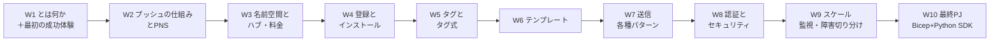
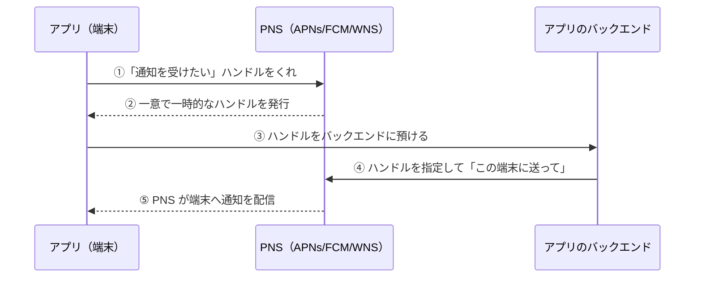
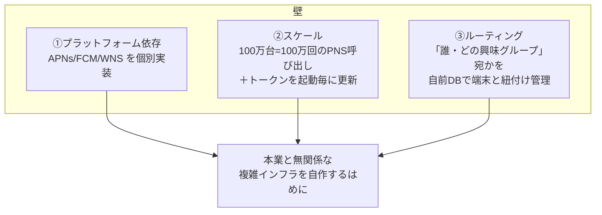
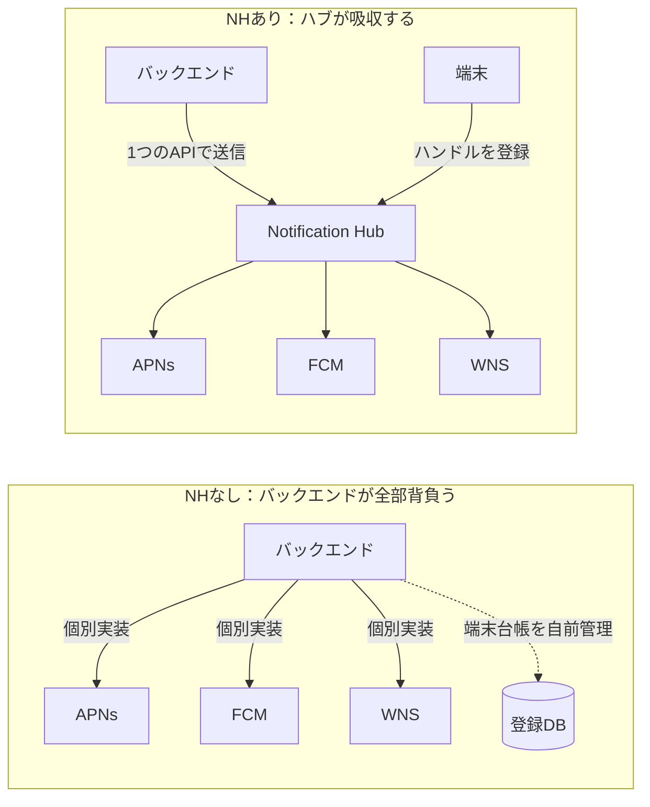
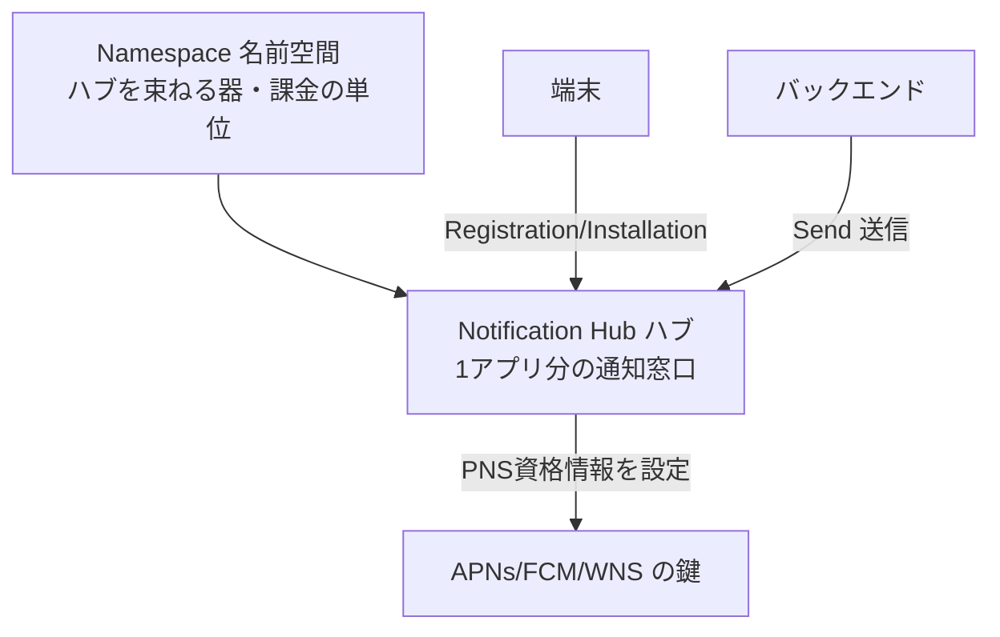

# Week 1 — Azure Notification Hubs とは何か：iOS・Android など多数の端末へ、1 つの API でプッシュ通知を大規模に配信するサービス

> **Phase 1a** | 学習プラン Week 1 / 10
> 学習目標：Azure Notification Hubs（アジュール・ノーティフィケーション・ハブズ）が「どんな問題を解くサービスなのか」を、プッシュ通知の仕組み（PNS）と対比しながら理解する。名前空間とハブを 1 つ作り、ポータルの「テスト送信」で自分の端末なしでも通知が飛ぶ流れを体感し、後片付けまでできるようになる。

---

## 0. 今週の位置づけ

この教材は Azure Notification Hubs（略して **NH** = Notification Hubs）を **10 週**で学ぶ。全体像は次のとおり。



今週（W1）のゴールは、**API の細かい使い方にはまだ立ち入らず**、「Notification Hubs とは何のためのサービスか」を腹落ちさせることである。そのうえで、名前空間とハブを 1 つ作り、ポータルから通知を飛ばす動きを体感する。登録・タグ・テンプレート・送信 API は W2 以降で順に深掘りする。

> **初学者向け用語補足：略語の展開**
> - **NH** = Notification Hubs（Notification=通知 / Hubs=中継拠点・集約点）＝「通知の集約・中継サービス」。本教材ではこの略で呼ぶ。
> - **PNS** = Platform Notification System / Service（Platform=プラットフォーム / Notification=通知 / System=仕組み）＝「各 OS ベンダーが用意した、端末へ通知を届ける土管」。後述する主役。
> - **APNs** = Apple Push Notification service（アップル・プッシュ・ノーティフィケーション・サービス）＝ Apple（iOS/macOS）向けの PNS。※末尾の s は小文字が正式表記。
> - **FCM** = Firebase Cloud Messaging（ファイアベース・クラウド・メッセージング）＝ Google（Android）向けの PNS。
> - **WNS** = Windows Notification Service（ウィンドウズ・ノーティフィケーション・サービス）＝ Windows 向けの PNS。
> - **SDK** = Software Development Kit（Software=ソフトウェア / Development=開発 / Kit=道具一式）＝「開発キット」。ここでは NH をコードから叩くライブラリ。
> - **SAS** = Shared Access Signature（Shared=共有 / Access=アクセス / Signature=署名）＝「共有アクセス署名」。NH への接続を認可する仕組み（W8 で深掘り）。

---

## 1. そもそも「プッシュ通知」とは何か

スマホのロック画面やバナーに、アプリを開いていなくても「新着メッセージが届きました」「セールが始まりました」と出てくる、あれがプッシュ通知である。公式は次のように説明する。

> "Push notifications are a form of app-to-user communication where users of mobile apps are notified of certain desired information, usually in a pop-up or dialog box on a mobile device."
> （プッシュ通知は、アプリからユーザーへの通信の一形態であり、モバイルアプリの利用者に、通常はポップアップやダイアログで、望ましい情報が通知される。出典：[What is Azure Notification Hubs?](https://learn.microsoft.com/en-us/azure/notification-hubs/notification-hubs-push-notification-overview)）

重要な性質は 2 つ。

- **アプリが起動していなくても届く**。アプリ本体が動いていなくても、OS 側が受け取って画面に出す。
- **画面に出す"だけ"ではない**。ユーザーに見せない**サイレント通知（silent push）**もあり、これはアプリを裏で起こして「データを取りに行け」と促す用途に使う。

> **用語補足：プル（pull）とプッシュ（push）**
> - **プル型**＝アプリが自分から定期的にサーバへ「新着ある？」と聞きに行く方式（ポーリング）。バッテリーと通信を食う。
> - **プッシュ型**＝サーバ側に何か起きたときに、サーバから端末へ「今これが起きたよ」と押し込む方式。省電力で即時性が高い。公式も「省電力（energy-efficient）でアプリ非アクティブ時も届く」ことを最大の利点に挙げる。

---

## 2. プッシュ通知は「自分で送れない」— PNS という関所

ここが最初のつまずきどころである。**アプリのバックエンド（サーバ）は、ユーザーの端末に直接通知を送れない。** 必ず OS ベンダーの通知基盤＝**PNS** を経由しなければならない。公式の定義：

> "Push notifications are delivered through platform-specific infrastructures called *Platform Notification Systems* (PNS). They offer basic push functionalities to deliver a message to a device with a provided handle, and have no common interface."
> （プッシュ通知は PNS と呼ばれるプラットフォーム固有の基盤を通じて配信される。PNS は「ハンドル」を指定して端末へメッセージを届ける基本機能を提供するが、**共通のインターフェイスを持たない**。出典：同上）

### 2-1. プッシュが届くまでの 4 ステップ

公式の "How do push notifications work?" を図にすると次のとおり。



- **ハンドル（handle）**＝「この端末のこのアプリ宛」を表す宛先文字列。**PNS ごとに形式も呼び名も違う**：公式いわく「WNS は URI、APNs は token（トークン）を使う」。FCM は registration token と呼ぶ。
- ③でバックエンドが**ハンドルを保管**しておく必要がある。これが後で「大量管理」の悩みになる。

> **用語補足：なぜ直接送れないのか（たとえ）**
> 端末は各社のマンションで、PNS は**そのマンション専属の宅配業者**だと思えばよい。外部の人（バックエンド）は住人（端末）に直接荷物を渡せず、必ずその業者に「◯号室（＝ハンドル）宛」と頼む。しかも Apple マンションの業者（APNs）、Google マンションの業者（FCM）、Windows マンションの業者（WNS）は**伝票の書式も受付方法もバラバラ**。全社に配りたければ、業者ごとに別々の手続きを踏むことになる。

### 2-2. 主要 PNS の対応表

| PNS | 略の展開 | 対象プラットフォーム | ハンドルの呼び名 |
| --- | --- | --- | --- |
| **APNs** | Apple Push Notification service | iOS / iPadOS / macOS | device token |
| **FCM** | Firebase Cloud Messaging | Android（＋クロスプラットフォーム） | registration token |
| **WNS** | Windows Notification Service | Windows 10/11 | channel URI |

> **補足：FCM の世代について**
> Android 向けの PNS はかつて **GCM**（Google Cloud Messaging）→ **FCM Legacy** と変遷し、現在は **FCM v1** が現行である。古い GCM/FCM Legacy は提供終了しており、NH 側も FCM v1 への移行が案内されている（出典：[Google Firebase Cloud Messaging migration](https://learn.microsoft.com/en-us/azure/notification-hubs/notification-hubs-gcm-to-fcm)）。W3 で認証情報を登録する際にこの世代を意識する。

---

## 3. PNS を「生」で使うと何が大変か — 3 つの壁

PNS は強力だが、公式いわく「よくあるシナリオ（例：セグメント配信）ですら、多くの実装をアプリ開発者に丸投げする」。具体的な壁は 3 つ。



公式の要点を引く。

- **プラットフォーム依存**："The backend requires complex and hard-to-maintain platform-dependent logic"（PNS は統一されていないため、プラットフォーム依存の複雑で保守しづらいロジックが要る）。
- **スケール**："A simple broadcast to a million devices results in a million calls to the PNS"（100 万台への単純なブロードキャストは、PNS への 100 万回の呼び出しになる）。加えて「トークンはアプリ起動のたびに更新が必要」で、その保守だけでも膨大なトラフィックと DB アクセスが発生する。
- **ルーティング**：ほとんどの通知は「特定ユーザー」や「興味グループ」宛だが、PNS は端末ハンドル宛しか送れない。端末と興味グループを結ぶ**台帳（registry）を自前で持て**、と PNS は要求してくる。

> **用語補足：ブロードキャスト（broadcast）とセグメント（segment）**
> - **ブロードキャスト**＝全端末へ一斉配信（例：全ユーザーに速報）。
> - **セグメント配信**＝条件で絞った一部の端末へ配信（例：「東京在住 かつ 野球好き」だけに）。PNS は基本ブロードキャストすら苦手で、セグメントは完全に自前実装になる。

---

## 4. Azure Notification Hubs の正体 — PNS の"上に立つ"共通の押し出しエンジン

ここで登場するのが NH である。公式の定義：

> "*Azure Notification Hubs* provides an easy-to-use and scaled-out push engine that enables you to send notifications to any platform (iOS, Android, Windows, etc.) from any back-end (cloud or on-premises)."
> （Azure Notification Hubs は、あらゆるバックエンド（クラウド／オンプレ）から、あらゆるプラットフォーム（iOS・Android・Windows 等）へ通知を送れる、使いやすくスケールアウトされたプッシュエンジンを提供する。出典：同上）

NH を挟むと、役割分担が劇的にシンプルになる。公式いわく「**端末は自分の PNS ハンドルをハブに登録するだけ**でよく、バックエンドは**ユーザーや興味グループ宛にメッセージを送る**だけでよい」。



つまり NH は、**PNS のバラバラな差異と、大量ハンドルの管理と、宛先ルーティングを丸ごと肩代わりする中間層**である。「1 つの API を叩けば、後は NH が各 PNS へ翻訳して配ってくれる」——これが最大の価値だ。

### 4-1. NH が提供する主な配信パターン（公式の "Rich set of delivery patterns"）

| パターン | 何ができるか |
| --- | --- |
| **ブロードキャスト** | 1 回の API 呼び出しで、複数プラットフォームの数百万台へ一斉配信 |
| **端末へプッシュ** | 個別の端末を狙って送る |
| **ユーザーへプッシュ** | **タグ**と**テンプレート**で、あるユーザーの全端末（iPhone も Android も）に届ける |
| **セグメントへプッシュ** | 動的な**タグ式**で「アクティブ かつ 東京 かつ 新規でない」のように絞って送る |
| **ローカライズ push** | **テンプレート**で、バックエンドを変えずに言語別の文面を出し分ける |
| **サイレント push** | 画面に出さず、アプリを裏で起こして処理させる |
| **スケジュール push** | 指定時刻に送る予約配信 |
| **ダイレクト push** | 登録を省き、端末ハンドルのリストへ直接バッチ送信 |

> **用語補足：タグ（tag）とタグ式（tag expression）— W5 の予告**
> - **タグ**＝登録に貼る単なる文字列ラベル（例：`follows_RedSox`, `location_Boston`, `user_Alice`）。値を持たないただの目印で、**あるか・ないか**だけを判定する。1 登録あたり**最大 60 個**まで付けられる（出典：[Routing and tag expressions](https://learn.microsoft.com/en-us/azure/notification-hubs/notification-hubs-tags-segment-push-message)）。
> - **タグ式**＝タグをブール演算（`&&`=AND / `||`=OR / `!`=NOT ＋括弧）で組み合わせた条件（例：`(follows_RedSox || follows_Cardinals) && location_Boston`）。「ボストンにいて、レッドソックスかカージナルスのどちらかを追っている人」に絞れる。
> - ここでは「NH は宛先を柔軟に絞れる」ことだけ掴めばよい。詳細は **W5** で扱う。

### 4-2. 用語の地図（今週つかむ 5 語）



| 用語 | 一言でいうと | 深掘りする週 |
| --- | --- | --- |
| **Namespace（名前空間）** | ハブを束ねる器。料金プランと課金の単位 | W3 |
| **Hub（ハブ）** | 1 つのアプリに対応する通知の窓口。PNS の鍵をここに設定 | W3 |
| **Registration / Installation（登録）** | 端末が「自分の PNS ハンドル」をハブに預ける行為 | W4 |
| **Tag（タグ）** | 登録に貼る宛先ラベル | W5 |
| **Send（送信）** | バックエンドがハブへ「これを送って」と依頼する | W7 |

---

## 5. NH と間違えやすいサービスの線引き

「メッセージを送る」系の Azure サービスは複数あり、混同しやすい。ここで交通整理しておく。

| サービス | 主な用途 | NH との違い |
| --- | --- | --- |
| **Notification Hubs** | モバイル**アプリのプッシュ通知**（バナー/ロック画面） | PNS を束ねて端末へ push すること**専門** |
| **Event Grid** | クラウド内の**イベント配送**（リソース変化を購読者へ） | 相手は端末でなく**システム/関数**。人間向け通知ではない |
| **Service Bus / Event Hubs** | アプリ間の**メッセージング/ストリーム** | 端末への画面通知ではなく、**バックエンド間**の伝送 |
| **Communication Services** | **SMS・メール・通話・チャット**の送信 | 通信手段そのものを提供。アプリ内 push なら NH が適任 |

> **ひとことで**：「スマホアプリのロック画面に出したい」なら NH。「システム同士でイベントを流したい」なら Event Grid / Service Bus。「電話番号やメールアドレス宛に SMS/メールを送りたい」なら Communication Services。

---

## 6. ハンズオン — 名前空間とハブを作り、テスト送信で動きを体感する

今週は**端末アプリを用意せず**、ポータルの「テスト送信（Test Send）」機能だけで NH の動きを確認する。PNS の鍵設定や実端末登録は W3・W4 で行う。

> **前提**：Azure サブスクリプションがあること。課金は Free レベルなら無料枠内（W3 で料金を詳述）。

### 手順

1. **リソースグループを作る**（後片付けを一括にするため）。

```bash
az group create \
  --name rg-nh-week1 \
  --location japaneast
```

> **コマンドの読み方**：`az`=Azure CLI（Command Line Interface＝コマンドライン操作）、`group create`=リソースグループを作る、`--name`=名前、`--location japaneast`=東日本リージョンに配置。

2. **名前空間を作る**（`--namespace-name` は世界で一意にする。`<yourname>` を自分用に置換）。

```bash
az notification-hub namespace create \
  --resource-group rg-nh-week1 \
  --name nhns-<yourname>-week1 \
  --location japaneast \
  --sku Free
```

> **読み方**：`notification-hub namespace create`=NH の名前空間を作る、`--sku Free`=料金プラン（SKU＝Stock Keeping Unit・在庫管理単位＝ここでは「プラン種別」）を無料の Free に。プランは Free / Basic / Standard の 3 段階（W3 で比較）。

3. **ハブを作る**（名前空間の中に、アプリ 1 つ分のハブを 1 つ）。

```bash
az notification-hub create \
  --resource-group rg-nh-week1 \
  --namespace-name nhns-<yourname>-week1 \
  --name nh-demo \
  --location japaneast
```

4. **ポータルでテスト送信する**。
   - [Azure ポータル](https://portal.azure.com) → 作成した名前空間 → ハブ `nh-demo` を開く。
   - 左メニューの **「Test Send（テスト送信）」** を開く。
   - **Platforms** で任意（例：`Custom Template` や `Apple`）を選び、既定のペイロードのまま **Send（送信）** を押す。
   - 結果に **Registrations（登録数）= 0** と表示されれば「まだ登録端末がいないので誰にも届かなかった」という**正しい結果**である。ここで確認したいのは「NH がリクエストを受理し、対象登録を探しに行く」という一連の動きが回ることだ。

> **なぜ 0 で正解なのか**：W4 で端末（または Installation API）を登録すると、この Registrations が 1 以上になり、実際に PNS 経由で配信される。今週は「送信の口が開通していること」を確認できれば十分である。

### 後片付け（重要）

```bash
az group delete --name rg-nh-week1 --yes --no-wait
```

> **読み方**：`group delete`=リソースグループごと削除（中の名前空間・ハブも一括で消える）、`--yes`=確認プロンプトを省略、`--no-wait`=完了を待たずコマンドを返す。放置課金を防ぐため、学習が終わったら必ず消す。

---

## 7. 自己チェック

以下に自分の言葉で答えられれば W1 は合格である。

1. アプリのバックエンドは、なぜユーザーの端末へ**直接**プッシュ通知を送れないのか。間に何が必要か。
2. **PNS** とは何の略で、代表的な 3 つ（Apple/Google/Windows 向け）をそれぞれ何と呼ぶか。
3. PNS を「生」で使うときの 3 つの壁（プラットフォーム依存・スケール・ルーティング）を、それぞれ一言で説明せよ。
4. Notification Hubs は、その 3 つの壁をどう肩代わりするか。「端末は◯◯するだけ、バックエンドは◯◯するだけ」の形で言えるか。
5. **Namespace / Hub / Registration / Tag / Send** の 5 語を、図の関係で説明できるか。
6. 「スマホアプリのロック画面に通知を出したい」「システム同士でイベントを流したい」「SMS を送りたい」——それぞれ NH / Event Grid / Communication Services のどれが適任か。

---

## 8. 次週予告（W2：プッシュの仕組みと PNS の深掘り）

W2 では、今週ざっくり見た**プッシュの 4 ステップ**をさらに分解する。ハンドル（token / registration token / channel URI）の実体、APNs の証明書認証とトークン認証（`.p8`）の違い、FCM v1 のサービスアカウント認証、通知の中身（payload の形）まで踏み込み、「NH がどの鍵で各 PNS を叩くのか」を理解する。これが W3 の「ハブに PNS 資格情報を設定する」の土台になる。

---

### 参考（出典）
- [What is Azure Notification Hubs?（概要）](https://learn.microsoft.com/en-us/azure/notification-hubs/notification-hubs-push-notification-overview)
- [Routing and tag expressions in Azure Notification Hubs（タグ／タグ式）](https://learn.microsoft.com/en-us/azure/notification-hubs/notification-hubs-tags-segment-push-message)
- [Google Firebase Cloud Messaging migration（FCM 移行）](https://learn.microsoft.com/en-us/azure/notification-hubs/notification-hubs-gcm-to-fcm)
