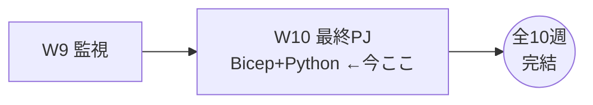
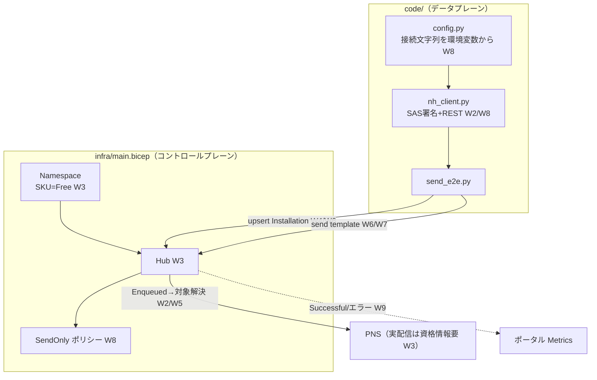
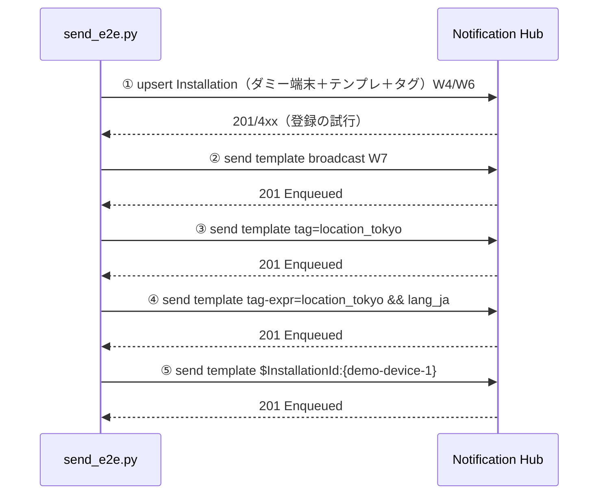
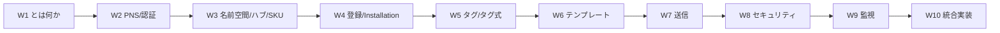

# Week 10 — 最終PJ：Bicep で Namespace＋Hub を作り、Python から REST でテンプレート通知をタグ指定送信する

> **Phase 4（総仕上げ）** | 学習プラン Week 10 / 10
> 学習目標：これまでの 9 週——PNS の仕組み（W2）・名前空間とハブ（W3）・登録（W4）・タグ（W5）・テンプレート（W6）・送信（W7）・セキュリティ（W8）・監視（W9）——を **1 本の動くコード**に束ねる。**Bicep** で Namespace＋Hub＋送信専用ポリシーを宣言的に作成し、**Python** から **SAS 署名 ＋ REST** でテンプレート通知を各ターゲットへ送る。実端末が無くても「送信の受付（Enqueued）とターゲット解決」を E2E で体験する。

---

## 0. 今週の位置づけ



最終週は新概念を足さず、**既習を統合して手を動かす**回。成果物は `infra/`（Bicep）と `code/`（Python）に置いた。

> **初学者向け用語補足：略語・用語の展開**
> - **Bicep**（バイセップ）= Azure のリソースを宣言的に記述する DSL（Domain-Specific Language＝特定用途言語）。ARM テンプレート（JSON）の読みやすい上位表現。
> - **IaC** = Infrastructure as Code（Infrastructure=基盤 / as=として / Code=コード）＝「基盤をコードで定義・再現する」手法。
> - **E2E** = End-to-End（端から端まで）＝入口から出口までを通しで動かす検証。
> - **REST** = REpresentational State Transfer＝HTTP でリソースを操作する API 様式。
> - **DSL** = Domain-Specific Language（特定用途に特化した言語）。
> - **データプレーン / コントロールプレーン** = データプレーン＝実データの操作（送信・登録）／コントロールプレーン＝リソースの管理（ハブ作成）。

---

## 1. 全体アーキテクチャ — 9 週分がどこに現れるか



| 週 | 最終PJ での現れ方 |
| --- | --- |
| W2 PNS/認証 | `nh_client.create_sas_token`（SAS 署名）・REST で PNS 素通し |
| W3 名前空間/ハブ/SKU | `main.bicep` の Namespace＋Hub（Free） |
| W4 登録/Installation | `upsert_installation`（冪等・`installationId` 指定） |
| W5 タグ/タグ式 | `tags=[...]`・送信の `location_tokyo && lang_ja` |
| W6 テンプレート | 端末テンプレ登録＋非依存メッセージ `{"message": ...}` 送信 |
| W7 送信 | broadcast / tag / tag-expr / `$InstallationId:` |
| W8 セキュリティ | 接続文字列を環境変数化・SendOnly ポリシー・SAS |
| W9 監視 | 戻り値 `201 Enqueued`・実配信はメトリクスで確認 |

---

## 2. インフラ（Bicep）— コントロールプレーン

`infra/main.bicep` の要点。

```bicep
resource namespace 'Microsoft.NotificationHubs/namespaces@2023-09-01' = {
  name: namespaceName
  location: location
  sku: { name: skuName }        // W3：SKU は名前空間に付く（Free）
}

resource hub 'Microsoft.NotificationHubs/namespaces/notificationHubs@2023-09-01' = {
  parent: namespace             // W3：Namespace ⊃ Hub の親子関係
  name: hubName
  location: location
  properties: {}
}

resource sendRule '...authorizationRules@2023-09-01' = {
  parent: hub
  name: 'SendOnly'
  properties: { rights: [ 'Send' ] }   // W8：最小権限
}
```

- **宣言的**：作りたい状態を書けば、Azure が差分を適用する（IaC）。手順書の手作業（W1〜W9 の az コマンド）を再現可能な 1 ファイルに凝縮。
- **親子で階層を表現**：`parent: namespace` が W3 の「名前空間 ⊃ ハブ」を、`parent: hub` が「ハブ ⊃ ポリシー」を表す。
- **最小権限**：既定の Full とは別に **Send 専用**ポリシーを宣言（W8 §6）。

デプロイ：

```bash
az group create --name rg-nh-week10 --location japaneast
az deployment group create -g rg-nh-week10 \
  --template-file infra/main.bicep --parameters infra/main.bicepparam
```

---

## 3. クライアント（Python）— データプレーン

送信（データプレーン）に**公式 Python SDK は無い**ため、REST を直接叩く。ここが W2・W8 の知識が最も効くところ。

### 3-1. SAS 署名（W8 の実装）

`nh_client.create_sas_token` が、W8 §1 の「鍵で署名した短命トークン」を実際に作る。

```python
def create_sas_token(resource_uri, key_name, key, ttl_seconds=3600):
    target = urllib.parse.quote_plus(resource_uri.lower()).lower()   # 小文字URLエンコード
    expiry = int(time.time()) + ttl_seconds                          # epoch秒の有効期限
    to_sign = f"{target}\n{expiry}".encode()                         # 署名対象文字列
    digest = hmac.new(key.encode(), to_sign, hashlib.sha256).digest()# HMAC-SHA256
    signature = urllib.parse.quote(base64.b64encode(digest))
    return f"SharedAccessSignature sr={target}&sig={signature}&se={expiry}&skn={key_name}"
```

- **鍵そのものは送らない**：鍵で署名した `sig` だけを送る（W8 のたとえ「実印は金庫、押した書類だけ渡す」）。
- **`se`（有効期限）**：トークンは短命。漏れても期限切れになる。
- **接続文字列は環境変数から**（`config.py`）：コードに直書きしない（W8）。

### 3-2. 送信（W6・W7 の実装）

```python
def send_template(self, message, tag_expression=None):
    url = f"{self.hub_uri}/messages/?api-version=2015-01"
    headers = {
        "Authorization": self._auth_header(),
        "Content-Type": "application/json;charset=utf-8",
        "ServiceBusNotification-Format": "template",   # W6：非依存メッセージ
    }
    if tag_expression:
        headers["ServiceBusNotification-Tags"] = tag_expression  # W5/W7：ターゲット
    return requests.post(url, headers=headers, data=json.dumps(message))
```

- **`Format: template`**＋ボディ `{"message": "..."}`＝プラットフォーム非依存送信（W6）。
- **`Tags` ヘッダー**にタグ/タグ式を入れて絞る。無ければブロードキャスト（W7）。

---

## 4. E2E デモ（`send_e2e.py`）の流れ



- **①登録**：ダミーハンドルで Installation を作る（W4 の冪等 upsert）。テンプレート `{"data":{"message":"$(message)"}}` を登録（W6）。実 PNS 資格情報が無いと 4xx になりうる＝学習では想定内。
- **②〜⑤送信**：同じ非依存メッセージを、ターゲットだけ変えて送る（W7 §6 の Test Send を**コードで**再現）。**201 = Enqueued**（W2 §4）。
- **確認**：`Location` ヘッダー（Standard のみ）にメッセージ ID（W7 §5）。実配信可否はポータルの Metrics（W9）で。

実行（詳細は `code/README.md`）：

```bash
pip install -r code/requirements.txt
export NH_CONNECTION_STRING='Endpoint=sb://...;SharedAccessKeyName=DefaultFullSharedAccessSignature;SharedAccessKey=...'
export NH_HUB_NAME='hub-demo'
python code/send_e2e.py
```

> **なぜ実配信まで通さないのか**：実機配信には ①実端末アプリ、②APNs/FCM v1 の実資格情報（W3 §4）、③実機で取得したハンドル、が要る。本 PJ は**学習で再現可能な範囲**（受付・ターゲット解決・SAS・メトリクス導線）に絞り、実機連携は「次の一歩」として README に道筋を残した。

---

## 5. 「次の一歩」— 本番へ広げるには

この PJ を実運用に育てるときの発展ポイント（既習との対応）。

| やりたいこと | どう広げるか | 参照週 |
| --- | --- | --- |
| 実機に届ける | ハブに APNs（`.p8`）/FCM v1（JSON）を設定し、実機ハンドルで登録 | W3 §4・W2 |
| クライアントから安全に登録 | 端末は Listen のみ、タグ厳密ならバックエンド登録 | W4・W8 |
| 送信サービスの権限最小化 | `SendOnly` ポリシー（本 Bicep で作成済み）を使う | W8 |
| 鍵を持たせない | Entra ID ＋ マネージド ID に移行 | W8 §7 |
| 予約・大規模・詳細計測 | Standard SKU（スケジュール/テレメトリ/一括I-O） | W3・W7・W9 |
| 障害を早期検知 | メトリクスにアラート（認証エラー>0 等） | W9 |

---

## 6. 自己チェック（総合）

1. Bicep の `parent:` は W3 のどの関係を表すか。SKU はどのリソースに付くか。
2. なぜ送信では SAS トークンを自前生成するのか。トークンに鍵そのものは含まれるか。
3. `ServiceBusNotification-Format: template` とボディ `{"message": ...}` は W6 の何を実現しているか。
4. `ServiceBusNotification-Tags` に `location_tokyo && lang_ja` を入れると誰に届くか（W5）。
5. 送信の戻り値 `201` は何を意味し、何を意味しないか（W2・W7）。実配信はどこで確認するか（W9）。
6. Installation の upsert が冪等だと、リトライで何が起きない（W4）か。
7. この PJ を実機配信に広げるには、最低何が追加で要るか（3 つ）。

---

## 7. 全10週の総括



- **W1–W2**：なぜ NH が要るか（PNS の 3 つの壁）と、その内部（ハンドル・認証・ペイロード）。
- **W3–W6**：器（名前空間/ハブ/SKU）→ 宛先（登録・タグ）→ 中身（テンプレート）。
- **W7–W9**：送る（各ターゲット）→ 守る（SAS・権限）→ 回す（メトリクス・障害切り分け）。
- **W10**：以上を Bicep＋Python の E2E に統合。

Azure Notification Hubs の学習カリキュラムはこれで完結。お疲れさまでした。実機・本番へ進むときは §5 の対応表と各週のハンズオンを起点にすること。

---

### 参考（出典）
- [Send a template notification（REST・ヘッダー・ボディ）](https://learn.microsoft.com/en-us/rest/api/notificationhubs/send-template-notification)
- [Common concepts（SAS トークン生成アルゴリズム）](https://learn.microsoft.com/en-us/rest/api/notificationhubs/common-concepts)
- [Create or overwrite an installation（Installation REST）](https://learn.microsoft.com/en-us/rest/api/notificationhubs/create-overwrite-installation)
- [Bicep で Notification Hubs リソース](https://learn.microsoft.com/en-us/azure/templates/microsoft.notificationhubs/namespaces)
