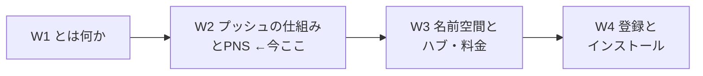
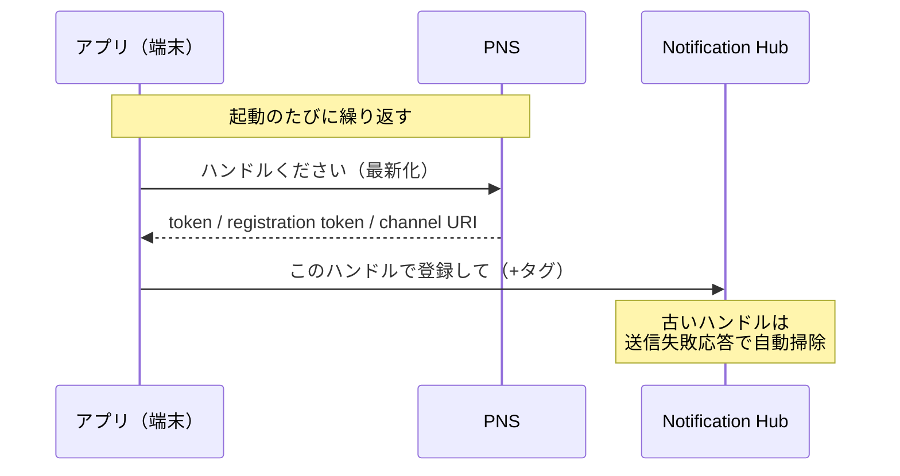
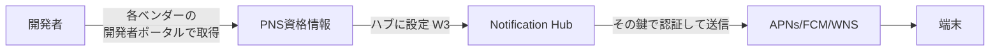
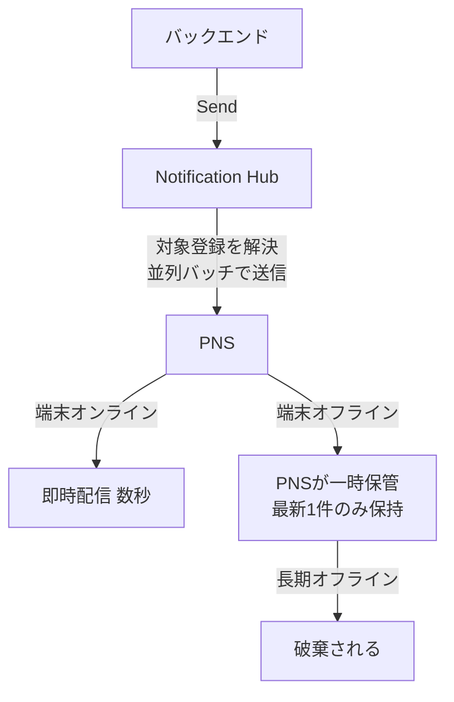
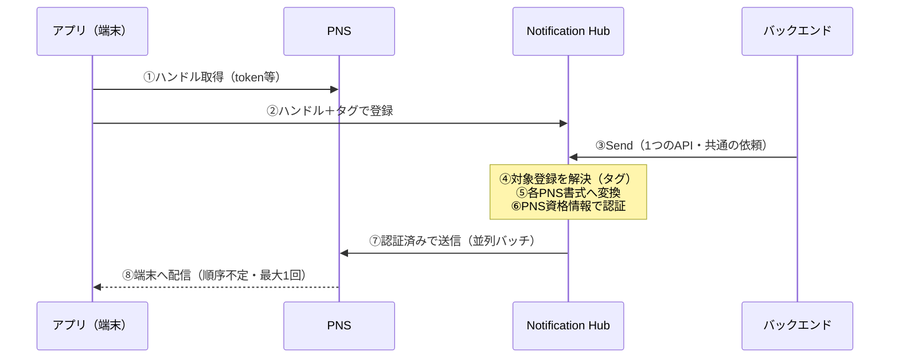

# Week 2 — プッシュの仕組みと PNS 深掘り：ハンドル・認証方式（証明書 / トークン / サービスアカウント）・ペイロード

> **Phase 1b** | 学習プラン Week 2 / 10
> 学習目標：W1 でざっくり見た「プッシュの 4 ステップ」を分解し、**ハンドルの正体**（token / registration token / channel URI）、**NH が各 PNS を叩くときの認証方式**（APNs の証明書 vs トークン `.p8`、FCM v1 のサービスアカウント、WNS の資格情報）、**通知の中身（ペイロード）**の形を理解する。これが W3「ハブに PNS 資格情報を設定する」の土台になる。

---

## 0. 今週の位置づけ



W1 では「バックエンドは端末へ直接送れない、必ず PNS を経由する」「NH がその PNS の差異を肩代わりする」ことを掴んだ。W2 では、その**肩代わりの中身**——NH が実際に各 PNS をどう叩くのか——を開けて見る。ここを理解すると、W3 でハブに鍵を設定する作業が「なぜその鍵が要るのか」腹落ちした状態でできる。

> **初学者向け用語補足：略語の展開**
> - **PNS** = Platform Notification System / Service（各 OS ベンダーの通知配信基盤）。
> - **APNs** = Apple Push Notification service（Apple 向け PNS）。
> - **FCM** = Firebase Cloud Messaging（Google/Android 向け PNS）。**v1** は現行の HTTP v1 API 世代。
> - **WNS** = Windows Notification Service（Windows 向け PNS）。
> - **JWT** = JSON Web Token（ジョット。JSON=データ形式 / Web / Token=署名付きの証票）＝「署名付きの短い証明書トークン」。APNs トークン認証で使う。
> - **JSON** = JavaScript Object Notation（`{ }` `[ ]` でデータ構造を表すテキスト形式）。
> - **payload（ペイロード）**＝通知の「中身」。実際に運ぶデータ本体（表示文言・バッジ・音・カスタムデータ）。

---

## 1. ハンドルの正体 — 「この端末のこのアプリ宛」を表す宛先

W1 で「端末は PNS からハンドルをもらい、それを預ける」と学んだ。このハンドルは **PNS ごとに名前も形も違う**。NH の登録は、公式いわく「PNS ハンドルをタグ（と場合によりテンプレート）に結びつけるもの」であり、この**ハンドルこそが配信の最終的な宛先**である。

> "A registration associates the Platform Notification Service (PNS) handle for a device with tags and possibly a template. The PNS handle can be a ChannelURI, or a device token / registration ID."
> （登録は、端末の PNS ハンドルをタグ・テンプレートに結びつける。PNS ハンドルは ChannelURI か、デバイストークン／登録 ID になりうる。出典：[Registration Management](https://learn.microsoft.com/en-us/azure/notification-hubs/notification-hubs-push-notification-registration-management)）

| PNS | ハンドルの呼び名 | 形のイメージ | 特徴 |
| --- | --- | --- | --- |
| **APNs** | device token | 64 進数の長い文字列（バイナリを 16 進化） | 端末＋アプリ＋環境ごとに一意 |
| **FCM** | registration token | 英数記号の長い文字列 | Firebase SDK が端末で発行 |
| **WNS** | channel URI | `https://...notify.windows.com/...` の URL | 有効期限があり切れる |

> **用語補足：ハンドル（handle）は"生もの"である**
> ハンドルは**恒久的ではない**。アプリ再インストール・OS 更新・一定期間で**失効（expire）する**。公式は「PNS のガイドライン上、デバイストークンはアプリ起動のたびに更新が必要」と述べる（W1 §3 のスケールの壁の一因）。だから端末は起動のたびに最新ハンドルを取り直し、登録を更新し続ける必要がある。NH は失効ハンドルへの送信時、PNS の応答を見て**該当登録を自動で掃除**してくれる。



---

## 2. NH → PNS の認証 — 「NH があなたのアプリの代理で送る」ための鍵

ここが W2 の核心である。NH が端末へ届けるには、まず **PNS に対して「私はこのアプリの正規の送信者だ」と認証**しなければならない。公式：

> "To send notifications to the respective push notification service, Notification Hubs must authenticate itself in the context of your application. ... You must add platform credentials to the Azure portal."
> （NH は各 PNS へ送るために、あなたのアプリの文脈で自分自身を認証しなければならない。…プラットフォームの資格情報を Azure ポータルに追加する必要がある。出典：[Diagnose dropped notifications](https://learn.microsoft.com/en-us/azure/notification-hubs/notification-hubs-push-notification-fixer)）

つまり **「アプリ開発者が各 PNS 開発者ポータルで鍵を取得 → その鍵を NH（ハブ）に設定 → NH がその鍵で PNS を叩く」** という代理構造だ。鍵の種類が PNS ごとに違うので、順に見る。



### 2-1. APNs — 「証明書認証」と「トークン認証」の 2 系統

Apple の APNs へ認証する方法は 2 つあり、どちらか一方を選ぶ。

| 方式 | 資格情報の実体 | 特徴 |
| --- | --- | --- |
| **証明書認証（Certificate）** | `.p12` ファイル（証明書＋秘密鍵。パスワード付き） | アプリ（Bundle ID）ごとに発行。**有効期限があり毎年更新**が要る。本番／サンドボックスで別物 |
| **トークン認証（Token）** | `.p8` ファイル（署名鍵）＋ Key ID＋Team ID | **失効しない**（更新不要）。1 つの鍵を**同一開発者の複数アプリで共用可**。新規はこちらが推奨 |

> **用語補足：`.p12` と `.p8` の違い（たとえ）**
> - **`.p12`（証明書）**＝「アプリ 1 個ごとに市役所で発行する印鑑証明」。毎年更新に行かねばならず、本番用と練習用（サンドボックス）で別の証明書。
> - **`.p8`（トークン鍵）**＝「開発者本人の実印そのもの」。これ 1 本あれば、その開発者の全アプリの書類に押せて、しかも**期限切れがない**。NH はこの鍵で **JWT（署名付きトークン）**を作って APNs に提示する。
> - APNs の環境は **Production（本番）と Sandbox（開発）**が完全に分かれる。公式は「本番用とテスト用で別のハブを維持せよ」「異なる種類の証明書を同一ハブに混ぜるな（通知失敗の原因）」と強く警告している。

> **APNs 環境の注意（公式）**："You must maintain two different hubs: one for production and another for testing. ... Don't try to upload different types of certificates to the same hub. It will cause notification failures."（本番用とテスト用で別のハブを維持せよ。異なる種類の証明書を同一ハブにアップロードするな。通知失敗を招く）

### 2-2. FCM — 現行は「FCM v1（サービスアカウント）」

Android 向けは世代交代が起きている。**旧 GCM / FCM Legacy（サーバーキー方式）は提供終了**し、現行は **FCM v1**。FCM v1 では、Firebase プロジェクトの **サービスアカウントの秘密鍵（JSON ファイル）** を資格情報として使う。

- Firebase コンソール → プロジェクト設定 → サービスアカウント → **秘密鍵（JSON）を生成**。
- その JSON を NH（ハブ）に設定すると、NH は中の鍵で認証して FCM v1 API を叩く。
- クライアント側は Firebase の **Project ID** などの構成を持つ。

> **用語補足：サービスアカウント（service account）とは**
> 人間ではなく**プログラムに与える"機械用アカウント"**。Firebase プロジェクトに紐づくこのアカウントの秘密鍵を NH に持たせることで、「NH＝このプロジェクトの正規の送信者」として FCM が認めてくれる。※古い資料には FCM の "server key" 方式の記述が残るが、これはレガシーで、新規は v1（サービスアカウント JSON）を使う（出典：[FCM migration](https://learn.microsoft.com/en-us/azure/notification-hubs/notification-hubs-gcm-to-fcm)）。

### 2-3. WNS — パッケージ SID とシークレット

Windows（WNS）は、Microsoft のパートナーセンター／アプリ登録から得る **Package SID** と **クライアントシークレット**を資格情報として使う。NH はこれで WNS に認証し、channel URI 宛に送る。

> **まとめ：PNS ごとの鍵**
> | PNS | NH に設定する資格情報 |
> | --- | --- |
> | APNs | `.p12`（証明書）**または** `.p8`＋Key ID＋Team ID（トークン） |
> | FCM v1 | サービスアカウントの秘密鍵 JSON |
> | WNS | Package SID ＋ クライアントシークレット |

---

## 3. ペイロード — 通知の「中身」は PNS ごとに書式が違う

NH に送信を頼むと、NH は各 PNS の**ネイティブ書式**へ翻訳して届ける。書式は PNS ごとに異なる。ここでは「生の形」を眺めて、W6 のテンプレートが**なぜ嬉しいのか**の伏線を張る。

### 3-1. APNs のペイロード（JSON）

```json
{
  "aps": {
    "alert": { "title": "速報", "body": "試合が始まりました" },
    "badge": 1,
    "sound": "default"
  },
  "matchId": "12345"
}
```

- `aps` が Apple 予約のブロック。`alert`（表示文言）・`badge`（アイコン右上の数字）・`sound`（音）。
- `aps` の外（`matchId` など）は**アプリが自由に使えるカスタムデータ**。

### 3-2. FCM v1 のペイロード（JSON）

```json
{
  "message": {
    "notification": { "title": "速報", "body": "試合が始まりました" },
    "data": { "matchId": "12345" }
  }
}
```

- `notification`＝OS が画面に出す標準通知。`data`＝アプリが受け取るカスタムデータ（サイレント処理にも使う）。

### 3-3. WNS のペイロード（XML）

```xml
<toast>
  <visual>
    <binding template="ToastGeneric">
      <text>速報</text>
      <text>試合が始まりました</text>
    </binding>
  </visual>
</toast>
```

- WNS だけ **XML**。トースト（バナー）／タイル／バッジ等の種類を `X-WNS-Type` ヘッダーで指定する。

> **ここが伏線**：同じ「速報：試合が始まりました」を全プラットフォームに出すのに、**3 通りの別書式**を用意せねばならない。これは W1 §3「プラットフォーム依存の壁」の具体像だ。NH の**テンプレート（W6）**は、この差を吸収して「1 回の送信であらゆる端末に正しい書式で届ける」仕組みである。

> **用語補足：サイレント通知（silent push）の作り方**
> APNs は `alert` を省き `content-available: 1` を付ける、FCM は `notification` を付けず `data` だけにする、といった形で「画面に出さず、アプリだけ起こす」通知にする。W1 で触れた push-to-pull パターンの実体。

---

## 4. 送信の"届き方"の性質 — 順序・重複・オフライン

NH に送信を依頼した後の挙動には、知っておくべき性質がある（W7・W9 の障害切り分けの土台）。

> **用語補足：バッチ（batch）＝「登録の束」で送る**
> **バッチ**とは「ひとまとめ・一束」の意で、対象を 1 件ずつでなく**ある塊に区切ってまとめて処理する単位**を指す（語源は「一度に焼くパンの一釜分」）。対義は 1 件ずつ即処理する**ストリーム／リアルタイム**。
> NH は、送信対象の登録が数百万件あっても、**数百〜数千件ずつの「束（バッチ）」に区切り、複数の束を並列で** PNS へ流す。公式："Notification Hubs pushes notifications **split across multiple batches** of registrations."（通知を複数のバッチに分割して送る）。これは W1 §3 の「スケールの壁」への対処である。
> - **たとえ**：100 万通の郵便を 1 通ずつ窓口に持ち込むのでなく、**数千通ずつ箱（バッチ）に詰めて複数の窓口へ同時**に持ち込む。速いが、どの箱が先にさばかれるかは窓口任せ＝**順序不定**。
> - この「束＋並列」から、下記の**順序不定**と、W2で触れた「**1つの束でエラーが出ると束ごと落ちて再試行**（特に APNs）」という挙動が生じる。
> - ※同じ `azure` リポジトリの **`batch/`（Azure Batch）は別サービス**（大量計算ジョブを VM プールで並列実行する HPC 系）で、この"バッチ送信"とは無関係。



- **順序は保証されない**：公式いわく「NH はバッチを並列処理するため、配信順序は保証されない」。
- **最大 1 回配信（at-most-once）**：NH は重複排除を試み、「1 端末には最大 1 回」を狙う。**"必ず届く"保証ではない**点に注意（プッシュ通知は本質的にベストエフォート）。
- **オフライン時は最新 1 件だけ**：端末オフライン中に複数送ると、PNS は最後の 1 件だけ残し前のを捨てる。これを **APNs では coalescing（コアレシング）、FCM では collapsing（コラプシング、collapse key を使う）** と呼ぶ。
- **キューイングの誤解に注意**：SDK/REST の送信呼び出しが成功を返しても、それは「NH のキューに入った（Enqueued）」だけで、PNS への配信成否まではその場では分からない。詳細な結果は**テレメトリ／PNS フィードバック**（W9）や、デバッグ用の **Test Send（EnableTestSend）**で確認する。

> **用語補足：至上 1 回（at-most-once）と冪等（idempotent）**
> - **at-most-once**＝「0 回か 1 回」。重複はしないが、ゼロ（届かない）はありうる、という配信モデル。
> - **冪等（idempotent／べきとう）**＝「同じ操作を何回やっても結果が同じ」。W4 で学ぶ **Installation** は登録が冪等で、リトライしても重複登録が起きない（Registration より優れる理由の一つ）。

---

## 5. 全体像の再構成 — W1 の 4 ステップに"認証"を書き足す

W1 の図に、今週学んだ**認証**と**書式変換**を重ねると、NH の仕事の全貌はこうなる。



W3 以降は、この図の**部品を 1 つずつ本物にしていく**：④⑤の設定単位＝ハブ（W3）、②の登録＝Registration/Installation（W4）、タグ解決（W5）、⑤の書式変換＝テンプレート（W6）、③の送信 API（W7）、⑥⑦の認証の権限管理（W8）。

---

## 6. ハンズオン — 資格情報の"置き場所"を眺め、ペイロードを手で組む

今週も実端末は不要。**設定画面の在り処**と**書式の違い**を目で確認する。

### 6-1. ハブの資格情報設定タブを見る（設定はしない）

W1 で作ったのと同じ手順で名前空間＋ハブを作る（Free）。ポータルでハブを開き、左メニューの各 PNS 設定を**開くだけ**開いてみる。

- **Apple (APNs)**：`Certificate`（`.p12`）か `Token`（`.p8`／Key ID／Team ID）を選ぶ UI があること、`Application Mode` に **Production / Sandbox** の切替があることを確認する。
- **Google (FCM v1)**：サービスアカウント JSON を貼る欄があることを確認する。
- **Windows (WNS)**：Package SID／Secret 欄があることを確認する。

> 実際の鍵取得（Apple Developer / Firebase）は端末アプリを持つ W3 のハンズオンで扱う。今週は「どの鍵をどこに入れるのか」の地図が描ければよい。

### 6-2. ペイロードを手で書き分ける（紙上演習）

「**タイトル『お知らせ』／本文『メンテナンスは 23 時開始』／バッジ 1**」を、APNs（JSON）・FCM v1（JSON）・WNS（XML）の 3 書式で自分で書いてみる。§3 の例を参照し、`aps` / `message.notification` / `<toast>` の器の違いを手で体感する。これが W6 で「テンプレートが差を吸収する」ありがたみの下地になる。

### 6-3. 後片付け

```bash
az group delete --name rg-nh-week1 --yes --no-wait
```

---

## 7. 自己チェック

1. ハンドルとは何か。APNs / FCM / WNS でそれぞれ何と呼ばれ、なぜ「起動のたびに更新」が必要なのか。
2. NH が端末へ届ける前に、まず何をしなければならないか（PNS に対して）。その"鍵"は誰がどこで取得するか。
3. APNs の **証明書認証（`.p12`）** と **トークン認証（`.p8`）** の違いを 2 つ以上挙げよ。どちらが更新不要か。
4. FCM の現行世代は何と呼ばれ、NH に設定する資格情報は何か（レガシーの "server key" と何が違うか）。
5. 同じ「速報」を全プラットフォームに出すのに、生のペイロードだと何が面倒か。それを解決するのが W6 の何か。
6. 「送信 API が成功を返した」ことは「端末に届いた」ことを意味するか。理由とともに答えよ。
7. **at-most-once** と **coalescing/collapsing** を説明せよ。

---

## 8. 次週予告（W3：名前空間とハブ・料金）

W3 では、これまで「作るだけ」だった **Namespace（名前空間）と Hub（ハブ）**の関係を正式に学ぶ。1 つの名前空間に複数ハブを置く設計、**Free / Basic / Standard** の 3 つの SKU（料金プラン）の違い（含まれるプッシュ数・課金・Standard 限定機能＝テレメトリや一括エクスポート）、そして本週で地図を描いた **PNS 資格情報を実際にハブへ設定する**ところまでを扱う。ここまでで「送る準備」が完成し、W4 の登録に進める。

---

### 参考（出典）
- [Registration Management（登録とハンドル）](https://learn.microsoft.com/en-us/azure/notification-hubs/notification-hubs-push-notification-registration-management)
- [Diagnose dropped notifications（認証・配信の性質）](https://learn.microsoft.com/en-us/azure/notification-hubs/notification-hubs-push-notification-fixer)
- [Google Firebase Cloud Messaging migration（FCM v1）](https://learn.microsoft.com/en-us/azure/notification-hubs/notification-hubs-gcm-to-fcm)
- [What is Azure Notification Hubs?（概要）](https://learn.microsoft.com/en-us/azure/notification-hubs/notification-hubs-push-notification-overview)
