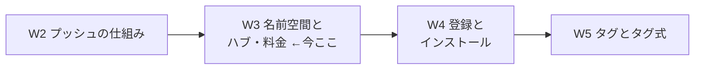
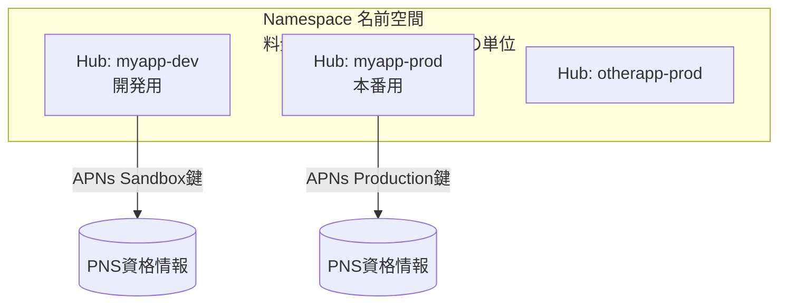
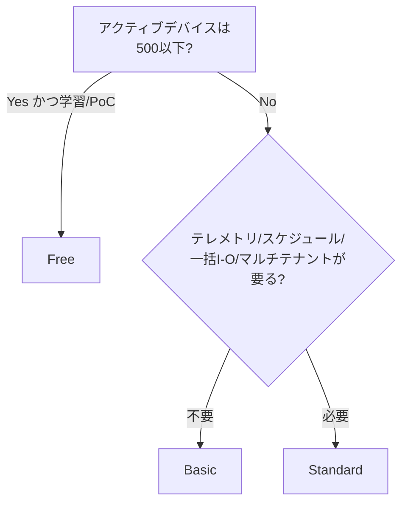
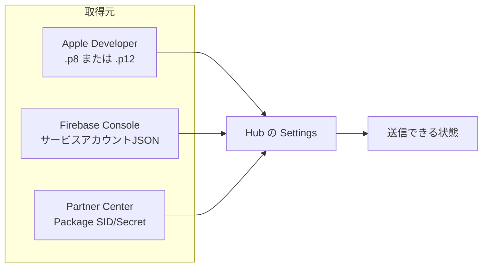

# Week 3 — 名前空間とハブ・料金：Namespace と Hub の関係、Free/Basic/Standard の 3 SKU、PNS 資格情報をハブに設定する

> **Phase 1c** | 学習プラン Week 3 / 10
> 学習目標：**Namespace（名前空間）と Hub（ハブ）**の関係と使い分けを理解する。**Free / Basic / Standard** の 3 つの SKU（料金プラン）の違い——含まれるプッシュ数・アクティブデバイス数・Standard 限定機能——を押さえ、「どのプランを選ぶか」を判断できるようになる。そして W2 で地図を描いた **PNS 資格情報を実際にハブへ設定する**ところまでを扱い、「送る準備」を完成させる。

---

## 0. 今週の位置づけ



W1・W2 で「NH が PNS を肩代わりする仕組み」を理解した。W3 は、その NH を**入れ物として正しく用意する**回である。具体的には ①器の階層（Namespace ⊃ Hub）、②器のグレード（料金プラン）、③器に鍵を差す（PNS 資格情報の設定）。ここが済めば W4 の「端末を登録する」に進める。

> **初学者向け用語補足：略語の展開**
> - **SKU** = Stock Keeping Unit（Stock=在庫 / Keeping=管理 / Unit=単位）＝もとは小売の「在庫管理単位（品番）」。Azure では「**プラン種別・グレード**」の意で使う。NH では Free / Basic / Standard の 3 つ。
> - **SLA** = Service Level Agreement（Service=サービス / Level=水準 / Agreement=合意）＝「サービス品質保証。可用性◯%を保証する約束」。
> - **DR** = Disaster Recovery（Disaster=災害 / Recovery=復旧）＝「災害復旧。リージョン障害からの復旧の仕組み」。
> - **AZ** = Availability Zone（Availability=可用性 / Zone=区画）＝「可用性ゾーン。1 リージョン内の物理的に分離したデータセンター群」。
> - **PNS** = Platform Notification Service（各 OS ベンダーの通知配信基盤。W1・W2 参照）。

---

## 1. Namespace と Hub の関係 — 「器」と「窓口」の 2 階層

NH のリソースは 2 階層でできている。



| リソース | 役割 | 単位になるもの |
| --- | --- | --- |
| **Namespace（名前空間）** | ハブを束ねる**器**。ここに料金プラン（SKU）が付く | **課金・SKU・グローバル一意な DNS 名**（`<ns>.servicebus.windows.net`）の単位 |
| **Hub（ハブ）** | 1 つの**アプリ／環境**に対応する通知の**窓口**。PNS 資格情報はここに設定 | **PNS 資格情報・登録・送信**の単位 |

覚え方：**「名前空間 ＝ 料金と名前の単位」「ハブ ＝ アプリと鍵の単位」**。SKU は名前空間に付くので、同じ名前空間内のハブは**同じプランを共有**する。

### 1-1. なぜハブを分けるのか（設計の勘所）

1 つの名前空間に複数ハブを置ける。実務では次のように**環境・アプリごとにハブを分ける**のが定石。

- **本番用ハブと開発（サンドボックス）用ハブを分ける**。W2 で見たとおり、APNs は **Production と Sandbox で鍵が別物**であり、公式は「本番用とテスト用で別のハブを維持せよ。異なる種類の証明書を同一ハブに混ぜるな（通知失敗の原因）」と明言する。
- **アプリごとにハブを分ける**。ハブ＝アプリ 1 つ分の PNS 鍵の置き場なので、別アプリは別ハブが自然。

> **用語補足：マルチテナンシー（multi-tenancy）**
> multi=複数 / tenancy=テナント（入居者）＝「1 つの基盤を複数の顧客・アプリで間借りする構成」。SaaS で「顧客ごとにハブを大量に切って管理したい」といった用途で使う。後述のとおり **Standard SKU 限定**の性格が強い機能。

---

## 2. 料金プラン（SKU）— Free / Basic / Standard の 3 段

NH の SKU は 3 つ。選択は主に **①アクティブデバイス数**と **②必要機能（Standard 限定機能を使うか）**で決まる。

| 観点 | **Free** | **Basic** | **Standard** |
| --- | --- | --- | --- |
| 含まれるプッシュ数／月 | 100 万 | 1,000 万 | 1,000 万 |
| アクティブデバイス数（上限/含む） | **500** | **20 万** | **1,000 万** |
| 追加プッシュ課金 | なし（超過不可） | あり（従量） | あり（従量） |
| リッチ テレメトリ | ✕ | ✕ | **✔** |
| スケジュール配信 | ✕ | ✕ | **✔** |
| 一括エクスポート/インポート | ✕ | ✕ | **✔** |
| マルチテナンシー | ✕ | ✕ | **✔** |
| 用途の目安 | 学習・PoC | 小〜中規模の本番 | 大規模・運用機能が必要な本番 |

（出典：[Notification Hubs pricing](https://azure.microsoft.com/en-us/pricing/details/notification-hubs/)。**金額はリージョン・通貨で変わる**ため、実際の単価は必ず料金ページで確認すること。数値は 2026-08 時点。）

> **用語補足：アクティブデバイス（active device）とは**
> 「その月に通知の対象になりうる、有効な登録を持つ端末数」。ここが SKU 選定の**最重要軸**。学習なら 500（Free）で十分だが、本番で 500 を超えるなら Basic 以上が必要になる。

> **用語補足：「Standard 限定機能」の中身（この後の週で扱う）**
> - **リッチ テレメトリ**＝送信結果の詳細な集計・PNS フィードバックの API 取得（W9）。※ W2 で触れた「一括エクスポート/インポートやテレメトリ API は Standard 限定。Free/Basic で使うと SDK は例外、REST は HTTP 403」。
> - **スケジュール配信**＝指定時刻に送る予約（W7）。
> - **一括エクスポート/インポート**＝登録を大量に出し入れ（DR のバックアップ等でも使う）。
> - つまり「**運用を本気でやる**なら Standard」。学習の本教材は基本 **Free** で進める。

### 2-1. SKU の選び方（決定木）



---

## 3. 可用性と災害復旧 — 器の"堅牢さ"（概観）

本番で使うなら、器の堅牢さも SKU 選定に絡む。今週は概観にとどめ、詳細は W9 で扱う。

- **可用性ゾーン（AZ）**：AZ 対応リージョンでは、NH は既定で**ゾーン冗長**にデプロイされ、登録データとメタデータが全ゾーンに複製される。ゾーン障害時は自動で健全ゾーンに再配置（自己修復）。※**新規名前空間でのみ有効化可**、後から無効化不可。特定 SKU のみ対応。
- **災害復旧（DR）**：リージョン単位の障害に備え、NH は**メタデータ**（ハブ名・接続文字列など）をクロスリージョン複製する。ただし公式いわく「**DR で失われるのは登録データ（registration data）だけ**」——メタデータは守られるが、**登録データは自前でバックアップ**が要る。

> **用語補足：メタデータ と 登録データ の違い**
> - **メタデータ**＝ハブそのものの構成（名前・接続文字列・PNS 設定など）。DR で複製される。
> - **登録データ**＝どの端末がどのタグで登録しているか（W4 の中身）。**DR では失われる**ので、ストレージや別リージョンのハブへ自前で複製しておく。**Installation は自前の一意 ID を指定できるため複製に向く**（W4 で Installation を推す理由の一つ）。

---

## 4. PNS 資格情報をハブに設定する — 「送る準備」の総仕上げ

W2 §2 で「どの鍵をどこに入れるか」の地図を描いた。W3 でそれを**実際に差し込む**。ポータルでハブを開き、各 PNS の設定を行う（**アプリ側の鍵取得**は各ベンダー開発者ポータルで別途必要）。



| PNS | ポータルのタブ | 入れるもの（W2 の復習） |
| --- | --- | --- |
| **Apple (APNs)** | Apple (APNS) | **トークン**：`.p8`＋Key ID＋Team ID／または**証明書**：`.p12`。`Application Mode` で **Production / Sandbox** を選ぶ |
| **Google (FCM v1)** | Google (FCM v1) | Firebase の**サービスアカウント秘密鍵 JSON** |
| **Windows (WNS)** | Windows (WNS) | **Package SID** ＋ **クライアントシークレット** |

> **設定時の鉄則（W2 の警告の再掲）**：APNs は**本番用ハブと開発用ハブを分ける**。`Application Mode` の Production/Sandbox と、アップした鍵の種類が食い違うと通知が落ちる。混在させてしまったらハブを作り直すのが確実。

---

## 5. ハンズオン — 名前空間とハブを作り、SKU を意識し、資格情報タブを設定形式で確認

今週も実端末・実鍵は不要。**SKU の指定**と**資格情報の入れ場所**を、CLI とポータルで確認する。

### 5-1. Free の名前空間とハブを作る（SKU を明示）

```bash
az group create --name rg-nh-week3 --location japaneast

az notification-hub namespace create \
  --resource-group rg-nh-week3 \
  --name nhns-<yourname>-w3 \
  --location japaneast \
  --sku Free
```

> **読み方**：`--sku Free`＝料金プランを Free に。ここを `Basic` / `Standard` に変えるとプランが上がる。SKU は**名前空間**に付く（ハブではない）ことを、このコマンドの位置で確認する。

```bash
az notification-hub create \
  --resource-group rg-nh-week3 \
  --namespace-name nhns-<yourname>-w3 \
  --name hub-dev \
  --location japaneast
```

### 5-2. SKU を確認・比較する

```bash
az notification-hub namespace show \
  --resource-group rg-nh-week3 \
  --name nhns-<yourname>-w3 \
  --query "sku"
```

> `sku.name` に `Free` と出る。ここを起点に、ポータルの名前空間 → **Pricing tier（価格レベル）** を開き、Free/Basic/Standard の**含まれるデバイス数・プッシュ数・限定機能**の差を UI 上で見比べる。

### 5-3. 資格情報タブを開く（W2 との接続）

ポータルでハブ `hub-dev` を開き、左メニューの **Apple (APNS) / Google (FCM v1) / Windows (WNS)** を開き、§4 の表のとおり**入力欄の形**を確認する。特に Apple タブで **Token / Certificate の切替**と **Production / Sandbox** の選択肢があることを見る（実鍵の投入は W4 以降）。

### 5-4. 後片付け

```bash
az group delete --name rg-nh-week3 --yes --no-wait
```

---

## 6. 自己チェック

1. **Namespace と Hub** はそれぞれ何の単位か。「料金プランが付くのはどちらか」を含めて説明せよ。
2. なぜ本番用と開発用でハブを分けるのか。APNs の性質を根拠に説明せよ。
3. **Free / Basic / Standard** の 3 SKU を、アクティブデバイス数と「Standard 限定機能」で区別せよ。学習用途ならどれか。
4. 「Standard 限定機能」を 3 つ挙げよ。Free/Basic でテレメトリ API を叩くとどうなるか。
5. DR（災害復旧）で **失われるのは何か・守られるのは何か**。登録データはどう守るか。
6. ハブに設定する PNS 資格情報を、Apple / Google / Windows それぞれ何か答えよ。

---

## 7. 次週予告（W4：登録とインストール）

「送る準備」が整ったので、W4 は**端末側の登録**に入る。**Registration（登録）**と、その進化版 **Installation（インストール）**の 2 方式を比較し、なぜ公式が Installation を「最新かつ最良（latest and best）」と呼ぶのか——**冪等性**（リトライ安全）・`$InstallationId:` タグでの直接送信・**部分更新（JSON-Patch）**——を理解する。さらに「端末から直接登録」と「バックエンド経由で登録」の設計トレードオフ（W8 のセキュリティに繋がる）も扱う。

---

### 参考（出典）
- [Notification Hubs pricing（SKU・料金）](https://azure.microsoft.com/en-us/pricing/details/notification-hubs/)
- [Reliability in Azure Notification Hubs（AZ・DR）](https://learn.microsoft.com/en-us/azure/reliability/reliability-notification-hubs)
- [Diagnose dropped notifications（PNS 資格情報・APNs 環境の分離）](https://learn.microsoft.com/en-us/azure/notification-hubs/notification-hubs-push-notification-fixer)
- [What is Azure Notification Hubs?（概要）](https://learn.microsoft.com/en-us/azure/notification-hubs/notification-hubs-push-notification-overview)
