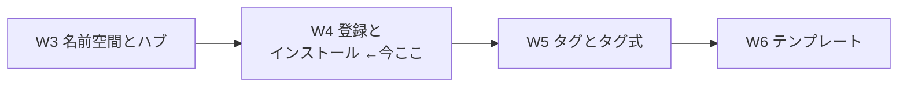
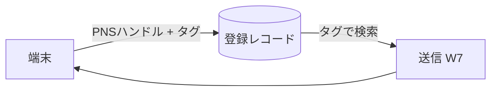
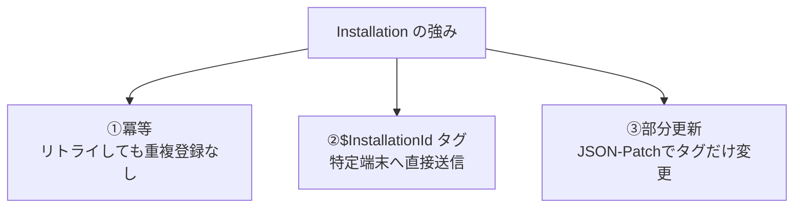
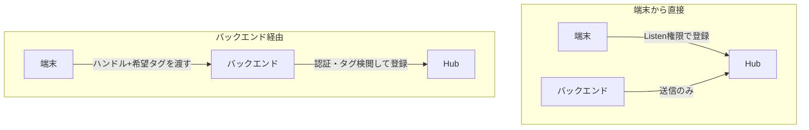

# Week 4 — 登録とインストール：Registration と Installation、冪等性・直接送信・部分更新、端末登録 vs バックエンド登録

> **Phase 2a** | 学習プラン Week 4 / 10
> 学習目標：端末をハブに登録する 2 つの方式——**Registration（登録）**と、その進化版 **Installation（インストール）**——を理解し、なぜ公式が Installation を「最新かつ最良（latest and best）」と呼ぶのか（**冪等性**・`$InstallationId:` での直接送信・**JSON-Patch による部分更新**）を説明できるようになる。さらに「端末から直接登録」と「バックエンド経由で登録」の設計トレードオフ（W8 のセキュリティへ繋がる）を掴む。

---

## 0. 今週の位置づけ



W3 までで「送る準備（ハブに鍵を差す）」が完成した。W4 は、その反対側——**端末が『私はここにいる、この宛先で受け取る』とハブに名乗り出る**行為＝**登録**を扱う。登録が無ければ、送信対象（ターゲット）が存在せず、通知は誰にも届かない（W1 のテスト送信で Registrations = 0 だったのはこのため）。

> **初学者向け用語補足：略語・用語の展開**
> - **Registration（登録）** = 端末の PNS ハンドルを、タグ（と任意でテンプレート）に結びつけた 1 レコード。
> - **Installation（インストール）** = 登録の拡張版。プッシュ関連プロパティ一式を持つ「最新かつ最良」の登録方法。
> - **冪等（idempotent／べきとう）** = 同じ操作を何回繰り返しても結果が同じになる性質（W2 §4 で既出）。
> - **CRUD**（クラッド）= Create / Read / Update / Delete（作成・読取・更新・削除）＝データ操作の基本 4 種。
> - **JSON-Patch** = JSON の**一部分だけ**を更新する標準記法（RFC 6902）。全体を送り直さずに「この項目だけ変える」を表す。
> - **PNS ハンドル** = token / registration token / channel URI（W2 §1 参照）。

---

## 1. 「登録」とは何か — 宛先を作る行為

公式の定義（W2 でも引用）：

> "Device registration with a Notification Hub is accomplished using a **Registration** or **Installation**. A registration associates the PNS handle for a device with tags and possibly a template."
> （ハブへの端末登録は Registration か Installation で行う。登録は、端末の PNS ハンドルをタグ・テンプレートに結びつける。出典：[Registration Management](https://learn.microsoft.com/en-us/azure/notification-hubs/notification-hubs-push-notification-registration-management)）

つまり登録とは、**「この PNS ハンドル（宛先）を、これらのタグ（宛名ラベル）で呼べるようにする」**という対応付けを 1 件、ハブに作ること。送信（W7）はこのタグを頼りに宛先を解決する（W5）。



> **重要な性質：登録は"はかない（transient）"**
> 公式いわく「登録は transient（一時的）なので、その端末に必要な現在のタグは、信頼できるストア側に必ず持っておくこと」。ハンドルは失効し（W2 §1）、登録も上書き・消滅しうる。**登録＝真実の源ではなく、あくまで PNS への配送のための"揮発しやすい写し"**、と捉える。既定では登録もインストールも**有効期限なし（expire しない）**だが、失効ハンドルへの送信時に NH が自動で掃除する。

---

## 2. Registration の 2 種類 — ネイティブ と テンプレート

「Registration」方式には 2 タイプある。

| タイプ | 中身 | 送信時の挙動 |
| --- | --- | --- |
| **ネイティブ登録（native registration）** | PNS ハンドル＋タグ | 送信側が**その PNS のネイティブ書式**（APNs JSON 等）で送る。プラットフォームごとに送り分けが要る |
| **テンプレート登録（template registration）** | PNS ハンドル＋タグ＋**テンプレート本文** | 端末ごとに登録時「この器で受けたい」を宣言。送信側は**プラットフォーム非依存の値**を送るだけで、NH が各書式へ変換 |

テンプレートの詳細と嬉しさは **W6** で深掘りするが、ここでは「登録の時点で、ネイティブ書式で受けるか／テンプレート変換で受けるかを選べる」ことだけ掴む。W2 §3 で見た「同じ速報に 3 書式」の面倒を、テンプレート登録が吸収する。

> **用語補足：ネイティブ（native）とは**
> 「その OS 本来の・素の」の意。ネイティブ書式＝APNs なら `aps{}` の JSON、WNS なら `<toast>` の XML といった、**PNS が本来受け付ける生の形**（W2 §3）。

---

## 3. Installation — 「最新かつ最良」の登録方法

公式は Installation をこう位置づける。

> "An *installation* is an enhanced registration that includes a set of push related properties. It's the **latest and best approach** to registering your devices."
> （インストールは、プッシュ関連プロパティ一式を含む拡張版の登録であり、端末を登録する最新かつ最良の方法である。出典：同上）

### 3-1. Installation の形（主なプロパティ）

```json
{
  "installationId": "joe93developer-device1",
  "platform": "apns",
  "pushChannel": "<APNsのdevice token>",
  "tags": ["follows_RedSox", "location_Boston"],
  "templates": {
    "welcome": { "body": "{...PNS書式のテンプレ...}", "tags": ["..."] }
  }
}
```

| プロパティ | 意味 |
| --- | --- |
| `installationId` | **開発者が決める端末の一意 ID**（GUID など）。これが Installation の要 |
| `platform` | `apns` / `fcm` / `wns` など |
| `pushChannel` | PNS ハンドル（token / registration token / channel URI） |
| `tags` | 宛名ラベルの配列（W5） |
| `templates` | この端末に紐づくテンプレート群（名前 → 本文＋タグ。W6） |

### 3-2. Installation が Registration より優れる 3 点（公式の "key advantages"）



1. **冪等（idempotent）**："Creating or updating an installation is fully idempotent. You can retry it without any concerns about duplicate registrations."
   → 同じ `installationId` で作成/更新を**何度投げても 1 件**。ネットワーク再送で**同じ端末が二重登録される事故が起きない**。Registration では、端末側で登録 ID を保存し忘れると重複登録が起きうる（公式のサンプルが「既存を消してから作り直す」防御コードを書いているのはこのため）。

2. **`$InstallationId:` タグで特定端末へ直接送信**：Installation は `$InstallationId:{INSTALLATION_ID}` という特殊タグ形式をサポートし、**追加コードなしに 1 端末を狙い撃ちできる**。例：`joe93developer` を設定した端末には `$InstallationId:{joe93developer}` タグ宛に送ればよい。

3. **部分更新（partial update / JSON-Patch）**：`PATCH` メソッド＋JSON-Patch 標準で、**タグだけを差分更新**できる。"You don't have to pull down the entire registration and then resend all the previous tags."（登録全体を取り直して全タグを送り直す必要がない）。Registration は「更新＝全体を上書き」なので、この差は運用でこたえる。

> **用語補足：JSON-Patch（RFC 6902）とは**
> JSON の一部だけを変える操作を、`{"op":"add","path":"/tags","value":"vip"}` のような**操作の配列**で表す標準。「全部送り直す（PUT）」に対し「ここだけ足す/消す/置換（PATCH）」ができる。タグの付け外しが多い運用ほど効いてくる。

> **注意点（公式）**：Installation の API は **Baidu（中国向け Android）を未サポート**（Registration API は対応）。中国配信が要件なら方式選択に影響する。

### 3-3. どちらを使うべきか

| | Registration | **Installation（推奨）** |
| --- | --- | --- |
| 冪等性 | ✕（重複対策を自前で） | **✔ 完全に冪等** |
| 特定端末への直接送信 | 自前でタグ設計 | **✔ `$InstallationId:` で標準対応** |
| 部分更新 | ✕（全体上書き） | **✔ JSON-Patch** |
| 端末一意 ID の指定 | 登録 ID は NH 発番 | **✔ 自分で `installationId` を決められる**（DR 複製に有利：W3 §3） |
| Baidu 対応 | ✔ | ✕ |

**結論：特別な理由（Baidu 等）が無い限り Installation を使う。** 本教材の最終 PJ（W10）も Installation 前提で組む。

---

## 4. 端末から登録 vs バックエンドから登録 — 設計のトレードオフ

登録を「誰が実行するか」で 2 パターンある。ここは **W8（セキュリティ）**の伏線でもある。



### 4-1. 端末から直接登録

- 端末が PNS からハンドルを取り、**ハブへ直接**登録する。最もシンプル。
- 端末には **Listen 権限のみ**を渡す（送信権限は渡さない。W8）。
- **弱点（公式）**：
  1. **タグ更新はアプリ起動中しかできない**。例：ある端末が新タグ `Seahawks` を足しても、別端末はアプリを再起動するまでそのタグの通知を受けない。「複数端末で共有するタグ」はバックエンド管理が望ましい。
  2. **アプリは改ざんされうる**ため、特定タグ（例：`admin` 宛）への登録を悪用されないよう**追加の注意**が要る。

### 4-2. バックエンド経由で登録

- 端末は**ハンドルと希望タグをバックエンドへ渡す**だけ。バックエンドが**認証・タグの検閲**をしてからハブに登録する。
- **利点（公式）**：
  1. **アプリが非アクティブでもタグを変更できる**。
  2. **タグを付ける前にクライアントを認証できる**（「本当にこのユーザーは VIP タグを名乗ってよいか」を検証）。
- コスト：バックエンドに登録用 API を実装する手間が増える。端末は起動のたびに最新ハンドルをバックエンドへ渡し続ける必要がある。

> **たとえ**：端末直接登録は「本人が受付名簿に自分で書き込む」方式（速いが、なりすまし・虚偽記入のリスク）。バックエンド登録は「受付係が本人確認してから名簿に記入する」方式（安全だが受付係＝API が要る）。**セキュリティ要件が高い／タグを厳密に管理したい**なら後者。W8 で権限（Listen/Send/Manage）と合わせて詳説する。

---

## 5. ハンズオン — REST で Installation を作り、直接送信を体感する

実端末は無くても、**ダミーのハンドルで Installation を作り、`$InstallationId:` で自分自身に狙い撃ち送信**（Test Send）する流れを体感できる。ハンドルが偽物なので PNS 配信は失敗するが、「登録レコードが 1 件でき、ターゲット解決が走る」ことを確認するのが狙い。

### 5-1. ハブと接続情報を用意

```bash
az group create --name rg-nh-week4 --location japaneast
az notification-hub namespace create -g rg-nh-week4 -n nhns-<yourname>-w4 -l japaneast --sku Free
az notification-hub create -g rg-nh-week4 --namespace-name nhns-<yourname>-w4 -n hub-dev -l japaneast
```

接続文字列（DefaultFullSharedAccessSignature＝Manage 権限つき。W8 で権限を詳説）を取得：

```bash
az notification-hub authorization-rule list-keys \
  -g rg-nh-week4 --namespace-name nhns-<yourname>-w4 \
  --notification-hub-name hub-dev \
  --name DefaultFullSharedAccessSignature \
  --query primaryConnectionString -o tsv
```

### 5-2. ポータルで Installation の考え方を確認

- ポータルでハブ → **Test Send** を開く。
- **Send to Tag Expression** に `$InstallationId:{demo-device-1}` のように入力できることを確認する（対応する Installation が無ければ Registrations = 0 で「該当なし」になり、これが**タグで宛先を絞る仕組みの証明**になる）。

> 実際の Installation 作成（REST の PUT `…/installations/{id}`）は、実アプリ／SDK を絡める W7・W10 で手を動かす。今週は「`installationId` を自分で決め、`$InstallationId:` タグで 1 端末を狙える」という**Installation 固有の強み**を、UI とドキュメントで腹落ちさせるのがゴール。

### 5-3. 後片付け

```bash
az group delete --name rg-nh-week4 --yes --no-wait
```

---

## 6. 自己チェック

1. 「登録」とは何を作る行為か。登録が無いと送信はどうなるか。
2. 登録が **transient（はかない）** とはどういう意味か。だから開発者は何を別に持つべきか。
3. **ネイティブ登録**と**テンプレート登録**の違いは何か。後者は W2 §3 のどの面倒を解決するか。
4. Installation が Registration より優れる 3 点を挙げ、それぞれ一言で説明せよ（冪等・`$InstallationId:`・部分更新）。
5. **冪等**とは何か。Installation ではなぜ二重登録が起きないのか。
6. **端末直接登録**と**バックエンド経由登録**の利点・弱点を各 1 つずつ挙げよ。セキュリティ重視ならどちらか。
7. Installation を避けるべき数少ないケースは何か（ヒント：中国）。

---

## 7. 次週予告（W5：タグとタグ式）

登録に付ける **タグ（宛名ラベル）**を本格的に扱う。タグの制約（1 登録**最大 60 個**・使える文字・**値を持たない**単なる文字列）、**タグ式**のブール演算（`&&` / `||` / `!` ＋括弧）と**参照上限**（OR のみ 20 / AND のみ 10 / 混在 6）、そして「ユーザー宛（同一ユーザーの全端末）」「セグメント宛（東京 かつ 野球好き 等）」の設計パターンを学ぶ。W4 で作った登録が、W5 の宛先解決で初めて"効いて"くる。

---

### 参考（出典）
- [Registration Management（登録・インストール・端末/バックエンド登録）](https://learn.microsoft.com/en-us/azure/notification-hubs/notification-hubs-push-notification-registration-management)
- [Routing and tag expressions（タグ・60個上限）](https://learn.microsoft.com/en-us/azure/notification-hubs/notification-hubs-tags-segment-push-message)
- [Create or overwrite an installation with REST API](https://learn.microsoft.com/en-us/rest/api/notificationhubs/create-overwrite-installation)
