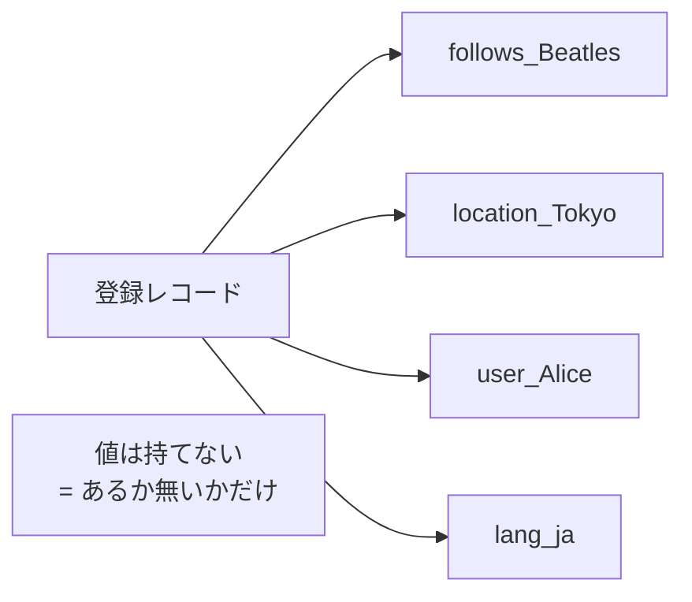
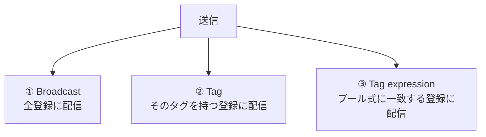
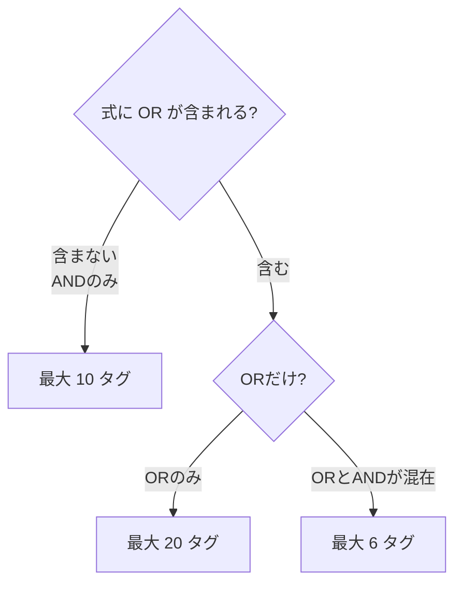
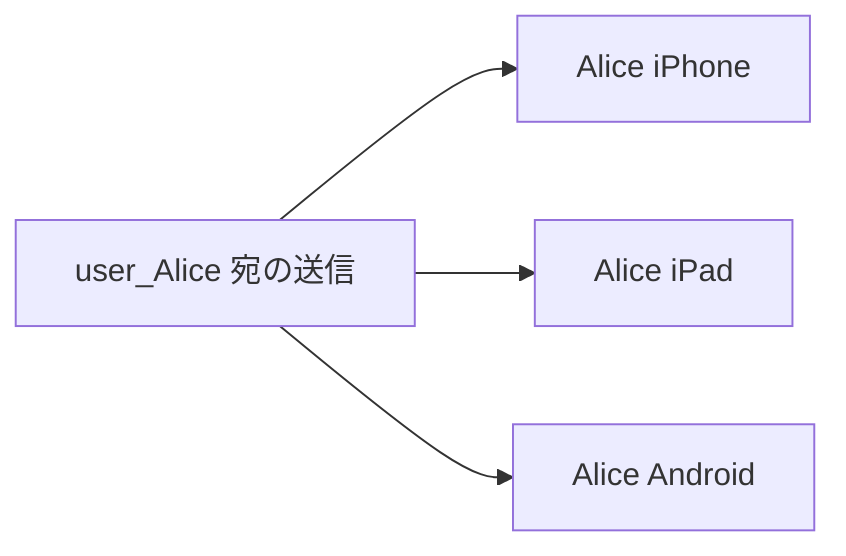

# Week 5 — タグとタグ式：宛名ラベルで宛先を絞る（60個上限・ブール式・参照上限 20/10/6）

> **Phase 2b** | 学習プラン Week 5 / 10
> 学習目標：登録に貼る **タグ（宛名ラベル）**の正体と制約（1 登録**最大 60 個**・使える文字・**値を持たない単なる文字列**）を理解する。**タグ式**のブール演算（`&&` / `||` / `!` ＋括弧）と**参照できるタグ数の上限**（OR のみ 20／AND のみ 10／混在 6）を押さえ、「ユーザー宛（同一ユーザーの全端末）」「セグメント宛（東京 かつ 野球好き 等）」の設計パターンを組めるようになる。

---

## 0. 今週の位置づけ


W4 で「登録＝ハンドルをタグに結びつける行為」と学んだ。W5 は、その**タグ**を主役にする回。タグは W1 §3「ルーティングの壁」——PNS は端末ハンドル宛しか送れないのに、通知は"ユーザーや興味グループ"宛にしたい——を NH がどう解決するかの中核である。送信（W7）は結局「どのタグ（式）に送るか」を決める作業になるので、ここが土台になる。

> **初学者向け用語補足：略語・用語の展開**
> - **タグ（tag）** = 登録に貼る単なる文字列ラベル。値を持たず、**あるか・ないか**だけを判定する目印。
> - **タグ式（tag expression）** = タグをブール演算で組み合わせた条件。
> - **ブール（Boolean／ブーリアン）** = 真（true）／偽（false）の2値論理。名は論理学者 George Boole（ブール）から。
> - **AND / OR / NOT** = 論理積（かつ）／論理和（または）／否定（でない）。記号は `&&` / `||` / `!`。
> - **セグメント（segment）** = 条件で切り出した端末の部分集合（例：「東京 かつ 野球好き」）。
> - **PNS ハンドル** = token / registration token / channel URI（W2 参照）。

---

## 1. タグの正体 — 「値のない、ただの文字列ラベル」

公式の定義：

> "A tag can be any string, up to 120 characters, containing alphanumeric and the following non-alphanumeric characters: '`_`', '`@`', '`#`', '`.`', '`:`', '`-`'."
> （タグは最大 120 文字の任意の文字列で、英数字と `_ @ # . : -` を使える。出典：[Routing and tag expressions](https://learn.microsoft.com/en-us/azure/notification-hubs/notification-hubs-tags-segment-push-message)）

最重要の性質は **「タグは値を持たない」**。公式："tags are simple strings and not properties with values. A registration matches only on the presence or absence of a specific tag."（タグは単なる文字列であって値を持つプロパティではない。登録は特定タグの**有無だけ**で一致する）。



つまり「`city = Tokyo`」のような**キー＝値**は書けない。代わりに **`location_Tokyo` という文字列そのものを付けるか付けないか**で表現する。「値で絞りたい」概念は、**値を名前に埋め込んだ複数タグ**に展開して表現するのがコツ。

> **用語補足：なぜ値を持てない設計なのか（たとえ）**
> タグは服に付ける「バッジ（缶バッジ）」だと思えばよい。缶バッジは「付いている／いない」しかない。「年齢=30」を表したければ `age_30` という缶バッジを作って付ける。検索は「その缶バッジを付けた人を集めろ」という**集合演算**になる。値比較（`age > 20`）はできないが、有無の判定だけなので**超高速に大量の登録から絞れる**——これが数百万台へ低遅延で配れる理由の一つ。

### 1-1. タグの制約まとめ

| 項目 | 制約 |
| --- | --- |
| 1 登録あたりのタグ数 | **最大 60 個**（公式：per registration / per device） |
| 1 タグの長さ | 最大 120 文字 |
| 使える文字 | 英数字 ＋ `_` `@` `#` `.` `:` `-` |
| 値 | **持てない**（有無のみ） |
| 事前登録 | **不要**（"Tags must not be pre-provisioned"＝好きなときに好きな文字列を付けられる） |

> **設計の勘所：タグの命名規約**
> タグは自由文字列ゆえ、**用途の接頭辞で名前空間を切る**のが定石。例：`user_`（ユーザー）、`follows_`（購読）、`location_`（地域）、`lang_`（言語）、`plan_`（契約プラン）。こうすると衝突を避けられ、タグ式も読みやすい（`(follows_RedSox || follows_Cardinals) && location_Boston`）。

---

## 2. 3 つのターゲティング — ブロードキャスト／タグ／タグ式

送信時に「どの登録に届けるか（ターゲット）」を決める方法は 3 つ（公式）。



| 方法 | 宛先 | 例 |
| --- | --- | --- |
| **ブロードキャスト** | ハブ内の**全登録** | 全ユーザーに障害告知 |
| **タグ指定** | そのタグを**持つ**登録すべて | `follows_Beatles` を持つ端末 |
| **タグ式** | 式に**一致**する登録すべて | `(follows_RedSox || follows_Cardinals) && location_Boston` |

W4 で見た **`$InstallationId:{id}`** も「特殊なタグ」なので、②タグ指定の一種で「1 端末狙い撃ち」を実現していた、と繋がる。

---

## 3. タグ式 — ブール演算で「セグメント」を切る

単一タグでは足りない「複合条件」を、**タグ式**で表す。公式の例：

> ボストンにいて、レッドソックスかカージナルスのどちらかを追っている人へ：
> ```
> (follows_RedSox || follows_Cardinals) && location_Boston
> ```

使える演算子（公式）："Tag expressions support common Boolean operators such as `AND` (`&&`), `OR` (`||`), and `NOT` (`!`); they can also contain parentheses."

| 演算子 | 記号 | 意味 | 例 |
| --- | --- | --- | --- |
| AND | `&&` | 両方を満たす | `location_Tokyo && follows_baseball` |
| OR | `\|\|` | どちらか満たす | `follows_RedSox \|\| follows_Cardinals` |
| NOT | `!` | 満たさない | `location_Boston && !follows_Cardinals` |
| 括弧 | `( )` | 優先順位 | `(A \|\| B) && C` |

### 3-1. 参照できるタグ数の上限 — ここが盲点

タグ式で参照できるタグ数には、**使う演算子によって異なる上限**がある（公式）：

> "Tag expressions using only `OR` operators can reference 20 tags; expression with `AND` operators but no `OR` operators can reference 10 tags; otherwise, tag expressions are limited to 6 tags."

| 式の種類 | 参照できるタグ数の上限 |
| --- | --- |
| **OR のみ**（`A \|\| B \|\| …`） | **20 個** |
| **AND のみ**（OR を含まない。`A && B && …`、`!` は可） | **10 個** |
| **それ以外**（OR と AND が混在、など） | **6 個** |



> **用語補足：なぜ混在だと 6 個と厳しいのか**
> OR と AND を混ぜた式は、内部的に**場合分け（積和展開）**が増え、評価コストが跳ね上がる。NH は低遅延・大規模配信を保つため、複雑な式ほど参照タグ数を絞っている。**設計上は「1 本の巨大な式に詰め込まない」**のが定石——足りなければ**送信を複数回に分ける**か、後述の**サーバ側でユーザー→タグを事前解決**する。

---

## 4. 設計パターン — ユーザー宛とセグメント宛

タグの典型的な使い道は 2 つ。

### 4-1. ユーザー宛（同一ユーザーの全端末に届ける）

公式："You can tag a Registration with a tag that contains the user ID."（登録にユーザー ID を含むタグを付ける）。`user_Alice` を Alice の iPhone・iPad・Android すべての登録に付けておけば、`user_Alice` 宛の 1 送信で**そのユーザーの全端末**に届く。



> W4 §4 の「2 台持ちで片方にしか届かない」問題は、**バックエンドが `user_Alice` の全登録をまとめて管理**すれば、ユーザー単位で確実に届けられる、という設計に繋がる。

### 4-2. セグメント宛（属性の掛け合わせ）

興味・地域・言語・プランなどを個別タグで持たせ、**送信時にタグ式で掛け合わせる**。例：

- 「東京在住で日本語、かつ野球を購読、ただし新規ユーザーは除く」
  → `location_Tokyo && lang_ja && follows_baseball && !plan_new`（AND のみ＝最大 10 タグ枠内）

> **落とし穴（公式の障害例）**：送信タグと登録タグが食い違うと**ターゲット 0**になる。公式："suppose all your registrations use the tag 'Politics'. If you then send with the tag 'Sports', the notification won't be sent to any device."（全登録が Politics なのに Sports 宛に送れば誰にも届かない）。W1 のテスト送信で Registrations = 0 だったのと同じ現象。**「送るタグ」と「登録済みタグ」を必ず突き合わせる**。

---

## 5. ハンズオン — タグ付き登録を作り、タグ式で絞って Test Send

実端末なしでも、**ダミー登録にタグを付け、Test Send のタグ式で絞れる**ことを確認する。

### 5-1. ハブを用意

```bash
az group create --name rg-nh-week5 --location japaneast
az notification-hub namespace create -g rg-nh-week5 -n nhns-<yourname>-w5 -l japaneast --sku Free
az notification-hub create -g rg-nh-week5 --namespace-name nhns-<yourname>-w5 -n hub-dev -l japaneast
```

### 5-2. ポータルでタグ式を試す

- ハブ → **Test Send** を開く。
- **Send to Tag Expression** に次を順に入れて、対象解決の挙動（Registrations 数）を観察する：
  - `location_Tokyo`（単一タグ）
  - `location_Tokyo && follows_baseball`（AND）
  - `follows_RedSox || follows_Cardinals`（OR）
  - `(follows_RedSox || follows_Cardinals) && location_Boston`（混在＝6 タグ上限側）
- まだ登録が無ければすべて Registrations = 0。**「式は受理されるが該当なし」**を体感し、§4 の「送信タグと登録タグの突き合わせ」の重要性を掴む。

### 5-3. タグ設計の紙上演習

「**日本語話者で、東京 or 大阪在住、かつ VIP プラン、ただし通知オプトアウト者は除く**」をタグ式で書いてみよ。
（解答例：`(location_Tokyo || location_Osaka) && lang_ja && plan_vip && !optout_push`。OR を含む混在式なので**参照タグは 6 個まで**——この式は 5 タグで枠内。）

### 5-4. 後片付け

```bash
az group delete --name rg-nh-week5 --yes --no-wait
```

---

## 6. 自己チェック

1. タグは「値を持てる」か。「`city = Tokyo`」を表したいときどう書くか。
2. 1 登録に付けられるタグ数の上限は？ 1 タグの最大長は？ タグは事前登録が要るか。
3. ターゲティングの 3 方法（ブロードキャスト／タグ／タグ式）を説明せよ。`$InstallationId:` はどれに当たるか。
4. タグ式の演算子 4 種（`&&` `||` `!` `( )`）の意味を言え。
5. **参照タグ数の上限 20 / 10 / 6** は、それぞれどんな式のときか。なぜ混在は厳しいのか。
6. `user_Alice` タグは何のためのパターンか。W4 §4 の 2 台持ち問題とどう繋がるか。
7. 送信タグと登録タグが食い違うと何が起きるか。

---

## 7. 次週予告（W6：テンプレート）

W2 §3 で見た「同じ速報に APNs/FCM/WNS の 3 書式」の面倒を、いよいよ **テンプレート**が解決する。テンプレートは登録時に「この端末はこの器（形）で受け取る」と宣言し、送信側は**プラットフォーム非依存の値**（例：`{"message":"試合開始"}`）を送るだけで、NH が各 PNS 書式へ変換する。**ローカライズ**（言語別の文面をバックエンド無改修で出し分け）や、テンプレート内での**タグ**併用も扱う。W4 の登録・W5 のタグと合わせ、「送信の中身」を組み立てる準備が整う。

---

### 参考（出典）
- [Routing and tag expressions（タグ・タグ式・上限）](https://learn.microsoft.com/en-us/azure/notification-hubs/notification-hubs-tags-segment-push-message)
- [Registration Management（ユーザー宛タグ・登録）](https://learn.microsoft.com/en-us/azure/notification-hubs/notification-hubs-push-notification-registration-management)
- [Diagnose dropped notifications（タグ不一致でターゲット 0）](https://learn.microsoft.com/en-us/azure/notification-hubs/notification-hubs-push-notification-fixer)
