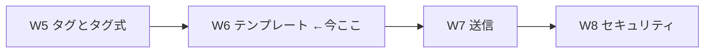
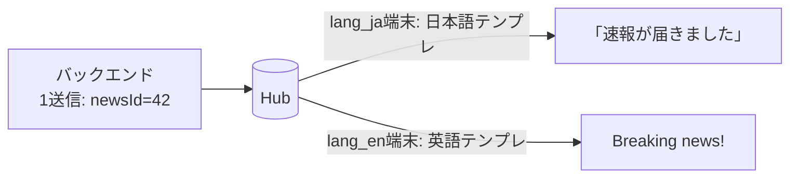
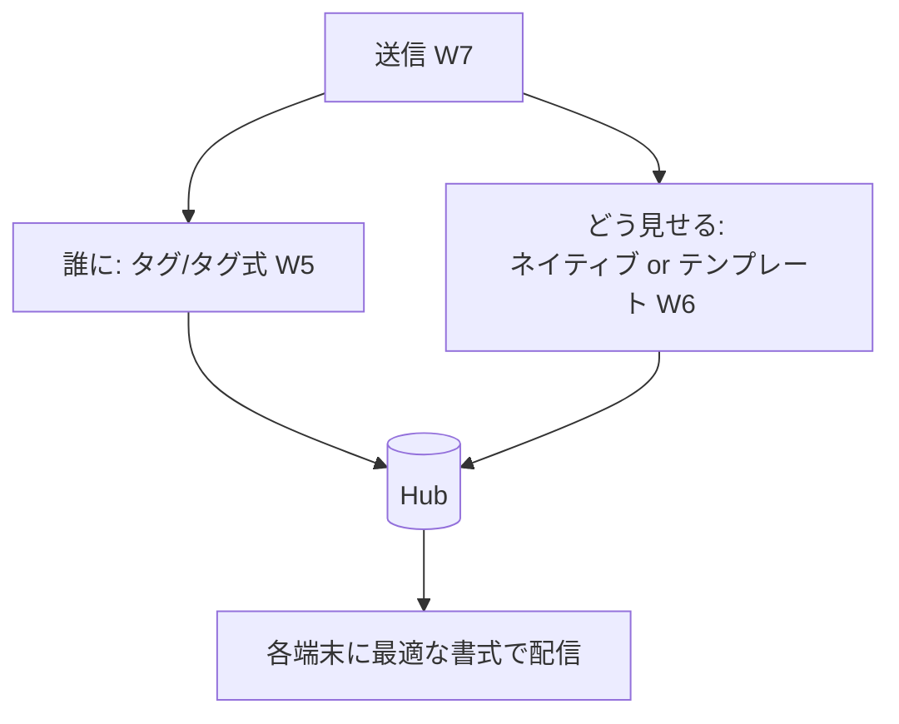

# Week 6 — テンプレート：プラットフォーム非依存の 1 送信を、NH が各 PNS 書式へ変換する

> **Phase 2c** | 学習プラン Week 6 / 10
> 学習目標：W2 §3 で見た「同じ速報に APNs/FCM/WNS の 3 書式」の面倒を、**テンプレート**がどう解決するかを理解する。**テンプレート登録**の仕組み、**テンプレート式言語**（`$(prop)`・切り詰め・連結・`#(prop)` の数値化）、**ローカライズ**（言語別文面をバックエンド無改修で出し分け）、**1 送信→複数通知**（トースト＋タイル）や**端末ごとのパーソナライズ**の設計を掴む。

---

## 0. 今週の位置づけ



W4 で「登録」、W5 で「宛先の絞り込み（タグ）」を学んだ。W6 は**通知の中身（書式）**を扱う最後のピース。ここまで済むと、W7「送信」で「①誰に（タグ）②何を（テンプレート/ネイティブ）」を組み合わせて実際に送れるようになる。

> **初学者向け用語補足：略語・用語の展開**
> - **テンプレート（template）** = 「ひな型・鋳型」。穴（`$(message)` 等）の空いた書式で、送信時に値を流し込んで完成させる。
> - **プレースホルダ（placeholder）** = ひな型の「穴」。あとで値が入る場所取り（`$(message)`）。
> - **ローカライズ（localization / L10n）** = 言語・地域に合わせて文面等を出し分けること。localization の l と n の間が 10 文字なので L10n。
> - **URI エンコード** = URL に使えない文字を `%xx` 形式に変換すること（`%(prop)` で使う）。
> - **プレゼンテーション層（presentation layer）** = 「見せ方（表示の形）」を担う部分。テンプレートはこれを NH 側に寄せる。

---

## 1. 問題の再確認 — バックエンドが「見せ方」まで背負わされる

W2 §3 で見たとおり、同じ「Hello!」を送るのに書式が違う。公式の例：

- APNs（JSON）：`{"aps": {"alert": "Hello!"}}`
- WNS（XML）：`<toast><visual><binding template="ToastText01"><text id="1">Hello!</text></binding></visual></toast>`

公式はこの状態をこう批判する。

> "This requirement forces the app backend to produce different payloads for each platform, and effectively makes the backend responsible for **part of the presentation layer** of the app."
> （この要件はバックエンドにプラットフォームごとの別ペイロード生成を強い、実質的にアプリの**プレゼンテーション層の一部をバックエンドに背負わせる**。出典：[Notification Hubs templates](https://learn.microsoft.com/en-us/azure/notification-hubs/notification-hubs-templates-cross-platform-push-messages)）

本来バックエンドが持つべきは「**Hello! というメッセージ**」だけ。`aps` や `<toast>` の器は「見せ方」であって業務ロジックではない。テンプレートはこの器を**NH 側に預ける**仕組みである。

---

## 2. テンプレート登録 — 端末が「受け取りたい形」を宣言する

テンプレートの要点：**器（書式）は端末が登録時に宣言し、NH に保管される**。送信側は穴に入れる値だけを送る。

> "A template is a set of instructions for the notification hub on how to format a platform-independent message for the registration of that specific client app."
> （テンプレートは、その端末の登録に対して、プラットフォーム非依存メッセージをどう整形するかの**指示書**である。出典：同上）

```mermaid
flowchart LR
    subgraph 登録時（端末）
      iOS[iOS端末] -->|テンプレ登録<br/>aps.alert=$message| NH[(Hub)]
      Win[Windows端末] -->|テンプレ登録<br/>toast text=$message| NH
    end
    Back[バックエンド] -->|1送信: message=試合開始| NH
    NH -->|穴に流し込み→APNs書式| iOS2[iOS端末]
    NH -->|穴に流し込み→WNS書式| Win2[Windows端末]
```

### 2-1. テンプレートの実物（公式）

iOS 端末が登録するテンプレート：
```json
{"aps": {"alert": "$(message)"}}
```
Windows 端末が登録するテンプレート：
```xml
<toast><visual><binding template="ToastText01"><text id="1">$(message)</text></binding></visual></toast>
```

バックエンドが送る**プラットフォーム非依存メッセージ**は、たった 1 つのプロパティ：
```json
{ "message": "試合開始" }
```

NH は各登録のテンプレートの `$(message)` に「試合開始」を差し込み、iOS には APNs 書式、Windows には WNS 書式で届ける。**バックエンドは書式を一切知らなくてよい**。これがテンプレートの本質。

> **用語補足：`$(message)` は「穴（プレースホルダ）」**
> `$(message)` は「ここに、送信メッセージの `message` プロパティの値を入れよ」という指示。W5 のタグが「宛先ラベル」なら、テンプレートの `$(...)` は「中身の差し込み口」。両者は独立に働く（テンプレート登録にもタグは付けられる）。

### 2-2. Installation とテンプレート（W4 と接続）

- **Installation モデル（推奨）**：`templates` キーに**複数テンプレートを JSON で一括保持**（W4 §3-1 の形）。名前（`welcome` 等）で使い分ける。
- **Registration モデル**：1 登録 1 テンプレートなので、**複数テンプレートは複数登録**を作る（例：アラート用とタイル更新用）。ネイティブ登録とテンプレート登録は**混在可**。

---

## 3. テンプレート式言語 — 穴に入れる「式」の文法

`$(message)` 以外にも、テンプレートには小さな式言語が使える（公式）。**テンプレートは XML か JSON に限られ、式は「XML のノード属性・値」「JSON の文字列プロパティ値」など特定の場所にだけ**置ける。

| 式 | 意味 |
| --- | --- |
| `$(prop)` | プロパティ `prop` の値を差し込む（無ければ空文字。**大文字小文字を区別しない**） |
| `$(prop, n)` | `n` 文字で**切り詰め**（例 `$(title, 20)` は 20 文字で切る） |
| `.(prop, n)` | 切り詰め＋末尾に `...` を付す（合計 `n` 文字以内） |
| `%(prop)` | `$(prop)` と同様だが**URI エンコード**して出力 |
| `#(prop)` | JSON テンプレートで、条件を満たすと**数値**として出力（`"badge":"#(count)"` → `"badge": 40`） |
| `'text'` / `"text"` | リテラル（そのままの文字列） |
| `expr1 + expr2` | **連結**。使うときは式全体を `{ }` で囲む |

> **連結の鉄則（公式のハマりどころ）**：連結を使うときは**式全体を波括弧 `{}` で囲む**。
> ```xml
> <text id="1">{'Hi, ' + $(name)}</text>
> ```
> `{}` を忘れると無効なテンプレートになる。

> **用語補足：`#(prop)` が要る理由（JSON の数値問題）**
> APNs の `badge`（アイコン右上の数字）は JSON で**数値**でなければならない。`"badge": "$(count)"` だと `"40"`（文字列）になり不正。`"badge": "#(count)"` と書くと NH が `40`（数値）として出力してくれる。「文字列 vs 数値」を吸収する専用の穴、と覚える。

---

## 4. テンプレートが生む 3 つの効能

公式が挙げる利点：**①プラットフォーム非依存のバックエンド ②パーソナライズ ③クライアント版差の吸収 ④容易なローカライズ**。実務で効く 3 つを見る。

### 4-1. ローカライズ（言語別の文面をバックエンド無改修で）

言語ごとにテンプレートを分けて登録し、**タグで言語を持たせる**。



- 端末は登録時に、自分の言語のテンプレート（例 `{"aps":{"alert":"速報が届きました"}}`）と `lang_ja` タグを登録。
- バックエンドは**言語を意識せず 1 回送るだけ**。文面の出し分けは端末が登録したテンプレートが担う。
- 文面を変えても**バックエンド無改修**（見せ方は端末＋NH 側にあるため）。

### 4-2. 端末ごとのパーソナライズ（1 送信で各自の好みに）

公式の天気アプリ例：ユーザーは摂氏/華氏・1 日/5 日予報を選べる。各端末は**自分の欲しい形のテンプレート**（例「1 日・摂氏」）を登録。バックエンドは**全情報を含む 1 メッセージ**（5 日分・摂氏華氏すべて）を送るだけで、各端末のテンプレートが必要な穴（`$(day1_tempC)` 等）だけ拾う。

> 効能："the backend only sends a single message **without having to store specific personalization options** for the app users."（バックエンドはユーザーごとの設定を保持せずに、単一メッセージを送るだけでよい）。パーソナライズの状態を**端末のテンプレート側に逃がす**のがミソ。

### 4-3. 1 送信 → 複数通知（トースト＋タイル）

公式："The notification hub sends one notification for each template."（NH はテンプレートごとに 1 通知を送る）。同じ端末が「トースト用」と「タイル更新用」の 2 テンプレートを登録していれば、**1 回の非依存送信が 2 種類の通知に展開**される。バックエンドはそれを意識しない。

> **注意（公式）**：iOS など一部プラットフォームは、短時間に同一端末へ届いた複数通知を**まとめる（collapse）**ことがある（W2 §4 の coalescing/collapsing）。

---

## 5. 全体像 — タグ（誰に）×テンプレート（どう見せる）

W5 と W6 で「送信の 2 軸」が揃った。



- **ネイティブ送信**：送信側が PNS 書式を作る（プラットフォーム別に送り分け）。
- **テンプレート送信**：送信側は非依存メッセージだけ。書式変換は端末登録済みテンプレート＋NH が担う。

「複数プラットフォームに同じ内容を配りたい／ローカライズしたい」なら**テンプレート**、「単一プラットフォームで細かく作り込みたい」なら**ネイティブ**、が基本の使い分け。

---

## 6. ハンズオン — テンプレートの穴と式を手で組む

実端末なしでも、テンプレートの**書式と式**は手で確認できる。

### 6-1. テンプレートを 3 書式で書き分ける

「タイトル無し・本文 `$(message)`・バッジ `#(count)`」を **APNs（JSON）**と **WNS（XML）**で書いてみよ。
- APNs 例：`{"aps":{"alert":"$(message)","badge":"#(count)"}}`
- WNS 例：`<toast><visual><binding template="ToastText01"><text id="1">$(message)</text></binding></visual></toast>`

そして**バックエンドが送る非依存メッセージ**を書く：`{ "message": "メンテナンス開始", "count": "3" }`。`#(count)` により APNs の badge が数値 `3` になることを確認する（`$(count)` だと `"3"` 文字列で不正になる点も）。

### 6-2. 式言語の練習

次を書け：
1. 20 文字で切り詰めて末尾に `...` を付けるタイトル → `.(title, 20)`
2. 「`Hi, ` ＋ 名前」を連結 → `{'Hi, ' + $(name)}`（`{}` を忘れない）
3. URL パラメータに値を入れる（URI エンコード）→ `%(query)`

### 6-3. ポータルで Custom Template 送信を眺める

ハブ → **Test Send** → Platforms で **Custom Template** を選ぶと、非依存メッセージ（`{"message":"..."}` 形式）を入力する UI になることを確認する。テンプレート登録が無ければ Registrations = 0 だが、「非依存メッセージを送る口」の存在を体感する。

```bash
az group create --name rg-nh-week6 --location japaneast
az notification-hub namespace create -g rg-nh-week6 -n nhns-<yourname>-w6 -l japaneast --sku Free
az notification-hub create -g rg-nh-week6 --namespace-name nhns-<yourname>-w6 -n hub-dev -l japaneast
# 後片付け
az group delete --name rg-nh-week6 --yes --no-wait
```

---

## 7. 自己チェック

1. テンプレートを使わないと、バックエンドは何を背負わされるか（公式の言葉で）。
2. テンプレート登録では「書式（器）」は誰がいつ宣言し、どこに保管されるか。送信側は何を送るか。
3. `$(message)` とは何か。W5 のタグとどう役割が違うか。
4. 式 `$(prop, n)` / `.(prop, n)` / `%(prop)` / `#(prop)` の違いを言え。`#(prop)` はなぜ必要か。
5. 連結（`+`）を使うときの構文上の鉄則は何か。
6. ローカライズをテンプレートで実現する設計を、タグと絡めて説明せよ。バックエンドは何回・何を送るか。
7. 「1 送信 → 複数通知」とは何か。パーソナライズで「設定を保持しなくてよい」のはなぜか。
8. テンプレート送信とネイティブ送信の使い分けの基準は？

---

## 8. 次週予告（W7：送信）

いよいよ **送信（Send）**を正面から扱う。W5（誰に＝タグ）× W6（どう見せる＝テンプレート/ネイティブ）を組み合わせ、**ブロードキャスト／タグ／タグ式／ダイレクト送信**、**スケジュール配信**（Standard 限定）、**サイレント送信**の実際を見る。さらに「送信 API は Enqueued を返すだけ」（W2 §4）を踏まえた**送信結果の確認**（Test Send / テレメトリの入口）まで進み、W10 の最終 PJ（Python から実際に送る）の直前準備を整える。

---

### 参考（出典）
- [Azure Notification Hubs templates（テンプレート・式言語・ローカライズ・パーソナライズ）](https://learn.microsoft.com/en-us/azure/notification-hubs/notification-hubs-templates-cross-platform-push-messages)
- [Registration Management（テンプレート登録・Installation の templates）](https://learn.microsoft.com/en-us/azure/notification-hubs/notification-hubs-push-notification-registration-management)
- [Routing and tag expressions（タグとの併用）](https://learn.microsoft.com/en-us/azure/notification-hubs/notification-hubs-tags-segment-push-message)
