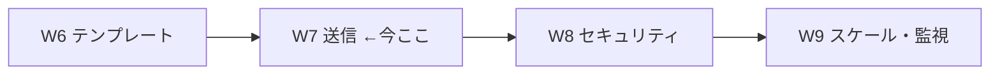
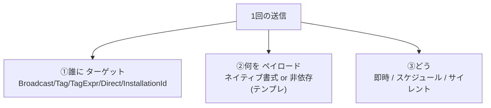
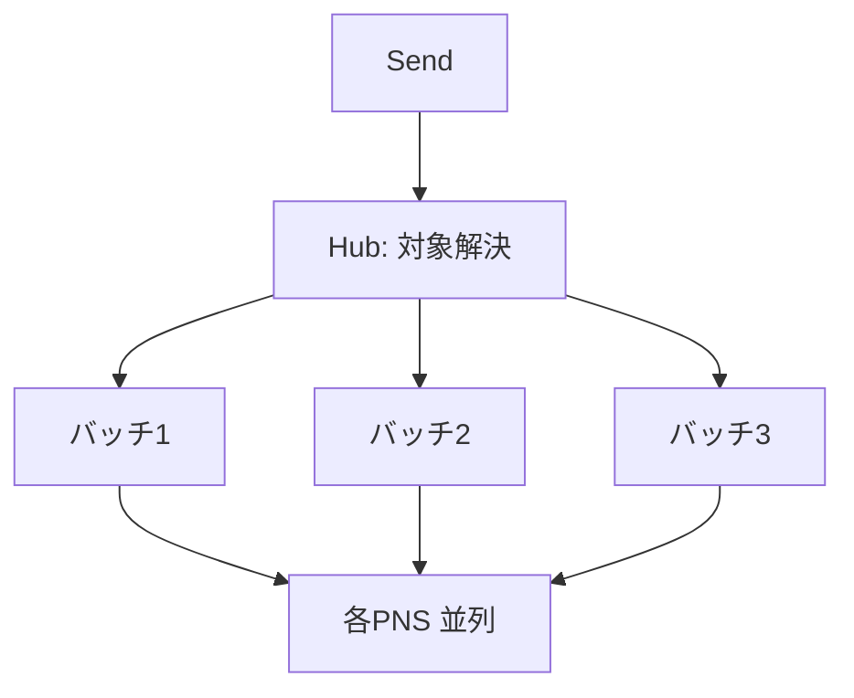
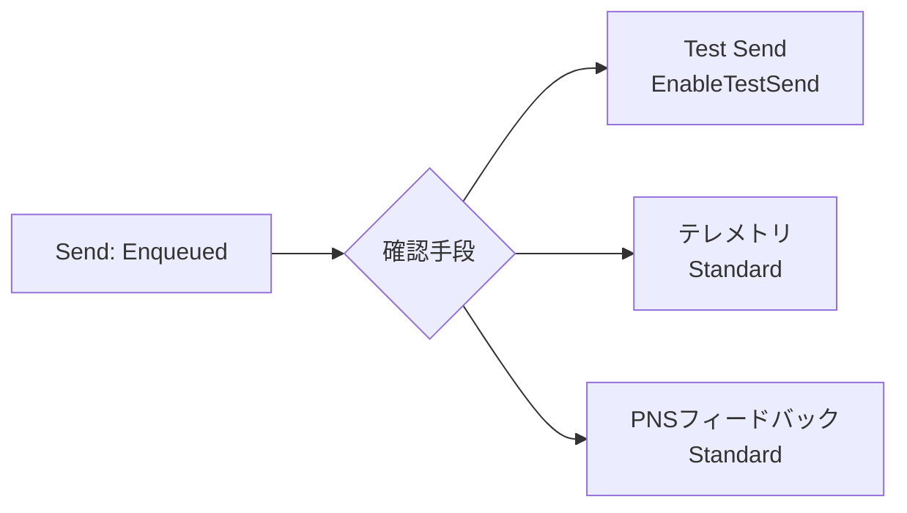

# Week 7 — 送信：ブロードキャスト／タグ／タグ式／ダイレクト、スケジュール・サイレント、そして「送った後」の確認

> **Phase 3a** | 学習プラン Week 7 / 10
> 学習目標：**送信（Send）**を正面から扱う。W5（誰に＝タグ）× W6（どう見せる＝テンプレート/ネイティブ）を組み合わせ、**ブロードキャスト／タグ／タグ式／ダイレクト送信**、**スケジュール配信**（Standard 限定）、**サイレント送信**の実際を理解する。さらに「送信 API は Enqueued を返すだけ」（W2 §4）を踏まえた**送信結果の確認**（Test Send・テレメトリ・PNS フィードバックの入口）まで進み、W10 の最終 PJ（Python から送る）の直前準備を整える。

---

## 0. 今週の位置づけ



W4〜W6 で「登録・タグ・テンプレート」という**送るための材料**が揃った。W7 はそれらを使って**実際に送る**回。送信は「①誰に（ターゲット）②何を（ペイロード）③いつ・どう（即時/予約/サイレント/ダイレクト）」の組み合わせで決まる。ここを整理し、送った後の**結果の見方**まで押さえる。

> **初学者向け用語補足：略語・用語の展開**
> - **Send（送信）** = バックエンドがハブへ「これを送って」と依頼する操作。
> - **ペイロード（payload）** = 通知の中身・本体（W2 §3）。
> - **テレメトリ（telemetry）** = tele（遠隔）＋metry（計測）＝「遠隔計測」。ここでは送信結果の集計・記録。
> - **PNS フィードバック（PNS feedback）** = PNS が返す配信可否の情報（失効ハンドル等）。
> - **KB / バイト** = Kilobyte（キロバイト）。データ量の単位。1 KB ≒ 1000 バイト。
> - **冪等（idempotent）** = 同じ操作を繰り返しても結果が同じ（W2・W4 既出。予約のキャンセル等で関わる）。

---

## 1. 送信の 3 軸 — 誰に・何を・どう

送信は次の 3 つの選択の掛け算で決まる。



- **①誰に**：W5 の 3 方法（ブロードキャスト／タグ／タグ式）＋ W4 の `$InstallationId:`（1 端末狙い撃ち）＋本週の**ダイレクト送信**（登録を介さずハンドル直指定）。
- **②何を**：W6 の**ネイティブ**（PNS 書式を送信側が作る）か**テンプレート**（非依存メッセージを送り NH が変換）。
- **③どう**：即時／スケジュール（予約）／サイレント（画面に出さずアプリを起こす）。

---

## 2. ターゲット別の送信

### 2-1. ブロードキャスト／タグ／タグ式（W5 の実行）

W5 で設計した宛先に、実際に送る。概念上はどれも「送信 API に**ターゲット指定**を添えるだけ」で、NH が対象登録を解決して各 PNS に配る。

| ターゲット | 指定 | 使いどころ |
| --- | --- | --- |
| ブロードキャスト | なし（全登録） | 全体障害告知・全員速報 |
| タグ | `follows_Beatles` | 単一興味グループ |
| タグ式 | `(A \|\| B) && C` | セグメント（W5 §3 の上限 20/10/6 に注意） |
| InstallationId | `$InstallationId:{id}` | 特定 1 端末（W4） |

### 2-2. ダイレクト送信（Direct Send）— 登録を介さない"素通し"送信

公式が定義する特別な送信。**登録もインストールも使わず、端末ハンドルを直接指定**して送る。

> "Sends a notification directly to a device handle. Users of this API **do not need to use registrations or installations**. Instead, you manage all devices on their own and use Azure Notification Hubs **solely as a pass-through service** to communicate with the various Push Notification Services."
> （端末ハンドルへ直接送る。登録/インストールは不要で、端末は自前で全管理し、NH を各 PNS への**素通しサービス**としてのみ使う。出典：[Direct send](https://learn.microsoft.com/en-us/rest/api/notificationhubs/direct-send)）

- REST：`POST …/messages/?direct` に **`ServiceBusNotification-DeviceHandle`（ハンドル）**と **`ServiceBusNotification-Format`（`apple`/`gcm`/`windows` 等）**を付ける。
- **ハンドル管理を自前でやっている**システムが、NH のマルチプラットフォーム変換だけ借りたいときに使う。
- W1 で見た「ダイレクト push（登録を省いて端末ハンドルのリストへ直接バッチ送信）」の実体がこれ。

> **用語補足：素通し（pass-through）とは**
> NH の「登録・タグで宛先を管理する」機能を**使わず**、単に「PNS への翻訳・配送」だけを借りる使い方。宛先の台帳を自分で持っている既存システムの移行などに向く。ただし NH の強み（タグでの絞り込み・冪等な登録）は捨てることになる。

> **重要：メッセージサイズ上限 64 KB**：ダイレクト送信のレスポンスコードに「**413 Requested entity too large. The message size cannot be over 64 Kb.**」がある。ペイロードには上限があり（PNS 側にも各上限がある）、大きすぎると弾かれる。

---

## 3. 「どう送るか」— 即時・スケジュール・サイレント

### 3-1. 即時送信

もっとも基本。送信 API を呼んだ時点で NH がキューに入れ、対象解決 → 各 PNS へ配送する。**戻り値は Enqueued**（W2 §4）で、配信成否はその場では分からない（§5 で確認方法）。

### 3-2. スケジュール配信（Scheduled push）— Standard 限定

指定した**将来時刻に送る**予約。W3 §2 で見たとおり **Standard SKU 限定機能**。

- 予約を作ると**通知メッセージ ID** が返り、送信前ならその ID で**キャンセル**できる。
- 「毎朝 8 時の要約」「イベント開始 10 分前のリマインド」等を、バックエンドで cron を組まずに NH に任せられる。

> **注意**：Free/Basic ではスケジュール API は使えない（SDK は例外、REST は HTTP 403）。W3 §2 の「Standard 限定機能」の一つ。本教材は Free 中心なので、スケジュールは概念理解にとどめる。

### 3-3. サイレント送信（Silent push）

画面に通知を出さず、**アプリを裏で起こしてデータ取得等をさせる**（W1・W2 で既出）。

- APNs：`alert` を省き `content-available: 1`。
- FCM：`notification` を付けず `data` だけ。
- 用途：新着をアプリに取りに行かせる「push-to-pull」、バッジ数だけ更新、位置情報の同期など。

---

## 4. バッチ・並列・順序（W2 §4 の再確認）

送信を実行すると、NH は対象登録を**バッチ（束）に分けて並列で** PNS へ流す（W2 §4）。ここから来る性質を、送信の視点で再掲する。



- **順序保証なし**（並列バッチ）。「A の次に B」を厳密に守る配信はできない。
- **at-most-once**（重複排除を試みる）＝「必ず届く」ではない。重要通知はアプリ内でも状態同期する設計に。
- **失効ハンドルは自動掃除**（送信時の PNS 応答で NH が登録を削除）。

---

## 5. 「送った後」— 結果をどう確認するか

送信 API の成功＝**キューに入った（Enqueued）だけ**。実際に PNS へ渡ったか・弾かれたかは別途確認する。



- **Test Send / EnableTestSend**：デバッグ用。送信を PNS まで実行し**詳細なエラー**（資格情報不正・ペイロード超過等）を返す。ただし公式いわく**強く絞られている**：デバッグ送信は**最大 10 端末・毎分 10 件まで・SLA 対象外**。開発時の切り分け専用。
- **テレメトリ（Standard 限定）**：送信・登録・成功/失敗の集計をポータルや API で確認。**Free/Basic では API で HTTP 403**（W3 §2）。
- **PNS フィードバック（Standard 限定）**：PNS が返す「このハンドルは失効」等の情報。失効登録の掃除や、二次ハブ同期（DR）に使う。
- **メッセージ ID（Location ヘッダー）**：Standard ハブでは送信レスポンスの `Location` に**通知メッセージ ID** が入り、**per-message telemetry** と PNS フィードバックの突き合わせに使える。

> **落とし穴（W1・W5 の再確認）**：送信してもポータルで **Registrations = 0 / ターゲット 0** なら、宛先が居ない（登録が無い or タグ不一致）。まず「送るタグ」と「登録済みタグ」を突き合わせる（W5 §4）。認証設定が誤っていれば **PNS Authentication Error** が出る（W3 §4 の資格情報を見直す）。

---

## 6. ハンズオン — 送信の 3 軸を Test Send で回す

実端末が無くても、**ターゲット指定と対象解決**の挙動は確認できる。

### 6-1. ハブを用意

```bash
az group create --name rg-nh-week7 --location japaneast
az notification-hub namespace create -g rg-nh-week7 -n nhns-<yourname>-w7 -l japaneast --sku Free
az notification-hub create -g rg-nh-week7 --namespace-name nhns-<yourname>-w7 -n hub-dev -l japaneast
```

### 6-2. Test Send でターゲットを変えて観察

ハブ → **Test Send** で以下を試し、**Registrations（対象数）**の出方を観察する（登録が無ければ 0＝「宛先未達だが送信の口は通る」）。

- Platforms = **Custom Template**、Send to = **Broadcast**（全体）
- Send to **Tag** に `follows_baseball`
- Send to **Tag Expression** に `location_Tokyo && follows_baseball`
- Send to **Tag Expression** に `$InstallationId:{demo-1}`（1 端末指定）

観察ポイント：**同じ「送る」でもターゲット指定だけで宛先解決が変わる**こと。これが「送信＝誰に×何を×どう」の①を体感する部分。

### 6-3. ペイロードの軸を切り替える

Platforms を **Apple** に変え、ネイティブ APNs ペイロード（`{"aps":{"alert":"テスト"}}`）を送る形と、**Custom Template**（`{"message":"テスト"}`）の形を見比べ、W6 の「ネイティブ vs テンプレート」の②の違いを UI 上で確認する。

### 6-4. 後片付け

```bash
az group delete --name rg-nh-week7 --yes --no-wait
```

---

## 7. 自己チェック

1. 送信を決める「3 軸」とは何か。それぞれの選択肢を挙げよ。
2. **ダイレクト送信**とは何か。登録を使う送信と何が違い、どんなときに使うか。素通し（pass-through）の意味は？
3. ダイレクト送信のメッセージサイズ上限は？ 超えると何番のコードが返るか。
4. **スケジュール配信**はどの SKU で使えるか。予約のキャンセルはどうするか。
5. **サイレント送信**は何のためか。APNs/FCM でどう表すか。
6. 送信 API が返す `Enqueued` は何を意味するか。配信成否はどう確認するか（3 つ挙げよ）。
7. **Test Send（EnableTestSend）**の制限（端末数・頻度・SLA）を述べよ。なぜ本番に使わないのか。
8. 送ったのに Registrations = 0 のとき、まず何を疑うか。

---

## 8. 次週予告（W8：認証とセキュリティ）

送信の中身が分かったので、W8 は「**誰が送れるか・誰が登録できるか**」の権限を扱う。**SAS（共有アクセス署名）**と 3 つのアクセス権限——**Listen（登録・受信）/ Send（送信）/ Manage（管理）**——の使い分け、**クライアントには Listen だけ・バックエンドには Send** を渡す安全パターン（W4 §4 の伏線回収）、接続文字列（DefaultListen… / DefaultFull…）の意味、そして **Microsoft Entra ID** による認証を学ぶ。ここまでで運用の骨格が固まり、W9（スケール・監視）→ W10（実装）へ進む。

---

### 参考（出典）
- [Direct send（ダイレクト送信・64KB 上限）](https://learn.microsoft.com/en-us/rest/api/notificationhubs/direct-send)
- [Diagnose dropped notifications（Test Send/EnableTestSend・テレメトリ・PNS フィードバック）](https://learn.microsoft.com/en-us/azure/notification-hubs/notification-hubs-push-notification-fixer)
- [Notification Hubs pricing（スケジュール等 Standard 限定機能）](https://azure.microsoft.com/en-us/pricing/details/notification-hubs/)
- [Routing and tag expressions（ターゲティング）](https://learn.microsoft.com/en-us/azure/notification-hubs/notification-hubs-tags-segment-push-message)
