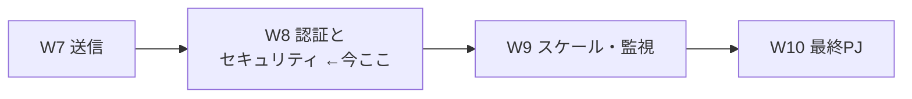
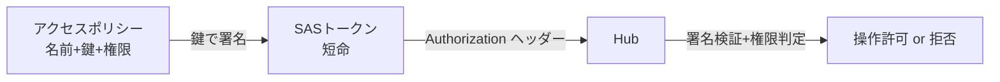
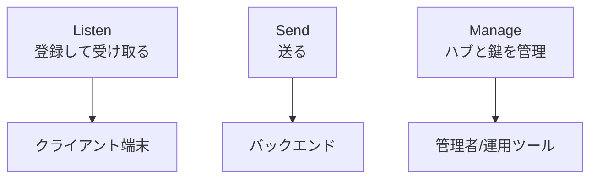
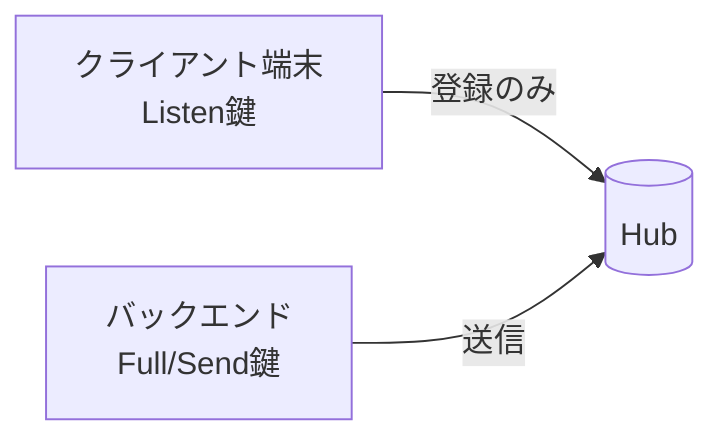
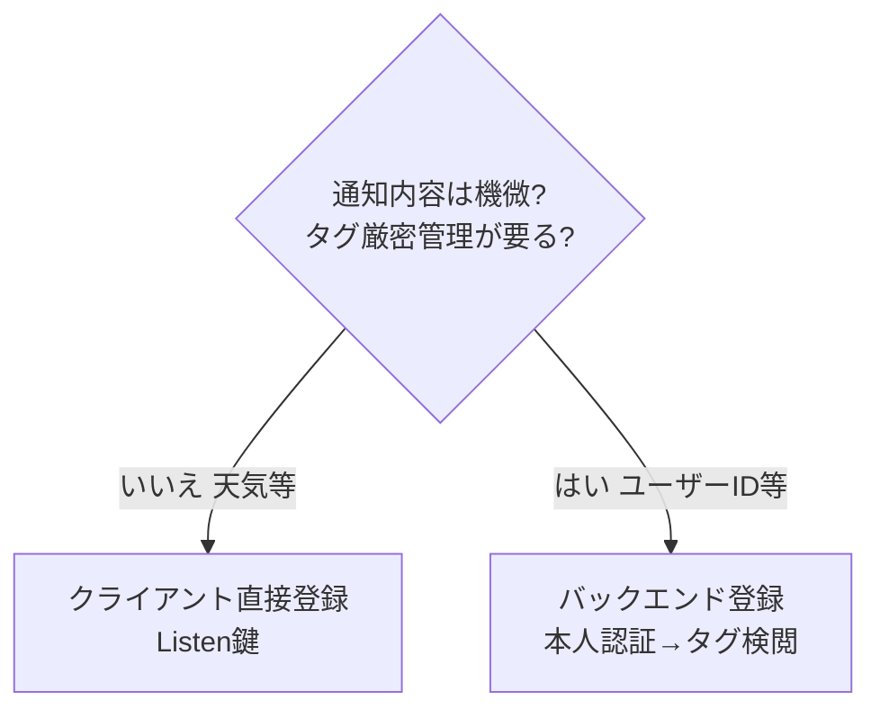

# Week 8 — 認証とセキュリティ：SAS の Listen/Send/Manage、クライアント=Listen・バックエンド=Send の安全パターン、Entra ID

> **Phase 3b** | 学習プラン Week 8 / 10
> 学習目標：NH の**セキュリティモデル（SAS）**と 3 つのアクセス権限——**Listen（登録・受信）/ Send（送信）/ Manage（管理）**——の使い分けを理解する。既定ルール（`DefaultListenSharedAccessSignature` / `DefaultFullSharedAccessSignature`）の意味、**クライアントには Listen だけ・バックエンドには Send/Full** を渡す安全パターン（W4 §4 の伏線回収）、名前空間レベルとハブレベルのポリシーの違い、そして **Microsoft Entra ID** 認証の位置づけを掴む。

---

## 0. 今週の位置づけ



W4〜W7 で「登録・タグ・テンプレート・送信」が揃った。だが**「誰がそれをやってよいか」**を決めていない。W8 は権限の回。W4 §4 で「端末には Listen 権限のみを渡す」「バックエンドが門番になる」と伏線を張った——その**Listen/Send/Manage の正体**をここで回収する。運用の骨格の最後のピースである。

> **初学者向け用語補足：略語・用語の展開**
> - **SAS** = Shared Access Signature（Shared=共有 / Access=アクセス / Signature=署名）＝「共有した鍵で作る署名トークン」。NH の標準的な認可方式。
> - **AuthN / AuthZ** = Authentication（認証＝誰であるか）／ Authorization（認可＝何をしてよいか）。SAS は主に AuthZ を担う。
> - **claim（クレーム）** = 「主張・資格」。ここでは「この操作をしてよい」という権限の単位（Listen/Send/Manage）。
> - **CRUD** = Create/Read/Update/Delete（W4 既出）。Manage 権限が持つ操作。
> - **接続文字列（connection string）** = エンドポイント＋鍵名＋鍵値を 1 本にまとめた文字列。
> - **Entra ID** = Microsoft Entra ID（旧 Azure Active Directory / Azure AD）＝ Microsoft の ID 基盤。

---

## 1. SAS — NH の認可の仕組み

公式："Notification Hubs implements an **entity-level security scheme** called a *Shared Access Signature (SAS)*. Each rule contains a name, a key value (shared secret), and a set of rights."（NH はエンティティ単位のセキュリティ方式 SAS を実装する。各ルールは**名前・鍵値（共有シークレット）・権限の集合**を持つ。出典：[Notification Hubs security model](https://learn.microsoft.com/en-us/azure/notification-hubs/notification-hubs-push-notification-security)）

つまり SAS の正体は「**アクセスポリシー（ルール）＝名前＋鍵＋権限**」の 3 点セット。呼び出し側はこの鍵で**署名した短命トークン（SAS トークン）**を作り、NH に提示する。NH は署名を検証し、そのポリシーの権限内なら操作を許す。



> **用語補足：なぜ「署名トークン」なのか（たとえ）**
> 鍵そのものを毎回ネットに流すのは危険。代わりに、鍵で**その場限りの署名（判子）**を押したトークンを渡す。受け手（NH）は同じ鍵で判子の正しさを検証できるが、トークンからは鍵を復元できない。「実印は金庫に置き、押した書類だけ渡す」イメージ。

---

## 2. 3 つの権限（security claims）— Listen / Send / Manage

NH の操作は 3 つの権限で制御される（公式）。

| 権限 | 何ができるか | 主な操作 |
| --- | --- | --- |
| **Listen** | **単一登録の作成・更新・読取・削除** | 自分の登録を作る/更新/削除、ハンドルに対する登録の読取 |
| **Send** | **通知を送る** | メッセージ送信（W7） |
| **Manage** | **ハブの CRUD＋タグでの登録読取** | ハブ作成/更新/削除、**PNS 資格情報や鍵の更新**、タグ指定での登録一覧 |



権限は**弱い順に Listen ⊂（用途が別）Send ⊂ Manage** ではなく、**独立した 3 つの資格**である点に注意。実際 `DefaultFull…` は 3 つ全部を束ねている（後述）。

> **用語補足：Listen が持つのは「登録」であって「受信の許可」ではない**
> プッシュの実際の受信は PNS → 端末で起こる（NH を通らない）。Listen 権限が許すのは「**ハブに登録レコードを作る/読む/消す**」操作。W4 §4 で「Listen しか無くてもタグを偽って登録できる（なりすまし）」と言ったのは、Listen が**任意タグでの登録を許す**ため。だから厳密なタグ管理はバックエンド（門番）に寄せる。

---

## 3. 既定の 2 ルール — Default Listen と Default Full

ハブを作ると、公式いわく**自動で 2 つのルールが作られる**。

| 既定ルール | 権限 | 使う場所 |
| --- | --- | --- |
| **DefaultListenSharedAccessSignature** | **Listen のみ** | **クライアント（端末アプリ）** |
| **DefaultFullSharedAccessSignature** | **Listen＋Send＋Manage（全部）** | **アプリのバックエンドのみ** |

公式の明確な警告：

> "**DefaultFullSharedAccessSignature**: grants Listen, Manage, and Send permissions. This policy is to be used **only in your app backend. Do not use it in client applications**; use a policy with only Listen access."
> （Full は全権限。**バックエンド専用**。クライアントアプリでは使うな。クライアントは Listen だけのポリシーを使え。）

W4・W7 のハンズオンで送信に使った `DefaultFullSharedAccessSignature` が「Manage も含む全権鍵」であり、**端末に置いてはいけない**ものだった、と回収される。

---

## 4. 安全パターン — クライアント=Listen・バックエンド=Send/Full

### 4-1. 基本形（機微でない通知）

公式："give the key value of the rule Listen-only access to the client app, and to give the key value of the rule full access to the app backend."（Listen 鍵はクライアントへ、Full 鍵はバックエンドへ）。



- **クライアント**：Listen 鍵で「登録」だけ。送信も管理もできない。
- **バックエンド**：Full（または Send のみのカスタム）鍵で送信。

### 4-2. 鍵をアプリに埋め込まない（重要）

公式："Apps should **not embed the key value** in client apps; instead, have the client app **retrieve it from the app backend at startup**."（鍵をアプリに埋め込むな。起動時にバックエンドから取得させよ）。

> **なぜ**：アプリは逆コンパイルされうる（W4 §4）。Listen 鍵ですら埋め込めば抜かれ、任意タグ登録に悪用されうる。起動時にバックエンド経由で**短命な SAS トークン**を渡す方式が安全。

> **用語補足：逆コンパイル（decompile）とは**
> 配布されているアプリ（機械語/中間コードにコンパイル済み）を**逆向きに変換して、人間が読めるソースコードに近い形へ戻す**こと。「コンパイル（ソース→実行形式）」の逆。
> - アプリはユーザーの端末に落ちる＝**攻撃者の手元にファイルがある**。ツール（Android の `jadx`/`apktool`、iOS の逆アセンブラ等）にかければ中身を覗け、**埋め込んだ鍵・API キーは"隠したつもり"でも抜ける**。さらに動作を書き換えて再パッケージ（改ざん）もできる＝W4 §4 の「改造アプリで `user_Alice` になりすまし登録」。
> - **難読化（obfuscation）**（変数名を `a,b,c` にする等）は解析を**遅らせるだけで防げはしない**。
> - 結論：「アプリの中に置いたものはいつか読まれる/書き換えられる」前提で設計する。根本対策は**そもそも秘密をアプリに置かない**——重い鍵（Full/Manage）はバックエンド、端末は最小権限（Listen）＋短命トークン。これが本節の設計思想。

### 4-3. タグを厳密に管理したいなら「バックエンド登録」（W4 §4 回収）

公式："The key with Listen access allows a client app to register for **any tag**. If your app must restrict registrations to specific tags to specific clients (for example, when tags represent user IDs), **your app backend must perform the registrations**."（Listen 鍵は任意タグ登録を許す。特定タグを特定クライアントに限定したいなら、バックエンドが登録を行え。）

- 例：`user_Alice` タグは本当に Alice の端末にだけ付けたい → **バックエンドが本人認証してから登録**（W4 §4 の門番）。この場合、**クライアントは NH に直接触れない**。



---

## 5. 名前空間レベル vs ハブレベルのポリシー

アクセスポリシーは 2 階層にある（W3 の Namespace/Hub と対応）。

| レベル | 用途 | 送信できるか |
| --- | --- | --- |
| **名前空間レベル** | ハブの一覧・作成・削除など**名前空間全体の管理** | ✕（送信は不可） |
| **ハブレベル** | そのハブへの登録・送信 | **✔ 送信はハブレベルのみ** |

公式："**Only the hub-level access policies let you send notifications.**"（送信できるのはハブレベルのポリシーだけ）。また "It is not possible to send a notification to more than one namespace."（複数名前空間へまとめて送ることはできない＝名前空間は送信に関与しない論理コンテナ）。

> **勘所**：送信用の鍵は**必ずハブレベル**から取る。名前空間レベルの鍵は運用管理（ハブ作成等）用。

---

## 6. 接続文字列 と カスタムポリシー

- **接続文字列の形**（公式例）：
  ```
  Endpoint=sb://<ns>.servicebus.windows.net/;SharedAccessKeyName=policy2;SharedAccessKey=<鍵値>
  ```
  エンドポイント＋**ポリシー名（鍵名）**＋**鍵値**の 3 点。W4・W7 で使った `primaryConnectionString` はこれ。

- **最小権限のカスタムポリシー**：既定の Full は Manage まで含むため、送信専用サービスには**Send のみのカスタムポリシー**を作るのが望ましい（最小権限の原則）。ポータルの **Access Policies → New Policy** で名前と権限を選んで作れる。

> **用語補足：最小権限の原則（least privilege）**
> 「その役目に必要な最小限の権限だけを与える」設計原則。送信サービスに Manage は不要なので Send だけにする。鍵漏洩時の被害を「送信されるだけ（ハブ改変や鍵更新はされない）」に抑えられる。

---

## 7. Microsoft Entra ID による認証

SAS は「共有鍵」方式で手軽だが、**鍵の配布・ローテーションの管理**が課題になる。より堅牢な選択肢が **Microsoft Entra ID**（旧 Azure AD）認証。

- 共有鍵の代わりに、**Entra ID のトークン**でハブ操作を認可する（バックエンドのマネージド ID 等が主体）。
- 利点：鍵を配らない・**Azure RBAC**（ロールベースアクセス制御）で「このサービスは送信のみ」等を ID に紐付け・監査しやすい。
- 位置づけ：W10 の実装や本番運用では、SAS より Entra ID ＋ マネージド ID が推奨方向。本教材は基礎として SAS を軸に、Entra ID は「より安全な上位互換」として押さえる。

> **用語補足：マネージド ID（managed identity）**
> Azure リソース（App Service・Functions 等）に自動で与えられる「機械用の ID」。鍵やパスワードをコードに持たずに他の Azure サービスへ認証できる。「鍵を配らないための ID」。

---

## 8. ハンズオン — 権限を見て、Send 専用ポリシーを作る

### 8-1. 既定ポリシーを確認

```bash
az group create --name rg-nh-week8 --location japaneast
az notification-hub namespace create -g rg-nh-week8 -n nhns-<yourname>-w8 -l japaneast --sku Free
az notification-hub create -g rg-nh-week8 --namespace-name nhns-<yourname>-w8 -n hub-dev -l japaneast

# 既定のアクセスポリシー一覧（Listen / Full の2つが出る）
az notification-hub authorization-rule list \
  -g rg-nh-week8 --namespace-name nhns-<yourname>-w8 --notification-hub-name hub-dev \
  -o table
```

`DefaultListenSharedAccessSignature`（Listen）と `DefaultFullSharedAccessSignature`（Listen+Send+Manage）が確認できる。

### 8-2. Send 専用のカスタムポリシーを作る（最小権限）

```bash
az notification-hub authorization-rule create \
  -g rg-nh-week8 --namespace-name nhns-<yourname>-w8 --notification-hub-name hub-dev \
  --name SendOnly --rights Send
```

> `--rights Send` だけを指定。これでこの鍵は**送信しかできない**。送信サービスにはこれを渡す。

### 8-3. Listen 鍵と Send 鍵を見比べる

```bash
az notification-hub authorization-rule list-keys \
  -g rg-nh-week8 --namespace-name nhns-<yourname>-w8 --notification-hub-name hub-dev \
  --name DefaultListenSharedAccessSignature --query primaryConnectionString -o tsv
```

`SharedAccessKeyName=DefaultListenSharedAccessSignature` になっていること、Full の接続文字列と鍵名が違うことを確認する。**どの鍵をどこに置くか**を意識する。

### 8-4. 後片付け

```bash
az group delete --name rg-nh-week8 --yes --no-wait
```

---

## 9. 自己チェック

1. **SAS** とは何か。アクセスポリシー（ルール）を構成する 3 要素を挙げよ。
2. 権限 **Listen / Send / Manage** はそれぞれ何を許すか。PNS 資格情報の更新はどれか。
3. 既定の 2 ルール（Default Listen / Default Full）の権限と、**それぞれどこで使うべきか**を述べよ。Full を端末に置くと何が危険か。
4. 鍵をクライアントアプリに**埋め込んではいけない**のはなぜか。代わりにどうするか。
5. タグを特定クライアントに限定したいとき、なぜバックエンド登録が必要になるか（Listen 鍵の性質から）。
6. **送信できるのは名前空間レベル/ハブレベルのどちらのポリシーか。**
7. 送信専用サービスに Full でなく **Send 専用ポリシー**を使う理由は（原則名も）。
8. **Entra ID＋マネージド ID** が SAS より優れる点を挙げよ。

---

## 10. 次週予告（W9：スケール・監視・障害切り分け）

運用の骨格が固まったので、W9 は**大規模運用と運用監視**を扱う。SKU 別のスループット/クォータ（W3 の再訪）、メトリクス（Incoming Messages・Successful/Failed・Registration Operations）、**PNS ごとのエラー**（失効トークン・PNS Authentication Error・ペイロード超過）の読み方、W7 で触れた**テレメトリ/PNS フィードバック**の実運用、コストの考え方までを整理する。ここまでで W10 の最終 PJ（Bicep＋Python で E2E）に必要な運用視点が揃う。

---

### 参考（出典）
- [Notification Hubs security model（SAS・Listen/Send/Manage・既定ルール・Entra）](https://learn.microsoft.com/en-us/azure/notification-hubs/notification-hubs-push-notification-security)
- [Registration Management（バックエンド登録・タグ制限）](https://learn.microsoft.com/en-us/azure/notification-hubs/notification-hubs-push-notification-registration-management)
- [Diagnose dropped notifications（Default Listen/Full の使い分け）](https://learn.microsoft.com/en-us/azure/notification-hubs/notification-hubs-push-notification-fixer)
