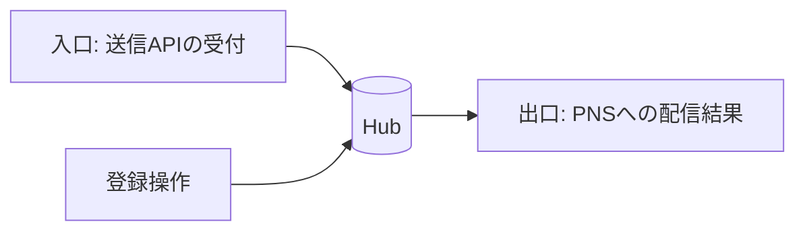
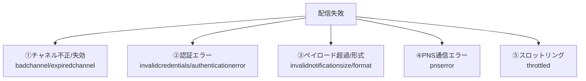
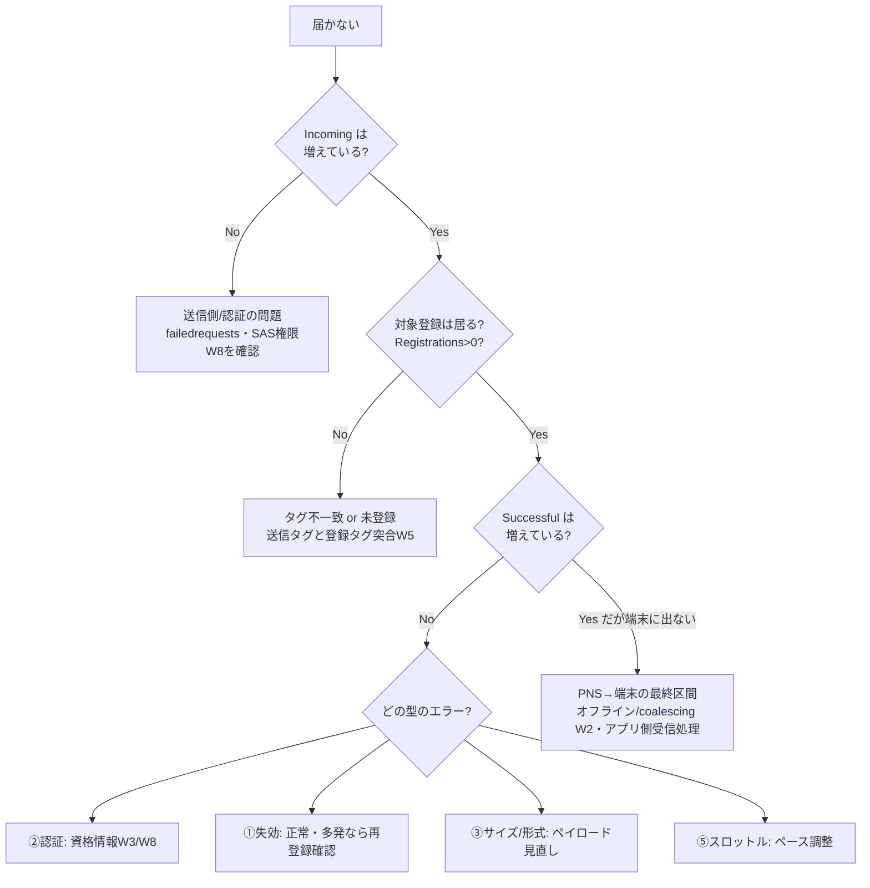

# Week 9 — スケール・監視・障害切り分け：メトリクスの読み方、PNS エラーの分類、スループット/クォータ、コスト

> **Phase 3c** | 学習プラン Week 9 / 10
> 学習目標：NH の**運用監視**を扱う。ポータル/Azure Monitor で見る主要**メトリクス**（Incoming・All Outgoing・Successful・登録操作）、**PNS ごとのエラー分類**（失効/不正チャネル・認証・ペイロード超過/形式・PNS 通信・スロットリング）の読み方を理解する。**SKU 別のスループット/クォータ**（W3 の再訪）と**コストの考え方**、そして「送ったのに届かない」を体系的に切り分ける手順（W7 §5 の実運用版）を身につける。

---

## 0. 今週の位置づけ

W1〜W8 で NH の機能と設計は一通り学んだ。W9 は**本番で回すための視点**——「今どれだけ送れているか」「どこで落ちているか」「どこまでスケールするか」「いくらかかるか」。ここまで揃えば、W10 の最終 PJ（Bicep＋Python で E2E）に運用の目線を持って臨める。

> **初学者向け用語補足：略語・用語の展開**
> - **メトリクス（metrics）** = 時系列で計測される数値指標（送信数・失敗数など）。Azure Monitor が自動収集。
> - **スロットリング（throttling）** = throttle（絞る）＝送りすぎたときに PNS 側が受付を絞る（レート制限）こと。
> - **クォータ（quota）** = 割り当て上限（送信数・デバイス数など）。
> - **スループット（throughput）** = 単位時間に処理できる量（例：秒あたり送信数）。
> - **チャネル（channel）** = ここでは PNS ハンドル（token / registrationId / channel URI）を指すメトリクス用語。
> - **PT1M** = ISO 8601 の期間表記で「1 分」（Period, Time, 1 Minute）。メトリクスの標準サンプリング間隔。
> - **KQL** = Kusto Query Language（Azure Monitor Logs を検索する言語）。

---

## 1. メトリクスの地図 — 「入口・出口・登録」の 3 系統

NH のメトリクスは大きく 3 系統に分けて捉えると読みやすい（出典：[Monitoring data reference](https://learn.microsoft.com/en-us/azure/notification-hubs/monitor-notification-hubs-reference)。サンプリングは全て 1 分＝`PT1M`）。

### 1-1. 入口（Incoming）— バックエンドからの受付

| メトリクス | REST 名 | 意味 |
| --- | --- | --- |
| Incoming Messages | `incoming` | **成功した送信 API 呼び出し**の数（＝受け付けた送信） |
| All Incoming Requests | `incoming.all.requests` | 受信した全リクエスト |
| All Incoming Failed Requests | `incoming.all.failedrequests` | **受付段階で失敗**した数（認証エラー・不正リクエスト等） |
| Scheduled Push Sent / Cancelled | `incoming.scheduled(.cancel)` | スケジュール送信の実行/取消（Standard） |

> **勘所**：`incoming`（受付成功）は W2 §4 の「Enqueued」に対応。**「受け付けた」だけで「届いた」ではない**。届いたかは次の Outgoing 系で見る。

### 1-2. 出口（Outgoing）— PNS への配信結果

| メトリクス | REST 名 | 意味 |
| --- | --- | --- |
| All Outgoing Notifications | `notificationhub.pushes` | ハブから出た全通知 |
| **Successful notifications** | `outgoing.allpns.success` | **全 PNS 合計の成功数**（最重要 KPI） |
| Bad or Expired Channel Errors | `outgoing.allpns.badorexpiredchannel` | ハンドルが失効/不正で失敗 |
| Channel Errors | `outgoing.allpns.channelerror` | チャネルが不正/別アプリ/スロットル/失効 |
| Payload Errors | `outgoing.allpns.invalidpayload` | PNS がペイロード不正を返した |
| External Notification System Errors | `outgoing.allpns.pnserror` | PNS 通信の問題（認証は除く） |

> `outgoing.allpns.*` は**全 PNS 横断の集計**。まずここで「成功 vs 失敗の内訳」を掴み、次に PNS 別（`outgoing.apns.*` / `outgoing.fcmv1.*` / `outgoing.wns.*`）でドリルダウンする。

### 1-3. 登録操作（Registration / Installation）

| メトリクス | REST 名 | 意味 |
| --- | --- | --- |
| Registration Operations | `registration.all` | 登録の作成/更新/照会/削除の合計 |
| Create/Update/Read/Delete | `registration.create/update/get/delete` | 各操作の内訳 |
| Installation Operations | `installation.all` / `.upsert` / `.patch` / `.get` / `.delete` | インストール操作（W4） |

> 登録操作の急増/急減は、アプリのリリースや障害の兆候になる（例：一斉に `registration.create` が跳ねる＝新バージョン配布）。

---

## 2. PNS エラーの分類 — 「落ち方」で原因を当てる

出口の失敗は、**落ち方（エラー種別）で原因がほぼ特定できる**。PNS ごとに名前は違うが、**5 つの型**に整理できる。

| 型 | 代表メトリクス（APNs / FCMv1 / WNS） | 原因 | 打ち手 |
| --- | --- | --- | --- |
| **①チャネル不正/失効** | `apns.badchannel`(status 8) / `fcmv1.badchannel` / `wns.badchannel`(404), `*.expiredchannel` | ハンドルが古い/無効（アプリ削除・再インストール・期限切れ） | **正常な新陳代謝**。NH が失効登録を自動掃除（W2 §1）。多発時は端末側の再登録フローを確認 |
| **②認証エラー** | `apns.invalidcredentials` / `fcmv1.invalidcredentials` / `wns.invalidcredentials`,`invalidtoken`,`wrongtoken` | ハブの PNS 資格情報が誤り/失効/環境違い | **W3 §4・W8 の資格情報を見直す**。ポータルの **PNS Authentication Error** はこれ。APNs は Prod/Sandbox 取り違えに注意 |
| **③ペイロード超過/形式** | `*.invalidnotificationsize` / `*.invalidnotificationformat` | ペイロードが大きすぎ/書式不正 | サイズ削減（ダイレクト送信は 64KB 上限：W7）。テンプレ/ネイティブ書式を検証 |
| **④PNS 通信エラー** | `apns.pnserror` / `fcmv1.pnserror` / `wns.pnserror` | NH↔PNS 間の通信障害（認証以外） | 多くは一時的。NH が指数バックオフで再試行（W7） |
| **⑤スロットリング** | `fcmv1.throttled`(429) / `wns.throttled`(406) / `gcm.throttled` | 送りすぎで PNS がレート制限 | 送信ペースを落とす。バースト送信を平準化 |

> **用語補足：`wrongtoken` / `wrongchannel`（別アプリ問題）**
> WNS `wrongtoken`(403) や FCMv1 `wrongchannel`（Invalid package name）は、「**トークンは有効だが別のアプリのもの**」を意味する。公式の助言："Check that the client app is associated with the same app whose credentials are in the notification hub."（ハブの資格情報と、クライアントアプリが同一アプリか確認せよ）。W3 §1「アプリごとにハブを分ける」が効く。

> **設計の勘所：失効チャネルは"異常"ではない**
> `badorexpiredchannel` は日常的に一定数出る（端末は絶えず入れ替わる）。**成功率（success ÷ pushes）**をトレンドで見て、急落や特定 PNS の偏りを異常として捉えるのが実務。ゼロを目指すものではない。

---

## 3. 監視の実務 — ポータル・Azure Monitor・ログ

### 3-1. ポータルの Overview / Metrics

- **Overview** タブ：Incoming Messages・Registration Operations・Successful Notifications・プラットフォーム別エラーの集計を一目で確認（W7 §5 の入口）。
- **Metrics（Azure Monitor）**：上記メトリクスを任意に組み合わせてグラフ化・**アラート**を設定（例：`outgoing.apns.invalidcredentials > 0` で通知）。

### 3-2. リッチテレメトリ/PNS フィードバックは Standard 限定

W3 §2・W7 §5 の再確認：**per-message telemetry・PNS フィードバック・一括エクスポート/インポートは Standard 限定**。Free/Basic では SDK は例外、REST は HTTP 403。詳細な送信結果を運用で使うなら Standard が要る。

### 3-3. 運用ログ（Operational Logs）

- **管理操作**（ハブ作成・資格情報更新など）は Operational Logs に記録される（`AzureActivity` / `AzureDiagnostics`、KQL で検索可）。
- ただし公式明記："**Data operations aren't captured**, because of the high volume."（**データ操作＝個々の送信/登録は量が多すぎて記録されない**）。個別送信の追跡はメトリクス＋per-message telemetry（Standard）で行う。

---

## 4. スループット・クォータ・スケール（W3 の再訪）

### 4-1. SKU とスケール

W3 §2 のとおり、含まれるプッシュ数とアクティブデバイス上限が SKU で決まる（Free 500 / Basic 20 万 / Standard 1000 万台）。**Standard はさらに追加のスループット割り当てを購入**して大規模配信を伸ばせる。公式の設計思想（W1）どおり、**再アーキテクチャやデバイスのシャーディング無しに数百万台へ**送れる。

### 4-2. バースト送信の平準化

- 大規模ブロードキャストは、NH がバッチ並列で PNS へ流す（W2 §4）が、**PNS 側のスロットリング**（型⑤）は避けられない。`*.throttled` が出るなら送信を平準化する。
- スケジュール送信（Standard）で時刻をずらす、セグメントを分割して段階送信、といった運用で山を崩す。

> **用語補足：シャーディング（sharding）が要らない意味**
> シャーディング＝負荷分散のためにデータ/処理を複数の区画に手で割ること。自前実装なら「端末を 10 個の PNS 接続に振り分け…」と作り込む必要があるが、NH はそれを内部で吸収する。運用者は SKU を上げるだけでよい。

---

## 5. コストの考え方

- **課金の単位は名前空間**（W3 §1）。SKU の基本料金＋**含まれるプッシュ数を超えた分の従量**（Basic/Standard）。金額はリージョン/通貨依存（W3 §2、公式料金ページ）。
- **アクティブデバイス数**が SKU 選定の主軸（W3 §2）。500 を超えたら Free を出る。
- **可用性ゾーン（AZ）**は追加コスト（W3 §3）。本番の可用性要件と天秤にかける。
- 無駄打ちの削減：失効チャネルへの送信は成功にカウントされない。**登録の新陳代謝を健全に保つ**（端末の再登録フロー）ことが、実質的にコスト効率にも効く。

---

## 6. 障害切り分けフロー（W7 §5 の実運用版）

「送ったのに届かない」を上流から下流へ順に潰す。

- **①まず入口**：`incoming` が増えていなければ、そもそも送信が届いていない（バックエンドの送信コード・SAS 権限＝W8）。
- **②次に宛先**：Registrations = 0 なら W5 のタグ突き合わせ・未登録を疑う。
- **③次に出口**：成功が増えないなら、§2 のエラー型で原因を特定。
- **④最後の区間**：出口が成功でも端末に出ないなら、PNS→端末（オフライン保管・coalescing＝W2 §4、アプリの受信処理・通知許可設定）を疑う。ここは NH の管轄外。

---

## 7. 自己チェック

1. メトリクスの 3 系統（入口・出口・登録）をそれぞれ代表指標とともに述べよ。
2. `incoming`（Incoming Messages）は「届いた数」か。違うなら何か。
3. PNS 配信失敗の **5 つの型**を挙げ、それぞれの代表的な打ち手を述べよ。
4. `badorexpiredchannel` が一定数出るのは異常か。監視では何を見るべきか。
5. `wrongtoken` / `wrongchannel` は何を示すか。W3 のどの設計と関係するか。
6. リッチテレメトリ/PNS フィードバックはどの SKU で使えるか。個々の送信は運用ログに残るか。
7. 「送ったのに届かない」を上流から切り分ける順序を説明せよ。最終区間（PNS→端末）で疑う点は？
8. スロットリング（型⑤）が出たときの運用上の打ち手は？

---

## 8. 次週予告（W10：最終 PJ ― Bicep＋Python で E2E）

いよいよ総仕上げ。**Bicep** で Namespace＋Hub を宣言的に作成し（W3）、**Python** から NH へ**テンプレート通知をタグ指定で送信**する（W5・W6・W7）。認証は SAS（W8）、送信結果はメトリクスで確認（W9）。登録は実端末の代わりにダミー Installation（W4）で用意し、`$InstallationId:` や タグ式でのターゲティングを通す。これまでの 9 週——PNS の仕組み・登録・タグ・テンプレート・送信・セキュリティ・監視——を 1 本の動くコードに束ねる。

---

### 参考（出典）
- [Monitoring data reference for Azure Notification Hubs（全メトリクス）](https://learn.microsoft.com/en-us/azure/notification-hubs/monitor-notification-hubs-reference)
- [Diagnose dropped notifications（障害切り分け）](https://learn.microsoft.com/en-us/azure/notification-hubs/notification-hubs-push-notification-fixer)
- [Notification Hubs pricing（SKU・スループット・コスト）](https://azure.microsoft.com/en-us/pricing/details/notification-hubs/)
