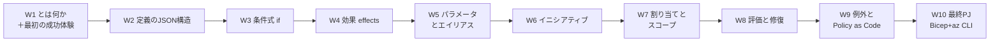
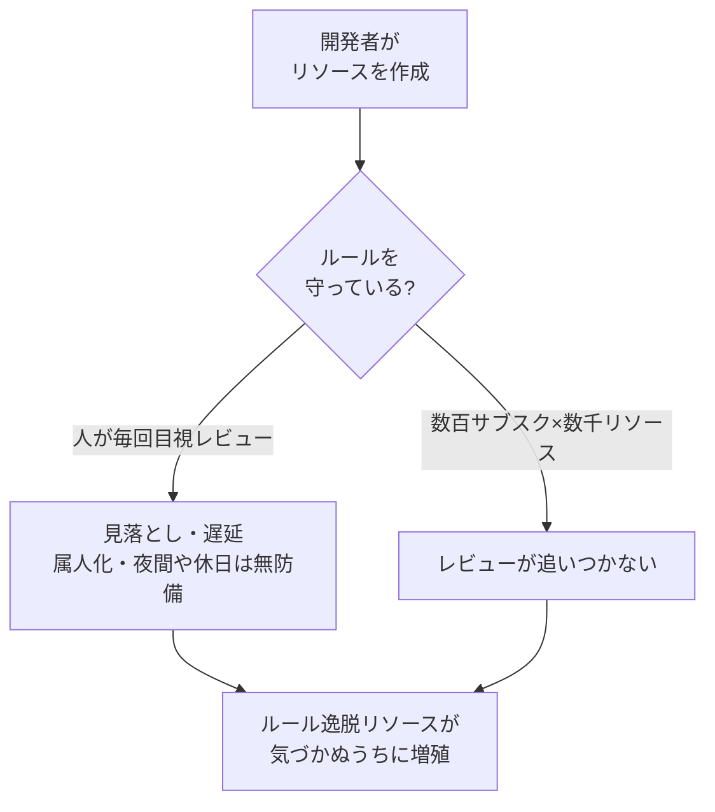
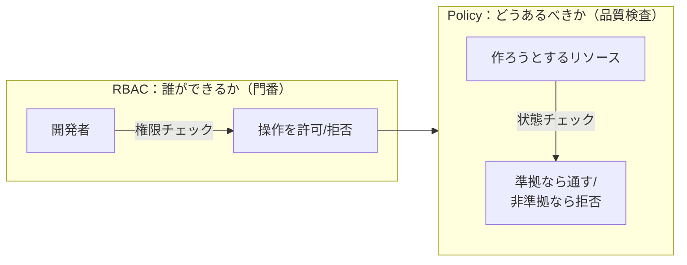
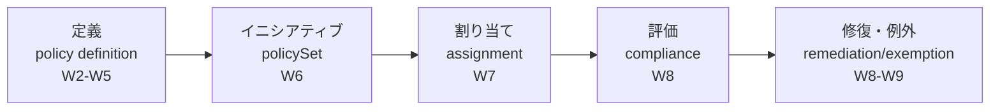
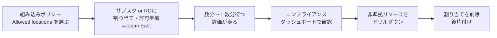

# Week 1 — Azure Policy とは何か：クラウド上の大量リソースを「あるべき状態」に保ち、コンプライアンスを大規模に測るサービス

> **Phase 1a** | 学習プラン Week 1 / 10
> 学習目標：Azure Policy が「どんな問題を解くサービスなのか」を、似て非なる RBAC（アクセス制御）と対比しながら理解する。組み込みポリシーを 1 つ割り当てて、準拠状況ダッシュボードで「準拠／非準拠」を自分の目で確認し、後片付けまでできるようになる。

---

## 0. 今週の位置づけ

この教材は Azure Policy（アジュール・ポリシー）を **10 週**で学ぶ。全体像は次のとおり。

今週（W1）のゴールは、**細かい JSON 文法にはまだ立ち入らず**、「Azure Policy とは何のためのサービスか」を腹落ちさせることである。そのうえで、組み込みポリシーを 1 つ割り当てて動きを体感する。文法・条件式・効果は W2 以降で順に深掘りする。

> **初学者向け用語補足：略語の展開**
> - **RBAC** = Role-Based Access Control（Role=役割 / Based=基づく / Access=アクセス / Control=制御）＝「ロール（役割）に基づくアクセス制御」。
> - **DINE** = DeployIfNotExists（Deploy=デプロイ／配備 / If=もし / Not=ない / Exists=存在する）＝「もし（関連リソースが）存在しなければデプロイする」という効果。
> - **PaC** = Policy as Code（Policy=ポリシー / as=として / Code=コード）＝「ポリシーをコードとして管理する」運用手法。
> - **MG** = Management Group（Management=管理 / Group=グループ）＝「管理グループ」。複数サブスクリプションを束ねる上位のスコープ。
> - **JSON**（ジェイソン）= JavaScript Object Notation。`{ }` と `[ ]` で構造を表すテキスト形式のデータ記法。

---

## 1. ガバナンスの課題 — 「人手」では守り切れない

クラウドでは、開発チームが日々リソース（仮想マシン、ストレージ、データベース…）を自由に作れる。これは速さの源だが、放っておくと組織のルールがすぐ崩れる。たとえば次のような社内標準を考える。

- リソースは **日本リージョン（Japan East / Japan West）にだけ**作る（データ所在地の要件）。
- すべてのリソースに **`CostCenter`（原価部門）タグ**を必ず付ける（課金の按分のため）。
- ストレージは **HTTPS 通信のみ**許可する（暗号化されていない通信を禁止）。
- 高価な **GPU 付き VM サイズ**は勝手に作らせない（コスト暴走を防ぐ）。

> **用語補足：ガバナンス（governance）とは**
> 「統治・統制」の意。ここでは「組織のルール（標準）を、クラウド上の全リソースに一貫して効かせ続ける仕組み」を指す。**タグ（tag）**＝リソースに付ける `キー: 値`（例 `CostCenter: 1234`）のラベルで、検索・課金按分・自動化の目印に使う。

これらを **Excel の手順書と人力レビュー**で守ろうとすると、たちまち破綻する。

問題の本質は 3 つ。**(1) 数が多すぎて人が追えない**、**(2) 作られた"後"にしか気づけない**、**(3) 誰がレビューするかで結果がぶれる**。ここで登場するのが Azure Policy である。

---

## 2. Azure Policy の正体 — 「あるべき状態」を宣言して大規模に強制・監査する

Azure Policy は、リソースの**プロパティ（性質）を業務ルールと突き合わせて評価**し、ルールに反するものを**拒否したり・監査（記録）したり・自動で直したり**するサービスである。公式は次のように定義する。

> "Azure Policy evaluates resources and actions in Azure by comparing the properties of those resources to business rules."
> （出典：[Overview of Azure Policy](https://learn.microsoft.com/en-us/azure/governance/policy/overview)）

ルールは **JSON 形式**で書き、これを**ポリシー定義（policy definition）**と呼ぶ。定義を**スコープ（管理グループ／サブスクリプション／リソースグループ／個別リソース）に割り当てる（assign）**と、その配下のリソースが評価対象になる。

### 2-1. RBAC と Policy は「直交」する — 混同しやすい二者の対比

もっとも大切な理解は、**RBAC と Azure Policy はまったく別の軸**だという点である。公式は「Azure Policy は、誰が変更したか・誰に権限があるかに関係なく、リソースの状態がルールに準拠していることを保証する」と述べる。

| 観点 | Azure RBAC | Azure Policy |
| --- | --- | --- |
| 何を制御するか | **誰が**何をできるか（人の**操作**の可否） | リソースが**どうあるべきか**（**状態**の可否） |
| 問いの形 | 「この人は VM を作る**権限がある**か？」 | 「作られた VM は**ルールに合っている**か？」 |
| 主役 | ユーザー・グループ・サービスプリンシパル | リソースのプロパティ（場所・SKU・タグ・設定…） |
| 典型例 | 「開発者ロールに VM 作成権限を付与」 | 「日本リージョン以外への作成を拒否」 |
| 権限があっても | — | **権限があっても、結果が非準拠なら作成／更新を拒否する** |

公式の核心的な一文：

> "Even if an individual has access to perform an action, if the result is a non-compliant resource, Azure Policy still blocks the create or update."
> （権限を持つ人であっても、その結果が非準拠リソースになるなら、Azure Policy は作成・更新をブロックする。出典：[Overview](https://learn.microsoft.com/en-us/azure/governance/policy/overview#azure-policy-and-azure-rbac)）

つまり **RBAC の門（権限）を通った操作でも、Policy の品質検査に落ちれば止まる**。二重の関所であり、公式は「RBAC と Azure Policy の組み合わせが Azure における完全なスコープ制御を提供する」とまとめる。

> **初学者向け用語補足：サービスプリンシパル（service principal）**
> 人間ではなく、**アプリや自動化処理のための "利用者アカウント"**。CI/CD パイプラインやスクリプトが Azure を操作するときに使う。RBAC ではユーザー・グループと並ぶ主役の 1 つ。W8 の修復（remediation）で登場する**マネージド ID**は、このサービスプリンシパルを Azure が自動管理してくれる仕組みである。

---

## 3. 他のガバナンス機能との棲み分け

Azure には統制のための機能が複数ある。Azure Policy の輪郭をはっきりさせるため、隣接機能と並べて整理する。

| 機能 | 何をするか | Policy との関係 |
| --- | --- | --- |
| **Azure Policy** | リソースの状態をルールと照合し、拒否／監査／修復する | 本教材の主役 |
| **RBAC** | 人の操作権限を制御する | 直交（§2-1）。両輪で使う |
| **Management Groups（管理グループ）** | 複数サブスクリプションを階層的に束ねる**入れ物** | Policy を割り当てる**上位スコープ**を提供する（W7） |
| **Resource Locks（リソースロック）** | 特定リソースの**削除・変更を凍結**する | 個別の保護。ルールの一括適用は Policy の役目 |
| **Microsoft Defender for Cloud** | セキュリティ体制の評価・推奨・脅威検知 | 内部で Azure Policy の**イニシアティブ**を使って準拠状況を測る（W6・W9） |
| **Azure Blueprints（旧）** | 環境の設計図を一括展開（**非推奨・後継は Deployment Stacks**） | 現在は Bicep/ARM＋Policy＋Deployment Stacks に置き換え |

> **用語補足：スコープ（scope）とは**
> 「どの範囲に効かせるか」の対象範囲。Azure では上から **管理グループ → サブスクリプション → リソースグループ → 個別リソース** という入れ子（ツリー）構造になっており、**上位に割り当てたポリシーは下位すべてに継承される**。詳細は W7 で扱う。

---

## 4. 全体ワークフローの予告 — この 10 週で組み立てるパイプライン

Azure Policy の実務は、おおむね次の 5 段のパイプラインである。今週は最上流を体感し、各段は W2 以降で深掘りする。

| 段 | 用語 | 一言でいうと | 深掘り週 |
| --- | --- | --- | --- |
| ① 定義 | policy definition | 「何を・どう判定して・どうするか」を JSON で書く | W2〜W5 |
| ② まとめ | initiative（policySet） | 複数の定義を 1 つの束にして管理を楽にする | W6 |
| ③ 割り当て | assignment | 定義／束を「どのスコープに効かせるか」決める | W7 |
| ④ 評価 | compliance evaluation | 対象リソースが準拠か非準拠かを判定・集計する | W8 |
| ⑤ 是正 | remediation / exemption | 既存の非準拠を直す／正当な理由で除外する | W8〜W9 |

このうち①の「どうするか」に当たるのが**効果（effect）**である。公式が挙げる効果は現在次の 11 種で、W4 で全種を掘る。

> `addToNetworkGroup` / `append` / `audit` / `auditIfNotExists` / `deny` / `denyAction` / `deployIfNotExists` / `disabled` / `manual` / `modify` / `mutate`
> （出典：[Azure Policy definitions effect basics](https://learn.microsoft.com/en-us/azure/governance/policy/concepts/effect-basics)）

代表例だけ先取りすると、**`audit`**＝違反を記録するだけ（止めない）、**`deny`**＝違反する作成・更新を拒否する、**`deployIfNotExists`（DINE）**＝不足している設定を自動で補う。公式は運用の鉄則として「まず `audit`／`auditIfNotExists` で影響を観測し、そのあと `deny`／`modify`／`deployIfNotExists` の強制に進む」ことを推奨している。

---

## 5. 課金モデル — Policy 本体は無料、例外は「マシン構成」

Azure Policy で **Azure リソースを統制すること自体は無料**である（割り当て数・評価回数で課金されない）。ただし例外が 2 つある。

1. **マシン構成（Machine Configuration、旧 Guest Configuration＝ゲスト構成）**：VM の OS 内部の設定を検査・適用する機能。**Azure Arc 経由で接続した Azure 外のサーバー**に対しては **1 サーバーあたり月額課金**が発生する（Azure 上の VM は対象外）。
2. **`deployIfNotExists`／`modify` が実際にデプロイ・変更したリソース**：Policy の評価は無料でも、**その結果作られたリソース（例：Log Analytics への診断設定、追加の拡張機能）は通常どおり課金**される。

> **用語補足：Azure Arc（アジュール・アーク）とは**
> オンプレミスや他社クラウドのサーバー・Kubernetes を、**Azure の管理面に"接続"して Azure リソースのように扱えるようにする**橋渡しサービス。これにより Azure Policy をデータセンター内のサーバーにも効かせられる（＝ハイブリッド・ガバナンス）。W9 で俯瞰する。

出典：[Pricing - Azure Policy](https://azure.microsoft.com/en-us/pricing/details/azure-policy/)（Azure リソースの統制は無償／マシン構成は Arc 接続サーバーに対し従量課金）。

---

## 6. 最初の成功体験 — 組み込みポリシーを割り当てて準拠状況を見る

理屈はここまで。実際に手を動かして、Policy の一連の流れ（割り当て → 評価 → ダッシュボード確認 → 後片付け）を体感する。**カスタム定義はまだ書かない**。Azure に最初から用意されている**組み込み（built-in）ポリシー**を 1 つ使う。

> **狙い**：JSON もカスタム定義もまだ理解していない段階で、「割り当てるとどうなるか」を**目で見て**掴む。ここで見た画面の裏側を、W2 以降で分解していく。

### 手順の全体像

### やること（Azure Portal 版）

1. Azure Portal で **「ポリシー（Policy）」**サービスを開く。
2. 左メニュー **「定義（Definitions）」**で、カテゴリ = **General**、種類 = **組み込み（Built-in）**に絞り、**「許可される場所（Allowed locations）」**を探す。
   - この定義の効果は **`deny`**。許可リスト外のリージョンへの**新規作成を拒否**する（既存リソースは監査で可視化）。
3. その定義から **「割り当て（Assign）」**を押す。
   - **スコープ**：練習用の**リソースグループ 1 つ**（影響範囲を小さくするため。サブスク全体はまだ避ける）。
   - **パラメータ**：許可する場所 = **Japan East** のみ、などに設定する。
   - **enforcementMode（強制モード）**：まずは既定（Default＝強制）でよいが、「効果を出さず評価だけ」の **DoNotEnforce** という選択肢があることも覚えておく（W7）。
4. 割り当てを作成したら、**評価が走るのを待つ**。割り当て直後の評価は数分〜十数分かかることがある（定期評価は 24 時間周期。トリガーの詳細は W8）。
5. 左メニュー **「コンプライアンス（Compliance）」**を開き、作った割り当ての**準拠率**を見る。
   - **準拠（Compliant）／非準拠（Non-compliant）**のリソース数が集計される。
   - 非準拠があれば**クリックしてドリルダウン**し、「どのリソースが・なぜ非準拠か」を確認する。
6. 動きを確認できたら、**必ず割り当てを削除して後片付けする**（「割り当て（Assignments）」から該当を削除）。組み込み定義自体は消えないので、消すのは割り当てだけでよい。

> **注意：`deny` は"これから"にしか効かない**
> `deny` 効果は**新規作成・更新をブロック**する。**すでに存在する**許可外リージョンのリソースは、`deny` では消えも動きもせず、コンプライアンス画面に**「非準拠」として可視化されるだけ**である。既存を実際に直すのは**修復（remediation、W8）**の役目。「拒否」と「是正」は別物、と押さえておく。

> **用語補足：組み込み（built-in）と カスタム（custom）**
> **組み込み**＝Microsoft が用意済みで、すぐ割り当てられる定義（例：Allowed locations、Allowed Storage Account SKUs、Add a tag to resources）。**カスタム**＝自分で JSON を書いて作る定義。W2 以降で組み込み定義を"読んで"文法を学び、W10 で自作する。

---

## ハンズオン チェックリスト

- [ ] Azure Portal で「ポリシー」サービスを開いた
- [ ] 組み込み定義「許可される場所（Allowed locations）」を見つけた
- [ ] 練習用リソースグループ 1 つを**スコープ**に割り当てを作成した（許可地域＝Japan East 等）
- [ ] 数分〜十数分待って、コンプライアンス画面で**準拠率**を確認した
- [ ] 非準拠リソースがあれば**ドリルダウン**して理由を確認した（無ければ、許可外リージョンに小さなリソースを 1 つ作って再評価を待ち、非準拠になることを確認）
- [ ] `deny` は既存リソースを消さず「非準拠として可視化するだけ」だと体感した
- [ ] **割り当てを削除して後片付け**した（定義は残る）

---

## 自己チェック

週末にドキュメントを閉じて答えてみる。

1. **Azure Policy は何をするサービスか？ 一言で。**
   - キーワード：リソースの**プロパティ**を業務ルールと照合／**あるべき状態**／大規模なコンプライアンス評価
2. **RBAC と Azure Policy はどう違うか？「権限があっても〜」の一文で説明せよ。**
   - キーワード：RBAC＝**誰ができるか**（操作）／Policy＝**どうあるべきか**（状態）／権限があっても結果が非準拠なら**拒否**される
3. **`audit` と `deny` の違いは？ 運用ではどちらから始めるべきか？**
   - キーワード：audit＝記録するだけ止めない／deny＝作成・更新を拒否／**まず audit で影響観測 → 後で deny**
4. **`deny` を割り当てたとき、既存の違反リソースはどうなるか？**
   - キーワード：消えも止まりもしない／**非準拠として可視化されるだけ**／是正は**修復（remediation）**の役目
5. **Azure Policy の課金はどうなっているか？ 例外は？**
   - キーワード：Azure リソースの統制は**無料**／例外＝**マシン構成（Arc 接続サーバー従量課金）**・DINE/modify が作ったリソースは通常課金
6. **ポリシーを割り当てる「スコープ」を上位から 4 段挙げよ。**
   - キーワード：管理グループ → サブスクリプション → リソースグループ → 個別リソース（**上位は下位に継承**）

---

## 次週の予告（Week 2）

W2 では、今週「割り当てて動かした」組み込み定義の**中身（JSON 構造）**を開く。`displayName` / `description` / **`mode`（all と indexed の違い）** / `metadata` / `parameters` / **`policyRule`（if / then）**という定義の骨格を、実際の組み込み定義を読みながら地図化する。「許可される場所」がどんな `if`（条件）と `then`（効果）で出来ているかを解剖し、W3 の条件式・W4 の効果へつなぐ。
