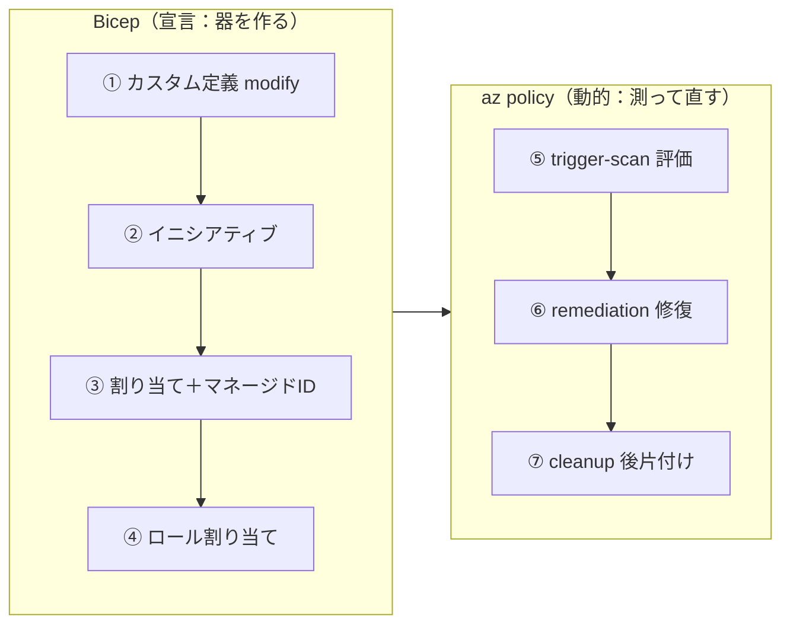
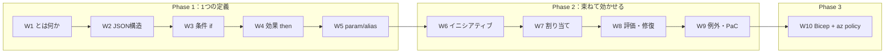

# Week 10（最終PJ）— Bicep + az policy で E2E 実装：定義→イニシアティブ→割り当て→評価→修復

> **Phase 3 / 最終PJ** | 学習プラン Week 10 / 10
> 学習目標：W2〜W9 で学んだ全要素を、実際に動く 1 つのコードに落とす。**Bicep** で「カスタムポリシー定義（modify）＋組み込みを束ねたイニシアティブ＋マネージド ID 付き割り当て＋ロール割り当て」をサブスクリプションスコープにデプロイし、**`az policy`** で評価（trigger-scan）・修復（remediation）・後片付けまでを通す。各コード片が W2〜W9 のどの概念に対応するかを対応表で振り返り、教材を締めくくる。

---

## 0. 今週の位置づけ — 全部を 1 本のコードに



実装ファイルは次の通り（[`code/README.md`](../code/README.md) に実行手順）。

| ファイル | 中身 |
| --- | --- |
| [`infra/main.bicep`](../infra/main.bicep) | 定義・イニシアティブ・割り当て・ロール割り当て |
| [`infra/main.bicepparam`](../infra/main.bicepparam) | パラメータ（リージョン／タグ／許可地域） |
| [`code/deploy.sh`](../code/deploy.sh) | サブスクスコープでデプロイ |
| [`code/remediate.sh`](../code/remediate.sh) | 評価 → 準拠確認 → 修復 |
| [`code/cleanup.sh`](../code/cleanup.sh) | 後片付け |

> **役割分担のキモ**：**"器"（定義・割り当て）は Bicep で宣言的に**、**"測る・直す"（評価・修復）は az policy で動的に**。ポリシーの世界は「宣言（あるべき状態）」と「実行（評価・是正）」が分かれている、という本教材の芯がそのまま形になる。

---

## 1. 何を作るか — 2 つのルールを 1 つのイニシアティブに

| ルール | 効果 | 由来 | 是正 |
| --- | --- | --- | --- |
| **必須タグ（`environment`）が無ければ付与** | `modify` | 自作のカスタム定義 | remediation で既存も是正 |
| **許可リージョン（Japan East/West）以外を拒否** | `deny` | 組み込み「Allowed locations」 | 新規のみ（既存は可視化） |

この 2 つを**イニシアティブ「ガバナンス基本セット」**に束ね（W6）、サブスクに 1 回で割り当てる（W7）。modify のためにマネージド ID を付け（W7）、Tag Contributor ロールを Bicep で付与する（W8）。

---

## 2. Bicep を読む — 各ブロックと週の対応

`targetScope = 'subscription'`（サブスクにデプロイ）。以下、[`infra/main.bicep`](../infra/main.bicep) の要点。

### ① カスタム定義（modify）— W2・W3・W4

```bicep
resource ensureTagPolicy 'Microsoft.Authorization/policyDefinitions@2023-04-01' = {
  name: 'ensure-required-tag'
  properties: {
    mode: 'Indexed'                       // タグ強制 → indexed（W2）
    parameters: { tagName: {...}, tagValue: {...} }   // 穴（W5）
    policyRule: {
      if: { field: '[concat(...tagName...)]', exists: 'false' }   // タグが無い（W3）
      then: {
        effect: 'modify'                  // 変更系（W4）
        details: {
          roleDefinitionIds: [ ...Tag Contributor... ]  // 修復用権限（W4/W8）
          conflictEffect: 'deny'
          operations: [ { operation: 'addOrReplace', field: 'tags[...]', value: '...' } ]
        }
      }
    }
  }
}
```

- `mode: Indexed`（W2）、`if.exists: false`（W3）、`effect: modify` と `operations`・`roleDefinitionIds`（W4）、`parameters`（W5）。**1 つのリソースに W2〜W5 が全部出ている。**

> **Bicep の落とし穴：ポリシー関数式のエスケープ**
> `[concat('tags[', parameters('tagName'), ']')]` のような**ポリシー言語の式**は、Bicep の文字列補間（`${}`）ではなく**そのまま Azure 側に渡す文字列**。Bicep 内ではシングルクォートを `\'` でエスケープして 1 つの文字列として書く（`'[concat(\'tags[\', parameters(\'tagName\'), \']\')]'`）。W3 の「`[...]` はポリシー関数式」がここで効く。

### ② イニシアティブ — W6

```bicep
resource governanceInitiative 'Microsoft.Authorization/policySetDefinitions@2023-04-01' = {
  properties: {
    parameters: { initTagName: {...}, initTagValue: {...}, initAllowedLocations: { strongType: 'location' } }
    policyDefinitions: [
      { policyDefinitionReferenceId: 'ensureTag',        policyDefinitionId: ensureTagPolicy.id,
        parameters: { tagName: { value: '[parameters(\'initTagName\')]' }, ... } }
      { policyDefinitionReferenceId: 'allowedLocations',  policyDefinitionId: allowedLocationsBuiltinId,
        parameters: { listOfAllowedLocations: { value: '[parameters(\'initAllowedLocations\')]' } } }
    ]
  }
}
```

- `policyDefinitions` 配列に**自作定義（`.id` 参照）と組み込み定義（`subscriptionResourceId(...)`）を混在**。`policyDefinitionReferenceId`（あだ名）と、イニシアティブ params を各定義へ `[parameters('init...')]` で引き回す（W6）。

### ③ 割り当て＋マネージド ID — W7

```bicep
resource assignment 'Microsoft.Authorization/policyAssignments@2023-04-01' = {
  location: location                 // システム割り当てには location 必須（W7）
  identity: { type: 'SystemAssigned' }
  properties: {
    policyDefinitionId: governanceInitiative.id
    enforcementMode: 'Default'       // 強制（W7）。試すなら DoNotEnforce
    parameters: { initTagName: {...}, initTagValue: {...}, initAllowedLocations: {...} }
  }
}
```

### ④ ロール割り当て（手動付与）— W8

```bicep
resource tagRoleAssignment 'Microsoft.Authorization/roleAssignments@2022-04-01' = {
  name: guid(subscription().id, assignment.name, tagContributorRoleId)
  properties: {
    principalId: assignment.identity.principalId   // ③のマネージドID
    roleDefinitionId: subscriptionResourceId('Microsoft.Authorization/roleDefinitions', tagContributorRoleId)
    principalType: 'ServicePrincipal'
  }
}
```

- **Bicep（SDK）では Portal のような自動ロール付与が無い**ので、`roleAssignments` を明示的に作る（W8）。これがマネージド ID に「タグを書く」権限を与え、remediation を可能にする。この一手が W5 の `assignPermissions` 補足・W7 の identity・W8 の権限付与を"実装"している。

---

## 3. デプロイと評価・修復 — az policy を回す

### ① デプロイ（[`deploy.sh`](../code/deploy.sh)）

```bash
az deployment sub create \
  --location japaneast \
  --template-file infra/main.bicep \
  --parameters infra/main.bicepparam
```

サブスクスコープのデプロイ。出力に定義／イニシアティブ／割り当ての ID が出る。

### ② 評価と修復（[`remediate.sh`](../code/remediate.sh)）

```bash
az policy state trigger-scan --resource-group rg-policy-demo      # 今すぐ評価（W8）
az policy state list --filter "PolicyAssignmentId eq '<id>' and ComplianceState eq 'NonCompliant'"
az policy remediation create --policy-assignment '<id>' --definition-reference-id ensureTag   # 既存を是正
```

- タグ無しの既存リソースは、評価で **Non-compliant**（W8）。
- `remediation create` で **modify のタグ付与を既存に適用** → 再評価で **Compliant** に（W8）。
- **`deny`（許可リージョン）は既存を直さない**（新規拒否のみ）。修復対象は modify だけ、を身をもって確認する。

### ③ 後片付け（[`cleanup.sh`](../code/cleanup.sh)）

依存の逆順で消す：**ロール割り当て → 割り当て → イニシアティブ → 定義**。割り当てを残したまま定義は消せないため順序が重要。

---

## 4. 全 10 週の対応表 — このコードに全部入っている

| 週 | 概念 | このPJでの現れ方 |
| --- | --- | --- |
| W1 | ガバナンス／RBAC vs Policy | タグ・リージョンを人手でなくポリシーで強制 |
| W2 | 定義の JSON 構造・mode | `policyDefinitions` リソース・`mode: Indexed` |
| W3 | 条件式 if | `if.exists: false`（タグ有無）・ポリシー関数式のエスケープ |
| W4 | 効果 then | `effect: modify` の `operations`／組み込みは `deny` |
| W5 | パラメータ・エイリアス | `parameters`（tagName 等）・`strongType: location` |
| W6 | イニシアティブ | `policySetDefinition`・`policyDefinitionReferenceId`・引き回し |
| W7 | 割り当て・スコープ | `policyAssignments`・`identity`・`enforcementMode`・サブスクスコープ |
| W8 | 評価・修復 | `trigger-scan`／`remediation create`／`roleAssignments` 手動付与 |
| W9 | 例外・PaC | Bicep で PaC を実践（この構成自体が Policy as Code） |
| W10 | E2E | 本PJ全体 |

---

## 5. 検証状況

- **`az bicep build --file infra/main.bicep` 通過確認済み**（構文・スキーマOK。この環境の Bicep 0.43／az 2.86 で確認）。
- `bash -n` で 3 スクリプトの構文確認済み。
- 実デプロイ（`az deployment sub create`）は**課金対象サブスクと権限**（Resource Policy Contributor＋User Access Administrator/Owner）が要るため、手順は [`code/README.md`](../code/README.md) に記載。動かす際は**検証用 RG で試し、`cleanup.sh` と `az group delete` で必ず後片付け**する。

---

## 6. 全 10 週の振り返り



- **Phase 1（W1–W5）**：ポリシー定義そのものの読み書き。「あるべき状態を JSON で宣言する」を、条件・効果・パラメータ・エイリアスまで分解した。
- **Phase 2（W6–W9）**：束ねて（イニシアティブ）・効かせて（割り当て・スコープ）・測って直して（評価・修復）・正しく外す（例外）・コードで回す（PaC）。運用の全体像。
- **Phase 3（W10）**：全部を Bicep + az policy で実装。

**この教材で身につけた芯**：
1. **RBAC（誰が）と Policy（どうあるべきか）は直交**（W1）。
2. ポリシーは **`if`（対象）と `then`（効果）**の 2 部（W3・W4）。
3. **deny は新規のみ・既存は modify/DINE ＋ remediation で是正**（W4・W8）。
4. **「外す/効かせない」には notScopes / exemption / disabled / DoNotEnforce の 4 手段**があり使い分ける（W9）。
5. 大規模運用は **Policy as Code**（W9・W10）。

お疲れさまでした。ここから先は、組み込みイニシアティブ（Microsoft Cloud Security Benchmark 等）を実環境に当てて準拠を測る、規制コンプライアンスを可視化する、EPAC など PaC ツールを深掘りする、といった応用へ進める。

---

## ハンズオン チェックリスト

- [ ] `az bicep build --file infra/main.bicep` が通ることを確認した
- [ ] `az login` → `az account set` で対象サブスクを選んだ
- [ ] `deploy.sh` で定義・イニシアティブ・割り当て・ロール割り当てを作成した
- [ ] タグ無しリソースを検証用 RG に作り、`trigger-scan` 後に Non-compliant を確認した
- [ ] `remediation create` で既存にタグが付き、再評価で Compliant になることを確認した
- [ ] `deny`（リージョン）は既存を直さないことを確認した
- [ ] `cleanup.sh` と `az group delete` で**必ず後片付け**した
- [ ] 全 10 週の対応表で、各コード片がどの概念かを説明できた

---

## 自己チェック（総まとめ）

1. **このPJで「器を宣言」するのと「測って直す」のは、それぞれ何のツールか？**
   - キーワード：器＝Bicep（宣言）／測る・直す＝az policy（trigger-scan / remediation）
2. **modify の定義に `roleDefinitionIds`、割り当てに `identity`、さらに Bicep で `roleAssignments` を書く——3 つが揃って初めて何ができる？**
   - キーワード：マネージド ID に権限が付き、**既存リソースの remediation（タグ付与）**が可能になる
3. **後片付けの削除順序と、その理由は？**
   - キーワード：ロール割り当て→割り当て→イニシアティブ→定義／**割り当てを残すと定義を消せない**
4. **この構成のうち `deny` と `modify` で、既存リソースへの効き方はどう違う？**
   - キーワード：deny＝新規拒否のみ・既存は可視化／modify＝remediation で既存も是正
5. **この Bicep 一式が「Policy as Code」である理由は？**
   - キーワード：定義・イニシアティブ・割り当てを**コードで宣言し Git 管理・再現可能にデプロイ**（W9）
