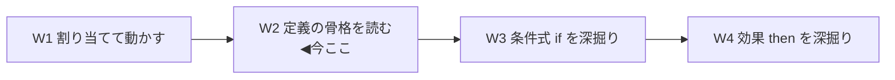
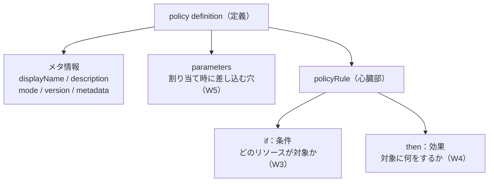
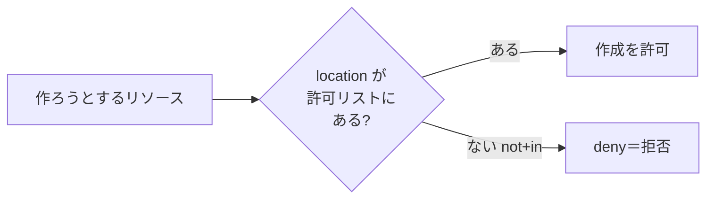
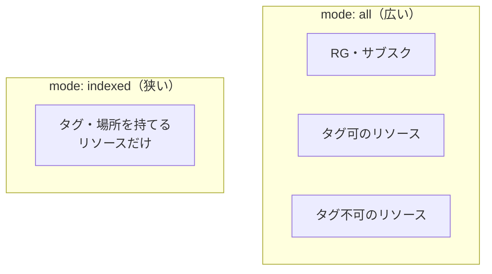
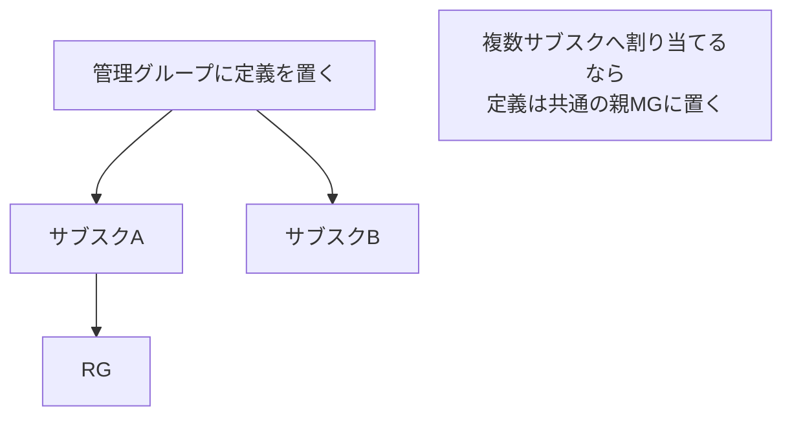

# Week 2 — ポリシー定義の JSON 構造：W1 で割り当てた「許可される場所」を解剖する

> **Phase 1b** | 学習プラン Week 2 / 10
> 学習目標：ポリシー定義（policy definition）の JSON 骨格（`displayName` / `description` / `mode` / `version` / `metadata` / `parameters` / `policyRule`）を地図として掴む。W1 で割り当てた組み込み定義「許可される場所（Allowed locations）」の実物 JSON を 1 行ずつ読み、**`if`（条件）→ `then`（効果）**という心臓部の形と、`mode` の `all`／`indexed` の違い、定義の置き場所（definition location）を理解する。

---

## 0. 今週の位置づけ

W1 では、組み込みポリシーを**割り当てて動かした**。今週はその**中身（JSON）を開く**。まだ条件式の細かい文法（W3）や効果の全種（W4）には踏み込まず、**「定義とはどんな部品でできているか」の全体地図**を作るのが目的である。



W2 で読む「許可される場所」の JSON を、W3（`if` の部分）と W4（`then` の部分）でさらに分解していく。今週はその**見取り図**を頭に入れる回である。

---

## 1. 定義の骨格 — 7 つの部品

公式によれば、ポリシー定義は JSON で次の要素を持つ（[定義構造の基本](https://learn.microsoft.com/en-us/azure/governance/policy/concepts/definition-structure-basics)）。

| 要素 | 必須? | 役割 | 深掘り |
| --- | --- | --- | --- |
| `displayName` | 実質必須 | 人が読む表示名（最大 128 文字） | 本週 |
| `description` | 任意 | 説明文（最大 512 文字） | 本週 |
| `mode` | 任意（既定 `all`） | **どのリソース型を評価するか** | 本週 §3 |
| `version` | 任意 | 定義のバージョン `{Major}.{Minor}.{Patch}` | 本週 §5 |
| `metadata` | 任意 | 分類（category）等の付帯情報 | 本週 §5 |
| `parameters` | 任意 | 割り当て時に値を差し込む穴 | **W5** |
| `policyRule` | **必須** | **`if`（条件）＋ `then`（効果）**＝心臓部 | **W3・W4** |



> **初学者向け用語補足：`id` / `type` / `name` は JSON に書かない**
> 定義には `id`（一意な識別子）・`type`・`name` もあるが、これらは**作成・更新時は JSON の外側で決まる**ため、自分で書く JSON には不要である。SDK で取得すると読み取り専用情報として返ってくる（出典：同上）。まず気にするのは上の 7 部品でよい。

> **用語補足：`properties` というラッパー**
> 実物の JSON（次節）は全体が `{ "properties": { ... } }` で包まれている。Azure Resource Manager（ARM＝Azure リソースの土台となる管理レイヤー）では、リソースの実体は `properties` の中に入れる約束になっている。定義本体（displayName 等）はこの `properties` の直下に並ぶ。

---

## 2. 実物を読む — 「許可される場所（Allowed locations）」

W1 で割り当てた組み込み定義の JSON はこうなっている（出典：[定義構造の基本](https://learn.microsoft.com/en-us/azure/governance/policy/concepts/definition-structure-basics)）。

```json
{
  "properties": {
    "displayName": "Allowed locations",
    "description": "This policy enables you to restrict the locations your organization can specify when deploying resources.",
    "mode": "Indexed",
    "metadata": {
      "version": "1.0.0",
      "category": "Locations"
    },
    "parameters": {
      "allowedLocations": {
        "type": "array",
        "metadata": {
          "description": "The list of locations that can be specified when deploying resources",
          "strongType": "location",
          "displayName": "Allowed locations"
        },
        "defaultValue": [ "westus2" ]
      }
    },
    "policyRule": {
      "if": {
        "not": {
          "field": "location",
          "in": "[parameters('allowedLocations')]"
        }
      },
      "then": {
        "effect": "deny"
      }
    }
  }
}
```

### 2-1. 心臓部を日本語に翻訳する

`policyRule` だけを取り出して読み下すと、次のとおり。

```
if（もし）:
    not（〜でない）:
        field "location"（リソースの場所が）
        in（〜の中に含まれる） parameters('allowedLocations')（許可地域リスト）
then（ならば）:
    effect "deny"（作成・更新を拒否する）
```

つまり **「リソースの `location`（場所）が、許可地域リストの中に**入っていない**なら、`deny`（拒否）する」**。二重否定（`not` ＋ `in`）に見えるが、「許可リストに**入っていないもの**を拒否する」＝「**許可リストのものだけ通す**」というホワイトリスト方式である。



- `field "location"` … リソースのプロパティ「場所」を指す。こうした**プロパティの指し方（field）とエイリアス**は W3・W5 で深掘りする。
- `in "[parameters('allowedLocations')]"` … `parameters('...')` は**割り当て時に差し込む値**を参照する式。`allowedLocations` の中身（例：`Japan East` だけ）は W1 で割り当て時に自分で指定した。パラメータの仕組みは W5。
- `then.effect "deny"` … 効果は W4 で全 11 種を扱う。ここでは「拒否」1 つだけ登場している。

> **用語補足：`[...]` は「ポリシー関数式」**
> `"[parameters('allowedLocations')]"` のように、値を **角括弧 `[ ]` で囲んだ文字列**は、ただの文字列ではなく**式（テンプレート言語式）**として評価される。`parameters()` のほか `concat()`・`resourceGroup()` など多数の関数が使える。W3・W5 で必要な分だけ触れる。

---

## 3. `mode` 深掘り — `all` と `indexed`

`mode`（モード）は、**この定義がどのリソース型を評価対象にするか**を決める。Resource Manager モードは 2 つ。

| mode | 評価対象 | 使いどころ |
| --- | --- | --- |
| **`all`** | **リソースグループ・サブスクリプション・すべてのリソース型** | 迷ったらこれ（既定・推奨） |
| **`indexed`** | **タグとロケーションをサポートするリソース型のみ** | タグ／場所を強制する定義向け |

公式の例：`Microsoft.Network/routeTables`（ルートテーブル）はタグと場所を持てるので**両モードで評価される**。一方 `Microsoft.Network/routeTables/routes`（その中の個々のルート）は**タグを付けられない**ので `indexed` では評価されない。



**なぜ `indexed` が要るのか。** タグや場所を強制する定義を `all` で流すと、**そもそもタグを付けられないリソース**まで「非準拠」として大量に一覧に出てしまい、ノイズになる。`indexed` にすると、そうした無関係なリソースが**準拠結果に出てこない**。公式は「タグやロケーションを強制するポリシーを作るときは `indexed` を使うべき」と述べる。

> **落とし穴：RG・サブスク自身にタグ／場所を強制したいときは `all`**
> `indexed` は「タグ可のリソース**だけ**」なので、**リソースグループやサブスクリプション自身**は評価対象から外れる。RG やサブスクにタグを強制したい場合は、`mode` を **`all`** にし、対象型を明示的に `Microsoft.Resources/subscriptions/resourceGroups`（RG）や `Microsoft.Resources/subscriptions`（サブスク）に絞る（出典：同上）。「許可される場所」が `Indexed` なのは、個々のリソースの場所を対象にしているためである。

> **用語補足：既定値の罠（`all` か `null`＝`indexed` か）**
> `mode` を省略した場合、**Portal 作成は常に `all`／Azure PowerShell の既定は `all`／Azure CLI の既定は `null`**。そして **`null` は後方互換のため `indexed` と同じ扱い**になる。ツールによって既定が違うので、**基本は明示的に書く**のが安全（公式も「ほとんどの場合 `all` を推奨」）。

---

## 4. Resource Provider modes 俯瞰 — Azure リソース"以外"を評価する

ここまでの `all`／`indexed` は **Resource Manager モード**＝ARM が扱う Azure リソースのプロパティを評価する。これに対し、**Resource Provider モード**は、リソースの**中身（コンポーネント）**まで踏み込んで評価する特別なモードである。今週は「そういう世界がある」ことだけ地図に置く。

| Resource Provider モード | 何を評価するか |
| --- | --- |
| `Microsoft.Kubernetes.Data` | Kubernetes クラスタのポッド・コンテナ・イングレス等（AKS／Arc 対応 K8s）。効果は **audit / deny / disabled** のみ |
| `Microsoft.KeyVault.Data` | Key Vault（キーボールト）の証明書・シークレット等 |
| `Microsoft.Network.Data` | Azure Virtual Network Manager のカスタムメンバーシップ |

（ほかに ManagedHSM / DataFactory / MachineLearning / LoadTest 等がプレビュー。出典：[Resource Provider modes](https://learn.microsoft.com/en-us/azure/governance/policy/concepts/definition-structure-basics#resource-provider-modes)）

> **注意：** Resource Provider モードは、明記がない限り**組み込み定義のみ対応**（自作カスタム定義は不可）で、コンポーネント単位の**例外（exemption）も非対応**。K8s の詳細（Gatekeeper/OPA）は W9 で俯瞰する。

> **用語補足：Kubernetes（クバネティス）／Gatekeeper（ゲートキーパー）／OPA**
> **Kubernetes**＝コンテナを大量に動かす基盤（別名 K8s）。**OPA**＝Open Policy Agent（オープン・ポリシー・エージェント）、汎用のポリシーエンジン。**Gatekeeper**＝OPA を Kubernetes に組み込むアドオン。Azure Policy for Kubernetes は、これらを使ってクラスタ内部にポリシーを効かせる。W9 で扱う。

---

## 5. `metadata` / `version` / `policyType` — 付帯情報を読む

### 5-1. `metadata`（メタデータ）

定義の付帯情報。組織が自由に項目を足せるが、Azure Policy がよく使う共通項目がある。

| metadata 項目 | 意味 |
| --- | --- |
| `category` | Portal の**カテゴリ**（例：`Locations`）。定義がどのグループに並ぶか |
| `version` | 定義内容のバージョン文字列 |
| `preview` (bool) | プレビュー段階か |
| `deprecated` (bool) | 非推奨としてマークされたか |

「許可される場所」では `"category": "Locations"` なので、Portal の定義一覧で **Locations** カテゴリに並ぶ。W1 でカテゴリを絞って探せたのはこのおかげ。

### 5-2. `version`（バージョン）

組み込み定義は同じ ID で**複数バージョン**を持てる。形式は **`{Major}.{Minor}.{Patch}`**（例 `2.1.4`）。

| 桁 | 例 | 変更の性質 |
| --- | --- | --- |
| Major | `2.0.0` | 破壊的変更（ルール大改訂、パラメータ削除、既定で強制効果を追加 等） |
| Minor | `2.1.0` | 小さなルール変更、許可値の追加、`roleDefinitionIds` 変更 等 |
| Patch | `2.1.4` | 文字列・メタデータの微修正、緊急対応（まれ） |

（出典：同上。割り当てで特定バージョンを固定する話は W7。）

### 5-3. `policyType`（自分では設定できない・SDK が返す）

| policyType | 意味 |
| --- | --- |
| `Builtin` | Microsoft が提供・保守する組み込み定義 |
| `Custom` | 顧客が作成した定義（W10 で自作する） |
| `Static` | **規制コンプライアンス**用。Microsoft 側インフラの監査結果を表す（Portal では「Microsoft managed」と表示）。W6 で登場 |

---

## 6. 定義の置き場所（definition location）

定義を作るときは、**どこに置くか（definition location）**を必ず指定する。置き場所は **管理グループ（MG）か サブスクリプション**のいずれか。**この場所が「その定義を割り当てられる範囲」を決める。**

| 置き場所 | 割り当てられる範囲 |
| --- | --- |
| **サブスクリプション** | そのサブスクリプション内のリソースにのみ割り当て可能 |
| **管理グループ** | 配下の子 MG・子サブスクのリソースに割り当て可能（複数サブスクに効かせたいなら MG に置く） |



公式の推奨（W1 §復習）とも整合する：「**定義は上位（MG／サブスク）に作り、割り当ては 1 つ下の子階層に**」。こうすると、広い範囲で共有できる定義を、必要なスコープに絞って割り当てられる。割り当てとスコープの詳細は **W7** で扱う。

> **用語補足：定義の「置き場所」と「割り当てスコープ」は別物**
> - **置き場所（definition location）**＝定義という"部品"をしまう棚（MG かサブスク）。「どこまでに割り当て可能か」の上限を決める。
> - **割り当てスコープ（assignment scope）**＝その部品を実際に効かせる範囲（MG／サブスク／RG／個別リソース）。
> W1 では、組み込み定義（置き場所は Microsoft 管理）を、練習用 RG（割り当てスコープ）に効かせた。両者の区別は W7 で重要になる。

---

## ハンズオン チェックリスト

- [ ] Portal で「許可される場所」の定義を開き、**「定義の表示（View definition）／JSON」**で実物 JSON を表示した
- [ ] `displayName` / `description` / `mode` / `metadata` / `parameters` / `policyRule` の 6 部品を JSON 上で指させた
- [ ] `policyRule` の **`if`（not + field location + in）→ `then`（effect deny）** を日本語に翻訳できた
- [ ] この定義の `mode` が **`Indexed`** であることを確認し、なぜ場所の強制で indexed が使われるか説明できた
- [ ] `metadata.category` が **`Locations`** で、Portal のカテゴリ表示と対応していることを確認した
- [ ] もう 1 つ別の組み込み定義（例「Allowed Storage Account SKUs」）の JSON も開き、同じ骨格になっていることを見比べた

---

## 自己チェック

週末にドキュメントを閉じて答えてみる。

1. **ポリシー定義の JSON 骨格を、最低 6 部品挙げよ。**
   - キーワード：displayName / description / mode / metadata / parameters / **policyRule（if・then）**
2. **`policyRule` の `if` と `then` は、それぞれ何を決めるか？**
   - キーワード：if＝**どのリソースが対象か**（条件）／then＝**対象に何をするか**（効果）
3. **「許可される場所」の `if` を日本語で読み下せ。なぜ二重否定なのか。**
   - キーワード：場所が許可リストに**入っていない（not+in）**なら deny／＝**ホワイトリスト**（許可分だけ通す）
4. **`mode` の `all` と `indexed` の違いは？ タグ／場所を強制するときどちらを使うか？**
   - キーワード：all＝RG・サブスク・全リソース型／indexed＝**タグ・場所を持てる型のみ**／タグ・場所強制は indexed（ただし **RG・サブスク自身**に効かせるなら all）
5. **定義の「置き場所（definition location）」は何を決めるか？ 置ける場所は？**
   - キーワード：**割り当て可能な範囲**を決める／置けるのは **MG かサブスク**／複数サブスクなら親 MG に置く
6. **`policyType` の `Builtin` / `Custom` / `Static` はそれぞれ何か？**
   - キーワード：Builtin＝Microsoft提供／Custom＝自作／Static＝規制コンプライアンス（Microsoft managed）

---

## 次週の予告（Week 3）

W3 では、今週「見取り図」を作った `policyRule` の **`if`（条件式）**を本格的に分解する。`field`（プロパティの指し方）／論理演算子 **`allOf`・`anyOf`・`not`**／条件 **`equals`・`like`・`match`・`in`・`exists`・`contains`** 等／`value` 式、そして配列を数える `count` 式の俯瞰まで。「タグが無ければ」「特定 SKU なら」といった実務の条件を、自分で読めて書ける状態を目指す。
