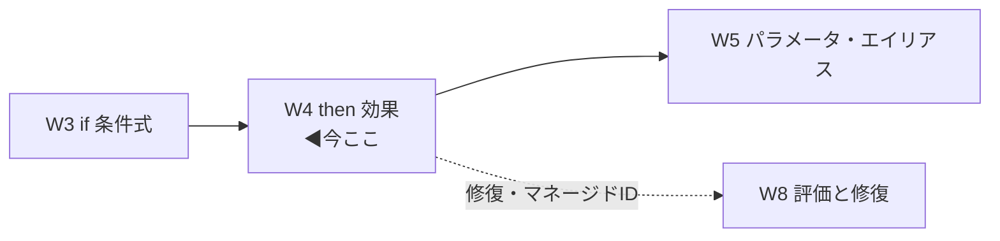
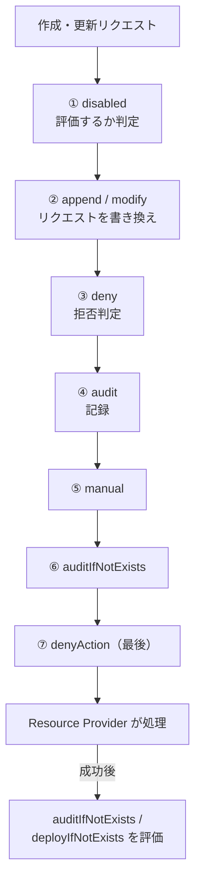
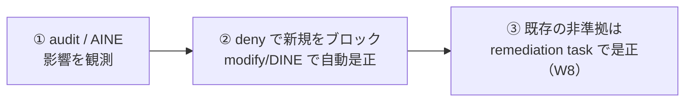

# Week 4 — 効果（`then` / effect）の深掘り：止める・記録する・直す・補うの作り分け

> **Phase 1d** | 学習プラン Week 4 / 10
> 学習目標：`policyRule` の `then`（効果 effect）を全種掘る。11 種の効果を「記録／ブロック／変更／デプロイ」に整理し、**評価順序**（`disabled` → `append`/`modify` → `deny` → `audit` → … → `denyAction`、そして RP 成功後に `deployIfNotExists`/`auditIfNotExists`）を理解する。`modify`・`deployIfNotExists` が要求する `then.details`（`operations`・`existenceCondition`・`roleDefinitionIds`）まで読めるようになり、「まず audit → 次に強制」の運用戦略を掴む。

---

## 0. 今週の位置づけ

W3 で `if`（どのリソースが対象か）を組み立てられるようになった。今週はその対になる **`then`（対象に何をするか）**。W1〜W3 で登場した `deny`・`audit`・`modify` を全体像の中に位置づけ、各効果の挙動と要件を掘る。



> **用語補足：RP（Resource Provider＝リソースプロバイダー）**
> Azure の各リソース種別（ストレージ、VM…）を実際に作る"担当窓口"。作成・更新リクエストは ARM を通って RP に渡る。効果の一部は **RP に渡す前**（deny/modify 等）、一部は **RP が成功した後**（DINE/AINE）に動く。この「前か後か」が評価順序の軸になる。

---

## 1. 効果の全体像 — 11 種を 4 グループで捉える

公式がサポートする効果は現在 11 種（出典：[Effect basics](https://learn.microsoft.com/en-us/azure/governance/policy/concepts/effect-basics)）。用途で束ねると覚えやすい。

| グループ | 効果 | 一言でいうと | 既存リソースへ |
| --- | --- | --- | --- |
| **記録（監査）** | `audit` | 違反を**記録するだけ**（止めない） | 非準拠として可視化 |
| | `auditIfNotExists`（AINE） | **関連リソースが無ければ**違反として記録 | 同上 |
| | `manual` | 人が手で準拠/非準拠を設定（証跡向け） | — |
| **ブロック** | `deny` | 違反する**作成・更新を拒否** | 拒否せず可視化のみ |
| | `denyAction` | 特定の**アクション自体を拒否**（例：削除禁止） | — |
| **変更** | `append` | リクエストに**フィールドを追記** | remediation 不可 |
| | `modify` | プロパティ/タグを**追加・置換・削除** | remediation で是正可 |
| **デプロイ** | `deployIfNotExists`（DINE） | **関連リソースが無ければ**テンプレートを配備 | remediation で是正可 |
| **特殊/その他** | `disabled` | 効果を**無効化**（評価しない） | — |
| | `addToNetworkGroup` | Virtual Network Manager のグループに追加 | — |
| | `mutate` | Resource Provider モード用の変更 | — |

> **読み方**：`audit`（監査＝記録）／`deny`（拒否）／`append`（追記）／`modify`（変更）／`deployIfNotExists`＝Deploy（配備）If Not Exists（もし無ければ）／`auditIfNotExists`＝Audit（記録）If Not Exists。**`IfNotExists` 系は「そのリソース自身」ではなく「関連する別リソースの有無」を見る**のがミソ（§3・§6）。

本週は実務頻出の 8 種（audit / auditIfNotExists / deny / denyAction / append / modify / deployIfNotExists / disabled）を掘る。`addToNetworkGroup`・`mutate` は特定機能向けなので俯瞰にとどめる。

---

## 2. 評価順序 — なぜこの順番か

複数の効果が絡むとき、Azure Policy は**決まった順序**で処理する。公式の順序は次のとおり。



公式が挙げる「順序の理由」：

- **`disabled` が最初** … そもそも評価するかを決める（無効なら以降スキップ）。
- **`append`/`modify` が次** … リクエストを**書き換える**ので、先に反映しないと後段の deny/audit が古い内容を見てしまう。「変更してから判定」。
- **`deny` は `audit` より前** … 先に拒否することで、望ましくないリソースの**二重ログ**を防ぐ。
- **`denyAction` が最後**。
- **`deployIfNotExists`／`auditIfNotExists` は RP 成功後** … これらは「作られた結果」に対して**関連リソースの有無**を見るため、RP が実際に作り終えてから走る。

> **用語補足：この順序が「暗黙の deny」（W3 §4-2）とどうつながるか**
> テンプレート関数がエラーになると評価失敗＝暗黙 deny になる、と学んだ。評価は上の順で走るので、`if` の中の関数がコケれば `deny` 段で止まる、というイメージ。順序を知っておくと、複数割り当てが重なったときの挙動（W7 の「累積で最も厳しい」）も読み解ける。

---

## 3. 記録系 — `audit` と `auditIfNotExists`（AINE）

### 3-1. `audit`

もっとも安全な効果。**違反しても止めず、コンプライアンス結果に「非準拠」と記録するだけ**。新しい定義の影響を観測する初手に使う（W1 で学んだ運用の鉄則）。

```json
"then": { "effect": "audit" }
```

### 3-2. `auditIfNotExists`（AINE）

`audit` との違いは、**「そのリソース自身」ではなく「関連する別リソースの有無・状態」を見る**点。`then.details` に「どんな関連リソースがあれば準拠とみなすか」を書く。

```json
"then": {
  "effect": "auditIfNotExists",
  "details": {
    "type": "Microsoft.Insights/diagnosticSettings",
    "existenceCondition": {
      "field": "Microsoft.Insights/diagnosticSettings/logs.enabled",
      "equals": "true"
    }
  }
}
```

「この VM に**診断設定が存在し、ログが有効**か？ 無ければ非準拠」。`existenceCondition` が真になる関連リソースが**1 つでもあれば準拠**、無ければ非準拠。

> **用語補足：`IfNotExists` 系の `details.type` と `existenceCondition`**
> - `details.type` … 「有無を確かめたい**関連リソースの型**」（例：診断設定、暗号化設定）。
> - `existenceCondition` … その関連リソースが**どんな状態なら"存在＝準拠"とみなすか**の条件（`if` と同じ文法で、関連リソース 1 個ずつに評価）。
> - 省略時は「その型が 1 つでもあれば準拠」。
> 「主役リソース（`if`）＋その付属品（`details`）」の 2 段構えで見るのが `IfNotExists` 系。

---

## 4. ブロック系 — `deny` と `denyAction`

### 4-1. `deny`

違反する**作成・更新リクエストを拒否**する。W1・W3 で見た「許可される場所」「SKU 制限」がこれ。**既存リソースは拒否できず**、非準拠として可視化されるだけ（是正は W8 の remediation）。

```json
"then": { "effect": "deny" }
```

### 4-2. `denyAction`

`deny` が「リソースが**どうあるか**」を止めるのに対し、`denyAction` は特定の**アクション（操作）そのもの**を止める。代表例は**削除の禁止**。

```json
"then": {
  "effect": "denyAction",
  "details": {
    "actionNames": [ "delete" ]
  }
}
```

> **用語補足：`deny` と `denyAction` の違い**
> - `deny`＝「この**状態**のリソースは作らせない」（例：許可外リージョンの VM）。
> - `denyAction`＝「この**操作**をさせない」（例：この RG のリソースを削除させない）。W1 の overview で触れた「重要リソースの削除防止」がこれ。「状態を止める＝deny／行為を止める＝denyAction」。

---

## 5. 変更系 — `append` と `modify`

### 5-1. `append`（追記）

リクエストに**不足しているフィールドを追記**する。シンプルだが**既存リソースは是正できない**（新規・更新時のみ）。

### 5-2. `modify`（変更）— 実務の本命

プロパティやタグを**追加・置換・削除**する。`append` と違い、**マネージド ID を使った remediation で既存リソースも是正できる**。公式も「タグを扱うなら append より modify を推奨」とする。

```json
"then": {
  "effect": "modify",
  "details": {
    "roleDefinitionIds": [
      "/providers/Microsoft.Authorization/roleDefinitions/b24988ac-6180-42a0-ab88-20f7382dd24c"
    ],
    "conflictEffect": "deny",
    "operations": [
      { "operation": "addOrReplace", "field": "tags['environment']", "value": "Test" },
      { "operation": "Remove",       "field": "tags['TempResource']" },
      { "operation": "addOrReplace", "field": "tags['Dept']", "value": "[parameters('DeptName')]" }
    ]
  }
}
```

`then.details` の中身：

| プロパティ | 必須 | 役割 |
| --- | --- | --- |
| `roleDefinitionIds` | ✅ | **remediation 用マネージド ID に与える権限**（RBAC ロール ID の配列）。タグなら Contributor / Tag Contributor 相当 |
| `operations` | ✅ | 実際の変更の配列（下記） |
| `conflictEffect` | 任意 | 複数の modify が同じプロパティを触ったとき**どちらが勝つか**（`deny`（既定）/`audit`/`disabled`） |

`operations` の各要素：

| operation | 意味 |
| --- | --- |
| `addOrReplace` | 追加。既に別の値があっても**上書き** |
| `add` | 追加（`append` に近い） |
| `remove` | 削除（**タグのみ**対応） |

- `field` … 変更対象（例 `tags['environment']`、またはエイリアス）。
- `value` … 設定値（`add`/`addOrReplace` では必須）。
- `condition` … その操作を適用する条件（任意）。

> **落とし穴：`modify` はいつスキップされるか**
> - **既存リソース**：評価サイクルでは既存を勝手に変えない。非準拠と印を付け、**remediation task（W8）**で是正する。
> - **プロパティが変更不可（not Modifiable）**：API バージョンでそのエイリアスが変更不可なら `conflictEffect` にフォールバック（`deny` なら拒否、`audit` なら通すが変更はスキップ）。→ **エイリアスを使う modify は `conflictEffect: audit` が推奨**。
> - **プロパティが payload に無い**：ネストしたプロパティの親がリクエストに無いと「意図的な省略」とみなしスキップ。
> - **タグの modify は `mode: indexed` 推奨**（対象が RG でない限り。W2 の mode を思い出す）。

> **用語補足：なぜ `modify`/`DINE` に `roleDefinitionIds` が要るのか**
> これらは「Azure が**あなたの代わりにリソースを変更/作成**する」効果。そのため Azure Policy に**マネージド ID（Azure が自動管理する実行用アカウント）**を持たせ、そのIDに**変更に必要な RBAC 権限**を与える必要がある。`roleDefinitionIds` はその「与えるべきロール」の指定。ID とロールの実際の紐づけ・remediation task は **W8** で手を動かす。

---

## 6. デプロイ系 — `deployIfNotExists`（DINE）

`auditIfNotExists`（記録するだけ）の**行動版**。関連リソースが無ければ、**ARM テンプレートを配備して自動で用意**する。「診断設定が無ければ自動で作る」「暗号化が無効なら有効化する」等。

公式例（SQL DB の透過的暗号化 TDE が無効なら有効化を配備）：

```json
"if": { "field": "type", "equals": "Microsoft.Sql/servers/databases" },
"then": {
  "effect": "deployIfNotExists",
  "details": {
    "type": "Microsoft.Sql/servers/databases/transparentDataEncryption",
    "name": "current",
    "evaluationDelay": "AfterProvisioning",
    "roleDefinitionIds": [ "/providers/Microsoft.Authorization/roleDefinitions/{roleGUID}" ],
    "existenceCondition": {
      "field": "Microsoft.Sql/transparentDataEncryption.status",
      "equals": "Enabled"
    },
    "deployment": {
      "properties": {
        "mode": "incremental",
        "template": { "...ARMテンプレート本体..." },
        "parameters": { "fullDbName": { "value": "[field('fullName')]" } }
      }
    }
  }
}
```

`then.details` の主なプロパティ：

| プロパティ | 必須 | 役割 |
| --- | --- | --- |
| `type` | ✅ | 有無を確かめる**関連リソースの型** |
| `existenceCondition` | 任意 | 「どんな状態なら"存在＝準拠"」の条件。真なら配備しない |
| `roleDefinitionIds` | ✅ | **配備用マネージド ID に与える権限**（§5 と同じ理屈） |
| `deployment` | ✅ | 配備する **ARM テンプレート一式**（`mode` と `template`） |
| `evaluationDelay` | 任意 | いつ有無を評価するか（既定 `PT10M`＝10 分。`AfterProvisioning` 等） |
| `existenceScope` / `deploymentScope` | 任意 | 探す/配備する範囲（`ResourceGroup` 既定 / `Subscription`） |

**動くタイミングが独特**：公式は「DINE は **RP が作成/更新を成功で返した後**、設定した遅延を挟んで走る」とする。だから §2 の評価順序でも「RP 成功後」に置かれる。

> **重要：DINE/modify は割り当てにマネージド ID が必須**
> 「Modify/DeployIfNotExists の割り当ては、remediation を行うために**マネージド ID を必要とする**」（公式）。評価サイクルでは既存リソースは**非準拠と印が付くだけ**で、実際に直すのは **remediation task**。この一連（ID 付与→ロール割当→修復実行）は **W8** の主題。今週は「DINE/modify は"直す/補う"効果で、そのために ID と権限が要る」まで押さえる。

---

## 7. `disabled` / `manual` と 運用戦略

- **`disabled`** … 効果を無効化し、その定義を**評価しない**。トラブル時の一時停止や、パラメータで効果を切り替える設計（W5）で使う。**どの効果とも差し替え可能**。
- **`manual`** … Azure が自動判定せず、**人が手動で準拠/非準拠を設定**する。プロセス遵守など機械で測れない統制の証跡向け。

### 運用戦略 — 「まず記録、次に強制」

W1 で触れた鉄則を、効果の言葉で具体化する。公式推奨：**`audit`/`auditIfNotExists`（記録）から始め、影響を観測してから `deny`/`modify`/`deployIfNotExists`（強制）へ**。



多くの組み込み定義は、`allowedValues` パラメータで **`audit`/`deny`/`disabled` を割り当て時に選べる**ように作られている（W5 で仕組みを学ぶ）。まず audit で当てて非準拠を洗い出し、落ち着いてから deny に上げる、という運用ができる。

---

## ハンズオン チェックリスト

- [ ] 11 種の効果を「記録／ブロック／変更／デプロイ」に分類して言えた
- [ ] 評価順序（disabled → append/modify → deny → audit → … → denyAction、RP 成功後に DINE/AINE）を図で再現できた
- [ ] `deny` と `denyAction` の違い（状態を止める／操作を止める）を説明できた
- [ ] `audit` と `auditIfNotExists` の違い（自身／関連リソースの有無）を説明できた
- [ ] `modify` の `then.details`（`roleDefinitionIds`・`operations`(add/addOrReplace/remove)・`conflictEffect`）を読めた
- [ ] Portal で組み込みの「タグをリソースに追加（Modify）」定義を開き、`operations` を確認した
- [ ] DINE/modify が**マネージド ID を要する理由**と、**既存はスキップ→remediation で是正**を理解した

---

## 自己チェック

週末にドキュメントを閉じて答えてみる。

1. **効果を用途で 4 グループに分けると？ 代表例を 1 つずつ。**
   - キーワード：記録(audit/AINE)／ブロック(deny/denyAction)／変更(append/modify)／デプロイ(DINE)
2. **評価順序を最初と最後、そして RP との前後で説明せよ。**
   - キーワード：disabled 最初 → append/modify（書き換え）→ deny（audit の前・二重ログ防止）→ … → denyAction 最後／DINE・AINE は **RP 成功後**
3. **`audit` と `auditIfNotExists` の違いは？ `details` の `type`/`existenceCondition` は何を指す？**
   - キーワード：自身の準拠／**関連リソースの有無**・type＝関連リソース型・existenceCondition＝存在とみなす条件
4. **`modify` の `operations` の 3 種と、`remove` の制限は？**
   - キーワード：add / addOrReplace（上書き）/ remove（**タグのみ**）
5. **`deny` と `denyAction` はどう違うか？**
   - キーワード：deny＝**状態**を止める／denyAction＝**操作（例 delete）**を止める
6. **`modify`/`deployIfNotExists` に `roleDefinitionIds`（とマネージド ID）が要るのはなぜ？ 既存リソースはどう直す？**
   - キーワード：Azure が代理で変更/配備するため／既存は非準拠の印だけ→**remediation task（W8）**で是正

---

## 次週の予告（Week 5）

W4 までで `if`（条件）と `then`（効果）を読み書きできるようになった。W5 では、両者に何度も顔を出した **`parameters`（パラメータ）**と **エイリアス（alias）**を深掘りする。パラメータの `type`/`allowedValues`/`defaultValue`/`strongType`、割り当て時に値を差し込む仕組み、そして「共通 field で届かない深いプロパティ」を指す**エイリアスの探し方**（`az provider`／Resource Graph／Portal）と、**`[*]` 配列エイリアス × `count`** の正確な意味まで。W3 で保留した配列の話をここで回収する。
