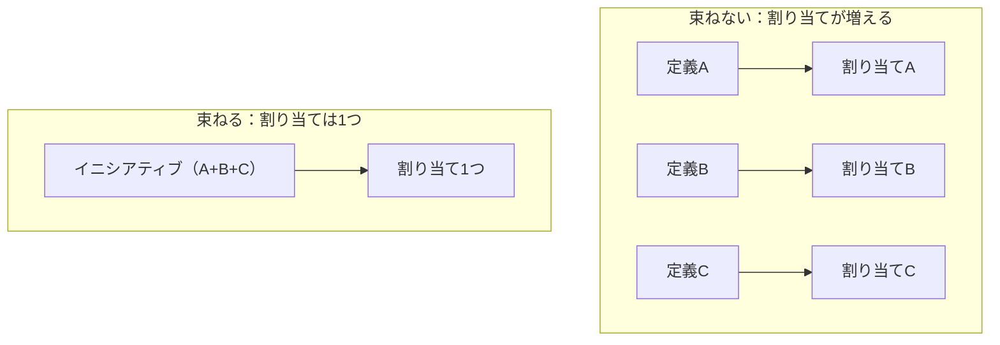
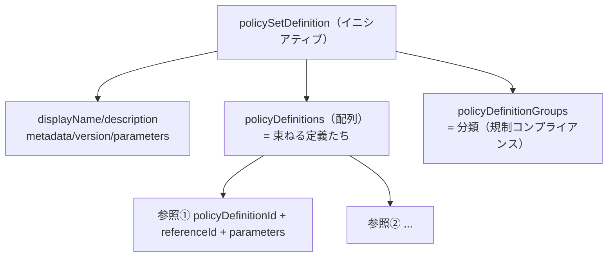
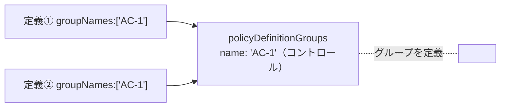

# Week 6 — イニシアティブ（policySet / ポリシーセット）：複数の定義を 1 つに束ねて管理する

> **Phase 2a** | 学習プラン Week 6 / 10
> 学習目標：複数のポリシー定義を束ねる **イニシアティブ（policySet）**を理解する。`policyDefinitions` 配列・`policyDefinitionReferenceId`・`policyDefinitionGroups`、そして**イニシアティブのパラメータを各ポリシーへ引き回す**仕組みを読み書きできるようになる。規制コンプライアンス系の**組み込みイニシアティブ**の位置づけと、「なぜ 1 個ずつでなく束ねて割り当てるのか」を掴む。

---

## 0. 今週の位置づけ

W2〜W5 で「1 個のポリシー定義」を隅々まで読めるようになった。今週からは**フェーズ 2（束ねて運用する）**。実務では定義を 1 個ずつ割り当てるのではなく、**関連する定義をまとめた"束"＝イニシアティブ**を割り当てる。


> **用語補足：イニシアティブ（initiative）と policySet の呼び名**
> 「イニシアティブ（initiative）＝ initiative（構想・取り組み）」は Portal 用語。**SDK（Azure CLI/PowerShell）や JSON では `policySet`（ポリシーセット）**と呼ぶ（`Microsoft.Authorization/policySetDefinitions`）。**同じものの別名**。「複数のポリシー定義をひとまとめにした集合」という意味。

---

## 1. なぜ束ねるのか — 割り当て管理を軽くする

公式の狙いは明快：**「グループを 1 つの item として扱えるので、割り当てと管理が簡単になる」**。例として「タグ付け系の定義をまとめて 1 つのイニシアティブにする」。1 個ずつ割り当てる代わりに、イニシアティブを 1 回割り当てるだけで全部効く。



W1 の overview でも推奨されていた：**「たとえ定義が 1 個でも、イニシアティブを作って割り当てよ」**。後から定義を足すとき、**イニシアティブに定義を追加するだけ**で、割り当ての数を増やさずに済む（＝管理対象が増えない）。

> 上限の参考（W2 の最大数表）：1 スコープあたりイニシアティブは 200、1 イニシアティブに含められるポリシーは 1000。

---

## 2. イニシアティブ定義の骨格

イニシアティブも JSON で書く。骨格はポリシー定義に似ているが、**`policyRule`（if/then）が無く、代わりに `policyDefinitions`（束ねる定義の配列）がある**のが最大の違い。

| 要素 | 役割 | 対応する単体定義 |
| --- | --- | --- |
| `displayName` / `description` | 表示名・説明 | 同じ |
| `metadata` | `category`・`version` 等 | 同じ |
| `version` | `{Major}.{Minor}.{Patch}` | 同じ |
| `parameters` | **イニシアティブ側のパラメータ**（§4） | 似ているが引き回しが肝 |
| **`policyDefinitions`** | **束ねる定義の配列**（§3） | ★ここが新しい（if/then の代わり） |
| `policyDefinitionGroups` | 定義の**分類**（規制コンプライアンス用・§5） | 無し |



---

## 3. `policyDefinitions` 配列 — 束ねる定義たち

イニシアティブの心臓部。**既存の定義（組み込み or カスタム）を"参照"して並べる**。各要素のプロパティ：

| プロパティ | 必須 | 役割 |
| --- | --- | --- |
| `policyDefinitionId` | ✅ | 含める定義の **ID**（組み込み/カスタム） |
| `policyDefinitionReferenceId` | 任意 | このイニシアティブ内での**短い呼び名**（識別札） |
| `parameters` | 任意 | **イニシアティブのパラメータを、その定義のパラメータへ渡す**（§4） |
| `definitionVersion` | 任意 | 参照する組み込み定義の**バージョン**（例 `1.2.*`。省略時は割り当て時点の最新メジャー） |
| `groupNames` | 任意 | この定義が属する**グループ名**（§5 と紐づく） |

> **用語補足：`policyDefinitionId`（実体）と `policyDefinitionReferenceId`（呼び名）の違い**
> - `policyDefinitionId`＝参照する定義の**正式な ID**（`/providers/Microsoft.Authorization/policyDefinitions/<GUID>`）。「どの定義か」を指す。
> - `policyDefinitionReferenceId`＝**このイニシアティブの中だけで通じるあだ名**（例 `allowedLocationsSQL`）。同じ定義を**別パラメータで 2 回含める**ときの区別や、コンプライアンス結果での識別に使う。W4 の `policy()` 関数が返す `definitionReferenceId` もこれ。
>
> 「ID は本名、referenceId はこの束の中でのニックネーム」。

**同じ定義を複数回含められる。** 公式の「Billing Tags Policy」例は、**同じタグ付け定義 2 種**を `costCenter` 用と `productName` 用で**計 4 回**参照している（`tagName` を変えて再利用）。1 定義を使い回す（W5）のイニシアティブ版。

---

## 4. パラメータの引き回し — イニシアティブ → 各定義

イニシアティブの最重要テクニック。**割り当てる人はイニシアティブのパラメータに 1 回値を入れるだけ**で、それが**中の複数の定義に配られる**。

```json
"parameters": {
  "init_allowedLocations": {
    "type": "array",
    "metadata": { "displayName": "Allowed locations", "strongType": "location" },
    "defaultValue": [ "westus2" ]
  }
},
"policyDefinitions": [
  {
    "policyDefinitionId": ".../policyDefinitions/<SQL定義>",
    "policyDefinitionReferenceId": "allowedLocationsSQL",
    "parameters": { "sql_locations": { "value": "[parameters('init_allowedLocations')]" } }
  },
  {
    "policyDefinitionId": ".../policyDefinitions/<VM定義>",
    "policyDefinitionReferenceId": "allowedLocationsVMs",
    "parameters": { "vm_locations": { "value": "[parameters('init_allowedLocations')]" } }
  }
]
```

- イニシアティブ側に **`init_allowedLocations`** を 1 つ定義。
- 各定義の `parameters` で、その定義固有のパラメータ（`sql_locations` / `vm_locations`）に **`[parameters('init_allowedLocations')]`** を渡す。
- 結果：**割り当てで地域を 1 回選ぶ → SQL 定義にも VM 定義にも同じ地域が渡る。**

```mermaid
flowchart TD
    A["割り当て：init_allowedLocations = Japan East"] --> I["イニシアティブ parameters"]
    I -->|value: parameters('init_allowedLocations')| S["SQL定義の sql_locations"]
    I -->|value: parameters('init_allowedLocations')| V["VM定義の vm_locations"]
```

> **用語補足：名前を変えてよい（変えると読みやすい）**
> イニシアティブ側 `init_allowedLocations` と、定義側 `sql_locations`/`vm_locations` は**名前が違ってよい**。公式も「イニシアティブと定義で別名にするとコードが読みやすい」とする。`init_` を付けるとどちらのパラメータか一目で分かる。

> **落とし穴：割り当て後はイニシアティブのパラメータを変えられない**
> 公式注記：「イニシアティブを割り当てた後、**イニシアティブレベルのパラメータは変更できない**」。だから **`defaultValue` を設定しておくのが推奨**（W5 と同じ精神）。

---

## 5. `policyDefinitionGroups` — 分類（規制コンプライアンス）

`policyDefinitionGroups` は、束ねた定義を**グループに分類**するための配列。主に **規制コンプライアンス（Regulatory Compliance）**機能が、定義を **コントロール（control）**や **コンプライアンスドメイン**にまとめて表示するのに使う。

| プロパティ | 役割 |
| --- | --- |
| `name`（必須） | グループの短い名前。`policyDefinitions` の `groupNames` から参照される |
| `category` | グループが属する階層（規制コンプライアンスでは**コンプライアンスドメイン**） |
| `displayName` | Portal 表示名 |
| `description` | グループの説明 |
| `additionalMetadataId` | 各コントロールの詳細情報（`policyMetadata`）の場所 |

紐づきは「`policyDefinitionGroups` でグループを**定義**し、各 `policyDefinitions` の **`groupNames`** でそのグループに**所属させる**」という関係。



> **用語補足：規制コンプライアンス（Regulatory Compliance）とは**
> ISO 27001、PCI-DSS、NIST SP 800-53 のような**外部の規制・標準**への準拠状況を、Azure Policy のイニシアティブとして可視化する機能。各標準の**コントロール**（統制項目）ごとに関連ポリシーを束ね、準拠率を見せる。W2 で触れた `policyType: Static`（Microsoft managed）の定義がここで効く。`category` は必ず `Regulatory Compliance` にする決まり。

> **初学者向け用語補足：`policyDefinitionGroups` の立ち位置と紐付き**
>
> `policyDefinitions` と `policyDefinitionGroups` は**役割が別のレイヤー**。ひとことで：
> - **`policyDefinitions`** ＝「実際に動く定義たち」
> - **`policyDefinitionGroups`** ＝「その定義を分類する"ラベル（棚）"の一覧」。**何も評価しない**分類ラベルの定義。
>
> **題材：規制標準の"かたち"**。ISO 27001 等は「標準 → ドメイン → コントロール」の階層を持つ。
> ```
> ISO 27001（標準 = イニシアティブ1個）
> ├─ ドメイン：アクセス制御          ← category
> │    └─ コントロール A.9.2「ユーザーアクセス管理」  ← group（統制項目）
> └─ ドメイン：暗号化
>      └─ コントロール A.10.1「暗号化の管理」
> ```
> 「A.9.2 を満たすために MFA 必須ポリシーを当てる」のように、**1 コントロールに複数のポリシー定義が対応**する。
>
> **JSON で見る 2 レイヤーと紐付き**
> ```json
> "policyDefinitionGroups": [                        // ★棚（ラベル）を定義する層
>   { "name": "ISO27001-A.9.2", "category": "アクセス制御", "displayName": "ユーザーアクセス管理" },
>   { "name": "ISO27001-A.10.1", "category": "暗号化",     "displayName": "暗号化の管理" }
> ],
> "policyDefinitions": [                             // ★実際に動く定義たち
>   { "policyDefinitionId": ".../<MFA必須>",   "groupNames": [ "ISO27001-A.9.2" ] },
>   { "policyDefinitionId": ".../<HTTPS必須>", "groupNames": [ "ISO27001-A.10.1" ] }
> ]
> ```
> 紐付きの正体は「定義側 `groupNames` に書いた文字列が、棚側 `name` と**同名で照合**される」だけ。
>
> **向きと多対多**
> - **向き**：ポインタは**定義側 `groupNames` → 棚側 `name`**。棚は「誰が属すか」を持たず、**各定義が「自分はこの棚」と名乗る**。
> - **多対多**：`groupNames` は配列なので **1 定義が複数コントロールに属せる**。逆に 1 コントロールに複数定義がぶら下がる。
>
> **何が嬉しいか（Portal の見え方）**：規制コンプライアンス画面が、この棚の構造どおりに準拠状況を並べる。
> ```
> ISO 27001（準拠率 72%）
> ├─ アクセス制御 → A.9.2 ユーザーアクセス管理 … MFA必須ポリシーの準拠状況
> └─ 暗号化      → A.10.1 暗号化の管理        … HTTPS必須ポリシーの準拠状況
> ```
> 監査人に「ISO のコントロール単位」で準拠を見せられる。これが存在理由。
>
> **一番大事な注意：評価には影響しない**。`policyDefinitionGroups` は**表示・集計のためのラベルにすぎず**、付けても外しても各ポリシーの準拠/非準拠は変わらない。自作のふつうのイニシアティブ（タグ付け等）では**省略してよい**。規制コンプライアンス系の組み込み（`policyType: Static`）でだけ作り込まれている。
>
> **たとえ**：`policyDefinitions`＝「実際に働く社員」、`policyDefinitionGroups`＝「組織図の部署名」。部署に割り振っても仕事内容は変わらないが、**"部署ごとの成績"として集計・報告**できる。`groupNames` は各社員の「所属部署の記入欄」。

---

## 6. 組み込みイニシアティブ — 代表例

Microsoft は多数のイニシアティブを組み込みで提供する。代表的なもの：

| 組み込みイニシアティブ | 中身 |
| --- | --- |
| **Microsoft Cloud Security Benchmark** | Microsoft 推奨のセキュリティ基準を束ねた既定のセット（Defender for Cloud が既定で使う） |
| **NIST SP 800-53** / **ISO 27001** / **PCI DSS** 等 | 各規制標準に対応するコントロール群（規制コンプライアンス） |
| **タグ付け系** | costCenter / productName などの一括タグ付け |

> **用語補足：Microsoft Defender for Cloud との関係**
> W1・W4 で触れた Defender for Cloud は、内部で **Microsoft Cloud Security Benchmark イニシアティブ**を使って「セキュリティ推奨事項の準拠状況」を測っている。つまり Defender の画面で見る"セキュリティスコア"の裏側は Azure Policy のイニシアティブ。イニシアティブは Azure ガバナンスの共通土台になっている。

まず組み込みイニシアティブを割り当てて全体像を掴み、足りないものをカスタム定義で足す、という進め方が実務的。

---

## 7. 単体定義との対応整理

| 観点 | 単体ポリシー定義（W2〜W5） | イニシアティブ（W6） |
| --- | --- | --- |
| 中身 | `policyRule`（if/then） | `policyDefinitions`（定義の配列） |
| パラメータ | ルールが参照 | **各定義へ引き回す** |
| 分類 | `metadata.category` | ＋ `policyDefinitionGroups` |
| 置き場所 | MG / サブスク | 同じ（W2） |
| 割り当て | できる | できる（**実務はこちらを推奨**） |
| policyType | Builtin/Custom/Static | 同じ |

---

## ハンズオン チェックリスト

- [ ] イニシアティブ＝policySet で「複数定義の束」だと言えた
- [ ] イニシアティブ定義に `policyRule` が無く `policyDefinitions` 配列がある、という違いを指させた
- [ ] `policyDefinitionId`（本名）と `policyDefinitionReferenceId`（あだ名）の違いを説明できた
- [ ] イニシアティブの `parameters` を各定義へ `[parameters('...')]` で引き回す形を書けた
- [ ] 「割り当て後はイニシアティブのパラメータを変えられない → `defaultValue` 推奨」を理解した
- [ ] Portal で組み込みイニシアティブ（例：Microsoft Cloud Security Benchmark）の定義一覧を眺めた
- [ ] `policyDefinitionGroups` と `groupNames` の紐づき（規制コンプライアンス）を説明できた

---

## 自己チェック

週末にドキュメントを閉じて答えてみる。

1. **イニシアティブは何で、なぜ使うのか？ 別名は？**
   - キーワード：複数定義の**束**（policySet）／割り当て・管理を 1 item に／定義が 1 個でも束ねる推奨
2. **イニシアティブ定義が単体定義と決定的に違う点は？**
   - キーワード：`policyRule`(if/then) が無い／代わりに **`policyDefinitions` 配列**
3. **`policyDefinitionId` と `policyDefinitionReferenceId` の違いは？**
   - キーワード：ID＝本名（どの定義か）／referenceId＝**束の中のあだ名**（同一定義の複数回参照・結果の識別）
4. **イニシアティブのパラメータを各定義に渡す書き方は？ 割り当て後に変えられるか？**
   - キーワード：定義の `parameters` に `[parameters('init_...')]`／**割り当て後は変更不可**・`defaultValue` 推奨
5. **`policyDefinitionGroups` は何のためにあるか？ どう紐づくか？**
   - キーワード：定義の**分類**（規制コンプライアンスのコントロール）／`groupNames` で所属
6. **Microsoft Cloud Security Benchmark と Defender for Cloud の関係は？**
   - キーワード：Defender が内部でこの**組み込みイニシアティブ**を使い準拠を測る

---

## 次週の予告（Week 7）

W6 までで「何を（定義）・どう束ねるか（イニシアティブ）」が揃った。W7 では、それを**どこに効かせるか＝割り当て（assignment）とスコープ**を深掘りする。管理グループ／サブスクリプション／リソースグループの**階層と継承**、`notScopes`（除外）、`enforcementMode`（`Default` vs `DoNotEnforce`＝W3 で予告した"効果を出さず評価だけ"）、`overrides`（効果の上書き）・`resourceSelectors`（段階的ロールアウト）、そして割り当てに付く **identity**（W4 の DINE/modify 用マネージド ID）。「定義の置き場所」と「割り当てスコープ」の違い（W2）もここで完結する。
